# The Boy

A world with infinite fluffy clouds spanning its entire surface, floating above an infinite pool of water stretching to uncertain depths. A boy in a metallic armor-like diving suit, with headlights guiding his way in this forever-pitch-dark ocean, shot an anchor at the floor, tugging him along to a sunken giant bark. A metallic box placed atop it was his target. He attached a magnetic mechanism to the box, to which, like hot-air balloon, air filled the leather ballast, floating the crate with it. He hitch a ride, floating towards an anchor. Soon, he would attach the crate to the anchor, climbed above a circular ring with metallic grate attached to the anchor, scanned the surrounding, switched off his headlight, before pressing the button to pull them up. 

At full height, the anchor swung around and dropped the crate and him on a floating island of greenish muscular surface. He jumped down and took off his helmet. "Haaa!" This a boy of slightly brown skin, around age 12 with short black hair. He detached the anchor while complaining, "We really do need to buy ourselves a new depth probe... The ping was off by 150 peds to the east. That's not gonna fly!" 

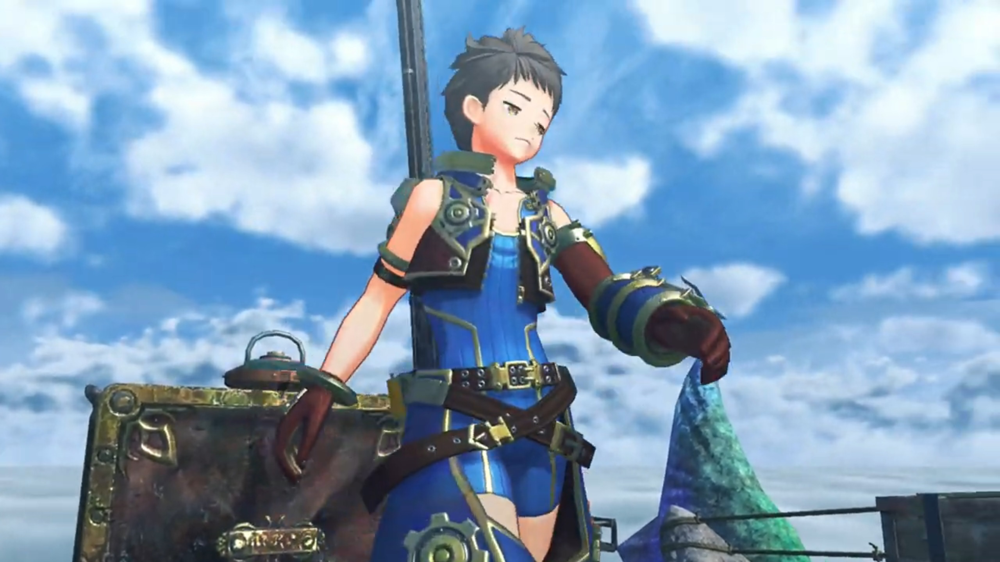

On the little 'island' were also some potted plants, some line to hang clothes, a small cabin, and some barrels, plus other small objects.

"And what about the treasure, **Rex**? Was it in line with your expectations?"

Rex found a metallic bar, the head a curved thongs, useful to unbar the crate, while answering, "It seemed pretty solid. Didn't even have to reinforce it too much. **Even with the labor costs,** we should be able to turn a decent profit." Now where's the weak point? 

"Honestly, it takes you two days to run the structural analysis... Yet somehow you can gauge the profits in an instant?" The 'island' itself was speaking, flung its head to look at Rex on its back. Green fluffy feathers grew along its neck, a stony-like head with purple-ish plates, and a horn. 

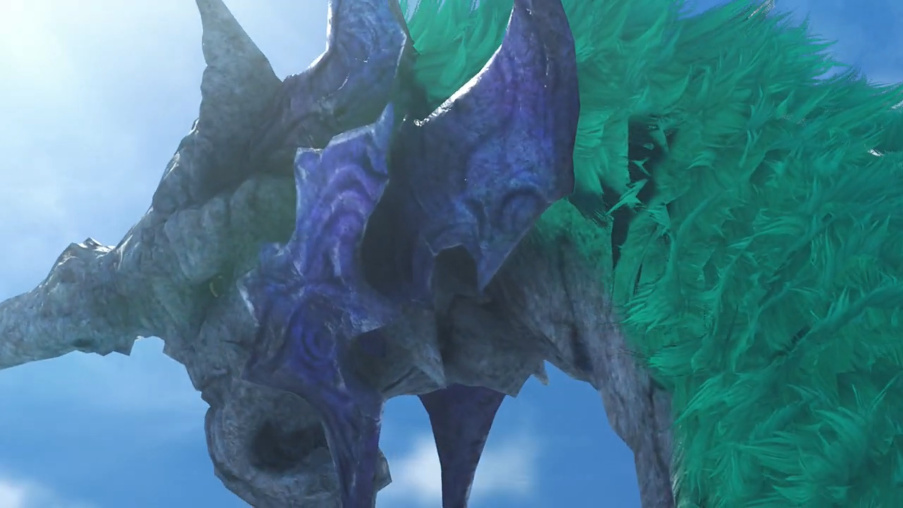

"Don't go rainin' on my parade, **Gramps.** You know I'm in the salvaging trade- for- the- **cash!**" He stuck the thongs into the crevices, tugged it along, speaking with difficulty while exerting forces, "A little business **sense**... goes a long **way, all... right?**" 

There finally it budged. "**Whoa!**" Water sprayed out of the box and knocked him backwards. Alas, his treasure sense did indeed brought back a treasure monster -- a blue lobster that doesn't look at all friendly. "**I didn't expect THAT! You been living** in this thing, big guy?"

For someone whom was woken up from its beautiful dreams, it showed no mercy to its new enemy. 

"Rex!"

"No worries, Gramps!" The monster was dumbstruck for a moment{{footnote: Because the director wanted it to.}}, ran into his cabin and fetched his sword before facing down the monster, commenting, "I think we know what's for lunch!"

---

Rex narrated, "An entire horizon of white. A sea of clouds, and at its heart, the World Tree, piercing the heavens... This... This is the world we call home... Alrest." And the lobster's claw now above a stove, roasting. 

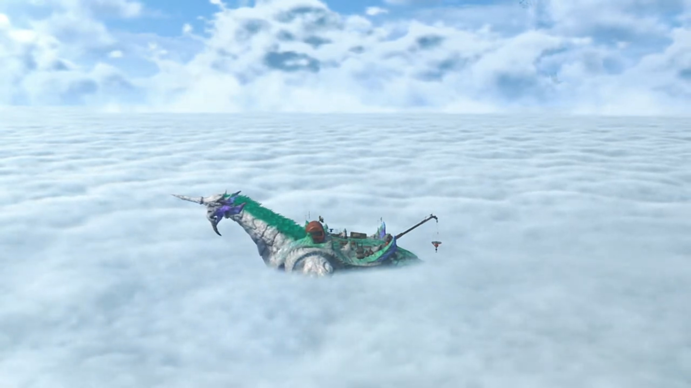

"Story goes that when the world was young... Everyone in Alrest lived on the Tree, together with our divine father, the **Architect**. According to the tales, it was a bountiful land. And the people there held the power to command even the heavens themselves. They called that _paradise..._ 'Elysium'. But then, one day... we were cast out. Nobody knows why. Perhaps we angered our creator, or perhaps it was something else **entirely**..." 

While waiting for it to cook, he searched the crate for anything profitable. Those unwanted rubbish were lowered down with the crate back into the ocean. {{footnote: 落叶归根}} He dumped the materials in the bin, and opened up the cabin roof for the warming sun to shine in. 

"All we know is we were forced to leave Elysium to live here, in Alrest. Where it turns out, life was pretty hard. But when it seemed like we would surely die out, the Architect... took pity on us... sending his servants, the Titans, to save us. The few of us who survived... settled on the Titans... and, we've lived in harmony with them ever since. But now, those Titans... are beginning to die out."

He sat down on the crusty red-hot roasted lobster pincher, ready to eat. 

"Aarrrrggghhhh... The brazier does my weary old bones much good..."{{footnote: Imagine putting some heat over some part of your body to warm it up. How does that feel? Or going to a sauna?}}

"You want me to move it, Gramps?"

"No, that's quite all right. Leave it right there... _aaaaahhhhhh_..."

"Righto." 

They were enjoying when they heard a whale-song-like tone echoing from the distance. Alarms beeped within his forehead; in awe, he stood up and went and look at the direction. A Titan whale leaped above the cloud sea, its body disintegrating. The light-blue crystal on its chest that gave its life shone bright for the final time{{footnote: 回光返照}}, before dying out. The stony Titan crashed into the ocean, sunk down into seabed, its existence no more. Wave shook Gramps, Rex held on tight. But nothing felt more sad at the moment than to see a Titan fall{{footnote: 陨落}} before their eyes. Even his tone died down. "Not another one... Been happenin' a lot lately..."

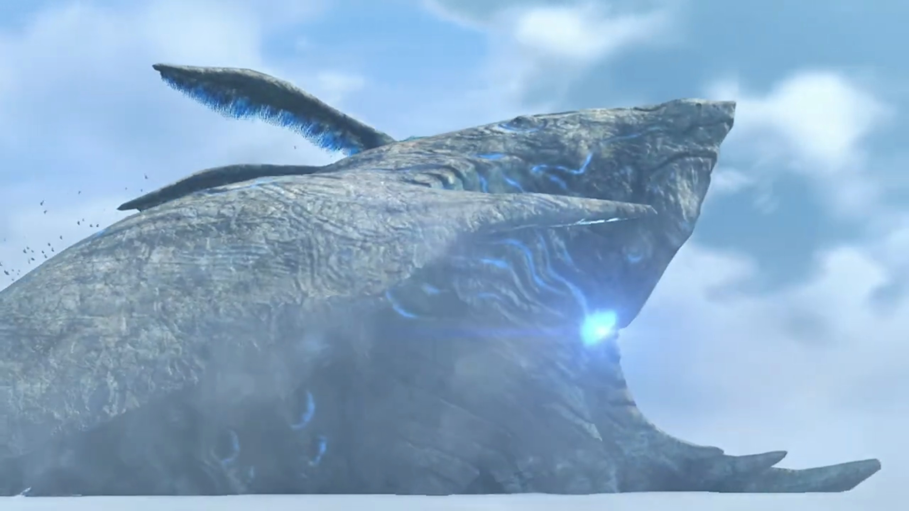

"Mm... More so than before."

"I wonder... if anyone was living there."

"I-it seems not. And if there had been, they would have all left by now."

"Makes sense." But no, that does not provide relief. Where are they to live at this rate? "Hey, Gramps, d'you think... Fonsett Village will be gone **too** one day?"

"It would not be today, or tomorrow, but one day, _yes, it will fall..._"

"And you too?"

"That's how it goes with us Titans... There's- no- way- around it."

"Eventually... there'll be nowhere left to live."

"_Sadly..._"

And their hope? The single bark with its root deep underwater, the bark stretched high atop the sky, a giant umbrella at the very top with very little branches just below, and none further down. "So... You Titans were born up there, is that right?"

"So they say, for what it's worth." He swung his head around, looked at the tree, and added, "Mind you, I was born here, on Alrest. As for my ancestors, who could say, where they were born..."

"Can it **really** exist? This Elysium? And the creator, who's said to live there..." He needed confirmation, but no one could give him such. Though he can hope for. 

"A land of plenty, atop the World Tree... If such a place did exist, perhaps we could all live in peace... with no need for fighting."

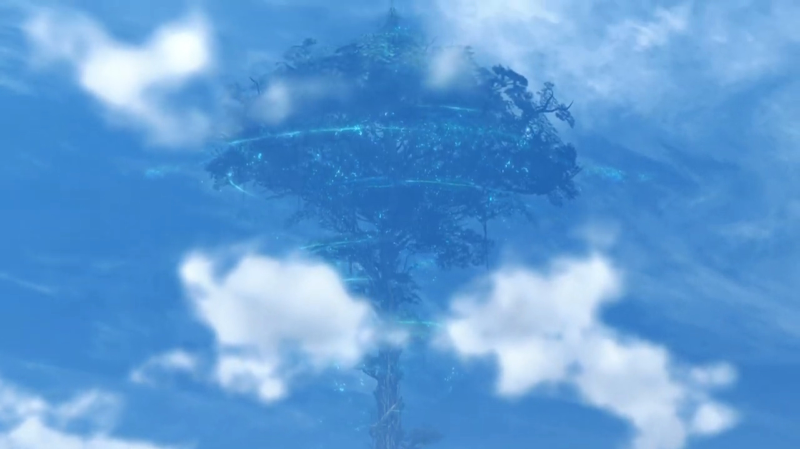

"Sure would be great." Except it's too far away. "For everyone... even folks in Fonsett. If the divine Architect can see us now, I wonder what he thinks..." 

---

Whatever worries for the greater all you have, they could do nothing to prevent Titans from dying. Some stretches and slaps on both side of one's face wakes one up to the present moment. "**All right!** Back to making money!" He checked the dustbin, suggested, "**I think** this haul should be enough for today. **Oi, Gramps!** Care for a little swim to the Argentum Trade Guild?"

"**You're planning** on selling it now? Urgh... It's getting toward _my bedtime..._"

"Don't play the lazy old man with me. There's **plenty of sunshine** left!"

"_Kids these days... **No** respect, I swear..._"

---

> **Translator's note on environment:** Bazaar lined the sides of the rights of way inside a giant hall. People were walking, looking, trading; merchants were usually Nopons. The decorative lights lured customers to visit their stores. The guild is a ship strapped to a giant floating puffer-fish-like Titan, with smaller size puffer fish also strapped below it as extra force. This, is **Argentum Trade Guild.** 

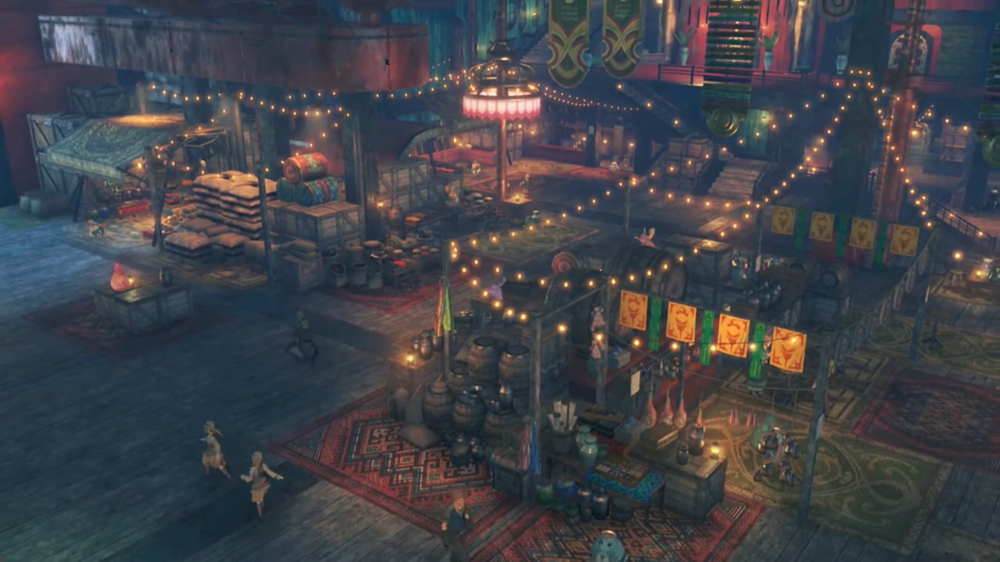

---

"Why, if it isn't Rex! How's business?" He had Gramps docked at one of the ports, unboarded himself. 

"Going all right, else I wouldn't be here."

"Fair point. So, which one am I unloading?"

"We can leave that until I'm done _negotiating_. Shouldn't be too long!"

"Well, mooring is 15 gold per half-day."

"I'll have your gold after I sell the stuff, all right? Later!" And he's gone afar. 

"**Hey, hold on! You know I can't do credit...** _Urgh, He does it every time, too..._" Then, he turned to look at Gramps. Big eyes looking at small eyes. 

"No wallet, I'm afraid..."

"Figures..." he scratched his head. He can only wait. 

---

Meanwhile, before Rex entered the guild hall, one of the ship parked at the port caught his eyes. A metallic battleship. "Awesome... This thing's huge, and it's not even a Titan ship!"

---

At one of the stores, Rex was speaking to the Nopon behind the desk. "**WHAT, THAT'S IT?!!!**"

"**Is life**, meh! This still more than I give to non-friend! If you bring **military supplies**, then you get **good price**! Ceasefire between Mor Ardain and Uraya not keep for too much longer, methinks. So weaponry is hot item!" Soldiers were shopping at other bazaars for supplies. "Well? What **friend think?** I make it worth your while!"

"I told you before, I stay away from that sorta thing."

"Ohhhh, is shame! Rex good salvager, could be good way to earn pretty penny! **Waste of talent**, if you ask me! **Anyhow, where were we?**"

"I'll take your offer. 200 now, and you know what to do with the rest."

"Okie doodles! Sending monies to, Corinne of Fonsett Village. **Is right?**"

"Yeah."

"Is beautiful thing! Sending money home at such young age. **I touched! Wish my own dum-dum** littlepon did same!"

"It's 'cos Gramps doesn't **charge rent, hehe.** All right, I'm countin' on ya!"

"**Roger! Pleasure doing business!**" He already walked away. 

---

Two human-like bodyguards of a Nopon walked down the stairs and called out, "Hello, Rex!"

"Pupunin! Been a while!"

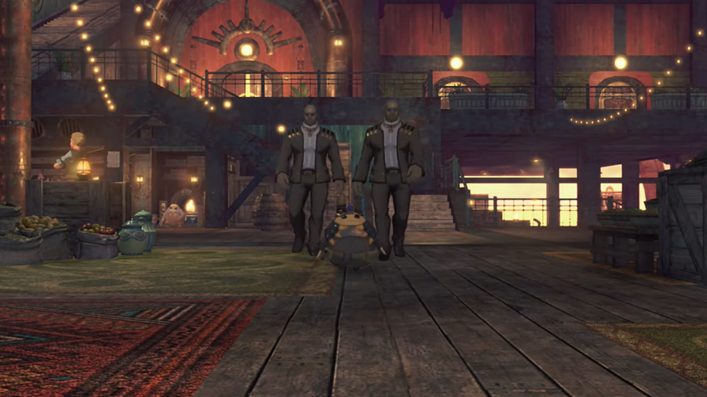

"Rex looking high spirits! Ah, no, how say... Yes, **peppy**!"

"**Been worse! So**, you got something for me? New job maybe?"

He nodded, "Mmm something like that. Ah, by the way... Rex come from Fonsett Village in Leftherian Archipelago, yes?"

"Yeah, that's right. Why d'you ask?"

"Y-you should go straight to boardroom of Chairman!"

"**Wait, what's** going on?"

"Chairman Bana, ask for Rex, by name!"

"The Chairman? **For me?!**"

---

Bana can't help but wore every luxury goods on every fingers and eyes and neck and head he could have. The hat makes him looks like a pirate, though. The Green Nopon, upon Rex entering, spoke with strong tone, "Thank you, for accepting summons! I, Bana, Chairman of Argentum Trade Guild."

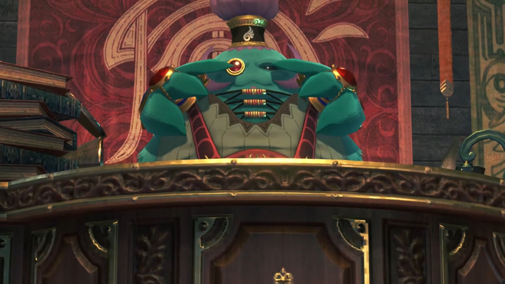

"P-pleased to make your acquaintances..." He looked to his right, found a beautiful girl that looked at him with her nostrils. To his left, another one, but less showing her 'higher-up' status. 

"Me hear from Pupunin that friend is salvager of some, renown. That being case, I have, teensy weensy thing, to ask of Rex!"

"A request straight from the Chairman?!" His own excitement and tendency to kiss the higher-ups washed over his brain, filtering out any weirdness and unfittings{{footnote: i.e. Something's not right here, but one don't know what.}} in the atmosphere. 

"Reward is, 100,000 gold."

"A hundred thousand?!"

"Friend hear right! _Actually_, **that**, just the advance. Another 100,000 provided upon _completing job._"

"**200,000 gold in total? I-I must be dreaming...** I'll do it. I hereby swear to use every skill I possess to ensure this job is successful! I promise I won't let you down! **Hahahahah!**" The measly 200 he earned, exclusive of the others sent back to the village, is nothing compared to this value. Every cell in his body wagered with excitement, holding a celebration party. 

"You agree, without even hearing **details** of job?"

"Oh, oh, right... Um... What kind of job is it?"

"You really _have skills for this?_"

"Of course, I'll be fine!"

"Meh, if you say. Here, crew will explain the task. Bring them in." Not that he could find that many willing people _fast_!

"Sir." The high-nostril woman turned around and opened the door behind her. She walked out for a while before leading them back in. First came a cat-eared girl around his age wearing orange sweaters with fair skin and some drawings on her face like those painted on ancient tribes. Beside her, her companion, a white tiger, followed her into the room. 

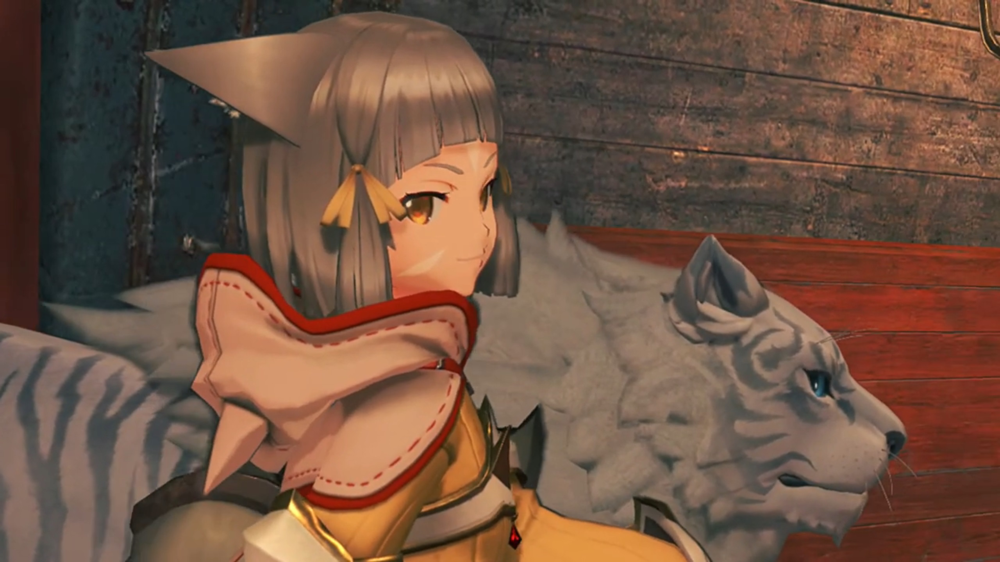

Behind her was a strict-looking guy wearing black armor with black short hair gelled up; his thick eyebrows doesn't make him look like a nice guy.

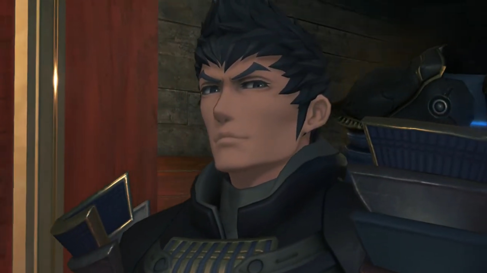

The final guy with neck-long white hair, wearing a half-mask that covered only till his nose, with a katana attached to his back. 

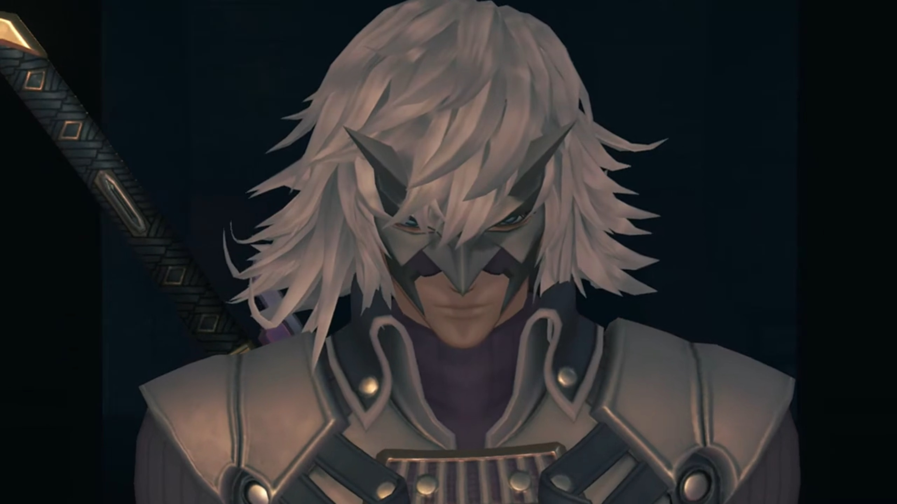

In shocking eyes, he exclaimed, "Drivers...? And... Blades?! Whoa! They look so cool!"

"So... There's something that we want to haul up." The white-haired guy got straight to the point. "There were some current shifts. It showed up in an uncharted area. But it's a looong way down."

"Nice... I like a good challenge!" He was strict, but Rex kept his optimism despite the lack of reverberations from the others. 

"Bana offered to assemble team of **veterans** _for this job._ But this crew veeery picky. They want small elite team and only from Leftheria. **That** when Bana have _stroke of genius!_ Should hire **Reeeeexxxx!!!**"

"**Hah ha!** You made the right choice!"

"Thhh... Um hmmm..." The girl couldn't help but laughed at his 'idiocy'. "A child salvager? **Jin**, don't tell me we're gonna have to hire some **babysitters** for this outing too."

"**What the hell?** You look as much like a kid as I do, lady!" Already he pointed his fingers back to her unpleasant commands. 

"At least I wouldn't **wet** myself at the promise of a measly hundred grand!"

"What're you tryin' to say?!" He walked forward as if about to pick a fight. Her tiger got between them, and out of fear he took steps backwards. How anger clouded one in forgetfulness that she's a driver. 

"Ahem... Rex, was it?" asked the tiger. "I implore you to excuse, my lady's discourtesy." It, he, bowed his head to Rex. 

"**Dromarch!** What have I told you about speaking for me? Shut your..."

"Drop it, Nia." The black-haired guy cut her off, impatient spoke, "Though I do see your point. In any case... It should be easy enough to make sure..."

"What?!" And his body grew larger in front of Rex as swords were slashing at him. Reaching the edge of Bana's table, he drew his sword and blocked the guy's; but his full force only equaled his simple one-handed press. "Ugh!" That broke his defense, but it's enough to prove his skill. "What're you playing at?!"

"Well well well..."

Nia was shocked as well, "**Malos!** What good is it beating up a kid?"

"You said it yourself, didn't you? What if the kid's not up to it?"

"I said nothing of the sort!"

"You **did think** it though, right? And anyway, now we know. You'll do right enough. Though you _don't look_ like a Driver..." He was still holding his defense, even when Malos already sheathed his weapon. "Where'd you learn those Arts?"

"Gramps showed me a thing or two. Even when I was little, that was **his** idea of playtime."

Not that he cared. "Well, you've got some skill, I'll give you that. Guts, too. **Kid**, you better work hard." He and Jin then left the room. One of the blades that looked like a monster with tails followed behind. 

"Hugh..." Whatever, she don't even look at him, walked out after them. Dromarch gave a bow before dragging along. 

Bana had headache, "**Meh-meh-MEH! Friends are such rowdy bunch!**" From his pocket, he tugged out a big sack of gold, bang it on the table. "Here is advance. **Use to buy** what gear you need, then go to dock, on starboard! Bana has arranged, excellent vessel _for you there._"

"You got it." All the excitement from such money had drowned with such dangerous a party. If he had not learned, his would have leave the room with his body dragging a line of blood behind, dumped into the infinite cloud sea below, and became feast to some passing Titans. Not that he would leave right now that he accepted. He needed the money anyways. 

### Footnotes: