# The Quest

"...and that about covers it. Alllll right, I'll see ya later! **Should** be back in a day or two. **Take it** easy, Gramps!"

"That does not 'about cover it' **in the slightest!** Why would you take a job you know nothing about? You don't even know who your employer is!"

"This came straight from the Chairman, remember? **What more do you need?**" But how trustable is the chairman, whose aim all day long is _for profit_? "**Anyway,** I'm off. You can take a nap while you wait!" And he ran off. 

"H-hey! **Come back here**, will you?! **Rex!**"

---

"Wheeling out the Maelstrom for this? Bana sure has deep pockets..." 

Nia and the others just arrived, she started quarrelling with him yet again, "Gawking at a boat? What are you, twelve? _Wait, maybe you are twelve._"

"**What's my age** got to do with anything? I can tell an awesome feat of engineering when I see one!"

"You don't close your mouth soon, you're gonna swallow a fly."

"What's her problem? We're nearly the same age. **Also, you might wanna watch** where you stand, otherwise when we cast off..." The rope to anchor the boat wrapped a circle around, and she stood within the circumference, "that rope'll take your leg off."

"**Uhhh!!!**" She jumped off, as if it was a giant beast.  

"Gotcha!"

"Why you little!"

"Now look whose mouth's hanging open." 

Malos, Jin, and the blade had no time for such kids play. 

Then, someone bald wearing salvager suit that looked like a 'standard' bodyguard approached, "Rex, we're heading out. There's no one seeing you off, right? You got night watch. Till then, rest up inside."

"Aye aye. **Later!**" And she leave the girl arguing by herself. 

"Hmph!"

---

The ship, attached to a small balloon puffer-fish-like titan on strings, leave the port for its destination. As it took off, the boat leave contact with the cloud sea below, soared along the skies. 

> **Translator's note on environment:** The ship had ladders up the top rung for lookout. A door at the deck leads to the cabin. The exterior had nothing too fancy about, neither do the interior; built for survival. Though, water leaking from the top doesn't make it look too sturdy. This is **C.S.E.V. Maelstrom**.{{footnote: Not sure what C.S.E.V. stands for, though.}}

---

Rex was at the top rung for night watch. The platform was not too small, perhaps 1 meter by 1 meter. A lantern was attached to one side of the fence. He looked through a binocular. Scanned right, until he saw one object in the distance. 

"That's the black ship from the harbor. Is it... following us?" But before he could analyze the situation deeper, someone called out from behind, 

"Ugh, it's waaaaay too cold up here." He turned around and found Nia. Her tiger wasn't seen anywhere near her. 

"**You!**"

"I'll have you know I've got a name. It's Nia. They've started boozin' below decks. You should join 'em."

"Why aren't you there?"

She turned her back towards him, "It's not that _I hate it_, I just... really don't need a headache right now."

"**Huh!** Good thing you're not a salvager, then."

She took a step towards him, "Why's that?"

"Swim like a fish, and drink like one too. That's the Salvager's Code."

"**Ugh**, sounds terrible. I don't think I'll be changing careers..."

"**Hmm... Probably** for the best. **Anyway**, I bet you **Drivers** earn a **hell** of a lot more than **salvagers** do!"

"So kid..."

"My name's Rex."

"_Hmph_, OK, Rex. Why did you start salvaging in the first place?"{{footnote: It's wonderful, how conversations could start with mocking but recede into something deeper beneath the surface.}}

"That there." A spiral of circles glowing bright green in the night, like nebula clouds spiraling around its center. 

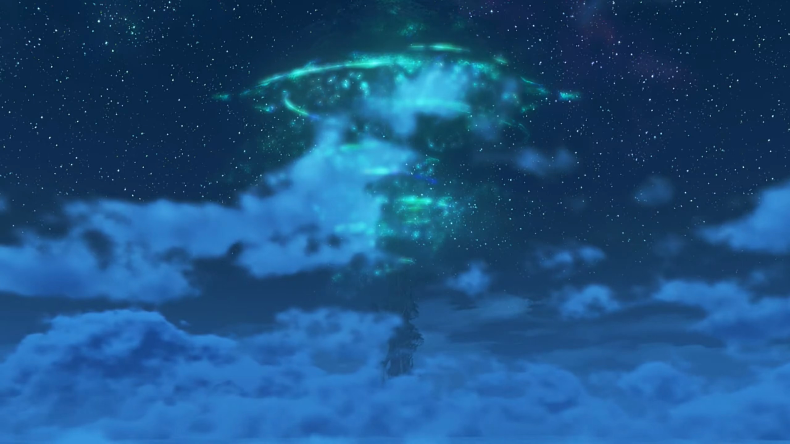

"The... World Tree? I don't get it."

"You know, you find all sorts of things digging through salvage... Some of it trash, some of it treasure... but **all** of it from people long gone. **Have you noticed** how there's fewer Titans each day? I saw one go under just the other day. It was a pretty big one. There must have been loads of animals still living on it... Living space is running out... day by day. Sooner or later, we'll be the ones **sinking** down into the Cloud Sea. But up there, _Elysium is waiting for us._"

"**Pff Bwahahahahahahha!!!** Seriously kid? 'Elysium'? Don't tell me you believe that guff! So that's, uh... why you're a salvager? **It's just a lie for children,** and that there is just an overgrown shrub!"

"**IF there's a way** to get up there, maybe it's hidden below the clouds. Is it **really** that crazy?"

"Seriously though..."

"There'd be no need to fight over dwindling land and resources... No need to **worry** about our **homes** sinking away... **Everyone** could have peace and security. I mean, a dream like that... isn't that worth believing in?"

"Nobody can tell you what to believe, _but... Ahem..._ 'Everyone', huh...?"

"What?"

"I always thought, people were pretty selfish by nature. But you..."

"Huh?"

"D'you have parents?"

"Nope. When I ask Gramps, he told me they died when I was just a kid."

"**'Gramps'...** _Oh, the same one who taught you to use Arts?_" she recalled. 

"**Yeah!** He basically **raised** me himself. He's not like us, though."

"N-not like?..." She walked to the edge of the fence, where Rex were already looking out at the sea. He turned to look at her, and she continued, "I'm not sure I catch your drift, but this Gramps of yours sounds all right."

"Huh..."

"And you're all right too, kid." No objections on not using names. She added, "Not that different from me."

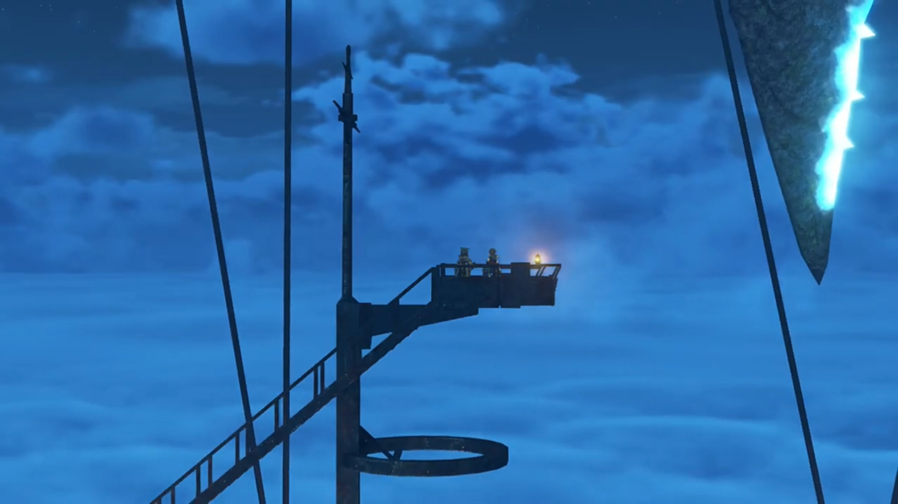

---

Thunder and storms raging hard in this region. Braving the location was shaky. Some crew member called out, "We are in position. All personnel, report to stations."

That woke Rex from his nap. He continued to listen. 

"Salvage team, suit up, and proceed to hatch."

He took his helmet and found the bodyguard crew member giving him (and his fellow other salvagers, including Nopon salvagers, all dressed up) instructions, "Your target is located, **inside** a shipwreck 450 peds straight down. Searching the wreck while submerged is too high-risk for our tastes, so... we'll be using flotation devices and cranes to lift the hull first. **Next**, you'll split into **teams**, and explore the **interior. Once the target is found, retrieval can commence.** If that's **clear**, let's begin with attaching the floats. Get- into position!"

Up there, Nia shouted while the salvagers were leaving for their jobs, "**We're paying you lowlifes a lot, so don't screw it up!**"

Rex complaint lowly, "_You smug so-and-so..._"

The ship opened itself up, allowing them to exit and reached for a metallic netted platform attached to the anchor that could be lowered down. 

"And submerge." The bodyguard whom followed behind them gave instruction. One by one, they jumped off into the dark waters below. 

---

So dark even two headlights cannot sufficiently illuminate their vicinity. But his eyes were trained from years of salvaging. "Is that it?" He got closer to take a look at it, commented, "It looks pretty ancient... Is that the... propulsion mechanism? **I've never seen one** that shape before... Which country made this?"{{footnote: While he could see the dark in the dark, we couldn't. Just like camera taking photo in dark room is pitch black, your iris, however, would see not pitch black, but dilating your pupils to allow more light in, you can see the shapes with whatever little light reflection it can get. Only in totally dark room without any light do your eyes failed to make out the shapes and sizes of objects.}}

He worked his way attaching the magnetic balloons, together with other salvagers, before swimming back up. Huge balloons were pumped up underwater, bringing the whole ship up with it. The storms continued raging as the sunken ship float to the surface. 

Nia gaped, "Whoa, that's massive!"

Malos noted, "The appearance matches our reports... _But it's what inside that matters_."

The bodyguard gave instruction in the background. "Object is secure. Proceed to second phase." The three turned around for that. 

---

Rex waited for Nia and the others to approach him. She praised, "Excellent work! You're not half bad, you know that?"

"I do this for a living, remember?"

"**All teams, Proceed. Inside. When ready!**" That's the bodyguard giving instruction again. 

Malos: "Right then, let's get moving."

As they walked, Jin turned around, instructed Rex, "You with us."

"Me?"

Nia was surprised, "You're gonna drag the kid along? Seriously?!"

Malos tried to let her guards down, not to think too much _yet_, "Guess he thinks you need all the help you can get."

"**Oi!!**"

"**Gahahaha!!**"

"Omph!" She could only jump feet at his rudeness. The only person left suffered, "**Well? Don't just stand there! You've got your orders, haven't you?**" Leaving without a word. 

> **Translator note on environment:** The whole ship is tarred black; and it camouflaged into the thunderstorm atmosphere. Nothing could be seen from such surface therefore. This, is the **Ancient Ship.** 

---

As they were walking toward the entrance into the cabin underneath, something was punching on the door. They stopped to prepare for eventualities. A creature came crawling out after smashing the door open.

"Whoa!"

Nia: "Let me show you what a Driver can do!"

---

The monster disappeared and left no trace after being killed. "**Amazing!**"

"So that's how Drivers and Blades fight..." another salvagers exclaimed. 

"So ruthless... It's like they're monsters themselves." commented the 3rd salvager. Nia eyed on them, and they walked away, presumably back to their job. 

Rex then commented, "Nice! I'm sure glad these Drivers are on our side! You too, Dromarch!" Dromarch acknowledged. 

Nia brushed it off, "No need to get hysterical, it was a walk in the park..."

"Yeah, but still..."

Malos and Jin had already walked in front, the former shouted back at them, "**That's enough yapping, you pair of brats. Let's MOVE!!!**"

Nia: "Tch... Talk about self-important."

"Gramps always taught me to respect my elders..."

"_Elders...?_" 

Both: "**BWAAHAHHAHAHAH!!!**" Dromarch had to rub off their saliva splatting on his face. 

Nobody noticed that Pupunin had also sneaked behind, aboard the ancient ship, hiding behind some crates. The dark sure helped his concealment. 

---

Back in the Argentum Trade Guild, Bana was watching through Pupunin's point of view the live situation on the ship on a mirror that displays, commented, "They make **short work** of monster. These no **ordinary** fighters. **Big job in Mor Ardain going well too...** There much **money to be made from these people! Ohohahahahahahahah!!!**"

---

The interior of the ship wasn't barren; there was an alligator-like salamander with sharp razor teeth and two-legged blocking their way. 

Malos: "Not planning on letting us past, huh? Sounds like a challenge."

---

Bringing it down, Malos called, "Jin, check this out. There it is. Addam's crest." It's ensigned on the door, sealing it. 

Rex was curious, "'Addam's... crest'? What does that mean?"

Jin had no obligation to answer, instructed, "You. Open this door."

"Me?"

"**This door**, will only open to one of **you** people."

"One of **me**? What're you talking about?"

Malos was impatient: "**HURRY UP AND DO IT!** We're not paying you to ask dumb questions!"

"What the **hell?** You can't treat hired hands like that..." But anyways, he turned around and walked towards the door. Looking at it, he scratched his head and asked himself, "Now, how do we open this thing?" He tried to search for any holes for keys, or weak points which he could break it open. No avail. Looking back at the crest, "Oh, hey..." He tried touching it. Blue light shone and it opened itself. "So that was a release toggle..."

White fog shrouded their vision. Rex tried walking in first. Electric sparkles beneath his feet, but did not trigger. 

Malos: "Just as I thought..." Nia ran after him, but Jin called out, 

"**Wait!**" Both turned around to see what he got to say. "There. Open that door too." Rex nodded back and walked towards it while they waited. Upon release, he said, "Let's move."

---

"Wh-what **is** that thing...?" Nothing to the side caught his attention, but there was a bridge towards an island in the middle of some bright pool, hosting a girl in red shirt. He dashed near it to look through the glass case. "It's a... girl...?" She had her hands on her chest, asleep. His mouth gaped widely at what they're coming for. Why would she be sunken deep beneath the ocean by herself? For how long had she been sleeping? 

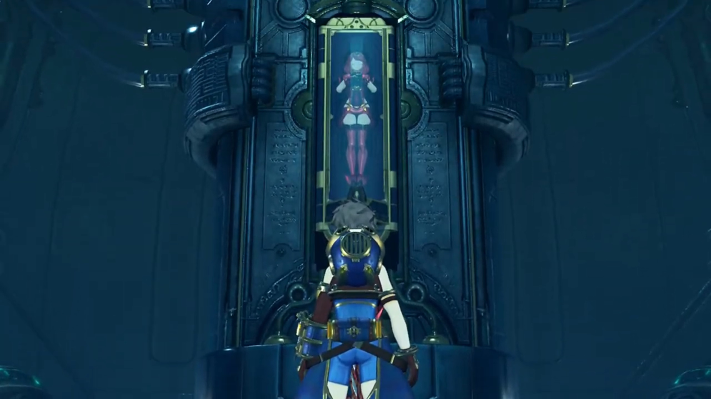

Then, some bright green light below the bottom of his eyes attracted his attention. His attention, previously on the girl, missed out what else there was. In awestruck, he tilted his head slowly downwards. The bright glowing crystal attached to the Ricasso of the sword, the shape of a cross, though the 'hands' triangular and rectangular, emits a heartbeating "blop blop, blop blop" that cleared his mind of all thinking. He felt out of control, dazzled, as his mind could not make of anything else except the heartbeats. 

Jin and the others just walked in; the thick fog do shroud their vision somewhat. They saw their target, stopped just entering the door. 

Malos whispered in his ears, "_Look._"

"_Yes. No mistaking it. That's the Aegis._"

Nia got closer to eavesdrop, looked back at the girl and them and back the girl, confused, "The... Aegis?"

Rex's back was on them, they can see what he's doing but their attention was not on him. His hands slowly lift, without him knowing, closer and closer to the luring crystal. No other thoughts pass through his brain. 

Malos just noticed, "Hey, **BRAT!!!** Don't even **think about touching that!**"

"Huh?" That knocked him out of being dazzled, but a little jerk and it came into contact with the crystal before jerking away. Green motes were evaporating off the crystal, the process irreversible. 

Jin decided quickly. His hand on the hilt of his sword, a blinding white light surfaced. At near the speed of light, he thrusted the sword through Rex's heart, ending his life. 

"Ah!" Rex was still trying to make do what'd happened when consciousness was faltering as a cold metallic object pressed against his organ muscles. He tried to look down, but energy were dwindling away. Jin thrusted deeper to make sure; blood dripped from the tip of the blade and his wounds. His visions were getting blurry, still questioning the ultimate question of curiosity, "B-but... why...?" 

His head were already throbbing as consciousness were fading. 

Jin answered, "Don't take it personally. It's an act of mercy. At least you won't be alive to see what's coming." Malos would had done the same thing, but Nia's soul was shocked out of her shell. Her friend, just a few moments ago, killed by her companion? Jin emotionlessly pulled the sword out and let Rex's corpses dropped to the ground. He slashed off the blood still sticking on it, before taking another slice at the sword Rex touched, bringing it into pieces. Like rubies, the shards showered on the ground, some on Rex's bodies. 

Malos commented, "Ugh... what a waste of time."

Nia couldn't understand, "Hurggghhhh... **JIN!!!** Why did you kill him? Why?! What did Rex ever do to you?! Jin!" He didn't bother answering. 

Malos just looked at him walking past towards the exit, ordered, "**Let's ship out the Aegis. Nia, call the Monoceros!**" She wasn't taking orders immediately, clenched her fist tighter and tighter. How their respect for her is nil; does she even belong there? Jin's silhouette faded behind the mist; her anger did not fade with his. 

---

"Ding!" He slowly clambered on his feet, the grass brushed over him where he laid. "Uh... Ungh..." Where is he? What is this place? Grass, trees, oh, and there's a single tree amongst the flat grass in the distance, with some red shirt figurine standing below it, looking afar. He knew where to go. "Ding..."

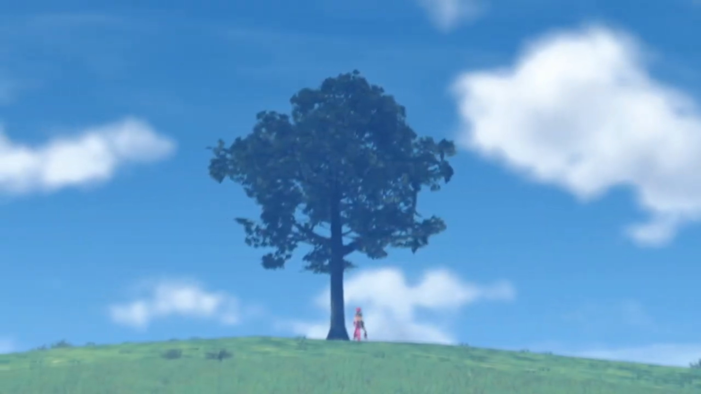

---

"Ding..." Now she is clearer. Her left hand pressed against the tree, still in the same position. He stopped. "Ding..." The wind brushes the grass and their ears, but he could not care less. "Ahh... e-excuse me...?"

The rustling of the leaves, "It's such a mournful sound..."

"_Huh?_"

"It hasn't stopped. Not... _Not in all these years..._"

"Hasn't... stopped...? **You mean that bell sound?** Is the... Praetorium... uh somewhere nearby?... Uh... w-where are we?" Her words are reassuring. Feeling uncertain, he was urged to get close to someone secure, to brave hand in hand what uncertainties lies ahead. His feet moved without him realizing. 

"This is... Elysium. The land where long ago, mankind lived in harmony with their creator. It's where... _'We' were born._"

"**Get out! R-really?**" Had this not been his dream, worrying about decreasing landmass year after year, and now he's on it? He must be dreaming. Across the lake was a town among the forest, and a Church or Town Hall stood up higher atop the hill; and layers upon layers of hills behind it. 

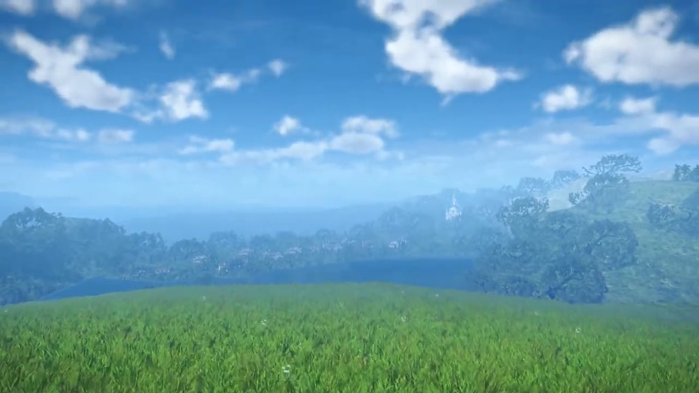

He was awed by the environment, yet his curiosity, after the initial scan, brought him to her. Staring closely, she finally looked back. The emerald-green Cross-shape crystal on her chest stood out, "Is that a Core Crystal? _You're a... Blade?_"

"M-my name, is Pyra."

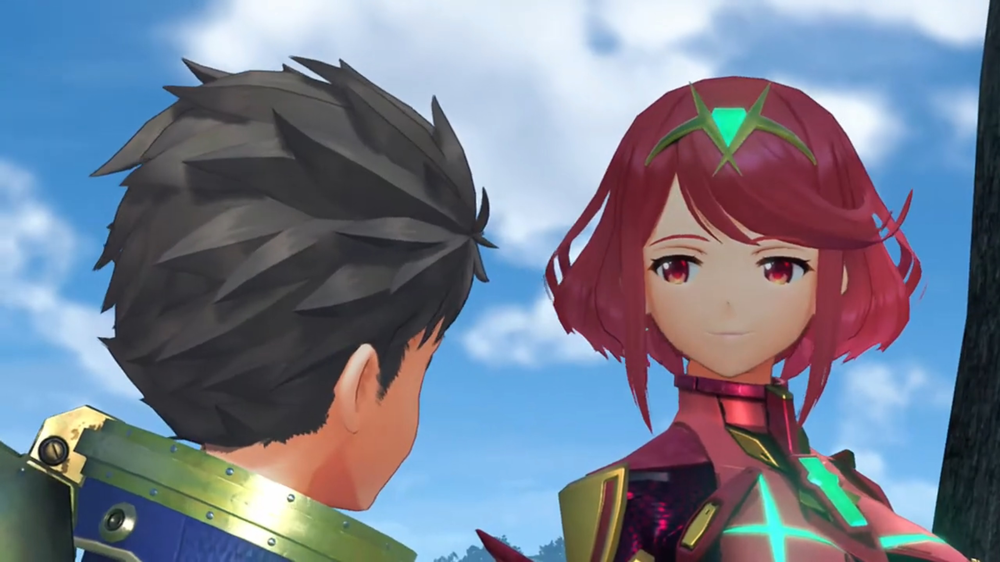

Such introductions surprised him. Had he not realized, if not smelling her breath, feeling her body heat. A crimson light red swooshed over his face, and he stuttered, scratching the side of his cheek, hoping she wouldn't notice, "What? Oh, right! M-mine is..." 

"I know you. You're Rex, right?"

His curiosity temporarily suppressed his shyness, looking back at her, "How did you... know my name?"

"_Just now,_ when we came into contact."

"Just _now_? Sorry... I can't seem... to remember how I got here..." He scanned the environment again, trying to recall to no avail. He turned his back on her, and her smile dimmed, looking back at the edge of town. 

Hesitatingly, she reminded, "You were... _killed_. Stabbed through the heart, by Jin."

"_Jin?... Through the...?_" Now he remembered. He touched his chest; there was not a hole in it, but he could felt phantom pain that washed back on him. His eyes widened in disbelief, covered his mouth as if cover himself from vomiting, "I remember now! **That bastard stabbed me! Oh man! This is bad! Everyone in the Guild is in danger!**" 

Pyra watched the panicked Rex turned around and ran back; but he dragged his knees along the soil when he realized, "No, wait! I can't do anything if I'm dead! **Titan's foot, if I wasn't dead I'd kick that guy's arse!**" And he kept banging on the floor.{{footnote: What about Gramps?}}

Pyra grew sadder and sadder, more desolate. She slowly walked towards him, "Rex, I have a request." He looked back at the only companion he had now in heaven, whom continued, "Can you... take me to Elysium?"

"Elysium? _But... isn't that... here?_"

"This world is merely a memory. An ancient, half-forgotten memory of what once was." He slowly stood up. "The **real** Elysium... lies in **your** world... atop the World Tree... that rises from the heart of Alrest."

"_Memory...? So it's, like an illusion?_" OK, "**But there's no way.** _I'm dead, remember? How, can I help, if I'm not breathing?_"

She hesitated for a moment while his mind wandered, offering, "I will give you... **half**, of my life force. That way, y-you can be revived... **As my Driver. As the Driver, of the Aegis.**" 

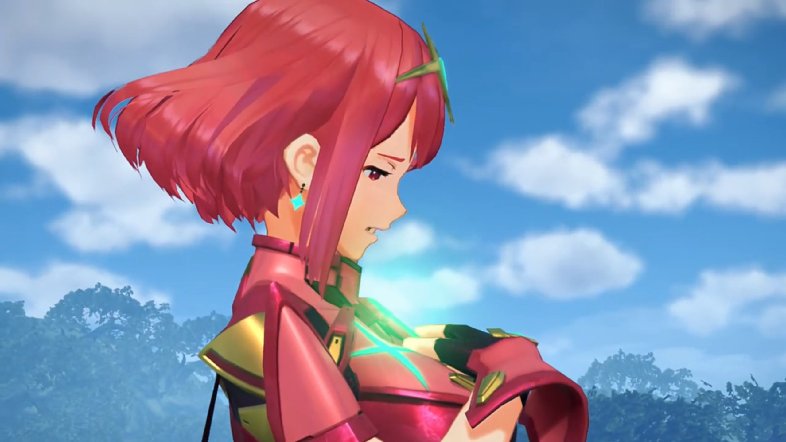

"The Driver... of the Aegis?! **Wh-what the...?!**" What's the Aegis? And he, a nobody, can be a Driver? And he can be alive again? 

"What will you do, Rex?" Can he walk beside me? Will he be willing to? Centuries of waiting, her hopes dwindled like a candle-tip; with a light blow, plunging through deep abyss. 

"_Is this place, **really** your home?_"

She nodded, "It is."

"_And it... **really** exists?_" 

"Rex, I know what you're thinking, **and** you're correct. By... **coming**, to this place... _you can save the world._ Save it from the slow demise... that is its _fate._"

"_We... wouldn't have to live... in fear. Then there's only one choice._" He dashed towards her, calling out, "**I'm in. Let's go to Elysium!**" He pat on his chest with full confidence, "I'll take you there myself!"

The uncertainty-induced anxiety get washed away, for now, someone would walk beside her, hand in hand, whatever happens. 

"_Thank you, Rex._" She slowly opened up her Core Crystal; it shone bright green. "Now, place your hand on my chest."

He took a second to be surprised, "**What?!** A-are you sure?!" He looked closer at the crystal; it was reverberating an echo that sucks his mind in, in, in. But not luring -- he can hear her voice, the beating of her heart. Slowly but certainly, with his index and middle finger, it contacted the crystal. Energy flowed from her crystal through his hand, gathering on his chest. 

A bright green light engulfed both of them, and teleported them out of the world of fantasy. A dream shall forever be a dream, let the light destroy it, and we shall move forward, to reality. 

---

Her casket had already been removed from the ship. He laid on the floor, fingers jerked a moment, before, like a puppet hanging on string, pulled up from the floor, amidst green motes repairing the hole on his chest, forming a crystal the shape of X. A replica of the crystal he wrapped on his hand, the sword regenerates. unleashing the shackles on its blade, turned into flames. It's time to revenge. 

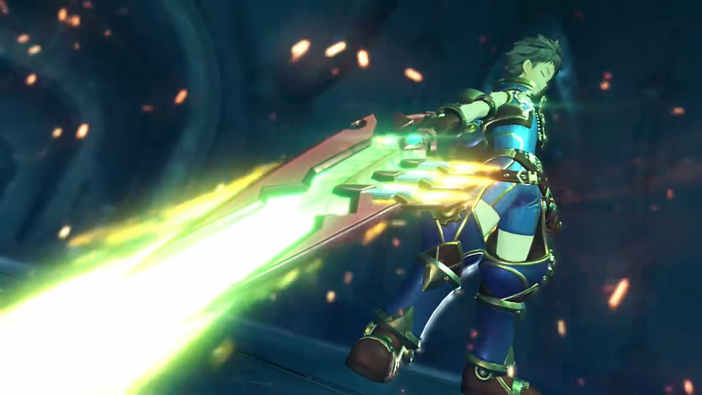

---

The downpour was even stronger than before. Malos carried Pyra's casket over his shoulder. She trailed behind, but heads dropped at all times. For the first time ever, she questioned their decisions. 

Malos see no point for emotions, ordered, "Nia. End them."

"End? Like what?"

"The price for their lives has already been paid in full. Now that we have finally obtained the Aegis... The fewer living souls know about it, the better." The other salvagers were watching from afar. 

As if letting her watching Jin ending Rex's life is not enough, now he wanted her to take action? On the innocents whom their family were waiting back at home for their return? "I-I can't do that! **These people haven't done anything wrong!**"

"I don't understand you." He stopped and peered over his shoulder. "_Now, now._ Have you forgotten why you came here to begin with, **Nia**?" One wrong word and you'll have to watch your ass. 

"N-no, but..."

"Oh, **for the love of...** Fine. I'll handle it myself." He then turned around and slowly walked towards them. Nia watched in awe. 

Suddenly, the casket started burning. Nia backed a step, and Malos was shocked, "Ho-...! **What the...!!!**" He threw the casket forward to a distance. Flames swallowed it whole, and a beam shot into the air; the phoenix glided and hit the top of the cabin entrance. Within explosion and flames, Pyra returned to life. 

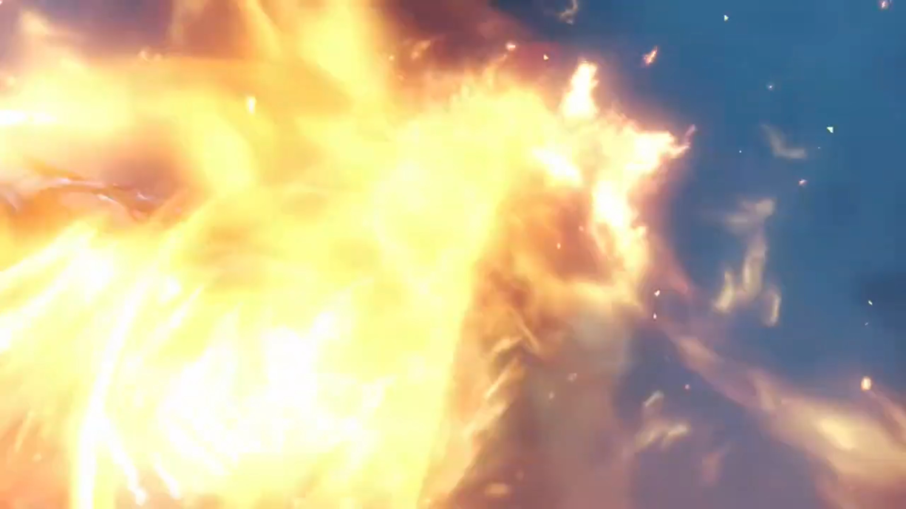

"**Aaaaaaaaaaaaiyah!!!**" Molten lava melted the deck from the cabin below, and another pillar of flames shot up the sky as Rex came back to life. 

Nia, with surprising tone, "Rex?!" The X-crystal{{footnote: And of course, minus the X and you now have Pyra's crystal. It should fit, right, the puzzle?}} in his chest shone especially bright; their focus on where his hole had gone. Their show had made the hull in flames. 

"You! And that sword. **CAN'T BE!!!**"

"It's kinda low to stab a man in the back... You. **Bloody. Psychopath! Pyra!**"

"**Here!**"

"Cover me!"

"Got it!"

Jin put his hand on the hilt, but Malos denied, "Jin. Leave 'em to me."

"**Aaaaaaiyah!!!**"

"Hngh-!"

"Gah!"

"Sorry, kid. I can't let the likes of you just claim her power for yourself. This is as far as it goes." Pyra on the other side tried to flank Malos, but his blade faced her, calling out, 

"Aegis! Over here!"

"Just... **leave it out!**" And Malos started fencing with Rex. 

Nia: "**Give it a rest, Malos! Can't you see he's just a child?!**"

"A child? Don't make me laugh! This kid... has made **himself the AEGIS'S DRIVER!!!**"

"The Aegis's... _Driver?_ Rex is..." Her mind spun incessantly; what the spark had just happened? 

Despite becoming a driver, he, a newbie, had no fight for an experienced pro. He passed the blade to his Blade, whom slashed an X attack at Rex. "You're done!"

Pyra reached there and raised a shield on time. The explosion shook the ship. "Thanks, Pyra!"

"You're welcome. **Now, don't let up!**"

"**Yeah!**" And both zig zag towards their opponents. Malos's Blade slashed at them, trying to block their way. Pyra blocked the attacks while Rex prepared the attacks. "**Aaaaaaaiyah!!!** Everybody, go, now! Quick!" Malos and his blade just dodged his attacks, not fighting back. The others listened to him, ran back towards their ship. 

"**Malos! Here!**"

"I don't think so!" Malos gathered energy in the weapon, aimed at the bridge that connected the original ship to the ancient ship. The others were running abroad it. 

"**Hey, you bully! Over here!**" If he attacked, he could not block the incoming flames. He chose to defend instead. 

"**Hurrrgh!**"

Rex and Pyra embracing each other side by side, holding onto the sword together, "**Burning... Sword!!!**" A huge explosion at where Malos stood. The others had returned to their ships. Nia's mouth gaped wide. Did they killed Malos? Jin didn't even bother helping. The smoke dimmed and their swords clashed; he blocked it. 

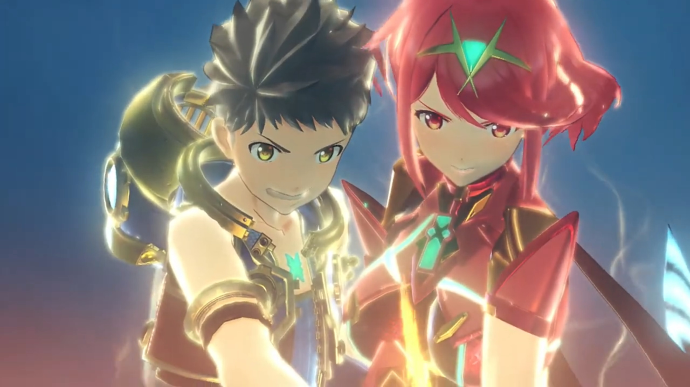

"You brat. How can a nobody like you...? _Ahhhh, but with those eyes..._ I guess I should've been more wary... from the start..." It's just like him, Addam's. 

"What d'you mean?!{{footnote: Still had time to ask when you should focus on fighting?}}"

"Like I'd tell you!" The purple energy ball gathered on his other hand, punched at them. Round 2. 

---

"You're good, kid. It's no simple feat to control the Aegis like that... however..." Rex was dashing towards him; he waited and gathered the dark energy, caught his sword by bare hand, and "**ARRRRRGGGGHHHH!!!**" punched hard in his stomach, swung him around and flinched him back. 

"**Agh!**" The sword flew off his hands. 

Pyra was having difficulty on the other side dodging attacks as her attention swiveled to "**Rex!**"

"Don't get cocky, you little **shit**!" said he whom dashed towards the boy whom felt his muscles not listening to his commands. 

"**Dromarch!**"

"**Understood!**" That's when Nia rode herself and tried to intercept. 

"**What?!**" The surprised Malos found himself flanked by some water bursts. He stopped to shield his face, and saw her riding her tiger, dropped in front of Rex. "**Get out of the way, Nia! Have you gone MADDDDD!!!**"

"**You're the one who's off your nut, waling{{footnote: Not sure if this is a valid word; it's the subtitle, but one can't comprehend. Did she meant 'wailing'?}} on a child!**"

"Nia... I don't think you quite comprehend your position."

"I get it, but-..."

"You're **starting to PISS ME OFFFFF!!!**" As he was angry and his blade got back beside him to fight the newcomer, Pyra took the chance to take her sword, make a turn and came back, 

"**Hya!**"

"Ngh!" He forgot he had to first deal with her. Fencing and fencing, leaving flames everywhere they clashed. "You're pretty sharp for someone who's only just woken up."

"**Pyra!**" His stomach still hurt; he effetely stood up but had not the power to continue fighting. Are they going to lose here? Even with their new ally? They were no match for the one still feeling like a breeze, what says Jin whom hadn't yet laying his hand on the battlefield. 

"Takes me back, to 500 years ago... _What's the deal with that appearance? I'm guessing your goal... is Elysium..._"

"**That... is OUR. dream!**"

"Then I have **no choice, but to stop you!**" They prepared for another battle, facing down one another. 

Just then, the black ship that followed them from the harbor flanked the ancient ship, appearing behind Pyra. Rex watched in awe as the machine guns were aimed for the ancient ship. "**Pyra, watch out!**"

"Huh?" She turned behind, found them firing. 

"Pyra!" He forgot his pain, for her pain covers his. He quickly dashed towards the location. Their dream had not yet started, she could not yet die; his promise for her had not yet fulfilled. 

"**Ahhh!!**" Injured but not dead. She struggled to stand up. 

Rex reached her, grabbed her, asked, "Y'all right?!"

"Mm, more or less..." she reassured. 

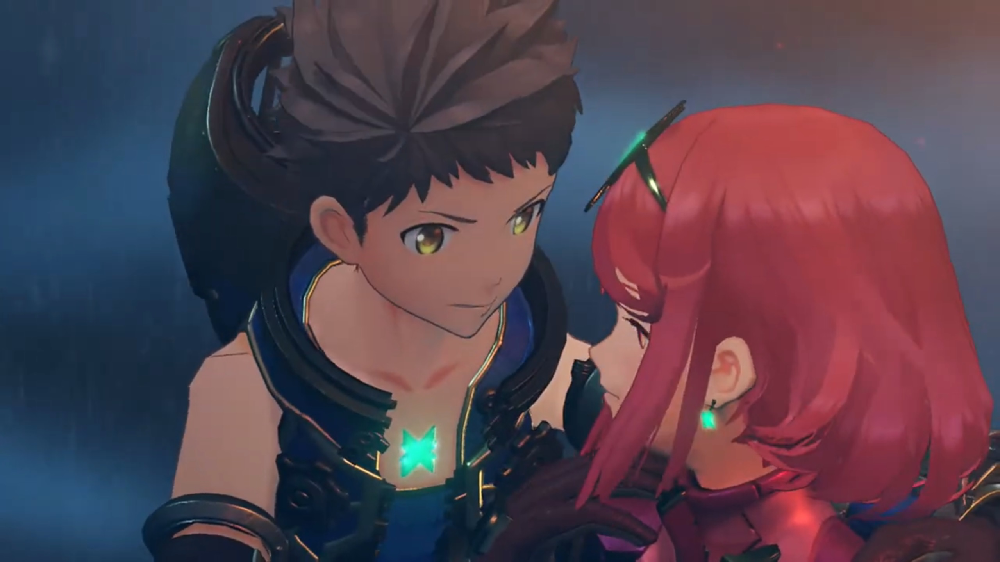

"**Stop this!**" They hadn't realized whose ship was it, when Dromarch and Nia were already going after it, shielding them behind. More attacks came; Dromarch put on shields to defend the incoming missiles. But it was too suppressing, and the flames swallowed the four. 

"Hogfh..."

"Nia!" Rex attention switched as he adeptly maneuvered the hull of the tilted sinking ship after her. The angle wasn't right, and she was off the hull's boundary. He jumped without a moment's hesitation, plunging together towards the wild water below. He accelerated faster than her, caught her by her arm, immediately turned around, and shot an anchor{{footnote: that he usually used to pull treasures.}} at the crevices. They hung tight; she went unconscious. 

"You're a tough one, kid, but there's only one way this can end!" He looked over the edge where Rex was below, ordered the machine guns pointing at them. 

"Oh sh-..." With a burden by his side, his anchor not strong enough to move them faster than the guns can shoot. Yet, their luck retained, for explosion swallowed the guns before it can shoot. 

"**What's that?!**" Why is everything going out of control just at every junctions for them today? 

That tone... that whale-song-like tone... no mistaking. It's a flying titan. The silhouette of stretched wings amidst the dark sky lit only by moonlights and burning ships, looming larger and larger. 

"**Gramps!!!**" He swooshed past Rex, found him still alive, zoomed back into the sky to switch direction. His eyes scanned what enemies Rex had on the deck. There, the white shirt that stood there, not moving. 

"Jin... Still you persist... **And is that... Malos?!**"

Jin: "Azurda..." 

The scouting is done. He flew back up high into the air, while Jin prepared his sword, to stop anyone barricading him from achieving his goals. Melee encounters wasn't Azurda's strength; the redness lit his face as fire Ether particles concentrated into repeated fireballs, suppressing every single inch of the deck. Jin could not wait for him to near, pulled his sword and sliced the incoming fireballs. 

Engulfed in flames they were not hurt, but it's enough to shroud their vision. He never meant to join the fight, banked toward where Rex was still hanging, instructed, 

"Rex, get on!"

Pyra saw the chance to escape, vaulted onto Dromarch, whom took her down along the hull, running alongside Azurda in sync. 

"Got it!"

Pyra: "Rex!" She held out her hands, he reached out his arms. They swiveled behind like kites, till he gathered the strength to vault himself and sat behind Pyra. Reaching the end, Dromarch jumped high onto the air. Azurda took his aim accurately, catching them with his back. 

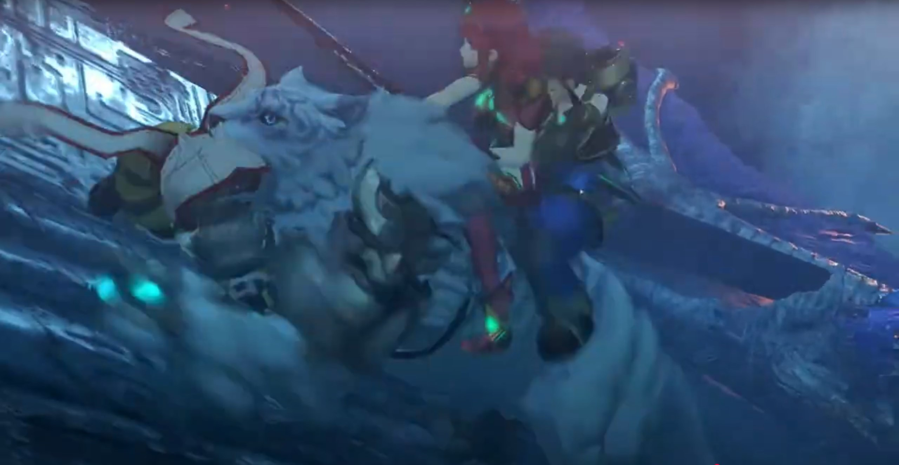

"We're going! Hold on tight!"

Malos shouted, "**Stop them! OPEN FIRE!!!**" The machine gun on the ship was quick to swivel around, aiming and firing at them. Flames scorched the Titan's body, but he did not wail. Releasing the whale-song-tone, he got further and further out of the gun's range. "**Turn her around!** Ready the cannon!"

Jin: "It's no use. They're out of range."

"**Dammit!** _They gave us the slip..._"

After some moments watching Azurda's silhouette getting smaller and smaller, Jin ordered, "Turn around."

"We're not chasing them?"

"The Aegis is awakened... That's enough for now. I'll have Akhos hunt them down." He walked away while replying. 

"Hmph." At the edge of the ancient ship's deck, he could not deny. "That will have to do..." No more sign of them. 

### Footnotes: