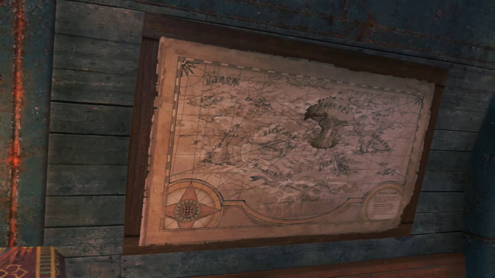

# Washed Up

"And so, Pupunin _wisely_ ran away for dear life."

"**WISE? WHO WISE NOW?!!! YOU. USELESS. IDIOT!!!** Why can't Pupunin not even **die** properly? **WHAT IF THEY ASK BANA TO REPAY MONEY**, hmm?"

"Huh? Die? Repay who?"

"Meh! None of your business. Anyway. **Tell me** where Rex and Blade went."

"R-Rex, Titan and friends ran away! Went to south of Cyclus Sea -- after that, Bana know as much as Pupunin! S-storm was very thick, so Pupunin..."

"**Pupunin lose** them, yes?"

"Yes, but..." The tears in his eyes trying to fake it through. 

"And then run away like coward?"

Sweat started dripping like water hose from his forehead, "Y-y-y-yes, but..."

"Meh-meh-meh-**meh-MEH!!! BANA NOT WANTING FEEBLE EXCUSES OF PUPUNIN!!!**" He banged hard on the table. The mirror jumped up, and Pupunin on the other side also jumped up. "**JUST GET BACK HERE! You got LOT OF WORK to do!**" With fluttering wings, Pupunin immediately hung up on the other side. "Meh-**meh-meh... Even pricey insurance Bana take out on Maelstrom** go to waste..." Money minded, huh. 

As he calmed down, he looked to the map of the various Titans location updated to their current, "Still, how interesting... Heading southward from Cyclus Sea... In **current** season, that _likely take them to Gormott._ **You, girl! Get Consul Dughall on the line, IMMEDIATELY!!!**"

"Yes, sir. One moment, please." And she walked up front to the mirror and tuned the frequency. 

"Why, if it isn't Chairman **Bana**. What an unexpected **pleasure. May I** just say that I admire how you rebranded those broken Core Crystals. And selling them on to the dunderheads back in Mor Ardain -- **absolutely sublime!**"

"**Bana did not call** to hear pointless flattery! And **blabbering about Core Crystals on UNSECURED LINE?!!! IS DUGHALL SOME KIND OF IDIOT?!!!** What if Indol **tap. Our. COMMUNICATION?!!!**"

Dughall jumped back, as if covering his mouth would shied them from listening, "**O-o-ohhh, of course! I'm very sorry!**"

"_Meh, forget it. We got bigger- fishies- to fry._"

"Oh? What's going on?"

"Listen. Up."

---

"_Unghhh..._" Blink, blink, blink. The blurred image of worrying Pyra turned into grateful Pyra. "_Huh... Pyra?_" 

"Oh, thank goodness. Y-you aren't injured at all, are you?"

"_No, I'm... fine, I guess..._ Where...?"

Grass was relatively thick, but the trees were even lusher and denser. Together they held fogs from escaping. 

"I'm not certain. We seem to have... washed up on a Titan of some kind."

"A Titan?"

He tried to tilt his head to check it out, when his mind ran through what they had just gone through yesterday. Nia, Dromarch, Gramps... "**HUUUHHH!!!**" Now he remembers! Immediately, he jumped up from her laps, his hearts beating as fast as they could get, the worries brought his adrenaline to max. "**Where's Gramps? And Nia?**"

He scanned around, looked back at Pyra. She stood up after him, shook her head. As if receiving bad news, he was about to collapse, scanned the surrounding irrationally for any signs. But where are they? Pyra waited for him. 

Then, something amongst the grass caught his eyes. His salvager helmet. He told Pyra, "**We gotta find them! They can't be far!**"

"**OK!**" Together, they dashed for the only rights of way from the ledge they were at now, deeper into the forest. 

---

"**Gramps!**" He was laying there, effete and heavily injured. He quickly got near him. 

"Hmm. It is good to see you uninjured, Rex." The blue motes that floated on the surrounding like fireflies sending him off. 

Pyra had left some space for him and his lifelong companion. Yet she felt "_How awful..._"

"Hold on, I should have some herbs..." He dug into his pockets, searching for it. 

"You are kind, but... no amount of **human** medicine, would suffice."

He listened to him, "B-but..." he still wanted to try. 

"Weep not, _my boy. This is- my- fate._"

He tried to say something, but "_I... I can't help it, can I?_"

"_No parting is forever. We will surely meet again, when the flow of the ether wills it..._" The purple part of his head started glowing bright, about to disappear. Both he and Pyra felt heavy rocks in their heart; he had went out of his way to saved them, and this is his finale? Gradually, slowly by slowly, his whole body glowed bright as ether dissipates back to Mother Alrest. "_The days with you were the- best- I- ever- had. Until- we meet- again, Rex..._"

"Gramps!" He dashed forwards, tried putting his hands on him; but he dissipated beforehand. Nothing left except motes floating up the sky. His teacher, his guardian, whom raised him up from baby to teen, now gone forever before his eyes? Had he said he's ready to look at life and death plainly? He tried to catch then within his hands, but to no avail. What's gone is gone. "**Gramps! GRAAAAAMMMMPPPSSS!!!**" Knelt on the floor, tears flowing down his cheeks. Pyra covered her mouth, sensing his feelings, looked aside as her tears rolled down her cheek too. 

And a baby voice called out while the atmosphere was desolate, softly, "I told you not to cry, didn't I, Rex?"

"Hngh... Hngh huh..." He's not listening, too into his own emotions. 

"Rex..."

"Unhungggghhhh unhugh..."

"_Rex..._"

"**Grampsss!!!**"

"**REXXXXXX!!!**" Are you deaf?

Pyra can't help not to laugh. Rex looked in front. A super tiny Titan sat in front of him, wiggling its tail. Rex was dumbfounded. Who is this tiny little guy in front of him? He rubbed his eyes, cleared his tears, and looked again. Pyra got closer beside him, examined. They looked at each other, surprised, as both exclaimed, "**WHAAAAT?!!!**"

Tiny wiggly tails, super small core crystal like diamond shape chest, tiny wings, and a tiny thorn, "G-G-Gramps? How is that-?"

Pyra: "It can't be..."

"Use your eyes! Don't you recognize me?!" As if he's recognizable. 

"Um, well... not really, no." She can't help it. 

Rex snuffed his tears, stood up, logically said, "I am so confused right now..."

---

After much explanation, Gramps concluded, "So you see, by **maximizing** cellular regeneration{{footnote: Ahem, where had your biology gone?}} to retain all vital bodily functions, I seem to have reverted to a _larval_ stage." He flapped his wings as he leveled with Rex's eyes. 

He looked away, commented, "Well that's quite handy. Must be nice to be a Titan." What a waste of tears is the real comment. 

With proudness in his tone, "**This**, isn't something just any old Titan can do! Only one so advanced as myself-... Erm, _Rex, are you angry?_"

"**HMPH! I'm not!** It's more that I didn't want you to see me blubbering like a baby!"

"Ho ho. It's okay to be angry." And he stopped flapping his wings, immediately dropped to the ground. 

"So... when will you be back to your old self?"

"**Goooood** question. No more than... 300 years."

"**Th-three hundred years?!!! But I'll be long dead by then!**"

"_Hmm. I suppose that's true._" Like he doesn't feel anything different between him alive or dead. 

"But... what about my house?! **Do I have to live on the streets?!**"

"Perhaps this is an opportunity to fly the nest."

"You mean... pay rent?"

"_Ho ho, miserboots!_"

"It's a **massive** extra **expense**! Still... Glad you're OK, Gramps." Gave him a thumbs up. Now that's solved, he turned to Pyra, "_Oh, shoot!_ We can't stand around all day! _We have to find Nia!_"

Gramps flew up again, asked, "Nia? You mean- that- Driver- and her- Blade- from before?"

"Yeah. They kind of saved our lives."

Pyra: "I do hope they are all right."

"Gramps, do you remember anything?"

"I- remember... crashing through -many trees, before landing- here... They- probably- fell off then."

"Hmmm, that's not a whole lot to go on..."

Pyra suggested, "Perhaps we would have some luck... following the trail of broken trees?"

"Good thinking, Pyra! Let's go!"

"By the way, Rex, is that a- Core- Crystal- I see- shining on your chest? Just- what happened- to you?"

"I'll tell you later. Right now, we need to find Nia!" He picked Gramps up and threw him into the Salvager's helmet hung by his back. 

Gramps felt excited, "**OOOOOHOOOOOHHHH!!!** Now this makes a nice change!" He whom hosted he on his back for long, now he hosted him on his helmet. And he said nothing, led them along the trails, searching for their missing new friend. 

---

They continued down the path when he heard something, "What's that sound?"

Pyra voiced her experience, "I felt... a ripple in the ether. It feels like a... Driver is using a Blade in battle. I'm certain of it."

"_Let's go._"

"OK!" They quickly get to the point of attack. 

---

Nia and Dromarch were facing down a giant brog{{footnote: A frog/toad}}. 

"My lady, leave- this- to me!"

"I'm not just going to abandon you, Dromarch!" They prepared for engagement when a fireball flanked its side. 

"What?"

"We're here to help, Nia!" Just in time. 

"**Rex?!** What're you doing here?"

"My lady, now's our chance! Let's attack!" The brog licked where it was hit while Rex and Pyra took the chance to join Nia and Dromarch in battle. 

"All- right, then!"

---

After the battle, they have time to talk. "So why are you guys even... Well, I guess that's a stupid question."

"Indeed." agreed Dromarch.{{footnote: One think that's Dromarch? But one couldn't be sure.}}

Rex felt gratitude, "Seriously, it's good to see you. And you're all right."

"Right back at you. **Hey, by the way. What- happened to the big guy** who saved us? The Titan?"

"Are you talking about me?" He heard himself being called, climbed out of Rex's helmet, and revealed himself. 

"Wait, what? How?"

"**That's**... sort- of a long story. Let's get somewhere we can rest. I'll tell you all about it then."

"That seem prudent. My lady?"

"Sure. Lead the way."

---

They made a campfire in the forest, sitting around in a circle. "I see. So you two are off to Elysium... Listen, I never thanked you properly. For... saving us, I mean. Dromarch said that you... carried us all the way here."

"We owe you... our lives, Titan."

Gramps sat himself in between Rex and Pyra, hands crossed, "No need to thank me. After all, you were the ones who saved Rex."

"Don't mention it." Guilty washed over her as she was ashamed by what her group had done. Now she felt like an outgroup. Not to dwell on the topic any longer, she changed it, commenting, "**So**, you Titans can regenerate. Pretty handy."

Gramps's nose immediately raised high into the sky, hands on his waist, lifting his chest, repeating the chant he hadn't stopped every since he reverted stages, "This isn't something just any old Titan ca..."

"You can retire that line now." Rex cut him off, too tired of his baffling. 

"**Excuse me?!** I'd like less of that attitude! If **you** had listened to me and declined that reckless job to begin with, we wouldn't be in this mess! 'Take a nap' you said, like I was some kind of **doddery** old man..." Meanwhile, Dromarch had laid himself behind Nia, and she laid backwards, using his body as pillow. 

"**Okay, okay, I get it! I'm a _terrible_ disappointment. Look**- how- sorry- I- am!" Nose high onto the sky. 

"Can- you- not- _muster_, even a **shred**, of sincere remorse?"

"Sorry, but I can't."

"Um what?"

"**If I hadn't taken the job, they'd have got their hands on Pyra.**"

"Rex..." Awww that was so sweet. 

"I couldn't let that happen. **No** way. They can **never** take her."

"Hmm hmmm...." Not that he can rebut, nor does Nia. 

---

Nia slept herself wholly on Dromarch, using him as a bed. Rex just laid on the floor, dozed off. Pyra was out in the plains herself, looking at some rocks and trees. But her mind dwindled. A lot had happened since she woken, but till now, her mind was occupied by worries of escaping and her new partner and friends. Now that all that died down, feelings washed her aback. She had time to think, without distractions seeking her. 

Like a mosquito, Gramps slowly floated to her, called out, "Hello there. Still awake, I see."

"I-I can't... seem to sleep. It's good to see you again... Azurda."

"Likewise. Though you've changed a lot since last we met, Pyra."

"I supposed I have. A lot's happened."

"Yes it has. I wanted to thank you... for saving my dear Rex. And... I need to know - what- you told him, is that what you really intend?"

Whether or not she really feel that way, the complications that's tearing her apart, the different voices in her heads arguing to find her 'true self', if there is one, she had to answer "Yes. It is... my true desire." with utmost confidence. 

"I see. Well, that's good enough. I have no reason... to doubt you, Pyra."

"That said... I do have one other goal now."

"Jin, and- Malos."

"I **cannot** allow them... to continue with their current course."

"The fate of an Aegis... never changes..."

"_Right._"

"And- you're going to get Rex... mixed up in this?"

"_Hrrr..._" How guilty she felt; he whom never understood what he'd gotten himself into, decided only to walk beside her, had not considered what obstacles would lay before them, on the road to Elysium{{footnote: and they may even, one day, met a barrier so high they can't vaulted past!}}. 

"I'm not blaming you. No matter how hard you tried, _that boy would find some way... to get involved._" Plus, they now shared their life forces, 'interlinked'. 

Nothing from her to say, so Azurda changed the topic, "I- see- half of your Core... _is missing._ Seems you've taken on... quite a burden."

"_Azurda, I..._"

"Promise me... you'll take care of Rex."

"_I will._" What burden to bear on her shoulders herself, without one to share, even when they're by her side, she could not voice it out. Physically, they could be with her, but mentally and spiritually, she held back, needing more time, for both herself, and for her de facto partner. 

---

"Urrrrrgghhhh... Urgh urggghhh!!!" He had just woken up, the others already waiting for him. Quickly, he get to the point, "Right then. We should probably try and find a town or something. Does anyone have any idea... where we are?"

Nia, without hesitation, answered, "This is Gormott. A province of the Ardainian Empire. **You must've seen** the Gormott Titan before?"

"Yeah, only from a distance, though."

"We're- somewhere around its belly."

"Sooooo... this is Gormott, huh?" So much worries, he hadn't had the attention to examine closely their current location. Now the forest looked eerie, then something struck, "Hang on a second, Nia -- your ears. Are you Gormotti?"

"Well done, genius. Took you long enough!"

"Gormott is the land of my lady's birth."

"Wow. Well, that's reassuring."

She gave direction, "If we wanna find a town, the first step is to get out of this forest. Keep heading up, and we'll hit the plains soon. The town's that way."

"Brilliant. Let's get going!"

---

The plains was alluring and huge. From a platform, they could oversee the whole plains. This is **Gormott Province.** At the other end of the plains was a town, set at the edge of the Titan, with several diving points for salvaging. The head of the Titan was far away, had horns like that of a Capricorn. Waterfalls, some trees with their roots sticking out in the air called breathing roots, and the animals which'd taken refuge were too small to clearly distinguish from afar. It awed Rex and Pyra, one whom had not been on such continent before, the other, for the last 500 years, had repeatedly stayed at the same place in her dreams. Nia was proud to host the two. 

"Oh... my goodness. What a **wonderful** view!" For a moment, she felt not the constant background depression, but an uplift in emotions at such heart-calming scenery. The breezy winds, the scent of grass, all soothed the mind, calmed the heart. 

Gramps agreed, "Spectacular indeed."

"Yeah, this is great! Especially after slumming it on Gramps's back for so long!"

His contentment was overturned, "**Hmph!** It served you well enough!"

Nia nudged towards the only town at the plains, pointed out, "Over there, that's Torigoth. Biggest city in Gormott. I'll accompany you as far as the city. After that, I'm afraid you're on your own."

"Oh, on our own?" Rex was surprised, she's not coming with them? 

"**Of course!** I would have thought even you'd know why I can't be seen with you."

"Because... you're supposed to be one of **them**?"

"I haven't known them very long, _but you know._ They're still my crew."

"**Your crew?** Even after they tried to **kill** you?"

"That's- as may be, but they're the closest thing I have to a family."{{footnote: It's not easy to escape a family, however bad it is. You'll know it if you're in one, or if you read one, though the latter would be much less extreme if you'd never experienced it for yourself.}}

"**Nia...**"

"**Right. Let's go!**" She had to hardened up despite, pushed forward, and lead the way. 

### Footnotes: