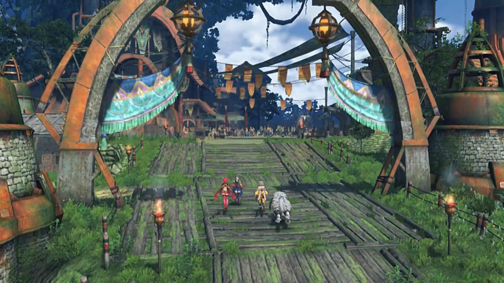
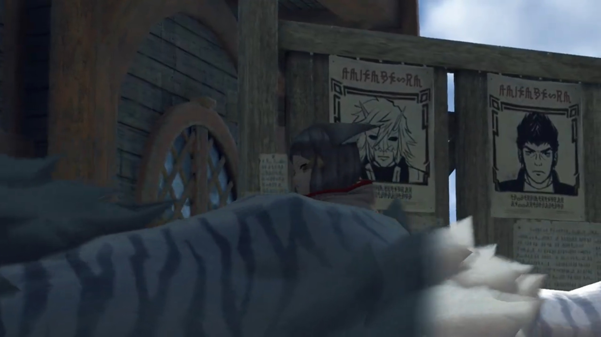
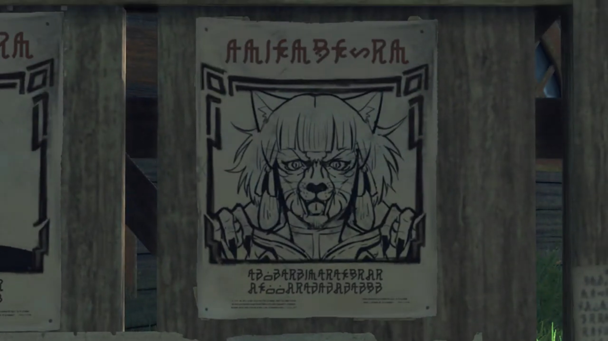
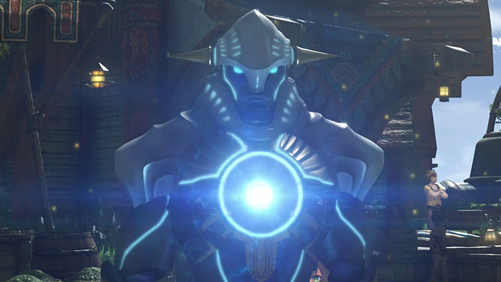
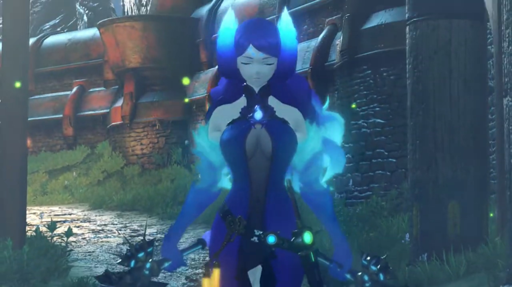
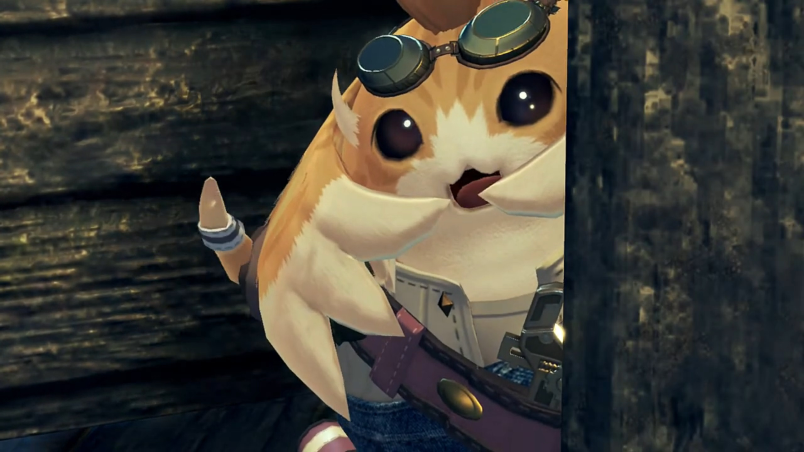
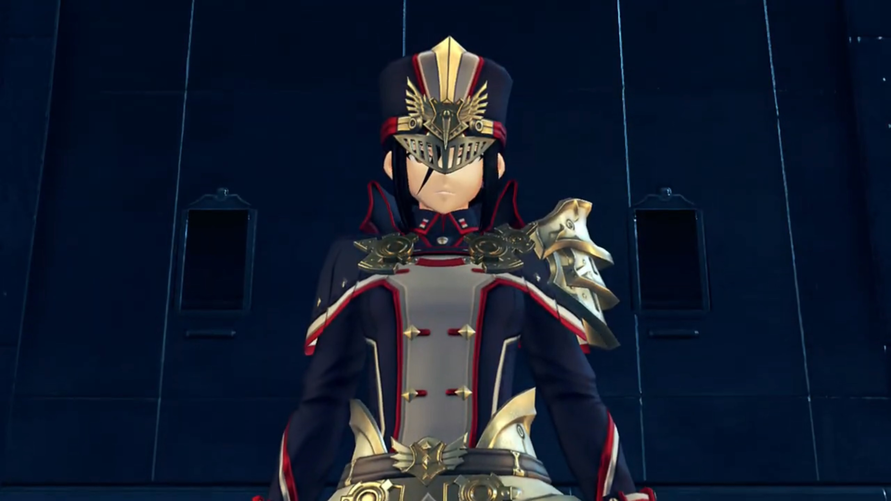

# Gormott, Resonance, and Captured

===

They arrived at the City. An arch on the entrance and wide wooden-made path leads into the City. Various lanterns hung between poles and the top of roofs. Immediately visible is the square where people gathered. Some of the buildings seemed to be made out of rocks. "So, this is Torigoth..."

"_It hasn't changed a bit._"

"Nia?" Pyra noticed. 

"It's nothing. **OK then.** I'll show you to an inn. Then I'm out of here." And they trailed behind her. 

---

> **Translator's note on environment:** Most of the buildings are single-storey made with metallic roof. The town was under a giant tree, acting as shade. Bazaar opened everywhere along the street, even outside people's house. People also gathered around the square where the fountain was, to watch performances. One of the building have a giant horizontal windmill, about the tallest we can see; still, it doesn't reach the treetops. This, is **Torigoth.**

---

They were casually walking when something on the billboard caught her attention. The images were huge, and three in a row, it triggers. Feeling the weirdness, she slowly backed up, turning right, and saw her poster, along with Jin and Malos's; except the latter two had acceptable accuracy, while hers was a little too fat, a little too ugly, a little too scary, and a little to tiger-like (than cat-like), and a little too male-like. 

"**What the bloody hell is that? Don't tell me this is meant to be ME?!**"

Dromarch tested her bottom line, "A remarkable likeness, to say the least..."

"**Oi, did you say something?**" The eyes fiery on him. 

Opps... With quick wits, his mind worked 10 times faster than usual, "Ah, er, no. I-I fear they may have conflated our countenances, my lady. **How very awful.**"

"**Offfff.... GRRRRRR!!!**" Rex and the others were curious, what drawings was it that ticked her armpits. With extreme pissed off, she used her claws and clawed the notice into shreds. The rest was so surprised at her action they backed up from her. Oh boy...

---

"**Fie! Who has the courage to heed the Empire's call?**" At the square, a Core Crystal was placed in front of 3 soldiers on a table. They were calling for Drivers to join their ranks. "**Your strong heart today, will build a strong Mor Ardain tomorrow!** Of course, you get more than a salary! **Pension and benefits are included! Distinguish yourself, and you could even join the nobility! For. The. Glory. of the Ardainian Empire, and HIS MAJESTY, EMPEROR NIALL!!! COME now! WHO wants to be the HERO of tomorrow?!**"

The group arrived and heard his speech, was wondering, "Hmm... What's the deal over there?" 

Great many people were gathered around, watching for someone to show up. Nia recognized, "Driver recruitment."

"Driver recruitment?"

She shared, "Recently, they've been recruiting Drivers from all over."

Dromarch added, "The pool of potentials, is ever shrinking. They must have run out of candidates in the military."

Rex wondered, "What do you mean by 'potentials'? I'm not sure I follow."

"Just see for yourself."

---

"Don't do it, bro, it's too dangerous!" Many young Gormotti were surrounding a grown up Gormotti. He was pressing forward to the recruitment bazaar when his younger brothers and sisters were blocking him. "What will we do if something happens to you? Who'll look after us?"

He pushed her aside; she caught him by his arms and pleaded, "**P-please...**"

"I-I-I know it's dangerous, but... i-if I can b-_become a Driver..._"

"**Outta the way, pipsqueak!**" He hadn't finished when a tough huge guy broke the chain in between, shoved them aside. All fell to the ground. The buff guy didn't even look at them; and perhaps his siblings was waiting at the outer ring of the square as he performed, "All right, **c'mon Blade boyo! Show me whatcha got! Hroooagh!**" And he grabbed the Core Crystal by hand. "**A-a-a-AAAAAAHHHHHHH!!!**" 

The power transferred, or maybe sucked, to/from the Core Crystal let his body emit tremendous heat. Such tremendous heat inflate his body larger and larger. Without seeing the end result, Nia already predicted, "Yeah, he's done for."

"Indeed." Gramps agreed. 

"**WAAAAAAAHHHHHHH!!!**" His body couldn't tolerate the ether energy transfer, fell dead on the spot. Pyra watched awestruck. 

The two soldier beside the middle speaking one already prepared for the process, walked over and tow his body away, while the middle one announced, "Oho, **all bark and NO BITE! What a** shame!"

Rex didn't understood, "Eurgh, what just happened? All that blood..." He looked towards Nia, covered the sight with his hand, though constantly sneering over his shoulder to satiate his curiosity. 

She explained, "Couldn't handle the Core Crystal's power."

Dromarch added, "That's what happens... when someone _unqualified_ touches a Core Crystal. Truly- lamentable."

Rex was confused, "Wait, you need a qualification to be a Driver?"

Gramps suggested, "Perhaps 'aptitude' would be a better word."

"Aptitude?"

The clapping of hands too his mind away, as the soldier continued his babbling, "**Now, is there NOBODY else here ready to test their STRENGTH for the GLOOORY of the Empire?! Oh! How about you? What say you? Step- forward, sir, with BOLD HEART!!!**" His eyes scanned around until it met the brother of the young knocked away just now. Even with one dead before his eyes cannot stop his dream from becoming a Driver. 

"_Nooo..._" Their pleading do not stop his will. 

"Don't... Don't worry. **Your big bro's gonna be a Driver, and then we'll be set for life.**"

All in chant, "**Don't do it!**" 

But too late, he could no longer hear, reached his hand at the crystal. "**Ah-ahh-ah-AAAAAAAHHHHHH!!!**"

Nia can distinguish, pointed out, "There's your 'aptitude'." Rex couldn't distinguish, but watched the process nonetheless.

 A bright light swallowed the bro, and in surprising eyes, the ball of energy transformed into a spear, floating in front of him. He grabbed it with both arms, all bitter and sweet he had gone had been worth it. Another ball of energy floated down behind him, and his humanoid 'standard' blade{{footnote: Those non-special blades}} came to life. 

With elation, he called out, "**I... I did it!**"

The children were also elated, running towards him, the constant chatter they had, "You did it!"

"I don't believe it!"

"Oh wow!"

Pyra was equally content, walked forward, while Rex noted the process, "The Core Crystal turned into... a weapon?"

Gramps: "This is how Blades are born, Rex."

"What? But when I touched Pyra's..."{{footnote: Ahem, Pyra's where?}}

Nia cut him off early, "She's a special case. Pyra is the Aegis, remember? So the usual rules don't apply." Where she was some steps in front of them, watched the elatedness at the center stage, felt it herself, or maybe, recalled. "All that business with sharing her life force... It's- not exactly normal."

"Wait, what does 'the Aegis' even mean?{{footnote: Gramps was stretching behind him.}} Jin and Malos... They called her that, too."

"Dunno. **All** I know is that it's some kinda legendary Blade. Why don't you just... ask her yourself? **Let's go.** No point sticking around for the enrollment ceremony and all that boring stuff." She didn't wait for him to think, already walking away. Pyra was still concentrated on the ceremony, didn't hear them. Rex gave her a gentle touch on the shoulder, pulled her attention back, before they walked away, though her eyes looked back once more, with reluctance.{{footnote: 依依不舍}}

---

Walking down across a lower part of the city, Rex still had doubts, stopped in his track and voiced, "This whole thing with Core Crystals, **touching** them to create Blades! It's pretty amazing when you think about it."

Pyra: "We Blades start out formless, anchored to the world... only by our Core Crystal. Only the **touch**... of a potential... can imbue us with form, and being. And it is by these forms, we come to be known."

Gramps: "So you see, my boy, in some ways it- is- only- the fated touch of a Driver, that allows the Blades, to exist at all."

"**Wow!** Why does it happen that way, though?"

"Now that is something no one knows. It's just how it's always been."

Dromarch added, "Blades come in all shapes and sizes. Some- human-shaped, some- not."

Nia: "Some people say the shape depends on the kinda person the Driver is."

Pyra: "The resonance between Blade and Driver, is a _mysterious_ thing."

> Rex recalled, "Pyra... She was crying when I met her. Was she brought to life by someone once, just like a normal Blade?"

Thinking in his mind, "_What is the Aegis, really?_"

But he had no more time to think: "Halt! Nobody move!"

Soldiers were coming at them, sandwiched them from both side of the pit, the only two entrances. 

Gramps: "Oh dear... Looks like... imperial troops."

Nia: "Great."

Rex: "Hey, what's going on?"

The soldier answered, "That fugitive in your company is an enemy of the state! A member of Torna!"

"Nia, a member of Torna?"

"It's her all right. Gormotti Driver, white beast-form Blade. She looks **exactly** like the wanted poster." Don't talk about the poster is fine, talking about the poster, 

Rex didn't immediately recognize, "What wanted poster?"

"See for yourself!" So _that_ wanted poster. 

"Wow, it really does-..."

"**Oi, watch it!**"

He's swift at saving his arse, "Ah, uh, I mean, **no way! This doesn't look anything like... Wait,** we've got no time for this! **Who cares if it** looks just like her?" And she hissed at him immediately. 

The soldier neither cared, "Hmph. Now as for you... You look like- a Driver too. Registration number?"

"5...3...9...?"

"Knock it off, _you fool._ All new Drivers must register with Indol! No number means you must be an **illegal, unregistered,** Driver!"

"**No, you don't get it!**"

He doesn't want to hear his explanations, or rather, excuses in his ears, "**You're coming with me! We'll see... what the consul has to say about this!**" No way will they go, and so will they fight. 

Nia: "Rex, Dromarch and I are gonna make our move. Get ready to run."

"We're not leaving without you."

"**This is our problem, not yours.**"

"I'm pretty sure he wants to arrest **all** of us. So this **is** my problem, too!"

"Sheesh, you're a _stubborn_ one, ain't you?"

"Gramps says the same thing."

"**OK. we go on three. We'll go left, you go right.**"

"OK!"

Pyra: "Just give the word."

Nia: "OK, let's do this!"

The soldiers were shocked, "Y-y-you're going to resist? Seriously?"

"One... two..."

"**Haaaaaa-A-All right, men! We've got them outnumbered -- move in, and take them down!**" 

"**THREE!!!**" And the battle begins. 

---

"**They're... so strong! Such strength from a measly two fighters... They're Drivers, all right!**" The commander was speaking while the group was fighting the other soldiers. 

"**Rex! Now!**" shouted Nia. 

"**You got it!**" Seeing the chance, they were about to escape when "**Wha-?! A wall made of fire?!**" Blue flames blocked their escape route. 

"Such a commotion." A new voice rang behind, and she, with purple hair and shirt raging in blue flames, entered the scene from behind the soldiers, wielding twin long solid metal truncheon{{footnote: 锏}}. Her eyes were closed even when she's walking, perhaps blind? "Just when I thought I could enjoy a little peace and quiet."

"L-L-L-Laaaaddddyyyy... Brighid!" The soldier stuttered at her existence. 

Rex was curious, "Brighid? Is she a Blade? Wh-where's her Driver?"

She answered for him, "My driver is otherwise _engaged_ at present. I am here alone." She had a soft voice. 

"No... Driver?" First time he heard of that. 

The commander just now laughed at his cluelessness, "**BAHAHAHAHAHAH!!!** Lady Brighid is the 'Jewel of Mor Ardain'! The **strongest** Blade in the Empire! Even alone, she's **more**, than a match for you! Lady Brighid, these miscreants, are terrorists, working for Torna. Please lend me, your power, to bring them to justice!"

"Torna?" She scanned the group; despite no eyes, she can feel with her sixth sense{{footnote: 神念}}. But whom caught her attention was the girl in red. "That emerald Core Crystal... Could it... _really_ be true? Well well. Captain Padraig, you are **not** to kill them. Take these ones in alive."

"Roger. **Men, bring the you-know-what!**"

"Sir!" And the two soldiers leave the stage, while the Captain fought alongside Brighid to wait the time. 

---

"**Hyagh!**" She blew blue flames at the group. 

"**Yaaaaa!**" Rex sliced red flames back at her. The clash let Rex shielded his face, but Brighid seemed undisturbed. "Wha-?! She- she repelled our attack!"

Pyra: "She's so... strong."

Gramps reminded them, "And this is without a Driver..."

"**Stop yammering! Just get her!**" Nia and Dromarch already resumed attacking. Before they could reach, nets were fired from behind her, caught Dromarch first, before trapping Nia with another. "**Dromarch!**"

"Urgh!" Two wrapped in cocoon. 

"Ugh... Dromarch..."

Captain Padriag was proud of using such new weapons, exclaimed, "**This is an ether net! BAHAHAHAHAHA!!! Let's see** you use your precious Arts, when you **can't** draw ether from the atmosphere!"

Brighid added, "Even Blades have weaknesses. **This**, is one such weakness. Without the flow of ether, Blades are _quite_ useless."

"**Nia! Dromarch!**"

"**Get outta here, Rex! Save yourself!**"

"**I'm not gonna do that!** I can't just leave you here!"

"**You've got your own mission! Just move it!**"

"Yeah, but-"

"**No buts! Go!**"

Gramps helped her in the persuasion, "Rex, we must withdraw for now! It's our only chance!"

"**BUT-!**"

"You won't escape." Brighid had already prepared the flames, made a circle that covered them. The heat scorched their skins so strong they screamed, effetely falling to their feet, difficulty standing. 

"**Rex!**" Gramps urged. 

"**Ugh, dammit!** Huh?" Some device emitting smoke with red and blue dot of light flew atop him, blasted the water pipe atop the bridge, and splayed water on Brighid, taking out her flames. 

"**WAAAAAHHHH!!!**" The soldiers were heavily pressured by such sharp pressure leak. 

"Ugh, water!" Not good, she thought. The surface of her skin is evaporating. On the other side of the puddle just created were Rex and Pyra; the flaming walls were gone. 

"**Now!**" Rex and Pyra took their chance, held the sword's hilt together, and released "**Haaaaaa!!! Burning, Sword!!!**"

"Agh!" The flames burst so strongly it evaporated the water puddle into mist; both the flames and the mist hit Brighid, and she's in a constant warm up and cool down state. She blocked it with her arms, shielded her face. 

"**Pyra!**"

"**Yes!**" They took their chance to escape themselves. 

Captain Padriag shouted to the soldiers, "**Don't let them escape! Get... after them!**" And the two footsoldiers ran after them. 

Nia was grateful, softly spoke to herself, "_That's right, Rex... Run, and never look back._"

Brighid was equally impressed, did not join the 'getting after them' group, expressed, "To pull that off **despite** all this water... _So, the legends of the Aegis_ were real."

---

Footsteps never stopping amid the dark underground. Lights shone from crevices. When they passed through one alley and about to turn away, someone called out, "**Hey hey!**" The exit of the alley was just beyond, but they had turned back. A concealed door creaked and opened a small gap. A Nopon popped out from behind, waving back at them, "**This way, friends, come this way! Tora help you escape!**"

"**Who are you?**" Rex was surprised. 

"**Quick, no time to explain!**" He had to use his wings to waved harder. Eyed with Pyra for a moment, they both decided to temporarily believe him. Pyra got through first; Rex eyed the direction they're coming from before entering, while Tora kept a final watch, and at the first sign of their incoming, shut the door behind quite loudly. The soldiers seemed to be indifferent to unrelated noises, concentrated on catching up. Not long after they were dashing along the alleyway, losing them anyways. 

---

Rex said "Thanks, you saved us. But I gotta ask... why?"

"No reason."

"No reason?"

He turned around to face them, "_Sorry, that not true._ Truth is, Tora not like those big bully soldiers. Was thinking to test out shiny new Boom Biter on big bullies... That's when Tora see friends running from them. Boom Biter missed and hit water pipe, but results not so bad, hey?"

"_Oh_, so you shot the pipe?"

"That right."

"And you're, Tora. I'm Rex, and this is Pyra."

"It's so lovely to meet you!" Pyra greeted. 

"Good to meeting! Mehehehehe..."

"Huh?" Rex was confused. 

"Ahhh **Actually**, Tora have other reason for save you."

"Which is?"

"Don't worry. Explain everything when get to house of Tora! **This way!**" And he led them back. 

---

On the other side, Consul Dughall was at his home listening to the report of the soldier, "The boy, and his Blade, who seemed to be working with them got- away... **But we apprehended** the girl from the wanted poster, along with **her** Blade! **The town is once again safe for-**" The final sentence he felt proud for what he did, but Dughall got mad at him. 

"Say, Padriag, **do you remember** what my orders were?"

"Sir?"

"I. Told. You. To capture the Blade with the emerald Core Crystal, did I not? Do you recall me ever telling you, to capture some, little **girl**, with **barely a bounty** on her head?"

"B-B-But sir, s-she's a member of, Torna..."

"I'll say it slowly for you, just so we're clear. Get. The Blade. With. **The emerald-**"

"Umm, Consul Dughall, sir?" Padriag interrupted. 

"What?"

"I-I'm **not** exactly sure what color, 'emerald', _is supposed to be..._"

"**AGGGGHHHH!!! GIVE. ME. STRENGTH!!! IT'S GREEN, YOU IDIOT!!! EMERALD IS GREEN!!!**" He grabbed the turquoise vase from the top of the table and stuck it to his face, which he backed away a step, "**LIKE THIS! GREEN! GET IT, YOU CLOD?!!!**"

"**OOOOOOHHHHHH, GREEEEENNNNN!!! I get it now. So, emeralds** are green, huh..."

"**YOU DUNDERHEAD! HOW MANY BLADES, DO YOU SEE, WITH GREEN CORE CRYSTALS?!!! IT'S PATENTLY OBVIOUS!!! HOW DO YOU MIX THAT BLADE up WITH SOME WORTHLESS CAT MONSTER?!!!**"

And Padriag corrected him, prized with the ability to cannot read the atmosphere, "**Actually, sir,** technically I believe that's a, tiger, rather, than a-..."

"**SILENCE!!!**" And he slammed the vase at his nose, brought him down onto the floor. 

"**Agh!**"

"**Consul!!!**" Just during the worst time did a soldier ran into his house/office. 

"**WHAT IS IT?!!! HAVEN'T YOU HEARD OF KNOCKING?!!!**"

"**My apologies, sir! It's just that Lady Mòrag, has...**"

"**WHAT?!!**"

"**Special Inquisitor Mòrag has just arrived from the motherland.**"

"**Already?**"

"**Her ship has just docked.**"

Now that was shocking, "Grk, this... **This CANNOT be happening!!!**"

---

A giant battleship several storey high braved the cloud sea, sending ripples as it cut the waves skillfully. The battleship was implanted into the Belly of a Titan to provide energy. It aimed for the dock of Gormott. 

After docking, the hatch opened and out walked Mòrag. Her target, is clear. 

### Footnotes: