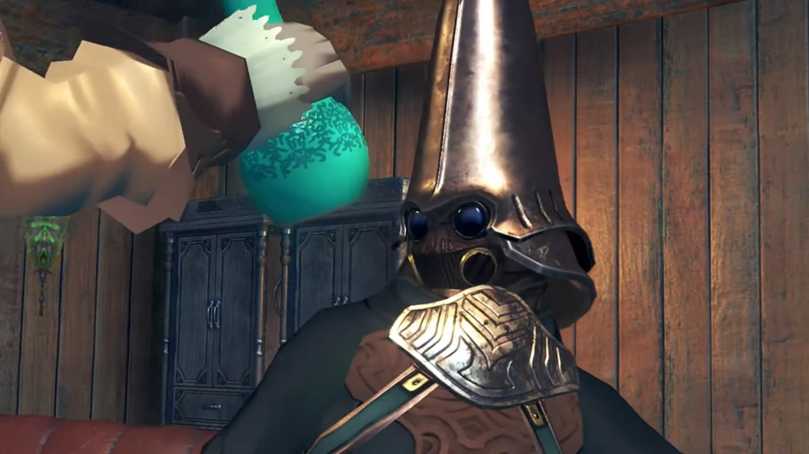
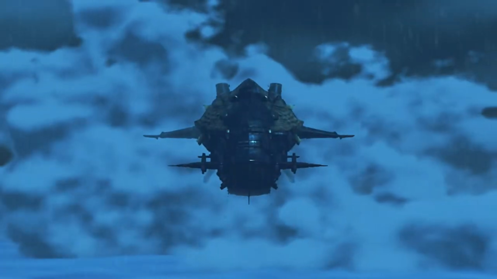

# Gormott, Resonance, and Captured

The town of Torigoth welcomed them with an arc. Wooden plants lined the path, stiffening the crop-growing soft soil beneath. The crowds gathered at the square made the other parts of the town empty. 

"So, this is Torigoth..."

"_It hasn't changed a bit._" Her memories brought her back to when she was living in the town. But are they happy moments? She doubted. 

"Nia?" Pyra wondered. 

"It's nothing. **OK then.** I'll show you to an inn. Then I'm out of here." And they trailed behind her. 

---

> **Translator's note on environment:** Most buildings single-storey high, made of metals. The horizontal windmill is the tallest man-made structure in town, exceeded only by the giant tree that shielded them from rain and wind and sunlight. Some extended their housings in their front door with a make-do roof, laying out goods and supplies for onlookers to look, and buy. This, is **Torigoth.**

---

As if never been to a town, or haven't been to one for too long, the group gingerly walked alongside, looked left and right; everything was new to them. Passing by a notice board, Nia walked past as if nothing caught her attention; but Jin and Malos's poster stuck high within her viewsight. Something in the back of her mind triggered; slowly and carefully, she tread backwards, till it reached the 3rd poster, hers, then she looked carefully. A fat tiger-looking (female???) sticking her nose and jaws out with sharp pointed nails, with wrinkles and decorations spreading her face. 

"**What the bloody hell is that? Don't tell me this is meant to be ME?!**"

The group stopped right in their path, curious with what did she found out. 

Dromarch spoke the truth, "A remarkable likeness, to say the least..."

"**Oi, did you say something?**" The eyes sharpened on him. 

He realized what words tested her bottom lines. His mind turned around 10 times faster than usual, a quick reply to save his arses, "Ah, er, no. I-I fear they may have _conflated_ our countenances, my lady. **How very awful.**"

"**Offfff.... GRRRRRR!!!**" The other three still wanted to take a look when she landed her claws on the notice, scratched it pieces to pieces like a human paper shredder, and with a bang, raining poster shards. Shockingly they backed away, careful not to tickle her nerves. 

---

"**Fie! Who has the courage to heed the Empire's call?** Your strong heart today, will build a **strong Mor Ardain tomorrow!** Of course, you get *more*, than a salary! **Pension and benefits are included!** Distinguish yourself, and you could even **join the nobility!** For. The. **Glory. of the Ardainian Empire, AND HIS MAJESTY, EMPEROR NIALL!!! Come. Now! WHO wants to be the HERO of tomorrow?!**" 

His strong voice attracted the attention of the passing group. The square lined with humans upon humans, nopons upon nopons, all looking at the empty show. Nobody step up, even if the Core Crystal was placed in front of the 3 soldiers, awaiting the courageous. The middle extroversion soldier was doing the speaking. 

"Hmm... What's the deal over there?" Rex wondered. 

"Driver recruitment." answered Nia. 

"Driver recruitment?"

She shared, "Recently, they've been recruiting Drivers from all over."

Dromarch added, "The pool of potentials, is ever shrinking. They must have run out of candidates in the military."

Rex wondered, "What do you mean by 'potentials'? I'm not sure I follow."

"Just see for yourself."

---

"Don't do it, bro, it's too dangerous! What will we do if something happens to you? Who'll look after us?" Many young Gormotti surrounding a grown-up Gormotti, trying to push him back. Yet his eyes laid not on them, even their plead could not suppress his 'greed'. The roads had not shortened itself, with the children obstacling him for long. Shoving her aside, he walked past with unwavering will. She subconsciously held on to his arm, trying to hold him back. "**P-please...**"

"I-I-I know it's dangerous, but... i-if I can b-_become a Driver..._"

"**Outta the way, pipsqueak!**" He was not the only courageous tester. A grown-up muscular buff Gormotti with all the muscles and six packs he had, walked like a gangster and shoved both the children and the grown up to the floor. They said nothing, getting used to being bullied in town. The lab rat walked in front of the crowd, shouted to himself, "All right, **c'mon Blade boyo! Show me whatcha got! Hroooagh!**" And he grabbed the Core Crystal by hand. "**A-a-a-AAAAAAHHHHHHH!!!**" 

The power transferred from the Core Crystal shook his 'healthy' body. With extreme vibration, tremendous heat released into its vicinity. Without seeing the end result, Nia already predicted, based on experience, "Yeah, he's done for."

"Indeed." Gramps agreed. 

"**WAAAAAAAHHHHHHH!!!**" Black eyes became white eyes, and he could take no longer. Blood splattered from the newly created holes{{footnote: On the video, you saw some 'water' sprayed from his body. That's actually censored blood.}} on his chest, on his waist, fountain high; he fell dead on the spot. Pyra was dumbstruck. What just happened? 

"Oho, **all bark and NO BITE! What a** shame!" The soldier continued his speech, as his colleagues handled the procedure, went forward and held each side of the man's arms, dragged him along to the corpse dumping hole behind town. 

Rex looked aside, covering the scene with his palm, but his eyes looked in between, a struggle between disgust and curiosity, "Eurgh, what just happened? All that blood..."

Nia explained, "Couldn't handle the Core Crystal's power."

Dromarch added, "That's what happens... when someone _unqualified_ touches a Core Crystal. Truly- lamentable."

Rex was confused, "Wait, you need a qualification to be a Driver?"

Gramps suggested, "Perhaps 'aptitude' would be a better word."

"Aptitude?"

The soldier clapped his hands to attract attention, "**Now, is there NOBODY else here, ready to test their STRENGTH for the GLOOORY of the Empire?! Oh! How about you? What say you? Step- forward, sir, with BOLD HEART!!!**" His eyes scanned around the square, found the grown-up Gormotti previously he saw was walking up to the stage but knocked down by the now-dead corpse, summoned him. 

"_Nooo..._" Their pleading does not help. The death of a muscular Gormotti could not stop him from treading bold steps forward. He could hear no longer, see no longer, except for the Core Crystal, at the very center of his vision. 

But he did gave his final words as the guardian to the children, "Don't... Don't worry. **Your big bro's gonna be a Driver, and then we'll be set for life.**"

All in chant, "**Don't do it!**" 

But too late. He already laid his hand on the crystal. Energy transfer started with great heat emanating from, "**Ah-ahh-ah-AAAAAAAHHHHHH!!!**"

Nia can distinguish, pointed out, "There's your 'aptitude'." Rex couldn't distinguish, but watched the process nonetheless.

A bright light swallowed the bro, the core crystal gone before his eyes. The ball of energy transformed into a spear, before his surprising eyes. All that uncertain and the sour-bitter of life, all gone with both grips on the pole. Another ball of energy fell down like meteor, he turned and saw his humanoid 'standard' Blade{{footnote: Those non-special blades}} came to life. 

With elation, he called out, "**I... I did it!**"

The children were elated, surrounded him with constant chatter, "You did it!"

"I don't believe it!"

"Oh wow!"

Pyra was content at such scene, walked forward to look closer. Rex noticed something else, "The Core Crystal turned into... a weapon?"

Gramps: "This is how Blades, are born, Rex."

"What? But when I touched Pyra's..."{{footnote: Ahem, Pyra's where?}}

Nia cut him off before he could speak more, "She's a special case. Pyra is the Aegis, remember? So the usual rules don't apply. All that business with sharing her life force... It's- not- exactly normal." 

"Wait, what does 'the Aegis' even mean?{{footnote: Gramps was stretching behind him.}} Jin and Malos... They called her that, too."

"Dunno. **All** I know is that it's some kinda legendary Blade. Why don't you just... ask her yourself?" Pyra's eyes looked to bottom left of her for a moment, before turning back to the scene. 

Without hesitation, Nia suggested while leaving, "**Let's go.** No point sticking around for the enrollment ceremony and all that boring stuff." Rex gave Pyra a gentle touch on her shoulder. She gave one more look at the scene before catching up alongside. 

---

The continuing path lead a downward slope, below a bridge they passed, when Rex stopped, his mind still lingering in the blood and Blades, voiced his thoughts, "This whole thing with Core Crystals, **touching** them to create **Blades**! It's pretty amazing when you think about it."

Pyra shaped the process, "We Blades start out formless, anchored to the world... only by our Core Crystal. Only the **touch**, of a potential... can imbue us with form, and being. And it is by these forms, we come to be known."

Gramps concluded, "So you see, my boy, in some ways it- is- only- the fated touch of a Driver, that allows the Blades, to exist at all."

"**Wow!** Why does it happen that way, though?"

"Now that is something no one knows. It's just how it's **always** been."

Dromarch added, "Blades come- in all- shapes- and sizes. Some- human-shaped, some- not."

Nia: "Some people say the shape depends on the kinda person the Driver is."

Pyra: "The resonance between, Blade and Driver, is a _mysterious_ thing."

> Rex recalled, "Pyra... She was, crying when I met her. Was she brought to life by someone once, just like a normal Blade?"

Thinking in his mind, "_What is the Aegis, really?_"

Before he could think or ask further, soldiers approached from behind, instructed, "Halt! Nobody move!"

They turned to see what's going on, when the direction they were to go also had soldiers. They were sandwiched in between, with no other ways to leave. 

Making a circle, each guarding each other's back, Gramps exclaimed, "Oh dear... Looks like... imperial troops."

Nia: "Great."

Rex: "Hey, what's going on?"

The soldier answered, "That fugitive, in your company is an enemy of the state! A member of Torna!"

"Nia, a member of Torna?"

"It's her all right. Gormotti Driver, white beast-form Blade. She looks **exactly** like the wanted poster." 

"What wanted poster?"

"See for yourself!" He took a replica of the tiger-looking-ugly-monster drawing Nia had clawed to shreds not long ago. 

"Wow, it really does-..."

"**Oi, watch it!**" That tickled her nervers. 

He's swift at saving his arse, "Ah, uh, I mean, **no way! This doesn't look anything like... Wait,** we've got no time for this! **Who cares if it** looks just like her?" And she hissed at him immediately. 

The soldier neither cared, "Hmph. Now as for you... You look like- a Driver too. Registration number?"

"5...3...9...?"

"Knock it off, _you fool._ All new Drivers must register with Indol! No number means you must be an **illegal, unregistered,** Driver!"

"**No, you don't get it!**"

No excuses he accept, "**You're coming with me! We'll see... what the consul has to say about this!**" 

Nia softly shared her plans to "Rex, Dromarch and I are gonna make our move. Get ready to run."

"We're not leaving without you."

"**This is _our_ problem, not yours.**"

"I'm pretty sure he wants to arrest **all** of us. So this **is** my problem, too!"

"Sheesh, you're a _stubborn_ one, ain't you?"

"Gramps says the same thing."

"**OK. we go on three. We'll go left, you go right.**"

"OK!"

Pyra: "Just give the word."

Nia: "OK, let's do this!"

The speaking soldier were shocked, backed one step, stutteringly muttered,  "Y-y-you're going to resist? Seriously?"

"One... two..."

"**Haaaaaa-A-All right, men! We've got them outnumbered -- move in, and take them down!**" 

"**THREE!!!**" And the battle begins. 

---

"**They're... so strong! Such strength from a measly two fighters... They're Drivers, all right!**" The captain spoke while his fellow colleagues were fencing down the groups. 

"**Rex! Now!**" felling all, Nia shouted. 

"**You got it!**" They dashed for the other end of the bridge when blue flames raised from beneath the ground, bridge-high, blocking their escape route. "**Wha-?! A wall, made of fire?!**" 

"Such a commotion." From behind the captain and other soldiers, a blue-purple theme women with fires on the surface of her body, wielding twin long solid metal truncheon{{footnote: 锏}}, eyes forever closed, walked into the scene, spoke with a soft voice, "Just when I thought I could enjoy a little peace, and quiet."

"L-L-L-Laaaaddddyyyy... Brighid!" The captain stuttered at her existence. 

Rex was curious, "Brighid? Is she a Blade? Wh-where's her Driver?"

She answered, "My driver is otherwise _engaged_ at present. I am here alone." 

"No... Driver?" First time he heard of that. 

The captain laughed furiously at his imbecility, "**BAHAHAHAHAHAH!!!** Lady Brighid is the 'Jewel of Mor Ardain'! The **strongest** Blade in the Empire! Even alone, she's **more**, than a match for you! Lady Brighid, these miscreants, are terrorists, working for Torna. Please lend me, your power, to bring them to justice!"

"Torna?" Without eyes, she can still scan the group with her sixth sense{{footnote: 神念}}. Nia had no attention from her, but the girl in red does. "That emerald Core Crystal... Could it, _really_ be true? Well well. Captain Padraig, you are **not** to kill them. Take these ones in alive."

"Roger. **Men, bring the you-know-what!**"

"Sir!" They leave the stage to get their new weapons, while Captain Padriag fought alongside Brighid, waiting for their return. 

---

"**Hyagh!**" Blue flames stretching at the group. 

"**Yaaaaa!**" Red slicing flames going back at her. Shockwaves blew dust in Rex's face, which he shielded. Brighid seemed undisturbed. "Wha-?! She- she repelled our attack!"

Pyra: "She's so... strong."

Gramps reminded them, "Umm, And this is without a Driver..."

"**Stop yammering! Just get her!**" Nia and Dromarch jumped above air, poaching at her. The two soldiers just then gone had returned, fired two nets with amazing accuracy, first trapped Dromarch while still in mid air. Nia shouted back, "**Dromarch! YAAARGGGHHH**"

"Urgh!" They rolled to the ground, wrapped in cocoon. 

"Ugh... Dromarch..."

Captain Padriag proudly explained the new invention, "**This is an ether net! BAHAHAHAHAHA!!! Let's see** you use your precious Arts, when you **can't**, draw ether, from the atmosphere!"

Brighid added, "Even Blades have weaknesses. **This**, is one such weakness. Without the flow of ether, Blades are _quite_ useless."

"**Nia! Dromarch!**"

"**Get outta here, Rex! Save yourself!**"

"**I'm not gonna do that!** I can't just leave you here!"

"**You've got your own mission! Just move it!**"

"Yeah, but-"

"**No buts! Go!**"

Gramps added in the persuasion, "Rex, we must withdraw for now! It's our only chance!"

"**BUT-!**"

"You won't escape." The passing of the bucks had gained Brighid time to raised the flaming circle that encircled the group. Such intense flames scorched the skin of the two as they screamed in pain, 

"**ARRRRGGGHHHH!!!**" They even struggled to keep standing on their feet.{{footnote: Surprisingly, the grass took no hit, remained green and lush despite.}}

"**REEEEXXXX!!!**" Gramps urged. Not much time left. 

"**Ugh, dammit!** Huh?" He hadn't yet taken actions when he heard the whizzing sound from above. A ball with a light in it soared the air, hit the pipe beside the bridge, and out poured water at high pressure. 

"**WAAAAAHHHH!!!**" The pressure washed the soldiers clean and tidy as they crushed into the ground below. 

"Ugh, water!" The flames on her skin sizzled and her strength grown effete. The circle of flames had been extinguished by the 'rain'. Rex and Pyra took their chance, 

"**Now!**", held the sword's hilt together, "**Haaaaaa!!! Burning, Sword!!!**"

"Agh!" The flames cut through the water and burst on Brighid, shielding her face and torso from impact. 

"**Pyra!**"

"**Yes!**" They already turned around. 

Captain Padriag was the one feeling nervous, ordered the soldiers, "**Don't let them escape! Get... after them!**" And the two footsoldiers ran after them. 

Nia was grateful, softly spoke to herself, "_That's right, Rex... Run, and never look back._"

Brighid was equally impressed, did not join the 'getting after them' group, expressed, "To pull that off **despite** all this water... _So, the legends of the Aegis_ were real."

---

Footsteps stamping amidst the dark twisting underground. Limited lights from the crevices showed them the way. Turning around one alley, they heard shouts from behind. "**Hey hey!**" 

The exit to exposure under the sun was just beyond, but they stopped and turned around, despite incomings. Who was that calling? The wooden wall (hidden door) creaked open a small gap, and a Nopon wearing goggles popped out from behind, wavering at them, "**This way, friends, come this way! Tora help you escape!**"

"**Who are you?**" Rex was surprised. 

"**Quick, no time to explain!**" His wings fluttered more furiously, urged. Rex and Pyra exchanged glance, decided to trust the non-dangerous looking potato creature. She nodded back at him, went for the door, and went through first. Rex eyed the direction they were coming from for any signs of soldiers, got behind her. Tora took the final watch, and clink, saw the shadows around the corner, quickly slammed the door behind with a soft thud. The door thus became the wall. 

A short moment and the soldiers came and stopped right in front, but they noticed nothing extraordinary, followed along the path out into the open plains.{{footnote: If your attention was so focused on something, all the gorillas passing through a basketball field you can't notice, what says a bang or a thud that's not loud enough to shook the ground and catch your attention of potential danger?}}

---

Behind the door, they followed Tora along, with Rex asking, "Thanks, you saved us. But I gotta ask... why?"

"No reason."

"No reason?"

He turned around to face them, "_Sorry, that not true._ Truth is, Tora not like those big bully soldiers. Was thinking to test out shiny new Boom Biter on big bullies... That's when Tora see friends running from them. Boom Biter missed and- hit water pipe, but results not so bad, hey?"

"_Oh_, so _you_ shot the pipe?"

"That right."

"And you're, Tora. I'm Rex, and this is Pyra."

"It's so lovely to meet you!" Pyra greeted. 

"Good to meeting! Mehehehehe..."

"Huh?" Rex was confused. 

"_Ahhh_ **Actually**, Tora have other reason for save you."

"Which is?"

"Don't worry. Explain everything when get to house of Tora! **This way!**" And he led them on. 

---

At the other side, Consul Dughall, in his office, listened to Captain Padriag reporting, "The boy, and his Blade, who seemed to be working with them got- away... **But we apprehended** the girl from the wanted poster, along with **her** Blade! **The town is once again safe for-**" The proudness in his tone made his chest high. Yet Dughall was slightly annoyed. 

"Say, Padriag, **do you remember** what my orders were?"

"Sir?"

"I. Told. You. To capture the Blade with the emerald Core Crystal, Did. I. Not? Do you recall me ever telling you, to capture some, little **girl**, with **barely a bounty** on her head?"

"B-B-But sir, s-she's a member of, Torna..."

"I'll say it slowly for you, just so we're clear. Get. The Blade. With. **The emerald-**"

"Umm, Consul Dughall, sir?" Padriag interrupted. 

"What?"

"I-I'm- **not** exactly sure what color, 'emerald', _is supposed to be..._"

"**AGGGGHHHH!!! GIVE. ME. STRENGTH!!! IT'S GREEN, YOU IDIOT!!! EMERALD IS GREEN!!!**" He grabbed the turquoise vase from the top of the table and stuck it to his face, "**LIKE THIS! GREEN! GET IT, YOU CLOD?!!!**"

"**OOOOOOHHHHHH, GREEEEENNNNN!!! I get it now. So, emeralds** are green, huh..."

"**YOU DUNDERHEAD! HOW MANY BLADES, DO YOU SEE, WITH GREEN CORE CRYSTALS?!!! IT'S PATENTLY OBVIOUS!!! HOW DO YOU MIX THAT BLADE up WITH SOME, WORTHLESS CAT MONSTER?!!!**"

Padriag can't wait to correct him, unable to read the situation, "**Actually, sir,** technically I believe that's a, tiger, rather, than a-..."

"**SILENCE!!!**" And he slammed the vase at his nose, brought him down onto the floor. 

"**Agh!**"

"**Consul!!!**" Just during the worst time did a soldier ran into his house/office. 

"**WHAT IS IT?!!! HAVEN'T YOU HEARD OF KNOCKING?!!!**"

"**My apologies, sir! It's just that Lady Mòrag, has...**"

"**WHAT?!!**"

"**Special Inquisitor Mòrag has just arrived from the motherland.**"

"**Already?**"

"**Her ship has just docked.**"

Now that was shocking, "Grk, this... **THIS CANNOT BE HAPPENING!!!**"

---

A giant battleship several storey high braved the cloud sea, sending ripples as it cut the waves skillfully. The battleship was implanted into the Belly of a Titan to provide energy. It drifted towards the dock of Torigoth.

After docking, the hatch opened and out walked Mòrag. She knew why she's here for.

### Footnotes: