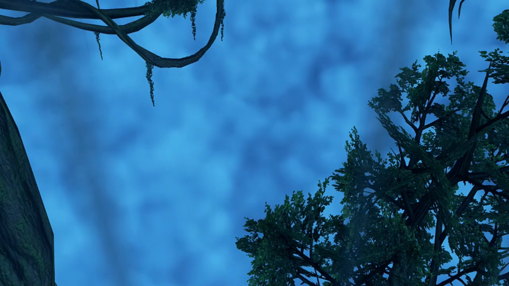
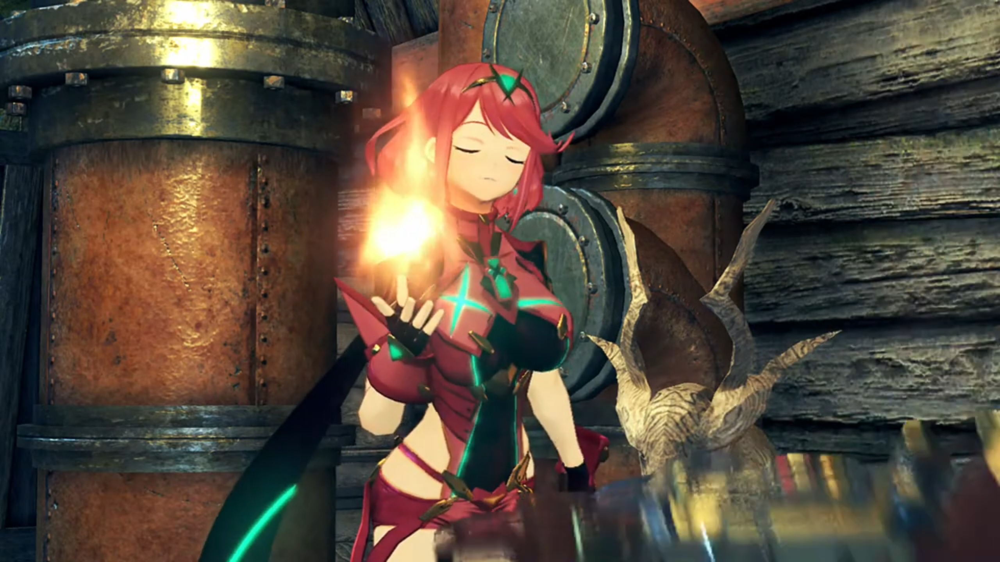
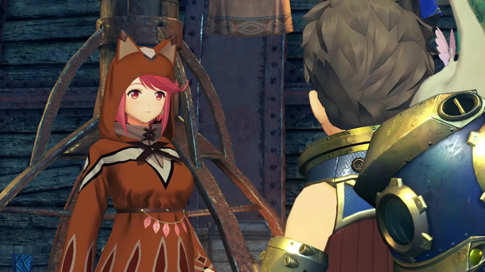
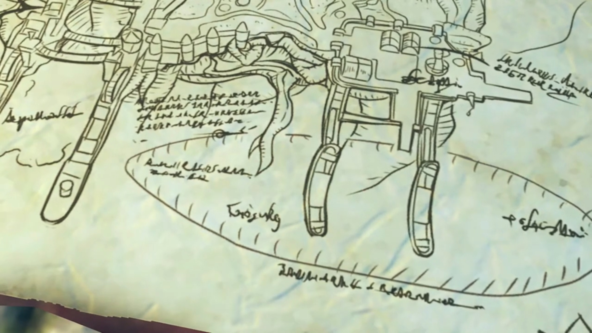
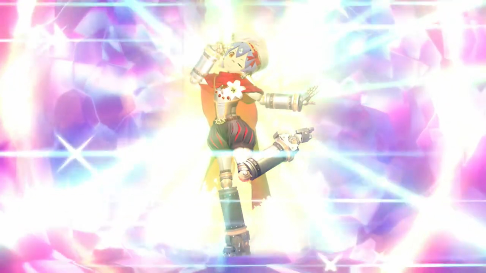
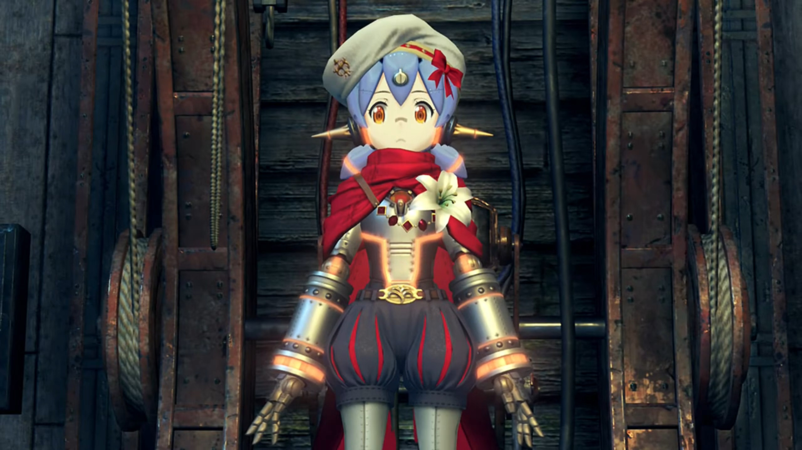
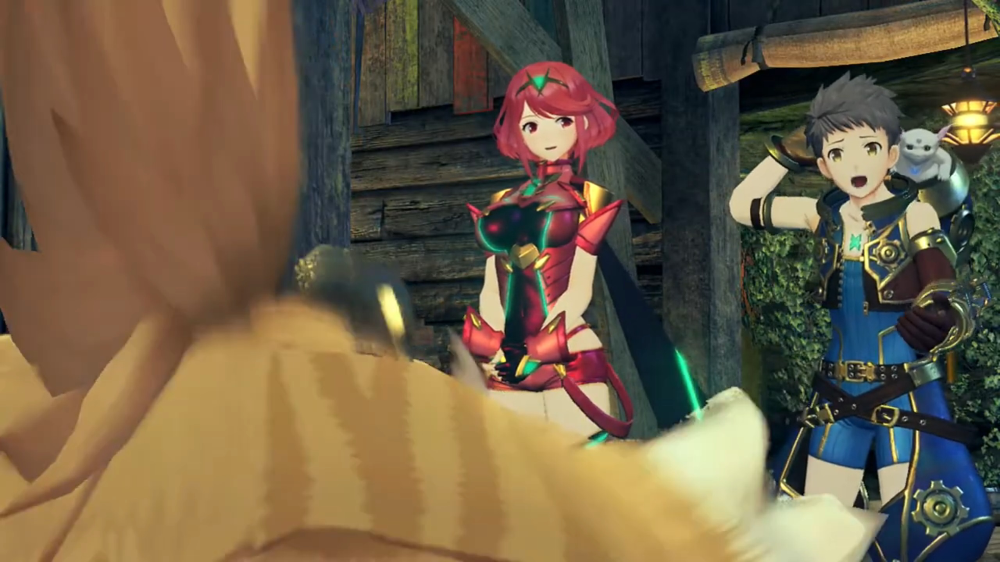
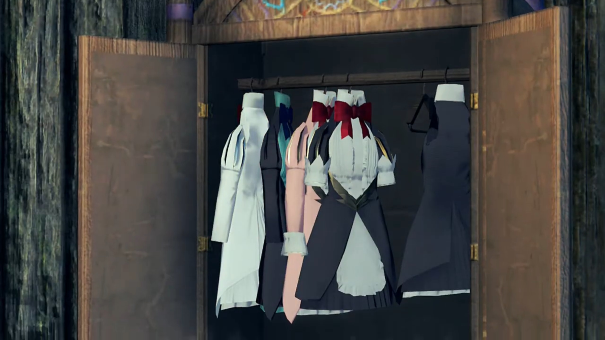
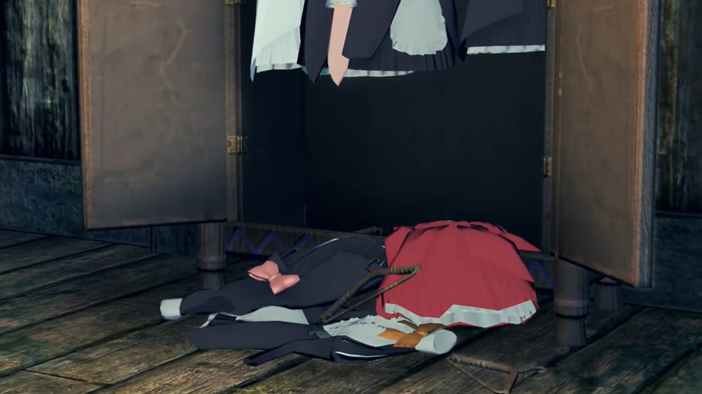

# Tora, Mòrag, and Poppi

===

"You live down here?" Rex was surprised. Tora's house was wooden in a basement. Various mechanism inside, like the cooking stove, and some pipes, plus a few ether lights. 

"This just back door. Front entrance over there."

"Makes sense." When he looked down, "**Whoooaaaa!!! Is that the Cloud Sea down there?** We're so high up!" There were even tree and branches down there. That caught Pyra's attention; she was exploring Tora's house before. 

"Nice view, eh? Tora likes to just sit and watch Cloud Sea sometimes."

Pyra commented, "You have a wonderful home." Perhaps feeling jealous? 

He was proud, "Meheheh! Anyway, um... Rex-Rex..."

"Rex-Rex?" He was walking inner to stand beside Pyra. 

"Rex-Rex. Tora explain other reason I help you. You see... Ugh. Tora always wanted to make Driver friends."

"Ahah! Interested in Drivers, are you?"

"But of course! Tora think it **amazing** how Driver and Blade join **spirits** together to make **big** power! Tora **reaaaaallly want** to be sidekick of Rex-Rex!" Talk about flapping his wings incessantly. 

"**Uhhh, you know my name is just Rex**, right? One Rex, not two."

"What is point?"

"Well, **nothing**, I guess. It just sounds a bit... different, from... what I'm used to." Continually scratching his hair. 

"Doublename just show Tora's respect! **Respect** for great Driver! **Rex-Rex** should be proud!"

"I'm not sure I've earned all that yet... Oh, all right. You can call me Rex-Rex if it makes you happy. But **instead of** all this sidekick stuff, can't we, just be friends?"

"Really? Tora... will be... friend of Rex-Rex?! **Hooray!!!**"

"What a funny little guy." Commented he as Tora was jumping up and down excitedly. "**Hey, Tora! Do you know much about this town?**"

"Huh?"

"You wouldn't happen to know where the army takes prisoners, would you?"

Pyra, all the while listening in their conversations, cut in, "Rex, you're not planning to..."

"**We have to save** Nia and Dromarch."

"I- though you'd say that." says he whom lived with him for long. 

"**Oh! You talk about Driver and Blade who were with Rex-Rex before Tora's daring rescue?**"

"Yeah."

"Mehmeh... Tora would have to ask around town for info like that. Umm... Before we do anything, **time for food!** All of today's running around make Tora hungry. Need food to help Rex-Rex!"

Gramps added, "I'm a little peckish too!"

But he was eager, "Can't we eat later? I want to find Nia and Dromarch as soon as **possible**!" Then his belly rumbled, refusing to help him. 

"Mehehehehheh! Stomach of Rex-Rex tell different story!"

He turned away, "I... I can't help it, can I?!"

Pyra cut in while he blushed, "Um, if it's all right with everyone, I could cook something?"

Rex turned around, surprised, "Pyra? I didn't know you could cook!"

"Heh! Well as- long as fire is involved, I can do almost anything! Fry, steam, grill -- you name it." And she summoned a fire that scared the guys jumping back one step, 

"**Whoa!!!**"

Then she complimented, "If you want ice cream, though... You might have to find someone else."

Rex: "Well, you can't have everything."

---

All worries and thoughts were long gone at Pyra's dishes. "**Oh man! This is delicious!**" as he scarfed down the plate. 

Tora similarly felt like heaven, "**Ohhh yum-yummy!** _So super_ very tasty!"

Even Gramps, holding some food the size of his torso, exclaimed, "Simply. Exquisite! I haven't eaten this well... in 120 years!"

Pyra was overjoyed by their comments. "_Glad you like it! It seems like_ I did OK... I was worried I'd have gotten a little rusty over the years."

Rex rebutted, "**It didn't taste rusty** at all! Uh uh, I mean..."

"But Tora is curious. Pyra is fire-using Blade, yes? When Tora broke that water pipe, Pyra could _still_ make fire!"

Gramps, whom lived that long, didn't turned his brain around anyways with his limitless wisdom, "Come to think of it, you're **right**. That Brighid, the imperial Blade, she used fire abilities... just like... Pyra, but the water... seemed to douse... much of her strength."

Rex couldn't understand, "So... what are you saying?"

Tora explained, "This world **full** of **elemental** energy called ether, yes? Ether, comes in forms like... fire, water, and wind. While battling, Drivers and Blades both draw power from ether. But... fire not good with water. **Other Blade** woman got **splooshy** with water, so... fire powers all damp."

"But Pyra and I were able to use our powers with **no problem.**"

Gramps: "Indeed. They were unaffected."

"Why?" asked Tora, and they all turned to her. She hadn't had the chance to speak while they were speaking. 

"Um, well, m-my powers don't... come from fire."

"Mehmeh? If... powers not fire, why look like flames?"

"Th-that... may be a little complicated to explain..." She dropped her head down. 

"Go on then? Tora like complicated things **a lot!**"

"_Ah, w-well, u-um, I, it..._"

"Knock it off, Tora. Can't you see you're making her uncomfortable?" Rex came to her rescue. 

"_Meh..._" such disappointment for a geek. 

"Everyone has things they'd rather not talk about. Right?"

"I'm sorry. I-I'm sure... I'll be able to tell you about it soon enough."

"Don't worry about it. **Right now**, we need to think about how to rescue Nia." Now that they're full stomach, they could come to plan for the urgent. 

Tora accepted the topic, suggested, "First, we go around town, and find **all** information we can!"

Gramps wasn't sure that would work out properly, reminded them, "_Hmm, yes._ I daresay... that we're all wanted criminals... by this point. Pyra... sticks out like a sore thumb."

"I'm so sorry..."

"**Don't worry friends! Tora has an idea!**"

---

Dughall and the soldiers awaited at the other end of the port, just after Mòrag's ship has docked. After she walked up to them, Dughall prepared his flattery, "**Special Inquisitor Mòrag! To what do we owe this extreme pleasure?** Had we but heard of Your Grace's visit, we could have prepared a suitable..."

She cut his elongated speech off, "I don't... stand on ceremony, Consul. I'd rather you just did your job."

"Y-y-your Grace? **Someone of your standing deserves to be treated as such! You are His Majesty's representative!** Please permit us to lay on a meal befitting Your Grace. Until then, we would be honored if-" He didn't noticed Brighid had sensed her Driver's existence, approaching the dock from afar. 

Brighid knew she don't want to hear such flattery, cut him off with her own, "You made impressive time. _I wasn't expecting you until tomorrow._"

That shocked Dughall, "Ohhhhhhhh L-Lady Brighid!"

Mòrag ignored him, replied, "If we have found the Aegis then there is no time to waste. But I fear the passage has taken its toll- on our engines."

Dughall heard the sensitive word, his precious emerald core crystal, "The Aegis? H-h-how do you-?!"

That's the maximum she can bear. Asked strictly, "Is. There. A. Problem. Dughall?"

"N-n-... urgh... not at all, Your Grace."

"Good. Now, you've captured a Driver from Torna. I am going to **speak**, with her."

"**Wha-?!** Uh urgh Why do you want-"

"Dughall. I don't remember asking for your opinion."

"**Y-yes, Your Grace!** I'll take you to her right away!"

---

In Dughall's office, they found Nia. The poster put on the table, she stood before it, looking at Brighid. The latter wondered why she was staring at her. "Hmph!"

Mòrag asked, "So, you are the Torna ruffian. I must say _you look a little_... **different** from your poster."

"**A LITTLE different?! Whoever drew that** should be the one in jail!"

"Hahahah. Yes, _I would be angry too._"

"You can drop the friendly act."

"You won't name your friends?"

"My friends? I'm not so sure I'd call those trigger-happy Torna goons 'friends'."

"I see. I think we have our wires crossed here. _I am not talking- about- Torna._"

"_Huh? You're not?_"

"No. I **was referring** to your more recent, _traveling_ companions. The Driver boy, and- his- Blade."

Subconsciously, she muttered, "Rex and Pyra?"

"Well. _That was_ easy."

"**DAMMIT!**" She shouted in her heart. Fell for the trap. But she had all she need. 

---

On the other side, Tora found a little red robin hood attire for Pyra. She wore it, exclaimed, "This looks like it could- _actually_ work."

"Good idea, Tora!"

"Right! Let's look for friends of Rex-Rex!" And now they could exit the room. 

---

After they'd gathered the info, they went back to Tora's house to discuss the information. Pyra exclaimed with a fear in her voice, "Nia and Dromarch, e-executed... It doesn't bear thinking about!"

Gramps rebutted, "But getting aboard that warship, will be no mean _feat_. We're going to need an ironclad plan."

Tora: "Army port... is under heavy guard..." The map of the battleship laid out in front of them. 

Rex couldn't think more, "I guess we'll just have to mount a **full-on attack!**"

Pyra immediately reject his stupid idea, "**No, Rex!** We can't put everyone in danger."

"Right, sorry."

Then, she scanned the map for more information. Something caught her eyes, and the aha moment came. "**There!** This is... one of the Grandarbor's{{footnote: The tree that grew in the middle of the town taller than all buildings in Torigoth, shielding it from the sun, remember one's description?}} roots, right? If this map is correct, it goes all the way from the quay... to the hull of the warship. And here. It looks like some kind of cargo entrance. Could we sneak on that way?"

Rex got in sync with her aha moments, "**Oh, right!** No one'll spot us if we sneak in from below!"

Tora added, "Security light around this entrance. At night, not even workers here."

Gramps couldn't think of anything else, concluded, "Looks like this is our only option."

"**Then it's a plan!**"

"Meheheheh!" Such evil laugh he released. They wonder what it's about. 

"Tora?"

He immediately spit out, "Tora- have- something- to- show- you."

---

Drawing away the curtain of the wardrobe, two cylinders with orange ether flowing within in first came to sight, then a metallic head with cap and pointed ears, short metallic hair as if tied around her back, wearing a scarf around her. At her chest was a flower implanted. 

"What's this then?" Rex couldn't distinguish its use. 

"Nobody ever see this before. Secret of Tora. **An artificial Blade!**"

"An artificial Blade?" Pyra was curious. Never heard of it before.

"I can't believe it." Not even Gramps can.

"Tora have **always** wanted to be Driver of Blade. But Tora..." and he got depressed, "Ugh, Tora has no... potential to awaken Core Crystal."

Rex immediately rebutted without a second thought, "How could you know that? Surely you just have to try, and- Oh... You did, didn't you?"

"Yes, one year ago, Tora applied to Driver recruitment man."

Gramps could already recall the guy they saw at the square this morning how he reflects, "Oh deary me..."

Pyra felt pitiful for him, "Oh Tora, you mean you...?"

"It was bad. Tora had nosebleed for three days!" He, by himself, waggling and vibrating in his room alone, without anyone helping him. 

Rex couldn't believe it, "Just a... nosebleed?"

"**What. You. Mean. 'just'? People. Die from loss of blood, you know?!!!!**"

"Yeah, but from a nosebleed?"

"Anyway, moving on!"

No, he don't yet want to move on, commented, "For a near-death experience, you're awfully **casual** about this..."

"**ANYWAY!!!!** Back to Tora's Blade." That's the main topic for today, not for you to satirize me! "When complete, even no-potential Tora can be a Driver!"

Gramps was excited. "This is simply incredible! **You built this Blade** from scratch, Tora?"

"Ungh, it was started by Grampypon and Dadapon. But- Grampypon die, and... Tora still not know where Dadapon go to..."

"Oh..."

With extreme conviction, he swear, "**So Tora** will finish Blade myself and become a Driver like **always wanted!** Then, Dadapon _hear_ about Tora's success, and come back home, yes?"

"Oh, Tora..." Pyra felt a hit in the hurt. Such reasoning for building the blade. 

Gramps had questions, "By the by, Tora, this Blade... As far as I can see, it looks complete. What is there left to do?"

"**Meheheheh!** All Tora have left to do is buy missing parts! But... Tora have no money at all!"

"Oh, really?" Such a reason for Rex to expend on.

"Really." said he, turning around, convicted. 

"Nothing? At all?"

"Not even one gold."

"So... you're asking for a loan?"

"**UHHHH, not... loan, hehe. Um, closer to... generous... donation!**"

Gramps knew it, and Rex face blackened, "Just like a Nopon huhuh. Always shrewd when it comes to gold!"

"**B-b-but if Tora completes artificial Blade, combat capabilities will be... big help on mission!**"

"Well yeah, if it works, you may have a point..." but Rex had many doubts. "So... how much exactly do you need?"

Turning around his face, he said calmly, "**Ohhh**, no more than... _60,000 gold?_"

He jumped with raced heartbeat, "**SIXTY THOUSAND?! D'you want a kidney as well?**"

Pyra urged, "Calm down, Rex. I think we owe Tora our help. If it just money he needs, I may be able to assist."

"Assist? How, exactly?"

Gramps flew in front of Rex's face, strictly speaking, "Nothing illegal, I **hoooope**!" The last word was said with a bang on his head when Rex 'swat the fly' down to the floor. 

"Don't even joke, Gramps!"

She took down the earring on her right ear, handed it to Rex, explained, "This is a natural crystal. I-It should fetch around 60,000."

Rex rejected immediately, "**No way! We can't let you sell that!**"

"B-but..."

The fly had flew back up from the ground, looking left to right as they argued. 

"**Nooo, it wouldn't be right! That's it, I'm paying for the parts myself!**" Trying to be 'manly' and the breadwinner already, eh! 

"Very admirable." said Gramps, but he knew his finance. 

"**Meh meh! Rex-Rex is too generous!**"

But he gritted his teeth, "**This Blade of yours had better be seriously useful, though, Tora!**"

"Leave that to Tora!"

"Well then, let's go, I guess!"

"**Yippee!!!**" And the two already went off, leaving Gramps and Pyra back in the house. 

Pyra wasn't too sure about that. "Will they really be OK?"

"I suppose they'll have to be..."

---

A thunderous night. The town was quiet as a storm approached from the horizon. The strong wind swayed the lantern hung upon a thread in Tora's house. After Rex had bought the required materials, Tora meddled with the final components for completion. 

"OK! All finished!"

"It's really complete?"

"Very complete. **Just** need to apply **energy charge** to activate!"

Gramps reminded him, "Tora, our friends' execution draws near. **There's no time to lose. Make haste!**"

"I know, I know!" And he put his hand on the giant switch. "Ugh, Okay artificial Blade, it's wakey-wakey time!" He felt nervous. 

"That won't do, Tora!" Pyra cut him off. 

"Huh? Wh-wh-what Tora do wrong?"

"You can't keep calling her 'artificial Blade'! As her creator, the least you can do _i-is_... give her a proper name."

"Oh, um, well... Actually, friends, Tora did think of name for her. Very good name."

Now that's solved, Rex exclaimed, "Nice. Then I guess there's no problem."

Gramps asked, "Well, why don't you introduce us, Tora!"

"**Right. Away!**"

---

With full excitement, he put his hand back on the switch again, "Now... Wakey-wakey! Tora's very own Blade! **Poppi!**"

As he flipped the switch, all the negative charges from the lightning pin above Tora's house were absorbed, making it extremely favorable for the negatively charged lightnings above their head to fill in the gap. A giant strike swayed the whole house as charging occurred. Ether light bulbs, at such unstable electromagnetic field, flickered. The switch itself was charged on electricity, but Tora had left his hand off it. As the energy transferred from the batteries to Poppi's heart, they waited in agony. What surprises would they see? 

Had he failed? "P-Poppi?"

She immediately woke up, with the most sexiest and cutest reaction, "_How may I be of service, Master?_" The love love in her eyes and the vibrant eroticism it exuded, flabbergasted Rex, Pyra, and Gramps. 

Now someone got caught on his feet, "**W-w-w-WAIT A MINUTE!!!**" His wings fluttered with panic as he tried to explain himself off. "**Ooh! Forget you... see that! Tora must change the settings! Kh-khm...**" He turned it off, and Poppi went back to sleeping state. 

"The settings?" Rex was curious. He cared not answer them, immediately typed on the switch (which had a keyboard integrated on it) to reprogram Poppi. After some furious meddling, he hope he felt relief, "Ahhahahah, th-this time- should be- OK... Second time go best! **Powerrrrr... on!**"

Again he triggered the switch without waiting for any potential investigation. Once again, lightning were attracted and shook the house once more as Rex waited full of doubt, and Pyra felt a little shy about it. Gramps felt about the same as Rex. 

Slowly by slowly, Poppi tilted her head up, opened her eyes, and spoke with an AI sound, "Greetings, Masterpon."

"I... **I did it!**" Now the group saw magic before their eyes! "Tora's masterpiece! World's first artificial Blade... Poppi!"

Rex: "**Whoa!**"

Pyra: "**Incredible!**"

Gramps: "**That is really quite something!**"

"Tora did good, huh? You impressed? Tora is a very big success?!"

Rex didn't hold back, "Absolutely! You're amazing, Tora! Though, I was pretty surprised before, when she was all... you know..." Scratching his head for that reaction. That tickled Tora's nerves -- **they did not forget!!!** Pyra eyed Rex from the side of her eyes, secretly trying to see what's his reaction to. 

"**Forget about it! That not Tora's fault! Th-that was, um...**" Who can be the scapegoat now? "**Grampypon! Grampypon Soosoo made settings! Yes, definitely Grampypon's fault!**" Poppi eyed Tora from the side of her eyes at his reaction, and Pyra bent forward and gave him 'the look' in his eyes, 

"Are you... _sure, Tora?_"

His backbone and muscle stiffened, but he cannot lose his image now, "**Y-yes, Grampypon... heh yes...**"

Then, Pyra eyed to the right, and Tora followed glance to see what's it. "**MEHMEH!!!**" The wardrobe to the right opened and revealed a set of maid dresses hung inside the closet. To the bottom laid bare some more dresses that didn't got hung up. 

Cold sweat started dripping down Tora's as all his explanations seemed so effete, caught on the spot. He froze and tried to see what punishment Pyra would give him for that. She decided to let him go this time, 

"Well, let's not dwell on that. Rex! Let's go rescue Nia and Dromarch!"

"**No time to lose!**"

"_Mehmeh..._" Oof. This will be the last time Tora got caught on feet, Tora swear! 

Poppi did not dwell on it either, reintroduced herself, and gave him a bow, "Anyway, my name Poppi. Poppi try **hard**, to make Masterpon proud."

---

On the other side, Dughall was getting angry over himself, "**DOIIJJJJJRRRAAA!!!** That shrew thinks she owns the place, just because she curries favor with the Emperor. If only I'd got the Aegis **myself**, I could have returned **home in triumph**, or sold her, to Bana, **for a TIDY SUM...** But it's not over. I refuse to let this place be the end of me! **I. Will. Not. Be left to rot in this flea-bitten backwater! CAPTAIN PADRIAG!!!**"

The mirror used for communication was placed on his table. At his shout, Padriag came online and answered his favor, "Uh, yessir!"

"**Double the number of guardsmen! Round up** whoever you can find! We're going to find that Aegis before **Mòrag gets her PAWS ON HER!**"

"**Sir! As you wish, sir!**" Little did they know, Brighid was outside the window eavesdropping to their conversation, and his outvoiced inner thoughts. 

"_Watch and learn, Mòrag Ladair. Heh!_" Brighid got all the info she needed. 

### Footnotes: