# Prison Break, Pyra's Flames

===

"There is Titan warship!" The group was looking from the edge of the town. The ship parked in front of them, tall and huge. 

Gramps: "Mmm. Quite the impressive Titan. Another sign that Mor Ardain... is readying once more for war with Uraya."

Rex glanced at something else, "Look! That root goes **right** to the ship, just like Pyra said."

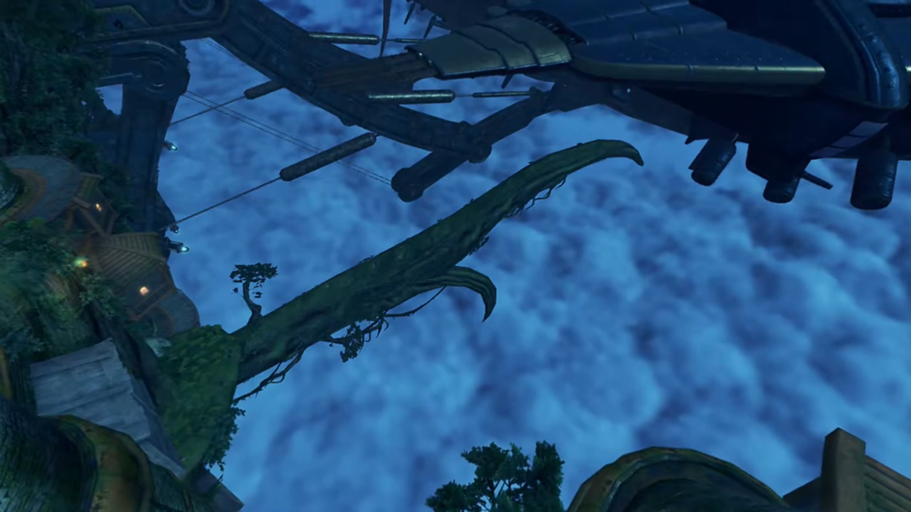

"Yes, yes!"

"We **should** be able to climb down over here. Let's go!"

Pyra: "OK!"

"Off we go!"

Poppi: "Understood."

---

Reaching the tip of the root, the group looked up at the duct they were to enter from. "Looks pretty high... Gimme a moment." He shot his anchor up there, against gravity it flew up straight, and stuck to the edge. At one pull, up he went. Pretty handy, eh! Lowering the anchor back down, he called out, 

"Pyra, you first. I'll pull you up, so **hold tight.**"

She was very hesitant. Slowly by slowly, she reached for the rope. As he clicked, he fell to the ground, "Gh... So... heavy!"

With full force, he could not move Pyra up an inch. She already stood herself on the anchor. 

"Wh-what did you say?!" Surprised, she jumped off the anchor, and the rebounce shook him off balance backwards. 

"**YOW!!!**"

Gramps, his guardian, had some lessons for him, "Now look here, Rex. You can't. Just go and call a lady. Heavy."

Tora overheard, "Ooh, Rex-Rex a little tactless..."

Pyra covered her blushing face, "Huh Sorry about that, I guess I was just... surprised!"

Rex was panicking, "**No no, it's not your fault, I-...**"

Tora: "Ooh, she heavier than Tora for sure! **B-but that just mean** Pyra grown to impressive **height! It is good thing!** Pyra should be **proud!**"

Poppi had grown tired of hearing their conversations. Gathering energy on her leg, the boosters powered up, releasing lots of smoke, she zoomed up to the entrance, brought up by her rocket booster, landed with a slam in front of Rex, said, 

"Poppi pull Pyra up. Please... grab again." And she took Rex's anchor and lowered it. Pyra tried once more, very carefully. But she hold tight, hopefully nothing of the sort happening once more. 

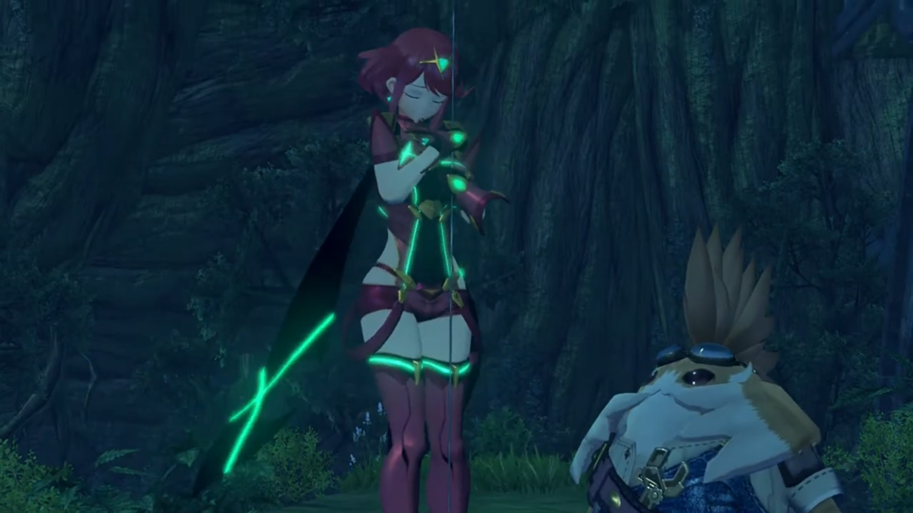

One step by one step, it moved for sure. 

"Niiice, Poppi."

"Poppi artificial Blade. This is... noooo problem. Poppi could lift Gonzalez if necessary." Well, the blush on her cheeks when she heard herself being compared to a Gonzalez{{footnote: A Giant three-storey tall Gorilla.}}.

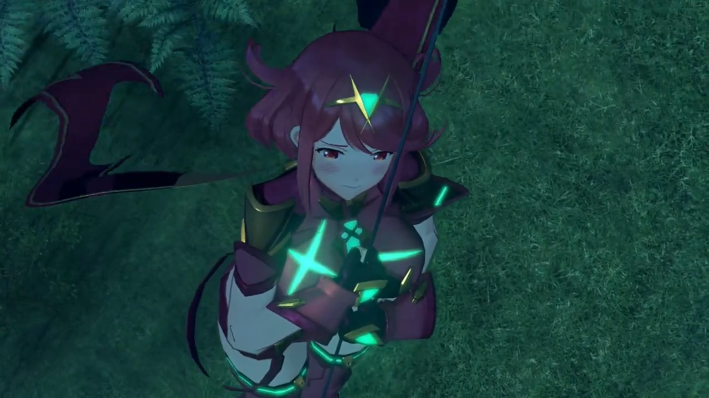

---

They got themselves into the ship, but it was a complicated twist. Luckily, "Masterpon, Poppi can feel, there is a Blade in the vicinity."

"Huh, but... how can Poppi tell that?"

"Unclear. Poppi feel other Blade like wave in air."

Rex: "Huh. I'm not sure I get it, but... **maybe Dromarch** is nearby!"

Pyra suggested, "Let's try opening up some of these doors!"

---

Dromarch was resting alone in his cell when he heard something from outside. He got ready for whatever battle was to come, walked near the door. Just then, a red dot appeared from within the door, grew larger and larger; without reaction until the last second, he ducked down just in time before intense flame was thrown above him. A hole was created through the door. 

Pyra felt nervous, "Umm... I-I didn't hurt anyone, did I?"

Rex: "Everyone check your eyebrows!" They walked forward to look through the hole Pyra created. 

"I'm sorry! It's hard to judge the power sometimes..."

"Pyra! Rex!"

Gramps: "Dromarch! It's good to see you alive."

"**It. Very good!**" when the potato popped in front of those others and exclaimed. 

"**See, Masterpon? There was a Blade here.**" she and her Masterpon totally covered the view of those others behind. 

Dromarch was so confused, "Master Titan and... Forgive me, but... who are they?"

---

That's an answer for later. They got him out of his cell, Rex asking, "Dromarch, we don't have much time. Do you know where Nia is?"

"But of course. We are in resonance after all. I _feel_ her presence."

"**Then let's go! We can't let her get _executed!_**"

"Indeed. This way!"

---

They found it. Dromarch answered, "No doubt about it. That's the place." Two soldiers were guarding outside the cell, pointed their guns at them when seeing strangers incoming, 

"**Who are you people?**"

"They are the terrorist's friends!"

Rex: "We are her friends, but I won't let you call her a terrorist" And the battle begun. 

---

Meanwhile, inside the cell, Nia was cuddled up herself, recalling memories. Once a long time before, she used to cuddle up like this, and that's when Jin walked up to her, lent her a hand, and she took it. 

"Ahh!" The noise of metals clashing outside her cell shook her out of reminiscing. The handle of the door turned, and it opened up slowly. Her first thought was, "Jin?"

"You all right, Nia?!" But no, it's someone else. Rex had shown up, surprising her. That wasn't who she'd expected, but

"Rex, you..."

Dromarch walked in beside him, "My lady. Apologies... for my late arrival." And he bowed before her. 

She took a while to muster the words of gratefulness, "Don't mention it. I didn't think anyone was coming at all."

Rex: "As if we'd leave you! **'Always help those who help you.'** That's the second rule of the Salvager's Code!" And he lent her a hand. 

She took it in her hand, replying contently, "Well, that's you all over, ain't it."

Meanwhile, "**Rex-Rex! Tora has found escape route! Hurry, hurry!**"

"_A Nopon?_"

Gramps: "He has been of some assistance."

Rex: "**We made a new friend!**"

Nia: "_Uh,_ nice to meet ya."

Gramps urged, "Well, I think we've overstayed our welcome here. Time to get moving!" Meanwhile, above Tora, Pyra's head appeared; and above Pyra's, Poppi's. All smiling back at her. And Gramps had somehow climbed above Poppi's head, hung there like a lizard. 

---

The group ran for the escape route, stopped inside a warehouse-looking chamber with a door locked (the light was red than green) in the distance. Sunlight shone through the bottom of its creek{{footnote: Doors aren't always covering the bottom of the floor, some leave space, for exchanging air, necessary for non-air-con room to not aggregate carbon monoxide.}}

"Not much further to exit!" exclaimed Tora.

"**Not so fast, my dear intruders.**" Tee door opened and the Consul entered from behind, with a giant robot holding a giant hammer. "Letting a terrorist from Torna out of my grasp, would make me look very bad **indeed**. Ahhhh, that emerald **Core Crystal!** You **must** be the Aegis! _Much as it pains me to admit it, it seems Mòrag was right on- the- money._"

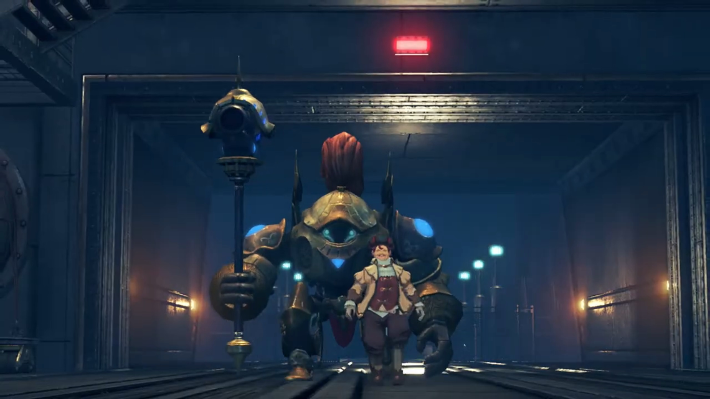

Rex was surprised, "You know who Pyra is? **Are you trying to capture her too, you ratbag?**"

"Now now, language. But of course. The most **powerful** Blade in **all of history**, with the **power** to rend **Alrest asunder**? Only a _fool_ would know of that power and not seek to claim it! And **I am no fool! Therefore,** I will claim her as my own! You **cannot argue** with such _logic!_"

Such stupidity to argue logic in front of a computer. Poppi exclaimed, "Flaw detected in final step of logic."

That's not important. Nia stepped up, "Sorry, pal, but you've done alllll that capturing you're gonna do today."

"**Such impertinence for a dirty terrorist.**"

Rex, drawing his blade with his fellow teammates, called out, "Let's go, Pyra!"

"**Got it!**" And the battle begun. 

---

Mid battle, Rex exclaimed, "That coward... He's just hiding behind his Blade!"

"What? **Does common sense** elude you? **A Blade can regenerate** from **any** injury! Whereas if **I** die, my Blade will return to a useless **core**!"

Nia can't believe he think "**So it's OK to use them as a living shield? You weasel. Even if** they can regenerate, that **doesn't mean Blades don't feel pain!**"

"**Hahahah, how cute. The fleabag thinks we should care about Blades' feelings. Hehhehheh,** I wonder if YOU can feel pain!"

---

Defeating him, he can't believe it, "_How...? A mangy fleabag and a bunch of **stinking** kids... My triumphant return... to Mor Ardain... with the Aegis... Orrrrrgghhhhh_" He was turning, on his way to fall down. His Blade had already fell into pieces. 

 Gramps: "Hmph. Out like a light." As if he'd been drunk.

Rex: "That's what he gets for trying to execute Nia."

Nia don't understood what he'd just said, corrected him, "What? He was trying to take me back to Mor Ardain." Then realized, "**Rex, this is a trap!**"

"A trap? So they weren't actually gonna execute you?"

Tora felt nervous, "**No time! Talk later, Rex-Rex! We should escape!**"

"**Masterpon is right. Chance of reinforcements** very high."

Gramps urged too, "Let us make haste. Getting out of town, would be a good start!" They quickly dashed past, leaving the still alive but unconscious two lying on the floor. 

---

The group were dashing for the back entrance when blue flames rose and blocked their way. 

Pyra exclaimed, "These flames again!"

Rex recognized it, "It's her!" Looking behind the flames, Mòrag held the twin truncheon and entered the scene, with Brighid trailing behind. 

Nia: "And with her Driver too, this time."

Dromarch introduced, "That's Mòrag, the Flamebringer!"

"Mòrag?" Rex wanted to know more. 

"Special Inquisitor, Mòrag, of Mor Ardain. The most powerful Driver in the Empire... and wielder, of Brighid, the most powerful Blade."

"So together they're, like... ULTRA powerful?!"

Pyra noted, "It looks like they were waiting for us."

Gramps agreed, "Yes indeed. I did feel like we got away a little too easily."

Mòrag now spoke, "I don't know why I expected Dughall to slow you down at all."

"It was you, right?" Nia matched the puzzle. "You're the one who spread the rumor that I was going to be executed, **just** to lure Rex and the others here!"

"You catch on quickly. Yes, you certainly proved useful. However..."

"Rex and Pyra are the real prize."

"_Hah_, not quite. The emerald Core Crystal... is the sign... of the Aegis. If that Blade is indeed the Aegis... _then there's something I **must**, do._"

"What do you mean?"

"The power to sunder Alrest itself... I **cannot allow** that to happen again."

Rex was confused, "Pyra, destroyed the world? Don't be so stupid!"

"You mean you didn't know? Five hundred years ago, during the Aegis War... The Aegis, sank three continents, to the Cloud Sea's bed."

Shocked, he exclaimed, "Three Titans... destroyed?"

"I speak naught but historical fact." 

He and others glanced towards Pyra, hoping she would explained; but she looked away, not denying. But he chose to believe, "I'm onto you! You want to use Pyra as some kinda weapon! We're **not** gonna let you do that!" He then walked in front and shielded Pyra. She was a little surprised, but still felt guilty. 

"That is precisely the kind of scenario that I mean... to prevent."

"And what if we resist?"

Her truncheon is made of many sections{{footnote: 节}}, extended and released, it became twin whip. "Then I will have to restrain you by force."

"In that case, I'll make this nice, and clear. **You. Will. Never. Take her!**" Pyra was glad that her teammates chose to trust than doubt. Together, all joined the upcoming battle. 

"**Hah!** Then let's see... if you have the strength... to back up those words, boy!" And the battle began. 

---

"**ARGGGGHHH!!!**" Her flames are so strong one whip knocked everyone out of balance, dragged along the ground. Tora crashed onto Poppi, while Rex hugged Pyra, dragged along the ground with sword stuck into it. 

"What?"

"**Harrrrrggghhhh!**" Mòrag was coming after him, the whip attacking as he pulled his sword out to defend. But the strength was so strong it knocked Pyra out of his chest, and both separated. 

"**Urggghhh!!**"

"**Pyra!**" No time to go for her, as he still had to fence with Mòrag himself. Pyra meanwhile had difficulty trying to get on her feet, seeing him fighting alone. 

Until one whip on his wrist, his wrist caught fire, and he released the sword, caught it with his other hand. The pain he felt resonated on Pyra. 

"Stubborn child. Why don't you just, **give it up?**" And she made another whip. Again, Pyra felt the pain at the same spot. 

"**Grrrrrraaaaa!!!**" Rex stood up and went for Mòrag once more. "You'll never get Pyra!" 

Even when he looked drunk, about to fell to the ground, he never let loose the sword on his hand, pointing at her, as he backed up to where Pyra knelt, "She's more than just the 'Aegis' or... some kinda weapon! **She's a living being!**"

Upon reaching her, he held out his free hand to Pyra. Do she want to take his hand? Gramps gave her a nod, and his eyes was comforting, so she did. "Pyra has somewhere she needs to go. And I'm **gonna** help her. I'm not gonna let you **stand** in her way!"

And he summoned more flames that blazed the sword, using Burning Sword at Mòrag. She easily blocked it with her truncheon; the flames slid around her, forming a bow shock. 

"This is getting tiresome." She had had enough. "The power of the Aegis is formidable, but the Driver's skill betrays her..."

More and more flames splashed at her, but she summoned the flames of Brighid that extinguished Pyra's flames. Brighid now entered the scene. "Stay vigilant, Mòrag. An **unknown** power lurks within this foe."

"But of course! This Blade he calls Pyra... Your flames burn far stronger than hers. But... her flames hide _something deeper._"

Rex and Pyra were exhausted; while they were still standing, they were having difficulty enduring the fight. Pyra stayed closer to Rex. 

The others hadn't had a voice for long. Rex was wondering, "Is everyone... all right?" They looked behind, found Nia and Dromarch just standing on their feet. 

Nia effetely replied, "_Hangin' in there!_"

Poppi flipped her feet and somersault her masterpon, still in her arms, up on his feet, "Those two... very strong!"

Holding the sword with Pyra, Rex replied, looking back with her on the door still shielded by flames, "I know. At this rate, we'll never... There has to be a way... Some kinda..."

Ding! What happened last time? She summoned flames, and Tora threw a bomb and missed, hit the pipe, and it extinguished. "She's a Fire Blade. We gotta find... water." He looked around exasperatedly, until a tank caught his eyes. "**There!**"

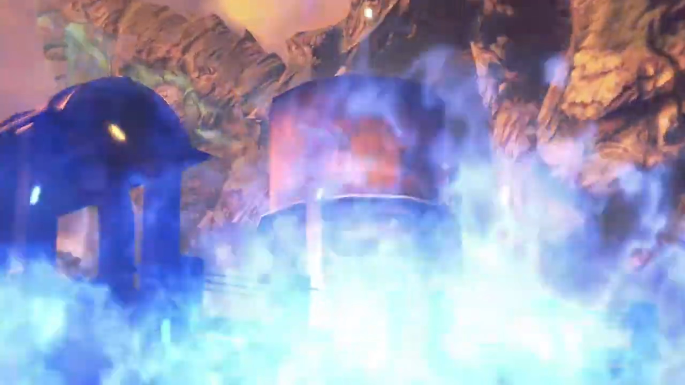

He gripped tight on the sword, called out, "**Guys!** Are you ready to run?"

Nia was confused, how are they to? "Hmm? Sure!"

"Then follow me!" All dashed towards the water tower. Mòrag, watching behind Brighid flames, slashed away the flames in front of her and see what they were to do. They were dashing through the entrance. 

"Ah, there they are." She therefore ran after them. 

While running, he already tucked the sword behind him, asking, "Pyra! Can you manage a full-powered blast?!"

"**Yes! Maybe one or two!**"

"That'll do!" Dashing through the fields leading them back into the town, he stopped, and the others followed suit.{{footnote: Tora wield a giant drill weapon.}} They were now in a pit, lower ground than the rest, including Mòrag and Brighid whom caught up with them. This is the battlefield they chose? 

"**GRRRRAAAAHHH!!!**" He summoned full power Burning Sword, "**Take. This. YAAAHHHH!!!**" She already blocked it once, knew how strong it is and how easy it is to defend, so she doesn't worry. 

"You're getting _predictable_, boy!" Again, a bow shock formed as the flames dashed behind her. "**Harrrghh!!**" The flames changed direction and seared the four legs of the water tank behind Mòrag. She didn't notice. Looking up, she saw Rex and the others running away instead, climbing up the little hill out of the pit. 

Rex turned around, prepared his anchor, and called back, "Look who's talking!" The anchor aimed itself at the water tank and stuck on it. "**Poppi! Now!**" As he pulled it strong, he called out. 

"Roger roger!" Poppi flew and landed beside her, caught on the line, and pull the 'Gonzalez'. 

Mòrag had a pang on her stomach. "Ugh." What are they doing? She looked behind. "The water tank? So that's their plan!" She cannot let that happen, dashed with Brighid towards Rex and the others to run away before it falls. 

To slow them down, Pyra and Dromarch and others attacked them, stopped them in their way, and knocked them back. 

"**PUUUUUUUULLLLLLLL!!!**" With full strength, he strained his muscle. Poppi never changed expression; her joints had been set to full strength anyways. With one final tug, the legs of the water tank came under, and Rex and Poppi ran before the water, uncovered, splashed below.{{footnote: The water tank is opened to catch rainwater.}}

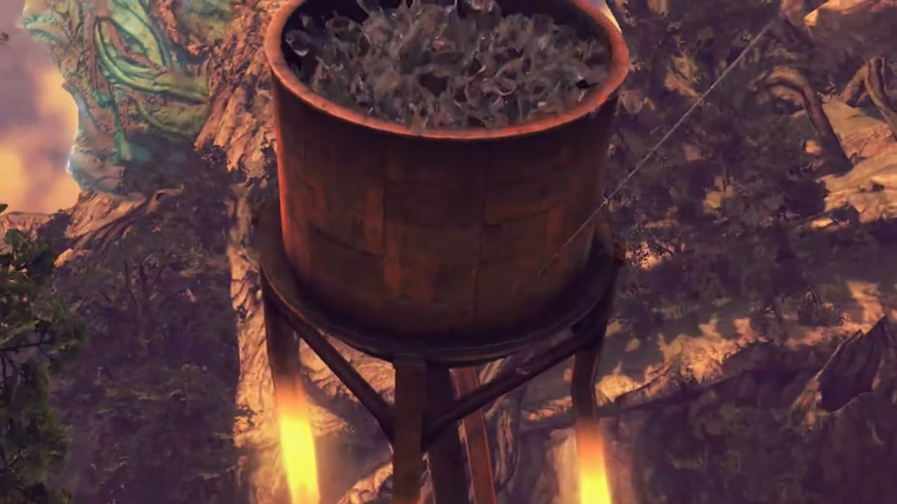

Too late for Mòrag and the others to react. They had been wet. 

"**Urgh!!**" Brighid held onto herself as the flames on her surface dimmed out, groaned in pain. "**Curses!**"

Looking up, Rex and Pyra had the final "**BURNING SWORD!!!**" aimed to finish them. 

"**ARGH!**"

"**ARGGGGGHHHH!!!**" The ripple released by the final hit Pyra could summon was so strong others felt heat rushing through them, even not at the center of contact. A big semicircle of explosion formed that engulfed the whole field. 

After the attack, water was foot high everywhere; the soil cannot soak so much water all at once. Mòrag stood there, waiting for Brighid to get on her feet. "I feel slighted."

"How so?"

"They **actually**... held back against me in battle." The excitement of her tone was clear. Someone as strong as her, she had not met for a long, long time. 

"You think that boy...?"

"Did you not see? He could have struck me with that blow, _but he averted_ his aim."

It took Brighid a while to recall and muster her words, "He did have good instincts, too..." The water tank still fell, the mouth pointing at them. 

Inside Mòrag, she recalled his conviction, 

> _"And I'm gonna help her. I'm not gonna let you **stand** in her way!"_

"The Aegis... If she is traveling with that boy, perhaps it is worth letting them roam free for a while."

"You mean...?"

"We'll cross paths again. And when we do, we shall see."

---

The night fell, and town was far behind. Looking back, they could still see the flares from ether lights glimmering in the distance, but there's no turning back. 

Pyra commented, "I don't think they're following us."

Gramps, "Perhaps we're safe, for now."

Rex: "You're right. We should get some rest. I can't go any further." And he sat down on the grass. 

Tora's face kissed the soil, "**Ahhhhh**... Tora is pooped as well... (yawn)"

Nia thought for a while, said, "See you later," and decided to walk away. 

"Huh?" Rex was so surprised he jumped back up on his feet. What does she meant? 

Dromarch explained while Nia walked away, "We are grateful for all you've done. We wish you well on your travels. Farewell." And he too turned around to catch up with her. 

Rex ran forward, shouted his conviction, "**I want to reach Elysium!**"

"What?" What does that have to do with me, she thought. 

"**I made** a promise. **I'm taking** Pyra to Elysium. It's just... She gave half of her life to save mine. I owe her."

Awww, so sweet. "Ungh, Rex..."

"But half the world seems to be after her. With the... Titans dying off, living space is running out. That's gonna start wars. And people need weapons to fight wars. That's why they want her."

"Hmph." Nia felt uneasy. 

"If I can prove Elysium exists, maybe I can stop the war that's coming. But... Fighting Mòrag taught me something. I'm not strong enough. I can't do this alone. Nia, you're a Driver.{{footnote: Forget about Tora going in between Rex and Nia and danced, trying to held her back, and Rex shoved him to the side, don't bother them speaking.}} We could really use a companion like you... if you wanted?"

"Elysium? Do you **reeeeeally** believe in that myth, kid?"

"Well, Pyra told me that she was born there. **Yet here she is. So it must exist**, right?"

"Hmph. Your logic is almost as good as Dughall's. Listen, Rex. **I don't know** if you're stupid or just too nice for your own good. But what if Pyra's just lying? What if **this is all an act, and one day she turns round and stabs you in the back?**" Her tone got excited, and Tora and Poppi turned around to look at Pyra, see what she's got to say. 

But Rex did not turn back, did not hesitate to rebut, "Pyra wouldn't do that!"

Pyra joked, "Of course I wouldn't! I don't have a knife."{{footnote: One don't know how to describe how she acted. But see it for yourself! 'Sheepishly' doesn't sound quite right...}}

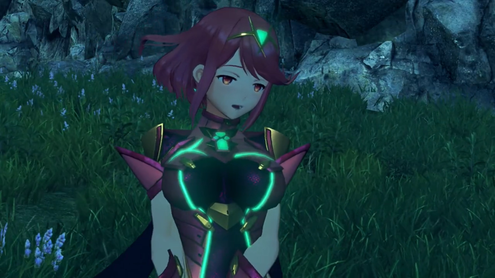

Nia: "So... serious... She... **Bwahaha! HAHAHAHAH!!!** An emerald Core Crystal is the sign of the Aegis, huh...? **Sure, why not. This could be interesting.**"

Rex: "**Really?**"

"My lady!"

"I kinda wanna see this Elysium for myself now. Maybe it really does exist?"

"**It does!**" says he with full optimism. And Tora and Poppi were dancing behind the scenes. 

"An endless field of green among the clouds, eh? _If the legends are true, even people like me..._" She then walked back and joined the group for their journey together. 

---

The night falls deeper as they set up campfire. Tora slept on Poppi's hug, Nia on Dromarch. By the log, Pyra sat beside Rex, helping him clean his wounds. 

"Arrrrghhhh!!!"

"Ah, I'm sorry. Did I wrap it too tightly?"

He tried to assure her, did some extreme maneuver, "**It's fine! I'm fine!** See? I can swing it like this and it doesn't even..." until crack, "**Argh argh argh orgh urgh...**"

"_I knew it._"

"Thanks! I feel much better now." They can now speak something deeper than the playful tone. 

"I'm sure that's Nia's poultice doing its job. **Thanks.**" She shouted over to the ones having sleepy eyes. Her ears raised hearing someone talking about her, opened her eyes, and blink!

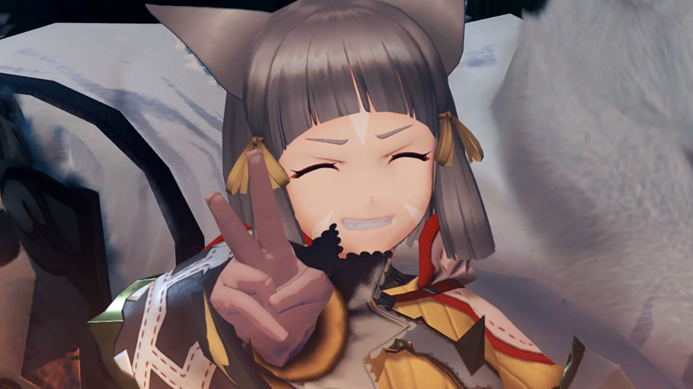

As he looked down, he saw Pyra seriously wrapping the bandage around her wrist as well, the same place where he's injured. She does not speak to him. 

"Pyra, you're hurt too? Are you OK?"

"I'm fine. It's just a scratch." She reassured. 

"Hey, let me help." He took over the bandage and her hand, rolled it around her as she watched, enjoyed the time spent together. 

"Thank you, Rex."

"No worries. Least I can do." The flames from the campfire burnt the rest of the night. 

After some time, "There, all done! How's that?"

She took it up to the sky, felt for a while before answering, "Hmm... Looks good. Um, Rex?" She took a seat closer to him and put her limb beside his. He was slightly surprised at her intimacy. 

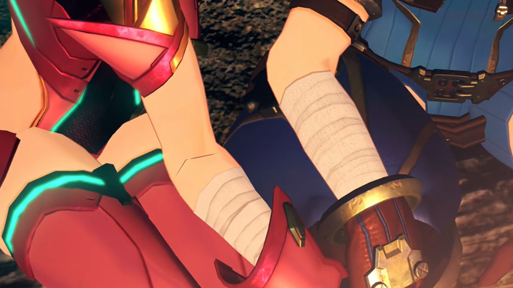

He looked at them for a while, before turning to her face; her attention was on their limbs, as she called for his attention, "Look. They're the same."

"**Oh... uh... yeah... I... guess they are.**" She sat so close he felt a little nervous, heart thumping faster, and hence wasn't listening well. 

"Huhuhuhuh!" She just laughed at that. 

A wind blew and sent sparkles from the campfire flames up in the sky, like the little lights that lit up the world before them. Their journey had barely just begun, and what do their path lay in front? All that they could enjoy, was the beauty up front. The glittery night, decorated by the sparkles, lit up their eyes. 

Gramps was far asleep inside Rex's helmet, snoring, did not disturb the two. Nor does Tora and Poppi, not even eavesdropping. Nia, though, have some final strength to open her eyelids once more, to enjoy such beautiful nights, for who knows what laid before them? Before dozing off, leaving the awestruck Rex and Pyra enjoying the final moments for themselves. 

"So beautiful," says she. 

"Yeah, it really is. I guess... _that's probably because **you** made it, Pyra..._"

"Huh?" What does he mean by that? 

"**AHHHHH, NOOO, WHAT? I DIDN'T MEAN IT LIKE THAT!!! You just, erm, really good at making fires... That's all...**" He was scratching his head, not daring to look at her. Oh dear, what had I just said? He realized it could mean something else. 

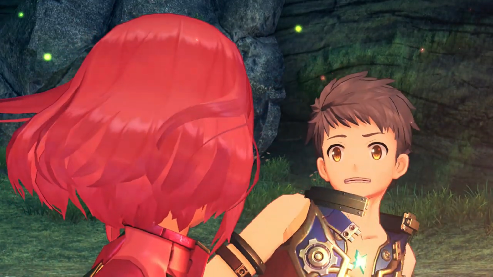

Was he blushing? Pyra tried to look carefully. 

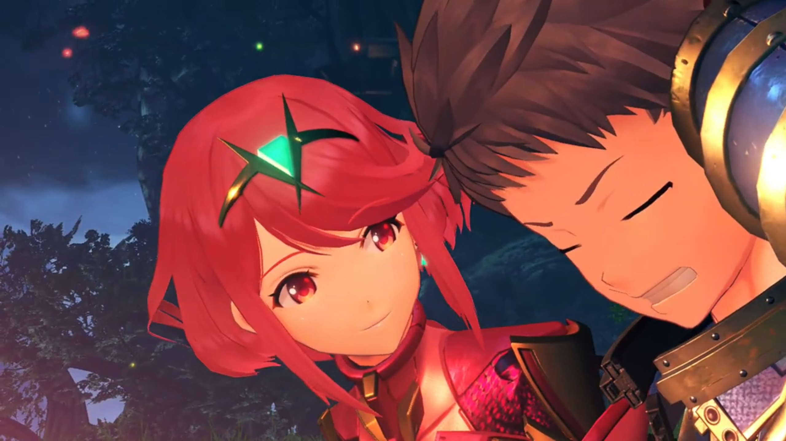

She decided to go with his explanation, with the flick of a finger, called a flames. "Hmph, it's... what I do!"

He enjoyed looking at her making fire. She got closer to her flames, and blew it, spreading lots of sparkles into the air. decorating it further. 

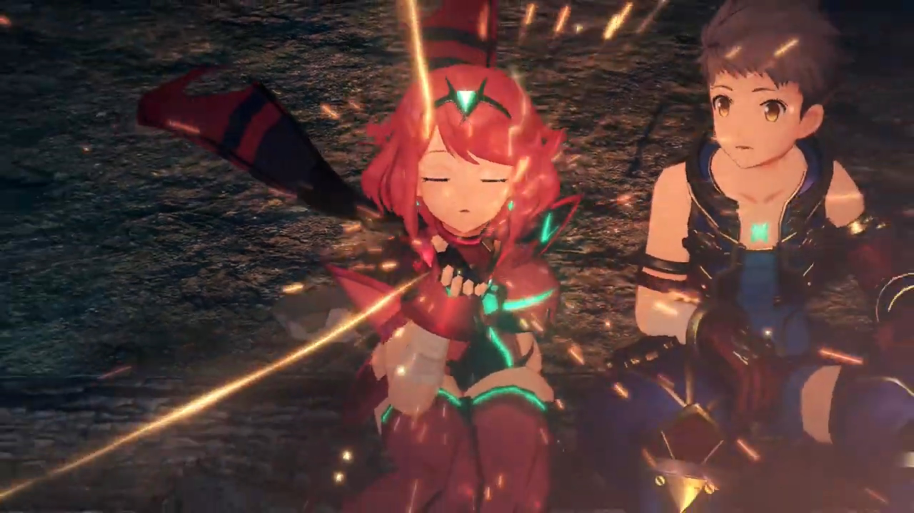

Awestruck he was, such beautiful sights lit up the stars and the World Tree beyond. And together, their hearts. 

### Footnotes: