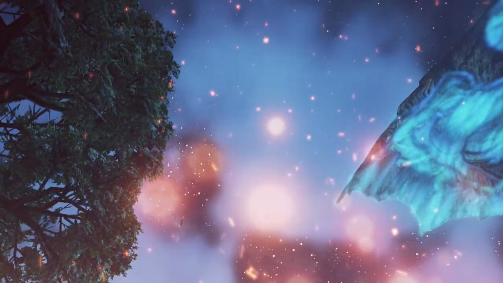

# Prison Break, Pyra's Flames

"There is Titan warship!" The group was looking from the edge of the town. The ship parked in front of them, tall and huge. 

Gramps: "Mmm. Quite the impressive Titan. Another sign that Mor Ardain... is readying once more, for war, with Uraya."

Rex glanced at something else, "Look! That root goes **right** to the ship, just like Pyra said."

"Yes, yes!"

"We **should** be able to climb down over here. Let's go!"

Pyra: "OK!"

"Off we go!"

Poppi: "Understood."

---

Reaching the tip of the root, the group looked up at the duct they were to enter from. "Looks pretty high... Gimme a moment." His anchor wheezed through the air straight up, as if gravity doesn't exist, and stick itself to the ledge. Retracting it and up he go with it. At the top, he lowered the anchor and called,"Pyra, you first. I'll pull you up, so **hold tight.**"

She felt hesitant about the safety, or maybe the heights. Gingerly, she reached for the rope. After standing on it, Rex retracted the rope; but she does not move; he instead went down on the floor.  "Gh... So... **heavy!**" With all his might he tried to pull, but to no avail. 

"Wh-what did you say?!" Surprised, she jumped off the anchor, and it rebounded and shook him off balance. 

"**YOW!!!**"

Gramps, his guardian, offered some lessons to teach, "Now look here, Rex. You can't. Just go and call a lady. Heavy."

Tora overheard, "Ooh, Rex-Rex a little tactless..."

Pyra covered her blushing face, "Huh Sorry about that, I guess I was just... surprised!"

Rex was panicking, "**No no, it's not your fault, I-...**"

While Tora was 'speaking the facts' and 'convincing', "Ooh, she heavier than Tora for sure! **B-but that just mean** Pyra grown to impressive **height! It is good thing!** Pyra should be **proud!**"

Poppi grown tired of listening, launched the rocket booster on her feet, and zoomed up to the entrance, slammed on the entrance duct, mentioned,

"Poppi pull Pyra up. Please... grab again." She took Rex's anchor and lowered it down. Once more, Pyra took it, hoping that nothing of the sort happening once more, hugged tight to the anchor. 

Step by step, it surely moved. 

"Niiice, Poppi." Rex exclaimed. 

"Poppi artificial Blade. This is... noooo problem. Poppi could lift Gonzalez if necessary." Well, the blush on her cheeks when she heard herself being compared to a Gonzalez{{footnote: A Giant three-storey tall Gorilla.}}.

---

They were inside the ship, but do they know where to go? Twist and turn, rooms upon rooms with closed doors. Luckily, "Masterpon, Poppi can feel, there is a Blade in the vicinity."

"Huh, but... how can Poppi tell that?"

"Unclear. Poppi feel other Blade like wave in air."

Rex: "Huh. I'm not sure I get it, but... **maybe Dromarch** is nearby!"

Pyra suggested, "Let's try opening up some of these doors!"

---

Dromarch was resting while looking at his cell door when he heard footsteps outside. Whoever's coming, he had to be ready to poach him down. Ready at the door, it wasn't opening. Instead, a red dot grew from inside, larger and larger, like melting flames. His sense of danger stroke at the final moment, get down just before intense flame threw above his body. 

From behind the door, Pyra nervously asked, "Umm... I-I didn't hurt anyone, did I?"

Rex: "Everyone check your eyebrows!" As they walked over the hole to check who's inside. 

"I'm sorry! It's hard to judge the power sometimes..."

"Pyra! Rex!"

Gramps: "Dromarch! It's good to see you alive."

"**It. Very good!**" The potato popped up in front of those three. 

"**See, Masterpon? There WAS a Blade here.**" she and her Masterpon totally covered the view of those others behind. 

Dromarch was so confused, "Master Titan and... Forgive me, but... who are they?"

---

That's an answer for later. They got him out of his cell, Rex asking, "Dromarch, we don't have much time. Do you know where Nia is?"

"But of course. We are in resonance after all. I _feel_ her presence."

"**Then let's go! We can't let her get _executed!_**"

"Indeed. This way!"

---

They found it. Dromarch answered, "No doubt about it. _That's_ the place." Two soldiers were guarding outside the cell, pointed their guns at them when seeing strangers incoming, 

"**Who are you people?**"

"They are the terrorist's friends!"

Rex: "We are her friends, but I won't let you call her a terrorist" And the battle begun. 

---

Meanwhile, inside the cell, Nia cuddled herself up, recalling memories. A long time ago, she used to cuddle up like now, and that's when Jin walked up to her, lent her a hand, and she took it in hers. 

"Ahh!" The noise of metals clashing outside her cell shook her out of reminiscing. The handle of the door turned, and it opened up slowly. Her first thought was, "Jin?"

"You all right, Nia?!" But no, it's someone else. Rex had shown up, surprising her. That wasn't who she'd expected, but

"Rex, you..."

Dromarch walked in beside him, "My lady. Apologies... for my late arrival." And he bowed before her. 

She took a while to muster the words of gratefulness, "Don't mention it. I didn't think anyone was coming at all."

Rex: "As if we'd leave you! **'Always help those who help you.'** That's the second rule of the Salvager's Code!" And he lent her a hand. 

She took it in her hand, replying contently, "Well, that's you all over, ain't it."

Meanwhile, "**Rex-Rex! Tora has found escape route! Hurry, hurry!**"

"_A Nopon?_"

Gramps: "He has been of some assistance."

Rex: "**We made a new friend!**"

Nia: "_Uh,_ nice to meet ya."

Gramps urged, "Well, I think we've overstayed our welcome here. Time to get moving!" Meanwhile, above Tora, Pyra's head appeared; and above Pyra's, Poppi's. All smiling back at her. And Gramps had somehow climbed above Poppi's head, hung there like a lizard. 

---

The escape hatch was just in front. While the light above is red{{footnote: Which one guessed is locked door.}}, perhaps they can break through? 

"Not much further to exit!" exclaimed Tora.

"**Not so fast, my dear intruders.**" The door opened and the Consul entered from behind, with a giant robot holding a giant hammer. "Letting a terrorist from Torna out of my grasp, would make me look very bad **indeed**. Ahhhh, that emerald **Core Crystal!** You **must** be the Aegis! _Much as it pains me to admit it, it seems Mòrag was right on- the- money._"

Rex was surprised, "You know who Pyra is? **Are you trying to capture her too, you ratbag?**"

"Now now, language. But of course. The most **powerful** Blade in **all of history**, with the **power** to rend **Alrest asunder**? Only a _fool_ would know of that power and not seek to claim it! And **I am no fool! Therefore,** I will claim her as my own! You **cannot argue** with such _logic!_"

Such stupidity to argue logic in front of a computer. Poppi exclaimed, "Flaw detected in final step of logic."

That's not important. Nia stepped up, "Sorry, pal, but you've done alllll that capturing you're gonna do today."

"**Such impertinence for a dirty terrorist.**"

Rex, drawing his blade with his fellow teammates, called out, "Let's go, Pyra!"

"**Got it!**" And the battle begun. 

---

Mid battle, Rex exclaimed, "That coward... He's just hiding behind his Blade!"

"What? **Does common sense** elude you? **A Blade can regenerate** from **any** injury! Whereas if **I** die, my Blade will return to a useless **core**!"

Nia can't believe he think "**So it's OK to use them as a living shield? You weasel. Even if** they can regenerate, that **doesn't mean Blades don't feel pain!**"

"**Hahahah, how cute. The fleabag thinks we should care about Blades' feelings. Hehhehheh,** I wonder if YOU can feel pain!"

---

Defeating him, he can't believe what just happened, "_How...? A mangy fleabag and a bunch of **stinking** kids... My triumphant return... to Mor Ardain... with the Aegis... Orrrrrgghhhhh_" Like a drunk man on his way to unconsciousness; his Blade had been destroyed. 

 Gramps: "Hmph. Out like a light."

Rex: "That's what he gets for trying to execute Nia."

Nia had different info, corrected him, "What? He was trying to take me back to Mor Ardain." Then she realized, "**Rex, this is a trap!**"

"A trap? So they weren't actually gonna execute you?"

Tora nervousness skyrocketed, "**No time! Talk later, Rex-Rex! We should escape!**"

"**Masterpon is right. Chance of reinforcements** very high."

Gramps urged too, "Let us make haste. Getting out of town, would be a good start!" They quickly dashed past, leaving the still alive but unconscious two lying on the floor. 

---

The back entrance was just a minute away, when blue flames rose and blocked their way. 

Pyra exclaimed, "These flames again!"

Rex recognized it, "It's her!" Behind the entrance, Mòrag, holding the twin truncheon, entered with Brighid. 

Nia noted, "And with her Driver too, this time."

Dromarch introduced, "That's Mòrag, the Flamebringer!"

"Mòrag?" Rex wanted to know more. 

"Special Inquisitor, Mòrag, of Mor Ardain. The most powerful Driver in the Empire... and wielder, of Brighid, the most powerful Blade."

"So together they're, like... ULTRA powerful?!"

Pyra noted, "It looks like they were waiting for us."

Gramps agreed, "Yes indeed. I did feel like we got away a little too easily."

Mòrag now spoke, "I don't know why I expected Dughall to slow you down at all."

"It was you, right?" The puzzle is complete. "You're the one who spread the rumor that I was going to be executed, **just** to lure Rex and the others here!"

"You catch on quickly. Yes, you certainly proved useful. However..."

"Rex and Pyra are the real prize."

"_Hah_, not quite. The emerald Core Crystal... is the sign... of the Aegis. If that Blade is indeed the Aegis... _then there's something I **must**, do._"

"What do you mean?"

"The power to sunder Alrest itself... I **cannot allow** that to happen again."

Rex was confused, "Pyra, destroyed the world? Don't be so stupid!"

"You mean you didn't know? Five hundred years ago, during the Aegis War... The Aegis, sank three continents, to the Cloud Sea's bed."

Shocked, he exclaimed, "Three Titans... destroyed?"

"I speak naught but historical fact." 

He and others glanced towards Pyra, hoping she would explained; but she looked away, not denying. But he chose to trust her, "I'm onto you! You want to use Pyra as some kinda weapon! We're **not** gonna let you do that!" He shielded Pyra behind him. She felt kinda guilty, but was surprised at her de facto partner's action. 

"That is precisely the kind of scenario that I mean... to prevent."

"And what if we resist?"

Her truncheons split into many sections, extending into whips. "Then I will have to restrain you by force."

"In that case, I'll make this nice, and clear. **You. Will. Never. Take her!**" Pyra felt glad they'd chose to trust her. 

"**Hah!** Then let's see... if you have the strength... to back up those words, **boy**!" And the battle began. 

---

"**ARGGGGHHH!!!**" One whipping flames knocked everyone out of balance. Tora crashed onto Poppi, while Rex hugged Pyra, sword stuck on the ground as they dragged backwards. 

"What?"

"**Harrrrrggghhhh!**" Mòrag came after him, and he pulled his sword to defend; but it was too late -- her strength was no match, knocking Pyra out of his chest, separating them. 

was coming after him, the whip attacking as he pulled his sword out to defend. But the strength was so strong it knocked Pyra out of his chest, and both separated. 

"**Urggghhh!!**"

"**Pyra!**" He wanted to reach out for her, but he had no choice. Poached by Mòrag, he could not divert his attention. Pyra, seeing him fighting alone, wanted to get on her feet and get alongside him. 

As the fighting continued, Mòrag whipped Rex's wrist, and it caught fire. The pain he felt resonated on Pyra at exactly the same location as they cried out. 

"Stubborn child. Why don't you just, **give it up?**" Defenseless, he rendered another whip, and he and Pyra again felt the same pain on the same spot. 

"**Grrrrrraaaaa!!!**" Rex would not give up, stood up once more and went for Mòrag. "You'll never get Pyra!" 

They separated some distance; she was still in full strength, while he was exhausted. Slowly, he backed up towards Pyra while speaking, "She's more than just the 'Aegis' or... some kinda weapon! **She's a living being!**"

He held out his free hand, offered it to Pyra. She took it on hers after some hesitation and encouragement from Gramps, get on her feet. Rex continued, "Pyra has somewhere she needs to go. And I'm **gonna** help her. I'm not gonna let you **stand** in her way!"

More flames on the sword he summoned, Burning Sword aimed at Mòrag. Yet for the ULTRA powerful, she defend it with no force, holding up her truncheon{{footnote: Truncheon and whip changed form very quickly at her will.}} and formed a bow shock as flames slid beside her. 

"This is getting tiresome." She had had enough. "The power of the Aegis is formidable, but the Driver's skill betrays her..."

More and more incoming flames, but she summoned Brighid's flames and extinguished Pyra's. Brighid, entering the scene, warned, "Stay vigilant, Mòrag. An **unknown** power lurks within this foe."

"But of course! This Blade he calls Pyra... Your flames burn far stronger than hers. But... her flames hide _something deeper._"

Still standing, but already exhausted. Endurance was key, but they had little left. Rex hadn't heard the others voice for long, asked, "Is everyone... all right?"

Nia and Dromarch were just getting on their feet, the former replied effetely, "_Hangin' in there!_"

Poppi sit upright, bringing her masterpon back on his feet, and Tora exclaimed, "Those two... very strong!"

"I know. At this rate, we'll never... There has to be a way... Some kinda..."

Ding! He recalled the last time the water pipe burst and extinguished Brighid's flame the first time they fought with her. "She's a Fire Blade. We gotta find... water." He looked around exasperatedly, until a tank caught his eyes. "**There!**"

He gripped tight on the sword, called out, "**Guys!** Are you ready to run?"

Nia was confused, but "Hmm? Sure!"

"Then follow me!" He led them to the water tower, going around the flames. Behind the blue flames, Mòrag saw their silhouette moved, and she sliced away the flames shrouding their vision. The entrance that they'd been reaching for, they're finally out with. 

"Ah, there they are." But they're not getting away, not so easy yet. 

With his sword tucked behind, for effective running speed, he asked the girl beside him, "Pyra! Can you manage a full-powered blast?!"

"**Yes! Maybe one or two!**"

"That'll do!" Across the fields, they stopped by a lower pit, turned around after they chose their battlefield.{{footnote: Tora wield a giant drill weapon.}} 

"**GRRRRAAAAHHH!!! Take. This. YAAAHHHH!!!**" Another Burning Sword, but she reacted calmly. 

"You're getting _predictable_, boy!" Once more, the bow shock formed as they blocked the incoming flames. "**Harrrghh!!**" With one slash, the flames of Pyra changed direction; the remnants brushed through the feet of the water tower, scorching them hot red. 

As she looked up, Rex already ran uphill, turned around, and aimed his anchor at the water tower, shouting back, "Look who's talking!" After firing the anchor and it stuck tight on the water tower, he called, "**Poppi! Now!**" With full power, he pulled. 

"Roger roger!" Poppi flew and landed beside him, caught on the line, and pull the 'Gonzalez'. 

"Ugh." They had a plan? She turned around and saw it. "The water tank? So **that's** their plan!" It'll take some time to topple, and their distance aren't huge; she can cover it in seconds, she believed, while the creaking continued. 

Pyra, Nia, and Dromarch weren't letting them to. With full power, they pushed them back to the desired location. 

"**PUUUUUUUULLLLLLLL!!!**" Straining his muscles until his vein popped; Poppi, the main power provider, with a final tug, it came under. Quickly, Rex and Poppi turned around and ran from the incoming shower, his anchor still stuck on the tower. 

Mòrag and Brighid were just recovering from the previous attack and heard the creaking noise coming under. They turned around and found it's too late to run now. Water brushed through their body and extinguished the flames on Brighid. 

"**Urgh!!**" Brighid held onto herself as the flames on her surface dimmed out, groaned in pain. "**Curses!**"

Looking up, Rex and Pyra had the final "**BURNING SWORD!!!**" aimed to finish them. 

"**ARGH!**"

"**ARGGGGGHHHH!!!**" The final ripple and growing mushroom clouds brushed through everyone, grew as big as reaching the back entrance, engulfing all. After it dimmed, the remaining water flooded feet high, the soil having difficulty absorbing all of it at such rate. As Brighid climbed on her feet, her Driver commented, "I feel slighted."

"How so?"

"They **actually**... held back against me in battle." Her tone wasn't angry but excitement, like one hadn't met someone of one's level for a long time, and finally found an opponent of equal strength. 

"You think that boy...?"

"Did you not see? He could have struck me with that blow, _but he averted_ his aim."

It took Brighid a while to recall and muster her words, "He did have good instincts, too..." The water tank mouth was pointing at them. 

Inside Mòrag, she recalled his conviction, 

> _"And I'm gonna help her. I'm not gonna let you **stand** in her way!"_

"The Aegis... If she is traveling with that boy, perhaps it is worth letting them roam free for a while."

"You mean...?"

"We'll cross paths again. And when we do, we shall see."

---

The night fell, and town was far behind. Looking back, they could still see the flares from ether lights glimmering in the distance, but there's no turning back. 

Pyra commented, "I don't think they're following us."

Gramps, "Perhaps we're safe, for now."

Rex: "You're right. We should get some rest. I can't go any further." And he sat down on the grass. 

Tora's face kissed the soil, "**Ahhhhh**... Tora is pooped as well... (yawn)"

Nia thought for a while, said, "See you later," and decided to walk away. 

"Huh?" Rex was so surprised he jumped back up on his feet. What does she meant? 

Dromarch explained while Nia walked away, "We are grateful for all you've done. We wish you well on your travels. Farewell." And he too turned around to catch up with her. 

It took him a while before running forward, mustered his courage and shouted his conviction, "**I want to reach Elysium!**"

"What?" 

"**I made** a promise. **I'm taking** Pyra to Elysium. It's just... She gave half of her life to save mine. I owe her."

Awww, so sweet. "Ungh, Rex..."

"But half the world seems to be after her. With the... Titans dying off, living space is running out. That's gonna start wars. And people need weapons to fight wars. That's why they want her."

"Hmph." Nia felt uneasy. 

"If I can prove Elysium exists, maybe I can stop the war that's coming. But... Fighting Mòrag taught me something. I'm not strong enough. I can't do this alone. Nia, you're a Driver.{{footnote: Forget about Tora going in between Rex and Nia and danced, trying to held her back, and Rex shoved him to the side.}} We could really use a companion like you... if you wanted?"

"Elysium? Do you **reeeeeally** believe in that myth, kid?"

"Well, Pyra told me that she was born there. **Yet here she is. So it must exist**, right?"

"Hmph. Your logic is almost as good as Dughall's. Listen, Rex. **I don't know** if you're stupid or just too nice for your own good. But what if Pyra's just lying? What if **this is all an act, and one day she turns round and stabs you in the back?**" Her tone heightened, Tora and Poppi turned to see what Pyra got to say. 

But Rex did not turn back, did not hesitate to rebut, "Pyra wouldn't do that!"

Pyra joked, "Of course I wouldn't! I don't have a knife."{{footnote: One don't know how to describe how she acted. But see it for yourself! 'Sheepishly' doesn't sound quite right...}}

Nia: "So... serious... She... **Bwahaha! HAHAHAHAH!!!** An emerald Core Crystal is the sign of the Aegis, huh...? **Sure, why not. This could be interesting.**"

Rex: "**Really?**"

"My lady!"

"I kinda wanna see this Elysium for myself now. Maybe it really does exist?"

"**It does!**" says he with full optimism. And Tora and Poppi were dancing behind the scenes. 

"An endless field of green among the clouds, eh? _If the legends are true, even people like me..._" Thus an official member of the journey. 

---

A campfire set deep in the night. Tora slept on Poppi's hug, Nia on Dromarch. By the log, Pyra sat beside Rex, helping him bandaging his wounds. 

"Arrrrghhhh!!!"

"Ah, I'm sorry. Did I wrap it too tightly?"

He tried to assure her, did some extreme maneuver, "**It's fine! I'm fine!** See? I can swing it like this and it doesn't even..." until crack, "**Argh argh argh orgh urgh...**"

"_I knew it._"

"Thanks! I feel much better now." The playful tone subsided, replaced by something more relieving and deeper. 

"I'm sure that's Nia's poultice doing its job. **Thanks.**" She shouted over to the ones having sleepy eyes. Her standing ears registered, opened her eyes and blinked back! 

While his attention was there, Pyra was quietly wrapping the bandage around her own wounds as well. Only when he returned glance did he see it. Why did she said nothing, bearing the pain all by herself? 

"Pyra, you're hurt too? Are you OK?"

"I'm fine. It's just a scratch." She reassured. 

"Hey, let me help." Without her approval, he took over the bandage and her arm. But she happily let him, enjoyed their rare tranquil moments together. His face looked so serious, so focused. 

"Thank you, Rex."{{footnote: But thanks for what, only she knows herself. A note to reader: not necessarily on the bandaging, though. Perhaps his trust despite? Or other reasons?}}

"No worries. Least I can do." The burning log cracks as they enjoyed their quiet moments. Until finally, "There, all done! How's that?"

She took it up to the sky, felt for a while before answering, "Hmm... Looks good. Um, Rex?" She moved her seat closer to his; he unconsciously bent aside a little, his body surprised at such intimacy. She put her hand next to his, side by side. 

But his eyes was on her face; the intimacy mattered more than the similarity. She didn't look up, called his attention "Look. They're the same."

"**Oh... uh... yeah... I... guess they are.**" It took the nervous, heart-thumping boy a little while to react to her words. Though she's not looking directly, she can see, from the side of her eyes. 

"Huhuhuhuh!" She laughed off any nervousness in between, lowered any barriers previously raised. 

Just then, wind blew and sent sparkles from the campfire up into the air, decorating the starry night with fire works. The glowing Titan meat looked like aurora. Their eyes lit up; too bad the rest were far asleep, except Nia, her final glance before dozing off. The two had quiet moments for themselves, both enjoying the fire works. 

"So beautiful," says she. 

"Yeah, it really is. I guess... _that's probably because **you** made it, Pyra..._"

"Huh?" What does he mean by that? 

"**AHHHHH, NOOO, WHAT? I DIDN'T MEAN IT LIKE THAT!!! You just, erm, really good at making fires... That's all...**" He was scratching his head, not daring to look at her. Oh dear, what had I just said? He realized it could mean something else. 

Was he blushing? Pyra tried to look carefully. 

She decided to go with his explanation, with the flick of a finger, bling, a flames at her fingertip. "Hmph, it's... what I do!"

Putting down his blushes, he looked back with awe, just in time to see her blew the fire into the sky, spreading more sparkles into the night. The orange turned more orange against the night light. Even the World Tree in the distance had no fight. 

Awestruck he was, such beautiful sights lit up the stars and the World Tree beyond. And together, their hearts. 

### Footnotes: