# We need a ship

Deep beneath the Cloud Sea, where darkness ensued year long, a submarine cruised with the flow. A hatch opened and welcomed the Monoceros, an internal pool of water it parked along. 

"Welcome home, Jin." Malos and his blade trailed behind. 

"Hey, Akhos."

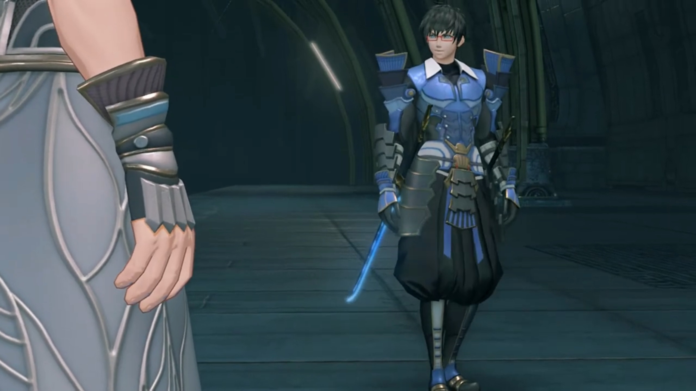

"I hear the Aegis awakened. Nasty shock for you? Orrrrrr, was it?" said the blue-armored guy wearing a pair of red-framed goggles with dark, short hair, wielding twin katanas stuck to both side of his waist. Genius always push up their spectacles when they'd something genius to say, "**Of course**, my script showed how _everything_ would play out from the start."

"Sure, you say that once it's all over and done with. It's eaaaasy to act smug when hindsight's on your sight!" The Blade voice sounded from above; a hatch opened and she entered the scene. 

"Shut your mouth, Obrona."

"I'm shaking to my core!" she swirled around Akhos, teasing him. 

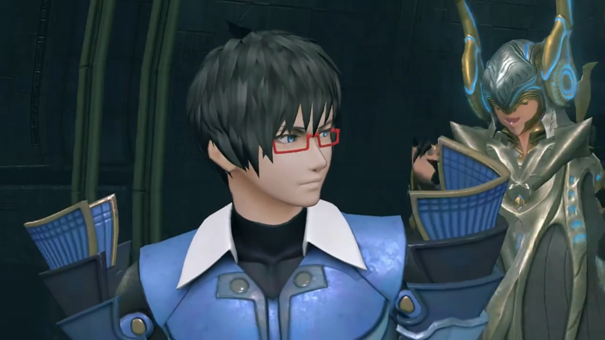

Malos had no time for play play, asked, "Where are the other two?"

"Mikhail's inspecting the Ardainian 'factory'... And my beloved sister is out hunting, as always. **I'm sure she'll** have found plenty of Drivers to chew up and spit out by now."

"She likes to hunt, all right. Not sure we can **use** all of those Core Crystals though..."

Jin changed the topic, "Do we know where the Aegis is right now?"

"Have no fear, Jin! **Of course we know** her whereabouts! Obrona?"

"Yeah, yeah..." She summoned ether particles in her hands and distributed them out, forming a light map of the Cloud Sea and the various Titans' whereabouts. 

"Hm! It seems they're currently traveling away from the urban area of Gormott."

Malos was surprised, "Leaving the town? But there's nothing out that way..."

"Perhaps they're on their way out of Gormott itself," hypothesized Akhos. "**Oh**, and..."

"What?" asked Jin.

"It seems a certain... _shipment_, has set out."

Malos noted, "The Core Crystal heading to Indol for cleansing, huh? How pious of them. Shall we handle them?"

Jin denied, "I can deal with that myself. You concentrate on the Aegis."

Akhos, excitedly, "Understood. _Well, I am looking forward to clapping eyes on the Aegis._ By the way, what of Nia?"

"You know where she is?"

"Yes. Look. This dot here. Without a doubt, this is Dromarch's wavelength." That's the blue dot. "It _seems_ they're traveling together, with the Aegis."

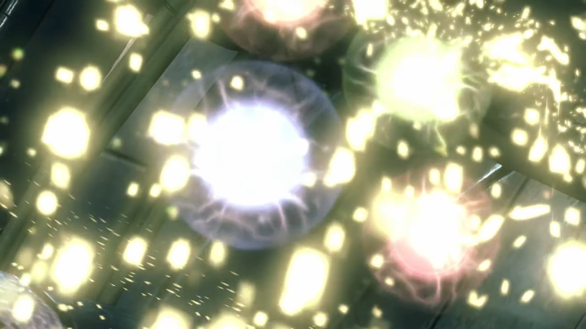

"**With the Aegis?**" Malos eyed sideways, to see what reaction Jin had for the girl. 

"Huh. Do as you see fit." was his answer. Jin don't bother staying any longer. 

"Understood. _You don't_, need to ask me twice." acknowledged Akhos. 

Malos announced, "Right then. We're gonna take the Monoceros."

Jin, without looking back, "Hm. As you wish."

"**Hey!**" Malos called him on his track. "**Don't**, do anything too reckless." Do one look like one needed reminding? Malos watched him continued his trek without an answer, but a psychopath like him does not need one. His reminding is done, that's it. He and Akhos thus head back to the Monoceros, with their Blades of course.{{footnote: Obrona already dissipated the map. The submarine seemed capable to autodrive itself even without a passenger.}}

---

Morning sun washed afresh any gloomy feelings one have yesterday. What an adventure; but they had something more important ahead. Rex was looking at a gadget held in his hands that Tora never seen before, so he asked, "What is that?"

"A Cloud Sea compass," he explaimed. "A must-have for salvagers. It's sort of a map of the Cloud Sea. If you do this... And this... What's the- date today?" Twists and turn he did to the dials of the compass, then he asked Pyra to supply him with more info. 

"Um... Amathatober 5th, 4058." Took her a while. 

"**OK!** So now we put the **date in... See?**" He handed it out for them to view. 

Tora was impressed, "Hoh, this is **very** clever!"

Gramps noted, "Looks like Gormott- is the closest country to the World Tree right now."

Rex: "All we need is a ship."

Dromarch brought bad news, "The army has... every ship in town in its grip."

Nia: "Ugh... We're kinda stuck."

Pyra don't have extra info either, "Seems that way."

Gramps: "Sorry, I'm no use now..."

Rex: "I know, I know. But I'm all out of ideas..."

"Rex-Rex need ship? Hoh, **Tora have good idea!**"

"You do?"

"There is ship builder living at Gormott Titan's bum-bum! Old- friend- of Tora's Grampypon. He called- Umon! _Maybe he help_ **if we tell him what's what!**"

Sounds like a plan. Rex agreed, "Sure, it's worth a shot! **Let's get going.**"

---

"**Helloooo! Umon! Uuuumon?!** Where is Umon?" Immediately entering the cabin, Tora called out loudly for his Unclepon, impatiently. 

"Who is that? Who is noisy while I do my work? **Tora!** This big surprise!" Kids today, so impatient. He came out and eyed the group until he found the only Nopon in the group. 

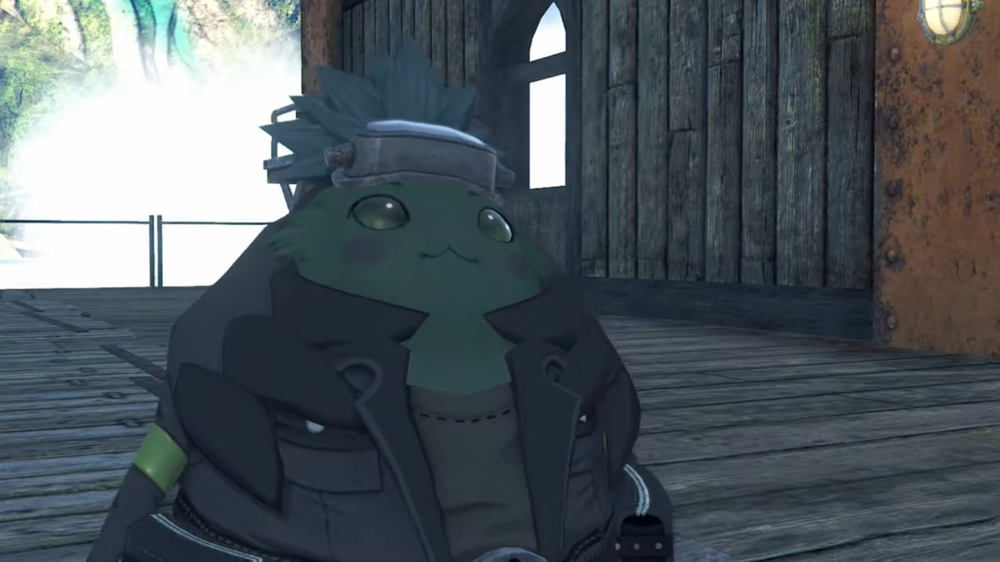

"Long time no see, Unclepon!"

"Yes! L-long time! About one whole year?"

"**Yes**, about that!"

"You became **very big** in one year, Tora!"

"Yes, Tora not littlepon anymore."

"And- Tora have lots of sidekicks!"

"Rex-Rex and friends are not Tora's sidekicks! They are **real friends**, Umon!" Introduction time. "Rex-Rex! Meet Unclepon Umon! He did great research with Grampypon! He is great builder of ships!"

"Hello!" Rex called out. 

Pyra: "Greetings!"

Dromarch: "At your service."

Umon, scratching his head, "I see. Tora's friends! **Tora has lots of friends. Very good!** Tora has become fine biggipon."

"Eheheheh..." praises from elderly almost always resulted in blushing, feeling shy. 

Back to the main topic, Umon wanted to know, "Well, Tora. Did you need Umon's help for something?"

"Well, we wanted to borrow a ship. From Unclepon Umon!"

"A ship? But there are lots of ships in Torigoth! Why hike all the way to bum-bum to see me?"

"_Oh... erm uh uh..._ **well...**" What reasoning could persuade him? 

No fear. Umon already had an answer for them, hypothesized, "Tora run out of gold, hmmm?"

"Umm... Yes! Tora spend all the gold on artificial Blade! Tora flat broke, like penniless pancake hmhmhm. I wanted to go on a little... boaty-jaunt to, ah... nearby place. But **no money to go on boat!**"

Nia felt very guilty with all the lying stuffs, quietly talking behind his back to Rex, "_Hmph. I hope Tora can keep track of all  of these fibs he's telling..._"

"There's no other option. We can hardly tell him what happened in Torigoth, can we?"

"Y-yeah, I guess you're right..."

"So long as we get a boat out of this..."

Meanwhile, Umon was considering his request, "Artificial Blade, eh? Was this what Tora's Grampypon was working on?"

"My name is Poppi. Pleased to meet Unclepon."

"**Yeeeeeessss! This it! This pretty mighty! Tora take after Grampypon indeed!** Ohhh, well... **How can I refuse Tora now?** Tora may use Umon's ship, but _there is problem._"

"Wh-what is problem?"

To the left where the group were standing was the ship, wooden deck mounted on a Titan's back. Umon explained, "You seeeee, ship- not quite ready- just yet. **Not much left to do**! _But work stop, because no- building parts._"

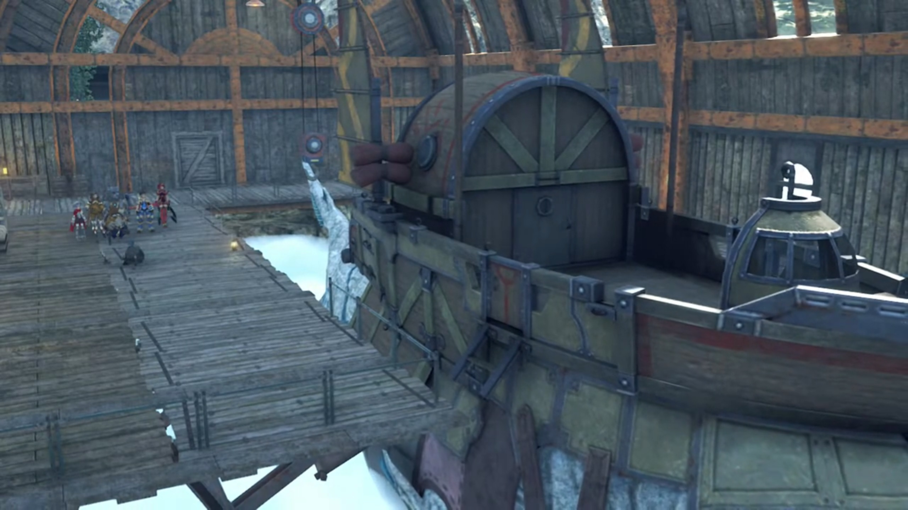

"That's the only problem?" asked Rex.

"**Correct!** But that is **big** problem. Big like sea or mountain."

"You mean, all you need is some parts, then you can finish the ship?"

"It- just as you say, friend."

"Sooo, if we go and find the parts, then- you'll..."

"**Of course! I make ship ready. Then you borrow!**"

"**Thank you! Come on everyone, let's go!**"

Tora: "**Yay!** Let's go find ship ingredients!" What ingredients he needed, they don't even bother listening; miraculously, they already knew. 

---

"So now we borrow Unclepon's boat!"

Rex: "Thanks, Umon! We owe you!"

"**Indeed! Enjoy your boaty-jaunt!**" And the ship departed the dock. 

---

A sea of clouds stretching the horizon, _on_ the surface and _above_ the surface. They were the only moving Titan ship in the vicinity. Slowly but surely, they were approaching the World Tree, its trunk grew HUGE ahead. 

"So that's the World Tree..." Rex was at the helm as he exclaimed. 

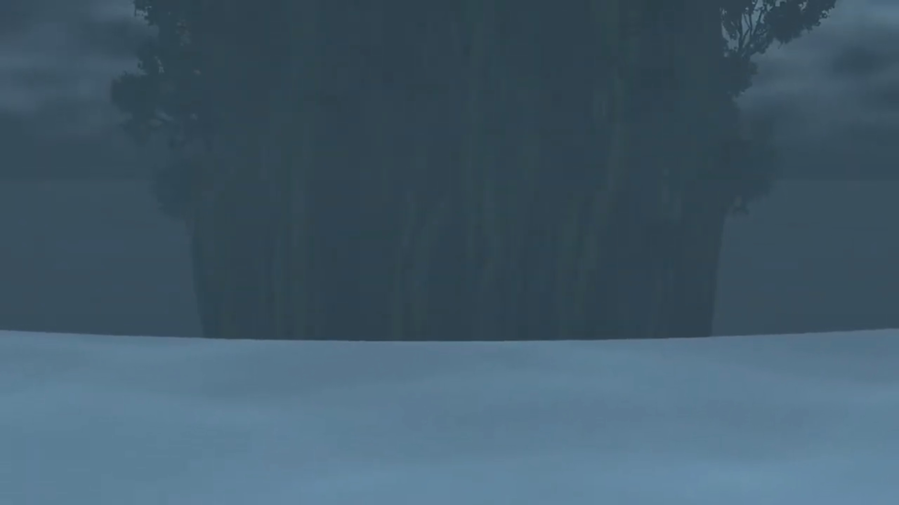

Nia exclaimed, "Wow, I've never seen it so close before..."

"Me neither, _to tell you the truth. But it's just as awesome as I'd hoped._"

"The current's really strong... Fall in that, and you're a goner." The tree seemed to generate some force field, forcing water to fall off some distance away from its trunk, creating a vortex, forming great waterfalls. 

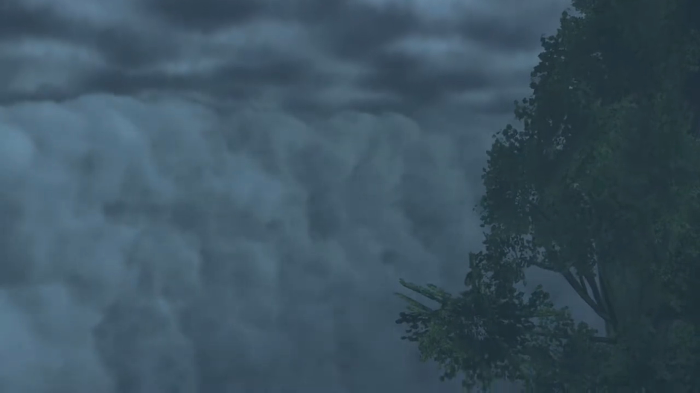

"It's great that we made it this far... But how do we get over there? Any ideas? Pyra?" 

She wasn't listening. Her eyes fixated on the Tree, her mind adrift. There was something she'd forgotten... what was it? "We..."

"Huh?"

Oh, shoot, THAT! "**Rex! We need to leave! We can't stay here!**"

"What, why? What are you talking about, Pyra?" 

The ship started rocking. Looking out, tremendous waves were forming from below their ship, water splashing furiously on the windshield. Then, a purple drill-like snaky monster poked its head above water, targeting them. The ship shook with the waves. 

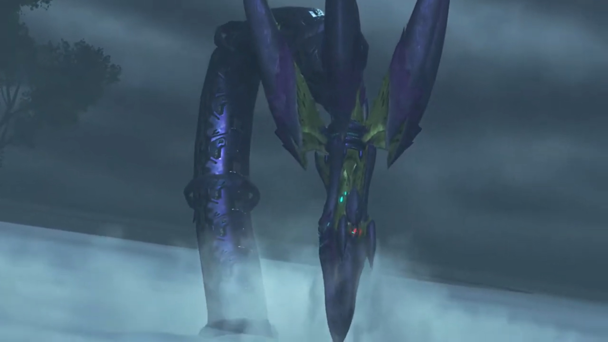

"**Ophion!**" Pyra called out. But it didn't remember her. 

Rex: "**Ophi-who?!**"

"**QUICK!!!**" 

"**Uh? Gotcha!**" He steered the steering full right. The Titan pedaling the ship swam for its dear life. 

Pyra continued looking at Ophion, trying to communicate with it. "Ophion! Stop this! What's wrong? Can't you hear me? It can't be!" But it's brain murky, accepted not any incoming messages. 

Its giant tail slashed at the water, sending waves at the escaping ship. They braced for impact as rough waves shook the effectiveness of its escape route. Rex thought they were done for, looking backwards, the next strike would be their final. But it did not leave its territory around the circumference of the World Tree. "What was that? Thought we were done for! **Huh?**"

The danger behind had switched to the dangers ahead; the escape from the tiger's den forced them to enter the wolf's den. The ship jolted forward as water was sucked in by a giant figure ahead of them. Such strong current, the ship had no escape. 

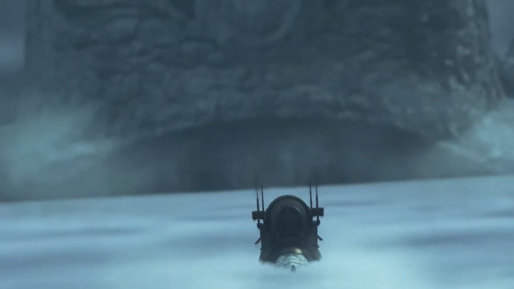

"**Is that...**"

Gramps recognized, "**Uraya's Titan!**"

"**This is NOT GOOD!!! AGH! HERE IT COMES!!!**" Along the tide their ship ride the currents, straight for the Titan's mouth. 

"**AGGGGGGGHHHHHHHH!!!**" All shouted preparing for the end of their dear life; The Titan swallowed them and sink back beneath the clouds. 

---

"**ARRRRRGGGGGGHHHHHHH!!!!!**" The crash and bang as they slid down the Titan's gut and landed at an unknown body part of the Titan. 

"Ogh Agh..." Rex stood up from the ground. He could see nothing in the pitch black, except for the light coming from the about-to-shut mouth behind them. Luckily, as a salvager, he always brought lights with him, which he clicked on his belly before shouting out, "**Pyra! Anybody!**"

"**Ugh... I- I'm here.**" He turned and saw her cloth that glowed in the dark, slowly standing up and approaching him. 

"You hurt?"

"No, I-I'm... fine."

"Ach, ow..." That's Nia.

"**Meeeehhh...**" and Tora. After they got up, they followed the source of the light and gathered around. 

Rex commented, "Looks like we're all OK..."

Gramps: "Except for the fact that we now find ourselves in the belly of the beast.{{footnote: And how they're to tell Unclepon Umon that his ship is forever gone.}}{{footnote: And luckily, no acid inside the belly.}}"

"**The beastie's belly?**"

"This is the inside of the Urayan Titan."

"Meh meh!"

"Look."

"Tora think this not nice place."

Rex: "Is that how we're gonna end up?" Digested?

Nia: "Hey, Rex! Don't jinx us!"

Dromarch suggested their urgent task of survival, "Everyone. Shouldn't we try to get out of here? If I recall, the Urayans live towards the beast's back. There **must** be a way, up there."

"Yeah. Can't hang around here, for sure."

Poppi scanned the vicinity, then signaled, "Over there!"

"Huh?"

"Poppi see something over there. Someone coming this way."

"For real? Maybe you're just seeing things."

"Poppi is certain. Something is flickering over there."

Rex: "Flickering... you say? Some kind of ghost maybe?" He directed his torchlight towards that direction. Below their feet and around them, lush green grass grown inside the belly of the Titan despite the lack of light for photosynthesis, a mysterious phenomena. 

Nia's shaky tone blurted, "_S-shut up!_ There's no such thing!"

"Nia, you're not scared, surely!" He teased. 

"D-don't talk nonsense, Rex! _I'm not a kid!_"

"You're **scared! At last. Something Nia's scared of.**"

"Just. You. Watch... _Hey! Where's... Pyra?_"

"What?" 

She looked around before announcing, "Pyra's missing."

He pointed his torchlight where he saw Pyra just now. "Uh... But she was right here. Pyra? **Pyra?!**" No longer there. 

"**Hey, what's up?**" A small flame ignited behind him; his felt his heart jumping out of his chest. The flames lit her face orange. 

"**URRRRGGGHHHH!!! H-Hey, what's the big idea?! Don't wander off like that!**"

"Nothing, really. I was just... taking- a look around. What's the matter?" she asked innocently, don't understand why the big deal. 

"Heh heheheh..." Now Nia had something to laugh back at Rex. Right back at ya! 

"What's so funny?"

"_Oh, nothing..._"

"Ngh... Titan's foot!"

Pyra made a larger fireball that shone the environment brighter than his torchlight could. 

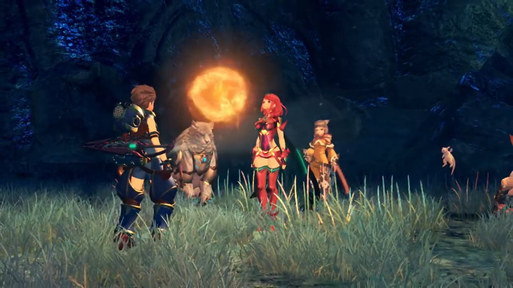

Gramps was delighted, "Oh! Things are looking brighter already."

"Poppi can help too." Two beams emitted from her eyes, barely added to the already bright illumination, but she joined in anyways. 

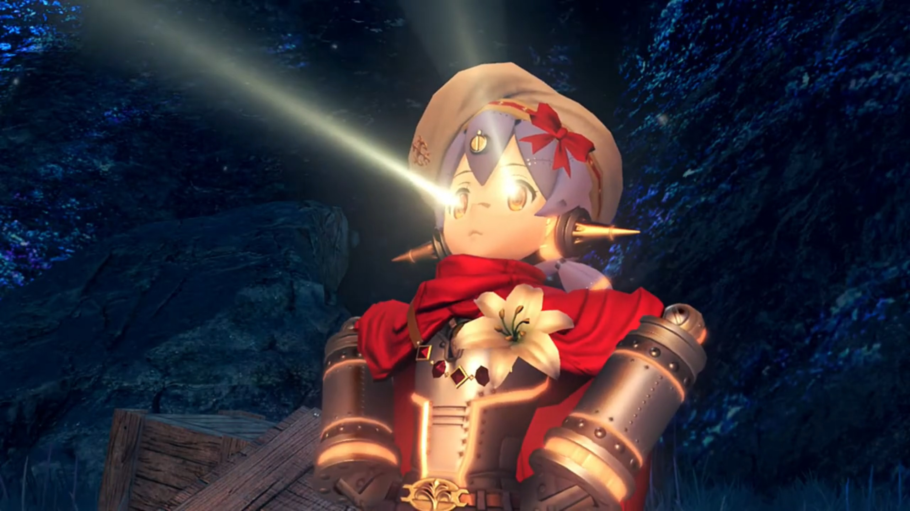

"Now even more brighter!" exclaimed Tora.

Nia: "You two are certainly earning your keep. Huh, I wish I could say the same for old **Dromarch** here!"

"Apologies, my lady."

Rex: "See? Not so scary when you can actually see. Let's find the exit!"

"**YEAH!!!**" all chanted. 

> **Translator's note on environment:** Dark tunnels upon tunnels they went that lead them to the end, The **Kingdom of Uraya.**

### Footnotes: