# Vandham of Uraya

Exiting the tunnel, the surrounding now lit brighter. Nia noted, "There's some kinda _dim light..._"

Gramps: "If I remember, the Urayan Titan... has a translucent hide. I bet that'll be the light filtering through."

Rex: "So... the Titan must be above the clouds now?"

"I dare say!"

Pyra suggested, "If we can make it to the source of the light, maybe we'll find a way out of here."

"Hold it!" Who's voice was that? With tense muscles, they turned and saw the guys standing atop the ledge. He jumped and landed in front of the group. His blade, a bird standing on two legs with pouches on its breast, trailed behind. And his colleagues followed him behind, "Looks like a bunch of mushes I ain't seen yet. You gotta have pretty **damn bad luck**, ending up in a Titan's guts like this. _Huh? That Blade..._ An emerald **Core Crystal!**"

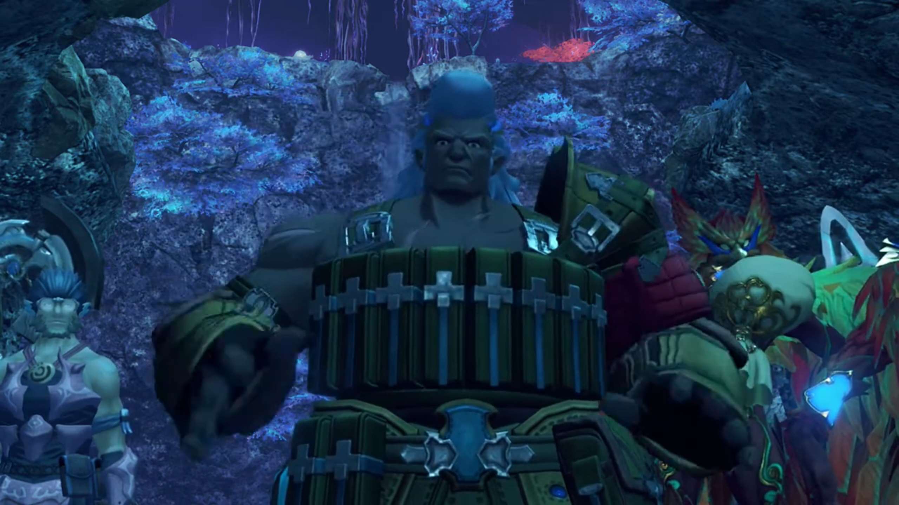

Rex was triggered. Whoever mentioned that so far hadn't brought them good news. 

"**BWAHAHAHAHAHAH!** So, the rumors are true!"

"Huh? What rumors?" wondered Rex. 

"The tale that every Driver worth his _salt knows_. The legendary **Aegis**. Folks been saying she just woke up from a 500-year nap. Wouldn't have thought... she'd show up with a pencil-neck **shrimp like you for a Driver, though.**" He ridiculed at Rex's size. 

"**You think I don't have what it takes?**" He felt provoked. 

"**Nah**, I mean... Maybe you could handle a _normal_ Blade. **But a greenhorn like YOU, with a beaut like HER?** _Don't kid yourself._ C'mon boy. **Hand her over to a grown-up.**"

"This crap is getting old. Leave her alone!" They got ready for battle. 

"Y'got heart, kid. _I like that._ Yew, Zuo, you take care of the others. _I wanna squash the kid._"

"Heheh. Leave it to us, boss."

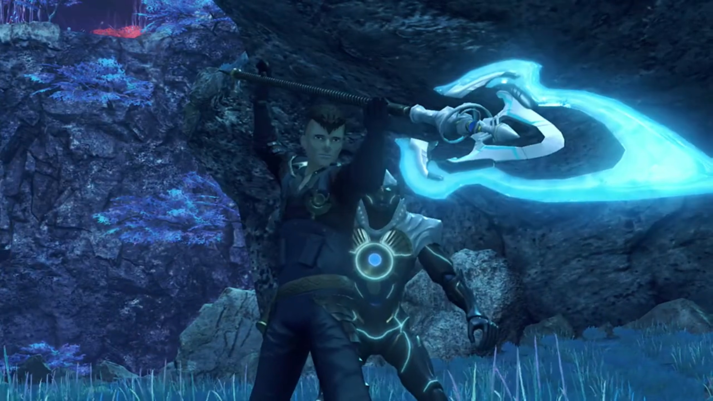

"We'll take **real** good care of 'em." And the battle begins. 

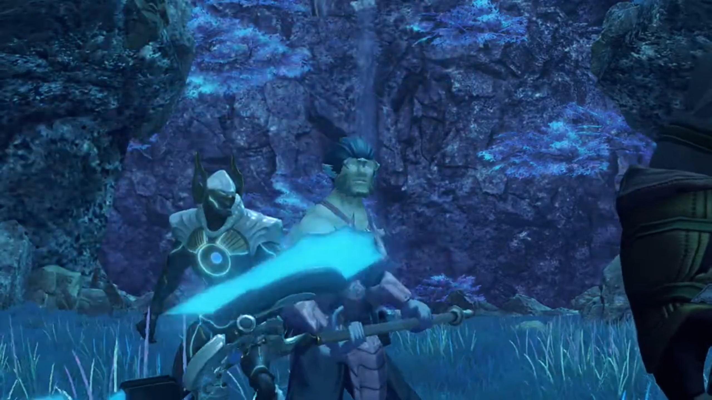

---

"What's the matter? Are you the Aegis or aren't ya?!" Pyra was having difficulty transferring her power to Rex. The buff guy was slamming his dual scythe at Rex as he complaint, knocking Rex off balance as he defended his speedy slices. One more attack he realized his hand won't be fast enough to block; Pyra sensed his danger and blocked it for him. 

She sensed something out of place. In her mind, "_Huh? Something feels... different. This man, he's..._" There's... no... She hadn't got time to think; he'd knocked her off. 

"That all ya got, mate? Pathetic."

Being provoked, Rex drew more power, "**We'll show you! We'll show you what me and Pyra are made of!**" Continuously, he threw fireballs at the guy, which he adeptly dodged, and he gaped in surprise, "He dodged?"

"Course I did, kid. _Any slower, you'd bore me to death._"

"How about **THIS, THEN?**"

"Hmph." More tighter controls, he got slightly more serious, dodging most; and those he cannot dodge, he sliced it aside, redirecting them to behind him. 

Power were sucked at a speed that "**REX, WAIT!!! I can't supply power this fast!**" But he wasn't listening; he'd locked his attention to teach the guy whom sneered at him a lesson. Seeing the guy's back on the rocks, he knew that's his chance. 

"**Nowhere left to run! Eat this!**" One more Burning Sword and the fight would end! More and more power he drew, and suddenly, snuffed out. "Huh?" 

The guy was waiting for his moment, his eyes fixated on Pyra's condition, and realizing his chance, "Playtime's over. Take this!" And he launched himself real fast at the defenseless Rex. 

"**AHHHHH!!!**" He closed his eyes, awaited his destiny. After so many lucky feats, this time is the unlucky ones, eh! Gonna die, but, one really don't want to die. The World Tree, our dreams. Sorry, Pyra. Goodbye, World. 

"**Hah! If you're a Driver, you're a new one for sure.** Drivers, see. We borrow our Blades' energy... channel it into our weapons... And let rip with an Art!" The scythe is on his neck, but it did not land. The guys sheathed his weapon after he opened his eyes, and continued lecturing, "**But you gotta be careful** -- there's a **limit** to it. If you go in all bull-headed like that, kid, even that Aegis of yours, is gonna run out of energy before long."

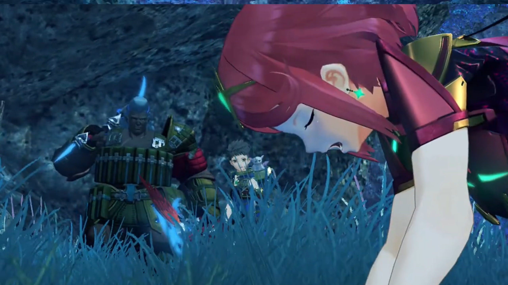

He nudged towards Pyra, and Rex turned and saw her panting ceaselessly to recover her breath. More confusingly, wasn't he about to die? "W-what???"

On the other battlefield, Yew and Zuo sheathed their weapons. All were confused. 

Nia: "Huh? Uh?" 

"**The name's Vandham.**" the buff guy introduced himself, knocked his chest hard. "I run a little firm, out of the nearby village."

"A... 'firm'?" Rex wondered what that means. 

He invited, "**Come on! I'll treat you to some** grub, as thanks for letting me take a whack, at the legendary Aegis! **BWAHAHAHAHAHAH!!!**" 

Pyra regained her breathe, stood beside Rex once again, shared, "Just then... I realized- while we were fighting, I sensed from the very start, that... he didn't mean us any real harm." 

They looked at the group leading the way up ahead, Rex commenting, "_Hmm, he sure is a strange old goat, that one..._"

---

As they approached the village, Vandham had listened to their story during the traversing, exclaimed, "Helluva story! So you headed to the World Tree to reach Elysium, but got swallowed up whole **instead**? You got some crazy luck."

Rex asked, "So, er, what were you doing back there, then?"

"Y'know, this Titan... It ain't too fussy about what it eats. I went down there to see if anything we might need in the village, washed up. **But mostly I only found, YOUR sorry mushes.**"

"Yeah, sorry about that..."

"**Here we are.** Welcome to Garfont. Ain't much but it's home." Several people doing push ups with instructor sitting there overlooking them. Nopon and kids playing together at other places.

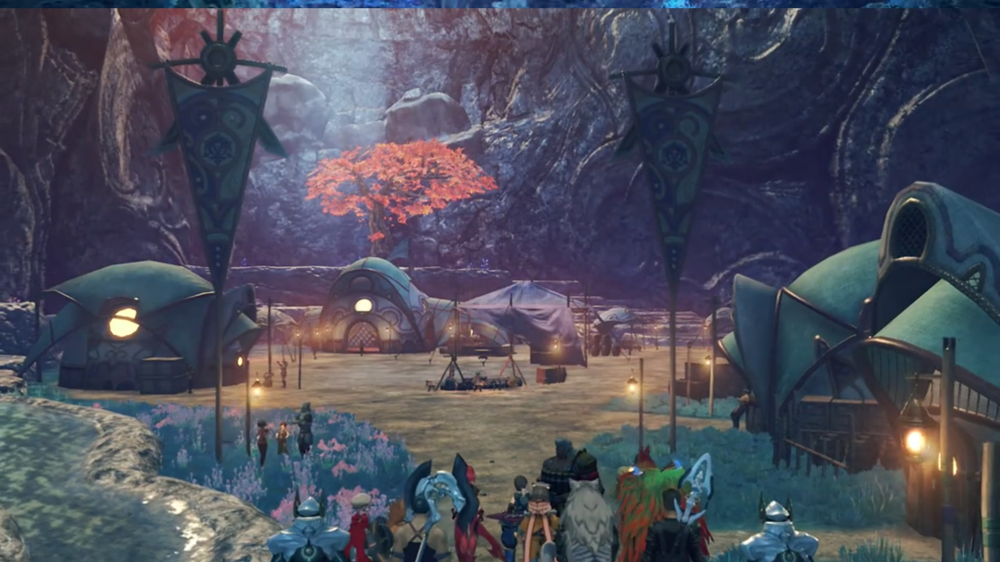

Pyra noticed, "The village has... a lot of children."

Tora added, "Lots of Drivers and Blades here too!"

Vandham explained, "We're in the business... of dispatching **Drivers** and Blades... **all across** the world. Most of the kids are war orphans. Took 'em in while on the job."

Dromarch rephrased, "So you're saying, that you, take them under your wing."

Yew supplied an answer, "Just till they're able to make it by themselves."

Zuo added, "Some of 'em, **might grow up to be Drivers**, like ourselves. **But then others might become** tailors."

Vandham: "Doesn't matter what they wanna do with their lives. We leave it up to them to decide."

Yew: "Aye. Us 'Justice Busters' just wanna help."

Nia commented, "Good eggs, huh?"

Vandham wasn't angry with the labeling, "You said it. I've been called worse. Come one. Let's eat! All this egg-talk is making me hungry." And he lead the way. Rex's head was on something else... this military thing... hmm...

---

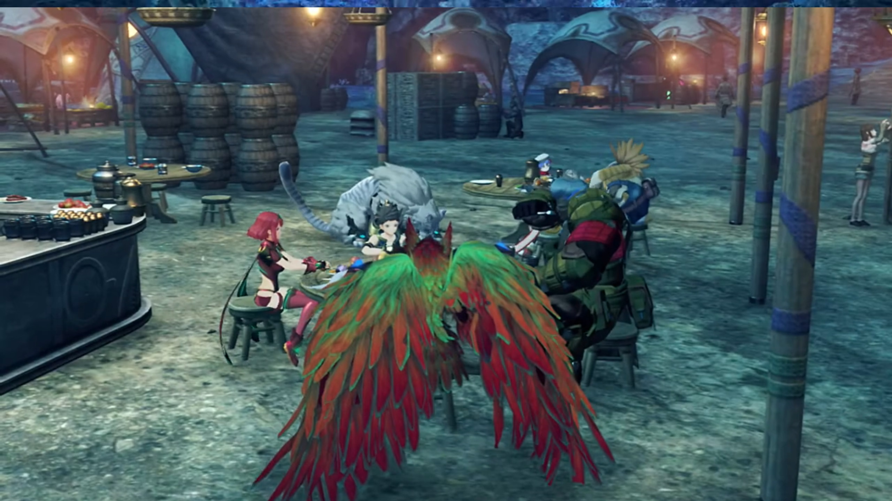

The group sat around 2 tables at the canteen. Nia, Dromarch, Poppi, and Tora took up one table. Yew and Zuo were gone to do their work. Vandham, his bird Blade, Gramps, Rex, and Pyra at another table. Pyra then said, "I'm going to get some water. Vandham?"

"Cheers, love! Gimme a beer!" He finished swallowing before replying. 

"**Beer? Coming right up!**" Cheerfully she called before leaving for the dispenser. 

Rex was touching nothing on the table for long; his place still as they were. Vandham asked, "**What's up?** The grub don't suit you?"

"So... do you fight in wars too, Vandham?"

"You got a problem with mercenaries?"

"Are you **trying to get us to join up?**"

"**Hah! Shrimps like you?** We're not THAT desperate. **Relax!**" So not with mercenaries. Then it's with wars, soldiers, then. 

"OK. Good to know."

"Hmmm... Rex, you're a salvager, ain't ya?"

"Yeah."

"You musta fished out your share... _of military supplies, right?_ You fine with that?"

"Naaaahhh. **I don't wanna get involved with it.**"

"**It's all the same.** Compasses, **valves for ether stoves... Armies need** all these things. **The bread you're eating?** It's made from ruska flour. Supplied by the Ardainian government. **This world's full of war.** Don't matter if you're a soldier or not. As long as you're **alive**... you're in the war, **some way or another. Don't you think?**"

Heavier and heavier his chest felt, shallower and faster his breathe. Just thinking about all the mechanical he'd salvaged up being repurposed, distributed to soldiers; he felt his hand stained with the blood of those hoping to live one more day. Guiltiness grew within, and desolation awash him, like a giant rock attached to his chest. "_Um, I..._"

"_Life can be cruel. Crueler than you know. That's why I set up this little band, so I could **protect**, the people I care about._" He listened, though yet not enlightened. "Rex. _You're the Driver of the Aegis. The whole world's gonna try and **scalp you**, you realize that?_ How ya gonna live, _when you got everyone... **gunning** for ya? It'd be easy to run. All you'd need to do is ditch that girl._"

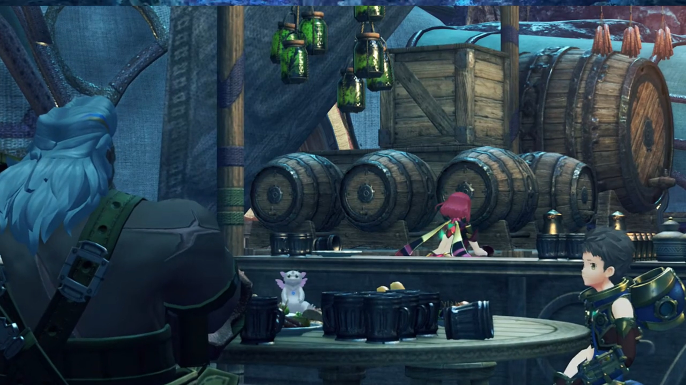

They looked at the girl whom were preparing the solutions behind the counter some distance away. 

"Ugh!" But he could not, not after all the adventure and friendship and dependency on each other and promises he'd made with her. He'll bring her to Elysium, he swear. His de facto partner he'd attached himself to, the various ups and downs they went through together, stirred their lives from the repetition and boringness of money money money for those back in Fonsett his mind was fixated on before meeting her. She made his days no longer the same anymore. 

Vandham could only help so much; he had to walk out of it himself. "_Hmmm..._" Then he abruptly stood up{{footnote: Even before his beer had came back.}}, shouted, "**C'mon! Gotta get ready!**"

"What? Where are we going?"

"Just **follow me, kid!**" And he and his blade walked off. Rex stood up, watched by Dromarch, while his other companions were still scarfing down whatever's on the table. 

---

"We just got a job to go check out some kinda crazy energy effect. Somewhere up around the blowhole. Whaddya say? Fancy bein' a mercenary for a day?" The group had gathered just outside the village. 

Rex, with some hesitation, "Ummmmmm, OK? But, I mean, we don't work for free..."

"Don't worry, kid, you'll get paid." Together they head for their destination. 

---

A giant ball of wind swirling on their path blocked their rights of way. "Ahhh..." They wondered what was that...

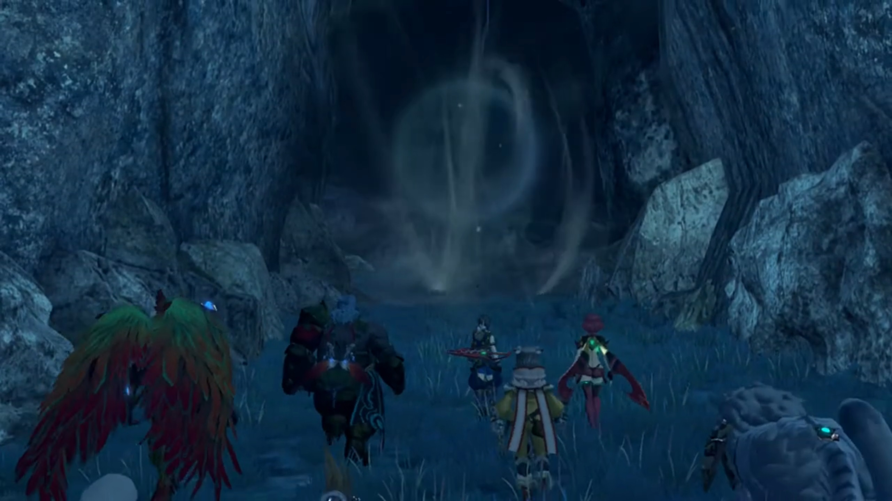

Vandham introduced it, "An ether miasma. Take it this is ya- first one."

"Ether miasma?" Rex wanted to know more. 

"It's a load of poisonous waste products, spewed from the Titan's **guts**. Y'know, when you get gassy? Kinda like that."

Nia: "_Erm, is there a way_ through this thing? I can't see any way round it."

"Hey, no fear. Roc, mate! You're up!" He took out his twin scythe, while his bird Blade, Roc, flew into the air and slashed some air fang at the ether miasma, dissipating it. 

Rex noted, "Miasma's died down!"

"**Heheheheh! Yup, nothing to it. Let's roll!**" And they continued on their journey. 

---

Exiting the tunnel entrance, they saw "An Ardun... Just what we need. Rex, any good with that anchor?"

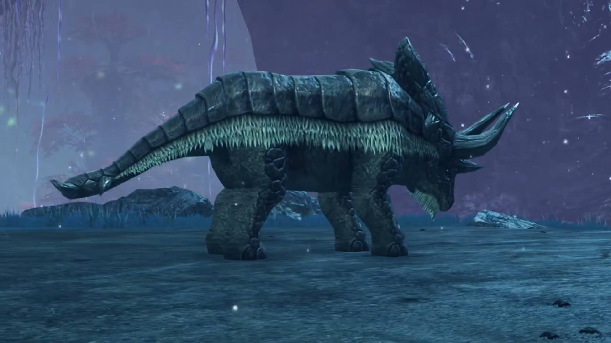

He looked at his anchor for a moment, assertively answered, "**Yeah**, I get by!"

"Hand that here." He agreed, detached it and gave it to Vandham. "Now watch." He point the anchor at the Ardun's leg; it swirled around, and he pulled, toppling the Ardun. 

"**Awesome!** I never thought of using it that way!" Rex was impressed. 

"The trick is to pull it taut at just the right moment." He then threw it back to Rex, instructed as the Ardun turned its attention to them, "Now you try!"

---

After the battle, Vandham praised, "You got it after seeing it once. Not bad, kid."

"Heheheh!" Felt high from the praise of an adult. 

"**Listen up**, kid. Drivers, use Arts. But that doesn't just mean _using the powers your Blade gives you._ There are Arts that use your own strength, _or take advantage of your enemy's._ **There are all sorts. A Driver's** job... _is to be smart with his Arts, and **protect** his Blade._"

"Protect my Blade?" Rex hadn't yet understood. If they could fight better than him, why do they need his protection? Plus, in Dughall's words, if Blades can regenerate, isn't it _logical_ to use them as meat shield?

"_Yeah._ It's a two-way thing, kid. **You gotta be aware of the power** comin' out of her. _Don't waste it_, channel it through your Arts, and protect her. _If you can do that, then you're a true Driver, kid._"

"'A true Driver'? _I don't know. Am I ready?_" He questioned himself. 

"'Course you are. That thing from before? Took me **five years** to learn that."

"Five years?!" He was surprised. 

"_Yeah. But you saw it once, and then you aced it like it was **nothin'**._ And, you got Nia and Tora in tow. _Those guys are pretty handy._ Kid, _you got a bright future._"

Aww, so sweet that "I think I'm gonna spew," exclaimed Nia.

Tora: "Biggipon has scary face, but he very nice!"

"**BWAHAHAHAHAHAH!!! Sussed me out, furrypon!**"

---

They'd arrived at their destination. A small Titan was lying beside the cliff walls, dying. 

"Like I thought..."

"**A Titan?!**" exclaimed Rex. "**So that weird power effect** they clocked... **Maybe this is the cause?**"

"Yeah, sure looks like it." Vandham agreed. 

Gramps inspected, "I'll hazard it wasn't death by old age, either. Might have been an accident... On the other hand, it might have been attacked..."

He was right.{{footnote: Actually, not. Just for the sake of causation, we said that. But they had probably nothing link whatsoever. Debunked in the next paragraph.}} The ground shook, and the source of the shockwaves was a giant arachnid with red coral-like veins growing out of its head, stampeding its pillar-like feet as it walked out from behind nowhere to face the group. Beside it was a humanoid bull-shaped face muscular Blade beside the Arachno.{{footnote: The Driver of the Blade is the arachno. Don't ask me why a monster can wield a Blade. Scary thoughts. They're so strong themselves and they can gain more power from their Blades???}}

Vandham noted, "Hey, look! Seems like this Titan dying off has stirred up something else!"

---

After felling the arachno and the Blade, the Blade returned to its Core Crystal; but unlike the Core Crystal that shone crystal blue, this one's dark, emitting no light. Rex noted: "The Blade returned to its core..."

Pyra: "So that monster was in- resonance with the Blade..."

Tora felt jealous, "Tora cannot resonate, _stinky monster **can** resonate._ **Not fair!**"

"But... Masterpon have Poppi!"

"_Ohhh, Poppi..._" So sweet they embraced.

Vandham brought their attention back to the Core Crystal, "_If a Blade loses its Driver, it winds up like this._"

Rex: "So, is it, like, dead?"

"Nah! The crystal'll start glowing again after a bit of time. Then a new Driver can resonate with it. But..."

"There's a but?"

"_Its memory will be totally zapped._ It'll be **reborn**, as a new Blade. **Won't remember** a thing."

"Yeah? That's pretty rough... To have all your past wiped out like that..." Rex agreed. 

Hah. How she wished her memories are wiped out, "But memories can be... painful as well. They can be a terrible burden. And... a Blade- can live forever, as long as the crystal exists. It's just as well. Eternity is a loooong time to collect bad memories."

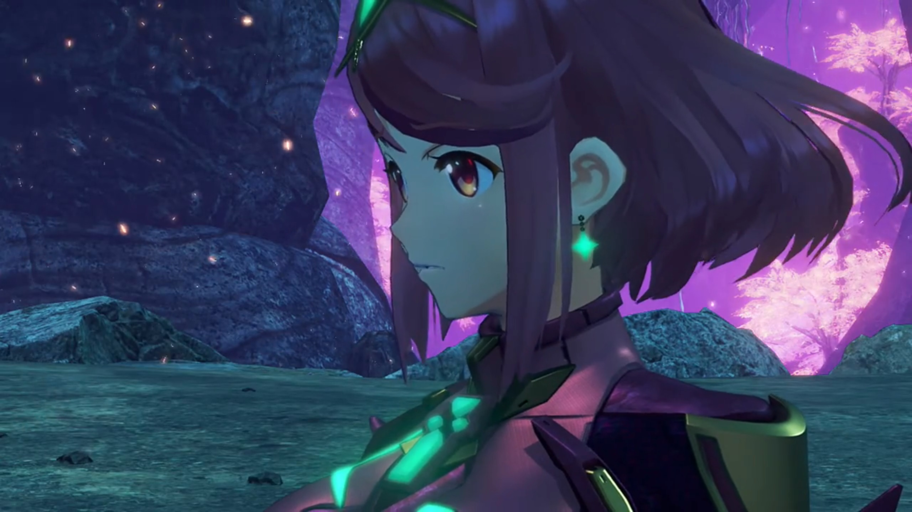

"Pyra..." Is that what she had been holding on to herself for so long, unwilling to yet share with him or anybody else? If the Titan had not triggered her, will not she hold on for longer, refused to voice it out, shouldering all by herself? 

"_I'm sorry._ I was just thinking, sometimes being able to forget, is a... blessing."

Vandham urged, turned their attention to the task at hand, "**C'mon! Leeeet's get finished up here!**" He walked up to the Titan alone while the others waited. Blue flames and motes had been evaporating off the Titan, similar to Gramps not so long ago before he metamorphosed and returned to his larval state. Except, this Titan had no ability to metamorphosis like Gramps did. 

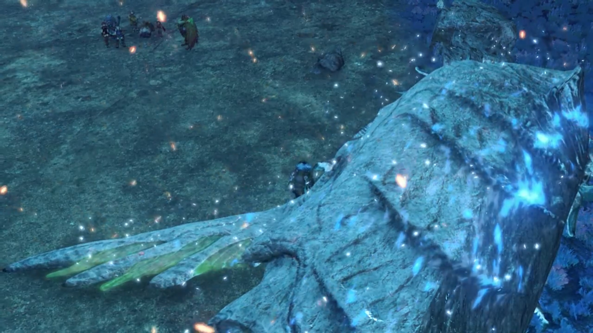

Vandham returned with a glimmering light blue cubic Core Crystal. Rex exclaimed, "That's..."

Tora: "**A Core Crystal!**"

"**What?!!**" Rex was surprised. But how? 

Vandham explained, "Well that's where they come from. _Out of Titans._ This one's brand new and ready to resonate. _Like a big steak, right before you take that first **bite**._ It'll probably end up **buddying** up- with a **bunch** of Drivers. _Every time the Driver dies_, it'll forget everything, and return to its core. **Eventually, it'll resonate with a new** Driver. Drivers dyin', **Titans dyin'**... _The Blade- just keeps on livin' through it all..._ It's a never-ending cycle. An eternal history. _As mortals,_ we'll **never** be able to understand."

"It's incredible!" 

She's a Blade herself; she can relate. Worse, her previous Driver's long gone, but she had not entered a new cycle. She stood behind him; her current driver don't notice yet. How could he, when he only lived for 12, relate to one living for more than 500? Perhaps she felt herself related to the dying Titan, walked towards it closer while it was evaporating, prayed with closed eyes. Titan, O Titan, may your resurrection in the other World, live a more peaceful life, free of pain. 

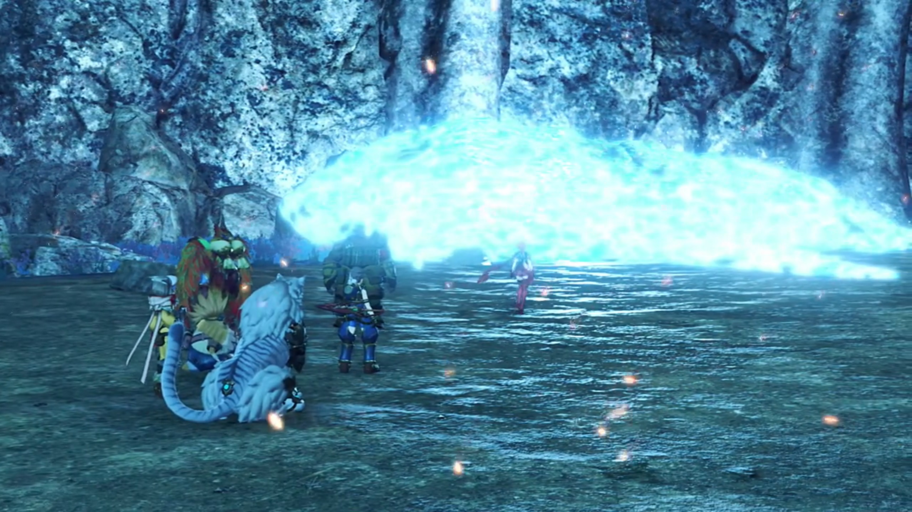

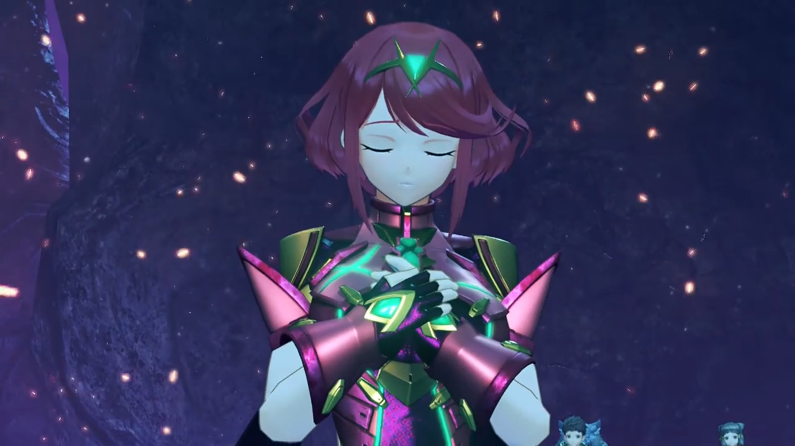

> Meanwhile, in Rex's head, he wondered, "_But... Pyra already had a body when we found her... Could her old Driver still be alive somewhere?... Perhaps..._"

---

A long day's work deserves some rest. Back at the camp, Tora was jumping up and punching Poppi's palm held out, training. Nia was combing Dromarch's fur, while Vandham sat with his blade observing Rex and Pyra. 

"Owowowowowo... ah..." Both had cotton balls on the end of a stick on their hand, helping each other cleaning their wounds. 

Pyra: "**Hey**, hold still. I thought you were a **tough** salvager, Rex!"

"Gimme a break. Pain is pain, isn't it? How about you? Are you hurt?"

"Don't worry, it's just a scra-..." He 'gently' pushed the cotton ball at her wounds, and she lost her coolness, "**AAARRRGGGGGGHHHHH!!! That was on purpose! You were hurting me on purpose, weren't you? Well?**"

He shook his heads and hands vibrantly in denial. "**I wasn't, honest! I was just rubbing the lotion in...**"

She backed away from the incoming cotton ball, cried, "**Rex! You rubbed it too hard! It hurts, see!**" 

And she got her 'revenge' with the 'same' force back at his wounds, "**ARGGGHHHH!!!**"

Vandham had got up and walked in front of them while they were teasing each other, shouted, "**Hey, you two!**" Their attention jolted back at him, as he instructed, "**Gimme a look** at that." And he loomed close to them. 

They stiffen as he eyed Pyra's wounds, then Rex's. To and fro a few times confirmed his hypotheses. He can't believe what he saw, "_What, is this?_ Haven't seen this before. Dunno why a Blade would be stuck... with a bunch of wounds... _And they're exactly the same as Rex's!_"

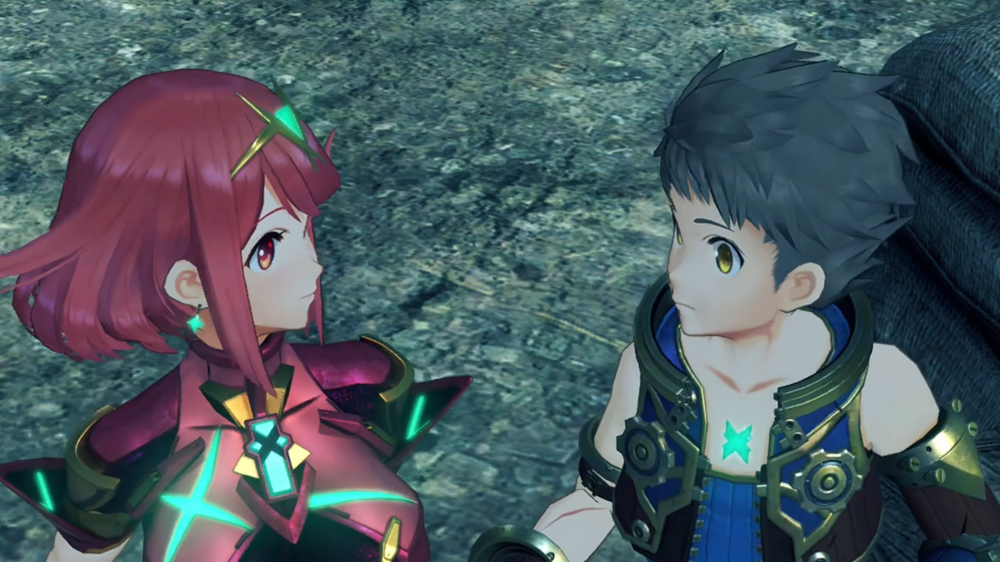

The two hadn't thought about that before, eyed each other innocently, and so the storytelling continued. 

---

With all others, including Yew and Zuo, around them, Vandham exclaimed, "Incredible. Never heard of such a thing."

"It's all true." The X crystal in his heart shone the most brightly. 

"I just thought _it was an accessory._"

"Vandham, that's not my style."

"**Blades are supposed to heal up** right away, no matter what the wound. _If the crystal's in one piece and the Driver's alive, nothing can touch 'em._ So why's she all bashed up?"

"That's just how the chips fell. It is what it is." He took it for granted, assuming it's something to do with the Aegis special entity. 

"What it is, _is a problem._ It means if one of you kicks the **bucket**, you both do."

"You told me that a good Driver, **always** protects his Blade. So that's what I'll do. I'm gonna protect her."

"_Eaaasier said than done, kid._"

"Listen... Pyra... _She saved my life, brought me back from the dead._ So I won't die again! I've got to live, for her sake! Until we... get to Elysium, at least. We can make it together."

"Rex, you mean..."

"Going to Elysium? I can't let that stand." Whose voice was that? Vandham turned around and saw strangers in his village. "It. Won't. Do. _A bunch of amateurs stealing the show?_ The **script** exists for a **reason**!"

"Akhos!" exclaimed Nia. 

"Please _speak only when you're spoken to, **traitor**._"

Obrona chimed, "**Traitor traitor TRAITOR!!! Nia, you're one of the baddies now. You villain! Teehehehe!**"

"**I didn't betray *anyone*!**"

Akhos: "Then why do you stand with them? You think that is where you *belong*?"

"B-b-but I-I..."

Vandham was angry, "Hmph! Who are these **goons**?"

Rex explained, "Torna. They're **trying** to get their hands on Pyra."

That enraged him further, "**TORNAAAA!!!**"

Nia: "**Akhos! Just, tell us, what you're here for!**"

"Well, the Aegis, of course. I just had to come and see the leading lady with my own eyes."

"Jin put you up to this?"

"Well deduced. **Oh**, by the way... His orders were to deal with you _in whatever manner I see fit. So... you know what that means._"

"_He wouldn't..._ **You're lying!**"

"**Why the surprise? Did** you think he would still _care about you?_ **Ohhh**, to live in your *reality*..."

"Angh!{{footnote: Like a cat non-meow crying out.}}"

"Well well. Your **part** in this **play** is _coming to an end._ So! _Time for you to shuffle off the stage._"

"**HRRRRRNNNGGGHHHH!!!**" How dare he treated this place as his home. He's not welcomed here, enraged Vandham even further. 

Rex asked, "What's wrong?"

"I know the name Torna. They've taken the lives of too many Drivers. Including some of **my** crew. Good people. _Rumor says it's because they're collecting Core Crystals. So... if this Akhos is one of them._ **Yew! Zuo! Get everyone out of the village!**"

"**Yes, sir!**" both chanted. 

"**You ready?**"

Rex: "**Ready.**" And they had to fend them off before the others get to safety. 

Pyra: "Got it."

Nia: "_Thanks for this._"

Rex: "**No problem.**"

"It'll be tough. His Blade, Obrona... _She can manipulate the ether in the air. It lets him counter elemental attacks by generating **fields** of the opposing elements!_"

Vandham: "**Finally**, a decent opponent for a change! **Let's go!**" And the battle began. 

---

Halfway through the fight, Akhos was excited, "**Such an honor! Sharing a stage with the legendary, AEGIS!**"

He dashed forward quick, slashed Pyra's torso. "**ARRRRGHHHH!!!**" as she bashed against the rocky walls, hurting him as well. 

"Ugh!" 

Akhos noticed, felt confused, "_Huh? Why would the Driver..._"

Obrona noticed, "It seems... that they're taking each other's damage, somehow." The red particles filled the vicinity, controlling the ether. That observation excited Akhos more. He deduced, 

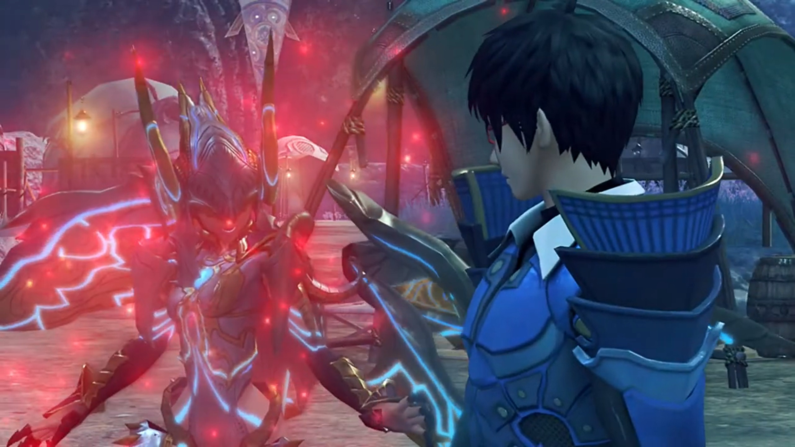

"_Ahhh... So that means that the Aegis... Is a mere mortal right now..._" She clung to her pain, struggled to stand. But she could not yet fall, lest the enemy took her away. Step by step, he aimed at her, "In that case, a little more damage, and she'll be **easy to deal with!**" 

He ran towards her; she reacted quickly, dodged a thrust that ended deep into the rocks behind her. Against the rock he slashed, as if it were made of tofu, running after her despite all the frictions. "**Hah!**" She dodged once more, but he went back for her. Her body wasn't listening to her commands; she could not dodge the next slashes. 

"Ungh!" Straight at her, an X cut. "**ARRRRGGGGHHHHH!!!**" And she temporarily went unconscious, fell to the ground. 

"**Pyra!** Ungh!" He tried to went after her, but felt a jolt in his chest, dropped and knocked his head on the ground. Akhos clashed his dual swords together, sharpening them, and desired to finish her. The slash was blocked by a growing shield, which grew into huge winds and pushed him back. 

"Hngh!" 

"Kids these days, I swear! Can't leave you alone for a minute!" Vandham entered the scene. 

Rex: "**Could use a hand!**"

"Leave it to me. I'll take this dog **down**!" And he launched a sandstorm at Akhos and Obrona.

"Hngh!" Akhos easily sliced the sandstorm to nothingness. He saw Vandham threw his dual scythe up into the air, which Roc caught, swirled, and launched a giant sandstorm tornado at the two. 

"Ugh!"

Obrona: "**UAAHHHHHHHHH!!! What's happening?!**" The swirling was so strong she started swirling with the tornado. Her red particles had dissipated to nothingness. 

Akhos was even more surprised, "What? **The ether flow's disturbed!** Grh! How am I supposed to deflect **now?!**"

Vandham: "You and your fancy moves. You lack- grit." No deflecting, he aimed to attack him face to face. Passing through the sandstorm, he did not see Dromarch biting Nia's ring in his mouth poached, sliced at him just after he exited the sandstorm. 

With a handsome roll and getting back on the ground, Obrona joined him, he complaint, "Huh... Just too many of these bit-players..." All had been facing him alone. It's time to leave. "**My interest has waned. Obrona! Perhaps its time for another tale.**"

"Meeerggghhh... Sure, sure." And they escaped. 

"Tch." Vandham was unwilling to let him go, but he could not easily fell him; plus, they had burdens with them. Nia, on the other hand, had more time thinking about Akhos's words from  Jin, now that the battle's over and it took over her mind. Dromarch sensed her sadness, didn't disturb her. 

Pyra temporarily regained consciousness, lumped forward, seeing everything around as stars and blurry, one step by another, like a dehydrated person in a desert whom cannot find water. She fainted a few steps later, the sound of her dropping to the ground alerted Rex, and she ran for her, "**Pyra!**" embracing her within his arms, "**Pyra! Pyra!**"

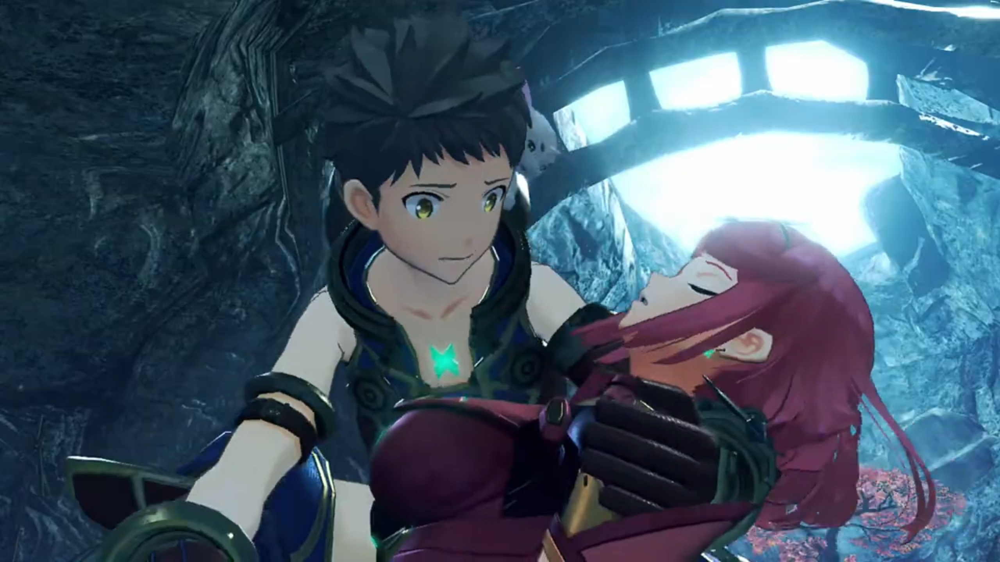

---

No sign of her waking up. They'd brought her back to her bed, and his team gathered around, looking after her. He was on the alleyway outside the room{{footnote: Enter the alleyway through a door from the outside, and the alleyway had access to rooms.}}, looking afar, turning around and walked over to Vandham waiting inside the door. 

"How is she?" 

"She's not badly hurt. Dromarch... thinks she just needs rest."

"That's good to hear."

He blamed himself, "_Maybe... I used too much power again..._"

"_Hey, Rex..._"

"Hmm?"

"Know what the difference is... between me and the Akhos fella?"

"Well, he's a bad guy, trying to get Pyra... _and you're_... not?"

"**Hahahah!!!** Thanks for the vote of confidence, kid. _What if I told you... that we weren't that different?_"

"Huh?"

"My crew at the village, **we think** we're fighting for **justice**. _But a just fight? I'm tellin' you now, there's no such **thing**._ What people call justice? It's just **an excuse** to fight. **War** is war. The more you stand up for yourself, _the more people wanna fight you. Before you know it, you're in a war..._ Listen. _All I'm saying is_, we got our fight, and he's go this."

He can't put himself in Akhos's shoes, nor view Vandham the same as Akhos, rebutted, "But what he's doing is-"

"_Yeah, it's bad. But war ain't about right and wrong. Power. That's all it is._ And power can take many different forms. _It depends on the heart of its wielder._ If we don't use our power, just 'cos we're scared of it, we're **done for.** _As for who's right... and who's wrong..._ No one knows for sure. _So_, all we can do, is **protect**... what's important."

"I think I understand." He turned around and looked through the door where Pyra laid. 

"**We all got our own war, kid.**"

"My... war?" The seeds had been planted, though it needs time to germinate. He may not yet understand, but it won't be long. The roads they walked were the water and nutrients cultivating the seed. Only in continuing the walk can he understand, what does she means for him, and he for her. 

---

===

"**Good morning!**" Pyra walked in with Nia and Poppi to the boys' tents. 

Rex was overwhelmed, "**Pyra! Feeling better?**"

"Yeah! I slept **so** much!"

"Good. Glad to hear."

"Also... Nia's got something to talk to you about."

"She does?"

"Yeah. Go ahead, Nia."

"Ah, erm..." In front of so many people? She felt shy. "I... Rex... I-I-I want you to come help me."

"Ermmmm, come where?"

"To Vandham. I need to tell him about... my past with Akhos and all that lot."

"Ah, **sure**! If you'd like me to, **I will!**"

"Thanks!"

Pyra shared, "Nia... originally said, she was going to go alone. But I said- maybe it'd be better- if you went along too."

"Er... Maybe I should explain... Vandham... _He... kind of scares me a bit..._"

"**Hahah! I get it!**"

---

Vandham was at the training ground overlooking the new recruits training when everyone was approaching him. He shouted out, "**Oh, it's you guys? What go you out of bed** so early?"

Rex: "Nia?"

She walked forward and took the stage, "Thanks for yesterday. You saved our skins. That guy, A-Akhos, I mean... I wanted to tell you about him... you see... **Thing is, we used to be...**"

He cut her off, "Being a mercenary, you meet all kindsa different folks."

"Huh?"

"_Your country, family, money_... People got plenty of reasons to fight. _Like fightin' for a special girl._ I see that a lot. _Though not every girl has a strange crystal in her chest, eh?_"

Rex: "Y-y-you mean Pyra? W-we're just..."

Vandham: "Nia, _you're with these guys right now._ **_That's what matters._**"

"**But... aren't you...**" She was so confused right now; she had not the chance to speak her story. But Vandham had already accepted her, a former member of Torna, which he might've guessed from their conversations yesterday. She don't know what to say. 

"**Anyway. Rex, weren't you saying you wanted** to get to Elysium?"

"Yeah... But, we hit a snag... With a monster like that in the way, it's impossible. No Guild ship's getting close to it, without going down."

"Well, I've got an old mate. In the Urayan capital. Got a feeling he might know a way through."

"**Really?!!**"

"**Yeah!** I gotta go there anyhow. So I could introduce you."

"**Vandham! Thank you!**"

"Nah! **It's destiny** or something. Don't sweat it. **Get your stuff together,** and meet me by the village entrance." And he walked away. 

---

At the village entrance, the group and Vandham met Yew and Zuo, biding farewell. Vandham: "Time to head out. **Yew! Zuo!** Take care of this place, yeah?"

"Nae worries. Leave it to us, Boss!"

"**Boss. You're in a good mood, somehow!**"

"**Eheheheh!!** I guess so. Well, take care!" And they took off, with Yew and Zuo watching them off. 

Unbeknownst to them, behind the rocks outside the entrance hid some people also overwatching their journey. Two person, actually, probably one is his/her blade. They both had hoods over the heads, but the guy taking the weapon was presumably the Driver, and such muscularity, perhaps a guy. The other green hair ones, wearing huge glasses. They spoke not a word. 

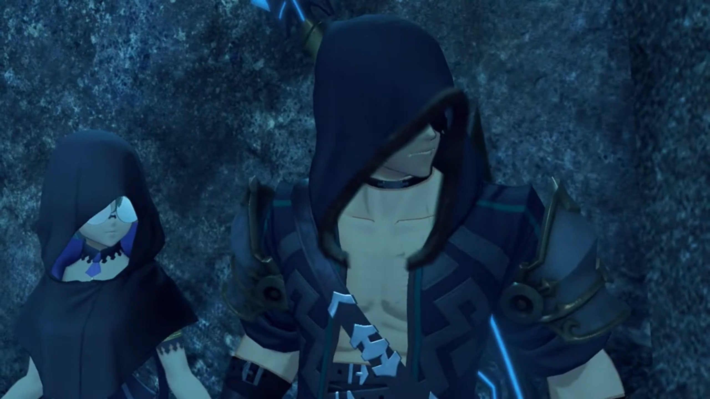

---

On the other side, a Titan ship was floating above the Cloud Sea when the emergency alarm sounded, it tilting to its side, about to wreck. Soldiers were dispatched; but they were no fight for Jin. Every step he walked, all fell to the ground, forming a meat wall. His sword sliced through so quickly they had not fell their flesh disintegrated into shards. The Blades just saw their Drivers fell dead, had not the slightest time to react, immediately turning back to Core Crystals. In front of the door of his destination, multiple slices and it slammed to the ground, its shards. Within was rows upon rows of Core Crystals. With explosion, the Titan ship went down, sunk below the ocean. 

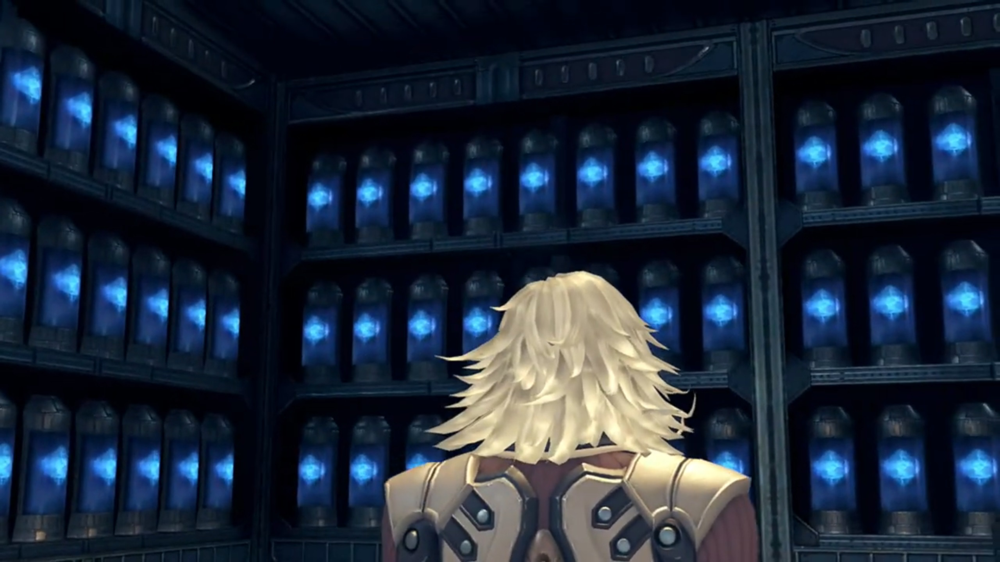

### Footnotes: