# Bringer of Chaos, Fonsa Myma

Everyone was quietly traversing to their destination when a laugh intruded the silence, echoing in the environment. 

"**Ahahahah!** Look like all the chat about the Aegis was true!" The group searched around to find the source of the voice, to no avail. 

"**Who're you?**" asked Rex. 

He revealed himself, got himself in front of them. That's the muscular man and glasses girl that followed them for long. "**That's a heavy burden you have there. Sure you're up to it, pipsqueak?** See sense, step aside, and let the **big boys** take charge. C'mon. **Yield** the **merchandise**!" Their show would not be perfect without the body language dabbing and zabbing. 

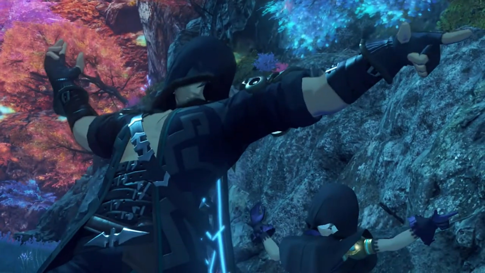

Stars swirled in their head, "Huh? What? Vandham, do you know this guy?"

"Never seen him in my life."

"**BAH!!**" And both removed their hoodie, revealing themselves. 

"**HUH!!**" What's with the sudden jolt? 

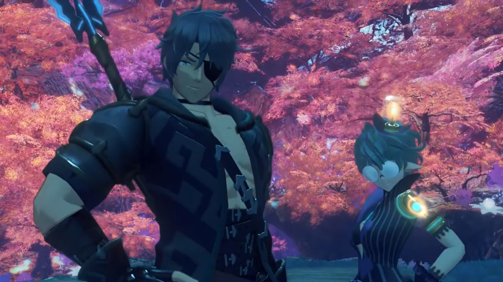

The man had an eyepatch covering his left eye, like a pirate, with scruffy hair, and his shirt doesn't zip in properly to show his muscular chest. A belt strapped across his chest, to hold the weapon behind him. The girl had a lightbulb on her head and her elbow, green hair, probably his Blade. 

Rex: "**Wait... are you...**"{{footnote: Gramps climbed out of the helmet to look closer.}} 

Hah, finally! Finally, someone who recognized the big boys, huh! Never knew one's so popular that you'd know us. Come one, don't hold back your praise! One's waiting! "Huh."

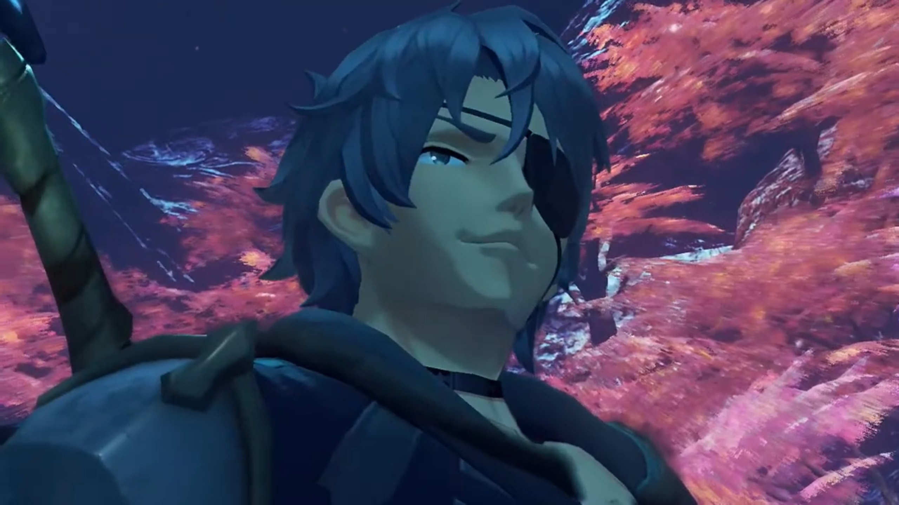

"_Uh..._" 

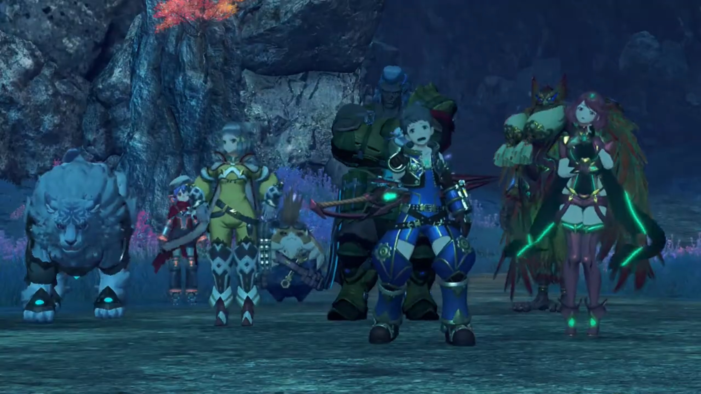

Broke their pose. The group tilted their head, he and his Blade overreacted by tilting their whole body. Such incomplete sentence, how dare you! 

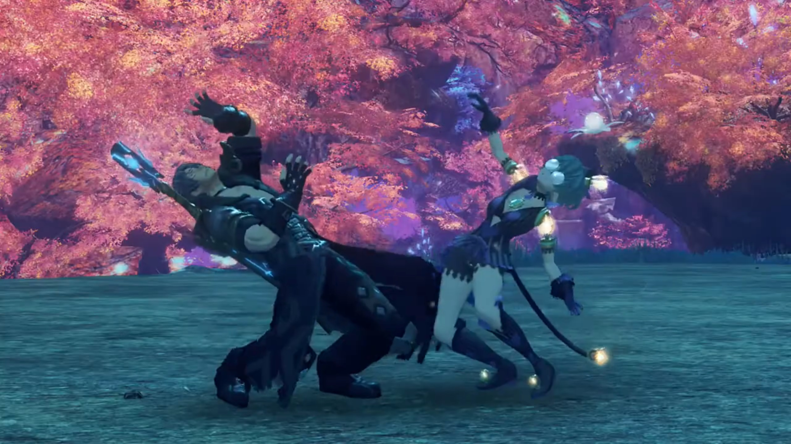

Talk about slipped waist, he had to support himself to get back up. The fury burnt in his chest, raged through his skin, and he blurted out, "**You really are a bunch of rinky-dink, bogus, two-bit, no-mark Drivers, aren't you?**" Catwalkingly, showing off his chest, he introduced himself, showering the group with his saliva, "**Behold the mighty... ZEKE. VON. GENBU! BRINGER OF CHAOS! Mostly known as Zeke. And often addressed as... THE ZEKENATOR!!!**"

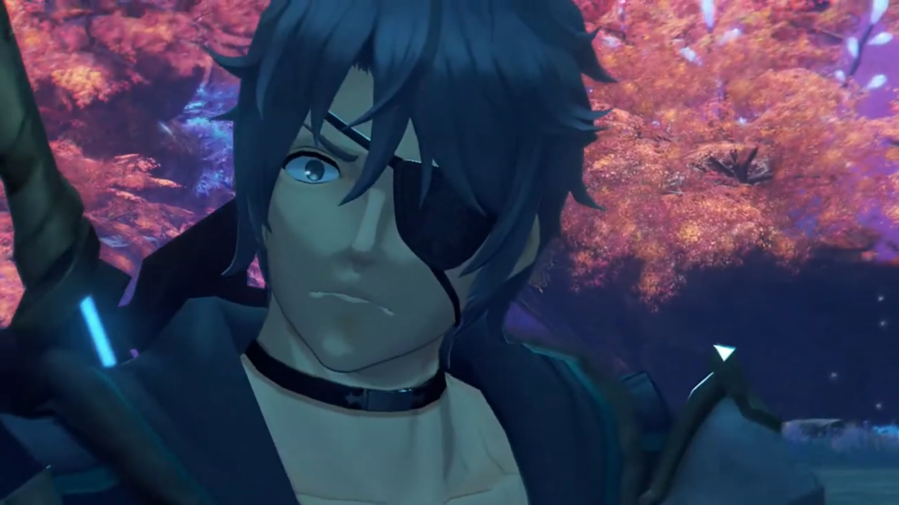

"**Behold, my Blade! Pannnnn-doria!**"

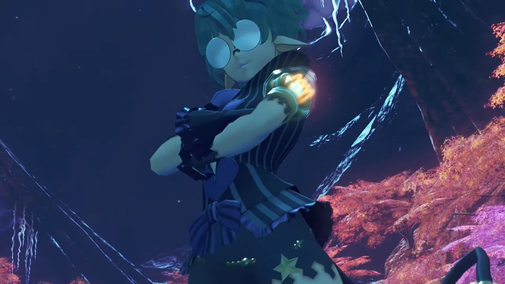

Wait, one more; the weapon he wiped and clean and polished and waxed everyday deserved its own introduction. He pulled it out from behind, aimed the shiny parts at the group, "**And this is my sword, the Purple Lightning Dreeeeeeeam-smasher! If you want a taste, come- and- get it!**"

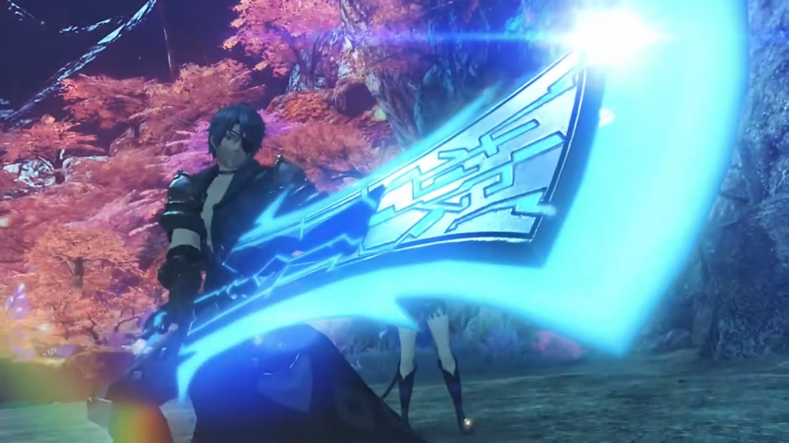

So dumbstruck the group had not yet recovered from what to say of this duo. Rex took the calm approach, acknowledging their need for mental hospitality, replied, and walked past them, "We're good." His friends followed. 

But no, how could you not give me your attention? Where's your respect for the big boys? How could you? His stuttering head tilted as he zapped onto Rex's location, "**Good?! No! W-w-wait...**" With incredible speed, he rounded around and landed in front of them once more, "**Wait! You BARBARIANS!!!**"

Nia blurted out, "This guy... I'm tired of him already."

"Gah! You think you lowlifes, can **lick** the **three of us?**"

"Three of you? I count- _two_. Lost someone?"

Blink! Wait, oh dang, how could we forgot to introduce him. Awkward... But it's OK, if one don't feel awkward first, it'll be them who feel awkward. Regaining his posture, "_Huh? Oh_, get a load of this... Our **beloved mascot... Turters, REVEAL yourself!**" He searched his chest for Turters here and there, to no avail. The panic air took over as he and Pandoria started worrying, "_Huh?_ Turters? Turters? Turters, **w-w-where are you, boy? TURTERRRRRSSS!!!**"  

Eager to help, the group looked around to see if there was anyone moving. Then, Pyra felt something touching the bottom of her feet. She backed her feet away from it, looked down, and a green turtle was crawling towards her. Her heart melted, as she took it to her hand, caressing it, "**Oh!** Hello, little guy! How are you? What are you doing, out here all alone...?"

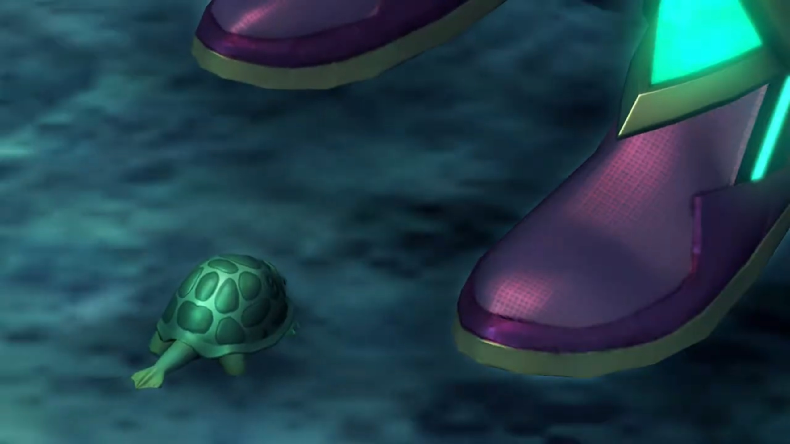

Zeke was on the ground searching for Turters when 'little guy' struck his chord. With a zap, his head swung into position and saw the beloved Turters she was teasing with her little fingers. 

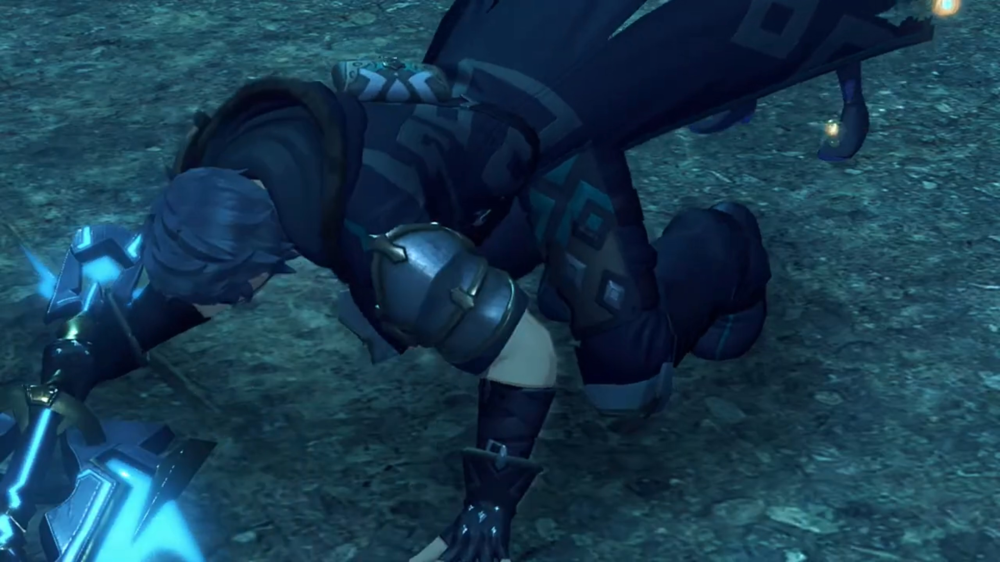

"**Ah-ah-ah! Turters!**" 

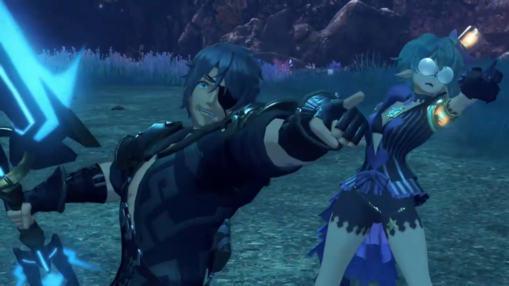

The speed he threw himself in front of Pyra and snatched Turters away from her, "Handling a man's turtle!" She was awestruck, saw him dashed back to where Pandoria stood; and they rejoiced the safe return of their beloved mascot. 

Rex couldn't understand, "Urrrr... He could have just... grabbed Pyra there. Why'd he go for his turtle instead?"

Nia had had enough, "Ugh. What an idiot."

Blink! You call a man 'idiot'? How dare you, BARBARIAN, calling the ZEKENATOR an IDIOT!!! He compressed his anger, called out, "...Gah... Listen, whata- **whatever.** She'll be mine soon enough!" Pointing at Pyra. "**GOT A PROBLEM WITH THAT? THEN COOOOOME AT ME!** Andddd **DON'T HOLD BACK!!!**" 

With full mighty force, he pointed his sword once again at them, not forgetting to wink and tried to use his handsomeness to lure Pyra. 

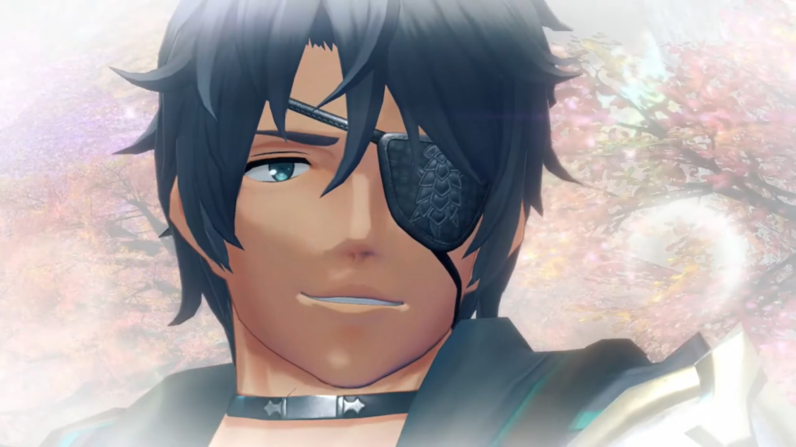

Nia couldn't distinguish between seriousness and playfulness anymore, "What! Is this guy, for real?" But they summoned their weapons anyways, prepared for battle. 

---

Dragging along the ground, he was somewhat tired of the battling. "(pant pant pant) _G-good try. Not bad._ Bu-bu-bu-bu-but! Wipe yourselves down, and get ready... for my super-**ultra-MEGA-MOVE!!!**"

Nia impatiently urged to finish this quickly, "We're waiting with bated breath. For your super-duper-whatever." 

How could you? How could you? **How could you?** Electric sparkles on his body surface as electrical ether elements gathered at incredible speed. "**You asked for it! HYYAAARRRRGGGHHHH!!!**" The sparkles it released they had to shield their face from the tingling shock of electric sparkles. Thunder raged from above the sky as he drew ether energy at immense speed, charging his sword to its maximum, and shouted, 

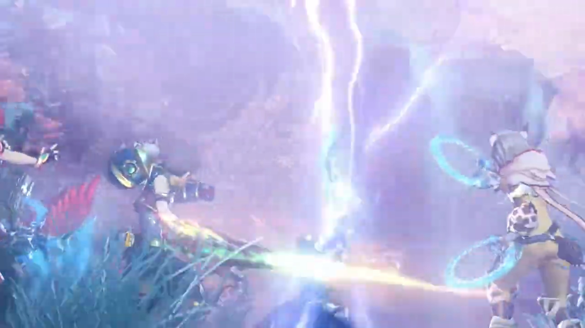

"**BRINGER OF CHAOS!!! ULTIMATE LIGHTNING FURY SLASH!!!**" Bang. He carved a letter on the ground; and he missed the group, deliberately or carelessly. 

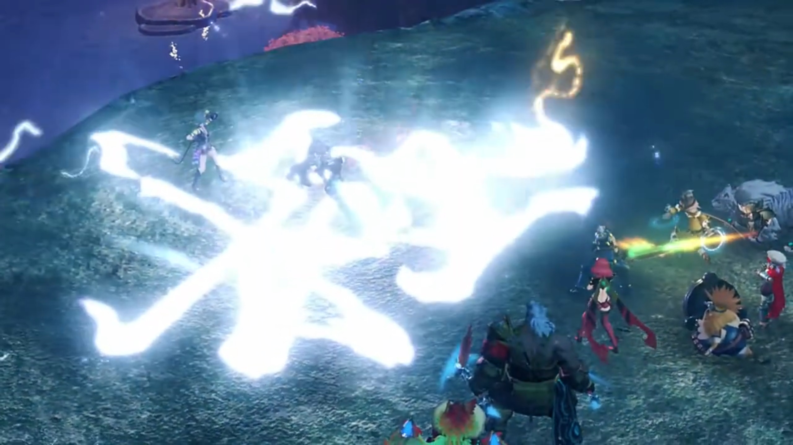

The electric sparkles dissipated not longer. He got up with his sword still stuck to the ground, "Huh!" Scared now? Have you seen the move by the big boys? Now you'll hand over the Aegis? 

"Um..." Unbeknownst to him, the group backed away one step; Pyra tried to remind him, but he was too busy showing off he did not notice the crack on the ground where his sword hit. Grinning at them, he suddenly felt the ground trembled below him, 

"**Whoaaaaa!!!**" The crack grew larger and larger as they tried to balance themselves, until the whole cliff collapsed, "**WRRRAAAAAGGGHHHH!!!**" Bringing the chaos and rocks away with them to the lake below. 

The group was dumbstruck, Rex confusingly asked, "Wh-what just happened? They..."

Nia: "Ugh... What an idiot."

Vandham was satisfied with the entertainment, "Don't see that everyday..."

Nia urged, "Come on. That's enough nonsense."

Dromarch agreed, "Indeed."

Rex looked at Pyra and 'reluctantly' leave. Hopefully the two was alright... Poppi watched the group's reaction before following, step by step, swinging her hands robotically. None leaves a second thought of his fate. 

---

The watery village by the entrance leading to the top. Buildings stacking on top of each other, accessible by stairs. This, is **Fonsa Myma, Capital.**

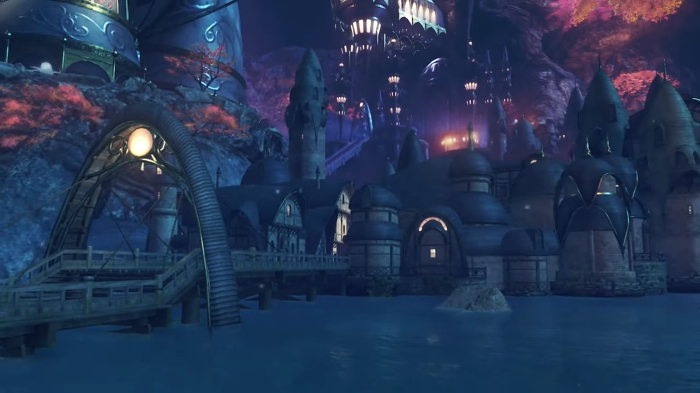

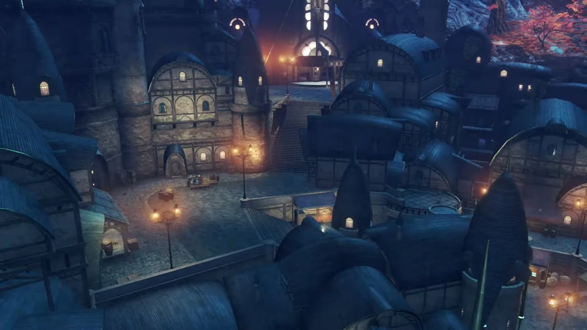

---

Turquoise grass paved the various rings of fields before leading them to the entrance to the City. At the dock parked a giant new-looking Titan ship, unloading cargoes, or maybe loading cargoes. Salvagers were gathering outside, chatting. The group was near the ship. 

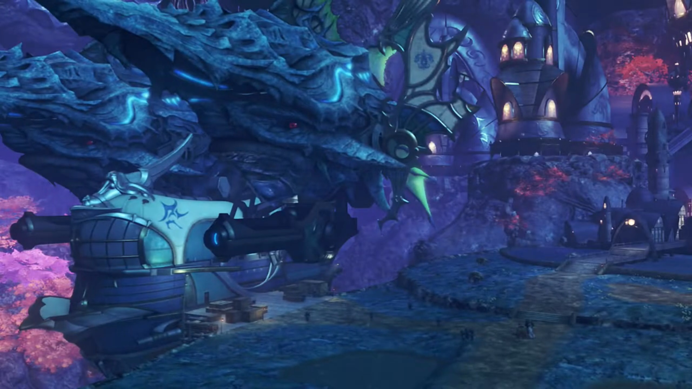

Dromarch noted, "War, with Mor Ardain, is looking more and more likely by the day."

Vandham added, "Looks like they've _expanded the military program. That's a lot of warships._"

Poppi noted, "These ships, look different to normal ships."

"Yeah. We don't much about with our Titans much. No need for it. Urayans like things pretty natural."

Rex shared, "I've seen Urayan ships before, back in Argentum. It's like the **total** opposite of how the Ardainians use them."

Dromarch suggested, "That could be one reason they're- always at each other's throats."

Gramps added, "They've been like cats and dogs for a **long** time..."

Nia expressed, "Well, from where I stand, the Ardainians are worse. All that metal's just bad taste."

"It's easy to think that way, but you're not considering, how the Titans **themselves** feel."

"Huh? Don't all those modifications hurt?"

"When Titans live with humans, that's just the way it is."

"_Hmm..._"

"I used to have a hut on my back, and a crane, stuck where the sun _doesn't shine._ I never complained, not even when Rex fired up a grill on my shoulders."

Rex rebutted, "**Hey, you used to like that!**"

"Mm... Well, yes, I did like that. In fact, I miss it..."

"If I did that now, we'd end up with a **roast Titan!**"

"Indeed!"

"**Uhuhuhuhuh!!!**" Pyra laughed at their exchanging jokes. 

---

Entering the city, people were queuing in front of a reception desk.{{footnote: Yes, reception desk usually build inside a building to greet you when you enter it, but who says you can't build one at the front door of a city to greet you when you enter the city?}} Rex wondered, "What's that?"

Vandham explained, "It's a distribution center. The government tries to ration out what little resources they have. In practice, it's just first come, first served."

Just then, the girl with green hair received, "OK. That's the last one for today."

"Hah!" She felt gratitude; finally, one more day without fasting. But before her hands could reach it, and her dreams could accomplish, someone buff knocked her aside; she went down and kissed the ground as the buff guy took her place. 

"Ah!" Pyra's heart triggered and she went for the girl. 

The buff guy took the cup at hand, complaint, "Come on! I'm a soldier! Been busting my gut for this country! That should be going to **me. Not the likes of you!**"

The girl got back on her feet, felt too scared to voiced that's what she'd queued long to get, and felt she shouldn't go away to give up what's deservingly hers. Tears were to roll down her cheeks; the soldier didn't like that look,  "**Uh? Don't** look at me like that! **Respect your elders, you snot-nosed BRAT!!!**"

Pyra got beside her and questioned, "_Are you OK?_" Then, she turned to the soldier, scolded, "**What do you think you're doing? She's just a child!**" Rex came forward to protect them. 

"**Whaaaaaat?!**" Can't believe it. Everyone's stomach's rumbling and you care about a child or an elder or an adult or what? Come on, my belly's more important than them. "Huh? **Huh? Who the hell are you?**"

The rest caught up from behind, with Nia persuading, "Rex... This isn't our business. **Leave it!**"

"Urgh! Being an adult isn't just about barking orders. **Sometimes, you need to help someone weaker!**" shouted Rex to the soldier, not listening to her. 

"Urgh! **Shut your face! You _don't know_, what the **hell you're talking about!**" And he summoned his weapon, twin ring, and his blade, a standard tiger. And the battle begin, with others originally in line and those distributing already gone, none of their business. 

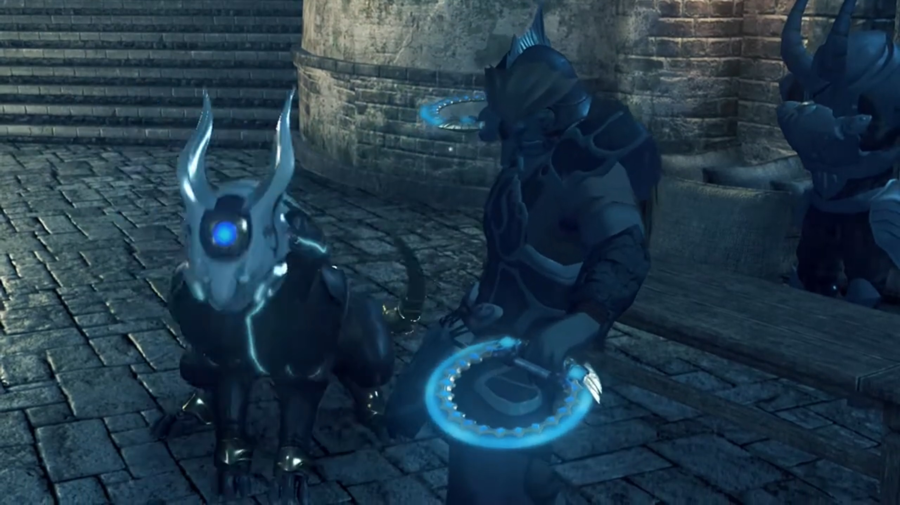

---

"_Huh_ **Huh**... Wh-**who are you?**" Then, he looked closely at Pyra, backed a few steps, "Huh... Th-the color of **that crystal! You're...! ERRRRAAAARRRGGGGHHHHH!!!**" And he ran away, up the stairs. 

"Not good. He'll be bringing others before long." exclaimed Gramps. 

Vandham noted, "The rumors about Pyra must have _traveled pretty far. Even grunts like_ **him** have heard 'em."

Pyra felt "Sorry... I guess, I should have used the cloak...{{footnote: Yeah, the cloak from Tora.}}"

Poppi thought more, "But, who spread rumors?"

Vandham: "From what I hear, it's some... fancy-pants Nopon **merchant**."

"A Nopon merchant...?" Who can it be? Rex was thinking hard about it. 

While he was going through the list of those he'd traded with before, the girl they saved went up to Vandham and called out, "Excuse me, Mister Vandham?"

"**Uh?** Oh! **Well, if it isn't Iona!** You grew a fair **bit!** How's Grandpa Cole doing?"

She dropped her head, and he read it, "Ah... Not too good, then."

"Who's this?" asked Rex. 

"Huh? Ah, this is Iona. **That old friend of mine** takes care of her."

Pyra walked up to her, bent lower to her level to look at her face, greeted, "Hi, Iona. Great to meet you!"

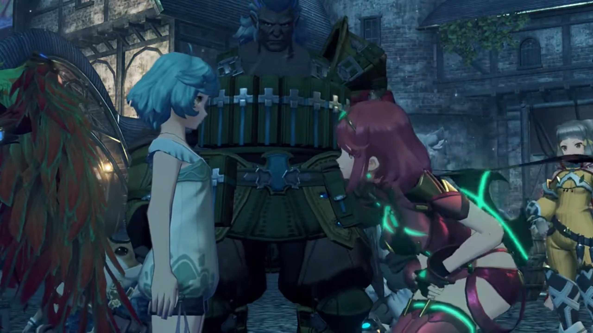

Vandham urged, "**C'mon!** Let's beat it before those *soldiers* show up."

---

"Hmmm." The group was led outside a building that looked public. Outside the building was some drawings lining the walls, and a mannequin figure looking towards the building was placed in front of the door. 

Dromarch asked, "Is this... some kind of theater?"

Vandham acknowledged, "**Yup**, it's a theater, all right. The guy we're here for leads the troupe here."

Rex: "Ahhhhh. Actors, eh."

"And right now... they're in a middle of a show... _Well? Wanna take a quick peek?_"

Dromarch read the title, "'The Heroic Adventures of Addam.' Might be interesting." 

Her smiles dimmed. Addam... memories buried deep upon eons and eons of more recent ones rushed back, awash her brain. 500 years of reminiscing, he could no longer return; the short-lived of that era had banished in dust and clouds, only their memories retained. 

"I've never been to the theatre before!" shared Rex.

"Neither has Tora!" as he bounced up and down. 

"_Let's do it!_ Nice and quiet though. Looks like it's pretty _packed today._"

"OK!"

"Mehmeh!" And they already entered. Despite memories and thoughts, she moved like a zombie, urged by the group, into. Wonder what memories the show will brought her back. 

---

"And I saw at _that time_, that **the powers of darkness had engulfed**, almost everything!" narrated the guy on the stage. "**People**, and Titans alike were **draaaaawn** into the abyssal **vortex**!"

He continued, "The apocalypse was upon us! **The end was niiiigh!** _But then!_ Despite the wounds alllllll over his body, the **great Addam stood...**" 

The actor that acted as Addam, wearing some shiny helmets and armor, walked up the ship, raised his hand up, and shouted, "**O Architect! Grant me power!**" And he raised his sword into the air. "Power to banish the dark! Power, to illuminate the world!"

Many abominable creatures below the ship appeared out of the sea; their red eyes fixated on Addam. The darkness had already spread this far? Addam jumped from the deck to the 'ocean' floor, to fight the abominable creatures alone with his sword. 

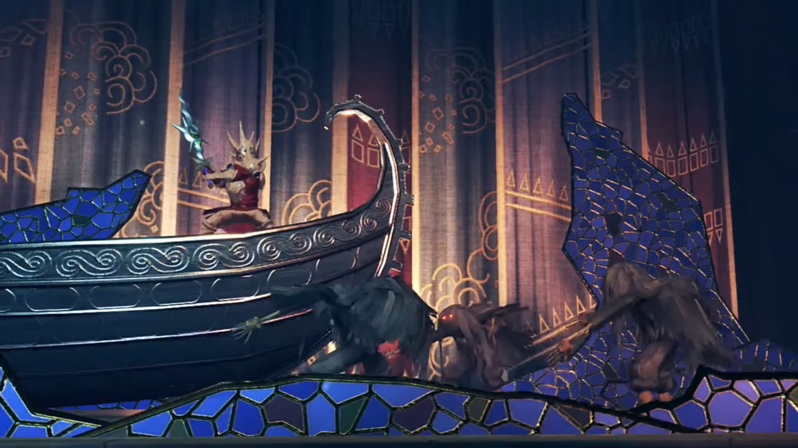

As if the Architect had heard his plead, he sent down an angel, immersed in light. Addam's heart warmth, welcomed the holy saint whom heeded his call,  "Lo! Loyal servant of the Architect! The Aegis! **O Aegis! Bless me with your power! Bring light upon the world!**"

The angel raised her hand and threw some paper scraps down to the sea, the bright red light shone above her crown. The abominable creatures self-ignited, till they turned to ashes. 

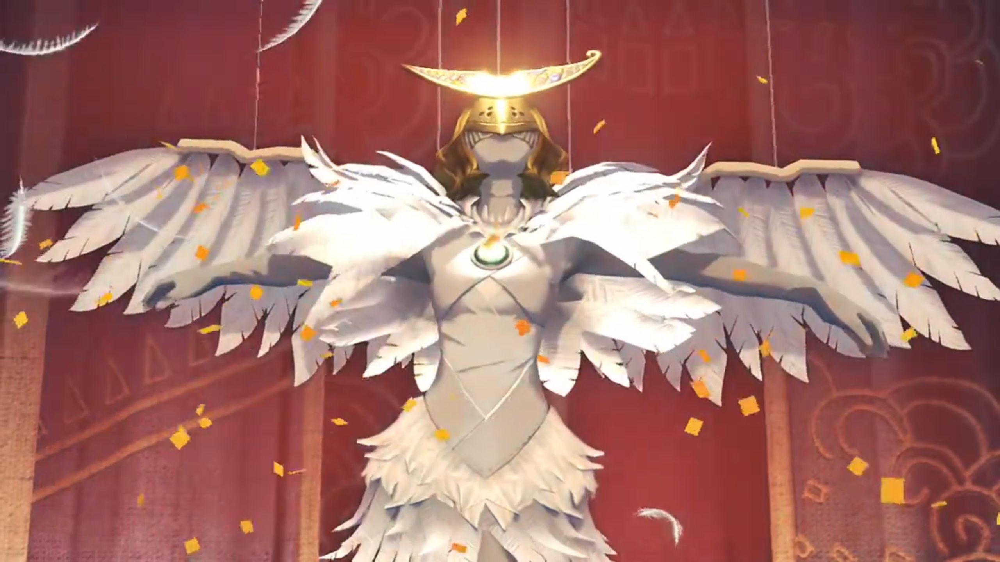

"Thus, they defeated the darkness," continued the narrator. "_But at a **terrrrrrrible** price!_ **Three great continents, sank beneath the sea of clouds** forever."

Bright light from the other side of the door slightly illuminated the front of the dark room, where the Aegis laid flat on the ground. Addam arrived, voiced, "Servant of the Architect! By thy power, **the world is saved!** For the gift you have granted us, we are eternally grateful. I shall spread thy legend, far and wide! May your name live on, **for eternity!**" He knelt down and princess-carried her, through the door to the lights, and the curtain lowers. 

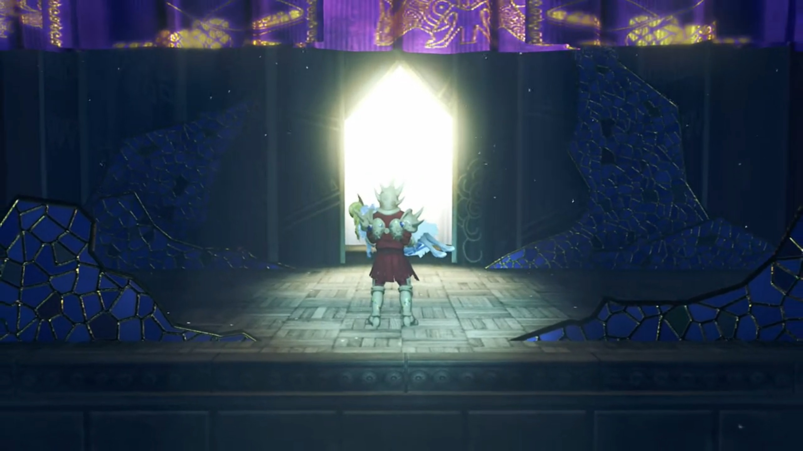

Everyone except Pyra clapped. To return to the period once more, reminded her of sad memories, lost, depressed, desolation of that era, she's courageous to sit still, not broke into tears. Rex looked at her, wondered, let her had time for herself. 

---

Exiting the theater, Nia called Rex quietly, "_Hey!_" He turned around, she continued, "_Kind of awkward, right?_"

"What was awkward?"

"I mean, that play... it was **about** Pyra. Must have been... kinda bizarre for her, eh?"

"I dunno... I guess?"

"May-be, _you should go and make it right._" She walked away, leaving the confused boy. 

"**Make it right? How?**"

"_Idiot. Figure it out yourself!_"

"**Huh? What am I supposed to-?**" He heard footsteps and turned around. Pyra had came after him, "Errrr... Ummm... So the theater..."

"**Wasn't it in-credible?!!! They had the cloth moving, just like real clouds!** How do... you think they did that?" she tried to keep an exciting voice; Rex was awestruck by her reaction, couldn't understand. Does she feel sad, or does she not? 

His mind temporarily stuck, he stuttered, "**HUH?...** Ah... Yeah! The clouds were pretty cool. They were so... **cloudy**?"

Gramps couldn't bear listening to it anymore, jumped up from Rex's helmet, and BANG him hard on his coconut head. 

"**OW!**"

Gramps quietly asked, "_What are you saying, bonehead?_"

"**There's no need for that!** I don't know what to say in a situation like this!" She seemed to return back to reminiscing, didn't even notice the little drama Rex and Gramps had. 

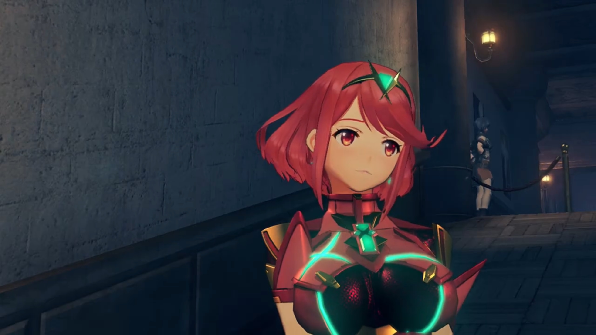

---

At a room behidn the theater, a dark room with lots of objects and drawings; their silhouette barely seen in the dimly lit room. One tiny ether lamp on the table, someone cloaked sat on it. Vandham and the others entered, he greeted, "**Comin' in, old fella!** Crikey! **Still collecting the junk, are ya?**"

"_Watch it, you bruiser!_ Don't make fun of a mannnn's hobbies!" 

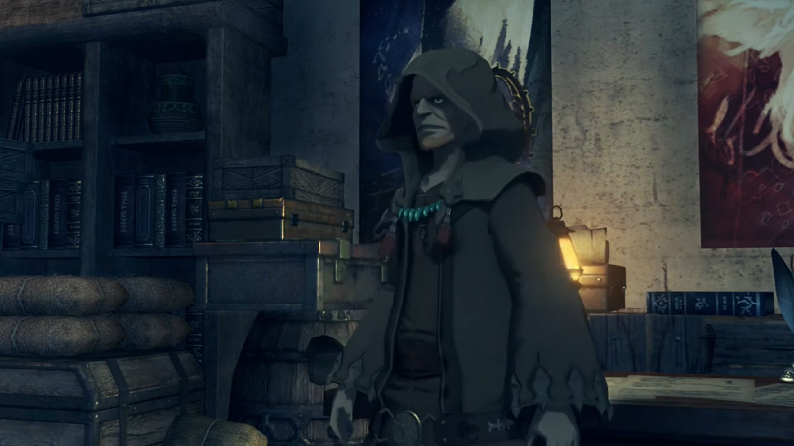

"**Some greeting** for your old **comrade**!"

"Comrade?" Nia picked up the word. 

He explained, "Yeah, I was a freelancer before the firm got going. Believe it or not, me and this old fella tore up a good few **battlefields** in our day."

"We sure did. And thanks to that **bleeding** heart of yours, we almost never got *paid*!"

"**HUHAHAHAHAHAH!!! Says the guy in the theater troupe! You can't be** raking in much dough **either**!"

"Hmph. Well, what can I do for you, friend?"

"Cole, you're old, ain't ya? Old enough to know... **how to cross over** to the World Tree... _Get to Elysium, I mean._"

"Elysium? But why? W-w-why would you _want to go there?_" He eyed the group for any info, then saw her. With suppressed excitement, he noted, "_That Core Crystal! You... You're... So the Aegis is back amongst us... Who is your Driver?_"

"**I am.**"

"You? **But you're... so young...**"

Vandham urged, "**How about it, old man?** _Do you know the way or not?_"

"Hmmm... I dare say if you've trekked all the way here to ask me, you've already tried **going** yourselves?"

Rex acknowledged, "**Yeah**... But we couldn't make it."

"**No wonder.** No one can get to the tree, while that **thing's** guarding the way there. _It won't let anyone past._ But... **a long time ago, there was a man**... who went up the tree. Met the Architect, too."

"There was...? **Really?**"

"Yeaaaah. I'll wager anything, he's got an idea how to get there again. You should try asking him."

"**Uh who was it?**"

"Engh... Hmph."

"**Please, tell us!** I've got to get to Elysium, no **matter** the cost!"

"Well, I can tell you. But first, I'd like to have a word with her, if I may. With- the- Aegis, I mean."

"**With Pyra?**" He turned to look at her. 

"**Of course!**" she permitted. 

"Please, through here." he led her to a secret room behind. 

---

"**Mister Cole, right? You wrote that play, didn't you?**"

"I- hope it didn't stir up any... painful memories..."

"**N-nooo... Some of them are..**. good memories." 

"Heh. You know, you're not very convincing. I'm sorry, I... really am. I **just** wanted people... to know about that time. Show people how we were back in those days... **Really**, get it across to them... Will you be, using it again? That **power**..."

"I don't know yet." Mask cannot cover, so she returned to her truthful side. 

"I just don't know... if this world can **take** it a second time."

"I know that. _I'd never use it if there was another way._ This is what I- hope for. _But..._" Not that she could predict how the future goes, she dropped her head. 

"That man's the only one who knows how to get to where you're going. Do you think you can make it to him? I just wanted to make sure."

"**We can.** I mean, it's my destiny." she replied boldly, convincing herself. 

"Yeah... That boy, who's with you..."

"His name's Rex. He's a good person. With a kind heart."

"**Reminds** me of a, certain someone..."

"Mm." she agreed.{{footnote: Addam.}}

"OK then. I'll- help you out."

"Thank you, Minoth!"

"**Minoth... I'd almost forgotten** that name..."

---

Back to the room with the others, Cole: "**Now then,** _mmm_... **wheeeere** did it get to...? Uhurgh ahargh!" Suddenly, he coughed like he was about to coughed his lungs up. 

Iona ran up to him, full of worries, "**Grandpa!**"

"*Old man! You OK?*" The others were equally concerned.

While resisting his cough, he answered, "**I'm... fine... uhurgh ahargh... I'll be... pfth... fine in a second...** uhurgh **Seriously, uhum uhurgh... don't mind me...**"

"Nah, we'd better call it _a day, old timer._" Vandham worried more about his body than their goal. 

"Hurggghhh..." Rex felt slightly disappointed, but it looked like they had to, till he at least recovered a bit. 

Vandham: "I'm sorry, fella."

While he was still fighting his cough, "**Yeah, uhurgh OK. uhurgh.** But come back again tomorrow, will ya? There's something I- want to give you. **UHURGHHH UHURHGH ARGH!!**"

Vandham urged, "Come on. I know a place we can rest." Rex looked back at Old Cole once more before leaving. 

---

He had recovered somewhat, looking at a weapon, an assassin blade, placed on the table above the scrolls he was reading. Relaxing he sat there, expecting someone to come. "Well, I'll be... It's just **one blast from the past** after another today." He turned around and faced Malos and Akhos.

Malos: "**You probably guessed**, but we're not here for a reunion."

"Just as well. **The Aegis's** gone already. _How disappointing for you, 'comrade'._"

"Huhuh! _Still an asshole._"

Akhos: "Despite the years taking their toll. **I'll wager** all the doctors in this town are **quacks**, and all the Blades are **blunt**. Obrona and I... **We could- fix that** stagnant ether flow with a minimum of bother. **What do you say?** You could still have a lot of good **years ahead of you!**" 

Iona was eavesdropping behind the doors, but no one cares. 

Akhos continued, "I mean, I won't deny there'd be a certain quid pro quo involved. But old man, _just think of the benefits!_ Come, _can't you lend us your expertise here? Do so_, and you could live for a loooong, looooong time."

"**You know**, _friend_, **I'm not as attached** to my life as I used to be. Maybe I've had enough!" He turned around, rejected.

"Your little lost souls will be simply inconsolable."

"**The kids?** No, they're strong."

"Argh. **This is becoming a farce**. A horrendously clichéd one at that! Break a leg!" Malos and he turned around and leave the room. 

He looked down at the assassin knife on the table, in deep thoughts. 

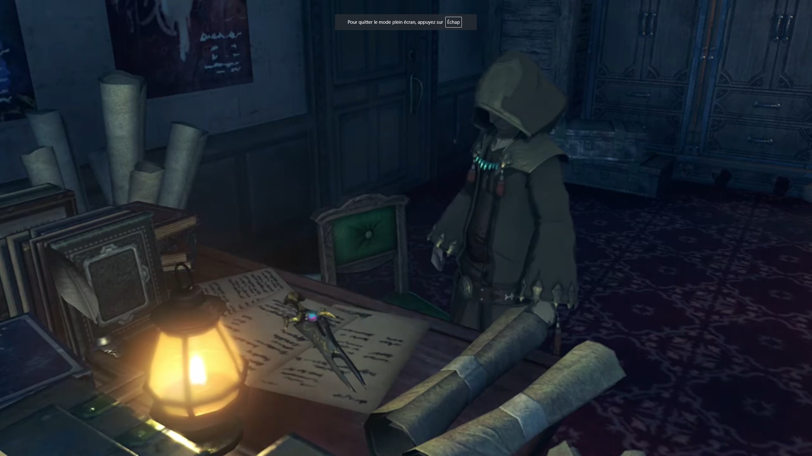

---

Outside the theater, Akhos stopped in his track. Malos questioned, "Huh? What's that?"

Akhos turned around, called out, "**Hey, don't be shy.** _You heard everything we said, didn't you?_"

Iona reappeared from behind the wooden beams, ran towards Akhos and Malos, questioned full of worries, "_Can you... Can you really help, Grandpa?_"

"**Why of course!**" He walked closer to her, continued, "_We can help._ That is, _if you can help **us**. Can you do that, for your grandfather?_"

---

At their lodge, Pyra and Nia were far asleep in the ladies' room. In her dream, Pyra was brought back to Elysium. The unending lush and green, the constant ruffling wind, the clear blue sky, the bell that chimes. Not alone this time, she sensed him standing beside the tree behind her. 

"This is... You... can't come here."

Malos: "Hmph. Charming! So **you're** making the rules now, huh?"

She turned around, facing him, "You didn't come here to talk about _the old days,_ did you?"

"Huh! We've snatched Minoth's little brat."

"No!"

"Meet me at the place of your awakening. You remember it, right?"

"_Hurgh!_"

"Ohhh, and come alone."

---

Nia opened her eyes and looked to her left. Pyra was no longer on her bed. Her brain's not working at its full, she could only guessed, "_In the loo? I guess?_" Then closed her eyes, back to sleep. 

Suddenly, the furious continuous bang on the door outside shocked her out of bed as she jumped up. 

A few moments later, everyone ran out of their room, found Cole accompanied by another guy. Vandham wondered, "**Old man! What happened?!**"

"Iona... She's gone! It... **must've been them!**"

Rex: "Who's 'them'?"

"After you went, Malos... and some other guy, paid me a visit."

"Malos was here?"

"Who was the other guy?" asked Nia.

"Didn't catch his name. But he had red glasses."

"That's Akhos! But... what would he want with Iona?"

Rex had other concerns, "Wait! **Nia**! Where's Pyra?"

"S-s-she wasn't- there when I woke up. **What? No one's seen her?**"

"Pyra... Maybe she **realized** what was going on with Iona?"

Cole: "Well, knowing those two, it's not unthinkable."

Nia: "_That girl!_ Trying to save her on her own?"

Rex was more concerned with "**Where's she gone? Didn't she leave a note?**"

"**No. I'd have noticed!**"

"I-I know where... I think it could be- Olethro Ruins."

Rex: "Olethro Ruins?"

"It's where Addam led his army of resistance from. Five hundred years ago. It's the place where the Aegis woke up, too."

"Huh!" Didn't know that before. 

"It must be that Malos is trying to **lure her down there! I'm sure of it!**"

"**Cole! Tell us how to get there!**"

"It's at the **top of the Great Stairway.**"

"**Vandham!**"

"**Hey! Fella! Take care of this old man for us.**"

The guy accompanying Cole answered, "**Y-yes!**"

Rex urged, "Let's move! If we go now, maybe we can catch up to her!"

### Footnotes: