# Vandham's final lesson

===

Pyra arrived; Malos and Akhos (and their blades) had been waiting. The 'trunk' in front of the imperfect circle was (probably) the head of the Titan. 

Malos heard her footsteps, "So lame. How long are you going to stay in that form?"

"That's none of your concern! **I am**, who I am! Where's Iona?"

"Akhos is the meanest son of a bitch I know." He urged her to look behind. Above the stairs (for people to sit), on one of the rows laid Iona, flat, unconscious. 

To Pyra's right, Akhos was watching. Obrona heard Malos's comment and laughed, "**AHAHAHAHAH!!! Son of a bitch!**"

Akhos: "Hmph. _I still think we should have sent them_... a finger, or something. But you know _best._"

At the center of the stage, Malos continued, "You know what we're after, don't you?"

"Jin... Is he on your side too?"

"I exist for his benefit. That's alllll I'm gonna say."

"_Really..._" She looked down, can't believe that, after so long, he still cannot put down what happened 500 years ago. 

Malos suggested, "Let's end this. Now." He borrowed the power of his Blade, sliced at Pyra. She raised a shield therefore. One hit, it broke. Few more hits; every shield she raised cannot fully block his attacks. Step by step, she withdrew. Step by step, he thrusted forward. 

---

"Agh!" One slash on her arm and he felt it while still on the way. 

Gramps: "**REEEEXXXX!!!**"

"I'm OK. But Pyra's fighting alone! She's close, though! Really close!" The stairs look infinite, but the entrance can be seen up ahead. The steps of stairs he still had to travel, after all that stairs they left behind. 

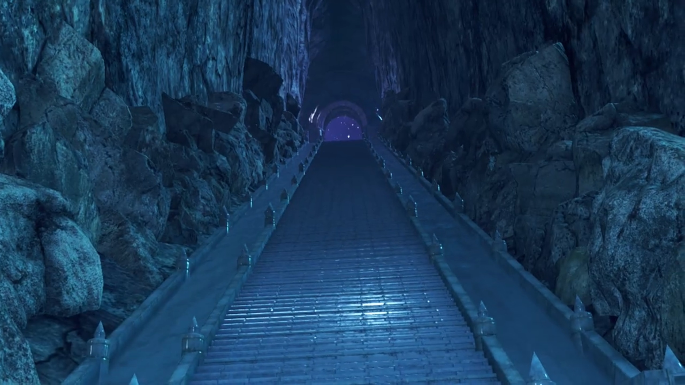

Quickly, he had to get there before she suffered more. 

---

"(pant pant pant)" she was exhausted. Without her Driver, she can't release her full strength. 

Akhos exclaimed, "Well well. I see I'm not the **only**, _son of a bitch._"

Malos: "Still defiant, I see. **Just give it up**, girl! **Think you can do it alone? Handle that power?**"

Her iris dilated, shouted her conviction, "**I won't use that power! And I won't let you use it either!**" Intense flames grew from her chest, illuminating the whole ruins. A giant fireball formed atop her. 

Akhos was surprised, "_Hmmm?_ You seem to be doing nicely without your Driver."

Not that her fate would change. Malos: "Hmph! It's like you don't know who you're dealing with!"

"Huah!" And she launched it at Malos. At a position, his blade ready to cut. 

"**HRRRRAGGGHHH!!!**" The fireball dissipated into smokes and speckles; no damage dealt. She felt desolate by such immense power he wield; even such power she summoned left him unscathed? How could she even escape? "You can't beat me like that!"

"**But maybe... I CAN!!!! YRRRAAHHHHH!!!**" Just on time, he launched himself up high, aimed for Malos. 

"**THE KID?!!!**" His blocking was still far too strong for Rex. He can't even destroy the shield he raised. He landed back in front of Pyra. The roller coaster ride of her emotions, she was glad he appeared, her hero. 

"**REX!!!**" He gave her an assured eye, and peered over her shoulder. She turned around and saw the rest coming in. "**Everyone!**"

"**Vandham, take Iona!**" He was already up there, Iona in his hugs. 

"Gotcha!"

"We'll take care of these guys!"

Malos: "Grrrr.."

Akhos: "Well, it's come to this... Hmph! Needs must! **Obrona!** Do them in!" And he jumped high and landed behind Malos. 

"Thought you'd never ask!" The battle begun. 

---

"I must admit, I've enjoyed playing my part in this... hackneyed tale, but..."

"**Teeheheheh! Time for the final act?**" She summoned more and more of her red particles and released them as a field that filled up the whole stage of Olethro Ruins. 

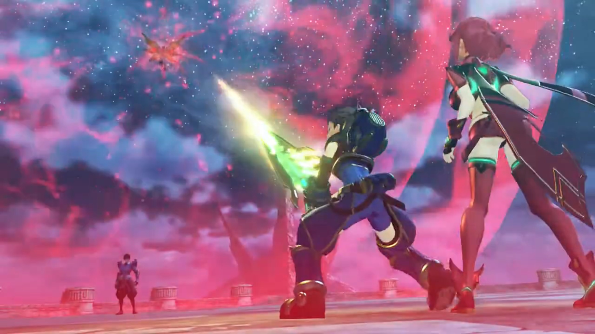

"**Huh?**" Rex was surprised, "**You're bluffing...**" He dashed towards Akhos, trying to knock him down before whatever his move was. 

Pyra knew the move wasn't a bluff, warned, "**NO! REX!!**"

He jumped in the air and landed at Akhos, whom caught his sword by hand. "**Whattt???!!**" 

"You see, Blades draw their power from atmospheric ether energy. They send their power to the crystal, where it manifests... But... **what if** we were to **INTERRUPT THE FLOW?!!!**" And the connection between him and Pyra was cut off. 

Vandham watched from atop, knew they're done for. "Shit. **Don't look good!**" He dashed down the stairs, himself not yet within the field, but he had to join the battle. 

Nia looked at her weapons, exclaimed, "Damn! The power's draining out of my weapons!"

Dromarch: "It's no good! I can't- transfer power, my lady!"

"Masterpon! Poppi feels funny!"

Tora was listening when he felt his furs standing on its end. Looking in front, Malos and his Blade were coming for them. "**Hah!**" They and Nia's duo dodged the attacks barely, dragged along the ground, injured. 

Rex was also falling backwards, desperately shouted out, "**Why won't you guys leave Pyra alone?**"

Akhos: "Isn't it obvious? _We want the power of the Aegis for ourselves!_" He slashed at Rex, brought him to the ground. He backed every step he took, "It's Jin's desire... to erase all of humankind from the world!"

"What?" Nia didn't know the before. She therefore came at Akhos, fenced. Pyra, nothing to do now, listened and considered. 500 years had not changed his wish, huh. 

"Huh!" She quickly raised a shield where Malos came at them. 

While fencing, Nia asked, "Did Jin seriously say that? 'Erase all of humankind?'"

He surely was playing with Nia, enjoying her doubts, "My, my. Surely you knew. Better than anyone. You know what humans are really like."

"Huh?"

As Akhos's sword was ready to slash at her; she was dumbstruck for a second, trying to recall. Did she know that? When? 

"**Nia! What're you doing?**" Vandham got in front of her and protected her. His Blade Roc came side by side with him. 

Akhos stopped his attacking and continued while walking towards them, "You've seen the capital. You've seen the _ships, weapons, soldiers_... All poised to invade Mor Ardain... Doesn't it make you want to _laugh_? Every corner of the world is defiled by such vermin."

On the other side, Malos continued, while battling Rex, "But that's nothing new. They haven't changed a bit in 500 years! **No wonder Father abandoned them!**"

Pyra shielded against Malos's Blade, launched a shockwave and pushed it away as her emotions fluttered with Malos's final sentence. 

"Yargh!" Malos retreated from Rex's attack, back to be with his Blade. He was tired; the sword had been draining his own ether reserves ever since he disconnected from Pyra; and now reserve is low. 

Pyra walked in front of him, announced, "No. The only thing that hasn't changed, _is you._ **Father didn't want us to wipe out innocent life!**"

"Why did he make us then? **Get real!**" Her body shaking, unsure how to rebut. "That's what we're for. **To descend on the world and eliminate these pests!**" More and more power he drew, the dark purple energy formed clouds and lightning on the surface of his body. The sheer strength of such abomination disturbed the ether flow in its vicinity. "**HRRRAGGGHHH!!!**"

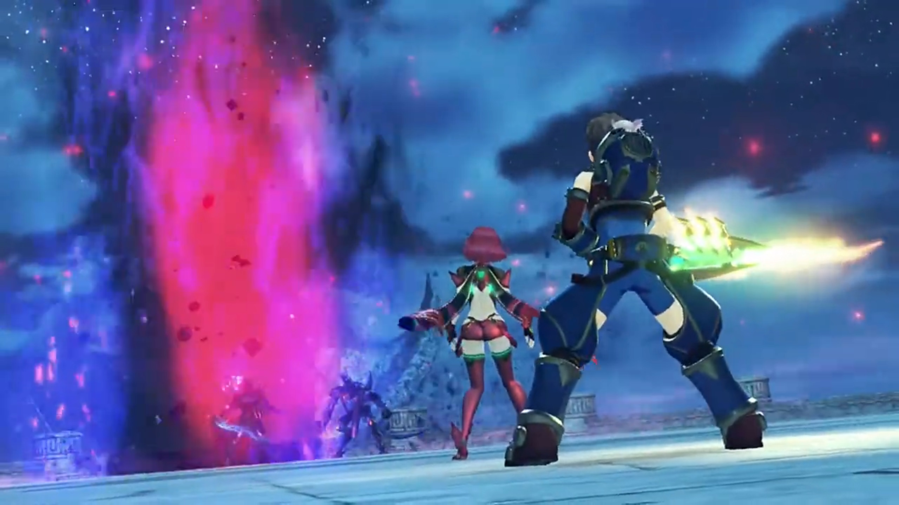

"What?!" Vandham was surprised. "Is that the power, coming from his Blade?"

Nia: "It's too..."

Malos announced, "Playtime's over. Let's end it! **Akhos!**"

"**A-greed!**"

He ran and jumped, one slash broke Pyra's shield, sent them so far they hit the edge of the seats. Poppi took the chance of the smoke they released and flew out, bringing Tora with him, aimed at Malos. The drill he easily blocked, sent them at another chairs, and dropped to the ground. 

"**Poppi!**" Electricity were leaking from her joints. 

"**Teheheheheh!**" Obrona was fighting Roc. 

"How very noble! **Next!**" Akhos aimed for the exhausted Nia. Dromarch dashed in front of her and used himself as meat shield. 

"**Dromarch! Bastards!**"

"**Over here!**" Behind her, Obrona appeared. She turned around and had her face slapped to the ground. 

"Ungh!!!"

Rex: "**Nia! Tora! Dammmmmn!**"

"**Stop, Rex! It's no good!**" He dashed to join the battle, Gramps warned, but he didn't listen. 

"**ARRRRGGGHHHH!!!**" Malos's Blade blocked his way, slashed him back to origin. 

"**Rex!**" Pyra came for him, but Malos teleported in front of her, knocked her on her pelvis, 

"Urgh! Hurrrghhh!!" And she dropped to the ground, effete. 

"Huh! Hitting girls isn't as much fun..."

Akhos: "Malos, you're the **icon** of chivalry."

Pyra: "_M-Malos..._" She muttered before going unconscious. 

"**You're not GETTING HER!!!**" Vandham was the only one still standing. He'd been clever enough to get outside the field where he could use Roc's power, launched flying feathers at him. 

Malos was surprised, "**HUH! An attack from the OUTSIDE!**"

Rex: "**Vandham!!**"

Akhos was also suffering, remembered the last time at the village, "**Ah!** The lunk is back. But, _that peashooter won't help you._ Even if you hit, _it'll barely register._"

"**Bloody idiot! Think I don't know that?**" He jumped from the stairs and aimed for him from high, reentered the field, shouted out, "**ARE YOU READY, REX?! Another, LESSON, for ya!**" He watched with awed eyes what he's doing; he had a bad feeling about this, but he don't know what yet. "**Something else you can do with a Blade!**"

With his twin scythes end, he aimed the sharp tip at his belly and plucked them in. 

"**HUH!!!**"

"**HURRRGGHHHHH!!!**"

Malos: "**What...? BASTARD!!!**"

Akhos noted with great surprise, "He's channeling the energy from his weapon **through his body...**"

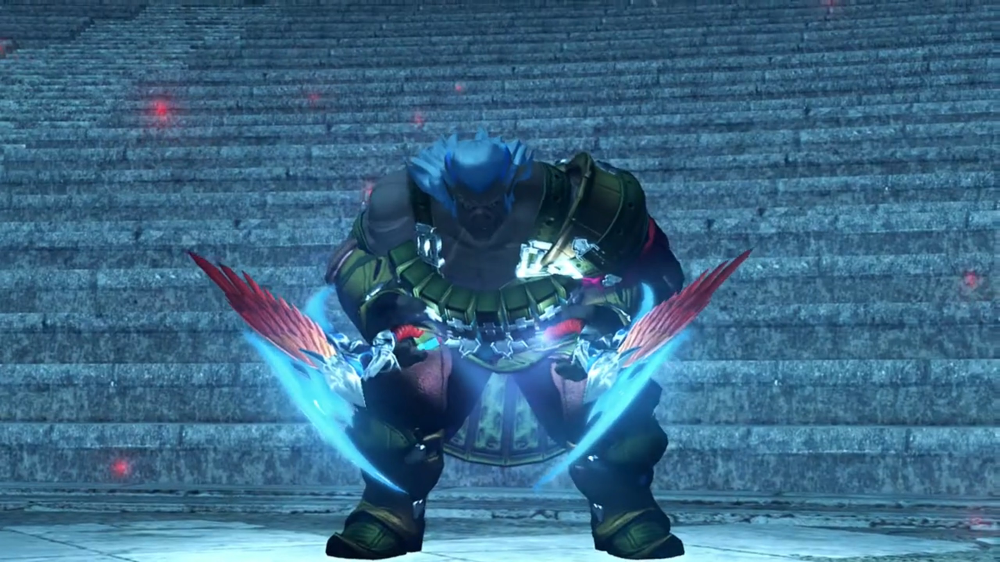

Slowly by slowly, he walked towards Malos and Akhos, difficulty in moving, "_Yeah! Nothin'- you can do- to stop this ether flow._ Nothin' at all! **HRRRRAAAAGGGHHHH!!!**" He dashed forward quick, not holding onto his weapons anymore, punched a sandstorm at them. It broke their shield. 

"**Gah!**" Malos came from the side, and he caught it by hand. His Blade came, and Roc entered the scene, stepped it with his feet. 

Nia watched with sad eyes what ends came to him. He's fighting himself against all. She got on her feet, wanted to join the battle, but felt so weak; not once had she felt nothing she can do to help. She held on to her chest, did she want to release it now? Perhaps their fate can change if she does. But does she? 

Rex: "**Vandham!!**"

He shouted back, "**Move it! Take Pyra, and SCRAM, KID!**"

"**I can't... I can't just leave you here!**"

"**HRRRAGGGHHH!!!**" The fencing with Malos did not stop while he bought time for the group. 

"Rex! Don't go **dyin' on me here! YOU GOTTA MAKE IT!!!** You gotta get away from here, **NOW! LIVE! LIVE FOR HER!!! YOU GOTTA MAKE IT TO ELYSIUM!!!**" 

With trembling hands, he grabbed on his sword, but his words reverberate his hearts, his desire. "_Huh!_" Both to protect his mentor for the short few days they spent, and to keep his promise for Pyra, fought out within him. He don't want to make choice. He wanted both. 

Malos: "**I won't allow it!**"

"**Grahhhh!!!**" He spit blood as he's near his end. The vision of Malos blurred, no longer clear in view. 

"**GIVE IT UP!!!**"

Slowly but surely, he raised his effete hands up once more, trying to summon the sandstorm. But no longer had he any ether. Malos easily broke his spell. 

"**JUST GO, REX!!! REMEMBER, TO FIGHT. YOUR. WARRRR!!!**" He watched with teary eyes, he stood there without any ether, facing down Malos, whom slowly put feet towards him. And one slash from Malos, he dropped to the ground. His twin scythe evaporated into motes. 

"**VANDHAAAAAAAAAM!!!**" On the other side, Roc turned into a Core Crystal, which his opponent grabbed by hand, and dropped it to the ground. 

Akhos: "Ohhh, please. What a cliché." No more obstacle, yes? 

"**GRRRAAAAAAAAAHHHHHHHHH!!!**" With wobbering feet, he summoned the remaining ether he had to activate the sword, dragged along his feet at Malos. 

Pyra tried hard to stand up, "_R-Rex_..."

"**ARRRRGGGGHHHHH!!! YOU'RE GONNA PAY FOR THIS!!! FOR VANDHAM!!!**"

"_N-no... We have to go..._"

Malos: "You're a pain in the ass. Little **shit**!"

"**Yarrrgghhh!!**" And he flew backwards. "Ugh... I can't... do it..." was his answer for Pyra. He get back on his feet, the death of his mentor had disturbed his emotions; which student do not fight till the end, till the last person, for their mentor? 

Nia: "_R-Rex..._"

"_Rex-Rex..._"

"**CAN'T LET YOU DO THIS!!!**"

"**SO LONG, KID!!!**" Malos got in front of him and slashed down. 

"**REEEEEXXXXXXXXX!!!**" And Pyra released the shackles to the power that she don't want to use most. Bright green light grew from deep within the shackles as she woke up from deep sleep. 

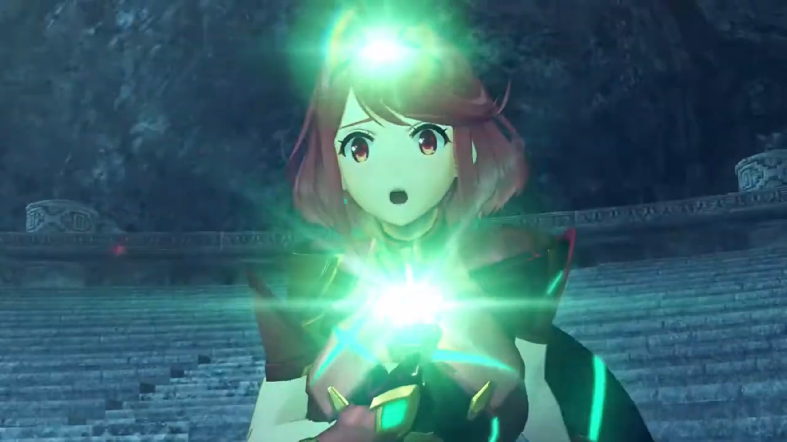

Outer space, a machine orbiting Alrest long asleep was woken up from deep sleep. The power pushed Malos's sword back from Rex's neck. 

"What?"

The power Pyra released altered form, from fire, to light. She went unconscious as the power brought her up. Then she disappeared into motes, before recombining into another form. Golden armor, long smooth golden hair. 

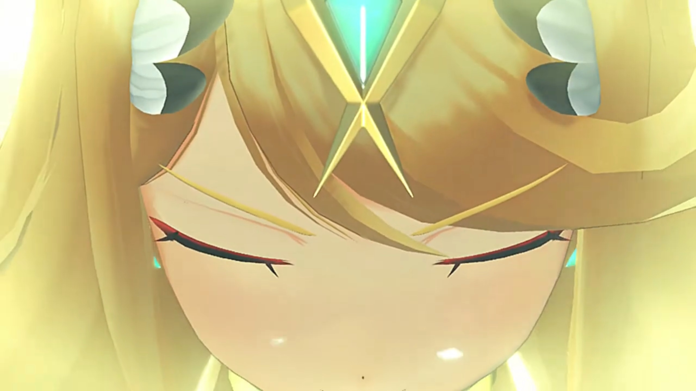

"Pyra?!" Rex watched in awe what transformation. She's not answering him, but awesome he felt. Then, he felt his sword sheathed itself, changed form, then reactivated. "What is this?"

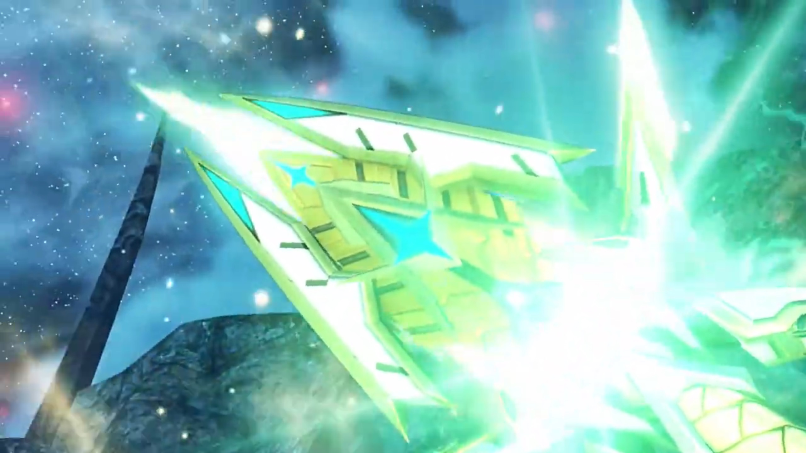

Akhos felt scared, "Y-y-y-**you can't rewrite the act now! It's too late!**" He went for the golden Pyra. The golden Pyra eyed him, and the crystal on her forehead shone brighter. 

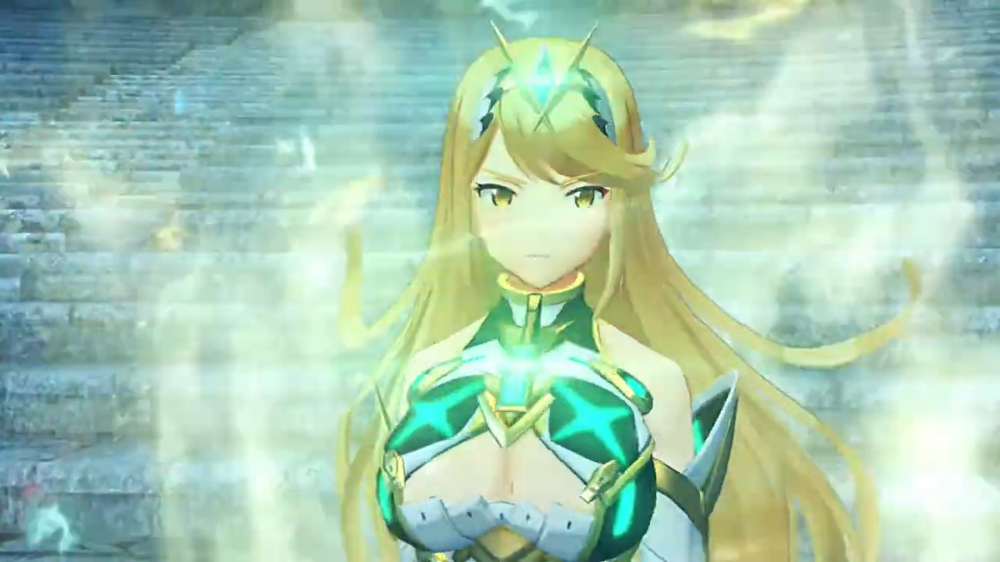

Malos knew full well what power she had, as strong as his, found Akhos lost his logic. "**Hey, idiot, LOOK OUT!!!**" He was looking up at the sky. 

"Huh?!" A beam targeted from outer space shot right at him and Obrona. "Yrrrgghhh..." They managed to dodged it once. 

"**Akhos!!**" But that wasn't the only beam. He quickly got on his feet and tried to game the guy in outer space, in evasion track. Malos ran out of the targeting field, away from Akhos. He did not want to face this yet, even if he could. One final beam of much wider range, they had nowhere left to run. 

"**WAAAAAAAARRRRRRRGGGGGGGHHHHHH!!!!**" The whole of the edge of Olethro Ruins collapsed into a ruins of ruins, under such immense strength. 

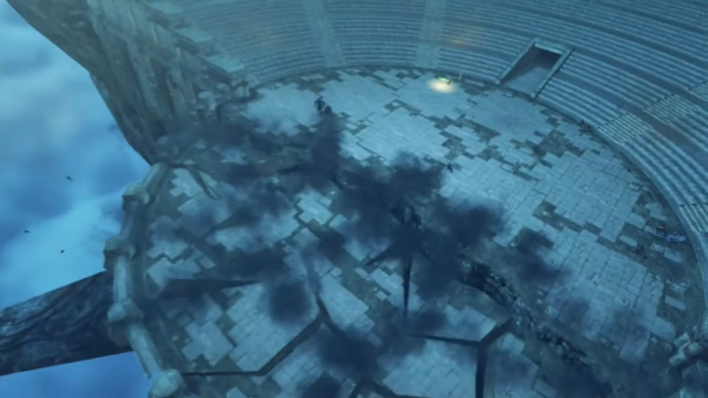

Rex backed to in front of her. 

Malos exclaimed, "You're awoke! **At last! Mythra!**"

He launched himself at them, which Rex blocked. He was confused, "**Mythra?!** Pyra! You're..."

"**I, am not** Pyra." she said, suppressing the anger within. 

"**HUH?**"

While transferring power, she continued, "I am Mythra. Pyra... She's a different self that I constructed."

"A different self?"

"**No time** for that." Malos had been thrusting harder and harder. 

"Oh. OK!"

She strictly said, "Now focus! **You need to focus! Or I can't transfer my power to you!**"

Akhos meanwhile get back from the ground, seemingly more injured by shocked than the beam, "No, **it can't be! My powers are useless?! W-where is that energy COMING from?**" The field of Obrona was still raised, he was so confused. 

What idiot teammate he had. Malos: "**Wake up!** She's not drawing from the ether, it's **something else!**"

"_Not... ether?_" Never even heard about it. 

He had no obligation to explain something that he could also do, "Mythra... Looking good. **Things are heating up.**" Back he went into the fight, Akhos too. 

Mythra: "Let's do it!" She released more power that engulfed the whole ruins. Time had stopped, and Rex could view some shadows of extrapolation of the steps they were about to take. But he don't know, 

"What is this?"

"It's called Foresight."

"I don't..."

"A prediction of what will happen in the immediate future. Read their movements to find an opening, then counter!"

"I get it!"

Time restarted; he had time to think of what to do, and just followed his calculations blindly.{{footnote: When fighting, your consciousness is always slow compared to your unconscious. Say simply, what conscious calculations you did only works before the opponents came for you; your muscle memory are what determines whether you'll win or lose otherwise in counterattacking.}}

Akhos had met too many surprises today, "Grh!! _He... How did he dodge that?_"

Malos: "**Who cares how! Just GET THEM!!!**" 

The light from outer space shone bright once more, and feather strikes from the sky, a field attack. "Graahhh!!"

"Piece- of- cake." Rex dashed towards Akhos first. 

"Ugh! You little..." Suffering one injury under his armpit, he started to feel fear at such uncertainty, started self-doubting "_Th-there's no way! There's no way to break their link. I don't think we're going to beat them._"

"This is it... The- **true- power-** of the Aegis. Takes me back. I've waited **so long** to see it again." exclaimed Malos. "**Mythra! Welcome back!**" Round 2. 

---

Rex and Mythra held the sword's hilt together, pointed their sword at the sky, and shouted, "**Sacred. Arrow!**" More feather strikes from outer space. The two had difficulty defending such immense power. 

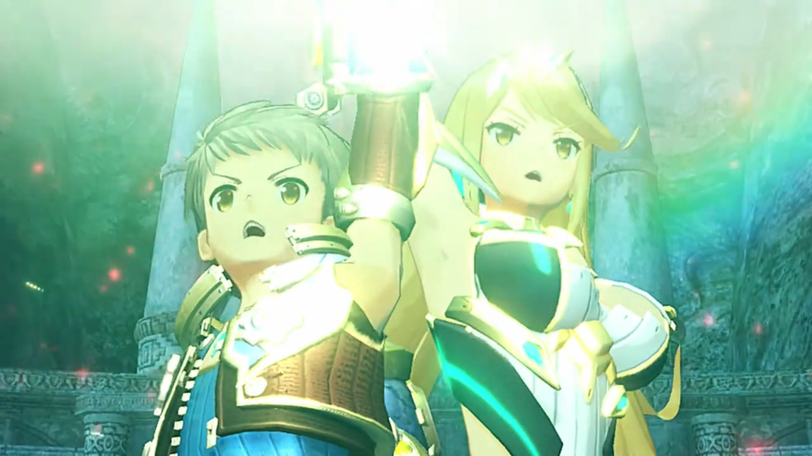

"**GRRRAAAAAAHHHHH!!!**"

"Wha... What is this...? Akhos?"

"**OBRONA!!!**" She had been evaporated under the attack. He felt his connection to her dimmed. Her core crystal dropped to the ground, forced return. Similarly to Malos's Blade. 

Rex was panting. The fighting had went on for far too long. 

"I. don't." He knelt in front of the dimmed Core Crystal. The moments she had teased him, satirized him, mocked him, ran through his head; he had got used to her around him. But now, her memory erased. Even if she came back, it wouldn't be her anymore, an entirely new entity. He had lost a dear friend, a dear partner. 

"Hmph. We gotta retreat! **Akhos!**" He had shut his ears to all sound outside; all that occupied his attention was his moments with Obrona. 

"Obrona!" Come back! Wake up! That's not your Core Crystal, right? You're playing hide-and-seek with me, right? You're hiding somewhere else, right? Come out right here! 

"**No time for that, Akhos!**" Malos punched hard on the ground, releasing dust and energy and shrouded their view. Rex blocked the dust from entering his eyes with the sword. After the dust faded, nothing left. Including Obrona's Core Crystal. 

The sun rose on the horizon as he put his shield down. Nia, Dromarch, and the others gathered near them. The lost of an enemy to pull their attention away, the feeling of the lost of a mentor awash them. He might had win, but he knew, he had not. 

"_Vandham..._" There his corpse laid on the floor, still the remaining warmth of the blood he shed from the lessons he taught him. But he could no longer bring him back; what's lost is lost. 

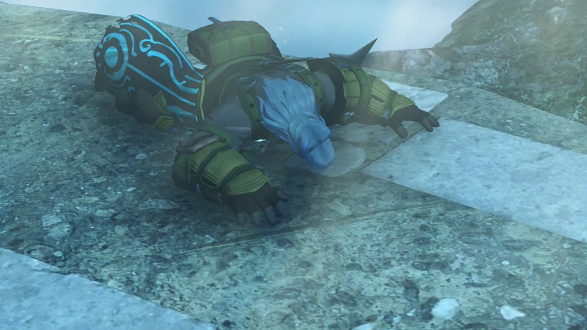

Mythra watched for a while, said nothing, went back to sleep. Pyra took over, and dropped to the floor, too tired. He didn't heard her; all that occupied him was the bits and moments he had with him, the tears he shed for him. 

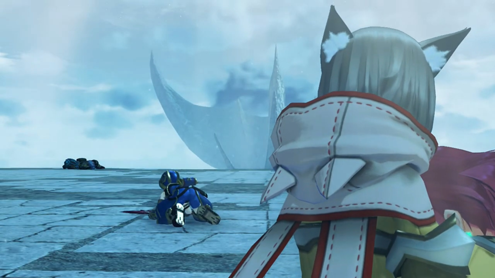

Nia helped him took care of Pyra, hugged her up and kept her warm, and watched Rex collapsed into tears, banging on the floor, nothing he could do, "**Nguh nngh nghn! ARRRRGGGGHHHHH!!**"

The sun may rise for another day,  
but he won't be seeing it anymore. 

### Footnotes: