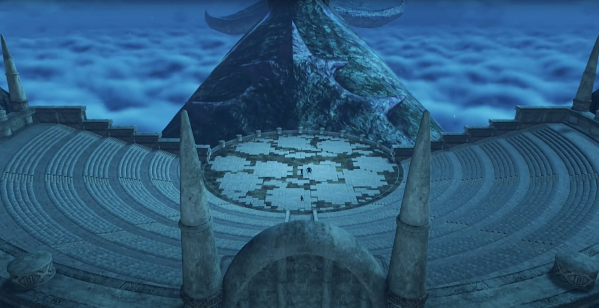

# Vandham's final lesson

Pyra arrived; Malos and Akhos (and their blades) had been waiting. The 'trunk' in front of the imperfect circle was (probably) the head of the Titan. 

Malos heard her footsteps, commented, "So lame. How long are you going to stay in that form?"

"That's none of your concern! **I am**- who I am! Where's Iona?"

"Akhos is the meanest son of a bitch I know." He urged her to look behind. Above the stairs (for people to sit), on one of the rows laid Iona, flat, unconscious. 

To Pyra's left, Akhos and Obrona was above the stairs, leaving space for them to interact themselves. Obrona loved to tease her Driver, "**AHAHAHAHAH!!! Son of a bitch!**"

Akhos: "Hmph. _I still think we should have sent them_... a finger, or something. But you know _best._"

At the center of the stage, Malos continued, "You know what we're after, don't you?"

"Jin... Is he on your side too?"

"I exist for his benefit. That's alllll I'm gonna say."

"_Really..._" She looked down, felt sad that 500 years had not been enough to let him put down the baggage he carried. 

Malos suggested, "Let's end this. Now." He started attacking Pyra; she shielded them, but to no avail. Closer and closer, they get; she withdrew, and he slashed her arm. 

---

"Agh!" On his way, Rex felt a jolt in his arm. 

Gramps worryingly shouted, "**REEEEXXXX!!!**"

"I'm OK. But Pyra's fighting alone! She's close, though! Really close!" The stairs up looked infinite, and the entrance's at the top. After so many flight of stairs, there's still more of them. But he had to get there, before they get their hands on Pyra. 

---

"(pant pant pant)" she felt exhausted. Without her Driver, her strength was limited. 

Akhos exclaimed, "Well well. I see I'm not the **only**, _son of a bitch._"

Malos: "Still defiant, I see. **Just give it up**, girl! **Think you can do it alone? Handle that power?**"

Her iris dilated, shouted her conviction, "**I won't use that power! And I won't let you use it either!**" Intense flames grew from her chest, illuminating the whole ruins. A giant fireball formed atop her. 

Akhos was surprised, "_Hmmm?_ You seem to be doing nicely without your Driver."

Malos don't see how that would change her fate, "Hmph! It's like you don't know who you're dealing with!"

"Huah!" She launched it at him; his blade cut right through. 

"**HRRRRAGGGHHH!!!**" The desolation she felt; the largest attack she could release scathed him none. Had she no hope? This is the end? "You can't beat me like that!"

"**But maybe... I CAN!!!! YRRRAAHHHHH!!!**" Just on time, he launched himself up high, aimed for Malos. 

"**THE KID?!!!**" Rex can't even broke his shield. But he lit a flame within her heart, after all that roller coaster ride. 

"**REX!!!**" He reassured her, and nudged over his shoulder. She turned and saw her friends flooding in, "**Everyone!**"

"**Vandham, take Iona!**" He was already carrying her up there.  

"Gotcha!"

"We'll take care of these guys!"

Malos: "Grrrr.." Just a few more minutes, this could've been easy job. 

Akhos: "Well, it's come to this... Hmph! Needs must! **Obrona!** Do them in!" He jumped high and landed behind Malos. 

"Thought you'd never ask!" The battle begun. 

---

"I must admit, I've enjoyed playing my part in this... hackneyed tale, but..."

"**Teeheheheh! Time for the final act?**" Obrona was eager, summoning more and more of her red particles and raised a field that affected the stage. 

"**Huh?**" Rex was surprised, "**You're bluffing...**" He ran towards Akhos, didn't believe that does anything. 

Pyra disagreed with his conclusion, called out, "**NO! REX!!**"

Akhos caught his sword by hand, surprised him, "**Whattt???!!**" 

Still playful, he decided to explain to him, "You see, Blades draw their power from atmospheric ether energy. They send their power to the crystal, where it manifests... But... **what if** we were to **INTERRUPT THE FLOW?!!!**" And he cut Rex's connection with Pyra. 

Vandham was outside the field, "Shit. **Don't look good!**" He was to join the battle, trying to save them. 

Nia looked at her weapons, exclaimed, "Damn! The power's draining out of my weapons!"

Dromarch: "It's no good! I can't- transfer power, my lady!"

"Masterpon! Poppi feels funny!"

Tora was listening when he felt his furs standing on its end. He turned around and saw Malos coming at them, "**Hah!**" With Nia's duo, they dragged along the ground. 

Rex was desperate, "**Why won't you guys leave Pyra alone?**"

Akhos couldn't understand either, "Isn't it obvious? _We want the power of the Aegis for ourselves!_" Every step Rex backed, he enjoyed the playtime. "It's Jin's desire... to erase all of humankind from the world!"

"What?" Nia was surprised; why had he kept her in the dark? She came at Akhos, wanted to know more. 

"Huh!" Pyra was reminiscing when she sensed Malos, raised a shield. 

While fencing, Nia asked, "Did Jin seriously say that? 'Erase all of humankind?'"

He enjoyed her cluelessness, teased, "My, my. Surely you knew. Better than anyone. You know what humans are really like."

"Huh?"

Akhos took the chance, slashing at her when she was recalling. Did she know that? Since when? 

"**Nia! What're you doing?**" Vandham came to her rescue. 

Akhos stopped attacking physically, but continued his mental attacks, "You've seen the capital. You've seen the _ships, weapons, soldiers_... All poised to invade Mor Ardain... Doesn't it make you want to _laugh_? Every corner of the world is defiled by such vermin."

Malos added on the other side while battling Rex, "But that's nothing new. They haven't changed a bit in 500 years! **No wonder Father abandoned them!**"

Pyra and Rex joined force independently against Malos and his Blade. Some clashes and they separated. Reserves of ether had been low ever since he'd been cut off from Pyra. But they could not give up now. 

Pyra denounced his claim, "No. The only thing that hasn't changed, _is you._ **Father didn't want us to wipe out innocent life!**"

"Why did he make us then? **Get real!**" She can't rebut. She doesn't know enough of Father's will to rebut. "That's what we're for. **To descend on the world and eliminate these pests!**" 

The immense power he released from within, the abominable dark purple energy engulfed the lights from the surrounding; they burned high like smoke signals, disturbing ether in the vicinity, "**HRRRAGGGHHH!!!**"

"What?!" Vandham was surprised. "Is that the power- coming from his Blade?"

Nia: "It's too..."

Malos announced, "Playtime's over. Let's end it! **Akhos!**"

"**A-greed!**"

He knocked Rex and Pyra back; they banged against the stony chairs, releasing smoke. Poppi flew within the shrouding smoke and brought Tora straight for Malos. He blocked the drill, and sent them to accompany Rex's duo. 

"**Poppi!**" Electricity were leaking from her joints. 

"**Teheheheheh!**" Obrona got excited even more. 

"How very noble! **Next!**" Akhos checked them off his list, dashed for Nia. Dromarch used his meat as shield for her. 

"**Dromarch! Bastards!**"

"**Over here!**" Obrona appeared behind her, slapped her face as she turned around and look, and she hit the ground. 

"Ungh!!!"

Rex felt desolate, "**Nia! Tora! Dammmmmn!**" The enemy could use their full strength, but not they. 

"**Stop, Rex! It's no good!**" He ignored Gramps's warning, brain-deafly rejoined the battle. 

"**ARRRRGGGHHHH!!!**" He was no fight for Malos. 

"**Rex!**" She is their target, not him. He teleported beside her, and she felt a jolt in her belly; the pain brought her to the ground. "Urgh! Hurrrghhh!!"

"Huh! Hitting girls isn't as much fun..."

Akhos labeled, "Malos, you're the **icon** of chivalry."

Pyra muttered, "_M-Malos..._" She had no more strength. 

"**You're not GETTING HER!!!**" The only one standing, Vandham, had got out of the range of field, standing at the chairs, and used Roc's power to launch flying feathers at them. 

Malos was surprised, "**HUH! An attack from the OUTSIDE!**"

Rex: "**Vandham!!**" Why had he not thought of that before? But it wouldn't have succeeded; if they ran, Obrona would move the field with her, to re-curtain them. 

Akhos recalled the various surprises he suffered back at the village, "**Ah!** The lunk is back. But, _that peashooter won't help you._ Even if you hit, _it'll barely register._"

"**Bloody idiot! Think I don't know that?**" He reentered the field at will, shouted out, "**ARE YOU READY, REX?! Another, LESSON, for ya! Something else you can do with a Blade!**" Rex watched in awe as he lunged the end of the scythe into his stomach. 

"**HUH!!!**"

"**HURRRGGHHHHH!!!**"

Malos: "**What...? BASTARD!!!**"

Akhos noted with great surprise, "He's channeling the energy from his weapon **through his body...**"

The pain had not dimmed, his blood dyed his weapon. Slowly but surely, he's getting to them, "_Yeah! Nothin'- you can do- to stop this ether flow._ Nothin' at all! **HRRRRAAAAGGGHHHH!!!**" The pain subsided, he can now use ether stored within his body. 

"**Gah!**" Even Roc entered the scene, 2 vs 4. 

What ends were to come to them? Nia watched him overnumbered. She got on her feet, felt the urge to rejoin the battle. But she felt so weak. Is there nothing she could do to help? She held on to her chest, perhaps, she asked herself, if she release the shackles to this power now, she could change their fate. But she could not make up her choice. Do she want to do that now? What would Rex and the others think of her, if they knew? Will she be abandoned? And, she had not find the one to entrust her life to. She... cannot...

Rex: "**Vandham!!**"

Vandham urged, "**Move it! Take Pyra, and SCRAM, KID!**"

"**I can't... I can't just leave you here!**" Leaving his mentor fighting alone? He'd rather die with him. 

"**HRRRAGGGHHH!!!**" He continued fencing Malos, advising, "Rex! Don't go **dyin' on me here! YOU GOTTA MAKE IT!!!** You gotta get away from here, **NOW! LIVE! LIVE FOR HER!!! YOU GOTTA MAKE IT TO ELYSIUM!!!**" 

His trembling hand reached for his sword, but Vandham's words reverberate in his heart. Yes, that's his desire, their goal. But he... no, one can't leave him alone, letting them eating him alive. "_Huh!_" He want both to save Vandham, and to bring them back to safety. 

Reality denied his fantasy, Malos: "**I won't allow it!**"

"**Grahhhh!!!**" Vandham's vision blurred, blood gurgles in his mouth. No longer could he sustain, for the battery within him had drained. 

"**GIVE IT UP!!!**"

He tried raising his hand once more, squeezing more ether from his flesh and blood. The concentration was too low, Malos easily broke his spell. 

Seeing nothing he could do, he shouted, "**JUST GO, REX!!! REMEMBER, TO FIGHT. YOUR. WARRRR!!!**" Rex watched the old man, drained of ether, standing there like a wall. Someone he'd only met for a few days, protected their dreams with his life. He could have leave; they weren't going after her. But he chose to stay. And that's enough. 

Malos slashed through his neck, the twin scythe evaporated; his head twisted to the side, his body slammed to the ground. 

"**VANDHAAAAAAAAAM!!!**" Tears rolled down the tip of his eyes; the greed to have both, he ended up having nothing at all. But nothing hurt more than seeing a dear one dying before your eyes. The laughters that rung in his ears whenever they teased his scariness, the warmth he emanated with the hospitality he provided, the counseling he got whenever he's in doubt, and the lessons he taught to turn him into a real driver. 

Malos's Blade grabbed Roc's neck at the other side; he evaporated and turned into a core crystal, dropped to the ground, dimmed. 

Akhos had gone through so many cycles of lost from his opponents for the past how many years he's alive that he was numb to it already.  "Ohhh, please. What a cliché." Now that all obstacles were gone, he could finally complete their job, yes? 

"**GRRRAAAAAAAAAHHHHHHHHH!!!**" In drunken state, Rex climbed to his feet, dashed at full strength for the guy whom killed his dear one; all around him, he closed his senses to. 

Pyra tried hard to stand up, "_R-Rex_..."

"**ARRRRGGGGHHHHH!!! YOU'RE GONNA PAY FOR THIS!!! FOR VANDHAM!!!**"

"_N-no... We have to go..._"

Malos was tired of his insistence, "You're a pain in the ass. Little **shit**!"

"**Yarrrgghhh!!**" And he flew backwards. "Ugh... I can't... do it..." was his answer for Pyra. Emotions hijacked his logic; he could not leave his corpses drying under the sun, to be eaten by birds that flew by. And if he run, how are he to face the people of Garfont? As his student, how could he leave his teacher alone? 

Nia: "_R-Rex..._" Is he the one worthy of her to release her power now? Vandham had died before her eyes; she don't felt as strongly as Rex, but if Rex died, she can't forgive herself. 

"_Rex-Rex..._"

"**CAN'T LET YOU DO THIS!!!**"

"**SO LONG, KID!!!**" Malos got in front of him and slashed down. 

"**REEEEEXXXXXXXXX!!!**" The shackles released, the power she longed not to use, shall once more be awaken, whatever the consequences that lies ahead. Bright green light swallowed her crystal and her forehead, and she woke up from her 500 years of deep sleep. 

In the outer space, the satellite that trek the Aegis wherever she went, start up after eons of hibernation. The power pushed Malos back, and their attention turned to her, 

"What?"

Light ether emanates from Pyra; her unconscious self floated into the air, dissipated into motes, recombined, transformed from a theme of red, to a theme of golden. Golden armor, long smooth golden hair, a baby-looking face. 

"Pyra?!" Rex can't believe what'd just happened. She's not answering him. The changing vibration on his sword attracted his attention, as it sheathed and transformed, reactivated, "What is this?"

Akhos realized what happened, the tone of fear in his voice, but he announced, "Y-y-y-**you can't rewrite the act now! It's too late!**" He went after her. She turned her attention, the crystals on her forehead and crystal grew bright. 

Malos shouted out, knew what moves she had, "**Hey, idiot, LOOK OUT!!!**" He was looking up at the sky. 

"Huh?!" He stopped on his track, only to realize a lightning beam strike straight in front of him. "Yrrrgghhh..." Lucky once. 

"**Akhos!!**" That wasn't the only beam. More and more beams came as he went into evasion track, zigging and zagging, hoping his chance would play by his side. Malos wasn't thinking of saving him, exited the barraging fields and let him dealing with it alone. With her eyes, she tracked Akhos's location, giving instruction to the machine in outer space where to hit. One bright beam of larger hitting radius shone above his head; he had nowhere to run. 

"**WAAAAAAAARRRRRRRGGGGGGGHHHHHH!!!!**" He jumped just in time to be scathed by the edge of the beam; Olethro Ruins isn't as lucky, collapsing under such immense strength, sinking to the sea beneath. 

Rex backed up to protect her. 

Malos exclaimed, "You're awoke! **At last! _Mythra!_**"

He launched himself at them, which Rex blocked. He was confused, "**Mythra?!** Pyra! You're..."

"**I- am not-** Pyra." she said, with suppressing annoyance. 

"**HUH?**"

While transferring power, she continued, "I am Mythra. Pyra... She's a different self- that I constructed."

"A different self?"

"**No time** for that." Malos had been thrusting harder and harder. 

"Oh. OK!"

She strictly instructed with her limited patience, "Now focus! **You need to focus! Or I can't transfer my power to you!**"

Akhos get back on his feet, the mental injury dealt to him more than the physical scratches. "**No, it can't be!** My powers are useless?! W-where is that energy **COMING from?**" Obrona's field had not been lowered, despite all the attacks they suffered. 

What idiot teammate he had. Malos: "**Wake up!** She's not drawing from the ether, it's something **else!**"

"_Not... ether?_" Never even heard about it. 

He had no obligation to explain something that he could also do, "Mythra... Looking good. **Things- are- heating up.**" Back he went into the fight, Akhos joining in. 

Mythra: "Let's do it!" She released her own field that engulfed the whole ruin, temporarily stopping time. Shadows of Akhos and Malos formed as they dashed towards him; he didn't understood what that means, 

"What is this?"

"It's called Foresight."

"I don't..."

"A prediction of what will happen in the immediate future. Read their movements, to find an opening, then counter!"

"I get it!"

Time restarted; he had time to think of what to do, and just followed his calculations blindly.{{footnote: When fighting, your consciousness is always slow compared to your unconscious. Say simply, what conscious calculations you did only works before the opponents came for you; your muscle memory are what determines whether you'll win or lose otherwise in counterattacking.}}

Akhos had met too many surprises today, "Grh!! _He... How did he dodge that?_"

Malos: "**Who cares how! Just GET THEM!!!**" 

Feather strikes from outer space had prevented them from attacking continuously. "Graahhh!!"

"Piece- of- cake." Rex announced, as he picked his enemy, Akhos. 

"Ugh! You little..." Suffering one injury under his armpit, he started to feel fear at such uncertainty, everything now's outside his control, started self-doubting "_Huh... Th-there's no way! There's no way to break their link. I don't think we're going to beat them._"

"This is it... The- **true- power-** of the Aegis. Takes me back. I've waited **so long** to see it again." exclaimed Malos. "**Mythra! Welcome back!**" Round 2. 

---

Rex and Mythra held the sword's hilt together, pointed their sword at the sky, and shouted, "**Sacred. Arrow!**" More feather strikes from outer space. The two had difficulty defending such immense power. 

"**GRRRAAAAAAHHHHH!!!**"

"Wha... What is this...? Akhos?" Motes had turned Malos's Blade back to Core Crystal, and Obrona followed thereafter, unable to understand why showering in such light caused her to disappear. 

"**OBRONA!!!**" He watched with shaky body, unable to do anything to safe her. The wit and geniuses he'd done to others, the cliché he'd seen from others, he swallowed the pill himself, let his emotions hijacked his logic, and dropped to the ground. 

She had been evaporated under the attack. He felt his connection to her dimmed. Her core crystal dropped to the ground, forced return. Similarly to Malos's Blade. 

Rex was panting. The fighting had went on for far too long. 

"I. don't." He knelt before the dimmed Core Crystal. The moment they spent together, despite she always teasing him, satirizing him, mocking him, the voice of her always there supported him. Taking it for granted for too long, he had never dreamt that one day, his partner, the invincible (always rejuvenating) Blade would die before his eyes, before he's dead. Even if he resummoned her, when the crystal rejuvenate, it would no longer be the dear friend they'd spent their time together for long. No, even if the physical flesh are the same, what defines you is your memories, and the actions you took based on your past memories{{footnote: 'Experiences'}}. She will no longer be the same as before. 

"Hmph. We gotta retreat! **Akhos!**" But he'd shut his ears to all outer attention. All in his mind, in his vision, the crystal being the only thing worthy of his attention. 

"Obrona!" Come back! Wake up! That's not your Core Crystal, right? You're playing hide-and-seek with me, right? You're hiding somewhere else, right? Come out right here! Come back to me. 

"**No time for that, Akhos!**" Malos punched hard on the ground, releasing dust and energy that shrouded their view. Rex blocked the dust from entering his eyes with the sword. After the dust faded, nothing left. Including Obrona's Core Crystal. 

The sun rose on the horizon; he put his guard down. His friend had got up their feet, but now without something else to distract him, the death of his teacher awash him. Nia watched as he slowly by slowly walked towards the ledge where Vandham's body lies, 

"_Vandham..._" They thought they won, but he felt not. He might had saved Pyra from being taken, but he had not saved his mentor from dying. The sword on his hand sheathed, he looked at his corpse, called out, hopefully he'll wake up once more, telling him, he's just too tired, and he need rest. But no, the warmth still within his blood cooling down; he laid there, lifeless. No power could brought him back to life. 

Mythra watched, said nothing, and went back to sleep, letting Pyra taking over. She was too tired, dropped to the ground; her driver had been too preoccupied with his mentor's death, didn't hear her. But he had his friends; Nia picked her up, let her rest in her chest. 

Tears aggregated at the tip of his eyes; he could no longer hold. 

Rex collapsed into tears, banging on the floor, felt so useless, so weak, for the nth time in his life, and the first he lost someone dear, "**Nguh nngh nghn! ARRRRGGGGHHHHH!!**"

The sun may rise for another day,  
but he won't be seeing it anymore. 

### Footnotes: