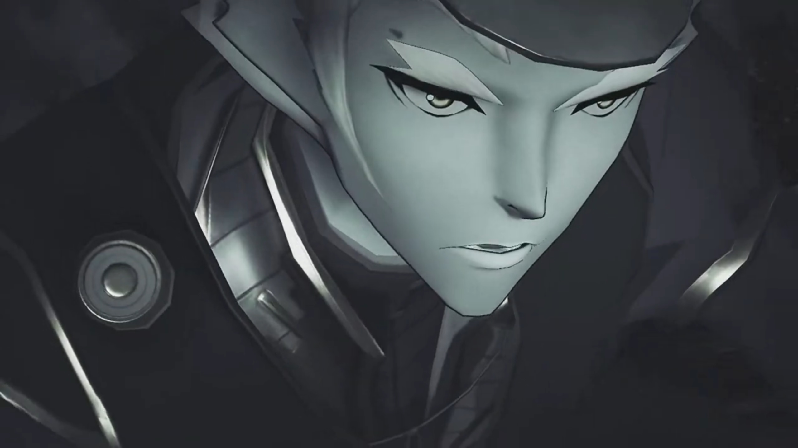
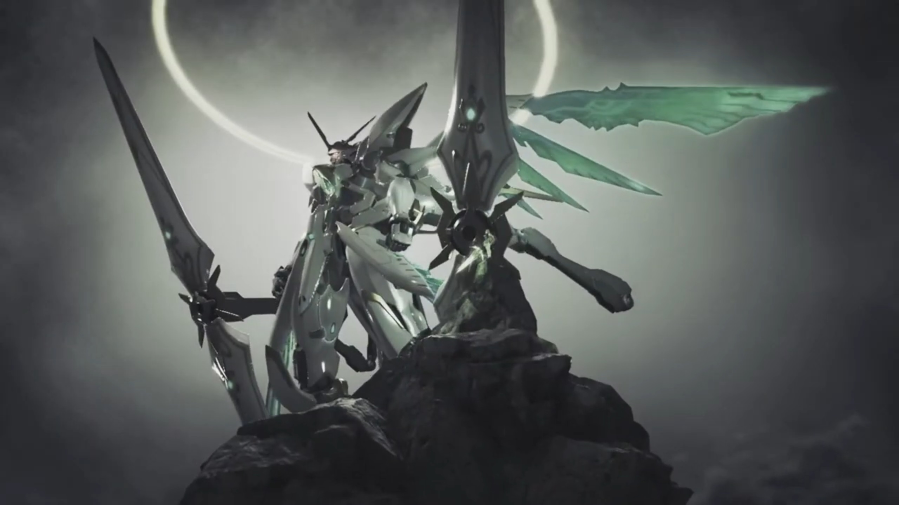
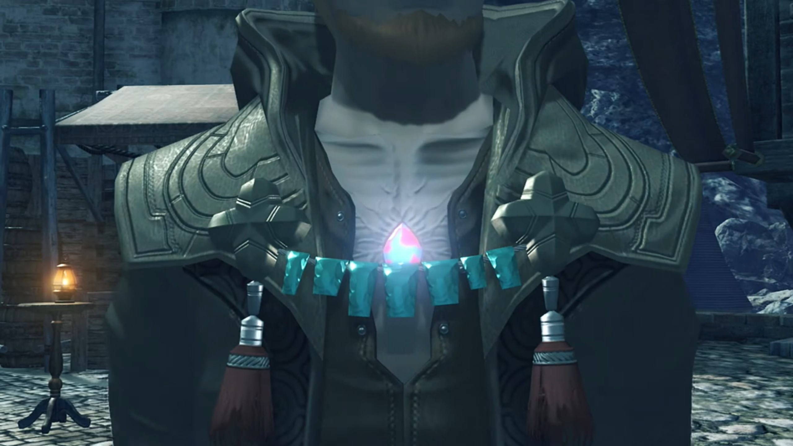
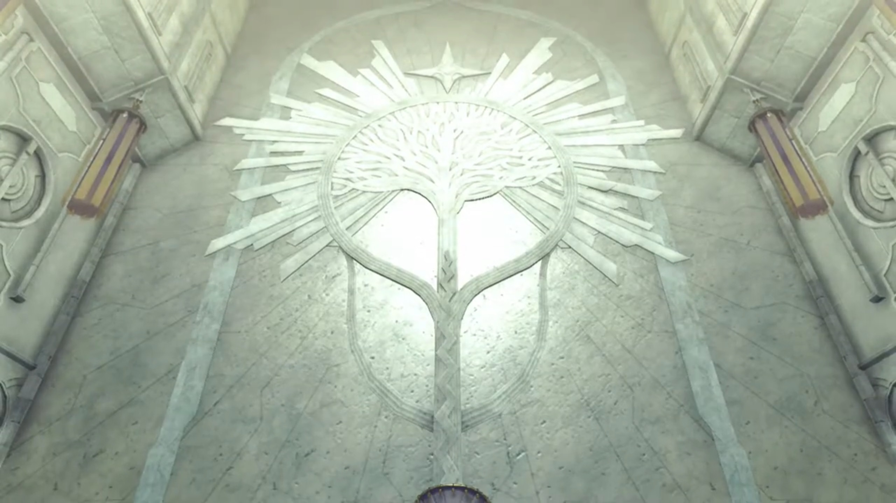

# Brief History of Alrest, Minoth

A long time ago, there was a peaceful City behind the back of a Titan. The people there were living in peace, doing their business; until one day, without prior signals, purple beams stroke from the sky, hitting every inch, destroying buildings and people, before they had time to realize what had just happened. The yellow beams came after the purple, destroying whatever remnants leftover in the ruins. 

The remaining citizens not already in the City gathered atop a mountain some kilometers away from the City. They watched their home getting destroyed, nothing could they do to save it. They looked up at the machine in the air, with a bright green plus-shaped crystal in its chest; seated Mythra within. 

---

The sun already rose up high. Some more people from the City joined the group; they'd buried Vandham there and raised a tombstone above. Dromarch versed for the fallen, taking the alpha position{{footnote: The front-most position directly facing the tombstone}}, "The body- may die, but... never the soul, which is merely- passed on. Souls- flow- onward, born- and reborn, forever- part of the great- ether stream."

Tora cannot understand, "Why friends make- grave here? Can we not take Biggipon home, to village?"

Gramps replied, "He'd- want to be- buried where he fell. It is- traditional- amongst- mercenaries." Dromarch bowed and opened up the Alpha position for Iona, whom carried with her flowers, knelt before him, and delivered the flowers, "_Hnph. I'm so sorry, Vandham. If only I hadn't listened to those people, you'd still be... I'm sorry... I'm so sorry..._" 

Nia listened, her head down feeling the more guilty, clenched her fist. Dromarch understood her Lady's will, respected her choice. She thought for herself, if only she'd released her true power, perhaps...

Rex, standing at the beta position{{footnote: 8 o'clock of the alpha's position}} for long, went forward and wrapped his arm around Iona, consoled, "It's not your fault. _No matter what, those guys would have tracked us down eventually._ What matters... is that Vandham saved all our lives. For now, let's just be grateful to him... for that."

"**Ngh! Mm...** _You're right..._"

"I won't forget your words, Vandham. Ever. I'll fight my own war. With Pyra." He swear. That's his wish, and he'll live for it. Gramps's ears wiggled a little, turned around and saw "Pyra?" accompanied by Poppi. His turning had alerted Rex. 

She moved past everyone, didn't answer him. Iona had returned to the hugs of her guardians{{footnote: Some unknown people from the City or village}}, crying. Rex backed away, giving space for her. She embraced her heart, bowed, and leave the other direction, reluctantly{{footnote: She walked one step, looked back at the grave, paused for a moment, before continued her way.}}. 

"Are you all right?"

Quietly, not wanting to look at him in the eyes, she answered, "_Yes._" 

At times, we really felt jealous at the courage of kids. He took it at face value, urged, "_Good. I was worried that you might not..._ wake up... Pyra, you know I've got to ask. That **thing** that happened yesterday..." is what she don't want to face, and why she wanted to evade him now. "You called yourself, 'Mythra'?"

The others were waiting for an answer from her. She stuttered, trying to find excuses, "W-w-what? I uh I, um..."

Nia urged, "I'd like to hear that too. That power, _it wasn't normal._ Is that the true power of the Aegis? **I think** you owe us an explanation. _It was pretty crazy._"

"Tora want to know too. Pyra was suuuuper strong! Why so strong? Huh?" Poppi copied how her Masterpon acted. 

Gramps stood on her side, "Now, now, don't pressure the girl..."

Pyra: "_Well, um... The thing is... I-I-I mean..._"

Mythra cannot stand the lack of courage she had, the bright light shone in her chest as she took over, transformed right in front of them. "**AHHHH!!!**" The group watched in awe, as if something scary was happening. 

Rex: "P...Pyra...?" 

Clenching her fist, with suppressed annoyance, she walked past Nia towards her Driver, strictly asking, "Why?"

"Huh?"

"**Why did you wake me up?!**"

"Huh? What?"

"**I didn't want to wake up... I didn't want to come back! I left EVERY-thing to her so I'd never have to use that POWER again! But then YOU woke me up!**"

"W-w-woke you up?"

"**If YOU- hadn't been SO USELESS, NONE of this would have happened! I wouldn't have had to USE THIS POWER! DIDN'T YOU listen to that Vandham guy? He told you to hold back! He TOLD YOU, to run!** But you just had to push yourself. Idiot. **Look where it's got us now!**"

"**You-**"

"**You really messed up.**"

"You don't have to tell me that! I know, all right? I knew I was being an idiot."

"Rex..." She knew her words had been too rough, but she don't know how to express it any other way. 

"But I just... I couldn't hand you over to them. I wanted to keep you safe."

Struck in her heart, such cheesy words. "Wh-wh-wha...?!" Speechless as to what to say, she decided to avoid it, "A-at any rate! If you've got questions, you can ask her! I'm out of here! Bye!" Such tsundere{{footnote: ['tsundere'](https://dictionary.cambridge.org/dictionary/english/tsundere) definition based on the Cambridge dictionary, means "a character who seems unpleasant or unkind at first, but who develops into a more pleasant or kind character."}} personality she had. 

Pyra, speaking to herself, "Ah... _That's not fair..._" Turning around, "Everyone, I'm very sorry... _about all that._" And she bowed to them. 

---

That night, inside the theater, Pyra shared, "Malos and I, are Aegises. Blades born with a- terrible power, strong enough to destroy the world..."

Rex cannot believed what he'd heard, "Malos is... another Aegis?!"

She nodded. "Long ago, There was a man who climbed the World Tree, hoping to make it to Elysium, and meet his Creator." The young man had pointed ears. The guy arrived at the top, taking a fire stick in his hand, and discovered the buildings up there. 

Pyra continued, "But... when he arrived at Elysium, he found it empty." He opened the giant door before him, the smiles on his face hopefully hoped for something. 

"So instead, as proof that he had reached that divine realm... He brought back two Core Crystals, Malos, and me." All the way he climbed up, all the way he climbed down. 

"And... once he made it back, to Alrest... He awakened Malos." The two same-shaped different color crystals floated in front of him, he could only choose one to resonate with. "Why he did it, I can't say. For greed... for power... or perhaps..."

"When Malos awakened, he wielded his world-shaking power... **without**- restraint." Amidst flames, Malos rose. Cities after cities, towns after towns, villages after villages, every inch, Malos released his power and swallowed every surface of the Titan's skin. 

"To him, it was natural. He had never known anything else." The purple flames added up, burning down the whole Titan alive. 

"**I** was awakened by a Driver... who was determined to stop... Malos's rampage." People gathered in Olethro Square, Mythra wielding her sword and put it on the left and right head of a gray-cloaked guy knelt before her. "So Malos and I, fought." 

"I fought with all my might, and **succeeded** in **defeating** Malos." The shockwaves of their battle destroyed everything in their pathways. Even the machine, her born-companion{{footnote: 伴生. There's no English word that one know that describe this accurately.}}, had came down from outer space to help. 

"_But not without a price._ **THREE great Titans fell** in the struggle. After the battle... I **SEALED myself** away to ensure **that** power would **never** be unleashed again. _I took the form you see now_, and fell- into a loooong slumber." The casket she slept in, closed the lid above her, and hibernated for the next 500 years. "That was five hundred years ago..."

Gramps, one of the participant during that time, continued the story, "The Aegis War. The **man**- who awakened Mythra was Addam, hero of the lost Kingdom of Torna. Addam fought as Mythra's Driver... to protect- the world- from Malos. We- Titans- played our part in that battle, too. It is **our calling**... to live alongside humanity, after all."

"Gramps?" Rex never heard this part of his story. 

"Addam- hid Pyra's sleeping body- inside a great ship, and sunk her to the _Cloud Sea's floor, where none- could abuse her power._"

"So that day, that's the ship that we... _That's how Pyra and I..._"

"I believe... it was **fate**, that we met each other. Otherwise, my **sister** would never have woken up."

"You call her, **your sister?**"

"Mythra and I... used to talk together, in that dream of Elysium- where you met me. We promised that, when we were awakened again, we'd go home to the **real** Elysium. And then, we would fulfill our- **real** purpose..."

"And that's... defeating Malos again?" She nodded in return. 

---

Pyra found the chance to talk to Rex back in the dormitory alone, looking out the windows, deep in thoughts. She immediately apologized, "I'm very sorry... about Mythra. **She** didn't mean all that. **You** have to understand, she came out **because** she wanted to protect you. **She** broke her own seal _for you_, even used her power as the Aegis... The flame powers I use _are just a_... **shadow**- of her strength. Droplets of excess energy... trickling through the seal."

"Don't worry about it. She was right. This was all my fault. I'm just glad..."

"Hm?"

"**That you've finally managed to open up a little!** Also, thank you! **For protecting** everyone, I mean."

"_Protecting? Me?_" She doubted. 

"Your powers... are **incredible**. I could **feel the truth behind the legends**!"

"_I'm sorry... I..._"

"**You apologize *a lot*, you know that?** I guess... you still **feel** guilty... about the Aegis's power, right? But I... don't want you to have to apologize any more. I hope I can help you _move past that..._" Then he shook his head, "**No, I KNOW I can!**"

"_Rex, I..._"

"Power depends- on the heart of its wielder. That's what Vandham said. That's why **your** power... **is the power to protect. The power to keep everyone... safe and smiling.** I want to do the same. I'm gonna be the kind of Driver who can protect you in turn, I promise! **Make a girl cry?** That's not gonna fly. **Make a girl smile? You pass the trial!** That's the third rule of the **Salvager Code! Yeah?**"

Perhaps she felt glad they'd spoken so much after. Before she could reply, Tora was shouting outside, "**Rex-Rex! Can you help Tora with repairing of Poppi, please?**"

"**OK! I'll be right there!**" And to Pyra, "**Oh, yeah - what's for dinner tonight?**"

"**How does Meatball Pot-au-Feu sound?**"

"**Delicious! Mm, I can't wait!**" And he dashed off to save Poppi, leaving the space for her. She felt it in her heart, glad that he didn't scold her or blame her or anything. 

Gramps was sitting on the bed, not following Rex, said to her, "That's my Rex. Never loses his smile, _and that's what keeps us all going_. **Remind you of Addam**, don't you think?" 

She could no longer hold herself together, collapsed on the bed, and wept silently. 

---

Outside the theater, Cole handed Rex the assassin dagger he'd been looking at when Malos arrived. Rex wondered, "What's this?"

"Take it, and go to Indol. That dagger's owner- will... tell you how you can get to Elysium." he instructed. 

"This is... a Blade weapon, right? Who's its owner?"

"The man who was **once** my Driver."

"Your... Driver? _Huh?_ But then..." He revealed his chest to show some creased veins growing around the crystal on his chest. 

Gramps explained, "Cole is a Blade. We fought together in the Aegis War. _Yes..._ His **real name**- is Minoth."

Tora noticed, "Blades not get old though. Why Cole look so old?"

"Because I'm one of the **cursed** ones. A Flesh Eater." Nia knew that phrase, felt shocked she'd heard it elsewhere. 

But not Rex. "A... Flesh Eater?"

"**A Blade**... who has been **fused**, with human cells. A looong time ago, be-fore the war, some sought to test the limits of Blades' potential. I-I am a product of their experiments. One of the **unlucky** ones who was **tainted** by their **folly**."

"Why would... ancient people do that?" asked Tora. 

"It seems that by combining Blade and human, it is sometimes possible to create Blades... with extremely unique powers. But- only very rarely. Most experiments were failures, _and I was no different. Ahhhh..._ I gained **nothing** at all, and lost my immortality to boot. I likely won't last much longer."

"_Grandpa..._" Iona would miss him dearly. 

"Before I go, I want to see where **your** path ends. That dagger will aid you. Will you- do this for me?"

Now the dagger felt like a heavy burden pressing on his palms. Minoth had passed him a wish, and he had to decide, should he take the responsibility? "**Of course!** Oh, but can I ask you to do something too?"

"Namely?"

"I was wondering... if you could write a play, about Vandham."

"About- Vandham?"

"**Yeah.** I think... his story could inspire a lot of people. Once I find Elysium, I'll come see you again. Show it to me then?"

"An interesting notion... **Perhaps** that is the least I can do. Very well. I'll do it. So see you make it back here in one piece, **understand**?"

"Absolutely. You have my word."

---

Indol. Inside the Praetorium. A man stood before the enshrinement, piously praying. May God shine its light on Indol. 

---

The group gathered in Garfont to discuss their next destination. Rex had checked the maps and suggested a route, "I reckon the quickest route is... Back to Argentum, ship to Mor Ardain, then on to the Praetorium."

Gramps added, "If we're lucky, there'll be a Guild- ship- at the port."

"Can't say no to a free ride. Let's go and see!"

"It doesn't cost anything?" Pyra wondered. 

"Salvagers can board Guild ships for free. I'll **negotiate for you guys**, too."

Tora: "That would be biiiiig help!"

### Footnotes: