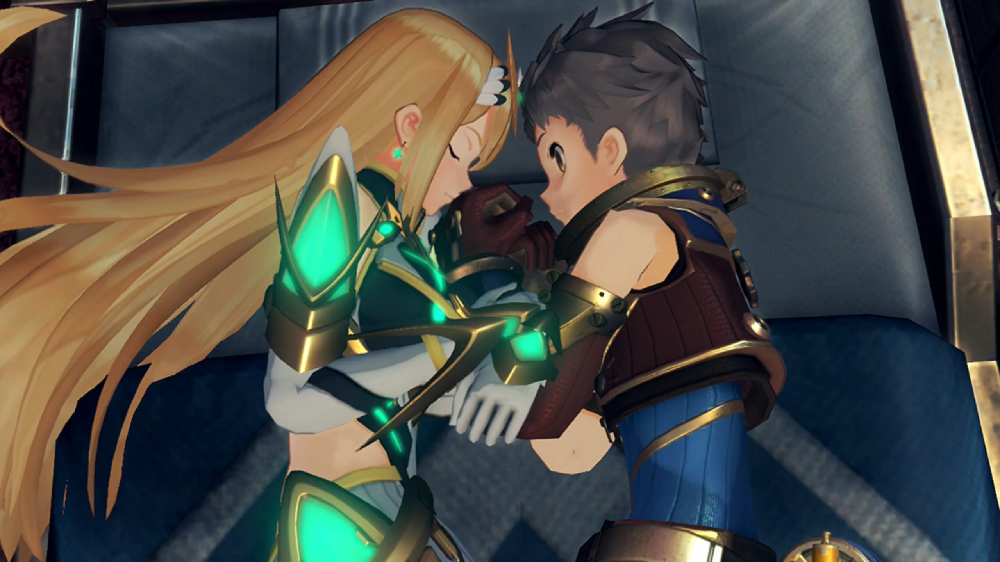
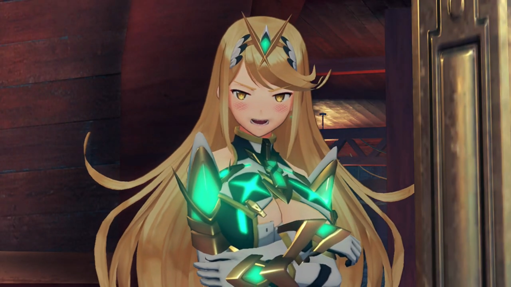
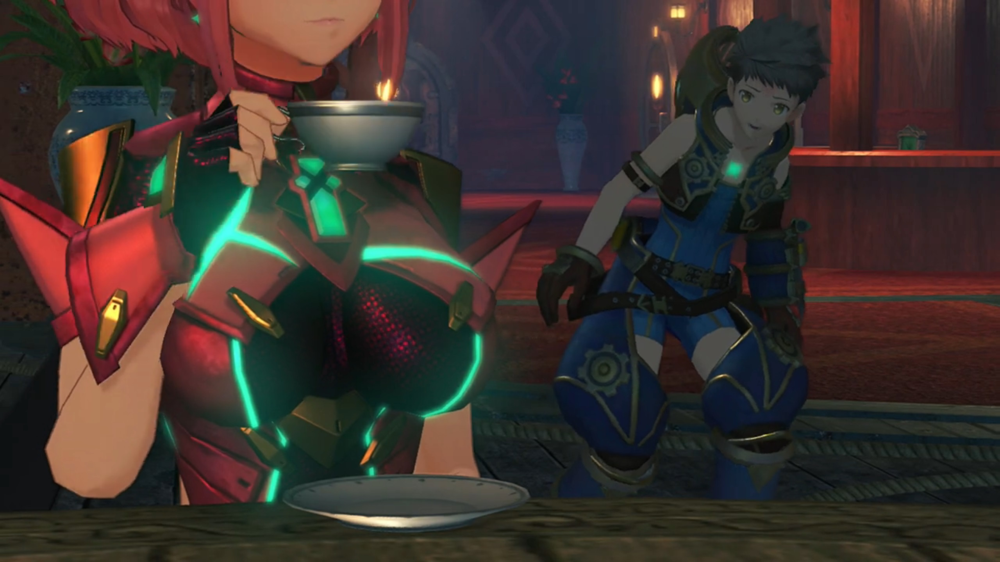
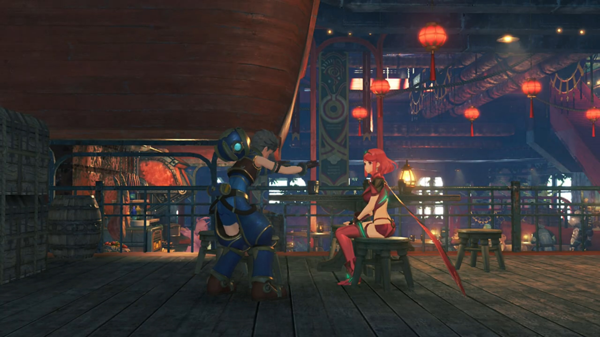
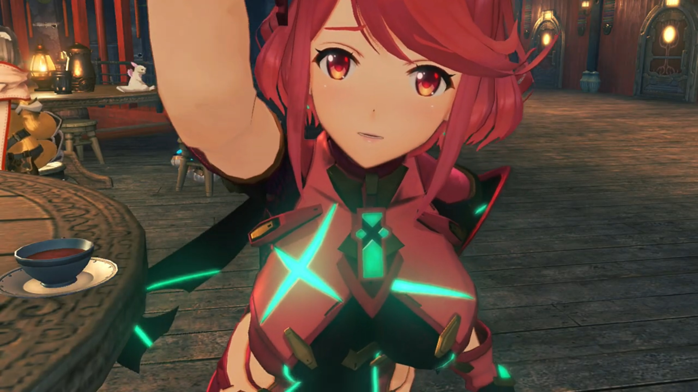
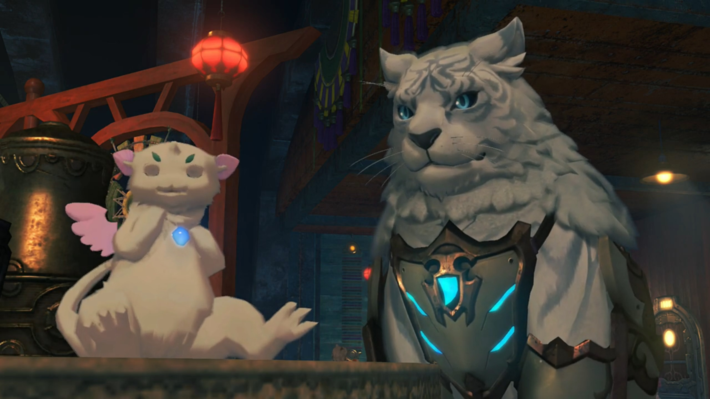
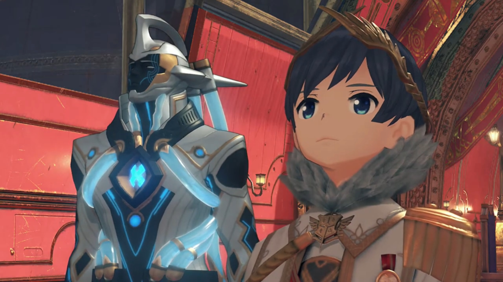
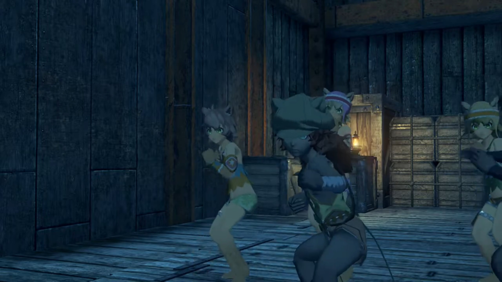
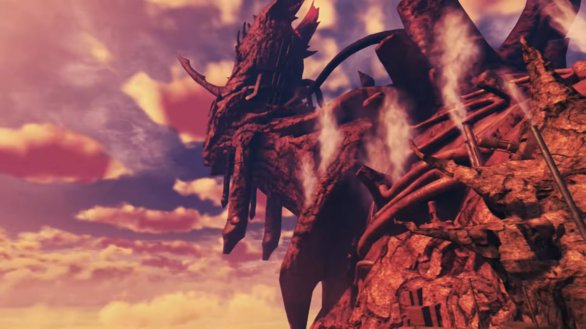

# Off to Mor Ardain, Roc's Core Crystal Stolen

At Argentum, a Nopon that knew him greeted, "**Heeeyyyy!!! It's Rex!**"

"Rex come back alive?"

"Rex have **many** sidekicks now!" says the few other Nopons with the first Nopon. 

Nia teased, "_Quite the little celebrity, aren't we?_"

"Welllll, you know. I've been trading here for a while. Anyway... I'll find us a ride to the Empire. You guys go on ahead to the inn."

"Sounds good. See you around, then!"

---

They gathered on the 2nd floor of the Argentum Trade Guild, where the inn and the restaurant were opened{{footnote: One cannot remember exactly if this is true, but correct me if one's wrong, leaving a comment at GitHub discussion. You can go directly to the page by clicking the GitHub icon on top right of the header, beside the 'print' symbol.}}. Seated around the tables in the restaurant, they listened to Rex announcing their plan. 

"**Right, so it looks like we're heading out tomorrow.** Everyone, make sure you're ready by then!"

Dromarch: "Understood."

Poppi: "**Affirmative!**"

---

Tea time. Seated around several small tables, Pyra, on one of them, had a sip of the tea she ordered, wondrously exclaimed with a thin smile on her face, "The tea here is... lovely!"

Gramps shared the table with her, shared what he knew, "You can find quality goods here- from all around- Alrest. you like the place?"

"Yes. If there's time before we leave, I think I'll have another cup later."

At another table, Nia was stretching herself, "Mmmmmmph, feels so good to rest in a proper inn after a long voyage!"

Rex agreed, "**Yeah!** It's good to be on familiar shores again."

---

In the boys' dormitory, everyone was far asleep; even Gramps, curled inside Rex's helmet. Rex was trying to change position when, "Mmmm... (sniff sniff)... Mmmmm.... Mmmmhmmm?"

Something was off. There's this... nice scent, but one don't remember one'd put on any perfume! Rex tried to force change position, flipping to the other side, but something was pressing on his hand strongly. He tried mildly to pull it out but failed. His brain came back online to gauge the possible scenario; what object could there be? He opened his eyes to look. 

Wait, a girl? This face, Mythra? He breathed in what she breathed out, combined with both their body scent, and blood started rushing up his cheeks. "_Oh!_" She hadn't yet noticed, still sleeping merrily. Oh man, how could one carry her back to her room without her realizing? How could one leave without waking her up? Oh wait, one couldn't leave. He looked down at his hand, hugged tight by Mythra, "_Erm..._"

Deep in her dreams, she felt someone reliable, perhaps Addam, that brought her in his hug. She carefully and blushingly rubbed her breast against him; and of course, she reflected her dream in real life, rubbing it against Rex's arms.{{footnote: Usually when we sleep, our brain will inject a massive amount of paralysis. This ensures what we do in our dreams does not get reflected in reality. However, some people's brain are unable to inject paralysis, hence we labeled their condition 'sleepwalking'.}} Bouncy... bouncy... What now?

Perhaps the soft and natural object she was hugging turned too stiff; her brain felt not right. Triggered, she smelt something unusual too, not just something not moving with her alone. Stiffened, she opened her eyes. 

"**Ah!**" This is not good. Very bad. Eye to eye, they look straight into each other's eyes, stuck there for a prolonged moment as she was returning to life, gauging the situation. Some short moments before she realized, "**ARRRRRGH!!!**"

"**AAAAAAAAAHHHHHHH!!!**" Rex resonated her shouts; and both jolted and sat up quickly. 

"**You! How did you-?! _Wha...?!_ What are you doing in my bed?!**"

"**Wait, I...!!!**" He tried to explain. 

"**ARRRRRRGGGGGGHHHHH!!!**" She wasn't listening, got out of bed, and ran to the only tea table in the room. Despite closing her eyes, her aims were notoriously accurate, raining whatever objects she can grab at him, "**GET OUT!!! INTERLOPER!!! MONSTER!!!**" 

The rest in the room had already awakened from their fight. Tora, standing on his bed, and having his bed just beside Rex's, unfortunately became a victim to the rain of objects. Something hit his forehead, and he fell flat on his back. 

"**W-wait a minute, would you- OWWW!!!**" He tried to call for his attention when something as huge as his helmet and as hard as his helmet hit him hard on his forehead. He quickly climbed back up, hand against his forehead, immediately getting to the main point, hoping her logic would takeover, "**You-You're the one in my room! The guys' room, see?!**"

A cup and a book was about to launch at him when she stiffened. "_Huh?_" She put them down, then scanned to her right. Tora getting back up, Gramps falling out of the helmet, and Dromarch, wearing a Santa Claus hat, his front limbs jetted him up, watching their drama. "_I can't believe it. I did it again..._ **I am SUCH an... IDIOT!!!**" She tried to leave the room as if nothing had happened, slowly and slowly reaching for the door. 

Dromarch wondered, "Hm... Is this what they call sleepwalking?"

Opened the door, but she hadn't yet gone out, something came into her mind. She's not all to blame. One thing about what Rex did was true. She turned around and looked at him, with blushing red, spitted out, "You were staring..."

"**Huh?**" Rex flushed up his face; but he couldn't control himself. Even now, his vision was fixated on the bouncy bouncy, unconsciously revealing himself. 

"**PERVERT!!!**" And she left and slammed the door behind. 

All collapsed, he just recovered, "**WHA-WHA-WH-WH-WH-WHAT?!!!**" What huge surprising news she'd shared to the rest of the boys. 

Gramps, lying on Dromarch's bed, acknowledged, "She's **certainly** exposing an awful lot of skin."

Dromarch: "Pot, meet kettle.{{footnote: [Pot meet kettle](https://idioms.thefreedictionary.com/Pot%2c+meet+kettle!), is an idiom that says you're accusing someone for something you're equally guilty of.}}"

"Would you- care- to **explain**- what that is supposed to mean, my good sir?"

"Have you looked in a _mirror_ recently?" Their eyes met, and whatever that meant...

---

The morning sun rise, and Argentum Trade Guild was as busy as ever. The rest of the group sat on one table, while Pyra was sitting on another herself, enjoying the tea she'd yearned for yesterday. Rex just came out of the room, gingerly walking over, trying to make sure it was Pyra and not Mythra disguising in Pyra's attire. "_Uh... H-hi, Pyra..._"

She put down her cup, turned around, and was delighted at his greetings, "Ooh - good morning!"

"Listen, about earlier..."

"I'm... sorry... about Mythra. She gets **very** confused when she's just woken up..."

He nodded his head violently, "I... see..."

"It didn't get violent, did it?" 

He jolted back one step, tried to cover it up, "**No! I didn't do anything weird! Not a thing!**"

"No...? It was more Mythra... I was worrying about." I hadn't finished speaking and you reaction was so heightened. Are you sure you didn't do anything? 

"Oh... right... hahah!" He tried to cover up whatever he'd accidentally revealed. Calming down, he had the courage to pull over a chair and sit down facing her, acknowledging, "**I guess... she did throw a thing** or two."

She noticed the bump on his forehead. "Ugh! Oh, no! So that was where that came from." Pyra bent forward and gently touched his forehead, and he blushed again, eyes on the twin rabbit down there. "I'm sorry. Did it... hurt a lot?"

In a panic, "N-no! Not at a-all! Really, I'm fine!"

She touched her own forehead, "Are you sure? Honestly.... my head is still a little painful." The others were secretly watching their interaction, silently feeling nervous and excited for them. Suppressing their sounds means they'd acted it out violently in body language what they felt. 

On the other table, 'pot' and 'kettle' were looking at those two interacting. Gramps exclaimed, "_Ahhh, to be young again..._"

"Indeed, indeed."

Gramps clamped together, eagerly spoke while daydreamt, "We need a little romance in our lives, too, eh?"

"Actually, I'm... quite all right." Big eyes looking at small eyes. 

---

The port of Mor Ardain Castle welcomed a Titan Ship. Out walked Mòrag and Brighid, the central tower was their destination. A boy and his Blade was looking at the Mor Ardain emblem above a red chair. So high up there, but so alone. 

"Aegaeon..." He called out. 

"Yes." answered his Blade, a silver-dark-blue Blade had tubes wrapped around him, which light-blue fluid seemed to flow continuously in one direction and recycled into nothingness. Aegaeon turned around to open the door, and returned shortly with Mòrag and Brighid. 

Mòrag bowed to the boy, "**I have returned from my assignment**, Your Majesty."

His eyes lit up seeing his sister returned safely, "Welcome back, Mòrag. You too, Brighid." Brighid bowed to him with an extremely formal posture, answered, 

"I'm honored."

And the Blades exchanged welcome, "It is good to see you again, Brighid."

"You look well too, Aegaeon."

The boy, Emperor Niall{{footnote: Recall, during the first Blade awakening in the square in Torigoth, what the soldier called their Emperor?}}, turned back to Mòrag, getting to the point, asked, "So this Aegis... truly was the genuine article."

"Indeed."

"And the boy?"

"From his garments, he- appeared to be a young salvager."

"I would be most interested in meeting him." he said excitedly. 

"That can be arranged."

He looked at Aegaeon, whom step forward and handed Mòrag some documents, explained, "We have- received reports of an attack on a ship- headed for the Praetorium."

"A transport vessel?"

"Yes, carrying a cargo of Core Crystals."

"Core Crystals... Torna's work, then?"

"Most likely." replied Emperor Niall. "According to a lucky survivor, the culprit was a masked man."

"Jin... _It must have_ been him."

"This is the third time. From what I hear, Urayan vessels have also suffered significant damage."

Mòrag took a while to think what she should reply, "_My sincere apologies._ This is all my fault, Your Majesty. I let that Torna girl off lightly. I should have interrogated her more."

Emperor Niall shook his head, denied her burden, "You set the captive loose because you felt it **necessary**, did you not? **That**, is **enough** for me. Besides which, if this really is the doing of that **masked** man... I doubt he would have been _stopped_... even by an army 5,000 strong. **We have more pressing issues** to consider."

"**Such as?**"

"The Senate... have _independently_ resumed the excavation of Judicium."

"The pro-war faction... Senator Roderich."

"The loss of those Core Crystals... must have made them restless. Judicium- is a very- delicate- region. It would be unwise to provoke Uraya..."

"I understand your meaning. If the Senate make any unsavory moves, _we can take action._"

"I'm counting on you, _dear sister._"

---

They were preparing to depart for Mor Ardain when something in his pocket lit up. "This light... What is it?" He took it out and held it up, "Roc's Core Crystal?! It was like a stone. What happened?!"

Nia reminded him, "Don't you remember, Rex? Vandham told you. Core Crystals don't 'die'. They always regenerate after a while."

"Regenerate?"

"Ready to be reawakened by a new Driver."

"So... if I resonated with it now..."

Dromarch answered, "Then a new Roc would be born into this world."

"A new- Roc... Vandham's Blade..." He looked at it thoughtfully. Should he do that? He felt guilty, to take Vandham's Blade as his. Yet, perhaps he would want to be resonated again, to come back alive, as if Vandham were always by their side?

Tora: "What do?"

"I'm not sure. Taking Vandham's old partner... I-It just doesn't feel right."

Nia: "Y-eah, but may-be he would have wanted you to do it. Just do whatever."

"Right..."

Some distance from where they gathered, a boy with dark skin, wearing like some ancient Indian tribes, with long hair like lion manes, were hidden, looking at them secretly. 

Nia suggested, "Probably time we headed for the ship, right?"

"**Oh - yeah!**"

"I'll go ahead and register us for boarding."

Pyra questioned, "Nia, do we really need to rush?"

"**Sure**, we could take our time. **And** miss out on the good seats!" And she already ran away, eyes looking backwards. Just as she turned, some shadow was dashing at her, and she jumped, barely dodged it, "Oops."

The kid dashed quickly through Rex and knocked him on his pelvis, "**Owww...**" His hands quickly touched where he's hit; Pyra and the others overlooked the kid running off, disappearing towards the dock. "What was that kid's problem?"

Then Pyra noticed something else, "**Rex! Your bag!**"

"Huh?" He looked to where he'd put his bag, on the pelvis. Gone. "No... **No! NOOO!!!**"

Nia returned, asked, "What've you lost now?"

"**Roc's Core Crystal! It's not here!**"

"**You mean that little blighter...?!**"

Dromarch snapped, "**After him! At once!**"

Rex: "**TITAN'S FOOT!!!**" All ran after him. 

---

At the port, quite a number of people. Nia asked, "That little thief looked pretty young, right?"

"**Yeah!** And those ears. Gormotti for sure."

"So let's see..." She scanned slowly, one by one, until she came up with one, "**There! That's the brat!**" He was at one of the port. Hearing lots of footsteps, he quickly dashed for the water, pushing some older guy that blocked his way. 

"**WHOA!** Ugh! **"What d'you think you're doing?!**" The guy dropped on his back and shouted. He watched the kid took a ship and drove it off. 

Just when they'd believed he'd a bottom line, he'd showed them what's more bottom than bottom, "Why that **little...! He stole the whole ship!**"

Pyra: "**What now?!**"

Rex decided, "**Let's go! Are there any other...**" He scanned for a free ship to use, "**There's one! Garram!**"

The guy charging for the port which asked Rex for money for docking Gramps during the first chapter turned around and felt surprised, "**Hey, Rex. What's the big hurry?**"

"**Lend me your boat!**" He went straight to the subject. 

"What? I mean, **sure**, but why?"

"There was a pickpocket! Took our Core Crystal! **Over there!**" 

"Over there?"

The ship was slowly drifting towards the horizon, and the guy the kid had knocked over was bellowing at the edge of the port, "**HOOOOLLLDDDD IT! BRING THAT SHIP BACK HERE!!!**"

"**Why, that's Pittman's ship! Your thief's on board THAT thing?**" Garram was enraged. 

"**PLEEEEEEEAAAAAASSSEEE!!!**"

"All right, then! **The key's in the slot, so you can take her right out!**"

"**Thanks! I'll bring her back as soon as I can.**"

"**Nooooo worries! Go get 'em, Rex!**" The ship therefore set off after the thief's. 

---

Their ship entered and parked at a dock. So many ships they'd took some time to eye one by one, and Tora found it first, "**Thaaaaat the ship!**"

Rex recognized, "Yeah, no doubt about it. This is where he got off."

Dromarch hypothesized, "He may still- be- somewhere- nearby."

Nia suggested, "Right. Then let's ask around and see what we can find!"

Rex agreed, "**Good plan!**"

---

Combining all the info, they'd enough information to find out their whereabouts. Alone in the plains, it was a roofed dock, facing the Cloud Sea. Nia commented, "If we're on the right track, he should be around here, yeah?"

"Thief using **Umon's workshop** as hideout... I **never dream** of such a thing!" Tora felt enraged.{{footnote: Oops. How to explain about the ship they borrowed?}}

Looking behind the door, they saw the few kids gathered in a circle. No sign of Umon, but Rex recognized, "That's him. Let's surround them- so he can't run."

Nia: "Gotcha." The rest nodded. 

Hearing footsteps, the kid turned around, and all get into defensive stance, "Ahh! You lot!"

Rex: "**Kid!** You sure led us on a merry chase. **You've wasted a lot of our time**, you know."

"Dammit!"

"**Look at you. You're only kids.** Why don't you just give back what you took? We'd rather not hurt you or anything."

"You're basically a kid yourself!"

"**Oi! I'll have you know,** I work for a living. Right, hand it over."

"**N-NO! You're not having it!**" He put his fingers in his mouth and blew a whistle, calling some blue bird monsters as reinforcements. "The Core Crystal is ours now! If you want it so bad, you'll have to **take it by force!**"

"**Well, nothing for it**, I guess. All right, let's go!" And the battle begun. 

---

Holding Roc's Core Crystal in his hand, Rex announced, "Well, we took it by force. **Just like you wanted us to.**"

"Ugh!" The other kids felt defensive too. 

Rex exclaimed, "Titan's foot, **you're all barely** 10 years old. **Why are you stealing from people?**"

"Ugh..."

Nia urged, "Look, keeping your traps **shut won't help anyone.**"

"My lady, **be a little** more gentle..."

"Why? They're only petty thieves."

"**Be that** as it may, they are _still_- children..."

Rex urged, "Look, I'm sure there's a reason you're doing all this. Are you just- that hard up?"

One of the kids (not the one doing the stealing) snapped back, "**What do you take us for?! We're not some poor beggars!**"

"**OK!** So it's not money you're after..." Oops, accidentally leaked it. 

Nia urged once more, "**Then what the hell is it they want?**"

Tora too: "You should just **tell everything**. Rex-Rex not hurt you."

"Ugh..."

"C'mon."

The kid that did the stealing, their leader, seeing they won't leave them alone, started with their goal, "**We want revenge.**"

"Revenge?"

"We're gonna... **avenge** our village!"

"You don't mean... You were planning to awaken this Blade and use it? Why don't you tell us the whole story? We might be able to help."

---

"Bandits attacked your village?" Pyra concluded. 

"It was just a small, peaceful village. _But the bad men... Just because we had water, they..._"

Nia prompted for more, "Did anyone survive? Don't tell me... you're the only ones?" They put their head down, said nothing. 

"What's your name?" asked Rex of their leader. 

"Me? Why d'you wanna know?" a nobody like me? 

"Please, kid."

"It's Rhys. From Cordell Village."

"Cordell Village... Can't say I've heard of it." said her whom was born here. 

"It's just a tiny village on the outskirts of Gormott. Not many people know it."

Rex: "OK, Rhys. I get why you did this. But still, it's not right to steal from people. Besides which, awakening a Blade is dangerous. Do you know what happens if it fails?"

"**You never now until you try! Long as one of us manages it, that's all that matters!**"

Gramps climbed out of the helmet and expressed, "Sounds like you- really- were- desperate, my boy. **I assume you know the whereabouts** of these bandits?"

"There's a big cave over on Twin Trunks Hill. They use it as a hideout."

A kid suddenly ran inside and immediately shouted full of worries, "**Ohhhh, Rhys! It's awful! Those scum are gonna-!**" Then, she noticed someone not belonging to her group, wondered, "Huh? Who are they?"

Rhys urged her to continue, "Don't worry about them. **What's the matter?**"

"R-right, OK... **The bandits are planning to attack Torigoth!**"

"Are you sure?" The largest city on Gormott, armed with almost all the armies they've got, with the most advanced weapons? Hitting a rock with an egg? 

"**Yeah! We overheard one of their men talking** about it in the city just now."

"And it was definitely one of them?" Rhys wanted to confirm. 

"It looked like they were scouting the place out. **They were saying with the consul gone, now's the perfect chance to take advantage.**"

Dromarch: "A shrewd observation... This would **indeed** be the perfect time to mount an **attack**."

Nia: "Are you trying to tell me that idiot consul was actually good for something?"

Tora dropped his head, "So... this... all **our** fault?"

Rex can't deny, "Well... Yeah, **I guess** we might have been the trigger."

Pyra urged strongly, "We can't sit by and let this happen."

"A-greed! **Right, you lot! You can leave those nasty bandits to us.**"

Rhys was surprised, "Wh-what?"

"I swear. We'll avenge your village."

"But..."

Rex step forward and handed out his hand to Rhys, said, "Don't worry." The kid strongly took his hand and shook. Agreement formed. 

---

Outside the hut. Rex introduced himself, "By the way, **name's Rex**. Rhys, take the others and go warn the city guard."

"Warn them... about the bandits?"

"Nah, they probably wouldn't believe you if you said bandits were coming. So **tell them... about us instead.** Tell them the guys who destroyed the water tower... are hiding out... at Twin Trunks Hill."

"If you say so... but why?"

"Don't worry, you'll see. We're counting on you, **OK?**"

"OK."

---

An ether miasma was blocking their way. "Whaaaat the..."

Dromarch: "Well, this is **quite** the **unhelpful** obstruction."

Nia thought she saw this phenomena before. After some thinking, she exclaimed, "Hey, isn't this the same as the thing we saw in the blowhole? With Vandham?"

Gramps agreed, "**Indeed**, it seems to be the same phenomenon."

"In that case..." Pyra looked at Rex. 

He agreed, "Yeah. We just need a **little help** from Roc!" Taking out Roc's Core Crystal, Rex convinced himself, "**Vandham, mate**... Hope this is OK."

"Rex..." Pyra wondered what guiltiness he'd been shouldering all alone; but she can't help -- he'd to get through it himself, to grow up. 

---

Roc came online once again. Nia exclaimed, "**All right!**"

Pyra was excited too, "**You really did it!**"

Rex: "Roc..." Remind him of Vandham. 

"So, _you- are- my-_ new Driver. Bit of a **scrawny** one, if you ask me, but ahhhh well. It's good to meet you."

"Ummmm..." Rex don't know yet how to voice to his mentor's partner. 

Nia noticed, "_He talks kind of like_ Vandham, huh."

"**Vandham**? Who is that?"

"_Oh, right._ You wouldn't remember, since you've been reawakened now. He was your old Driver."

"My old Driver?" he looked to Rex for a while, hypothesized, "**Ah**, so my- core- was passed down to you."

Nia suggested another situation, "We coulda... stolen it."

"**I didn't sense** any **guilt** in your words."

Gramps: "Mmmm, you're a perceptive one, all right. Yes, you take after your old master in moooore ways than one."

Time was tight. Rex got to the point and leaves the talking later, "Listen, Roc. We need your help. Reckon you could... clear the way for us?"

He turned around to look, "**This stuff?** Of course. Nothing simpler."

---

Rex exclaimed, after he cleared it, "**Wow!** That hardly took **any** time at all!"

"Hmph. I did say it was a simple task."

"Thanks a bunch, Roc!"

Roc eyed him for an elongated moment until he felt slightly uncomfortable, "Roc?"

"Tell me something. Myyyyy previous Driver..."

"You mean Vandham?"

"Yes, this... Vandham. _What- kind-_ of a man- was he?"

Rex took some time to recall, categorize, and muster his thoughts and words, "He was **incredibly** strong. He looked kind of **scary**, but he was kind, too..." As if some rock let out of his lungs, he continued, "_And he saved my life._ It's thanks to Vandham... that we're all standing here now."

"I see... Then, I think I'd better protect you all, too."

"Huh?"

"To **carry on** my Driver's will... assss best I can... **That's** the path I feel **best befits** a Blade."

"Oh, Roc..." That was heartwarming! 

---

Rex was hiding behind some rocks looking at the bandits inside the flame-lit cavern. Boxes of treasures were piled around all the sides, while people rested around a campfire in the middle.{{footnote: Lucky they don't get carbon monoxide poisoning, setting up flames in non-moving air.}}

Nia asked, "So what's the plan? Looks like there's quite a few of 'em, **and** they have Blades too."

Rex: "_No time for complicated plans._ Don't worry, **they'll be no match** for us!"

"I knew _you'd say that._ But hey, I'm **not** saying you're wrong!"

"Just- remember, we're not here to kill anyone, so mind you don't go overboard."

Tora don't understand the conflicting message, "Was Rex-Rex not going to avenge village?"

"There's more than one way to do that, right?"

Nia: "Well, if you say so..."

Pyra: "Understood."

Rex made the call, "Right. **Let's go!**" Immediately, they entered the room with Rex shouting for attention, like a little police himself, "**All of you, put down your weapons! You're NOT going to harm that city!**"

The bandits took their weapons and formed a line facing the group, one of them shouting back, "**Who the hell are you punks? We ain't got time for a bunch of kids!**"

One of the buff guy warned, "**Hold it! They're Drivers and Blades!** Now I get it... The **city** hired you, huh?!"

"**What d'you think?**" Not that we're going to tell you. 

"_Bah!_ How'd you find out about... Whatever. **HEY, LADS! LET'S SLAUGHTER THESE BRATS!!! We'll make an example of 'em!**" 

"**YEAAAAHHHH!!!**" The energetic bandits shouted in unison. And the battle began.

---

Outside the cavern, all the soldiers fallen had been dragged outside. 

"Whew! Well, we managed to beat them, all right. But what now?" asked Nia. 

Rex turned around to view the road where they'd entered the valley earlier, just in time to see soldiers trekking slowly towards their current location. Gramps: "Ah, right on time."

"Oh I get it. Thaaat's why you asked the kids to call them here."

Rex: "It isn't **us** they need to answer to,... right?"

Dromarch agreed, "Leaving them to the authorities... A wise decision."

Pyra suggested, "I suppose- we should probably leave, then. It's not a good idea to be here when the military arrives. **Let's go!**"

Rex agreed, "**Yeah, let's move!**" And he lead the way to someplace safer. 

---

At the Argentum port, the kids followed Rex to meet Garram and Pittman, explained the situation to them, and he pleaded, "So you see, considering the situation, could you let them off the hook?"

Garram: "Hmmm. I'd hate to deny a request from you, Rex, and I can see these kids've had a hard time. What d'you think?" He looked to Pittman. 

"**Welllll... I suppose I did get my ship back**, safe and sound."

Rex made a suggestion, "Hey, how about this? Make them work for the Guild, and get them to work off what they owe **that way!**"

"Wha-?" One of the kids was surprised. 

Garram: "**These brats?**" You sure you're not inviting them to steal again? "Are you saying, we should make **salvagers** of them?"

Rex agreed, "I think they show a lot of promise! They've got pretty quick fingers -- right?" He nudged to the kids, not waiting for their reply, turned back to Garram, urged, "Come on, you know it makes sense. They're poor little **orphans** with **nowhere to go! Are you really** just gonna... turn them away?"

"You sure know how to twist a guy's arm... All right, I'll do it! I'll sort out the details with Pupunin. But... it's just **bed and board** for now, got that? If you want paying, **you prove yourselves first!**"

Rex turned to Rhys, "**You hear that? I hope you don't mind...**"

"Wow..."He wiped off some tears of gratitude. 

"**Right then! Work hard, you rascals!**"

---

> **Translator's note on environment:** The Mor Ardain Titan was entirely covered with factory, with steam and smoke emitting from tall chimneys. The Titan's very old, its skin could no longer support lush vegetation plantation. Still, it stood despite. Most of the rusty buildings built there during their Industrial Revolution were not necessarily on land, but they could be carved out into cliff walls.{{footnote: Meaning, the external view was on the cliff wall, while they live inside the man-made cavern.}} Industrial machinery lined every single road on the Titan, transporting cargoes and whatnots to and from factories. This, is the **Empire of Mor Ardain.**

### Footnotes: