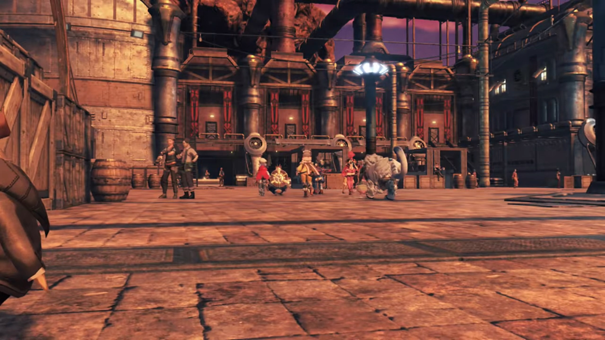
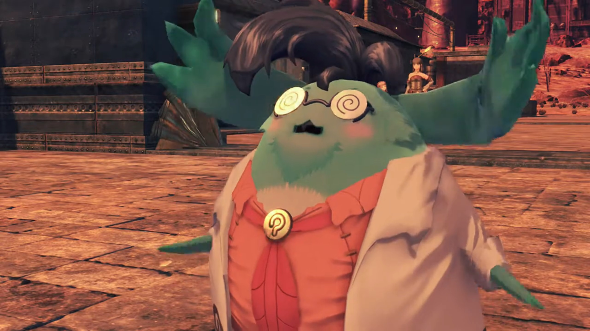
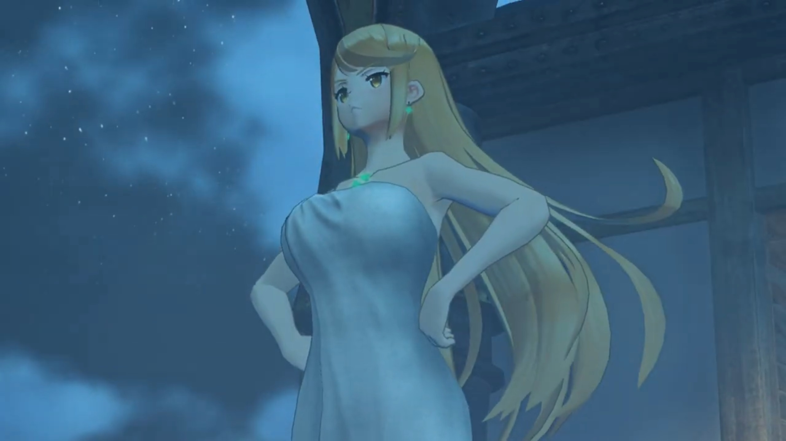
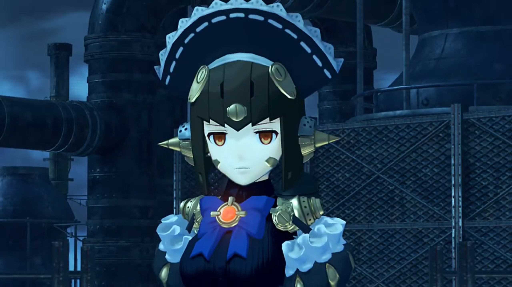
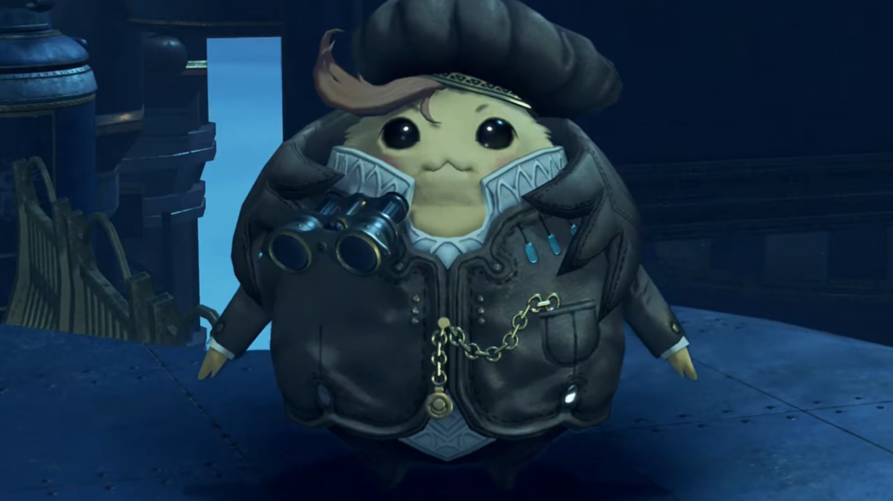
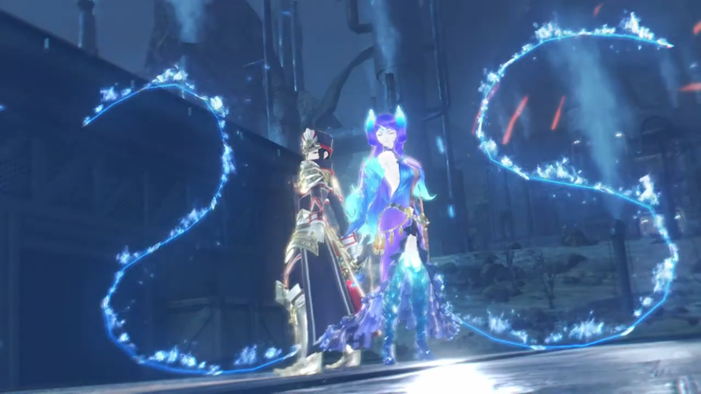
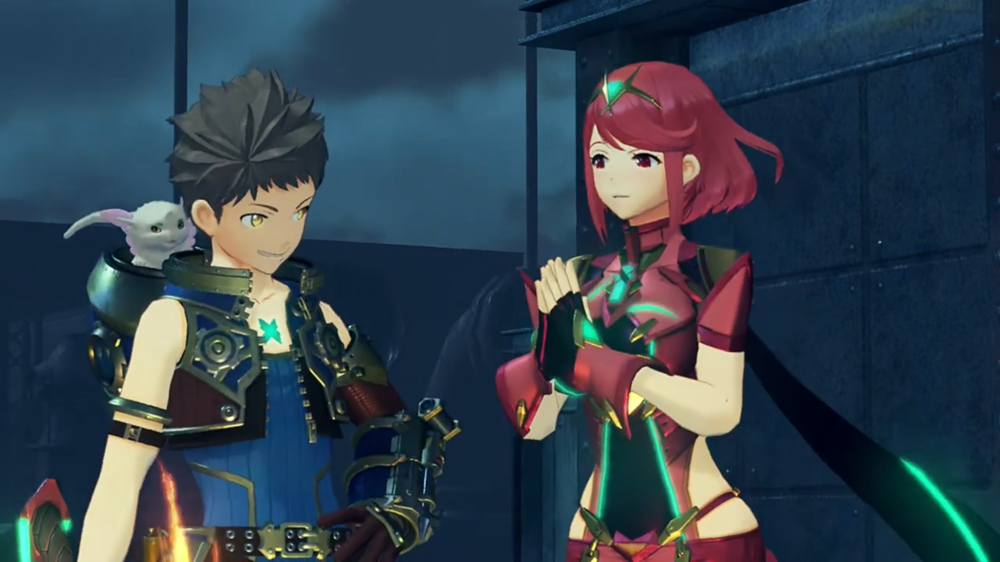

# Dadapon's Whereabouts, Travel with Mòrag

Entering the City of Mor Ardain, a Nopon was hiding behind some boxes watching them secretly. Dromarch was sensitive to sight; he turned around and searched for whoever was watching them, but the Nopon ducked behind, and he didn't think too much about it, seeing no one suspicious. Everyone else was awed by the city that underwent Industrial Revolution. Power cables overhead connected to one another. Cities of paved floor so clean{{footnote: Of course, in real past London and Amsterdam whatnots, the city was never so clean. People drink from the dirty river; if they want filtered water of various levels, it'd cost them much more. Water pumps requires money payment, and pump for how many minutes it depends on how much you pay, which the pump drew water from the river and reach the tub in your house.}}. Rhinos were tamed to transport objects. 

Rex exclaimed, "So this is the imperial capital..."

Tora exclaimed with excitement too, "Such a big city! Maybe there places selling rare **junk parts for upgrading Poppi! Time to go look!**"

Poppi objected, "Masterpon, Poppi would rather use **new** parts if possible..."

Just then, some Nopon called for their attention, "**Meh- meh! Is that you there, Tooooraaaaa?!**" They turned around and saw a green nopon wearing glasses, wearing a lab coat. "Had not see Tora in long time! Remember me -- Muimui?"

"**HUH? Why random old guy know Tora's name?**"

"Ohhhh... Tora not remember me at all!" Such disappointment. "It **Muimui! I- was assistant of Professor Soosoo, your Grampypon!**"

> Tora recalled, long ago, Professor Soosoo, Muimui, and Tora's dad was working on Poppi when Tora entered the room. He was still a child that time. 

"**Ohhhhh!** You that old Muimui guy? **Of course** Tora remember! Muimui should have said **to start** with."

"Muimui did say." He spit out harshly. 

"Oh, right! Muimui not very _interesting_, so Tora forgot he exist."

Rex lectured, "Tora, that's not very nice."

"No no, I do not blame Tora. Tora was very young **back then**. Not surprising he forget."

Poppi added, "Besides, Masterpon was **quiteeeee** distracted just now. Only thinking of how to upgrade Poppi."

Muimui's attention was directed to some finished product he'd worked for long. "Whyyyyy, **could it be?** This look like artificial Blade!"

Tora assured, "Muimui right! Tora studied Grampypon and Dadapon's blueprints carefully, and **finished construction!**"

"**M-eh, meh.... How wonderful...** If only Professor Soosoo still here... to see results of hard work!"

"Muimui, you have any idea where Dadapon went?"

"That day, when the lab was attacked, Muimui was out on errand. When I got back, Professor Soosoo's body was lying there."

"Hah..."

"But there was no sign of Professor Tatazo."

Tora was disappointed, "_I see... Even Muimui not know..._"

Poppi encouraged, "Do not feel down, Masterpon. We will find Dadapon someday. Though no evidence for this hypothesis."

Muimui continued, "Anyway, Muimui apologize for interrupting your trip when you just arrived in city. _Friend of Muimui_- run an inn just up ahead. _Place with_ famous hot springs. _If you like, Muimui can try to get you discount!_"

"**Muimui is best friend!**" So fast Tora bit the bait already. As they were leaving, the Nopon that watched them earlier were watching them leave. This time, no one noticed. 

---

At the female onsen{{footnote: 'hot spring' in Japanese}}, there was two nopon lying in the water beside each other. At the far side of the spring, Poppi was bathing with Nia. Nia felt her bones softened, "_Ahhhhhhh, that feels good._"

Poppi enjoyed it too, "Such wondrous bliss... Makes aching of journey melt away."{{footnote: Can a metallic 'junk' enjoy hot spring?}}

"Hang on! Should you even **be** in the bath? Won't you... rust or something?"

Poppi reassured, "There no problem. Poppi made from **special** alloy. Noooo rust- or neeeeed for oil!"

"Tora thought of everything, huh!"

Poppi looked high upon her "Masterpon is **finest** artificial Blade maker in allll the world."

Nia's ears flickered as she heard footsteps coming, called out with her eyes closed, "**Hey, Pyra!** Come on in, the water's **great-**..." Poppi whom looked around was surprised the long-golden-haired girl replaced the red-short-haired ones, but she didn't remind Nia. Only when she stood beside did Nia turned around, surprised, "Wait, **Mythra!** Huh?"

They turned their whole body to face her; Poppi swam a bit out from the 'shore'. Why was she here? 

She asked, "Is there a... problem?"

"I... I guess not, but..." She looked from bottom to up. Long slender smooth legs, golden ratio body, "N-n-nice... bod you've got there." Poppi looked at herself, cannot see anything. Nia was jealous. 

"Thanks."

Then Pyra took over to explain, "When I told her there was a hot spring here, Mythra was- **dead set**- on trying it out."

Then Mythra took over again, "So... here I am." And she came into the water. 

Nia commented, "Must be interesting for you guys..."

Her seriousness dimmed into a smile as she stretched and enjoyed. The slightly cloudy night did not blanket them from the stars totally. The peace of mind the stars accompanied one with, relaxes one's mind. The Nopon on the other side, one was asleep inside the water, another was deep in enjoyment. Mythra stuck her toes out of the water, playfully tickle it against. Nia sat beside her, while Poppi swam in front of them. All were living in their own worlds. 

After some time, Nia stood up, "**A-nyway.** I think I'm heading out."

Mythra noticed something after she stood up, "Nia, are you...?"

Oops, she forgotten about that. "Mm, well... Yeah."

"Do you want us to keep this quiet?"

"I'd appreciate it, yeah. For now."

"Understood." She got out of the water herself while Nia ducked back in. But Mythra reasserted, "You got it."

"_Thanks._" 

There was a tall chimney blocking the sight of the stars; unsure if it decorates well or does it obstructs the art. 

---

Back inside, after they'd dressed up{{footnote: Poppi don't need to dress up: she wore her dress into the water, not sure how she kept it dry. Waterproof, like swimsuit? Or maybe, she could heat up her body and dry them quick?}}, they gathered together, with Nia commenting, "Whewwww, that was a good bath."

Poppi noticed, "Mythra seem veeeery pleased."

"Well, it was my first bath in 500 years. _I think I have the right to savor it._"

"Can you just switch whenever?" Nia wondered. 

"With Pyra? Of course."

And she immediately switched to show it to her, Pyra continued, "Our memories are shared, so it doesn't matter that much who takes control." And Mythra came out again. 

Nia was impressed, "**Huh!** Sounds pretty handy!"

Suddenly, the inn shook, alerted all of them. They dashed quickly to the boys' dorm, and Nia wondered, "Hey, what the hell was that?!"

Rex, Tora, and Gramps were looking out the window in search of its source, while Dromarch answered them, "I cannot say. It sounds like some kind of disturbance..."

Rex suggested, "Let's find out. **Come on!** Huh?" Just realized it was Mythra there. 

"What's that look for?" she asked, tsunderely. 

"Oh, I was just... surprised to see you..."

"You'd rather I was her?"

"I-I didn't mean it like that..." but he looked away. 

"Hmph!"

Whatever, no time to think about that. They all dashed outside into the metallic balcony, searching for its source, when Mythra had something for Rex, "Hey, can I ask something?"

"You need permission now?"

"Do you mind- if I stay like this for the time being?"

"Like this... you mean, as Mythra?"

"_It hasn't been long since I woke up_, and this is all new to you. We need time to adjust to using my power."

Pyra took over and explained, "She and I talked it over together. Mythra's power is **much** stronger than mine, but it has its limitations. It can be difficult to use in tight spaces. It might be best if you get used to using her in different situations."

"I mean, I don't mind at all. I'd like to learn more about **you**, too."

Just when Mythra took over, she felt somewhat [blushy-crushy](./96_heart_to_heart.html#blushy-crushy), her hearts racing fast as she stuttered, "Wh-**what's that supposed to mean?** I don't see how I'm any different from her, really."

Scratching his head, Rex voiced the difference he noticed, "Really? You can certainly be more... **touchy** sometimes..."

"**W-well, that's just who I am! What do you expect me to do?!**"

"You see what I mean?"

"Tzk! Errrrgghhh... What's **that** smile for?!" she lashed out at him. 

"No, I just thought... it's been **fun**... lately. A lot's happened since meeting Pyra. And- now I've met you too!"

"A lot of that stuff can't have been easy, though. **_So why the smile?_**"

"**_Even rough patches can be valuable experiences._** Is that weird?"

"Always the optimist."

"Gramps gets mad at me for being TOO positive sometimes..."

Gramps corrected him from behind, "**More like- ALL the time!**"

No time to talk. There was another explosion in the distance, followed by dark smoke bellowing into the air, shaking the ground. Their attention diverted, "Ah, was that **over there?!**"

"Looks like it." Mythra agreed with him. New adventure began. 

---

Metal clashing as arquebusiers fired bullets at the escaping enemy. Despite the moon as the only source of light, the silhouette, seen running on rooftops from the ground, distinguished against the cloudy night. The silhouette stopped. The soldiers stopped, maintaining their distance within range of their ranged weapons; but bullets that hit only fell, doesn't even leave a dent. 

"**What the hell? I know we didn't miss...**"

"Is she a Blade?"

"No, look!" The 3rd soldier warning was too late. The silhouette closed in fast and brought one to the ground; the others backed away, but not fast enough. As one got hit on his stomach and chin, he realized before dropping to the ground, "That body's... mechanical?" 

Rex's group arrived late. He wondered, "Whaaaaaat the-? Who's that?"

"Meh?" Tora seemed to see this figure before. Where? He tried to recall. It's too dark to see clearly. Only when the clouds clear and the moonlight shone directly on her did he recognized, "**L...Lila?!**"

The artificial Blade with no emotion turned her back towards them, fired its rocket boosters, and shot into the air. Tora ran after her, shouted, "**WAIT! LILA!!!**"

"Wait up, Tora!" Rex called, trying to get him to stop and explain before going after her. Poppi watched and wondered if there's any relation between her and Lila. 

Meanwhile, on the other side of the rooftop, the Nopon that'd been following them since their arrival was looking at them through a pair of binoculars. 

---

"Hurrrr **Not here... Where did she go...?!**"

Rex and the others caught up, him asking, "Tora, wait. **Did you** know that girl?"

Gramps noticed, "She seemed... somehow... similar to Poppi..."

"It was... Lila."

"Lila?" Rex wondered who she is. 

"**The artificial Blade Tora's Dadapon and Grampypon** were making. **Tora recognize her anywhere.**"

Poppi read something on her panels, warned, "Masterpon, there an ether furnace reading nearby... **Huh Up there!**" The roof to their left, Lila was standing atop, watching them. 

Tora was overjoyed, "_Lila! It is you!_"

Lila didn't recognize him, nor does her emotional system as complex as Poppi's, robotically spoke out, "Ether furnace reading detected. Initiating protocol." She jumped and landed in front of them, prepared to fight. 

---

Electric sparkled from her joints, her ether furnace cannot keep up with her energy drain, she concluded, "Probability of success falling. Switching to... strategic retreat mode." Her rocket booster brought her up into air once more after she turned around. 

Tora swiftly tucked his weapon into his pocket, pleaded, "**LILA, WAIT!!!**" But she had gone behind the gate. The group cannot vault over{{footnote: Well except for Poppi and Rex (with his anchor), but the rest had to wait for them to bring over, by then it would be too late.}}, watch her ran away. Poppi urged another path of intersection, hopefully they're quick enough to get after her. 

---

A lot of running and they were at a mini desert just outside the city. Looking around, Rex announced, "She's gone..."

Poppi confirmed, "Ether furnace reading lost... It seem she has escaped."

"_Lila..._" All hopes to meet Dadapon had gone once more. He recalled, and narrated, "Long time ago, Grampypon Soosoo and Dadapon Tatazo were working on her. Her name was Lila..."

> Dadapon and Grampypon argued with each other about the inactivated Lila at the lab. They couldn't reach an agreement. Then, the young Tora entered the lab and pointed furiously at Lila. 

"Grampypon and Dadapon **and**- Tora all wanted to become Driver. However, not single one of us have potential..."

> Like Tora, all his ancestors had fountain-like nosebleed for days after trying to resonate with a Core Crystal. 

"**So**, we decide to **work together and make artificial Blade. Blade even... WE can use!**"

> Tora had high hopes for their success. 

"_But then..._"

> One day, they were working in the lab when a green Nopon wearing lab coats entered the room, shielding his face with sunglasses, pointing a gun at them, and brought with him Mor Ardain soldiers. Despite they raised their wings over their head, surrendering, a smirk came on the Nopon's face and he fired at Grampypon Soosoo, ending his life.
> 
> Dadapon Tatazo checked Grampypon Soosoo's arteries; no more heartbeat. Turning around, he shouted, handling him a box "**You must run, Tora! Take this and go! Someday, you finish what we started!**"
> 
> Tora didn't hesitated; he ducked past the soldiers and escaped into the dark. Dadapon Tatazo was after that captured. 

"After that, Tora hide out in Torigoth city. Making Poppi based on **blueprints... and ether furnace** Dadapon left for Tora." He looked at Poppi, perhaps explaining to her more than to the group. 

Mythra wondered, "Don't you have any idea who the attackers were?"

"Tora not know who, but they **definitely** wanted to **steal** Lila."

Nia wondered, "If it was Lila they were after, how'd she _end up here in the Empire?_ It looked like there were imperial soldiers after her..."

He shook his head, "**Tora have no idea...** _But one thing is **most** confusing._"

"What's that?" Rex wanted to know. 

"When bad guys attacked the lab, Lila was not finished. There only **one** who could **finish making Lila -- Dadapon Tatazo!**"

"Which means..."

Gramps concluded primitively, "Tora's father... must- still- be- alive- somewhere?"

Tora was sure that "Dadapon _must be held_ **captive by whoever. Using. Lila.**"

Not enough info to conclude. When they were busy with their thoughts, a soldier suddenly shouted from behind, "**You there! Don't. Move!**" They looked around and found themselves surrounded by a [decade](./96_heart_to_heart.html#dromarchs-wisdom). 

Gramps noted, "Imperial soldiers..."

Leading the [decade](./96_heart_to_heart.html#dromarchs-wisdom) was Mòrag and Brighid. Once again they met. 

Nia can't believe what she saw, "**You!**"

Mòrag: "So, **we meet again**, Driver of the Aegis!"

One soldier eyed Poppi, announced, "**Lady Mòrag, she's the one! That mechanical girl took down our squad!**"

Rex exclaimed, "**WHAT?! Hang on a minute!**" You got the wrong person! 

Nia jumped on her feet, "**Where the hell'd you get that idea?!**"

Poppi can understand why, voiced, "Unfortunately, they cannot tell difference between Lila... and Poppi."

Mòrag remembered his name, "So, Rex, _was it?_ Rex, _I'm very disappointed to find you stooping to such lowly crimes._"

"**Lowly crimes?! WHAT THE HECK?! I'm telling you, you've got the wrong guys!**" But they wouldn't listen; a battle therefore begun. 

---

"Your skills- have improved, boy!" Her whip lashed at him. He dodged it and called out, 

"Mythra!"

"I know, I know. I won't use that power, OK? Let's stick to Foresight for this. If you **really** need to attack, I'll hand it over to Pyra."

"Thanks!" He closed in distance with Mòrag, engaged in melee. 

She noticed something else, "The Aegis has changed. What **happened** to her appearance? **Answer me!**"

"**You want answers, then put the swords away! What's wrong with you?**" He pushed her away. 

"I'll listen to your confession- **while you lie defeated!**" Without looking, she threw one of her whip to the side, and Brighid caught it, came quickly to her side, and stood side by side. Dual whip clashed together and formed rattlesnakes. Flames with high concentration combined and lashed at them. Foresight activated -- time stopped. 

"**Rex! After this Foresight, I'll switch to Pyra!**"

"**Understood!**" As he moved adeptly, fitting his body within the high concentration of fireballs. 

When Foresight stopped, Mòrag was surprised, "**Impossible! He dodged it?!**"

"Now it's my turn!" Incoming Burning Sword. 

Brighid called for her attention, "Lady Mòrag! Look at the Aegis!"

"So you can change at will!"

"**Eat. THIS!**" Mòrag intended to defend hard, didn't dodge. The flames reached just a few centimeters in front of them before turning up, blasting in the air. "**Pyra?!**"

She explained, "We can do this... without hitting them."

"Hah! It's like you read my mind."

"Heheh!"

She pointed her truncheon at them, asked angrily, "Are you holding back on me **again, boy?**"

"**We just don't have any reason** to fight you."

"Urgh!"

"Enough. Both of you." The secret Nopon finally surfaced himself from the background. 

Mòrag recognized, "I know you. You're from the Argentum Guild's Intelligence Division."

"Lady Mòrag, stand down arms! These not the ones who infiltrate the facility... and attack your soldiers."

---

After some explanation, Mòrag asked, "Then, the culprit behind the attack... was not the artificial Blade standing her now. Is that right?"

"They very similar, but _not_ the same. Niranira saw her with own eyes."

Dromarch now recalled, "I had a feeling... _we were being **watched** since our arrival._"

Niranira acknowledged, "I _quite sorry_- for causing concern. Niranira has been- 'auditing'- Argentum Trade Guild."

Nia understood, "_Ahhhh_, so **you** were keeping an eye on us because we came in on a Guild ship."

"How ironic that your suspicion- should happen to prove our innocence." commented Dromarch. 

Mòrag concluded him trustable, sheathed her weapons, and apologized to the group, "It appears I was too hasty in judging you. I should not have attacked you so suddenly. My apologies." She gave them a neck bow, and the soldiers stood in line behind her and waist-bowed to the group. 

Rex felt the formality way too strongly, furiously shook with his hands held out, "**N-n-no, that's fine! Nobody got hurt in the end. I'm just glad it all got cleared up now.**" He looked towards Nia, and they eyed each other, not sure what they were thinking. 

Gramps prided, "An apology from the illustrious Flamebringer? A rare reward in itself."

Tora expressed his anger at Mòrag, "**Tora still not happy! Should get year's supply of Tasty Sausages as compensation!**"

Poppi quietly lectured him, "_Masterpon._ Have some self-respect."

Mòrag seemed to agreed with him. "Hmm. I will do what I can within my own means to compensate you." Turning back at Rex, "By the way, the culprit who fled the scene... may I ask what manner of connection you have with them? You must tell me all."

Mythra replaced Pyra, and the storytelling session began. 

---

"I see. It seems it would be best for all of us- **if**- we worked together for the moment." she suggested. 

Gramps was surprised, "**Us**- work- with you?"

"Indeed. My goal is to capture the artificial Blade... and track down the criminals behind its actions. And from what you just told me, those I seek... likely have Tora's father held captive. Would you not say our interests align?"

Rex couldn't find flaw in her logic, "Uhhhh, I guess so?"

Mythra saw the upsides, "Well, it's definitely better to have her working **with** us... than against us. We shouldn't take the power of Brighid, _Jewel of the Empire, too lightly._ If she went all out on me, even I wouldn't be able to hold back. And then... **we'd burn** this place to the ground." Tora and Poppi fluttered with fear. 

"I am honored... that the Aegis herself- thinks so highly of me."

"You may not remember it, but... I've faced you a few times before. **Let's just say**... _it wasn't easy._" she commented queasily. 

Rex was surprised, "**Ohhhh, really?**"

"**But**- that's a story for another time. What do you say, guys?"

Nia agreed, "I can't deny I'd rather avoid making an enemy of them." Dromarch, Tora, and Poppi nodded. 

Rex replied back, "**All right, then! So**, from this moment on I suppose we're allies!" He walked forward and held out his hand. Mòrag took it and shook, witnessed by Niranira. 

---

The soldiers and Niranira had left them alone. Mòrag announced her timetable, "For the moment, I will return to the palace. If you learn anything new, please send word. I will instruct the palace guards... to allow you audience with me."

Rex agreed, "**All right.**" Then they watched them go. 

Brighid looked over her shoulder and asked her Driver, "Are- you- sure- you wish to partner with these people?"

She replied, "Just as you _were not using **your** full strength, neither still were they._ Yet **you saw** the power they demonstrated. How could I not feel intrigued?"

"Drawn by your Driver instincts?"

"Something _like that. And besides..._" She looked to Brighid, and they turned around and looked at the group. They were gathering around in a circle, chatting. She continued, "I get the feeling _that_, if I stay near that boy, I might bear witness to **something** quite extraordinary."

---

They explained their situation to Muimui back at the lobby. "It sound like you have quite the adventure. But it good that you work things out."

Rex turned to the group, "Anyway, we'll see if we can... track Lila down somehow ourselves."

"_I too_ will see if I can find any leads. No matter what, **Muimui and friends will find Professor Tatazo!**"

---

The group reported back to Mòrag at the Castle, after gathering enough evidence from eyewitnesses, "I see. There was indeed once a factory there. However, it was abandoned some 30 years ago."

"So, you think we've got 'em?" asked Nia.

"We can't be certain unless we investigate."

"Shall we go?" asked Rex.

"You?"

"We won't do anything reckless. If it seems dangerous, we'll turn back. How's that sound?"

"Hmm... To tell the truth, it would be difficult for me to dispatch the military so quickly. Would you?"

"Sure thing!"

"Now, let me share what information I have found. There are rumors about town... that an esteemed- Nopon merchant is involved in this affair."

"An esteemed- Nopon- merchant..." A Nopon merchant again? Vandham mentioned some Nopon were spreading the news about the Aegis, were they the same Nopon? Whom had he traded with before? One came brightly in his head, "**Chairman Bana?!**"

"Well, we're currently searching the transaction records. If we find anything, we will inform you."

"Pretty busy, eh?"

"I don't deny it. I will head to the location myself as soon as I am able to mobilize some troops."

"All right, then."

### Footnotes: