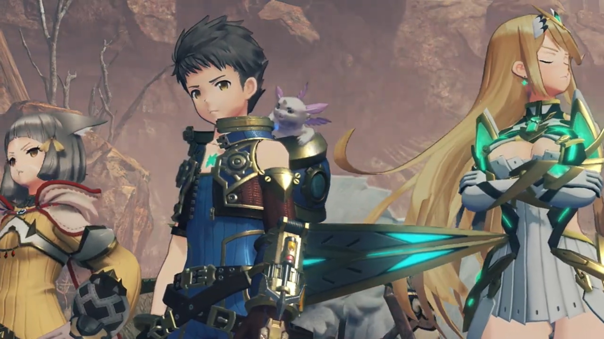
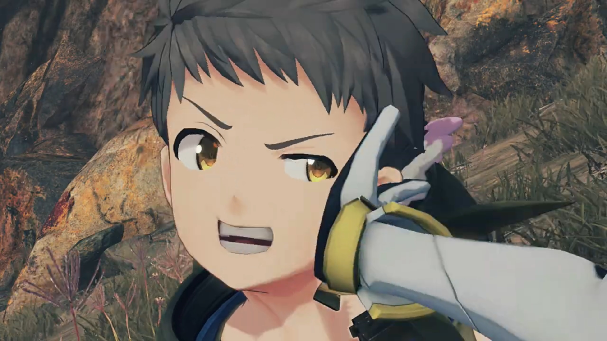
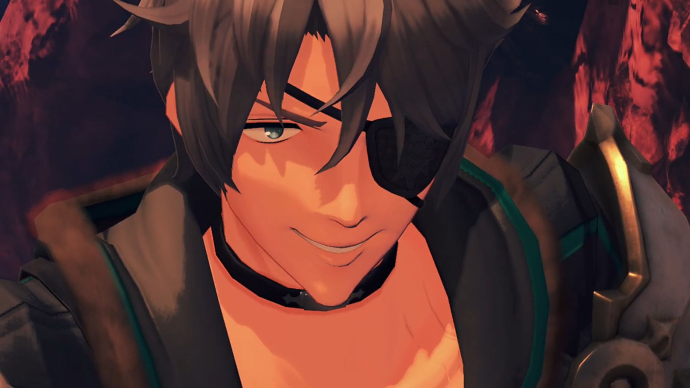
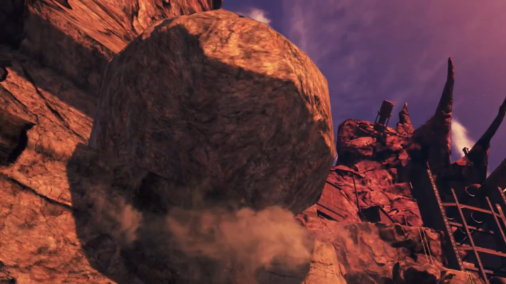
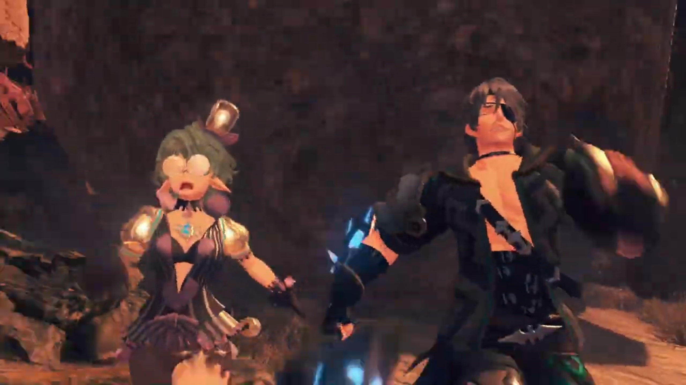

# One-Eyed Monster, Confrontation at the Factory

===

Trekking their way to the factory, they walked beside some cliff walls. Suddenly, some laughters attracted their attention, "**AH HAHAHAHAHAH!!!**" They didn't wait long for Zeke and Pandoria to reveal themselves. "So we meet again, Aegis!" He looked at them over his nose. 

Nia exclaimed, "Oh. It's Shellhead."

He answered too quickly, "Yes. **WAIT, WHO'S 'SHELLHEAD'?!!!**"

Dromarch commented, "_As ever_, your coming timing is exquisite."

"**URGH! YOU WILL ADDRESS ME AS ZEKE VON GENBU, BRINGER OF CHAOS!!!**" He slashed his swords at them, strongly showing how determinant he was. Though, his sword was a little too long, and Pandoria had to bent back a little more to prevent being struck by it. "**OR ZEKE!** Or **THE ZEKENATOR!!!**"

Nia: "Make your mind up. And what the hell is a Zekenator, anyway?"

"Hah! You may have been lucky last time, thanks to a certain _unstable cliff_. But **this time round**, we meet on good olddddd terra- firma!" They stepped on the ground hard to show how strong it's supporting them. Never mind the spraying of saliva speaking bending forward. 

Zeke continued, "If you think you can run from me a **second time**, you are **Quite. Mistaken!**"

Nia: "Nobody did any running... And anyway, Shellhead?"

"What?"

Pandoria facepalmed herself, wondered, "You answer to that now?"

Nia continued, "I've been wondering for a while now... but, what's with the cutesy eyepatch?" She pointed at his pirate-eyepatch. 

"Heh! I'm quite glad you asked. This eyepatch conceals a power too great for mere mortals to comprehend. **The Eyeeee, of SHINING JUSTICE!!!**" He stared at them with his other eye, deliberately not noticing all of them had been very impatient with his speech, "I am sworn to keep it sealed until its power is needed to save mankind. You should count yourself lucky. It would turn you to ash in seconds!"

Nia: "Whatever you say, pal."

Pandoria stepped forward to try denying, "He definitely isn't wearing it because he didn't have the gold... for a second contact- lens."

Nia shot back at them, "How poor are you?! And are you THAT short-sighted?!"

Dromarch wanted to get to the main point, "By the by, what business might you have with us today?"

Zeke can't believe they didn't listened, "Are you thick? I'm here for the **Aegis, obviously!**" He pointed his sword at Mythra. She looked over the tip of her eyes, and eyed away again, too tsundere. 

Nia tried to convince him, "Listen, pal. I'm sorry, but we **really don't have time** to play with you today. So hurry on home, OK?" And she shooed him, her arms wavered strongly like swatting flies away from bothering you. 

"W-what's this? W-were you so **frightened** by our power, that you wet yourself, **furry-ears?**"

That incited her, "**Did I WHAT? YOU'VE GOT A LOT OF NERVE, YOU ONE-EYED MONSTER!!!**"

Rex, Mythra, and Dromarch heard 'One-Eyed Monster' and got triggered, she blushed immediately. The rest of them don't know what that means. 

Rex tried to explain to her, "**N-Nia? You do know 'one-eyed monster' usually means...**" He tried to get closer to her, to speak in her ears. 

She shot back at him before he finished, "**Huh?! Means what?!**"

He backed away, "Um..." Blood started to rush through his face as he got too nervous to explain it out loud, looked at the other side, "It's, ah... Mythra, why are you blushing?"

She deliberately looked away, but he went around to look at her face. He may have liberated himself from her torture, but brought himself into another lion. She did not hesitate to turn around and gave him a slap in his face. 

"**Shut up!**" And the battle begins. 

---

Zeke dragged backward with his opponent's strength too strong. "(pant pant pant)... You guys are *even tougher than last time!*" Be fell backward; Pandoria was there just on time to act as his stick to support himself. "However, your **luck** ends **right here.**" With a grim, he released huge amount of electricity on his sword, "**HERE WE GO!!! HIYAH!!!**" The strong lightning power didn't feel weaker than last time, despite them getting stronger, blowing dust heavily on their face. "**BRINGER OF CHAOS!!! ULTIMATE LIGHTNING FURY SLASH... MAXXXXXXX!!!**"

Missed once more, and created a symbol once more on the ground in front of the group. Electricity did sparkled on their skin, but did them no other damage. Black smoke do rise and obscured their view. 

Nia couldn't believe it, "**COME ON!!! THAT WAS THE SAME AS LAST TIME!!!**" How bad is your accuracy? 

He slowly stood up, still smiling regardless, "Hah!" Before he had time to speak, the ground started shaking. They tried to find the source of collapse this time. 

"Urrrr..." Mythra saw it. 

As if he noticed nothing, he continued his pose and smile. "Uh?" Only then he felt something not right. Looking to his left, above the cliff wall, there was a giant boulder that stuck out of the cliff, but his Ultimate Lightning Fury Slash MAX was so strong it shook it out of balance. 

"**AAAAAAAHHHHHHHH!!**" They both shouted, but it was too late to run. They ran as fast as they could, the rock catching after them faster than they could run. "**P-Pandy! Can't you do something?!**"

"**Sorrysorrysorry!!! You know my element's lightning! I'm not cut out for this!**" Closer and closer, the Cloud Sea was just in front of them, just a little more, just a little more and we could escape! Zeke turned around and calculate their ever-closing-in distance, puffed out the last breath he had and channeled whatever energy to his feet, patrolled him quicker forward. 

But too late; just before they jump, the boulder knocked their back and sent them into the air beyond infinity. "**ARRRRRRRGGGGGGHHHH!!!**" And that's the legend of the One-Eyed Monster! 

Rex can't believe it, "**S...seriously, though, what's their problem?**"

Nia sighed, "Ugh. What idiots. C'mon!" And they walked past, not sparing another second thinking about him. 

### Footnotes: