# One-Eyed Monster, Confrontation at the Factory

Trekking their way to the factory, they were walking beside some cliff walls when suddenly, some laughters echoed, "**AH HAHAHAHAHAH!!!**" Searching for its source, they didn't wait long before Zeke and Pandoria revealed themselves. "So we meet again, Aegis!" He tilted his head higher and looked at the group over his nose. 

Nia exclaimed, "Oh. It's Shellhead."

He answered too quickly, "Yes. **WAIT, WHO'S 'SHELLHEAD'?!!!**"

Dromarch commented, "_As ever_, your comic timing is exquisite."

"**URGH! YOU WILL ADDRESS ME AS ZEKE VON GENBU, BRINGER OF CHAOS!!!**" He slashed his swords at them, strongly showing how determinant he was. Though, his sword was a little too long, and Pandoria had to tilt a little more to prevent being 'accidentally' struck by it. "**OR ZEKE!** Or **THE ZEKENATOR!!!**"

Nia was too tired, "Make your mind up. And what the hell is a Zekenator, anyway?"

He's not answering, "Hah! You may have been lucky last time, thanks to a certain- _unstable cliff_. But **this time round**, we meet on good olddddd- terra- firma!" They stepped on the ground hard several time, each time moving their feet forward and bent lower; while he continued raining saliva at them, pushing his lungs to its limit of not stopping to breath midsentence. 

Zeke continued, "If you think you can run from me a **second time**, you are **Quite. Mistaken!**"

Nia: "Nobody did any running... And anyway, Shellhead?"

"What?"

Pandoria facepalmed herself, wondered, "You answer to that now?"

Nia continued, "I've been wondering for a while now... but, what's with the cutesy eyepatch?" She pointed at his pirate-eyepatch. 

"Heh! I'm quite glad you asked. This eyepatch conceals a power too great for mere mortals to comprehend. **The Eyeeee- of SHINING JUSTICE!!!**" He stared at them with his other eye, deliberately not noticing all of them had been very impatient with his speech, "I am sworn to keep it sealed until its power is needed to save mankind. You should count yourself lucky. It would turn you to ash in seconds!"

Nia don't believe his blunders, "Whatever you say, pal."

Pandoria stepped forward to try denying, "He definitely **isn't** wearing it because he didn't have the gold... for a second contact- lens."

Nia shot back at them, "How poor are you?! And are you THAT short-sighted?!"

Dromarch wanted to get to the main point, "By the by, what business might you have with us today?"

Zeke can't believe they didn't yet knew, "Are you thick? I'm here for the **Aegis, obviously!**" He pointed his sword at Mythra. She looked over the side of her eyes, and head tilted away again, eyes closed, too tsundere. 

Nia tried to convince him, "Listen, pal. I'm sorry, but we **really don't have time** to play with you today. So hurry on home, OK?" And she shooed him, her arms wavered strongly like swatting flies away from bothering you. 

"W-what's this? W-were you so **frightened** by our power, that you wet yourself, **furry-ears?**"

She was incited, "**Did I WHAT? YOU'VE GOT A LOT OF NERVE, YOU ONE-EYED MONSTER!!!**"

The way she spat out 'One-Eyed Monster' blindmindedly triggered those who knew its indirect meaning -- Rex, Mythra, and Dromarch. Mythra felt her face red hot, while the other two gasped. 

Rex tried to get to her, "**N-Nia? You do know 'one-eyed monster' usually means...**" He got closer to her, tried to speak in her ears. But she was currently in a fury, shot back at him, 

"**Huh?! Means what?!**"

He backed away at such aggressiveness, "Um... It's, ah..." Explaining it in public loudly, are you serious? Blood rushed up his face as he tried to find a better word, or perhaps, furiously looking around to find something to change the topic, until he saw her, "Mythra, why are you blushing?"

She deliberately looked away to not let them see; he deliberately went around to look clearly at her face. Even Gramps stick his body out of the helmet more.{{footnote: All the while Poppi was so blank watching their interaction.}} She turned her blushed face at him, against all odds, and Gramps already knew what would happen next. A strong hand swing hard on his cheek, and "**Shut up!**" 

And the battle begins.

---

A lot of force brought Zeke dragging along the dusty terra firma before he came to a halt. Already tired, "(pant pant pant)... You guys are *even tougher than last time!*" He fell backward, and Pandoria caught him on time. He retained his pose despite feeling effete, and his mouth never stop taking advantage of the group, "However, your **luck** ends **right here.**" With a grim, he summoned whatever energy left within him, released huge amount of electricity on his sword, "**HERE WE GO!!! HIYAH!!!**" The strong lightning power sent electric sparkles at the group as they shield themselves from the numbness. "**BRINGER OF CHAOS!!! ULTIMATE LIGHTNING FURY SLASH... MAXXXXXXX!!!**"

Once again, it missed the group, created a symbol on the ground in front of them. Aside from the electric sparkles, it did them no damage. Black smoke and thick dust did obscured their view, though, as they shielded their eyes and nose and mouth. 

Nia couldn't believe it, "**COME ON!!! THAT WAS THE SAME AS LAST TIME!!!**" How bad is your accuracy? 

He slowly tilted his head up, grinned regardless, "Hah!" And like last time, the terra firma started shaking. The group tried finding the source, when Mythra spotted something up on the cliff wall. 

"Urrrr..." 

"Huh?" Following her view, he looked, and a giant boulder stuck to the top of the cliff at a delicate balance, started shaking off the ground that held it, destroying the balance. Slowly but surely, the boulder started rolling and tumbled down, 

"**AAAAAAAHHHHHHHH!!**" Screaming, the immediately turned around and ran as fast as they could, hoping to reach the Cloud Sea not far in front before being caught up by it. With full force and largest stride, their will to stay alive pumped their adrenaline to its max; but how could their velocity be compared to a giant boulder pulled by gravity? 

"**P-Pandy! Can't you do something?!**"

"**Sorrysorrysorry!!! You know my element's lightning! I'm not cut out for this!**" Just a little more, the Cloud Sea was just beyond. 

Zeke turned around, "Umph!", puffed out whatever energy he had within him to rush for the cliff, but just a step before, the boulder caught up with them and sent them blasting into the air beyond. "**ARRRRRRRGGGGGGHHHH!!!**" And that's the legend of the One-Eyed Monster! 

Rex can't believe it, "**S...seriously, though, what's their problem?**"

Nia sighed, "Ugh. What idiots. C'mon!" And they walked past, not sparing another second thinking about him. 

---

Conveyor belts manufacturing artificial Blade's body and ether cylinder in the thousands. From the office on the 1st floor{{footnote: British standard, 0th floor is 'Ground' floor.}}, Bana, accompanied by Muimui, was satisfied. "Now this... quite the sight."

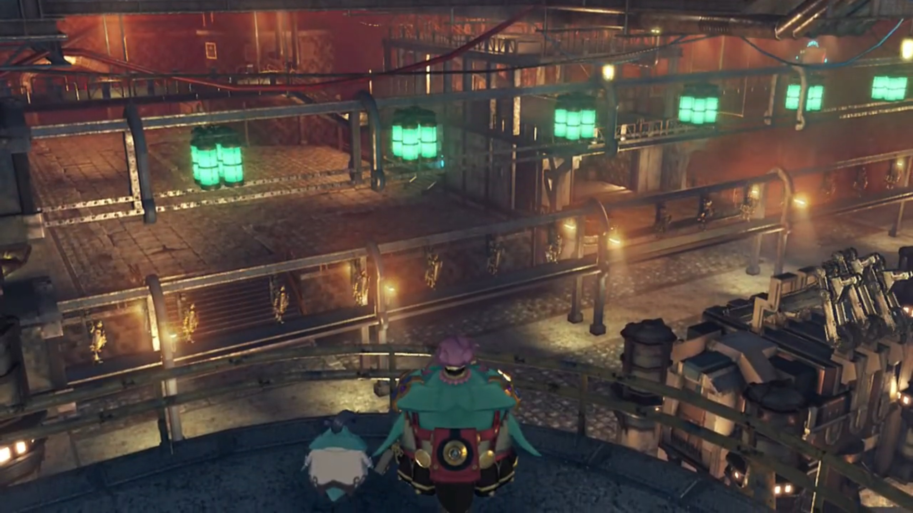

Muimui reported, "Production has been running non-stop, 24 hours a day!"

"Muimui... Once we have first thousand ether furnaces, we sell them to Torna." Bana announced. 

He was confused by his decision, "Eh? Mehmeh? But I thought this project funded by Roderich, from Imperial Senate. Was it not Senator- who gave us info on Core Chips for Lila to steal, too?"

Bana was a far larger potato than Muimui. The giant potato refused to let anything but money changes his mind. "**That make** no difference. **We go**- where profit goes. **Old geezer** can wait a bit longer for his turn. Once war break out with Uraya, **he get desperate and offer more MONEY!**"

Such idol on money, "**Chairman Bana so amaaaaazing!** Did not realize thinking about this was so deep."

He was flattered, "**MEHEHEHEHAHAHAH!!! FIRST rule** of making money."

---

The **Abandoned Factory** was not so abandoned, eh? With full scale artificial Blade and ether furnace production at full speed. The group sneaked inside the factory and found the sight worrying. An abandoned factory clearly should not have such activity levels. Rex questioned, "Are all of these artificial Blades...?"

Tora worries came true, "_Then- Dadapon really_ **must be...**" He looked around, hoping to see the figure he'd hoped to return to him for long; but could not yet find. 

Gramps wondered, "Hmmm... What exactly are they planning here? Well, whatever it is, it can't be good..." And they continued their journey; but the lift was deactivated -- they'd to find another way down. 

---

The group hovered over an air vent located on the ceiling of the control room. A tirkin below was speaking full of disrespect to Tora's Dadapon,  "Professor Tatazo! Speak, speak, you give orders! If production get more slow, _maybe you ready for sleep time with fishes..._"

"**Reduce load on neural circuits by 20%. That should improve production efficiency!**" he shouted commands. 

"_See? It not so hard._" The tirkin got what he needed, turned away and exit the control room. 

Tatazo? "Hey! Isn't that. Huh?" Rex turned to where Tora was expected to be, but he was already gone. 

Tatazo was going elsewhere when he heard a thud from behind. Turning around, despite he grew up a lot, he immediately recognized, "Ah! _Could it be..._ **Tora, that you?**"

"_You_ really Dadapon Tatazo?" He felt anxious. What if he isn't? What if he's just a clone? Or someone else looking similar? All hopes would be gone. 

"**TORAAAAA!!!**" 

"_Dadapon!_" And they came to embrace each other, hugging and crying. "_Tora miss you so much!_"

"_I miss you too!_" The group dropped down behind them. 

Rex felt heartwarming. On the road to Elysium, helping someone to find their missing loved ones? "Ahhhh, that's great."

"Hrrrr hrrrrrhhhhh..." Someone crying... but wait, it wasn't from Tora and Tatazo, it's from one's left. He swung his head around and saw tears at the tip of Mythra's eyes. He searched his pocket and handed her a handkerchief. 

"Thanks..." She did not retain her tsundere this time. 

"Who all these people?" After Tatazo finished rejoicing, his attention turned to the others. 

Being too overwhelmed, Tora accidentally spat out, "They Tora's sidekicks... I mean, sidek- I mean new friends!" So, that's how you think of us? Or you just want to please your Dadapon? 

"**Wonderful!** They come here for you? **You have good friends.**" Eyeing one by one, Poppi caught his eyes, "_Oh! That artificial Blade..._"

Tora introduced, "This is Poppi! Tora make her by improving on blueprints for Lila!" Stuck his nose high, waiting for praises to shower him. 

His dad was pleased, "**MEH MEH!!! Most impressive. Tora MUST have worked hard!**"

Dromarch interrupted them, bringing them back to reality, bluntly warned, "If I may, I know there is a lot of catching up to do, but perhaps we should escape!"

Gramps agreed, "A very good point. Come on, Rex!"

"Right!"

"**Not so fast, intruders!**" Too late. Muimui had returned with some tirkins. 

"**Muimui!**" Dromarch was surprised. 

Nia: "**Don't tell me...?!**"

"Really, now? You actually not realize it yet? Muimui give you information **on purpose**, to lure you to factory. _If we not want you here_, **you would never find this place so easily!**" He just ripped their face off{{footnote: This analogy came from F.I.A.S.C.O. by Frank Partnoy, where someone from the derivatives department of Morgan Stanley, when they sell something highly risky and sure to fall to clients just to earn their fees, and when it fail, they tell them straight in the face but client surely can't win the legal case because it's written in fine prints in the discretion section, is how you 'rip their face off'.}}. 

Tora was angered, took out his drill and pointed at him, "**Meh meh! HOW DARE YOU!!!**"

"Masterpon is really angry." noted Poppi.

Muimui voiced his goal, "Meh... Finally I have chance to seize precious artificial Blade. **Now! Take care of these intruders!**" He was not joining the fight, letting the tirkins deal with them. 

---

All tirkins dropped to the floor and burned to ashes. Muimui was standing in front of the entrance, shuddering, "_H-h-how can you be so strong...?!!!_" His greed is justified, except he don't have the power to fulfil his greed. 

Nia: "Now we're gonna need some answers. What were you people plotting here?"

He pretended naïveté, wobblingly answered, "_O-ordinary business! We **innocently** mass-produce ether furnaces and artificial Blades, and sell to people who want them!_"

Dadapon added to the story, "They threaten Tatazo, and force to participate in production process..."

"_Dadapon..._" Tora felt heartbreaking. How much torturous feats had his Dadapon went through? 

Gramps wasn't moved, "And next you want to **get your hands on Poppi?** You are a **greedy** bunch."

"**I knew as soon as I saw her!** That artificial Blade uses lost ether furnace designed by Professor Soosoo! _That is why..._"

Tatazo agreed, "**You quite right! Even I could NEVER make such incredible furnace** as my own Dadapon."

Nia concluded, "So you lured us out here to avoid making a ruckus in the city, is that it?"

"_Qu-quite right, yes..._" His voice died down. 

Tatazo tore down the show he'd put up with them, revealed that "Muimui was part of group plotting to **steal artificial Blades all along.** While he my Dadapon's assistant, **he sell information to contact in Guild and had THEM attack laboratory!**"

Tora can't believe, "What?! Then- it all his fault that **Grampypon was killed?!**"

"Indeed **it was.**"

Rex had the answer, though he wasn't fully sure, "A contact in the Guild... Could it be that the one behind all this is..."

"**Indeed! It is I.**{{footnote: Such arrogance to use 'I' here. That's why you should use 'one' to refer to yourself than 'I', to signify you're just one of the many and not as unique as you thought you are. Plus, for a nopon, that always refer to themselves by calling their names, to use 'I'? How arrogant.}}" The entrance hatch opened, and Bana, accompanied by Lila, appeared behind Muimui. 

Muimui was relief to see his savior here, "**M-M-Master Bana!!!**"

He scolded him immediately, "**You never do**- finish job _properly_, do you?! You manage to lure them alllll this way, **AND THEN FAIL TO CAPTURE THEM?!!!!**"

"_Muimui very sorryyyy..._" He bow, hoping he would not smack him for the worst. 

He turned back to the group, commented, "But I am **nice** Nopon." His eyes first laid on Mythra, said, "**You brought not** only artificial Blade to me, but even the Aegis itself! _Once I have ether furnace of Professor Soosoo, I can produce_ even **better** artificial Blades, _and make a killing!_ **Then** I sell **Aegis too AND MAKE MOUNTAINSSS OF CASH!!! THEN I CAN FEAST- ON MUSHY MUSHROOMS** for life!!!" He was already high on drugs daydreaming. 

Rex: "**Chairman- Bana!** I can't believe you would stoop to this!"

"You should show more respect, after all the **valuable** work I find for you."

Nia had questions, "So, who are you planning to sell the Aegis to, anyway? **Torna**, I suppose?!"

"**How you know** about Torna?!" He observed her closely, recognized, "**Wait**, I remember you! **You one of Torna's Drivers!** Wh-wh-wh-wh-**what you doing here?!**" He felt a little panicky. The mere name of Torna brought him shivering with cold sweat. The only deal he'd with Torna was, "If you come for ether furnaces, **they ready in SHIP outside.**"

Nia jumped on her feet, "What?! **You're selling THOSE to Torna as well?!**"

He was confused, "Not sure what is going on, but- I will **just**- beat you all up. **LILA! TAKE THEM ALL DOWN!!!**"

"Mission acknowledged. Commencing. combat." She powered her rocket boosters and dropped to the ledge below, prepared for battle. 

Tatazo called out, "**Tora, please destroy her for me.** Muimui modified her so she not even **listen** to Masterpon Tatazo **any more!**"

"_Dadapon... All right!_ **Come on, Poppi!**"

"As you wish, Masterpon!" And the battle begins. 

---

Poppi clutching to Lila mid-air; they wrestled for domination. The others don't know how to fly, had no help. Tora cheered for her, though, "**Do not let her win, Poppi!**"

"Of course, Masterpon!"

Lila cannot understand, "Comprehension error. Your integrated ether furnace- is not- fully activated. As an updated model, my energy throughput is... superior."

Poppi rebutted, "Energy efficiency **not** the problem here. Poppi's masterpon told Poppi **not** to lose. So Poppi will win. Very simple logic." She channeled more energy to her rocket boosters to made it through. 

"Comprehension error." She changed posture and they fought once more. 

Poppi concluded, "And that is why you are failure." She caught her, flipped a few times, and vaulted Lila towards the Control Room; the group ducked as she smashed the glass in front of them, landed with a bang on the ledge Bana and Muimui stood. 

Tatazo worries spiked, "**Lila!**" Poppi stopped to assess her danger index, and she and the others waited for the smoke to die out. Electricity leaked through her joints, she had difficulty moving, what says continue fighting. 

"**Do it, Poppi! One more attack and she down!**" urged Tora. Poppi therefore aimed the giant drill at her. 

"**W-WAIT!!!**" Tatazo shouted. "**Wait one moment, please!**" He used himself as a meat shield between Poppi and Lila. Poppi was shocked by his act, reversed her thrust{{footnote: by aiming her leg in the other direction. 'Reverse thrust' is what planes use when they landed; brakes applied to the wheels probably isn't enough to land before reaching the edge of most airport runways today.}}, pulled the hammer with all her strength, and stopped an inch before coming in contact with Tatazo. 

"_D-Dadapon?_" Tora was confused. 

"I sorry, Tora. Even if she no longer listen to me... **Even if she become weapon** for evil... **Lila! Lila is all I have. Only reminder of Dadapon Soosoo. SHE is my treasure...**"

A blink came within Lila as she failed to understand yet again, "Comprehension... error..."

Bana was fumed, "**What you think you are doing?!**" He flickered the remote controlled of Lila to force her to continue fighting. Bright lightning beam shot through the air as Lila's furnace overclocked, disengaging any failsafe mechanism. "**No need to bother protecting yourself! STEAL THAT ETHER FURNACE EVEN IF IT DESTROYS YOU!!!**" The power was too great to control; she struggled step by step towards Poppi. 

"Li...la...is..."

"**You not need to listen to his orders, Lila!**"

"**HURRY AND TAKE IT!!!**" He pressed one more button on the remote control.  Muimui nodded. Yes, that's it. That's what he wanted. Dog biting dog! 

Every step was heavy; smoke bellowed from her joints. Yet even heavier was her heart, her emotions overflowed, "Lila's... Masterpon... is..." Rex eyed Mythra to get ready, Nia read their interactions, prepared herself. "Lila's Masterpon... is Professor Soosoo... and... Professor..." She raised her hand up high into the air, "Tatazo." And punched through her own body, pulled out the control panel implanted within, squeeze it into pieces{{footnote: Such strong strength. One would never be able to do it unless it's soft drink's that kind of soft metal.}}

Bana was flabbergasted, "**WHAT?!!! SHE DESTROY CONTROL DEVICE ON HER OWN?!!! MEHMEH!!!**" The remote control in his hand burst into smoke. 

Lila collapsed on her joints. Poppi was impressed but felt sorry for her, quickly went forward and supported her. Tatazo and Tora came yet after, she said, "I very proud of you... sister."

"Poppi..."

Tora: "Poppi... Lila..."

Bana was still overwhelmed with failure; he just scolded Muimui, and now he's one of the lowly Nopon? "**THIS NOT HOW IT SUPPOSED TO GO!!!**" But he had one last chance, his ultimate weapon. 

"Bana!" Muimui shouted as Bana grabbed him by his ears/wings, questioned, 

"**WHAT HAPPENED TO ACTIVATION OF ROSA?!!!**"

"She ready when you are!"

He quickly dropped him and ran off, "**GOOD! DO IT!!!**"

"Yessir!" Together, they ran to the side where there was a tunnel, "Hup!" They jumped off before the others noticed, and slid a long distance until it dropped them to 2 seats attached to a circular platform. The platform was attached to a conveyor belt{{footnote: Like those in a lift, you may call it cable or whatever, one don't care, one'll just call it conveyor.}}, which pulled them along at the speed of sound, and docked into a dome room. All controls are by gesture, and the platform quickly moved itself. They'll be back, with Rosa. 

Rex was looking too late, "Where did they go?"

Nia suggested, "Rex, let's find 'em!"

"**Tora! Poppi!** You take care of Professor and Lila! We'll take down those scoundrels!"

---

They scourge everywhere in the factory for their whereabouts, but no, they could not find. They pass through some giant doors leading to the back of the factory, the last place to search for, Rex wondered, "Where's Bana? **Where did he go?**"

The ground started shaking as he finished; Gramps panicked, "**Wh...wha-wha-wha...what's all this shaking?!**"

Overhead, the platform flew past the group, the speaker attached amplified Bana and Muimui's voice from within, "**NOPONNNNN GOOOOOO!!!**" The meter-thick ground in front of the group opened up, and lifted a giant robot to ground floor, in front of the 3 giant ether tanks. 

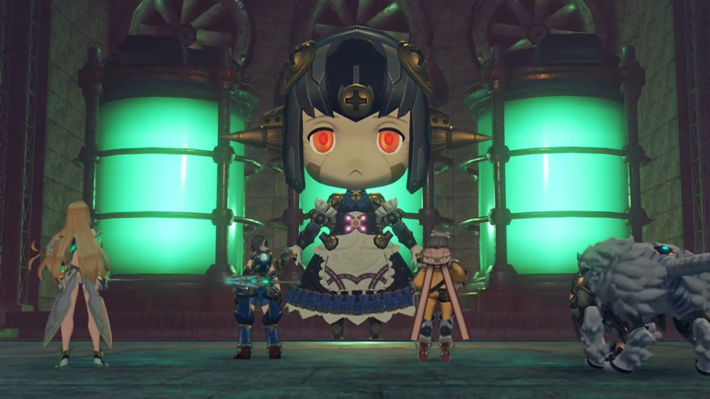

Nia jumped on her feet, panicked, "**Wh-wh-wh-wha-wha-what the hell is that?!!**"

The platform floated above the head of Rosa, the figures of Bana and Muimui was blurred by the orange translucent window panes, and Muimui shouted, "**ACTIVATEEEEE!!! Docking, complete!!!**" The platform extended its Tirkin-shaped wings before docking on Rosa's head, like a crown. 

Bana exclaimed full of excitement, "**WAHAHA-HAHAH-WAHAHAHAHAHAH!!! HOW YOU LIKE THAT?!!! THIS IS SECRET WEAPON BASED ON BLUE-PRINTS OF LILA, GIGANTIC ARTIFICIAL BLADE: ROSA! HAHAHAHH!!!**"

Dromarch was impressed, "You enlarged the design? **Incredible...**"{{footnote: As if big means more powerful...}}

"**HAHAHAH!!! NOW**, you all **BOW** before the **POWER** of Bana! **Go get them, RRRRRRROSA!!!**"

Rex commented, "Ugh... This is too ridiculous for words. Come on!"

---

"Urgh..."

Nia exclaimed, "It's too... strong for us..."

Dromarch suggested, "**Allow me! I shall serve as a decoy. And then-...**"

"No, Poppi will take care of that." Poppi and Tora entered the scene. Poppi's whole body was lit with light, energy too strong to mask. 

"Tora! Poppi!" Rex called out. 

Mythra noted, "**Poppi? This energy's incredible...!**"

"Thanks to my sister Lila...!"

> In the control room, as Lila was dying, she called out, "Masterpon... Profusest apologies- for letting them control Lila like that..."
> 
> Tora compared and complaint in his head, "_Lila show **much** more respect for Masterpon than Poppi do..._"
> 
> Tatazo shook his head, was grateful, "**No need** for apologies. **You come back, and that, enough for me.**"
> 
> Turning to Poppi, "Sister... Lila did- awful things."
> 
> Poppi shook her head, commented, "Poppi used to people doing awful things."
> 
> Tora fluttered in a panic, "Who Poppi mean by that?!" But she wasn't answering him. 
> 
> Lila continued, "Poppi, Lila has one more... request. We have- many- new sisters..."
> 
> Poppi understood her wishes, nodded firmly, "Poppi will save them. It is my duty."
> 
> Despite her facial emotions flat, she spoke flatly, "Lila happy. Now, Lila has one thing left to do... Poppi... Use Lila as starter, and..." She held out her other hand difficultly, electric leaking through her joints. Poppi grabbed hold of her hand, giving her strength. 
> 
> That reminded Tatazo, "**Ahhh, of course! Poppi's ether furnace... Using experimental ether furnace from Lila, it can be fully ignited!**"
> 
> "But then..." Poppi felt sad, hesitant. 
> 
> Tora asked, "Will Lila be all right doing thing like that?!"
> 
> "It least I can do..." and she started channeling the energy to Poppi, electric sparkles covering both their metallic body, "Use the flames of Lila's life... _to save them..._"

Tora called out, excited to see what new power she'd got, "**Nowwww, Poppi! Show them your reallll power!**"

"**Roger that, Masterpon!**" She throw her scarf and it swirled around her so fast it wrapped her in a scarf-ball. 

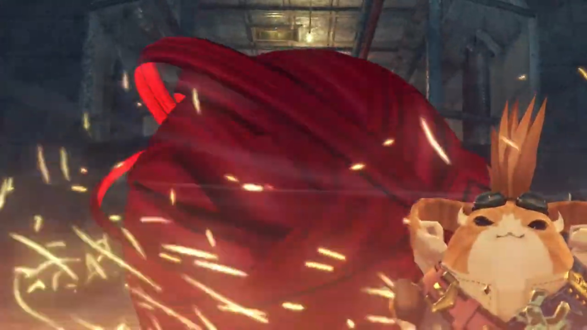

Within the ball, Poppi narrated, "Initiating QT Mode. Engage!" And she started transforming into a teenage girl. The group watched in awe as bright light released from the energy center. 

Muimui was flabbergasted, hypothesized, "**-C-can it be...?! She manage to fully activate... ether furnace!**"

Bana: "**WHAT?!!**" Bad news. 

Amidst fire and flames, burning through cloaks, she revealed herself, the brand new Poppi QT. 

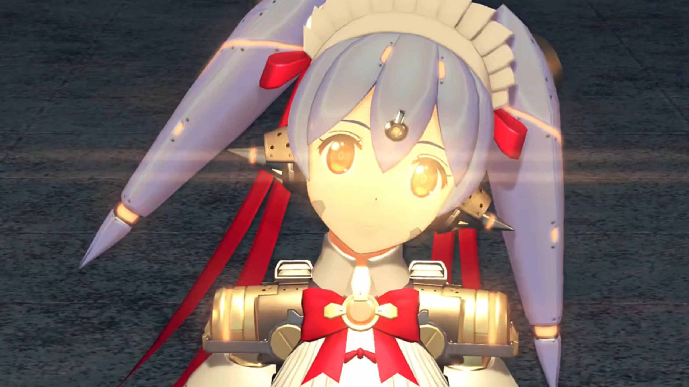

Bana don't believe, "**Meh meh! No matter how much power she have, she still no match for mighty creation of Bana!**" Aiming the crosshair at Poppi QT, he ordered, "**CRUSH HER, RRRRRROSA!!!**" Red light lit up, and Rosa prepared for another battle. 

---

Electric sparkled on Rosa's joints, and down it went, crashing on the ground. The docking port detached itself. The group sheathed the weapon, Tora announced, "**Hah! Justice always prevail!**"

"Masterpon, that **enough** gloating now." She turned to Rosa, thought, "Now, maybe you too- won't be used for bad things any more."

"**Ahhh!**" Nia's shout brought their attention to the docking port. Muimui laid unconscious, and "Bana's vanished again!"

Dromarch's eagle-sharp eye scanned the environment and located him, pointing with his claws, "**Over there, my lady!**" He had reaching for the factory's back entrance. 

Rex shouted out, "**Hold it!**" And all of them ran after him. 

---

They'd Bana surrounded at the ledge. The sea was just over the ledge, but he'd nowhere to run unless he jump, but he wouldn't have the time to as long as their attention were on him, "**Meh-meh-meh! You veeeeery persistent!**"

Rex urged, "**You need to learn when to quit!**"

And that is to "Stop producing artificial Blades! You used Grampypon's research for evil **long enough!**"

"B-**but that would MEAN FINANCIAL DISASTER!!!**" And that cannot be accepted. "**How much** you think I **poured** into this endeavor?!"

Rex then decided, "Ohhh, OK. We'll just hand you over to the Imperial Army, then. They'll be reaaaaally interested in all the stuff you had Lila doing. And I bet that's not all they could dig up on you, **is it?**"

"**URK!!!**" Time to play to feelings, "**Rex... I NEVER had** you down as such a **CONNIVING** boy."

"**Me?** Look who's talking!"

"All right. I stop production of artificial Blades." One'll be back for sure; if one escape today, one'll pay back the price you paid to one hundred-fold, thousand-fold! Just you wait. 

Tora and Rex childishly cheered, as if they'd won the war, as if he really meant it. 

Just then, a female voice interrupted from behind, "That Nopon is still of use to us... Do you really have to interfere?" The group turned around and saw the girl with her Blade, and another handsome guy coming up with his Blade. 

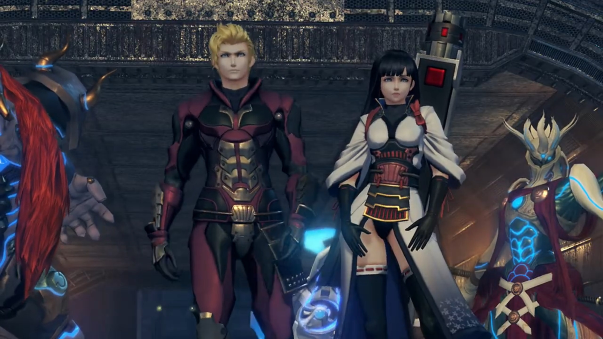

Nia recognized them on sight, "Patroka! Mikhail!"

Patroka was surprised, "Hm? Oh, if it isn't Nia. Akhos did mention you had turned traitor."

"Nia know these people?!" Tora hadn't yet joined the dots.{{footnote: That is, despite them mentioning Akhos, whom he should know by now but he don't use his brain enough.}}

"They're Drivers from Torna. **Of all the lowlifes Bana could have made a deal with...**" Why these two? 

Patroka heard the label she gave them, "Lowlifes? Coming from the traitorous rookie? You should watch your words..."

Mikhail put his arms around her, playboy-ly spoke, "Don't mind her, Patroka. Not when we are standing before the Aegis herself!" He gingerly walked like a female scared of getting dirty, gingerly danced like a pro in front of her, exclaimed, "Ah, truly the heavens must have blessed us that we- **ARRRRBURGGH!!**" Reaching near her, her volcano within can no longer hold, kissing his chin with her fist. 

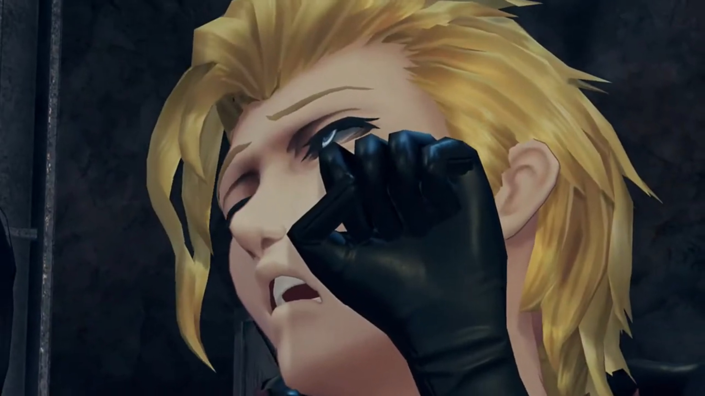

He cannot stop being an actor, dropped to the ground on purpose, while she who knew what he's doing, spit out, "Mik... Please, shut up."

"_'Kay._" He hobbled from behind her back to where his Blade stood. 

"The traitor, we kill. The Aegis, we retrieve. Got it? It's a pain, but that's the mission."

"_Roger_." Mikhail wielded dual huge metal fist, which had shields built-in on the outside. Patroka wielded a gun, but her Blade had 4 hands, wielding a sword, a hammer, a spear, and an unknown weapon, changing at will. 

Rex announced, "Mythra and Nia... They are my friends and comrades. I'm not letting you touch them!" And the battle began. 

---

While Mikhail was defending Rex's attacks, Patroka's blade came to his side and surprised him, "What?" He managed to dodge and "**ERRRRGGGHHH!!**" ran back towards them. Mythra was having the time to scan the environment while they fight, looking at the beams, the roof, the sky. 

Nia helped Rex, commented, "Ugh... These guys are tough! One's got weapons galore, the other's a master of defense. It's like taking on a small army."

Mythra had made up her decision, after lots of math going within her brain,  "Rex, I'm ready."

"**Seriously? We're inside a building here!**"

"I analyzed the structure integrity. It should survive one blow. But we'll... have to do it right beneath that crane. Anywhere else is too risky."

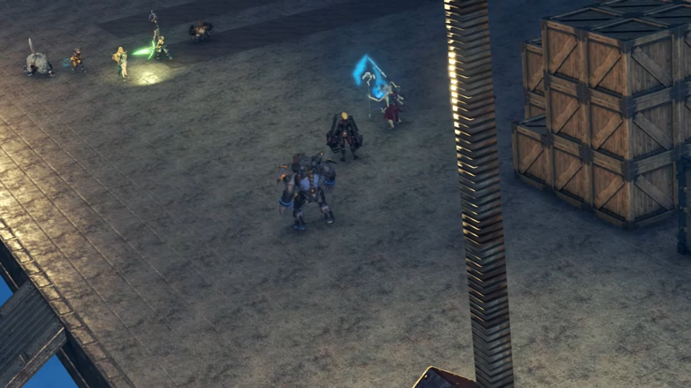

Rex agreed, "All right. Then let's force them over there. **Guys?**"

Nia: "All right, sounds like a plan."

Tora: "**Understood!**"

"**YEEEEAAHHHHHH!!!**" Rex dashed for Patroka's Blade. Nia went for Mikhail himself. 

"**HAH!**"

Patroka aimed her gun at them, asked them to "Just give up."

Before the fight continued further, some strong heat was scorching the left side of his body. Rex looked and immediately saw incoming blue flames, smearing the floor and raised a flaming wall in between them. Patroka was shocked, "**WHA-?! Blue flames?!**" Why the outlier now? 

Rex called out excitedly, "**Mòrag**", whom pointed her truncheon at them, accompanied by Brighid. 

"Honestly, Did you not say you wouldn't be reckless?"

"**Things got complicated. Thanks though!**" Mòrag slashed the flames she raised and extinguished it, once she got near Rex and the others. 

Patroka noted, "**The... Flamebringer...!**"

Mikhail got headache, "**As if we didn't have enough to deal with already!**"

Rex got near her and requested, "**Mòrag**, can you push them back towards that crane?"

"Do you actually have a plan, or is that too much to expect?"

"**Course! Have a little faith!**"

"Very well."

"**Let's go!**" Round 2.

---

Mikhail complaint, "Urk, I guess they don't call her the stronnnnngest Driver in the Empire for nothing."

"Let's surround them with a wall of flame." Mòrag invited. 

Rex understood what she meant, but was surprised, "**Brighid and Pyra together?!**"

Brighid pushed forward, no time to waste, "We will attack from the left. Can you take care of the right?"

Pyra took over and accepted, "All right, then! We'll try to match your timing!" And to Rex, "Then I'll switch to Mythra **right away!** Keep an eye on your sword's energy charge."

"Yeah, got ya!"

Mòrag: "**Here goes!**"

Mikhail saw what they're trying to do, felt they were asinine, "Jokers. **Trying to surround US?**"

"**HARRRRGGGGHHH!!!**" 

As Mikhail blocked Mòrag's flames, he mentioned, "**Not a chance!**" 

But she wasn't the only one he'd to deal with. Nia rode on Dromarch and got to the side, instructed, "**Dromarch! Wild Roar!**"

"**HARRGGH!!! FROM THE SIDE?!!**" The force pushed him to within the expected wall of flames. 

Patroka felt her ears doused with too much Mikhail's voice, "Ngh... **Try to focus, Mik! Wha?!**"

"Poppi! Jet Biter!" When did he and Poppi QT came to her left? 

"Roger that!"

"**Don't. Get. Cocky.**" She tried aiming her gun at them; but Poppi QT was faster. A bazooka launched the Jet Biter, immediately the bomb blasted, shaking the floor, pushing both her and Mikhail to beneath the crane. 

"**Now!**" ordered Mòrag, herself running towards them. 

"Right!"

"**Azure Striker, Form the Second: Radiance!**"

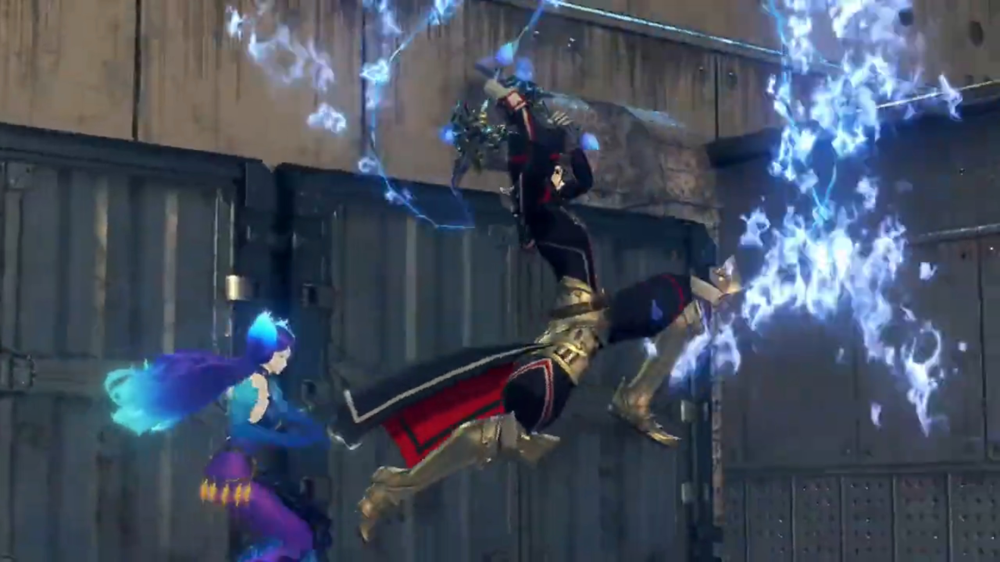

"**Rolling Smash!**" They were now surrounded by walls of flames. 

Patroka can't believe it, "We're surrounded?! Then we go up-... _huh_" Oh no. 

Mythra was floating high above, like an angel from the sky. The crystal on her head shone bright, the machine in outer space received her instruction. Mikhail focused on something else instead, "Sh-she's beautiful..." 

Feathers floated down, from where it came, we don't know. A huge beam strike from outer space, straight at them, "**ARRRRRRGGGGGHHHHH!!!**" The dusty wind blew strong, the group shielded their eyes. 

The dust ceded, Nia was flabbergasted,  "_No way... They're still standing after that...?!_"

Mòrag observed more clearly, "No... She calculated the _precise_ power output required. That's the Aegis for you. _Remarkable._"

Her words was true. Amidst panting and groaning in pain, their Blades disappeared, just like Obrona's, turning back into a Core Crystal. Nia now "I get it. You were aiming for their Blades' Cores!"

Tora and Poppi came dashing after them, "**Bad guys all beat up too!**"

Their weapons had disappeared. Patroka looked over her shoulder where her Blade should've stood, no more. She looked back at her weapon, and it's disappearing before her. She reached out for it, the feelings she'd for it; now it's gone, her possession, before her eyes. The volcano in her chest came active, exploded, "Why... **Why, you...! YOU PIECES OF TRASH!!! HOW DARE YOU DESTROY MY BELOVED WEAPON?! I'LL TEAR YOU ALL TO PIECES!!!**" Even without a Blade, she stood yet again. Mythra landed back beside Rex, wondered what can she do next, "**I'LL SLAUGHTER YOU ALL!!! I'LL SHRED YOU WHERE YOU STAND!!!**" And some demonic power released from within her, engulfed her, the shockwaves it sent blew strong at the group. 

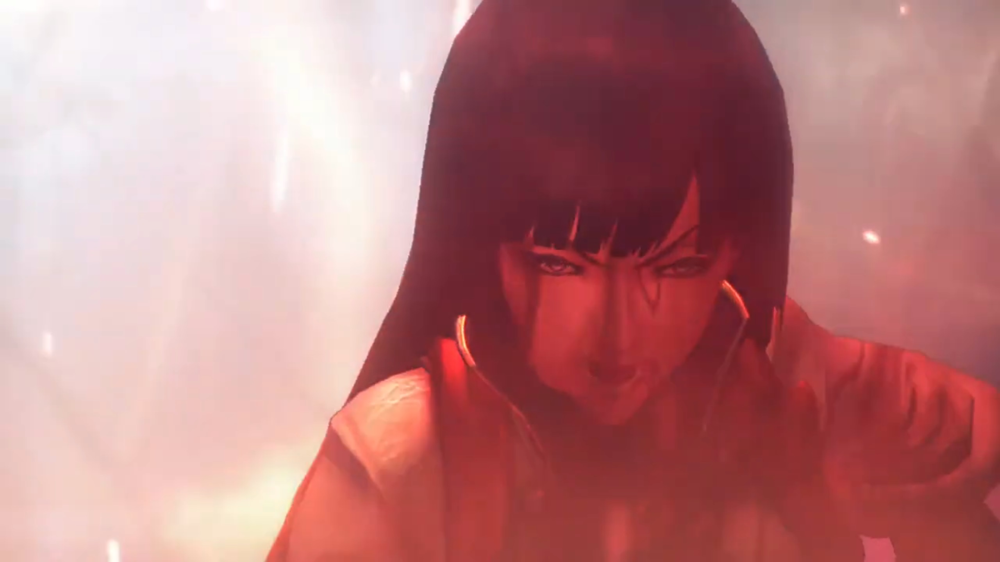

Mikhail called out, "**Stop! You can't use that here, Patroka!**" Is she out of her mind? Oh, she probably was. 

Mòrag felt "Such immense power...! **Just who is this girl?!**" She prepared to fight, but Brighid noticed something else, stopped her. 

"**Hold on a moment!** Something isn't right!" Her 6th sense tried to pinpoint what exactly was not right. 

Slowly by slowly, Patroka move forward, when suddenly, "**Urghuh!**" Some blue-ish power casted on her extinguished her power, as she exclaimed, "_My body... it won't..._"

Mikhail dashed towards her quick, "**You all right, Patroka?! URGGGHHHH!!!** This power... could it be..?!" He recognized this power, something he'd seen from 500 years ago, when he was still a child. 

He looked behind the group and saw a girl taking a staff, casting her field power that neutralizes everything. Patroka difficultly looked up, and Nia watched as she passed through the group with slow steps, not looking at them. Rex wondered, "Who's that?"

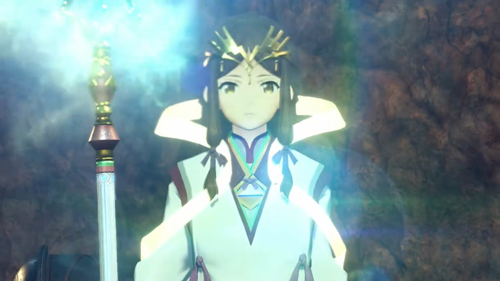

Mikhail found the source he needed, some old friend of his indeed, commented calmly, "So that's what's going on. That piece of Indoline **scum!**"

Patroka felt angry, "**D-d-did you say Indol?!**"

Mikhail announced, "**We're outmatched. LET'S GET OUT of here!**"

Patroka felt unsatisfied. Why, at every last moment that they almost win, someone new would come out and blocked their way? And now she lost not only Bana but her favorite Blade's weapon as well... "**Like hell I will! I'm not done killing them yet!**" But she can't even get off the ground. 

"We already got what we came for." Mikhail's not even trying to help her up. "And if anything were to happen to you _huh_, how could I possibly face Akhos, huh?"

Then, he grabbed her waist and carried her by his side. She struggled to no avail, "Let me **GOOOOO!!! This is why I can't stand you, YOU KNOW!!!**"

He turned around, not obeying her, and walked away, busy with his mouth, "Yeah yeah. You can give me a proper scolding later."

"**YOU'RE NOT GETTING AWAY!!!**" Mòrag dashed quickly to them. Just then, the Monoceros floated from below the cloud sea to the edge of where they stood, a loading port, and Mikhail jumped high. "**Wha-?!!**"

Rex recognized, "**That ship!**"

Nia: "**The Monoceros! It was right there?!**" 

At the top of the Monoceros, Mikhail waved back at the group, till next time! And he aimed the cannon at Mòrag, "Orgh!" She ate some face-to-face shots. 

Rex: "**Mòrag!**" He and Brighid quickly dashed to her as reinforcements. She was unscathed relatively. 

"**Lady Mòrag!**"

"Do not worry. It'll take more than that- to dispatch me." But the submarine had gone, dived back into the ocean. "_They got away._" 

Mythra quickly joined Rex, and the Indol girl slowly walked towards them, not changing the calming pace of her footsteps. Mòrag recognized who she is, walked up towards her, called out, "Fan la Norne..."

Brighid asked, "Goddess of the Praetorium... To what do we owe this pleasure?"

"Did you say Fan...?" That brought Mythra back in her memories from 500 years ago. The girl's Core Crystal was a diamond, but it only had its upper half attached. She stopped in front of Rex and gave him a thin smile; for her face, always doused with sadness, the smile was rare. 

---

Jin was walking alone in the room consisting, beside the main path, cabinet upon cabinet of Core Crystals. There in the middle of the room was an ice crystal, freezing a girl within. All that he had done, is for her, "It won't be long now... Lora..."

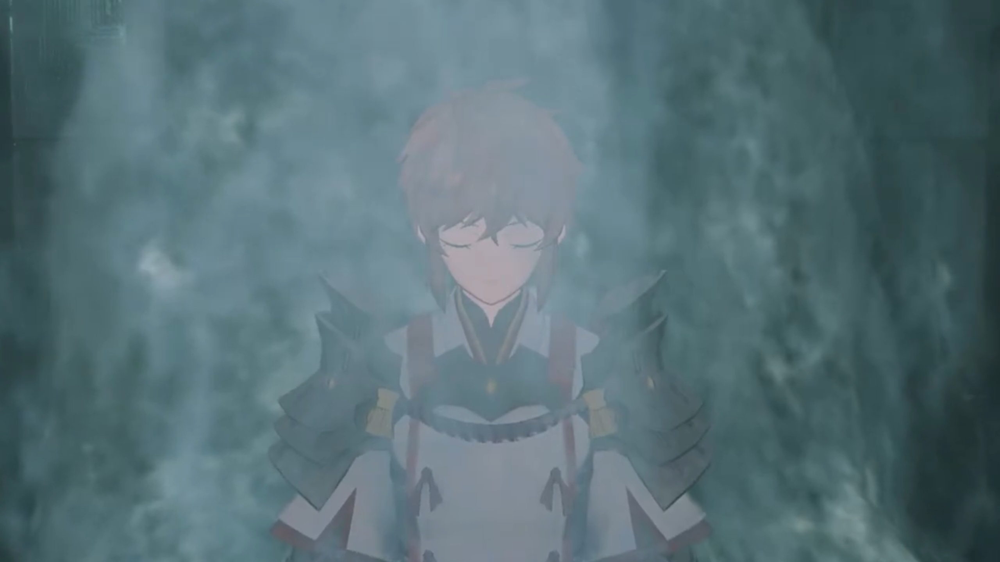

### Footnotes: