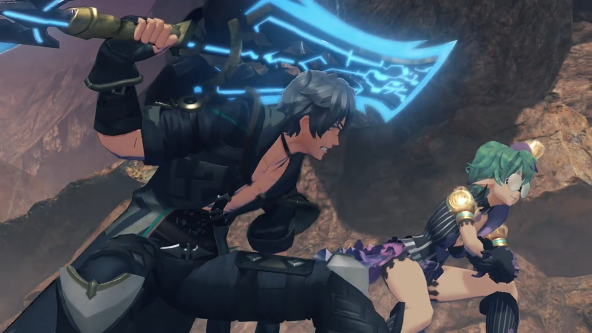

# One-Eyed Monster, Confrontation at the Factory

Trekking their way to the factory, they were walking beside some cliff walls when suddenly, some laughters echoed, "**AH HAHAHAHAHAH!!!**" Searching for its source, they didn't wait long before Zeke and Pandoria revealed themselves. "So we meet again, Aegis!" He tilted his head higher and looked at the group over his nose. 

Nia exclaimed, "Oh. It's Shellhead."

He answered too quickly, "Yes. **WAIT, WHO'S 'SHELLHEAD'?!!!**"

Dromarch commented, "_As ever_, your comic timing is exquisite."

"**URGH! YOU WILL ADDRESS ME AS ZEKE VON GENBU, BRINGER OF CHAOS!!!**" He slashed his swords at them, strongly showing how determinant he was. Though, his sword was a little too long, and Pandoria had to tilt a little more to prevent being 'accidentally' struck by it. "**OR ZEKE!** Or **THE ZEKENATOR!!!**"

Nia was too tired, "Make your mind up. And what the hell is a Zekenator, anyway?"

He's not answering, "Hah! You may have been lucky last time, thanks to a certain- _unstable cliff_. But **this time round**, we meet on good olddddd- terra- firma!" They stepped on the ground hard several time, each time moving their feet forward and bent lower; while he continued raining saliva at them, pushing his lungs to its limit of not stopping to breath midsentence. 

Zeke continued, "If you think you can run from me a **second time**, you are **Quite. Mistaken!**"

Nia: "Nobody did any running... And anyway, Shellhead?"

"What?"

Pandoria facepalmed herself, wondered, "You answer to that now?"

Nia continued, "I've been wondering for a while now... but, what's with the cutesy eyepatch?" She pointed at his pirate-eyepatch. 

"Heh! I'm quite glad you asked. This eyepatch conceals a power too great for mere mortals to comprehend. **The Eyeeee- of SHINING JUSTICE!!!**" He stared at them with his other eye, deliberately not noticing all of them had been very impatient with his speech, "I am sworn to keep it sealed until its power is needed to save mankind. You should count yourself lucky. It would turn you to ash in seconds!"

Nia don't believe his blunders, "Whatever you say, pal."

Pandoria stepped forward to try denying, "He definitely **isn't** wearing it because he didn't have the gold... for a second contact- lens."

Nia shot back at them, "How poor are you?! And are you THAT short-sighted?!"

Dromarch wanted to get to the main point, "By the by, what business might you have with us today?"

Zeke can't believe they didn't yet knew, "Are you thick? I'm here for the **Aegis, obviously!**" He pointed his sword at Mythra. She looked over the side of her eyes, and head tilted away again, eyes closed, too tsundere. 

Nia tried to convince him, "Listen, pal. I'm sorry, but we **really don't have time** to play with you today. So hurry on home, OK?" And she shooed him, her arms wavered strongly like swatting flies away from bothering you. 

"W-what's this? W-were you so **frightened** by our power, that you wet yourself, **furry-ears?**"

She was incited, "**Did I WHAT? YOU'VE GOT A LOT OF NERVE, YOU ONE-EYED MONSTER!!!**"

The way she spat out 'One-Eyed Monster' blindmindedly triggered those who knew its indirect meaning -- Rex, Mythra, and Dromarch. Mythra felt her face red hot, while the other two gasped. 

Rex tried to get to her, "**N-Nia? You do know 'one-eyed monster' usually means...**" He got closer to her, tried to speak in her ears. But she was currently in a fury, shot back at him, 

"**Huh?! Means what?!**"

He backed away at such aggressiveness, "Um... It's, ah..." Explaining it in public loudly, are you serious? Blood rushed up his face as he tried to find a better word, or perhaps, furiously looking around to find something to change the topic, until he saw her, "Mythra, why are you blushing?"

She deliberately looked away to not let them see; he deliberately went around to look clearly at her face. Even Gramps stick his body out of the helmet more.{{footnote: All the while Poppi was so blank watching their interaction.}} She turned her blushed face at him, against all odds, and Gramps already knew what would happen next. A strong hand swing hard on his cheek, and "**Shut up!**" 

And the battle begins.

---

A lot of force brought Zeke dragging along the dusty terra firma before he came to a halt. Already tired, "(pant pant pant)... You guys are *even tougher than last time!*" He fell backward, and Pandoria caught him on time. He retained his pose despite feeling effete, and his mouth never stop taking advantage of the group, "However, your **luck** ends **right here.**" With a grim, he summoned whatever energy left within him, released huge amount of electricity on his sword, "**HERE WE GO!!! HIYAH!!!**" The strong lightning power sent electric sparkles at the group as they shield themselves from the numbness. "**BRINGER OF CHAOS!!! ULTIMATE LIGHTNING FURY SLASH... MAXXXXXXX!!!**"

Once again, it missed the group, created a symbol on the ground in front of them. Aside from the electric sparkles, it did them no damage. Black smoke and thick dust did obscured their view, though, as they shielded their eyes and nose and mouth. 

Nia couldn't believe it, "**COME ON!!! THAT WAS THE SAME AS LAST TIME!!!**" How bad is your accuracy? 

He slowly tilted his head up, grinned regardless, "Hah!" And like last time, the terra firma started shaking. The group tried finding the source, when Mythra spotted something up on the cliff wall. 

"Urrrr..." 

"Huh?" Following her view, he looked, and a giant boulder stuck to the top of the cliff at a delicate balance, started shaking off the ground that held it, destroying the balance. Slowly but surely, the boulder started rolling and tumbled down, 

"**AAAAAAAHHHHHHHH!!**" Screaming, the immediately turned around and ran as fast as they could, hoping to reach the Cloud Sea not far in front before being caught up by it. With full force and largest stride, their will to stay alive pumped their adrenaline to its max; but how could their velocity be compared to a giant boulder pulled by gravity? 

"**P-Pandy! Can't you do something?!**"

"**Sorrysorrysorry!!! You know my element's lightning! I'm not cut out for this!**" Just a little more, the Cloud Sea was just beyond. 

Zeke turned around, "Umph!", puffed out whatever energy he had within him to rush for the cliff, but just a step before, the boulder caught up with them and sent them blasting into the air beyond. "**ARRRRRRRGGGGGGHHHH!!!**" And that's the legend of the One-Eyed Monster! 

Rex can't believe it, "**S...seriously, though, what's their problem?**"

Nia sighed, "Ugh. What idiots. C'mon!" And they walked past, not sparing another second thinking about him. 

---

===

Ether cylinders were packing at the factory, and other metallic artificial Blade's 'standard body' were being manufactured in huge quantities on the conveyor belt. Bana, accompanied by Muimui, standing atop the balcony of their office building, overwatched the factory's process, felt proud of kaching kaching kaching coming in. 

Bana exclaimed, "Now this... quite the sight."

Muimui reported, "Production has been running non-stop, 24 hours a day!"

"Muimui... Once we have first thousand ether furnaces, we sell them to Torna."

He was confused by his decision, "Eh? Mehmeh? But I thought this project funded by Roderich, from Imperial Senate. Was it not Senator- who gave us info on Core Chips for Lila to steal, too?"

Bana, whom loomed over him like a giant potato bag, refused to let anything but money changing his mind, "**That make** no difference. **We go**- where profit goes. **Old geezer** can wait a bit longer for his turn. Once war break out with Uraya, **he get desperate and offer more MONEY!**"

Muimui was idolized by his intelligence, "**Chairman Bana so amaaaaazing!** Did not realize thinking about this was so deep."

He was prided with such flattery, "**MEHEHEHEHAHAHAH!!! FIRST rule** of making money."

---

The **Abandoned Factory** was not so abandoned, eh? With full scale artificial Blade and ether furnace making, everything was running at full speed. The group sneaked inside the factory and found the sight worrying. An abandoned factory clearly should not have such activity levels. Rex questioned, "Are all of these artificial Blades...?"

Tora worries came true, "_Then- Dadapon really_ **must be...**" He looked around, hoping to see the figure he'd hoped to return to him for long; but could not yet find. 

Gramps wondered, "Hmmm... What exactly are they planning here? Well, whatever it is, it can't be good..." And they set off for the deactivated lift. They cannot pass through, therefore, they had to find another way down. 

---

The group was looking over an air vent on the ceiling of a room. Below was a Tirkin talking to Tora's Dadapon. The Tirkin spoke without respect, "Professor Tatazo! Speak, speak, you give orders! If production get more slow, _maybe you ready for sleep time with fishes..._"

"**Reduce load on neural circuits by 20%. That should improve production efficiency!**"

"_See? It not so hard._" The tirkin got what he needed, turned away and exit the control room. 

On the air vent, Rex heard what the tirkin called him, asked, "Hey! Isn't that. Huh?" Tora was nowhere to be seen. 

Tatazo was going elsewhere when Tora dropped with a thud on the ground. His worries overwhelmed his logic, to come across his beloved Dadapon once again. Even after he grew up a lot, Tatazo recognized, "Ah! _Could it be..._ **Tora, that you?**"

"_You_ really Dadapon Tatazo?"

"**TORAAAAA!!!**" 

"_Dadapon!_" And they came to embrace each other, hugging and crying. "_Tora miss you so much!_"

"_I miss you too!_" The group dropped down behind them. 

Rex felt heartwarming rushed over him, helping someone to find someone they beloved and get together again, "Ahhhh, that's great."

"Hrrrr hrrrrrhhhhh..." The sound wasn't coming from in front? Rex searched for whoever was snuffing tears from falling down his/her eyes when he caught Mythra, took out a towel from his pocket and handed it to her. 

"Thanks..." She did not retain her tsundere this time. 

"Who all these people?" Tatazo had rejoiced enough with his son for now that he'd attention for the others. 

"They Tora's sidekicks... I mean, sidek- I mean new friends!" Huh, spoke your inner voices, huh? That's what you really want us to be? Or are you wanting to please your dad so much? 

"**Wonderful!** They come here for you? **You have good friends.**" Eyeing one by one, Poppi caught his eyes, "_Oh! That artificial Blade..._"

Tora introduced, "This is Poppi! Tora make her by improving on blueprints for Lila!" Stuck his nose high, waiting for praises to shower him. 

His dad was pleased, "**MEH MEH!!! Most impressive. Tora MUST have worked hard!**"

Dromarch couldn't let this continue, disturbed their reunion with reality, speaking bluntly, "If I may, I know there is a lot of catching up to do, but perhaps we should escape!"

Gramps agreed with pot-met-kettle, "A very good point. Come on, Rex!"

"Right!"

"**Not so fast, intruders!**" Too late. Muimui had came back with various tirkins. 

"**Muimui!**" Dromarch was surprised. 

Nia: "**Don't tell me...?!**"

"Really, now? You actually not realize it yet? Muimui give you information **on purpose**, to lure you to factory. _If we not want you here_, **you would never find this place so easily!**"

Tora felt angered, took out his drill and pointed at him, "**Meh meh! HOW DARE YOU!!!**"

"Masterpon is really angry." noted Poppi.

Muimui had his target, "Meh... Finally I have chance to seize precious artificial Blade. **Now! Take care of these intruders!**" And he walked aside and let the tirkins deal with the fighting. 

---

All tirkins dropped to the floor and burned to ashes. Muimui was standing by the escape hatch, shuddering, "_H-h-how can you be so strong...?!!!_" The first time he wondered whether his greed was justified. 

Nia: "Now we're gonna need some answers. What were you people plotting here?"

He tried to pull himself out of the chain, "_O-ordinary business! We **innocently** mass-produce ether furnaces and artificial Blades, and sell to people who want them!_"

Dadapon had something to add in the story, "They threaten Tatazo, and force to participate in production process..."

"_Dadapon..._" Tora can feel how much torture his dadapon had gone through, felt heartbreaking for him. 

Gramps didn't forget, "And next you want to **get your hands on Poppi?** You are a **greedy** bunch."

"**I knew as soon as I saw her!** That artificial Blade uses lost ether furnace designed by Professor Soosoo! _That is why..._"

Tatazo agreed, "**You quite right! Even I could NEVER make such incredible furnace** as my own dadapon."

Nia concluded, "So you lured us out here to avoid making a ruckus in the city, is that it?"

"_Qu-quite right, yes..._" His voice died down. 

Tatazo revealed instead, "Muimui was part of group plotting to **steal artificial Blades all along.** While he my Dadapon's assistant, **he sell information to contact in Guild and had THEM attack laboratory!**"

Tora was surprised, "What?! Then- it all his fault that **Grampypon was killed?!**"

"Indeed **it was.**"

Rex: "A contact in the Guild... Could it be that the one behind all this is..."

"**Indeed! It is I.**{{footnote: Such arrogance to use 'I' here. That's why you should use 'one' to refer to yourself than 'I', to signify you're just one of the many and not as unique as you thought you are. Plus, for a nopon, that always refer to themselves by calling their names, to use 'I'? How arrogant.}}"His hypothesis had came true. The door behind Muimui opened and Bana came out of it, followed by Lila. 

Muimui was relief to see his savior here, "**M-M-Master Bana!!!**"

Immediately he scolded him, "**You never do** finish job properly, do you?! You manage to lure them alllll this way, **AND THEN FAIL TO CAPTURE THEM?!!!!**"

"_Muimui very sorryyyy..._" He could only bow than deny and get smacked even worse. 

"But I am **nice** Nopon." says he turning back to the group. His eyes first laid on Mythra. "**You brought not** only artificial Blade to me, but even the Aegis itself! _Once I have ether furnace of Professor Soosoo, I can produce_ even **better** artificial Blades, _and make a killing!_ **Then** I sell **Aegis too AND MAKE MOUNTAINSSS OF CASH!!! THEN I CAN FEAST- ON MUSHY MUSHROOMS** for life!!!" He was already high on drugs by daydreaming. 

Rex: "**Chairman- Bana!** I can't believe you would stoop to this!"

"You should show more respect, after all the **valuable** work I find for you."

Nia had questions, "So, who are you planning to sell the Aegis to, anyway? **Torna**, I suppose?!"

"**How you know** about Torna?!" He looked closely at her, realized, "**Wait**, I remember you! **You one of Torna's Drivers!** Wh-wh-wh-wh-**what you doing here?!**" He started panicking. The mere name of Torna and the power it held scared him to death. "If you come for ether furnaces, **they ready in SHIP outside.**"

Nia jumped on her feet, "What?! **You're selling THOSE to Torna as well?!**"

He was confused, "Not sure what is going on, but- I will **just**- beat you all up. **LILA! TAKE THEM ALL DOWN!!!**"

"Mission acknowledged. Commencing. combat." She powered her boosters and dropped to the ledge below, prepared for battle. 

Tatazo called out, "**Tora, please destroy her for me.** Muimui modified her so she not even **listen** to Masterpon Tatazo **any more!**"

"_Dadapon... All right!_ **Come on, Poppi!**"

"As you wish, Masterpon!" And the battle begins. 

---

Both Poppi and Lila activated their rocket boosters and fighting on air melee. The others, not knowing how to fly, can't help much. Tora got to the edge of the control room, shouted, "**Do not let her win, Poppi!**"

"Of course, Masterpon!"

Lila explained while they fought, "Comprehension error. Your integrated ether furnace- is not- fully activated. As an updated model, my energy throughput is... superior."

Poppi rebutted, "Energy efficiency **not** the problem here. Poppi's masterpon told Poppi **not** to lose. So Poppi will win. Very simple logic." She channeled more energy to her rocket boosters and brought Lila up to the ceiling. 

"Comprehension error." She changed posture and they fought again. 

Poppi concluded, "And that is why you are failure." She flipped a few times and vaulted Lila into the Control Room; the group ducked as she broke through the glass windows and landed within. 

Tatazo: "**Lila!**" Poppi floated outside to assess if she still had fighting abilities, while the others waited for the smoke to die out. Electric sparkles in her joints, she had difficulty moving her joints, what says continue fighting. 

"**Do it, Poppi! One more attack and she down!**" urged Tora. Poppi therefore aimed the giant drill at her. 

"**W-WAIT!!!**" Tatazo shouted. "**Wait one moment, please!**" He got herself in between the incoming Poppi and Lila. Poppi saw she's to drill through Tatazo, quickly reverted and pulled the hammer with reverse thrust. It stopped just about 1cm before drilling through Tatazo. 

"_D-Dadapon?_" Tora was confused. 

"I sorry, Tora. Even if she no longer listen to me... **Even if she become weapon** for evil... **Lila! Lila is all I have. Only reminder of Dadapon Soosoo. SHE is my treasure...**"

A blink came within Lila as she failed to understand, "Comprehension... error..."

Bana was the one getting fumed, "**What you think you are doing?!**" He flickered the remote controlled of Lila to force her to continue fighting. Bright lightning beam emitted from Lila as he disengaged any failsafe checks, pushing her output to max. Bana exclaimed, "**No need to bother protecting yourself! STEAL THAT ETHER FURNACE EVEN IF IT DESTROYS YOU!!!**" With wobbling feet, she struggled to control the great amount of energy within her. 

"Li...la...is..."

"**You not need to listen to his orders, Lila!**"

"**HURRY AND TAKE IT!!!**" He pressed one more button on the remote control.  Muimui nodded. Yes, that's it. That's what he wanted. 

As she put heavy steps forward, smoke bellowing from her joints, she exclaimed, "Lila's... Masterpon... is..." Rex eyed Mythra to get ready, Nia read their interactions, prepared herself. "Lila's Masterpon... is Professor Soosoo... and... Professor..." She raised her hand up high into the air, "Tatazo." Before she stuck her hand into her body and pulled out the control panel, destroying it. 

Bana couldn't believe it, "**WHAT?!!! SHE DESTROY CONTROL DEVICE ON HER OWN?!!! MEHMEH!!!**" The remote control he's holding burst into smokes. 

Lila fell down on her joints as she was collapsing. Poppi quickly went up and supported her. Tatazo and Tora went after her. "I very proud of you... sister."

"Poppi..."

Tora: "Poppi... Lila..."

Bana and Muimui was backing to the door, he still couldn't believe it, "**THIS NOT HOW IT SUPPOSED TO GO!!!**"

"Bana!" Muimui shouted as Bana grabbed him by his ears/wings, questioned, 

"**WHAT HAPPENED TO ACTIVATION OF ROSA?!!!**"

"She ready when you are!"

He quickly dropped him and ran off, "**GOOD! DO IT!!!**"

"Yessir!" Together, they ran to the side where there was a tunnel, "Hup!" Jumped off before the others could react, and slid a long distance until they reached a platform where 2 seats had been readied for them. The platform was jetted upwards at the speed of sound, entered a dome room, and they started the activation controls. The platform quickly moved itself along the prefixed conveyor belts. 

Rex was looking around, wondered, "Where did they go?"

Nia suggested, "Rex, let's find 'em!"

"**Tora! Poppi!** You take care of Professor and Lila! We'll take down those scoundrels!"

---

They scourge everywhere in the factory for their whereabouts, until they passed through some giant doors and metallic grounds they still hadn't find them. Rex: "Where's Bana? **Where did he go?**"

He needn't wait long before the ground started shaking. Gramps was the first panicking, "**Wh...wha-wha-wha...what's all this shaking?!**"

Overhead, the platform flew past the group as the speaker amplified Bana and Muimui's voice from within, "**NOPONNNNN GOOOOOO!!!**" The meter-thick ground in front of the group opened up, and as the lift within worked itself, a giant robot came out in front of the 3 giant ether tanks. 

Nia jumped on her feet, panicked, "**Wh-wh-wh-wha-wha-what the hell is that?!!**"

The platform, its rocket booster had floated above Rosa, the figures of Bana and Muimui was blurred by the orange translucent window panes, but they heard Muimui shouted, "**ACTIVATEEEEE!!! Docking, complete!!!**" The platform, with wings the shape of Tirkin wings, docked onto Rosa's head. Giga Rosa was therefore activated. 

Bana exclaimed full of excitement, "**WAHAHA-HAHAH-WAHAHAHAHAHAH!!! HOW YOU LIKE THAT?!!! THIS IS SECRET WEAPON BASED ON BLUE-PRINTS OF LILA, GIGANTIC ARTIFICIAL BLADE: ROSA! HAHAHAHH!!!**"

Dromarch was impressed, "You enlarged the design? **Incredible...**"{{footnote: As if big means more powerful...}}

"**HAHAHAH!!! NOW**, you all **BOW** before the **POWER** of Bana! **Go get them, RRRRRRROSA!!!**"

Rex commented, "Ugh... This is too ridiculous for words. Come on!"

---

"Urgh..."

Nia exclaimed, "It's too... strong for us..."

Dromarch suggested, "**Allow me! I shall serve as a decoy. And then-...**"

"No, Poppi will take care of that." From behind walked Poppi and Tora. Poppi's whole body was lit with light, as if energy too strong to mask. 

"Tora! Poppi!" Rex called out. 

Mythra noted, "**Poppi? This energy's incredible...!**"

"Thanks to my sister Lila...!"

> In the control room, as Lila was dying, she called out, "Masterpon... Profusest apologies- for letting them control Lila like that..."
> 
> Tora noted and complaint within his thoughts, "_Lila show **much** more respect for Masterpon than Poppi do..._"
> 
> Tatazo shook his head, was grateful, "**No need** for apologies. **You come back, and that, enough for me.**"
> 
> Turning to Poppi, "Sister... Lila did- awful things."
> 
> Poppi shook her head, commented, "Poppi used to people doing awful things."
> 
> Tora fluttered in a panic, "Who Poppi mean by that?!" But she wasn't answering to him. 
> 
> Lila continued, "Poppi, Lila has one more... request. We have- many- new sisters..."
> 
> Poppi understood her wishes, nodded firmly, "Poppi will save them. It is my duty."
> 
> Despite her facial emotions flat, she spoke flatly, "Lila happy. Now, Lila has one thing left to do... Poppi... Use Lila as starter, and..." She held out her other hand difficultly, electric leaking through her joints. Poppi grabbed hold of her hand, giving her strength. 
> 
> That reminded Tatazo, "**Ahhh, of course! Poppi's ether furnace... Using experimental ether furnace from Lila, it can be fully ignited!**"
> 
> "But then..." Poppi felt sad, was hesitant. 
> 
> Tora asked, "Will Lila be all right doing thing like that?!"
> 
> "It least I can do..." and she started channeling the energy to Poppi, electric sparkles covering both their metallic body, "Use the flames of Lila's life... _to save them..._"

Tora called out, excited to see what new power she'd got, "**Nowwww, Poppi! Show them your reallll power!**"

"**Roger that, Masterpon!**" She throw her scarf that turned so fast it wrapped her into a ball. 

Within the ball, Poppi narrated, "Initiating QT Mode. Engage!" And she started transforming into a teenage girl. The group watched in awe as bright light released from the energy center. 

Muimui was flabbergasted, "**-C-can it be...?! She manage to fully activate... ether furnace!**"

Bana: "**WHAT?!!**" Bad news. 

Amidst fire and flames, burning through cloaks, she revealed herself, the brand new Poppi QT. 

Bana don't believe, "**Meh meh! No matter how much power she have, she still no match for mighty creation of Bana!**" Aiming the crosshair at Poppi QT, he ordered, "**CRUSH HER, RRRRRROSA!!!**" Red light lit up, and Rosa prepared for another battle. 

---

Electric sparkled on Rosa's joints as it crashed to the ground. The docking port fell off Rosa's head and crashed to the ground. The group sheathed the weapon, Tora announced, "**Hah! Justice always prevail!**"

"Masterpon, that **enough** gloating now." Looking at Rosa for long, Poppi thought, "Now, maybe you too- won't be used for bad things any more."

"**Ahhh!**" Nia shouted, bringing their attention to the docking port. Only Muimui's body laid unconscious there. "Bana's vanished again!"

Dromarch's eagle-sharp eye picked him out of the background, pointed with his claws, "**Over there, my lady!**" He had been running for the factory's back entrance. 

Rex shouted out, "**Hold it!**" And all of them ran after him. 

---

They'd Bana surrounded at the ledge; it was sea facing, and he had nowhere left to run. "**Meh-meh-meh! You veeeeery persistent!**"

Rex urged, "**You need to learn when to quit!**"

And that is to "Stop producing artificial Blades! You used Grampypon's research for evil **long enough!**"

"B-**but that would MEAN FINANCIAL DISASTER!!!**" And that cannot be accepted. "**How much** you think I **poured** into this endeavor?!"

Rex then decided, "Ohhh, OK. We'll just hand you over to the Imperial Army, then. They'll be reaaaaally interested in all the stuff you had Lila doing. And I bet that's not all they could dig up on you, **is it?**"

"**URK!!!**" Time to play to feelings, "**Rex... I NEVER had** you down as such a **CONNIVING** boy."

"**Me?** Look who's talking!"

"All right. I stop production of artificial Blades." Heh. let one escape today, you'll eat back what you'd done to me in the long future ahead. Just you wait. 

Tora and Rex childishly cheered, as if they'd won the war. 

Just than, a female voice spoke behind, "That Nopon is still of use to us... Do you really have to interfere?" The group turned around and saw the girl with her Blade, and another handsome guy coming up with his Blade. 

Nia recognized them on sight, "Patroka! Mikhail!"

Patroka was surprised, "Hm? Oh, if it isn't Nia. Akhos did mention you had turned traitor."

"Nia know these people?!" Tora hadn't yet joined the dots.{{footnote: That is, despite them mentioning Akhos, whom he should know by now but he don't use his brain enough.}}

"They're Drivers from Torna. **Of all the lowlifes Bana could have made a deal with...**" Why these two? 

Patroka heard the label she gave them, "Lowlifes? Coming from the traitorous rookie? You should watch your words..."

Mikhail put his arms around her, urged, "Don't mind her, Patroka. Not when we are standing before the Aegis herself!" He gingerly walked like a female scared of getting dirty, gingerly danced to her front, like a pro dancer. "Ah, truly the heavens must have blessed us that we- **ARRRRBURGGH!!**" Once again he put his hands around her shoulder, and he deserved a hard fist kissing his face. 

As he dropped to the ground, mostly from his actor traits, Patroka spit out, "Mik... Please, shut up."

"_'Kay._" He hobbled from behind her back to where his Blade stood. 

"The traitor, we kill. The Aegis, we retrieve. Got it? It's a pain, but that's the mission."

"_Roger_." Mikhail wielded dual huge metal fist, which had shields built-in on the outside. Patroka wielded various weapons, changing at will. 

Rex announced, "Mythra and Nia... They are my friends and comrades. I'm not letting you touch them!" And the battle began. 

---

While Mikhail was defending Rex, Patroka's blade came to his side and surprised him, "What?" He managed to dodge and "**ERRRRGGGHHH!!**" running back towards them. Mythra was standing there herself, not doing anything, looking up at the sky, the roof that blocked her access to the sky. Nia joined in the fight. "Ugh... These guys are tough!"

Nia shared, "One's got weapons galore, the other's a master of defense. It's like taking on a small army."

Mythra, despite the rocks that roofed them, made up her decision, "Rex, I'm ready."

"**Seriously? We're inside a building here!**"

"I analyzed the structure integrity. It should survive one blow. But we'll... have to do it right beneath that crane. Anywhere else is too risky."

Rex agreed, "All right. Then let's force them over there. **Guys?**"

Nia: "All right, sounds like a plan."

Tora: "**Understood!**"

"**YEEEEAAHHHHHH!!!**" Rex dashed for Patroka's Blade, which had 4 hands wielding sword, hammer, spear, and one unknown weapon. Nia went for Mikhail himself. 

"**HAH!**"

Patroka aimed her gun at them, asked them to "Just give up."

Suddenly, Rex felt some power coming from the left. Blue flames smeared the floor and raised a wall in between them. Patroka was shocked, "**WHA-?! Blue flames?!**" Just when they're to succeed?

Rex exclaimed, "**Mòrag**" pointed her truncheon at them, accompanied by Brighid. 

"Honestly, Did you not say you wouldn't be reckless?"

"**Things got complicated. Thanks though!**" Mòrag slashed at her flames and extinguished it out. 

Patroka: "**The... Flamebringer...!**"

Mikhail got headache, "**As if we didn't have enough to deal with already!**"

Rex got near her and requested, "**Mòrag**, can you push them back towards that crane?"

"Do you actually have a plan, or is that too much to expect?"

"**Course! Have a little faith!**"

"Very well."

"**Let's go!**" Round 2.

---

Mikhail complaint, "Urk, I guess they don't call her the stronnnnngest Driver in the Empire for nothing."

"Let's surround them with a wall of flame." Mòrag invited. 

Rex understood what she meant, but was surprised, "**Brighid and Pyra together?!**"

Brighid announced, "We will attack from the left. Can you take care of the right?"

Pyra took over and accepted, "All right, then! We'll try to match your timing!" And to Rex, "Then I'll switch to Mythra **right away!** Keep an eye on your sword's energy charge."

"Yeah, got ya!"

Mòrag: "**Here goes!**"

Mikhail saw what they're trying to do, felt they were asinine, "Jokers. **Trying to surround US?**"

"**HARRRRGGGGHHH!!!**" 

As Mikhail blocked Mòrag's flames, he mentioned, "**Not a chance!**" 

While he was busy blocking, Nia had gone to the right of him, instructed, "**Dromarch! Wild Roar!**"

"**HARRGGH!!! FROM THE SIDE?!!**" That's pushing him within the circle of flames. 

Patroka ears was bothered too much, "Ngh... **Try to focus, Mik! Wha?!**"

"Poppi! Jet Biter!" She just noticed, Tora and Poppi QT had came to to her left. 

"Roger that!"

"**Don't. Get. Cocky.**" And she aimed her gun at them. Jet Biter is a bazooka, and both shot at the same time, blasting each other's bomb, and it exploded, shaking the floor, and pushed Mikhail and Patroka to beneath the cranes. 

"**Now!**" ordered Mòrag, herself running towards them. 

"Right!"

"**Azure Striker, Form the Second: Radiance!**"

"**Rolling Smash!**" They were now surrounded by walls of flames. 

Patroka can't believe it, "We're surrounded?! Then we go up-... _huh_" Oh no. 

She looked up and saw Mythra. The head decoration she wore shone bright green as she ordered her machine in outer space to attack. Unfortunately, Mikhail's focus point was different, "Sh-she's beautiful..." 

Feathers floated down. And from outer space, a huge light beam strike at them straight. "**ARRRRRRGGGGGHHHHH!!!**" The rest of the group covered their eyes from the dusty winds emanated from the center of impact. 

Nia couldn't believe it, "_No way... They're still standing after that...?!_"

Mòrag observed more clearly, "No... She calculated the _precise_ power output required. That's the Aegis for you. _Remarkable._"

As if her words had came true, they were panting and groaning as their Blades disappeared, like Obrona, turned into Core Crystals. Nia just "I get it. You were aiming for their Blades' Cores!"

Tora and Poppi came dashing after them, "**Bad guys all beat up too!**"

Their weapons had disappeared. Patroka looked over her shoulder where her Blade should've stood, no more. She looked back at her weapon, and it's disappearing before her, nothing she could do to retain it. Her will to caress it was too late. "Why... **Why, you...! YOU PIECES OF TRASH!!! HOW DARE YOU DESTROY MY BELOVED WEAPON?! I'LL TEAR YOU ALL TO PIECES!!!**" She stood back up, prepared to fight again even without her Blade. Mythra landed back behind Rex. "**I'LL SLAUGHTER YOU ALL!!! I'LL SHRED YOU WHERE YOU STAND!!!**" Then, she released some demonic powers within her chest, engulfing her. 

Mikhail called out, "**Stop! You can't use that here, Patroka!**" Is she out of her mind? 

Mòrag felt "Such immense power...! **Just who is this girl?!**" She still wanted to fight, but Brighid stopped her, 

"**Hold on a moment!** Something isn't right!" She tried to pinpoint the exact reasoning for her 6th sense. 

Slowly by slowly, Patroka tried to move forward, when suddenly, "**Urghuh!**" Some blue-ish power casted on her and she fell to the ground, feeling the power she emitted dimmed down, "_My body... it won't..._"

Mikhail dashed towards her quick, "**You all right, Patroka?! URGGGHHHH!!!** This power... could it be..?!"

He looked behind the group and saw a girl taking a staff, casting her field power that neutralizes everything. Patroka difficultly looked up, and Nia watched as she passed through the group. Rex wondered, "Who's that?"

Mikhail found the source he needed, some old friend of his indeed, commented calmly, "So that's what's going on. That piece of Indoline **scum!**"

Patroka felt angry, "**D-d-did you say Indol?!**"

Mikhail announced, "**We're outmatched. LET'S GET OUT of here!**"

Patroka felt unsatisfied. Why, at every last moment that they almost win, someone new would come out and blocked their way? And now she lost not only Bana but her favorite Blade's weapon as well... "**Like hell I will! I'm not done killing them yet!**" But she can't even get off the ground. 

"We already got what we came for." Mikhail's not even trying to help her up. "And if anything were to happen to you _huh_, how could I possibly face Akhos, huh?"

With her effete, he grabbed her waist and carried her by his side, with her struggling, "Let me **GOOOOO!!! This is why I can't stand you, YOU KNOW!!!**"

He turned around, not obeying her, and walked away, busy with his mouth, "Yeah yeah. You can give me a proper scolding later."

"**YOU'RE NOT GETTING AWAY!!!**" Mòrag dashed quickly to them, but at the edge, the Monoceros floated from below, and with a jump, it brought them with it, "**Wha-?!!**"

Rex recognized, "**That ship!**"

Nia: "**The Monoceros! It was right there?!**" 

Escaped successfully, Mikhail wavered back at the group, till next time! And he aimed the cannon at Mòrag, "Orgh!" She ate some face-to-face shots. 

Rex: "**Mòrag!**" He and Brighid quickly dashed to her as reinforcements. She was unscathed relatively. 

"**Lady Mòrag!**"

"Do not worry. It'll take more than that- to dispatch me." But the submarine had gone, dived back into the ocean. "_They got away._" 

Mythra quickly joined Rex, and the Indol girl slowly walked to them, not changing the pace of her footsteps. Mòrag recognized who she is, walked up towards her, called out, "Fan la Norne..."

Brighid asked, "Goddess of the Praetorium... To what do we owe this pleasure?"

"Did you say Fan...?" That brought Mythra back in her memories from 500 years ago. The girl's Core Crystal was a diamond, but it only had its upper half attached. She stopped in front of Rex and gave him a thin smile, from her always sad face. 

---

Jin was walking alone in the room consisting, beside the main path, cabinet upon cabinet of Core Crystals. There in the middle of the room was an ice crystal, freezing a girl within. All that he had done, is for her, "It won't be long now... Lora..."

### Footnotes: