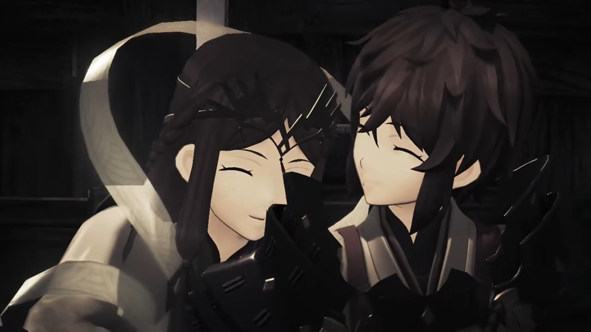
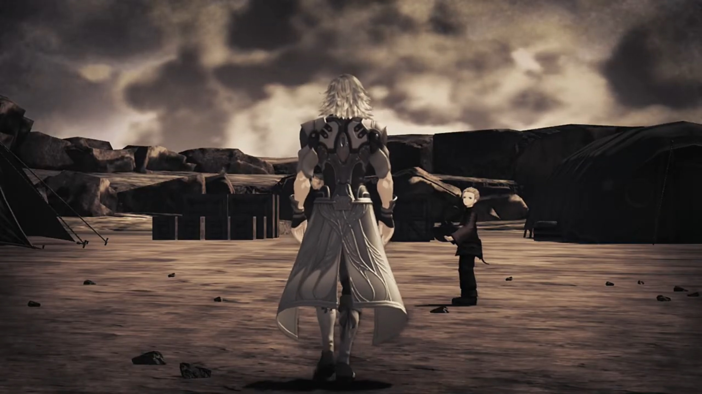
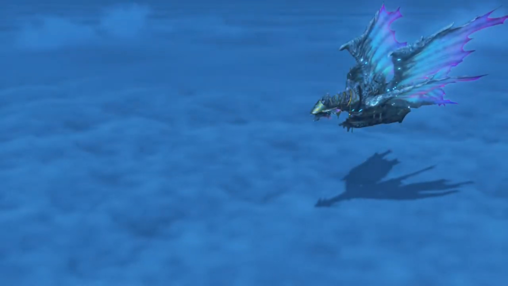
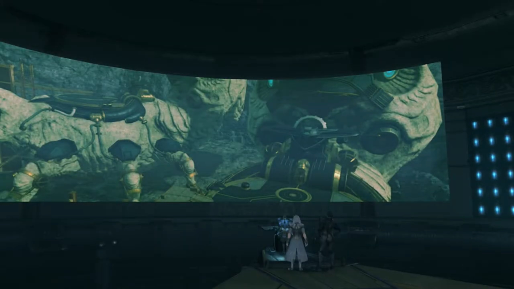

# Addam and Lora, Jin To Temperantia

500 years ago, Addam's Camp. The World Tree forever looming in the background. Addam, cloaked in a hood, wielded Mythra's blade, fighting against Lora, wielding a staff. He exclaimed, "Amazing, Lora. Even when I foresee your movements, you counter me instantly."

"I couldn't do it without Haze's power!" Haze, we now call Fan la Norne, was her Blade. "What about you? I don't see you using Mythra's hidden ability!"

"And what if we did?" 

"Well, if you did..." After separating from each other, she continued, "I'd just have to bring out my original Blade!"

"Master Addam... Your evening meal is ready for you." Jin came in with their meal. He knows how to cook? 

"Oh? Is it that time already?" They put down their blades. 

Lora shared, "The days are so long at this time of year, I just start losing track..."

---

Around a campfire they sat, a pot hovered over, to keep its content hot. Lora and Haze cuddled together, having girly chats. Addam ate with his hoods on; Mythra an arm distance beside him. A child to her left, Mikhail, busy filling his stomach. 

"Oh, finished already? That's a shame. I was hoping to join in." Brighid found herself joining the group. 

Mythra wondered, "Join in? By yourself?"

"His Majesty has many pressing matters to attend to. Besides, I'm **used** to working alone."

Mythra don't agree, "A Driver- and Blade- are one- in body- and soul. That's their very nature. You're not at full strength without him."

"It's not so simple as all that." added Addam. "I know I've yet to unlock the depths of your power."

"Really? I feel like I've been... giving it my all."

"But you never stop growing. At any rate, Haze's ability to restrict other Blades is indispensable. It's perfect for training. We're lucky." She{{footnote: With her full core crystal, diamond shaped than triangular}} was surprised how she became the topic of their conversation so sudden. 

"When she stops me using my Foresight... It's- certainly difficult." agreed Mythra.

Haze, replying humbly, "Ohhh, but y-you honor me too much. I'm just happy to help you both in any way I can." 

"Next to each other like that, you really do look like twins, you two." Mythra commented. 

Addam agreed, "It's rare for the Driver's nature to appear **so** strongly in their Blade."

Lora looked to Haze, mentioned, "People tell me that from time to time, but is it really true?"

Haze thought for a while, said, "Perhaps... But, whatever the reason, I- am- happy- if I look even a little like you, my lady." And she hugged Lora's arm and cuddled. 

Lora excitedly shared, "We're even the same dress size!"

"**Right?**"

"**Hahahaha!**" That entertained the others. 

Finishing up whatever remains, young Mikhail was carrying something away, while Lora and Haze continued their girly chats. Mythra was catching up with Brighid, while Addam sat where he sat, looking at Jin cleaning up the mess. "By the way, we want to try taking you on next, Jin."

Others were attracted to their conversation. Lora asked for his permission, "Well? How about it, Jin?"

"I-I'm afraid I-I-I don't particularly like fighting." And he walked away, the energy he emanated felt somewhat low. 

Addam: "And to think... we're hearing that from 'the strongest man in Torna'."

Lora, his Driver, defended him, "But perhaps there's truth in those words. After all, he... _or rather, they..._" Young Mikhail was waiting for Jin; he walked past him, not looking at anyone, his step slow and sorrow. 

Just then, a panicking soldier rushed into the scene, shouted, "**My lord, my lady! We've discovered Malos's target! The capital!**" That stopped Jin -- it was something he's concerned about. 

Addam was shocked, stood up straight, "**What? Are you sure?**"

"Yes, no doubt about it!"

---

On a flying Titan ship, the dragon-like vibrant wings stretched out as it drifted above the Cloud Sea, Fan la Norne stood at the front deck, watching the vast sea, her mind immersed in daydreams. Mythra observed her from behind, wondered what'd happened to her all those years. Why does she feel so sad? The Haze she'd known had always been content, with Lora by her side. But Fan? 

---

After Mikhail and Patroka escaped, at the factory, Rex asked, "Who are you?"

"I am Fan la Norne, envoy for the Indoline Praetorium."

"Oh, uh, Hi!"

"You- are- Rex, am I correct? Praetor Amalthus requests an audience. Please, come with me."

"You're **joking... right? What would the Praetor- want with me?**"

"The Praetorium... manages every Blade and Driver in Alrest. And, as **you**, are the Driver of the Aegis..."

Mòrag guessed, "The Praetorium wants that **power** for **itself.**"

Fan rebutted, "Not at all, my lady. The Praetor... would like to meet his fellow Aegis Driver. He wishes the speak to Master Rex. That- is all."

"His fellow...? You don't mean?!"

She approved her guesses. "Indeed. The Praetor is Malos's Driver."

"**HUH!!!**" Everyone jumped on their feet. Such holy awakened such evil, how could he? 

Fan continued, "There is- another matter. I believe you- currently have a- certain dagger in your possession?"

"You know about that?!"

"Why yes, I can tell. The Praetor **is** its original owner, after all."

"**HURRRRRGGGHHHH!!**" Rex took in a deep breath. Cole shared the same Driver as Malos? 

Nia tried to confirm, "So the Praetor -- he's... Cole's Driver as well?"

"Yes."

"Come off it. Just... how old is he?"

Mòrag shared, "The current Praetor is Indoline. It's not that hard to believe." After all, Indoline have the longest lifespan on all Alrest, excluding Blades that live forever (if you consider going back to the cycle and coming back out as a continuity). 

Dromarch agreed, "The Indoline do live loooong lives."

"Ohh right...? Well, that would explain why Cole said the dagger's owner- would know- how to get to the World Tree!" Rex completed the story himself. 

"Well, what do you say?" Fan took a step forward, looming over Rex, feeling eager. "You certainly won't regret it. An audience with Praetor Amalthus **is** an honor."

"Uhhhh, hey, uhhhh... **W-wait a second...**" Let me discuss it with others first. 

Nia discouraged, "I wouldn't buy it, Rex. This is too good to be true."

"What do you think, Mythra?" She and Pyra were the ones that's concerned. After all, they were going to see him, their goal from the very start after Cole. "You noticed, **right?** As soon as we met **Cole!**"

"Yes. **Though I had no idea** that man had become the Praetor, of all things."

"Should we?"

"There's a lot I want to ask him. I want to know about what happened... after I went to sleep. And of course... How it is... that you happen to be here, Fan."

Rex therefore decided, "All right, then. I want to meet him too. In fact, we might have no other choice!"

---

Mythra called out, approaching her, "_Haze..._" 

Hearing footsteps, Fan turned around on the deck, surprisingly wondered, "Lady Mythra? What are you doing out so late? Can't you sleep? At this time of year, the nights can be bitter. Please don't catch a cold."

"I'm a Blade. _We don't exactly catch colds._"

"Of course. My apologies."

"H-Haze... You- really- don't- remember?"

"**Hm?** I'm afraid you have me mistaken... I am Fan la Norne, Blade to Praetor Amalthus."

"Right. Amalthus." She answered thoughtlessly as she focused on her Core. Why is there only half of it? "Sorry, m-my mistake. You just reminded me of somebody I know. It is quite cold, isn't it? I might go back to my room, after all." This is no longer whom she'd known, perhaps. 

As she turned around, Fan sent her off by bowing to her, "Yes. Good night. Lady Mythra."

"N-night, Fan."

While she was walking back, Pyra sounded within her, "_Mythra, did you see her Core Crystal's shape?_"

"_I saw. That's not normal resonance._"

"_It's not like with us and Rex, either._"

"_I guess this is one more question for the Praetor! Sorry... Let's change over. I have to think._"

"_Sure. No problem._" And Pyra took control of the body. She looked back where Fan stood, wondered what story she'd went through all these years. 

---

Jin was in one room when the shuttle opened to reveal various Core Crystals lined along the walls. Their light dimly lit the room, apart from the panels. Malos entered, asked, "Is it working?"

"Yes. I can hear the Blades' voices now."

"Come with me. Akhos has found- something- **very** interesting."

"Very well."

---

"Hey, look at this." In another room just beside the Core Crystal's, a wide-curved-screen displayed some location. 

Akhos: "Temperantia... Rumor had it that Mor Ardain were conducting an excavation there. **So**- I thought I should check it out, and, er..." He seemed to had lost his sadness of losing Obrona already, at least on the surface. 

Jin mentioned, "It's changed a lot, but this shape... That's a Judicium Titan weapon."

"Judicium... _I know that name_..." Akhos heard of it. 

Malos shared, "Right. It was destroyed. A casualty of the Aegis War. And... it's where the Flesh Eaters were created."

"Is that so?" Now Akhos felt curious and excited. 

"What now?"

"If it is a threat to us, it should be destroyed. Or... we **could** make use of it."

Patroka broke the calm atmosphere, "**DAMN IT ALL, I CAN'T BELIEVE THIS!!!**"

Akhos greeted calmly, "Hello, Patroka. And a very good day to you too. Don't tell me."

Mikhail asserted, "**No! Don't- worry** about that. **We got the goods. No problem.**"

"Well, that's something. Sooo... why the temper tantrum?" Now that he don't have Obrona to track the Aegis and others, he can't get info on real time about Blades. 

---

"**And that's how it went down!** Long story short, we had to make a run for it." concluded Mikhail. 

"And you're sure it wasn't your ether field that was disturbed?" asked Akhos. 

"A female Blade from Indol..." Malos tried to recall. 

"**Jin!**" Mikhail knew her. And Jin knew her. "**It's Haze! No doubt about it!**" Jin looked away. "**Jin?**"

"Mikhail, how goes the work on the Marsanes?" Such change of topic. 

"Oh, that's no problem.{{footnote: Lora was frozen on the ice behind him.}} **It'll take a little longer than I thought**, but we'll get there."

"And Akhos, where is the Aegis right now?"

He checked the panel that replaced Obrona's capacity to track some specific bandwidth he'd kept in memory, answered, "Near the Leftherian Archipelago. She's on the move, _maybe on a ship._"

"Maybe... _they're heading for Indol._" Jin suggested. 

"_Hmmm?_ Where..." Jin was walking away when Mikhail wondered. 

He knew what he wanted to know, immediately answered before he finished his sentence, "Temperantia. To buy us some time."

Patroka, somewhat calmed down, "What about- the Aegis? If _that man_ gets into **her** head..."

"Not happening." Malos knew his Driver all too well. Else, he would've awaken Mythra 500 years ago if he wanted her. "_That's not how Mythra works._"

Jin agreed, added, "In fact, she'll be a big help to us. After all, **only** an Aegis- can open up the path- to the World Tree. **Malos**, there's a lot of work to be done on what we got from the Guild. **You guys**, stay here- and help Mikhail. I'll go to Temperantia. Alone." he instructed therefore. 

Malos: "_Fine by me._"

Akhos: "Very well. Take care of yourself."

As Jin was walking to the exit hatch, Malos commented, "_That guy..._"

### Footnotes: