# Bringing Pyra Home, To See His Parents (Leftherian Archipelago)

Dawn. The group gathered at the front deck, overlooking the Leftherian Archipelago. Pyra exclaimed, "Amazing... It looks like a mountain of clouds."

"The Leftherian Archipelago. Indol is currently positioned beyond the Cloud Ridge." That's the Great Waterfall of Clouds! The Leftherian Archipelago composed of multiple jellyfish floating mid-air, connected by their tentacles. Some other islands floated on the sea, weren't connected. "It would take quite some time to sail around, so we'll be traveling over land- from here." explained Fan. 

Dromarch: "I suppose, not even a Titan ship could surpass- such an obstacle."

Mòrag urged: "If we have to walk, we'd best get moving now." She'd freed herself from the burdens of the Empire temporarily to join the Aegis on her adventure. 

"**It's been a while!**" All the time he'd spent near Argentum Trade Guild, salvaging just to get most of the money back home. When was the last time he came back? 

Gramps counted, "**Mmm! Must be five years!**"

Pyra wondered, "Rex, have you been here before?"

He proudly replied, "It's where I grew up! Me and Gramps are from Fonsett Village, just over the ridge here."

Nia was surprised, "Hmph! I wouldn't have pegged you for a Leftherian."

Pyra got excited, "So **this** is your home..." So now she's a guest to her partner's home,eh! The ship sailed straight for Home Sweet Home. 

---

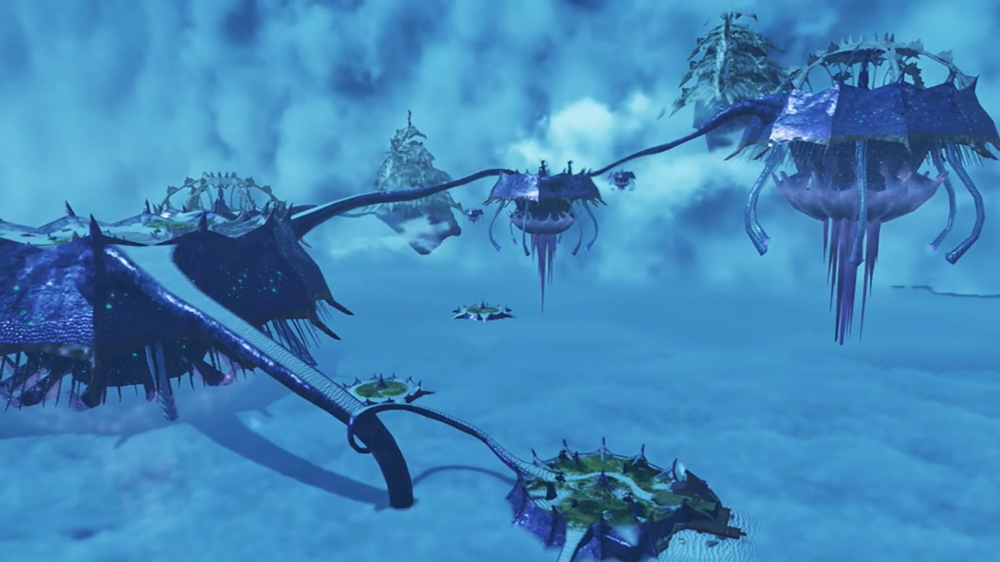

Trees grew on little islands carved by moats within each giant jelly fishes. Or purely sandy beaches with some pools of water near its center and almost nothing else of interest except rocks, not even having a top to cover it from the sun! The tentacles formed roads to travel from one jelly fish to another. Some of these jelly fishes even stuck their body within the Great Cloudfall! This, is the **Leftherian Archipelago.**

---

The ship docked, and Rex first touched ground again. He took the lead as a host, "**Well, I guess... it'd be quickest for me to lead the way from here. We just need to get** over the ridge, right?"

"Indeed. The delegation from Indol- will meet us there." agreed Fan.

"**Roger that!**"

"Will leave it to Rex-Rex! Lead the way!"

"**Ha-ha!**"

Gramps extinguished their flames, "Don't get an inflated head. We're just following the islands, you know."

"**Hey! It's still dangerous!**" rebutted Rex. "There's a lot of **tough monsters around these parts.**"

"Well, I won't deny that..."

"So how we going?" asked the can't-wait Tora. 

"**Errrr...**"

"**What about Fonsett?**" asked Pyra, with mounting excitement. 

"What about it?" He was considering which route was safest while close enough, and don't yet understand what she meant. 

"**Will we pass it?**"

"I mean, we **could** go that way."

"**Let's do it! I mean, l-let's visit your village!**" she exclaimed, full of excitement. 

Nia: "OK, calm down."

Dromarch noted, "Someone's... rather excitable..."

Poppi $\alpha${{footnote: Oh, just as a sidenote, Poppi had reverted back to its $\alpha$ form than staying in QT form, to save energy, and because it's cute! And yes, we won't be adding the $\alpha$ to the back after this. For normal Poppi, which took up most of the speeches, we'll use 'Poppi' to refer to her. On occasions when she does changed form, we'll specifically refer to that form, e.g. 'Poppi QT'. But if one remembered correctly, she almost never speak in that form throughout the whole cutscenes.}} commented: "Not like normal Pyra."

"Uhhhh, I mean..." Opps, awkward... She excitedly invited, asked for others' opinions, "**Don't you want to see the place where Rex grew up?**"

Nia: "**Sure!** But I'm not getting my ears in a twist..."

Rex, coming to think of it, commented, "Actually, that's not a bad idea. That route's probably one of the safest we could take. **How about it?**"

Fan had no worries on getting back too quickly, decided to "I leave the decision to you."

"**Then let's DO IT!!! We'll head off as SOON as we're ready!**"

In unison, "**YEAHHHH!!!**"

Nia had more questions for someone whom gave her a bad first impression, "Hey, what are **you** still doing here, anyway?"

Mòrag answered, "I **volunteered** to come along. I'm acting as a representative of the Empire. Is- there- a problem?"

"No, not at all." Fan had the authority. "The Praetorium has extended an invitation to the Aegis. _We would not wish to conceal this information from the other nations._"

Gramps noted: "**Oh, yes**, that's- the- Praetorium- for- you. Impartial to the last, eh?"

"Indeed."

"That's not a problem for you, is it, Nia?" Brighid eyed her. 

She answered against her will, "**Sure, we're best friends now.** _I'll get over her throwing me in jail one day._"

Dromarch tried to calm her down with logic, "Now, now, my lady, Mòrag and Brighid... are on our side. That's... much safer than the alternative."

She impatiently replied, "*Yeah, yeah*, I **suppose.**"

Rex urged, "Come on, Nia, lighten up! **It was all a big misunderstanding! They helped us out and everything, remember?**"

"**You're such an idiot sometimes!**"

"I'm an optimist-"

She halted him, "**Call it what you want.** You're still an idiot! **UGH! OK, FINE.** It's water under the bridge." Reluctantly, she held out her hand to Mòrag, impatiently urged, "**GO ON! Friends, YEAH?**"

Mòrag: "Hmph. Very well. Friends it is." And she softly took her hand and shook. Whatever their internal story and emotions, they'd be on the same side, at least on the surface, for now. What remnants emotions required to be solve, time will tell. 

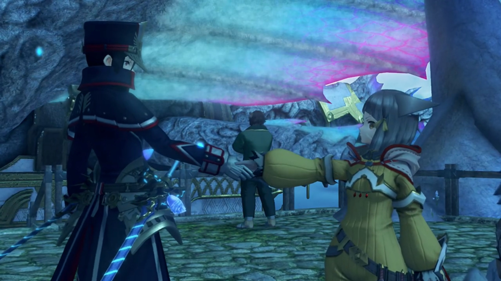

---

They were walking inside a tunnel paved with white sand and straight tiny-cap luminescent glowing mushrooms and tiny stones, when Pyra noted, "I've never seen anything like this. A tunnel through the clouds..."

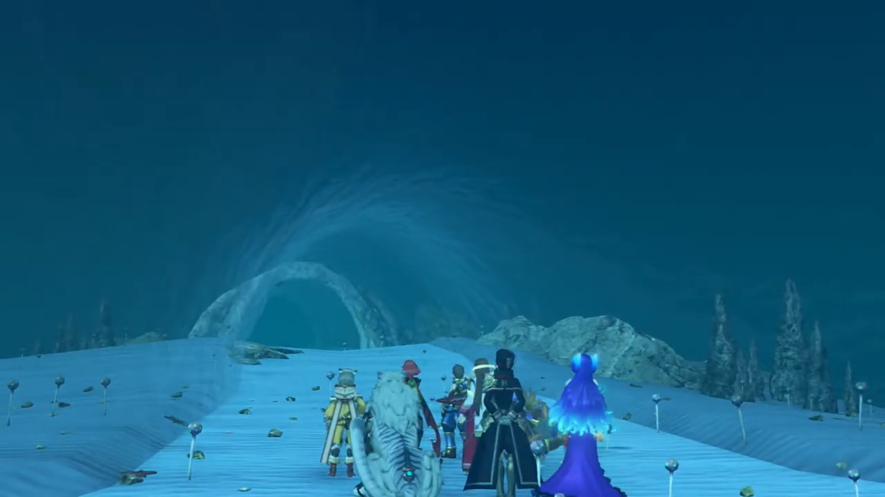

Rex explained scientifically, "It's because this archipelago is formed of many smaller Titans. The forces between the Titans **bend** the Cloud Sea **into** this shape."

Gramps reminded, "**There is a large** Titan as well, at the center of the cloud mountains. Though, being within the Cloud Sea itself, you won't find humans living on it."

Rex agreed with him, continued, "The small Titans seem to like clustering around the larger one, and *that's what* forms the archipelago."

Tora was amazed, "**Wooowww!!!** So many amazing **things to see in world!**"

Poppi lectured, "Masterpon- should get out more often! Working inside all day- bad for mind and body, you know."

"Tora on wonderful adventure with **Rex-Rex right now though!**" he objected. "**Days of staying inside all day are long gone!**"

Rex agreed, "**Yeah!** You're a Driver... **just** like us now, Tora."

"**Mehmeh! Tora appreciate support** from friend Rex-Rex!"

---

The island where Fonsett was located had trees and grass and flowers and white sandy beaches. Rex was overwhelmed when he saw, "Hahah! That takes me back!" 

They looked to the left, where there was a cliff, and children were lining up and jumping off it. Nia was shocked, "What the hell? You wouldn't catch me **dead** doing that."

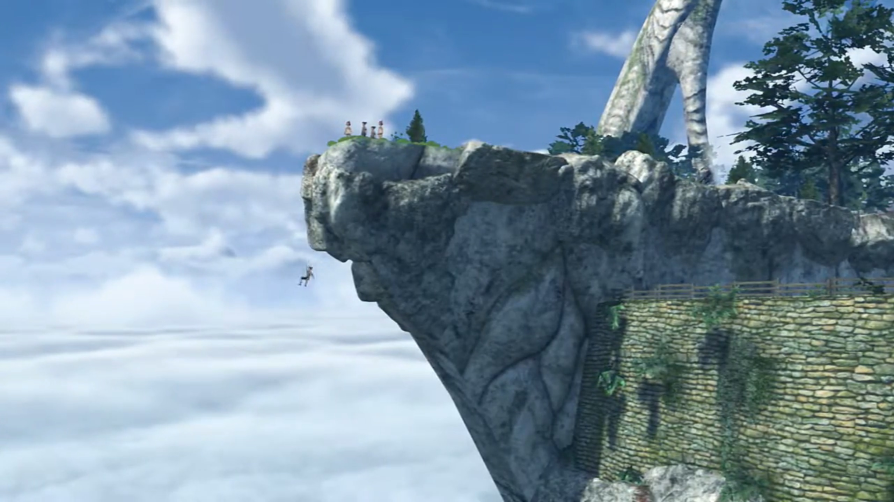

"Don't knock it off till you try it. It's how we all learned to swim in the clouds!"

"**You mean, you did that too?!**" Pyra was excited to learn something from his childhood. 

"**Yeah, of course!** It came in really handy when I became a salvager."

Nia was still reluctant, "I can't stand it down there. It's not like water, feels like the clouds are wrapping around you."

"And you don't like heights, either." added Dromarch.

"You get used to it really quick." Then Rex urged, "Hey, **you want to give it a go?!**"

"**Wha- Hey, no! You get away from me! Don't touch me!**" Her fur tinged on her ends and got defensive as Rex tried to catch her. 

Pyra came to her rescue, "Stop that, Rex! Don't tease her."

"All right, all right." What a lost of excitement. But anyways, let's get to the village, built of stony bricks in dome-like stony houses up the hill, with tiny windows. 

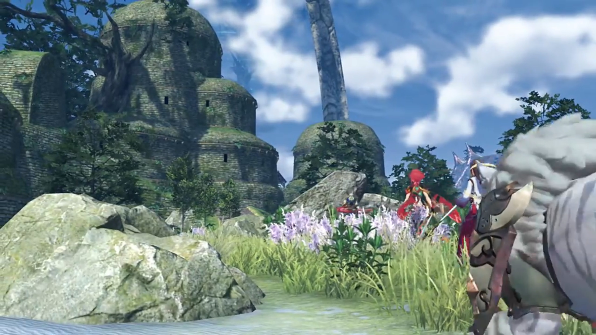

"Honestly, when are you gonna grow up a little?" Nia wondered. 

---

Temperantia. Soldiers were lining behind Senator Roderich as he read through the manuscript on his hand, "Very impressive."

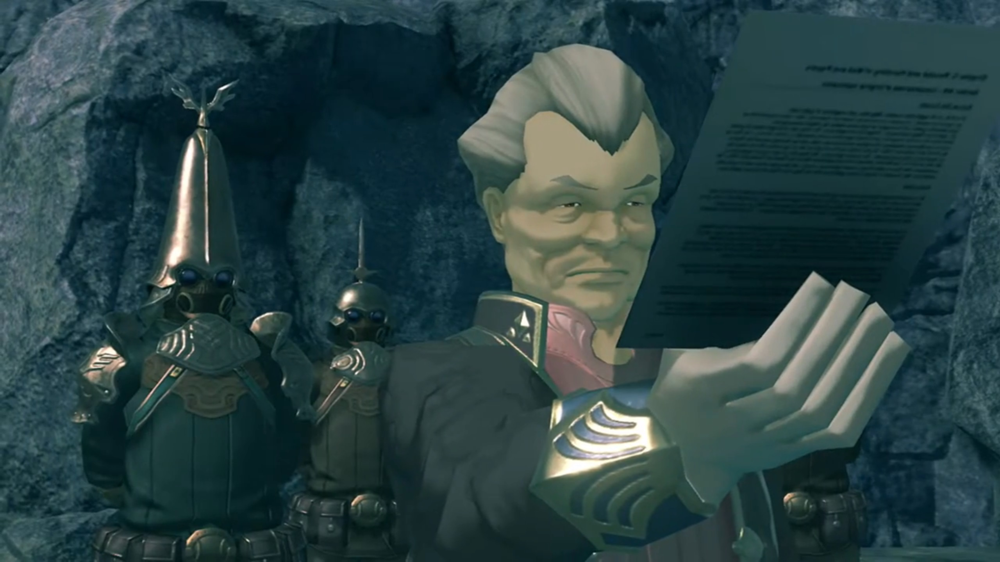

The special soldier, perhaps a captain, explained, "We've refitted the drivetrain to use Ardainian technology. **All** of the control mechanisms have been beautifully preserved, so we should be able to finish- **relatively** soon."

"Finally, we will be able to compensate for our forces' depletion. The Gormott struggle takes its toll."

"Sir."

"And there are no safety concerns, I trust? The explosion three months ago was most unfortunate. **Orrrr** had you forgotten?"

"We've been running a sedative drip through the Titan's fluids since then. No further difficulties. We've... **also** encased the back end in composite steel. That- **should** withstand sustained enemy fire. Even if it were to be blown up; well, it'll be in enemy territory."

"A pyrrhic victory, I'd say."

"**Well**, the crew will have escape pods."

"**Escape pods?** Are you sure you don't mean coffins?"

"_I mean urgh..._"

"Hmph!" And he walked away, while the soldiers followed him. 

---

There was a space in front of a machine, the Judicium weaponry Jin was after, and the Senator commented, "Judicium, the dead nation that realized Flesh Eater technology. I cannot say... I find their creations tasteful."

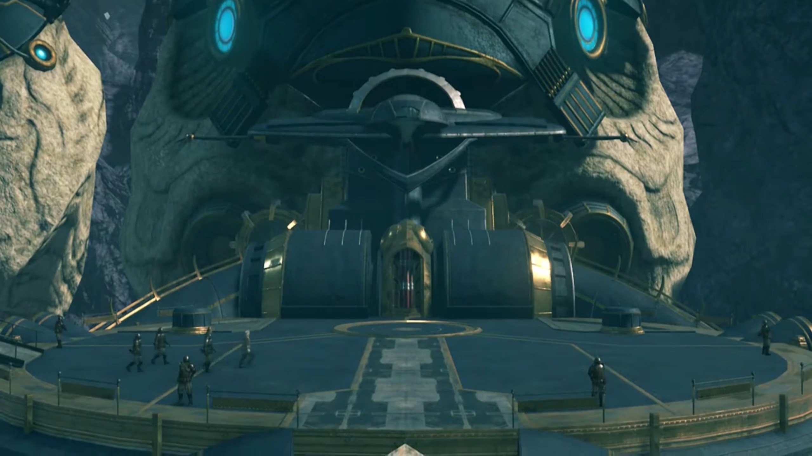

The captain followed behind him, commented, "I'm aware you do not agree with the principles of fusing Blades- with- human- cells. Few people do."

"Not what I mean."

"I'm- sorry, sir? Then what exactly do you...?"

"It's said that Flesh Eaters were created in the quest for ever- stronger- Blades. But is- that- really- true? What I see in them... is the shadow of a people **scrabbling** to **prolong** their existence. I look at them and see ourselves. That is what I despise. I will leave for Indol shortly. Much remains to be done."

---

The main entrance into the village was over an arch. While the children were busy playing, they immediately caught eyes with strange clothes. One after another, they recognized the one leading, "**REX!!!**", and all started dashing towards him, surrounded him with questions. The group paused their steps and let them reunite for themselves. 

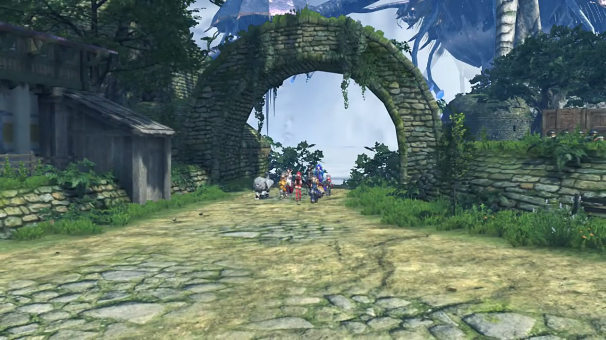

Rex still recognized them, "**Whoa! Kirk? Kazuna? You guys sure have grown! And hey, is that really?**"

"That's our Mark." Rex looked at the elder whom approached. A female with short gray hair and dark skin, with some bracelets around her neck, and giant earrings. "He'll be going away to school in Indol soon, **thanks to the help** you've been sending us."

"Auntie Corinne, good to see you!"

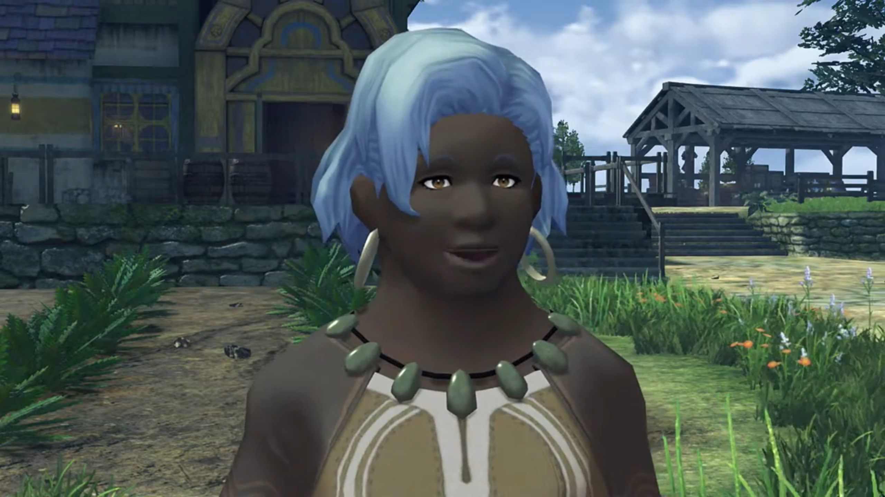

The group stood nearer behind. Pyra felt such hospitality warm and exciting, exclaimed, "Wow, this is **quite a** welcome..."

Dromarch noted, "I didn't realize... _you were sending your money home._ That's very... **admirable** for such a young man."

"_Home, huh?_" Did Nia have one? When was the last time she felt like home? With Jin, maybe? But that's nothing like here. 

Tora exclaimed, "Old lady have lots of littlepons!"

Poppi blandly corrected him, "_Masterpon, these **clearly** not all littlepons of same parent._"

Corinne's eyed the little Titan tucking out his head from behind Rex's helmet, "**My word!** Is that old Azurda there? What have you gone and done to yourself?"

Gramps: "That would take some explaining. I-Incidentally, is there some way you could put us up for the night? Long day and all."

"**'Is there some way?'** _Don't give me that!_ Stay for as long as you like! What's mine- is yours."

"Thank you."

Rex: "**Auntie, thank you so much!** I think I'll go for a bit of a walk first, though."

She understood immediately. "Ahhhh, yes. Leave your friends... with me."

"**Pyra, could you come along too?**" He invited. 

That surprised her, "**Hm? Oh, of course!**"

Corinne wavered to the rest of the group, "Right then, **come with me**, all of you!" And she lead the rest to their homes, including Gramps.{{footnote: You may not see Gramps following in the video, but later on, you'll see Gramps gone. Just some minor bugs.}}

---

A land with various tombstone, a graveyard. Rex faced two of them, buried side by side; Pyra trailing behind. 

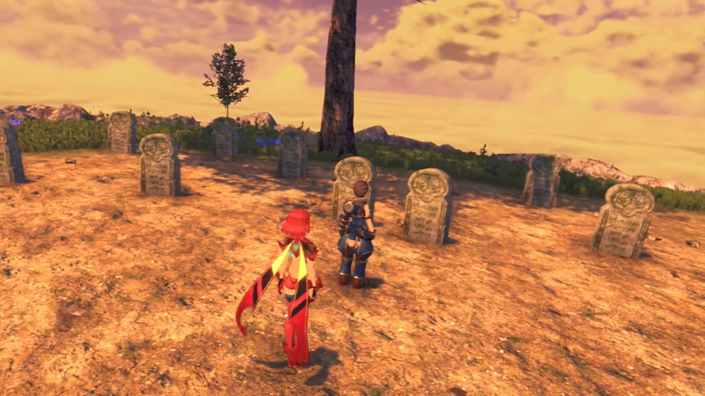

"Where are we?" wondered Pyra.

"These are my parents' graves."

"_What?!_" she was surprised. 

"Sorry. I guess I never properly told you about myself. I..."

"N-no, it's fine. I'm sorry... I never thought to ask..."

"I wanted you to meet them, though."

Her nervousness grew, and words stuck in her throat, it took a moment for her to be able to voice again, "To meet them? How- do- you... mean?" 

He nodded to her, spoke with action. Walking close by the two tombstone, he knelt on one feet, "Hey, Mum... Dad... It's been a while. A ton happened, you know -- I became a Driver! And this girl... is Pyra. My new partner." 

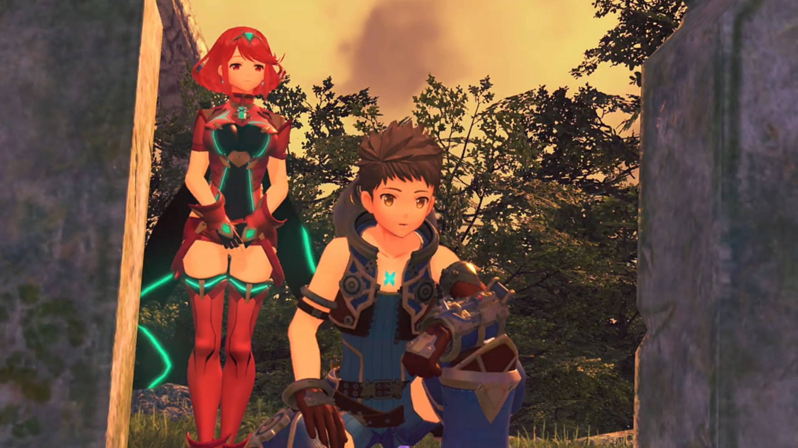

Her eyes widened, that's what one is to him? She eyed him from the tip of her eye, full of tenderness. Rex continued, "I know you'd love her... We- we're going to Elysium. Pyra- and me. I don't- know- what's coming next, but... You'll be watching over us, **right guys?**"

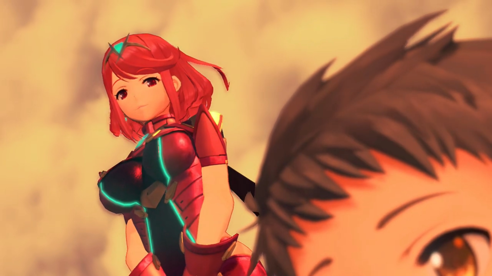

"Rex..." He embraced for a little while, and Pyra followed. 

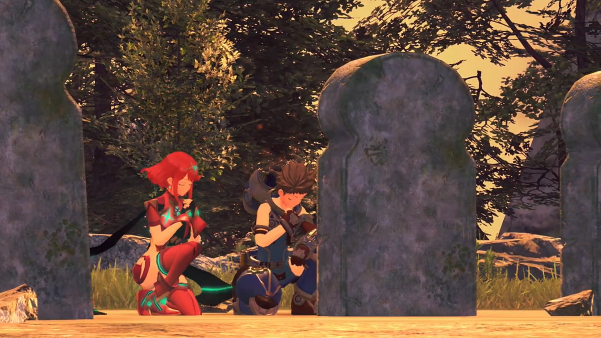

"Right, let's head back."

"OK." And she spoke nothing else, let the feelings sink in. 

---

Corinne had got a standalone home just for them. Poppi was punching his masterpon's shoulders, Nia napping on Dromarch, Rex chatting with Fan, Brighid with Mòrag. Pyra helped washing the dishes in the kitchen, with Corinne. "I'm so sorry, making you wash up like this."

"**No, no, don't worry about it!** I don't- have to be in a fight- to be able to help people. I like it."

"You're a dear. Rex is **very lucky** you're around. He's never brought a girl- to meet me before!"

"**HUH?! Oh No, n-no no no, it's not like that! I'm just Rex's Blade!**" She jumped a step back in surprise, blood rushed up her cheeks as she tried to deny, but her heart raced fast. 

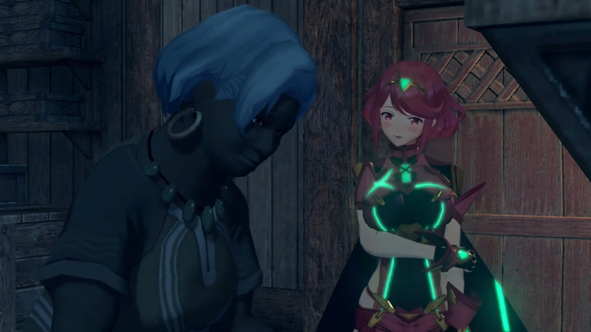

Corinne saw through her, "Is that so? You do hear of Blades and Drivers getting married **a lot** in the old stories!"

"Err..." She don't know what to say. 

---

After all the washing and all, Corinne prepared tea for them, as a reward for her help, but perhaps, she wanted to speak a bit more to her. Ether lamps illuminated the interior of housing so bright we could see the light from the windows{{footnote: In the past, using candles or better oil lamps, you can't really see that clearly, unless there's a LOT of candles to light up the whole room -- at the expense of feeling very hot inside.}}. They were enjoying the cloudy night, though it would be better if there's some breeze. 

Pyra commented, "This is a lovely village. Everyone's so warm and... _carefree._" She hoped she could be one of them, perhaps. 

"It's removed from everything, you see. I think if **everyone could live like** this... the world might be a happier place. You know, between you and me... **I think, deep down**, Rex still misses his mother a little. In a way, **you** remind me of her. Just... a tad."

"Of Rex's mother? Really? A-actually... He took me to say hello to his parents." she shared, feeling heartwarming. 

"_Ahhh..._ You know, Rex wasn't born here in Fonsett. He must have been- two years old when he came ashore here with his poor- mother."

> One day, a young woman effetely entered the village entrance, Rex in her hugs. She struggled forward, until she could take no longer, collapsed to the floor. The villagers rushed to her help. 

"Maybe it was war, or a- dying Titan... But they'd lost their home, sure enough."

> She never recovered. Corinne, as the guardian of the village's children, took the role to care for young Rex.{{footnote: Unlike today, some Indian tribes in the past, including in Latin America, they take everyone's child in the village as their child, and hospitality was extended so it's not separated into 'my child' and 'their child', but 'everyone's child'.}}

"I gather it was a great struggle to get here. _She was so weak_... She asked me to look after Rex, and... _That was the last thing_ she said."

> Corinne brought Rex with her and other villagers to the funeral; many people visited, despite not knowing her more than that, paying tributes. Corinne consoled the boy who'd just lost his parents; he wasn't even crying, but more blank, standing there, purpose lost. 

"She seemed so lovely, too... And his father... We found his body about... three- titanpeds away from here. He came **so far**, If only he'd made it a little farther... Such a sad business."

"_How awful_..."

"That boy has suffered enough loss for one life." Corinne started crying, feeling sorry for his fate. "**That's** why he became a salvager, you know. To find some way up to Elysium."

> Pyra recalled how he always treated the dead -- his mentor Vandham, his parents -- with so much care and reminiscent, the little feelings he emanated that she can feel.

Her guilt awash her, she felt so sorry, depressing, and self-deprecating, "_In that case, maybe- it's not good for me to be by Rex's side after all..._"

Brighid was searching for her, came around the corner, hid behind the walls, overhearing their conversations starting from here. Pyra looked up in the sky; perhaps one day, she'll bring him more sadness, staying beside her. And he may one day even lose her! 

"**Why?** Are you not... fond of him?" asked Corinne. 

"**Oh, I am!** But... _with me- here... he'll suffer even more, lose- even more. So maybe... Maybe Rex is better off without me. Rex... and the whole world. They don't need me. That's just how it feels._"

"Now, dear..." The conversations ends here; Brighid had no need to hear more. What worries lies in their future journey? 

---

The next day, Corinne and a few children sent the group at the village entrance. Rex announced, "OK, time to move out!"

"**See you soon, Rex!**" one children exclaimed. 

Corinne: "You take care now. And keep yourself out of trouble, Azurda!"

"Ah, you know me. I prefer the quiet life."

Pyra expressed her gratitude, "Thank you for everything."

Corinne: "Pyra, dear -- I don't know what you've been through before, but you should know you're not alone- anymore. Rex is a strong boy. You can depend on him, **whenever**, and **wherever** you need him."

"I know. I'll try."

"Huh? What was... all that about?" says he whom was so out of sync. 

"Nothing at all. Right?"

Corinne: "Nothing for your ears, Rex. You just concentrate on what you're doing. **Work hard**, and do your best!"

Scratching his head, "Sure, I will." And he went with the others away. Pyra stayed back for a while, gave Corinne a bow of gratitude, before catching up with them. 

### Footnotes: