# The Return of the One-Eyed Monster, Meeting the Praetor

===

On their way to the boat, Zeke and Pandoria seemingly were waiting for them  for a long time already. "Finally. You took your sweet time." The grin; the grin and the eyes; it's back! 

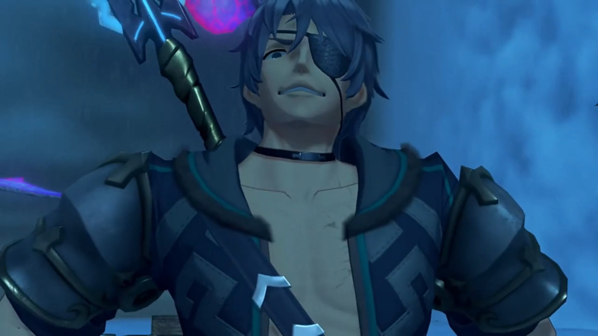

Mòrag recognized him, despite she was the first time traveling with the group, "You're the..."

Nia welcomed him once more, didn't feel any surprised, "Hey, Shellhead!"

"Hey." He bade, don't fight with that now. 

Rex: "You just don't give up, do you? C'mon, out of the way."

Tora compared him to "More like stubborn leech than turtle."

"Hah! **This time I'm here for something a little bit- _different._**" He tucked his chest to the side and nudged at the group. 

Rex: "Ugh, what's that supposed to mean?"

"I want to see just how good you are, chum. I've been waiting here for three whole days already!"

Nia was surprised at his tenacity, "_Three days? Seriously?_" She pointed at him, "You know what, _no thanks_, I don't pick on idiots." Rex agreed. 

"Well then. Fight me and we'll see who's the idiot!" He took out his sword, and the shiny part pointed at them once again. 

"How did you know that we'd be here?" Rex wondered. 

"I'll tell you... if you can _beat me!_" Then he nudged to the so-long quiet Mòrag, asked, "You want to join the fun too?"

Which she replied, "No, you- all- go ahead."

"Huh? Why?" Rex questioned. 

"What- a- shame! Looks like the illustrious Flamebringer won't be helping you this time."

Nia don't see the problem, "Thanks for the concern and all, but _may-be_ you should be worrying about yourself. Big tree to your right, big rock to your left, and a cliff, right behind you. Which one's gonna get you this time, eh?" The group effetely took out their weapons, don't feel like fighting something whose final moves never hit 'em. 

Surprisingly, Zeke was quite strictly replying, "Not today, furry ears. Check this." He bent down more and pointed at the group; they were still not at their fighting spirit, assuming he won't do them harm, waiting for his move leisurely. Then, with a lightning bolt, electricity splattered on his surface; before the group knew it, they were in mid-air. Rex: "**WHOA!!!**"

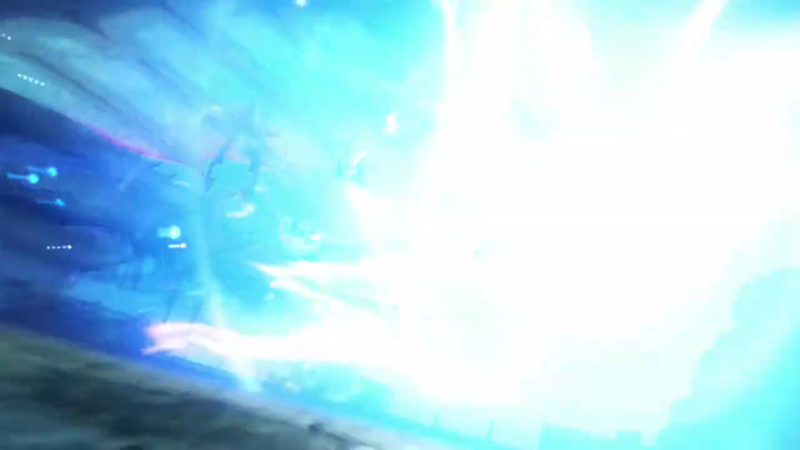

Mòrag looked at them, but didn't interfere. On the ground, the surprised Nia: "What the-..."

"Well? **Feel like taking me seriously yet, hmm?**"

Tora sighed, "S-so strong..."

Nia: "What the... How'd he do that?"

Mòrag introduced him officially: "Thunderbolt Zeke. Tantal's most powerful Driver... and its Crown Prince."

First time the group knew. "Crown Prince of... Tantal?!"

Rex can't believe it too, "**This guy?!**"

Mòrag: "It is quite the rare opportunity to see his... swordsmanship first-hand."

He felt the praise, yes, the praise, his nose up and high, floating above the cloud sea, "_Now this is more like it. Oooh, come on, yeah! Keep it coming!_" After all the Shellhead and stuffs, finally someone appreciates! Oh, the respect!

But his ugly face, Mòrag turned away from, refused to continue the praise. Brighid blocked Fan's sight, to prevent such obscenity from tainting her pure heart. Zeke was not satisfied, "**That's it? That's all I get?!** Ugh, fine. Anyway, ready to... concede defeat to the Zekenator?"

Rex had stood back on ground, "As if! We're only just warming up, you- **pompous** arse!"

Pyra agreed, transferring power to Rex, "I'm right with you. **Let's show him what we got!**"

"**Hahahahah! YESSSSS!!! Let's see if the Aegis is worth the hype! HYAAAHHHH!!!**" And the fight began. 

---

He dragged back along the port with his back bent like moon shape; as he spring back upwards, he commented, "Not bad, chum."

Rex: "Right back at you. Impressive! Didn't think I'd ever see another Driver and Blade... on Mòrag and Brighid's level..."

"You're still holding **back. Where's the Aegis's _true_ power?**"

"Mythra's power is only for fighting- bad guys."

"_Ahh, that's so sweet._ **So I'm a good guy now, is that it?!**"

"**Am I wrong?**"

He stayed for a while, grinned, and laughed as if epilepsy seizures took over him, "Pfff **AHAHAHAHAHAHAH!!! I like your attitude there, chum!**" Then he sheathed his weapon. Pandoria got beside him to prepare for the show yet again, "Well, that's an Aegis's Driver for you."

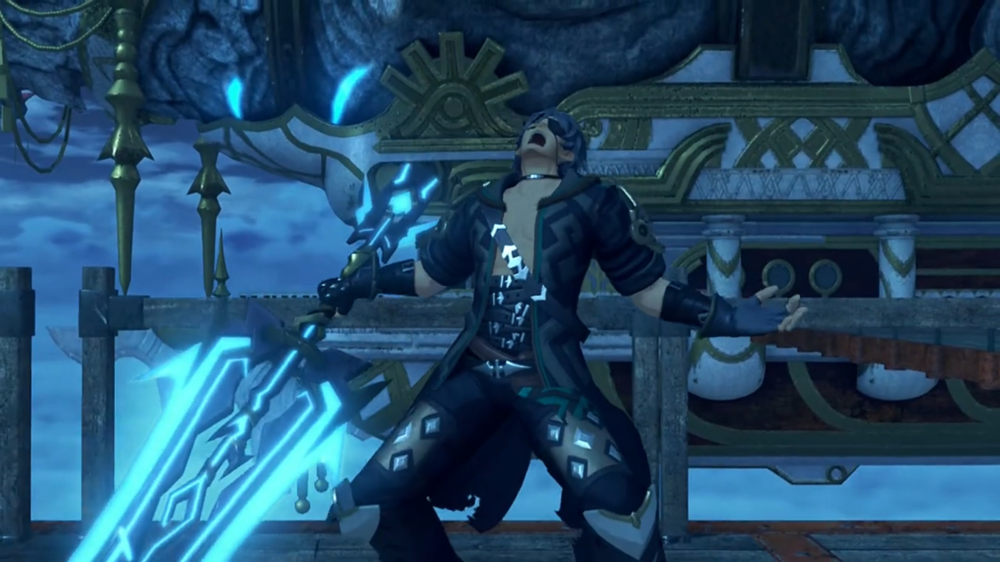

Fan asked, "How did we do, Your Highness?"

"**Sure, you pass.** I think we can just- about- let you into the Praetorium." 

Nia: "What the hell?!"

Zeke explained, "**I've been working for Indol** for a while now. A kind of... _special envoy._ They asked me to keep an eye out... for the Aegis. Actually, I volunteered to. _You know how it is. I'm jolly sorry... for testing you like that._"

Pandoria revealed the bloopers, "We **were** planning on getting this over with in **ONE** encounter. But- His Highness has the most **awwwwful luck**, so..."

Rex already knew, "Yeahhhh, I think I got that."

Zeke cannot accept his bad luck, tried to explain himself to Pandoria, "**What are you talking about? Everyone has bad days, right?**" And he leaned on the wooden gate by the edge of the port; the thing break under his weight. 

The group exclaimed, "**AH!!**"

He couldn't managed to get up, tried fluttering himself up but failed, "**AHHHHHHHH!!! WHY MEEEEEEE???!!!**" And down he goes, plunging straight for the Cloud Sea. 

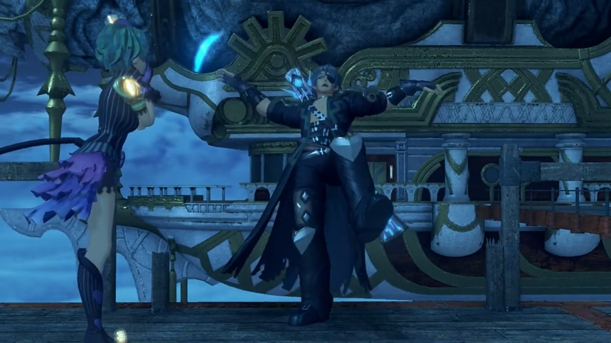

Nia already expected it, "There he goes." They gathered by the edge where he fell and just watched him, including Pandoria. 

Dromarch was putting his whole body weight on the fence just beside the broken one, and it didn't snap, he agreed, "Mmm, bad luck indeed." Nothing was seen floating out of the Cloud Sea, however they tried to look. 

Pyra felt anxious, asked Pandoria, "Uhhh... Should we go rescue him?"

"Naaaahhhh, he'll find his own way back up somehow. L-Let's just... board the ship!" And she lead them onwards. 

---

The Holy Praetorium was the only town on the back of Indol, a relatively small Titan compared to Mor Ardain and Uraya and Gormott. The stairs and the huge arcs, leading up the back of the Titan that formed a hill. All buildings were short, except the Praetorium{{footnote: Think of the Praetorium as a building that has the same function, looks the same, like a Church. It _is_ a Church.}}. This is the **Indoline Praetorium.** 

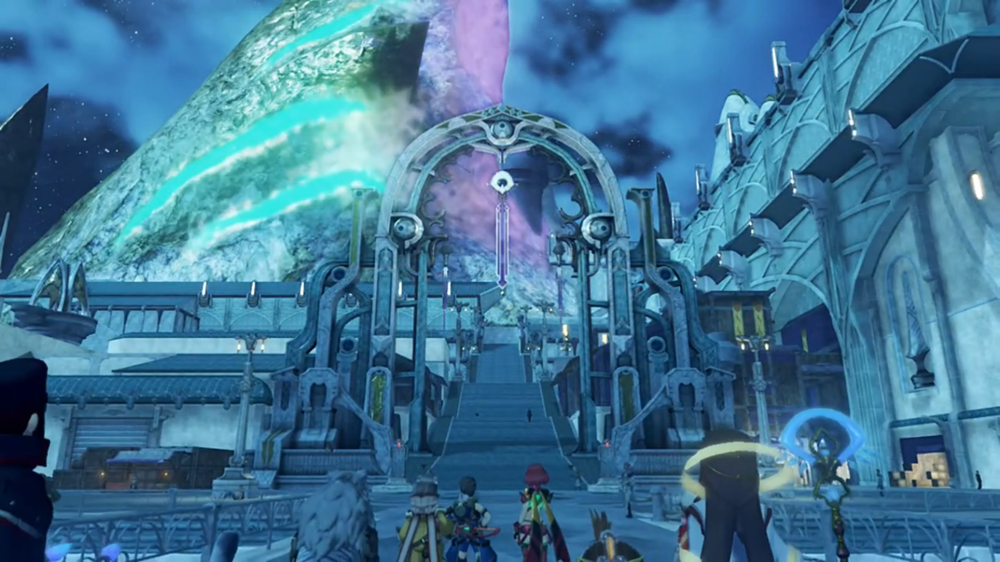

Tora exclaimed, "Ahhhh, soooo pretty..."

Poppi agreed, "Amazing!"

Pyra: "Whoaaaaa!! It's so- grand..."

Mythra replying inside, "_Sure, because they're trying too hard._"

"You- don't have to be like that..." She said it out. 

Rex overheard it, was confused, "Hm? Did you say something?"

"Oh, no, nothing."

Fan relayed the info, "Your audience with the Praetor is- scheduled for tomorrow. Before that, _maybe_ you'd all like to have a look around?"

Rex exclaimed, "**See the sights of Indol?** Sounds like a pretty rare opportunity!"

Tora and Poppi were equally excited, "**Yeahhhh!! Let's look around city!** Tora want to see- **everything!**"

Nia shook her head, "What are we, tourists?"

Dromarch: "_There's no harm in that, is there?_"

Even Gramps: "This would be a first for me, too."

Rex understood, "Rigggghhhttt, you were a bit big to go running around Indol before now."

Nia imagined it in her head, laughed, "_Now that's a funny image._"

---

They went up the stairs and saw, by one section of the wing, various tents set up in random fashion, but mostly around the side and center, leaving a main road in an arc in between. Weak, hungry people were sitting down; children still had the energy to play. A signboard with words written on it, Nia read as, "'No More Blades, No More War'... What does that mean?"

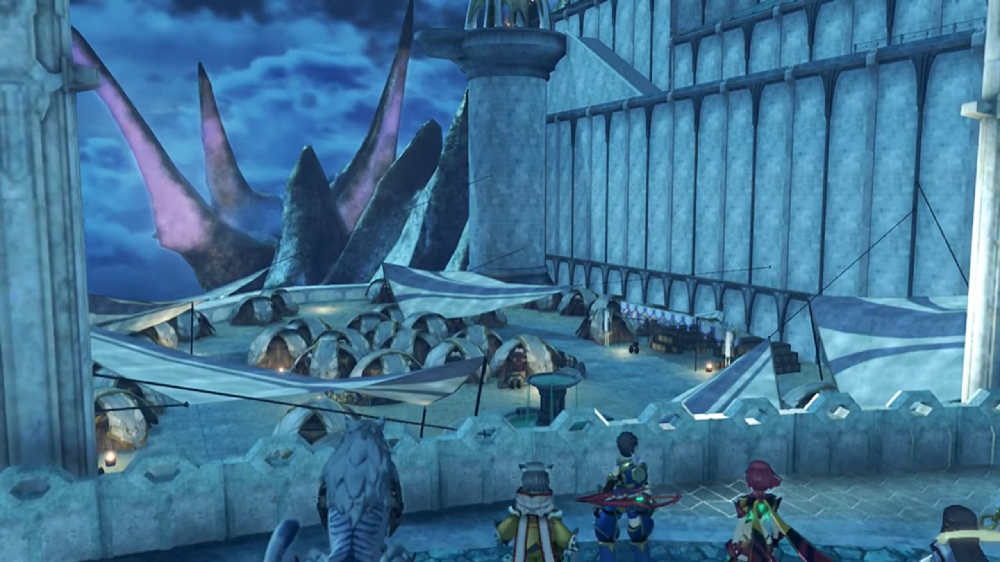

Zeke appeared out of nowhere behind her, explained, "That, my fuzzy-eared friend, is an anti-Blade protest. The refugees have **really** been **going at it** since last year or so."

She and Rex turned around, jumped on their feet, she exclaimed, "**Whoa! Where'd you come from?** What'd you do, swim here?"

Tora was more concerned with the protests, asked, "Did- Blades- do something wrong?"

Mòrag explained, "The Praetorium is single-handedly responsible... for doling out Core Crystals to other countries. _Though_, sometimes the likes of Dughall and Bana grab a piece of the pie."

Dromarch concluded, "Therefore, Indol has the power to control war itself?"

"That's one way of looking at it, _at least._"

Nia don't understand, "But war's about much more than just Blades and Drivers!"

Pandoria: "**I know that, and you know that**, but that doesn't mean **they**'re gonna accept it."

Rex: "I guess so..." He observed closer, noted, "There's a lot of... Gormotti here..."

Gramps explained, "They fled the Gormotti War... ten years ago. But here they are, refugees still..."

Zeke waved his had, "Yes. They're a funny old lot, you know. We feed them, we water them, **and this is the thanks we get. Don't these ruffians know- that manners- cost nothing?** I swear, **you lend these people a hand and they want the whole, bloody arm.**"

"It's easy to disregard things beyond your control, and- direct your anger- at targets- closer to hand."

Rex dropped his head, thinking, "Mmm..."

Mòrag asked, "Do you have something- to- say?"

"Not really."

"Out with it, Rex."

"Mor Ardain's Titan -- it's dying, and everybody knows it. That's why they -- why _you_ need Gormott."

"Our population is large. Larger than Uraya's."

"But you don't have the resources to support all those people..."

"You are astute for someone so young."

"Us salvagers pick up more than just artifacts. I'm not daft. I know fine words alone won't change reality."

"So you seek Elysium."

"Is that wrong?"

"No. I was just reminded how young you are."

Nia: "Still, if it's Rex, or people who harp on about justice with no solutions, I'm bettin' on Rex."

"I must admit, I do respect the boy's drive."

Rex: "Ahhhh, I'm just stumbling my way forward." Who says those refugees aren't? 

---

Halfway between the stairs up to the Praetorium, Pyra stopped and asked, "Mòrag, can I ask you something?"

"Go ahead."

"Rex is the one who... woke up Mythra. And **I think he**... appreciates... what that means."

"And?"

"It's just that, well... Y-You're not doing anything to stop us. Why is that?"

She thought for a while before answering, "Because- _of Addam._"

"_Huh!_" She waited. 

"Five hundred years ago, he became this **great** hero, who we celebrate even today. But I know him only through legends. A chance to see what his Blade is capable of for myself? **I confess- I- was intrigued.** So- here I am."

Rex objected, "You know I'm not Addam, right?"

"But- you **are** the Aegis's Driver. The second you're under imperial control, you won't be that hero anymore."

He scratched his head, "_Hmmm..._ I'm not sure I follow."

Pyra understood it as "People with great power... should be their own masters? Is that what you mean?"

"Close enough. You can interpret it that way if you like."

Zeke: "Heh! Even the mighty Flamebringer can be **bloody** hard work sometimes. **Can't you just admit the REAL reason?**"

She turned away, replying, "I don't like what you're implying." And walked away.

---

The door to the Praetorium was huge; so huge it didn't look movable by persons on the ground. There were people inside this empty square. 

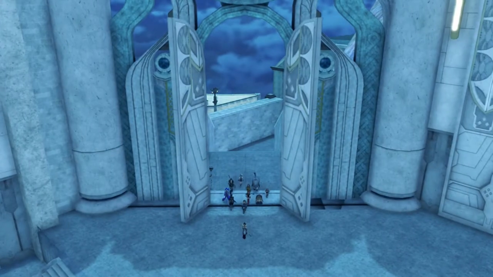

Fan turned around and spoke, "The Inner Praetorium is beyond this gate. Here you will find the main administrative facilities. With your permission, I'll show you to your lodgings."

---

Outside their lodgings, Hope spoke again, "Your audience with the Praetor is scheduled for tomorrow, in the Sanctum's Audience Chamber. If- there is nothing else, I shall take my leave."

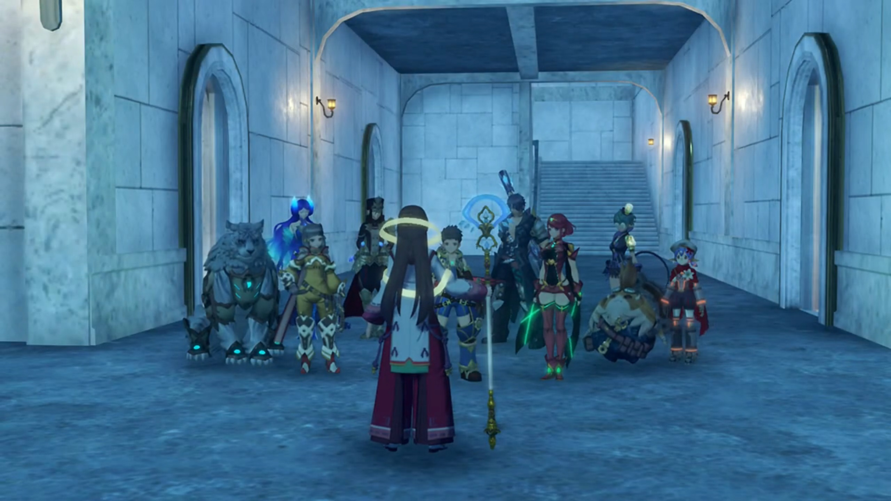

Rex: "OK. Thanks for all your help."

"M-My pleasure. Good night!"

"Night!"

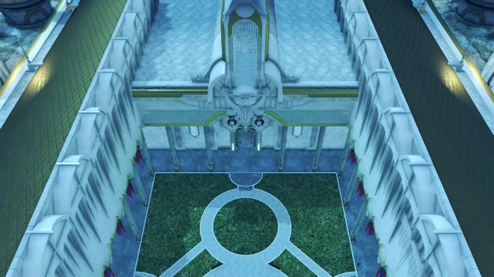

---

Rex's bed was just opposite of Pyra's. He asked, "Hey, Pyra. So, Addam... What kind of a person was he?"

She was meddling with a shirt, perhaps sewing, and turned to Rex, "Should I ask Mythra?" After all, she wasn't yet being created until she went to a 500-year nap.

His goosebumps raised and tinged, "**No, no,** it's fine. I was just wondering."

Pyra thought for a while, recalled, "He was incredible..."

"Incredible?"

"In Mythra's memories, I mean. I knew him only very briefly before I went to sleep... But Mythra can't remember a more... genuine... courageous person. She had never met a more... wonderful man."

"He sounds like a real hero." And our 'fake' hero here dropped on his bed, exhausted to meet his standard. 

"Mm hmm. **And you remind her of him... a lot!**"

"_Ohhhh, I do, do I? Great..._" Then, his tired mind realized what he'd just said, "**Wait, what?!**" He blushed and jumped back up. 

She giggled, "Huhuhuh! I suppose Mythra won't be very pleased I told you that."

"Pyra, c'mon..."

"I agree with her, you know."

He blushed even more, not sure how to react, looked over the tip of his eyes at her. But she was already deep in thought, the constant dimmed sadness she emitted continuously; Rex wondered what she held within that she won't yet share... Will she, one day? 

---

Rex woke up early in the morning, wandering the Praetorium himself, "Whew, it's cold this morning... Miss Fan?"

She was serenely looking at a huge mural painting, didn't heard him. Fires, people, were painted in. Nia was approaching behind and teased, "Oho, has somebody got a little crush?"

"**Nia!!! What are you doing here?!**"

"Early riser. Always have been." Fan was still deep in her thoughts, immersed in observing the painting, as Nia noted, "_Ooohhhh_, I see how it is here. I wonder what Pyra and Mythra would think..."

"**Hey, no! You've got the wrong... Just...**"

"Just- what? Go on?"

"**I dunno!** I thought she looked... sad."

Fan just heard them, greeted, "**Ohhh**, good morning, you two. There's- still some time before your audience."

They walked over, Rex apologizing, "Sorry, we just woke up reaaaaally early."

"Ah, I see."

"That's a pretty nice mural. Very... **grand.**"

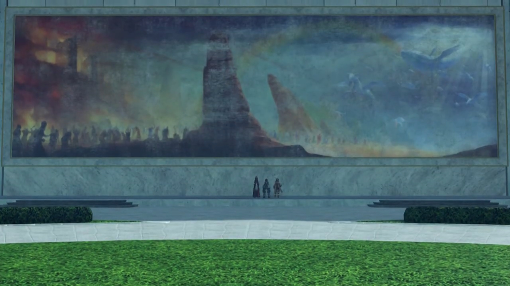

Hope introduced, "It depicts the creation of Alrest. They say this mural was painted long ago, when the nation of Indol was still new."

"_Huh..._ You've been looking at it for a while..."

"They're missing."

"What do you mean by 'they'?"

"My memories. I know that I must have been around since this mural was first painted, or even earlier, but... _I don't remember that time at all._"

Nia self-explained, "Well, you are a Blade."

"I don't know who I was, or what I did. And- I'd really like to."

Rex suggested, "Mythra's lived for an awful long time. Maybe she'll know something about you."

Fan recalled, "Mythra... called me... _Haze_, earlier. Could it- be possible that she met me somewhere before? Sometime in the past?"

"Do you wanna- ask her later?"

"**Could I? Thank you very much.**" She took his hand and prayed with gratitude. 

"N-no need to thank me. **You helped us too!**"

Nia observed, "Look at you, going all red. _I'll tell Pyra, I swear._"

"**WHA-?!!! I told you, it's not like that!**"

She teasingly nudged, "_We'll see..._"

---

Pyra had woken up, looking out the windows herself, deep in thought, when Brighid called out, "Hey, relax. You'll give yourself wrinkles." Out the window directly faced the mural painting Rex and Nia were at; perhaps she could see them? "A Driver and Blade are one- in body and soul. It was you who told me that. Well, the other you, I mean."

"You mean Mythra?"

"Of course, it was- five hundred years ago, so- perhaps you have forgotten."

Mythra sounded inside, "**Ohhh**, I- do remember saying that!"

Pyra wondered, "So it's true? **But how could she**... possibly remember..."

Brighid read her mind, "You're wondering how I could remember words... from so long ago?" She took out a thick notebook and handed her. 

"What's this?"

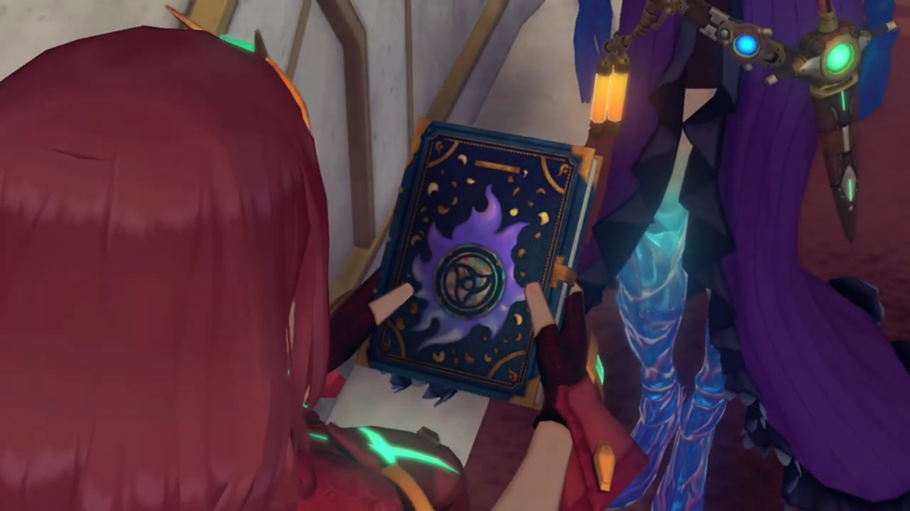

"You could call it a diary, I suppose. It contains details about my past lives. It's the only way I have to remember... When we return to the Core Crystals, _our minds are wiped **clean** of all memories._ Though a Blade's life is eternal, our- 'effective lifespans' as individuals, are far shorter than a human's. You know, it's not- just me. A lot of Blades try to preserve their memories in journals like this one. Even though **it's often** futile. After all, a Core Crystal cannot protect a diary. Usually, the volume is lost to us, along with our memories. I'm fortunate amongst Blades. I'm passed down as an imperial treasure, and recorded in official chronicles."

"Errr, Brighid?"

"I don't know where your true intentions lie. I can only make an educated guess. But Rex... He **is** your Driver. _If you truly trust him_, I would advise you tell him everything." The book feel heavy in her hands. She continued, "If you can't do that _even_ for him..." And she took her diary back, warned bluntly, "You shouldn't be his Blade- at all."

"I- just... ungh..."

"If you care about him, it's **even** more important. I know what it's like, to be afraid of rejection. **I really**- do. But... if you don't tell him now, you're just storing up pain for later, **not making it easier.**"

She tried to cover up her tears with smile, "_The way you say that... You really do see right through me._"

"Well... We go back a long way, as you recall. And we're both Blades, _after all._"

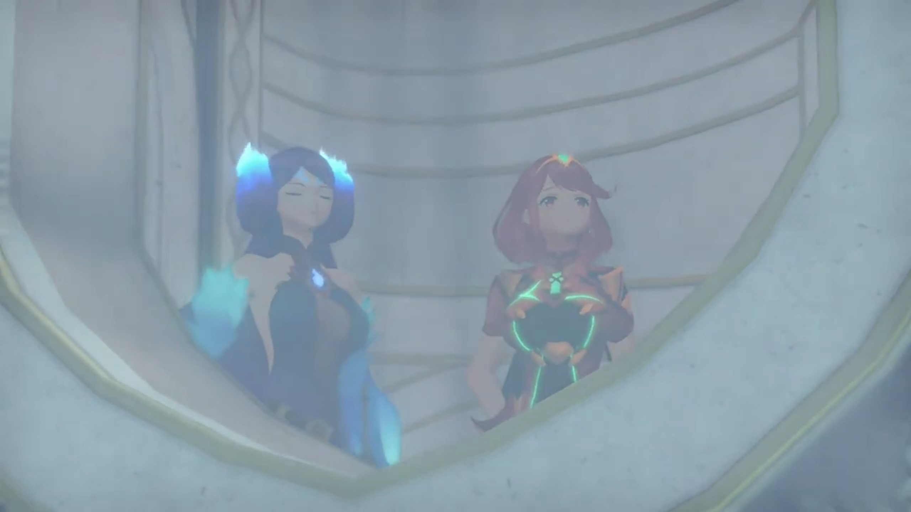

---

### Footnotes: