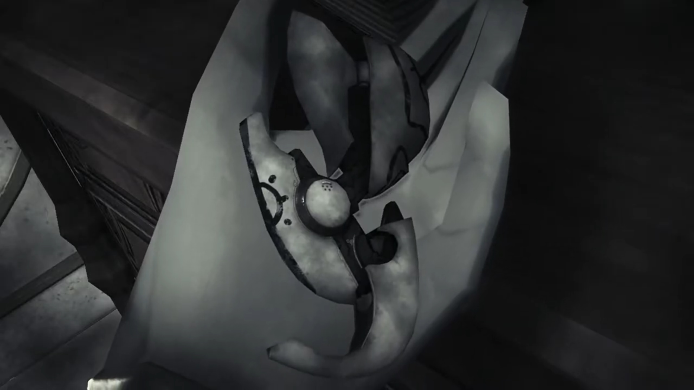
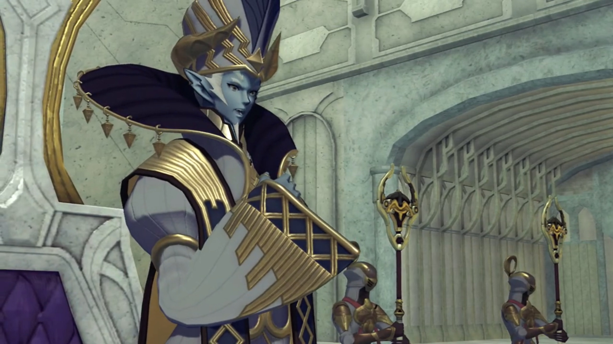

# The Return of the One-Eyed Monster, Meeting the Praetor

===

On their way to the boat, Zeke and Pandoria seemingly were waiting for them  for a long time already. "Finally. You took your sweet time." The grin; the grin and the eyes; it's back! 

Mòrag recognized him, despite she was the first time traveling with the group, "You're the..."

Nia welcomed him once more, didn't feel any surprised, "Hey, Shellhead!"

"Hey." He bade, don't fight with that now. 

Rex: "You just don't give up, do you? C'mon, out of the way."

Tora compared him to "More like stubborn leech than turtle."

"Hah! **This time I'm here for something a little bit- _different._**" He tucked his chest to the side and nudged at the group. 

Rex: "Ugh, what's that supposed to mean?"

"I want to see just how good you are, chum. I've been waiting here for three whole days already!"

Nia was surprised at his tenacity, "_Three days? Seriously?_" She pointed at him, "You know what, _no thanks_, I don't pick on idiots." Rex agreed. 

"Well then. Fight me and we'll see who's the idiot!" He took out his sword, and the shiny part pointed at them once again. 

"How did you know that we'd be here?" Rex wondered. 

"I'll tell you... if you can _beat me!_" Then he nudged to the so-long quiet Mòrag, asked, "You want to join the fun too?"

Which she replied, "No, you- all- go ahead."

"Huh? Why?" Rex questioned. 

"What- a- shame! Looks like the illustrious Flamebringer won't be helping you this time."

Nia don't see the problem, "Thanks for the concern and all, but _may-be_ you should be worrying about yourself. Big tree to your right, big rock to your left, and a cliff, right behind you. Which one's gonna get you this time, eh?" The group effetely took out their weapons, don't feel like fighting something whose final moves never hit 'em. 

Surprisingly, Zeke was quite strictly replying, "Not today, furry ears. Check this." He bent down more and pointed at the group; they were still not at their fighting spirit, assuming he won't do them harm, waiting for his move leisurely. Then, with a lightning bolt, electricity splattered on his surface; before the group knew it, they were in mid-air. Rex: "**WHOA!!!**"

Mòrag looked at them, but didn't interfere. On the ground, the surprised Nia: "What the-..."

"Well? **Feel like taking me seriously yet, hmm?**"

Tora sighed, "S-so strong..."

Nia: "What the... How'd he do that?"

Mòrag introduced him officially: "Thunderbolt Zeke. Tantal's most powerful Driver... and its Crown Prince."

First time the group knew. "Crown Prince of... Tantal?!"

Rex can't believe it too, "**This guy?!**"

Mòrag: "It is quite the rare opportunity to see his... swordsmanship first-hand."

He felt the praise, yes, the praise, his nose up and high, floating above the cloud sea, "_Now this is more like it. Oooh, come on, yeah! Keep it coming!_" After all the Shellhead and stuffs, finally someone appreciates! Oh, the respect!

But his ugly face, Mòrag turned away from, refused to continue the praise. Brighid blocked Fan's sight, to prevent such obscenity from tainting her pure heart. Zeke was not satisfied, "**That's it? That's all I get?!** Ugh, fine. Anyway, ready to... concede defeat to the Zekenator?"

Rex had stood back on ground, "As if! We're only just warming up, you- **pompous** arse!"

Pyra agreed, transferring power to Rex, "I'm right with you. **Let's show him what we got!**"

"**Hahahahah! YESSSSS!!! Let's see if the Aegis is worth the hype! HYAAAHHHH!!!**" And the fight began. 

---

He dragged back along the port with his back bent like moon shape; as he spring back upwards, he commented, "Not bad, chum."

Rex: "Right back at you. Impressive! Didn't think I'd ever see another Driver and Blade... on Mòrag and Brighid's level..."

"You're still holding **back. Where's the Aegis's _true_ power?**"

"Mythra's power is only for fighting- bad guys."

"_Ahh, that's so sweet._ **So I'm a good guy now, is that it?!**"

"**Am I wrong?**"

He stayed for a while, grinned, and laughed as if epilepsy seizures took over him, "Pfff **AHAHAHAHAHAHAH!!! I like your attitude there, chum!**" Then he sheathed his weapon. Pandoria got beside him to prepare for the show yet again, "Well, that's an Aegis's Driver for you."

Fan asked, "How did we do, Your Highness?"

"**Sure, you pass.** I think we can just- about- let you into the Praetorium." 

Nia: "What the hell?!"

Zeke explained, "**I've been working for Indol** for a while now. A kind of... _special envoy._ They asked me to keep an eye out... for the Aegis. Actually, I volunteered to. _You know how it is. I'm jolly sorry... for testing you like that._"

Pandoria revealed the bloopers, "We **were** planning on getting this over with in **ONE** encounter. But- His Highness has the most **awwwwful luck**, so..."

Rex already knew, "Yeahhhh, I think I got that."

Zeke cannot accept his bad luck, tried to explain himself to Pandoria, "**What are you talking about? Everyone has bad days, right?**" And he leaned on the wooden gate by the edge of the port; the thing break under his weight. 

The group exclaimed, "**AH!!**"

He couldn't managed to get up, tried fluttering himself up but failed, "**AHHHHHHHH!!! WHY MEEEEEEE???!!!**" And down he goes, plunging straight for the Cloud Sea. 

Nia already expected it, "There he goes." They gathered by the edge where he fell and just watched him, including Pandoria. 

Dromarch was putting his whole body weight on the fence just beside the broken one, and it didn't snap, he agreed, "Mmm, bad luck indeed." Nothing was seen floating out of the Cloud Sea, however they tried to look. 

Pyra felt anxious, asked Pandoria, "Uhhh... Should we go rescue him?"

"Naaaahhhh, he'll find his own way back up somehow. L-Let's just... board the ship!" And she lead them onwards. 

---

The Holy Praetorium was the only town on the back of Indol, a relatively small Titan compared to Mor Ardain and Uraya and Gormott. The stairs and the huge arcs, leading up the back of the Titan that formed a hill. All buildings were short, except the Praetorium{{footnote: Think of the Praetorium as a building that has the same function, looks the same, like a Church. It _is_ a Church.}}. This is the **Indoline Praetorium.** 

Tora exclaimed, "Ahhhh, soooo pretty..."

Poppi agreed, "Amazing!"

Pyra: "Whoaaaaa!! It's so- grand..."

Mythra replying inside, "_Sure, because they're trying too hard._"

"You- don't have to be like that..." She said it out. 

Rex overheard it, was confused, "Hm? Did you say something?"

"Oh, no, nothing."

Fan relayed the info, "Your audience with the Praetor is- scheduled for tomorrow. Before that, _maybe_ you'd all like to have a look around?"

Rex exclaimed, "**See the sights of Indol?** Sounds like a pretty rare opportunity!"

Tora and Poppi were equally excited, "**Yeahhhh!! Let's look around city!** Tora want to see- **everything!**"

Nia shook her head, "What are we, tourists?"

Dromarch: "_There's no harm in that, is there?_"

Even Gramps: "This would be a first for me, too."

Rex understood, "Rigggghhhttt, you were a bit big to go running around Indol before now."

Nia imagined it in her head, laughed, "_Now that's a funny image._"

---

They went up the stairs and saw, by one section of the wing, various tents set up in random fashion, but mostly around the side and center, leaving a main road in an arc in between. Weak, hungry people were sitting down; children still had the energy to play. A signboard with words written on it, Nia read as, "'No More Blades, No More War'... What does that mean?"

Zeke appeared out of nowhere behind her, explained, "That, my fuzzy-eared friend, is an anti-Blade protest. The refugees have **really** been **going at it** since last year or so."

She and Rex turned around, jumped on their feet, she exclaimed, "**Whoa! Where'd you come from?** What'd you do, swim here?"

Tora was more concerned with the protests, asked, "Did- Blades- do something wrong?"

Mòrag explained, "The Praetorium is single-handedly responsible... for doling out Core Crystals to other countries. _Though_, sometimes the likes of Dughall and Bana grab a piece of the pie."

Dromarch concluded, "Therefore, Indol has the power to control war itself?"

"That's one way of looking at it, _at least._"

Nia don't understand, "But war's about much more than just Blades and Drivers!"

Pandoria: "**I know that, and you know that**, but that doesn't mean **they**'re gonna accept it."

Rex: "I guess so..." He observed closer, noted, "There's a lot of... Gormotti here..."

Gramps explained, "They fled the Gormotti War... ten years ago. But here they are, refugees still..."

Zeke waved his had, "Yes. They're a funny old lot, you know. We feed them, we water them, **and this is the thanks we get. Don't these ruffians know- that manners- cost nothing?** I swear, **you lend these people a hand and they want the whole, bloody arm.**"

"It's easy to disregard things beyond your control, and- direct your anger- at targets- closer to hand."

Rex dropped his head, thinking, "Mmm..."

Mòrag asked, "Do you have something- to- say?"

"Not really."

"Out with it, Rex."

"Mor Ardain's Titan -- it's dying, and everybody knows it. That's why they -- why _you_ need Gormott."

"Our population is large. Larger than Uraya's."

"But you don't have the resources to support all those people..."

"You are astute for someone so young."

"Us salvagers pick up more than just artifacts. I'm not daft. I know fine words alone won't change reality."

"So you seek Elysium."

"Is that wrong?"

"No. I was just reminded how young you are."

Nia: "Still, if it's Rex, or people who harp on about justice with no solutions, I'm bettin' on Rex."

"I must admit, I do respect the boy's drive."

Rex: "Ahhhh, I'm just stumbling my way forward." Who says those refugees aren't? 

---

Halfway between the stairs up to the Praetorium, Pyra stopped and asked, "Mòrag, can I ask you something?"

"Go ahead."

"Rex is the one who... woke up Mythra. And **I think he**... appreciates... what that means."

"And?"

"It's just that, well... Y-You're not doing anything to stop us. Why is that?"

She thought for a while before answering, "Because- _of Addam._"

"_Huh!_" She waited. 

"Five hundred years ago, he became this **great** hero, who we celebrate even today. But I know him only through legends. A chance to see what his Blade is capable of for myself? **I confess- I- was intrigued.** So- here I am."

Rex objected, "You know I'm not Addam, right?"

"But- you **are** the Aegis's Driver. The second you're under imperial control, you won't be that hero anymore."

He scratched his head, "_Hmmm..._ I'm not sure I follow."

Pyra understood it as "People with great power... should be their own masters? Is that what you mean?"

"Close enough. You can interpret it that way if you like."

Zeke: "Heh! Even the mighty Flamebringer can be **bloody** hard work sometimes. **Can't you just admit the REAL reason?**"

She turned away, replying, "I don't like what you're implying." And walked away.

---

The door to the Praetorium was huge; so huge it didn't look movable by persons on the ground. There were people inside this empty square. 

Fan turned around and spoke, "The Inner Praetorium is beyond this gate. Here you will find the main administrative facilities. With your permission, I'll show you to your lodgings."

---

Outside their lodgings, Hope spoke again, "Your audience with the Praetor is scheduled for tomorrow, in the Sanctum's Audience Chamber. If- there is nothing else, I shall take my leave."

Rex: "OK. Thanks for all your help."

"M-My pleasure. Good night!"

"Night!"

---

Rex's bed was just opposite of Pyra's. He asked, "Hey, Pyra. So, Addam... What kind of a person was he?"

She was meddling with a shirt, perhaps sewing, and turned to Rex, "Should I ask Mythra?" After all, she wasn't yet being created until she went to a 500-year nap.

His goosebumps raised and tinged, "**No, no,** it's fine. I was just wondering."

Pyra thought for a while, recalled, "He was incredible..."

"Incredible?"

"In Mythra's memories, I mean. I knew him only very briefly before I went to sleep... But Mythra can't remember a more... genuine... courageous person. She had never met a more... wonderful man."

"He sounds like a real hero." And our 'fake' hero here dropped on his bed, exhausted to meet his standard. 

"Mm hmm. **And you remind her of him... a lot!**"

"_Ohhhh, I do, do I? Great..._" Then, his tired mind realized what he'd just said, "**Wait, what?!**" He blushed and jumped back up. 

She giggled, "Huhuhuh! I suppose Mythra won't be very pleased I told you that."

"Pyra, c'mon..."

"I agree with her, you know."

He blushed even more, not sure how to react, looked over the tip of his eyes at her. But she was already deep in thought, the constant dimmed sadness she emitted continuously; Rex wondered what she held within that she won't yet share... Will she, one day? 

---

Rex woke up early in the morning, wandering the Praetorium himself, "Whew, it's cold this morning... Miss Fan?"

She was serenely looking at a huge mural painting, didn't heard him. Fires, people, were painted in. Nia was approaching behind and teased, "Oho, has somebody got a little crush?"

"**Nia!!! What are you doing here?!**"

"Early riser. Always have been." Fan was still deep in her thoughts, immersed in observing the painting, as Nia noted, "_Ooohhhh_, I see how it is here. I wonder what Pyra and Mythra would think..."

"**Hey, no! You've got the wrong... Just...**"

"Just- what? Go on?"

"**I dunno!** I thought she looked... sad."

Fan just heard them, greeted, "**Ohhh**, good morning, you two. There's- still some time before your audience."

They walked over, Rex apologizing, "Sorry, we just woke up reaaaaally early."

"Ah, I see."

"That's a pretty nice mural. Very... **grand.**"

Hope introduced, "It depicts the creation of Alrest. They say this mural was painted long ago, when the nation of Indol was still new."

"_Huh..._ You've been looking at it for a while..."

"They're missing."

"What do you mean by 'they'?"

"My memories. I know that I must have been around since this mural was first painted, or even earlier, but... _I don't remember that time at all._"

Nia self-explained, "Well, you are a Blade."

"I don't know who I was, or what I did. And- I'd really like to."

Rex suggested, "Mythra's lived for an awful long time. Maybe she'll know something about you."

Fan recalled, "Mythra... called me... _Haze_, earlier. Could it- be possible that she met me somewhere before? Sometime in the past?"

"Do you wanna- ask her later?"

"**Could I? Thank you very much.**" She took his hand and prayed with gratitude. 

"N-no need to thank me. **You helped us too!**"

Nia observed, "Look at you, going all red. _I'll tell Pyra, I swear._"

"**WHA-?!!! I told you, it's not like that!**"

She teasingly nudged, "_We'll see..._"

---

Pyra had woken up, looking out the windows herself, deep in thought, when Brighid called out, "Hey, relax. You'll give yourself wrinkles." Out the window directly faced the mural painting Rex and Nia were at; perhaps she could see them? "A Driver and Blade are one- in body and soul. It was you who told me that. Well, the other you, I mean."

"You mean Mythra?"

"Of course, it was- five hundred years ago, so- perhaps you have forgotten."

Mythra sounded inside, "**Ohhh**, I- do remember saying that!"

Pyra wondered, "So it's true? **But how could she**... possibly remember..."

Brighid read her mind, "You're wondering how I could remember words... from so long ago?" She took out a thick notebook and handed her. 

"What's this?"

"You could call it a diary, I suppose. It contains details about my past lives. It's the only way I have to remember... When we return to the Core Crystals, _our minds are wiped **clean** of all memories._ Though a Blade's life is eternal, our- 'effective lifespans' as individuals, are far shorter than a human's. You know, it's not- just me. A lot of Blades try to preserve their memories in journals like this one. Even though **it's often** futile. After all, a Core Crystal cannot protect a diary. Usually, the volume is lost to us, along with our memories. I'm fortunate amongst Blades. I'm passed down as an imperial treasure, and recorded in official chronicles."

"Errr, Brighid?"

"I don't know where your true intentions lie. I can only make an educated guess. But Rex... He **is** your Driver. _If you truly trust him_, I would advise you tell him everything." The book feel heavy in her hands. She continued, "If you can't do that _even_ for him..." And she took her diary back, warned bluntly, "You shouldn't be his Blade- at all."

"I- just... ungh..."

"If you care about him, it's **even** more important. I know what it's like, to be afraid of rejection. **I really**- do. But... if you don't tell him now, you're just storing up pain for later, **not making it easier.**"

Tears in the tip of her eyes, she smile regardless, "_The way you say that... You really do see right through me._"

"Well... We go back a long way, as you recall. And we're both Blades, _after all._"

---

Sometime in the past. The young Amalthus stood where Fan stood, deeply absorbed in the mural painting. The rocks, the people, the mountains... He went back to his room, closed the door behind, and walked over his table. What of the broken artifact, a shard beyond comprehension? 

The window behind him, the World Tree glow brightly in the night. He could see, he saw it, that's his destination. The calling in heart, it says, "_Father waits, above..._"

Despite thunder and lightning, his muscles sore, his skin bled, he did not care. Up and up he went, up the World Tree, with no other equipment than one's hands and feet. Memories faded, attention lingered, tiredness accumulated, dizziness sprung forward. But when he reached the top, was not what he'd expected. A lush evergreen meadow heaven? No. Some buildings stood, but there was no one around. 

He lit a fire torch, followed the tunnels; the imminent darkness, he could see nothing else other than plain plain plain. What make of the people who once lived here? He don't know. But one thing was sure -- to search every inch of the place until he found what he was to find. He delicately touched the door, and it shook; mechanism were being activated, and the door to Pandora opened before his eyes. The gleaming brightness beyond, shall we say, his hopes too high? 

Run, run, run; pant, pant, pant; He dashed for the exit. No, he don't want to stay here any longer. Where was it, where he had came up from. Ah, here! As fast as his arms and legs could, without risking his life, he climbed down, faster, faster, faster, but no, safer, safer, safer! Slowly, one foot by one foot; but who walked beside a river doesn't get his shoe wet? One mistake and he slipped, down he went, faster, faster, faster, with no friction, plunged straight for the Cloud Sea, no one to save him. 

He opened his eyes, ouch, what's that burning sensation in one's chest? Is one dead? No, this is, Cloud Sea, Alrest, oh right, one fell on one's feet. Where is one? A branch? Oh, still on the World Tree! What strong branch to withstand one's fall. But what he cared about, is the two crystals he brought back, tucked beneath his shirt. Was it still there? He vehemently looked; yes, the shiny reflection one can see. Yes, hoof! 

Never found the Praetorium was such a long journey away, but luckily, one's back, alive and safe, to one's comfort zone. Inside his room, he took out the two crystals, placed them side by side. They floated mid-air, like sexy lady luring him to resonate with them. The dark purple one on the left? The light green one on the right? Which feels right? What do one wish to achieve? Which can help me achieve what one want to achieve? His eyes looked to the right, his hand reached for the middle.{{footnote: Follow thy heart, not thy eyes!}} Why not both?

"_Praetor?... Praetor Amalthus?_" Who is that calling me there? Wait, Praetor? Yes, Praetor. One's now a Praetor. No, this is the past. 

---

Amalthus was daydreaming, eyes closed, in the Praetorium when someone called him. The door opened, and he had audience with someone working for the Praetorium{{footnote: One don't know the exact role, so one can't say what equivalent role in a Church one can label him.}}. "The boy has arrived, Your Eminence."

"Thank you."

---

He sat at the audience chamber, accompanied by some soldiers and the guy whom notified him just now. Seated on the King's chair, the group walked in. He started speaking, "So you're Rex. I've heard much."

"Hi, err... Y-you're not- the Praetor, are you?" 

Nia: "Huh? No way."

"Indeed, I am Amalthus. I understand your surprise. I imagine you expected somebody older."

Rex: "We heard that you were- Cole's Driver... **Y-Your Eminence! Sorry, sorry!**"

"No need for formalities. I am **a mere- representative** of the Praetorium. The name- 'Praetor'- is simply a... **decoration**, if you will. In any case, we're the same, you and I. **Aegis Drivers**. I consider us... **equals.**"

He scratched his head at such praises from the high, "**Ahahah**, I feel a bit better now you've put it that way. Your Eminence."

He turned his eye on Pyra, noticed, "You're different somehow. I seem to recall a more **forceful** personality."

Pyra: "_Huh..._"

Rex: "**Oh! I almost forgot, here-**" He took out Cole's dagger. The soldiers, seeing a weapon, immediately pointed their long-axe weapons at him. Amalthus waved at them to back up. As they stood straight yet again, Rex continued, "I got this... from Cole. He said it belonged to you. Please!"

"Ahhhh, Cole... _That brings back memories._"

Someone took the weapon from Rex and handed it to him. 

Rex explained their purpose, "We're looking for a way to Elysium. Cole told us... that **you** would know the way. I have to get to Elysium! _To_... to save Alrest... any way I can! I mean, we won't know for sure- what we can do until we get there, I suppose. _But if_ the stories are true, it's somewhere we can all live safely! **It has to be real!**"

His voice started to change, like a broken radio. It sounded like there was two voices within him. He sounded like... Malos... "Long ago. Too long ago, I used to think like you. Indeed, it led me to climb... the World Tree. However, I did not find Elysium. **Or**... the Architect. I believe... it was because I was... **unworthy.**" Is that him who was speaking, or is that Malos? Or is he already influenced so deep by Malos he's under Malos's control? 

He continued speaking, this time sounded more normal, "Rex, _I know your desire all too well._ I shall **help** you... on your quest."

Rex was overwhelmed, "**Really? Oh, thank you sooo much!**"

"No need for thanks. This may be my destiny. The reason... I've lived all these years. **And now...**" He looked to Pyra. 

She introduced, "Pyra. My name- is Pyra."

"I would be honored, to have a moment alone with- Pyra. I'd like to... _reminisce_- a little."

---

Without Pyra, they exited the audience chamber into the open. Nia was impressed, "So old man Cole really did know the Praetor. Who'd have thought?"

Tora: "World is small place."

Rex worried, "Will Pyra... be OK- by herself?"

Nia don't understand, "He's the Praetor, dimwit. What's he gonna do, eat her?"

Rex shared, "Back there, I felt something **weird**, for a second."

"What?"

"Urmph..." Should he share it? That sounds so weird, and so, out of logic...

"Rex?"

"It- felt- like we were talking to that Malos guy."

She immediately dismissed him. "You're imagining things. **You know** he's Malos's Driver, and it's messing with your head."

Poppi: "They not seem alike to me."

Rex shook his head, "No, I know... it was just for an instant! Just this one moment, where I couldn't tell if we were talking to the Praetor or Malos... Sorry, I'm not explaining it well..."

Gramps understood, shared, "There are- Blades who are- influenced a lot- by their Drivers- during resonance. Their appearance, their personality... That's _probably_ all it is."

Dromarch hypothesized, "Perhaps it was due to your bond with Pyra. That could have heightened your perception of such things." But they don't know... Is it true? He still had doubts, but he couldn't prove anything, nor observe further, at least for the moment. 

---

He brought her to look at the mural painting, the birth of Alrest, shared, "It was painted 1500 years ago. Even through exposure to the elements, it has never needed repair. Always as pristine as the day it was made. The technique is long-forgotten. I often wonder if we are **growing** as a people... or in fact, **regressing**. What do you think?"

Pyra don't know. Whom he wanted to reminisce with, was Mythra, so she took over, waiting for this moment long enough. "I'm just amazed... at how little you've changed. Has nobody ever wondered _about that?_"

"I am Indoline, and the Driver of an Aegis. **It keeps me** young."

"If you say so... **Why do this now**, though? **You've**- never let anyone go there before, have you?"

He looked away, back at the mural painting, replied, "Times change, Mythra. So do people."

"That's **not** an answer."

"I would like to **believe**- there is one- who can reach the Architect- and save- this **dying** world. Is that really- so strange?"

"**And Rex** is the one?" she asked seriously. To get him involved in this? 

"Would you have resonated with him, if he did not hold- such potential?" Who knows what they're thinking in each other's head? 

---

Temperantia. Night. Things were calm; nothing special. At least not until Jin miraculously and silently appeared without disturbing the guards on duty. His speed so quick no one can react. The road to the center artifact where the Senator last stood was cleared and emptied. Jin observed, "It's still intact after all these centuries. _Amazing._ The pinnacle of Flesh Eater technology..." 

Jin got into the device, placed his arms on the controls. "Tenacious creatures, humans."

Oh, how Lora tears rolled down her cheeks, what history he cannot change, all energy receded from his body, he could not struggle against, as she said, "_I'm so sorry to do this to you..._"

His heart beat strong; he could hear it. Why? Why had you not asked what my thoughts are? We could have faced it together; but why? Why do you have to sacrifice yourself for... His grip on the controls got tighter and tighter as anger rushed through his chest. 500 years had not extinguish the flames a little; it'd burned even wider, like growing forest fires in an endlessly vast forest. He activated the weapon, and the Titan shook as it came to life. The mechanism that had slept since its fall, was like a sleeping lion came back to life, ready to poach. The metal structures built on it by the Senator's army started to topple as the weapon pushed itself against, freeing itself. 

Jin await for its engine warming, to stretch itself to its full before regaining strength. 

---

Outside their room, Brighid was speaking to a soldier. "I see. Very well." She returned into the room. Mòrag was looking outside the window, hearing Brighid's relaying the info, "It appears Senator Roderich paid a visit to the Praetorium last night, **off** the record. Did you know that?"

"No. I haven't heard anything from His Majesty. Why now, I wonder? I can't imagine he was **just** paying his respects."

"Do you think it's something to do with the excavation? Temperantia?"

"Hmm... The issue HIs Majesty mentioned? If that **is** the case, he must be making covert deals with the Praetorium. **Curse that man!**"

---

A heavily-guarded area by floating battleships and ground units, the ground suddenly shook. The ground unit prepared their defense, when the Judicium weapon, a living Titan, roared. Step by step, it marched towards the frontline. Every step shook the ground, plunging holes in the soft dirt. It raised its back, and the ranged weaponry aimed at the frontline, charging. 

Fully charged, it fired thousands of beams that swirled, each aiming for a different battleship. The whole frontline were lit in flames; they couldn't do anything quick enough to prevent it. Jin watched emotionlessly, to hell the humans go. 

---

In the dormitories, while they were resting, the Praetorium person that reported to the Praetor earlier entered with slightly panicking voice, held his composure, and spoke quickly, "Sincere apologies everyone, but I come with an urgent request." Everyone quickly dashed out of their room, the guy instructed, "**Please go to the Audience Chamber at once!**"

### Footnotes: