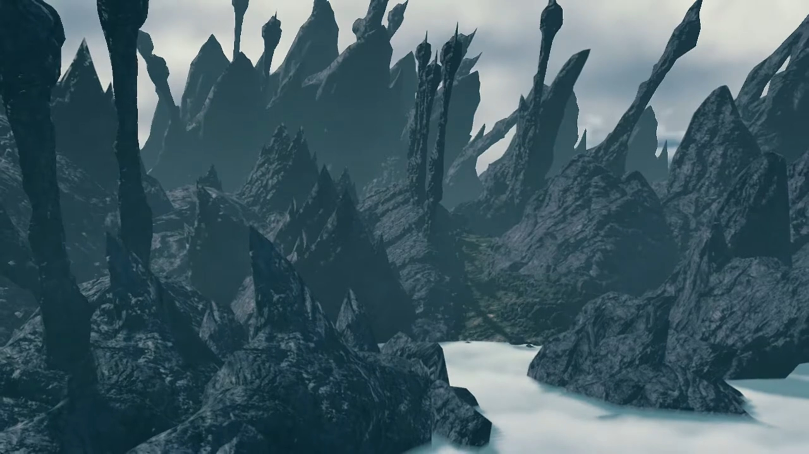
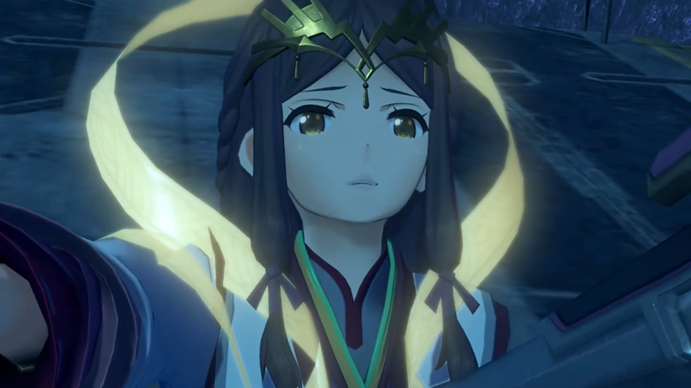
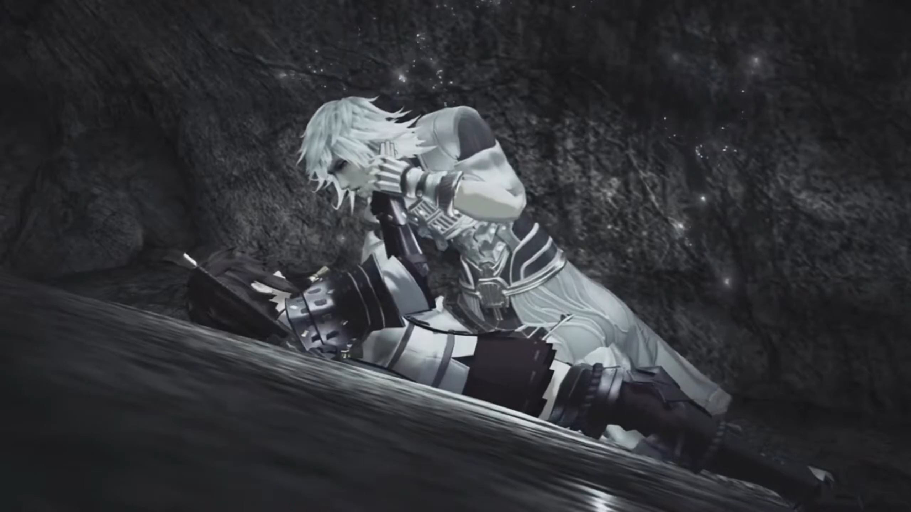
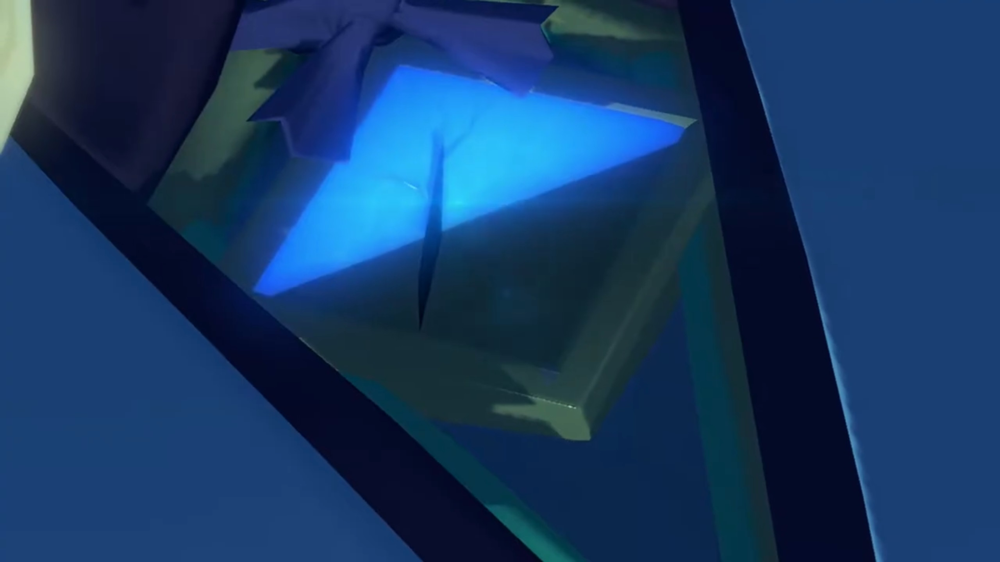
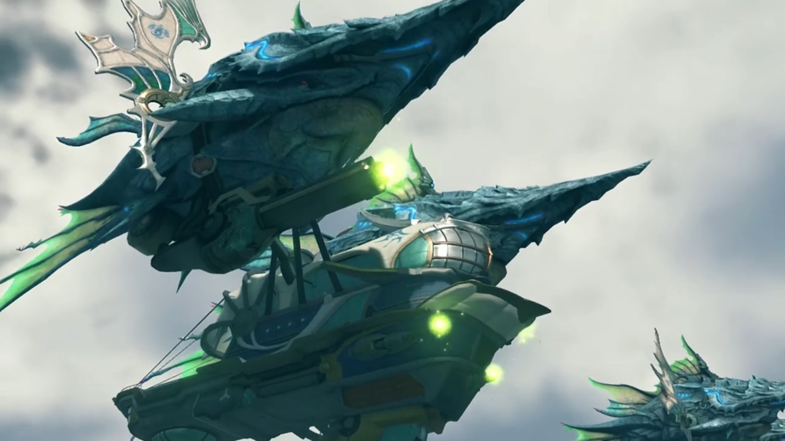
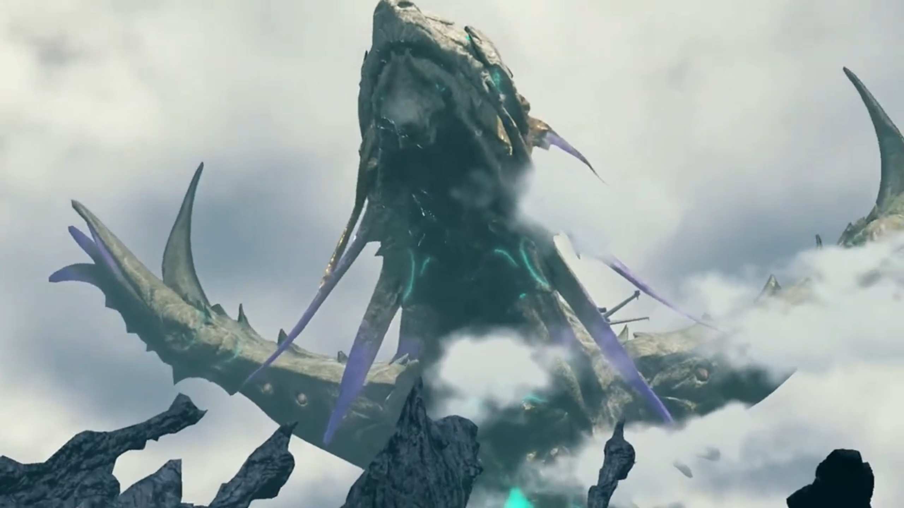

# Off to Temperantia, Encounter with Jin

The group met Amalthus and Fan at the Audience Chamber. Amalthus briefed them, "As you may know, there is a demilitarized zone between Mor Ardain and Uraya. Temperantia. Think of it as a buffer between the two nations. We've received word of- _fighting_- in the area. Mor- Ardain- are in possession of a _Titan_ weapon. They're advancing as we speak towards the Urayan garrison."

"**Impossible!**" Mòrag hadn't heard about any instruction from the Emperor for attacking Uraya, nor does she believe her brother would make such a choice. 

"Well, the two countries' Titans are at their closest right now..."

"**You're saying we were WAITING for a chance to strike? Unthinkable! Our people would NEVER go to war against His Majesty's will!**"

Brighid logically urged, "At any rate, we must investigate."

"_Yes... You're right._ Praetor, I beg your leave. We need to find out what's going on. Your Eminence."

"Thank you." And she and Brighid left the room. 

"Your Eminence, we..." Rex wanted to help, but he needed permission. Amalthus broke his sentence, speak,

"Might I ask you to assist Special Inquisitor Mòrag- in her investigation?"

Pyra accepted it at once, "We have no reason to refuse. **And** you- needn't worry about me."

"I am quite grateful to hear that."

Rex urged, "**Let's go** after them, hurry!" And they left the room. Fan gave her bow, despite they're no longer looking. 

---

Senator Roderich, in his living quarters with the soldiers, was enraged, "**Who?! Who's responsible for this?! Preparations are still ongoing,** if we attack now, we could-"

Mòrag immediately walked in with Brighid, "**What, have you done, Senator Roderich?**"

"Special Inquisitor?! What are you doing here?"

She didn't have the obligation to answer him, continued, "**The Emperor ordered that the dig be halted.** He was VERY specific, Senator. If you've restarted it, you have **violated- His Majesty's will.**"

He argued, "The Emperor doesn't understand Mor Ardain's urgent lack of resources. **This is** for the Empire."

Mòrag shook her head, cannot agree, "Your patriotism is touching. But **that** doesn't explain why you're waging war **with Uraya!**"

"It wasn't me! I did not give that order! Even **I** would never **dream** of... declaring war without His Majesty's express consent!"

"So **who** in the..."

"Mòrag!" Rex entered the room with his friends. 

Roderich cannot believe random people can enter when they're having a meeting, burst into rage, "**Who... who are these people?! Bursting in here?**"

Mòrag introduced, "This- is the Driver of the Aegis. You are to afford him the same respect as me."

"_This is him?!_ I'd heard the rumors, but this **boy**..."

Rex dismissed the cliché deprecating statement he'd heard too much, more concerned and impressed with "There are rumors now? Wow, am I **really** that famous?"

Brighid explained the reason for his celebrity status. "Do you have any idea how much it costs to repair a _water tower?_ It's a lot."

Rex's eye sagged down, with Gramps commenting, "So, less famous, more- infamous."

Anyway, back to the point, Rex tucked his fame within his belly and got to the point, questioned, "Mòrag, is Mor Ardain **really** attacking?"

"They are. _As much as I **hate** to admit it._"

"**Tell me** -- what's going on?!"

---

After the story, Dromarch noted, "Tricky indeed. If this escalates into all-out war..."

Roderich agreed, "The timing is all wrong. **We can't** win this fight, **not** now..."

Zeke hated it, "Sounds like you WERE planning to start this sooner or later. Sly rat."

Rex urged, "Maybe save the accusations for now."

Mythra took over, asked, "But the Empire never really wanted a war, did it?"

Only now did Roderich focused on her, noticed, "That Core Crystal! Don't tell me you're the-"

"**ANSWER me!**" She snapped. 

He was intimidated by the legends, stuttered, "_Y-y-y-you're right._"

Rex: "Mythra?" Had she anything to add? 

She was considering different point of views, voiced her opinions in questions, "Who stands to gain from an Ardainian-Urayan war?"

"Who gains... **You don't mean...**" The first group that immediately came into their mind. 

Nia concluded, "**Jin and Torna!**"

Poppi: "It very possible."

Gramps: "But- how?"

Tora: "Maybe- just coincidence after all...?"

"_Masterpon_." Poppi sighed, can't believe how innocent her masterpon is. 

Rex: "I wish I could believe that."

Roderich pleaded, "Inquisitor Mòrag, please. **You are** the only one who could put a stop to this!"

"It's a bit late for that, **don't you think?** _But_ I'm not going to sit back and watch. **Brighid!**"

"Right." And they walked out the room, decided to deal with it themselves. 

"Mòrag..."

"Rex, this is an imperial matter. We can't ask for your aid in this affair."

"Not if it's really a coincidence, like Tora said. **But**... if Torna are really involved, doesn't that make this **our** problem, too?"

"_But..._"

"Think of it as- _compensation_ for the water tower! How's that?"

Nia already guessed, "I knew you'd go there."

Zeke: "You're so noble it hurts."

She thought for a while, weighing the pros and cons of involving the Aegis in all these, decided finally, asked formally, "Very well. Can I ask you- to help me again?"

Rex: "**Yep! We're on the case!**"

Mythra: "Yes, of course." Senator Roderich was too guilty to face them, looked aside on the floor as they were discussing. 

"I'll accompany you." A voice from the entrance. 

"Fan?"

"What's happening in Temperantia right now... It's being led by a weaponized Titan, correct? My power doesn't only affect Blades. It also works against Titans. **I**- am- certain... I can be of assistance. **Besides**..."

"Besides?"

She thought for a while before mustering the courage to share, "I-I have the strangest feeling that... I'm somehow **meant** to be there."

Oh no... meeting with Jin? Mythra don't know what to say about it. "Fan la Norne, you..."

---

They were waiting for their ship being prepared at the port. Meanwhile, they gathered around in a circle, talking. Nia was notorious about, "Hey, remind me again why we're bringing this spanner?"

Zeke answered for himself, "Because this sounds like fun."

"We're not on holiday here."

"I've heard a lot about _these Torna people._"

Pandoria added, "They're the ones collecting Core Crystals, yeah?"

"And besides... **I can't pretend** this doesn't concern us, too. _Not when they're calling themselves... Torna..._"

Nia wondered what he'd got to do with Torna. Rex looked at her and Mythra, to see if they'd any idea what he's talking about. Why so serious suddenly? She urged, "Shellhead?"

---

The ship drifted slowly towards Temperantia; it was near now. A soldier reported, "Lady Mòrag, greetings. I have news from the front. Our Titan weapon has crossed the central border! It's advancing at about 40 titanpeds per hour!"

"Hmm. I want to get in front of it." she ordered. "Is there a suitable place to dock?"

He immediately replied, "There's a bay **fairly close by.** If you dock there you **should** be able to get to the cliffs above it."

"Understood. **Go.**"

"Yes, ma'am."

---

**Temperantia**, a battle scarred land, a layer of black soil painted every inch of the land. Spear-like hills stretched to the sky in great numbers like porcupine. What is the Titan, actually? 

---

They reached the top of a ledge, easy for them to observe the battlefield. Flames consumed the Urayan frontline. The sheer heat released even distorts light. The lifeless corpses littered the ground. Brighid felt, "How awful..."

Zeke agreed, "Mmm... They didn't stand a chance."

Rex's eyes swiped over the battlefield and located their target. "**Look! Over there!**" The giant Titan continued moving slowly towards its destination. Then, it raised its weapon again, aiming at the frontline. 

Mythra warned, "**Watch out! Here it comes!**" They were also within range; some shot the rocks on the ledge they stood, but ducking low...

"**AAAAAARRRGGGGGHHHHHH!!!**"

Rex got back up unscathed, "Ungh! **Everyone, OK?**"

Zeke assured him, "Just about, I think." 

Yet, not everyone were as lucky as them. The Urayan soldiers running for their dear lives below were not. Worse, flames blocking their way acted as bottlenecks, prevented them from escaping fast -- at least not fast enough to escape the jaws of the Judicium weaponry. 

"We have to stop it." Rex announced. 

Nia wondered, "How do we do that?!"

Mòrag had gotten the blueprints from Roderich, researched it, and shared, "On its back, there's an Ardainian drive mechanism. If we can... somehow sever the cables connecting it to each leg, its energy supply will be cut off. It'll stop."

Dromarch thought of something better, "Lady Mythra, I presume you'll be able to destroy them?"

Rex found that straightforward "Good plan!"

Mòrag half-agreed, "Sure, that **sounds**- _like a feasible measure_... That is, if we don't mind reducing the whole area to ashes."

Zeke don't understand, "What do you mean?"

She explained, "I read _instruction manuals._ It's my job to know these things. The weapon is powered by vaporized Titan bodily fluids. The gas it makes is completely unstable. The slightest shock, and we have a giant explosion on our hands. There- was an accident here just 3 months ago because we didn't see how unstable it was."

Mythra: "If we'd just attacked without realizing that..."

Rex: "**Argh, dammit!**" It would befits Jin's goals too that way. 

Dromarch wondered, "Why make a weapon that dangerous?"

Mòrag explained, "As long as we got the weapon inside enemy lines, destroying the weapon would destroy them too. _That_, was the justification given."

Zeke didn't like it, "That's so cold it's almost impresive."

Brighid too, "That's exactly why the Emperor called a halt to the excavation."

Nia wondered, "Can't we get at the people on board?" The Titan was on cooldown, not moving, not attacking right now. 

Mòrag shared, "The control center is protected by 10 layers of armor. The chances of it being breached or destroyed are low. _But_... that armor is limited. It doesn't _entirely_ cover the energy cables."

Rex concluded, "**So... it's them, or nothing.**"

Tora had one last question, "How we get up on **Titan's back?**"

Mythra took over such job. The trajectory towards the frontline, she plotted in her mind. Anything protruding they could use to jump on it when it passes through? She searched the route for such feature, and focused on one thorny rock up ahead. Some distance to cover, but hopefully they'll arrive there on time. No time to lose, she instructed, "Up ahead -- there's a spot where the cliff juts out. If we can get up there, we'll be able to jump onto its back."

Gramps was slightly pessimistic, "But if our timing's off, we go headfirst down to the bottom of the cliff?"

Dromarch had worries too, "And we'd have to make it across... avoiding its attacks all the while."

"I'll take care of it." 

Rex: "Fan?"

"I mean, I'll stop the Titan moving. **While** it's stopped, **you all** jump onto its back."

"Fan, you..." No time to think. "All right, then! **But you'd better be careful!**"

"Don't worry, I will." The seriousness in her tone took over her usual calm and serene. Perhaps, the situation of the battlefield had angered her; that even she could not withstand such acts of violence. 

"**Then let's go!**"

---

"**Almost there!**" Yet an explosion in front of them stopped them in their tracks. The explosion was too strong and tight, he whined, "**Ugh!!! We can't get closer!!!**"

"**Allow me!!!**" She dashed forward. 

"**Fan!!!**"

Mythra knew her all too well, urged, "Leave her. She'll be fine, trust me." Fan adeptly dodged the attacks while running, reached the other edge{{footnote: which isn't the one the others were going, just some random edge with less firepower.}} while the rest awaited for her. Immediately, she casted her spells and released the largest field spell she could sustain. The Titan immediately stopped attacking and started whining, losing its power. 

Mòrag urged, "**Now! Let's move!**" They dashed quickly to the tip, jumped without a second thought. The way down wasn't too far, all landed safely at the back, the platform where Roderich stood before he departed for the Praetorium. The cable was naked before their eyes. 

Rex quickly get to it with his sword "We just need to cut that..." Just then, the ground started shaking, and the mechanism that held the cable started transforming. Rex was surprised, "Huh?"

Mòrag was feeling slightly guilty for it, "An independent defense mechanism... _Ardainian technology. My apologies._"

Zeke can't believe they made something to prevent themselves from accessing their job, "Why would you **even bloody make something** like that?"

Nia urged, "Bitch later -- fight now!" Fan had also followed them down the platform the last, after she confirmed the rest had got down safely. 

---

Explosion severed the cables; the Titan became lifeless. Rex noted, "It's stopped!"

Mòrag agreed, "Yes. Seems like it."

Jin recognized already, all those old friends of his, now enemies, "It's you. I thought it might be." He exited and stood at the top of the control center, watching them from above. 

Rex: "**Jin!!!**"

Mythra: "_I knew it._"

Fan met him for the first time since her resurrection, "So this is Jin. Leader of Torna. **I** am Fan la Norne. As envoy of Praetor Amalthus, **I** am bringing you into custody." That face reminded him, but it's no longer her, the Haze he'd known. Anyways, had he really cared about Haze? Lora, perhaps, but Haze...

"**How ironic!** That you should speak his name with **that** face... Oblivious to everything, even your own identity!"

"_Wha...?!_ Do **you**... know something about-?!" 

She wanted to know, but he'd turned his attention to Mythra, pointing his sword at her, wobbling from anger, "**And you, Aegis!** Don't you dare stand there, acting like you're not **involved** in all this!"

Mythra bit her words, "_All right_. Then tell me this... Why are **you**, who fought alongside us to defeat Malos, **now** standing **by** his side?"

Rex was surprised to discover that "Jin... fought **against** him?!"

"It's **very** simple. I realized he had the right of it. That's all." When the city fell and he, like a beggar, losing all hope, Malos was the one standing before him. The savior. That eye... But that was after Lora had died. 

Mythra pressed, "I don't think it's as simple as that at all."

He jumped down to face them on the same ground, commented, "So clever. You always **were** too clever for your own good."

"Sorry, that's just the way I am."

"**Mythra, don't tell me...**" Rex guessed. 

"Yes. He's a Blade too. He was the strongest Blade in Torna... _until it fell in the war._"

"**'It fell'**, _says the girl who **sank** it!_"

Rex cannot believed what he'd heard, "**A Blade?**"

Mythra continued, "There were none stronger... yet none kinder, either. And... no one, who hated to fight more than him. **Why, Jin? What changed?!**"

"What if I told you, it was your fault?"

"**Mine?**"

"If you hadn't sealed yourself away... **Then she'd still...**"

Her eyes widened, guessed it already, "**OOHHHHHH!!!** So that's it." She had no more questions. 

He took his sword and pointed at them, slowly by slowly, he took down his mask, revealing the core crystal on his forehead that shone bright red. The group was shocked, "**HUH!**"

Rex noted: "**That Core Crystal!!!**"

Mythra: "That color... It's like... blood."

Mòrag: "Careful!"

Brighid: "That Crystal isn't normal."

Jin threw his mask aside. Slowly, he walked towards them; they tensed their muscles.  

Fan warned, "Put away your sword. My ability is to restrict a Blade's every action. As long as you are a Blade, there is **nothing**- you can do- to escape its clutch."

Rex recalled, "**Wait, restricting Blades' powers?! Then before -- was that...?!**" Patroka, she had it as well. 

Jin did not obliged to force, urged, "Go ahead, and try."

---

Rex dragged backwards, wondered, "Ugh... how? How is he still moving?! Even that Patroka girl couldn't withstand it..."

Mythra was sure, "No, it's working. His powers are certainly limited now. _But Jin..._ he's one of the most powerful Blades in history."

"Even so, we can beat him!" he optimistically believed. "We just have to work together!"

Jin: "I don't think so." As if teleported, but actually moving at a fraction of the speed of light, even faster than Zeke could react, appeared an arm's length in front of Fan, whom was in the back-line. The others had just reacted, turned their heads there just in time to see his sword pierced into her chest, directly at her Core Crystal. 

Mòrag was surprised, "**What?!**"

Rex: "**Fan!!!**"

Jin punched his sword deeper; they looked at each other in their eyes. He said, "You are no slave. Be free now." 

Her eyes changed; something felt so familiar. Is he... Her hands wobbled, dropped her staff on the ground, shakily reached out for his cheek, caressed. Jin's breathe stopped that moment. Why? Why does her eyes, so full of... Lora... the same look before they die...

He could take no further, pulled out the sword hard, and dashed back to where he originally stood. Only now, facing the other direction, trying to calm the first ripple he felt since Lora's death in his heart. He could not look at her. Not with those eyes. "Ngh!"

"_Fan..._" Rex went into depression. Once again, after Vandham, someone dear to him he lost. He'd just promised to help her find her identity, striking up a chat with Mythra. He hadn't yet fulfilled their promise; and now he no longer could? She dropped to the ground, lifeless; she don't even return to her core crystal -- no, with only half a crystal, she lost her immortality; the other half damaged by Jin now. "_No... no, why?!_ **JIN!!! WHY THE HELL WOULD YOU DO THIS?! WHAT GOOD DOES IT DO YOU?!**"

Perhaps he needed something to distract him from thinking about those eyes. Striking up a conversation and sharing his goal would be a good choice. "Why, you ask...? Then let **me** ask you this. Blades are granted **phenomenal** power, from our creator on high, yet we are **doomed**, to **never** remember. Why?"

"_What..._" He was confused. 

"**_The accumulation of memories, is what allows mankind, no, all life to grow. Change. Evolve._** But... Blades, are fleeting. When we return to our cores, our memories are lost. Our growth... **snatched away** forever."

Mòrag tried to rebut, "People aren't so different."

He agreed, "Man's life too has an end, yes. However, though **each** individual life is fleeting, you pass on your memories, allowing you to grow. As a species, as a culture. **Why** does Indol control **all** the Core Crystals? By controlling the **moment** of every Blade's birth, they **enslave** our entire kind. **How is that fair? We have** no culture **because Indol** decrees it. **Because that's what your kind do!**"

Nia's head dropped lower and lower. She felt it; she can feel; each word, like a bang on her heart. But she don't know what to say. She's too young to consider such questions, to pick a side. Perhaps, a sense of guilt awash her.{{footnote: If you _still_ don't get it, since Vandham, you'll have to wait.}}

Mythra wanted to stop him from continued speaking, "**Jin!**"

He had no obligation to, angrily blurted out, "Why are **you** the masters, and **we** the slaves? It is we... **who embody the very nature of this world!**"

Rex don't yet understand the new perspective, "Blades... embody, the world? I don't... get- what you're..."

"If you saw the last state of humanity, **you'd understand!**" He pointed his sword at him, said, "Now that you have come this far, there can be no- turning- back. But... I'm afraid your journey ends here." 

He held out his sword, readied for another sparring. But then, Jin's sword started to shake vibrantly, and his Core Crystal smeared like flames. "**GARRRRGGGHHH!!**" He went down, held his forehead in throbbing pain. "Nghh... Why now..." Why reaching the limit now? 

Zeke took such moments as rare opportunity, shouted, "**HEY! NOW'S OUR CHANCE!!!**"

"_Huh?_" Rex was still daydreaming, and the shout brought him back to reality. 

Zeke urged, "**What are you standing around for?! SHOW THAT SCUMBAG WHAT'S WHAT!!!**" They'd killed Fan, and you're not to revenge? 

Immediately, a giant dark energy beam swooshed in between them, separated them from reaching Jin. Rex was surprised, "**What?!**"

"It's Akhos!" 

He held a giant bow and picked up Jin's mask, went up to Jin and said, "Malos sent me. Time to make an exit. Ready?" He carried him with Jin's arm wrapped around his shoulders; no time to waste. He, too, had limited time. 

"_Ugh..._" Jin's head was throbbing too much to reply. 

Zeke wasn't happy with the situation. You'd just killed one of my people and now you're running? He stood forward, shouted, "**Who says we're going to let you go?**"

Akhos: "Hah! You really don't understand, do you? You **really think** this is over?"

"**What the-**" The ground started shaking and the Ardainian defense mechanism came back alive. "**HOW?!! WE CUT THE BLOODY CABLE!!!**"

Akhos agreed, explained, "Certainly. But- some energy still remains, deep in its core. Don't you see? It's like a Blade weapon!" The Titan even came back to life, ready to make its finale. He backed up with Jin, one step at a time, attracting their attention with his words, "Well, you seem busy. I'll _leave you to it. Bye!_" And he jumped away. 

Rex called out, "**Wait!**" But the defense mechanism stuck its leg in front of them, preventing them from catching up with them. 

"**UGH!!**" They had a final battle to fight. Worse, without Jin with them, how are they going to convince Uraya it's not them? But that's some headache for later. 

---

"I don't get it..." Rex still wasn't recovered from Fan's death. He looked over her corpse. The rest looked down on the floor, or looked away, not brave enough to face him and her. Even Gramps turned a blind eye, meditating in his helmet. He dropped on his knees, hugged her within, "I'm... I'm meant to be a Driver now... I have a Blade of my own... _But... I couldn't do anything..._ Fan... Nothing's changed... I'm just as weak- **as I've ALWAAAAYYYYS BEEENNN!**" 

Mythra don't know how to console him. After what she, through Pyra, heard at the village; this had came true once again. Vandham, his parents, and now Fan. Everyone around her were in grave danger.{{footnote: And perhaps she was thinking, does she, if releasing her full power, can change history? Perhaps, but no. To a limited sense, she can change history with her powers, but she can't control it -- not even the general 'for better or for the worse', what says saving specific people?}}

Rex: "_Jin... what happened, to make you like this?_"

---

The sad atmosphere dissolved when Nia noticed a swarm of 'insects' incoming from the Urayan side of the battlefield. She trodded closer, squinted her eyes hard to make shape of it. "What... is that?"

Poppi dashed beside her and readjusted the zoom in her eyes. "That... **Urayan army! So many of them!**"

Cold shivers ran down Pandoria's skin, "**What?!!!**"

"**NO!!!**" The worst she hoped to prevent had happened. She looked around, and saw her nation's battleship occupying the airspace, accompanied by Titan tanks marching toward their current location. "**SHIT!!! WHO GAVE THAT DAMN ORDER?!!**"

Brighid predicted, "At this rate, I don't think there's any stopping them."

Nia don't understand, "How so?" Can't they just issued a decree to call for a retreat? 

Gramps explained, "They- think- Mor Ardain- attacked them- illegally. With no declaration of war."

Zeke peered over his shoulder at Mòrag, "This is bad. If **someone** doesn't explain what's **REAAAALLLLYYY** going on..."

She looked into his eyes, "But, **there's no time for that!**"

Nia: "So what? We just- give up?!" Whistles in her ears; she flung around and saw ether energy sucked into a ball on the Urayan battleships. 

Brighid explained, "Heavy cannons! That's Uraya's main weapon." Mòrag tightened her grip; at this rate, it'll be an all-out scale. Is it too late? 

Poppi: "Here too! Mor Ardain- **also** readying artillery!"

Rex temporarily sunk the sadness in his heart, slowly and softly lowered Fan to the ground. They had came to stop the war, and she had died for their cause. He cannot let what she sacrificed for go to waste. "I don't care if we're not going to make it in time! **We need to get to Uraya!**"

Zeke agreed, "**Right!**"

Mythra was about to act when she sensed something incoming. Something... big... cutting the waves... "**Wait!**" 

They too felt it, tried to pin it down, looking all over the skies. A roar from behind attracted their attention, as they watched the Indol Titans rose over from behind the mountains, looming in between the two forces, stretching its wings, bellowing for their attention. 

Amalthus stood at the top of the Praetorium, gripped tight on the windowsill; just in time to stop the war. 

### Footnotes: