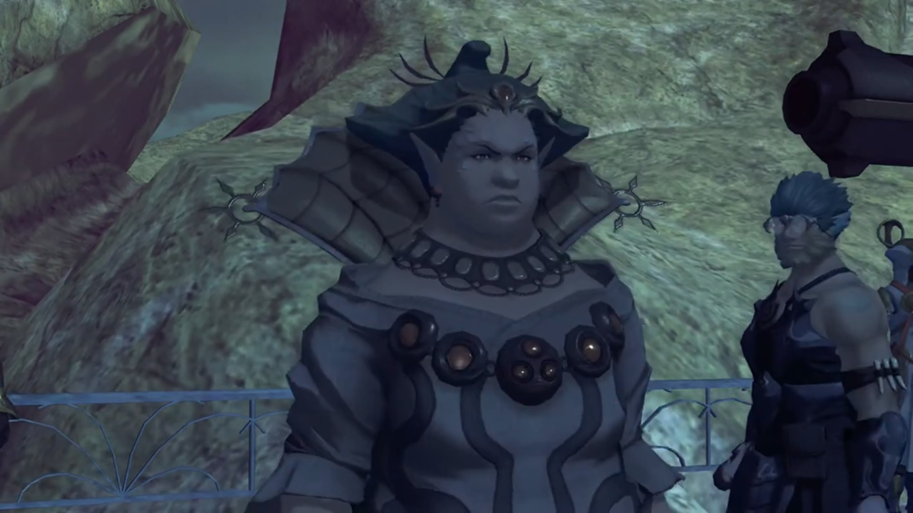
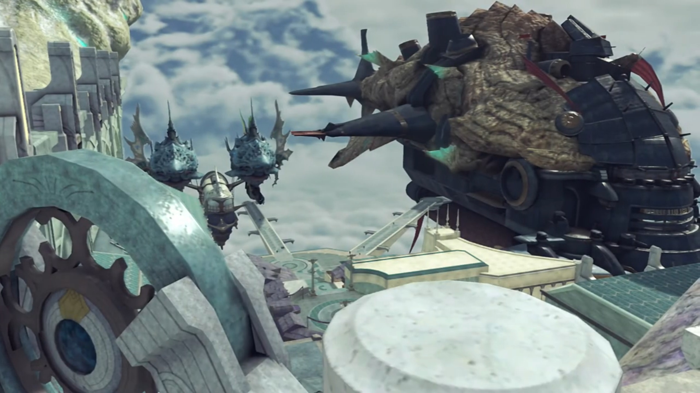
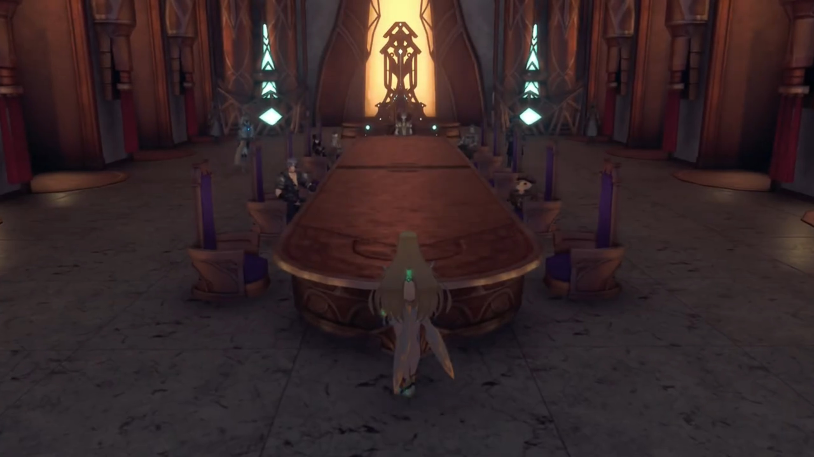
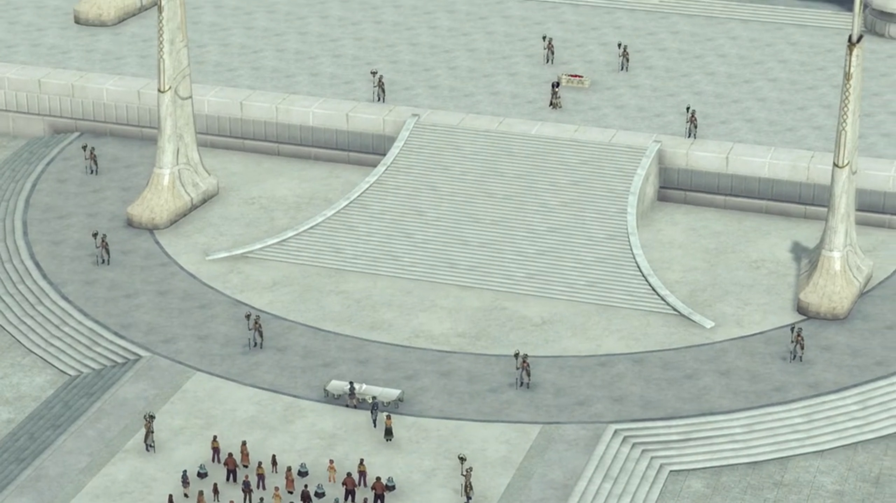
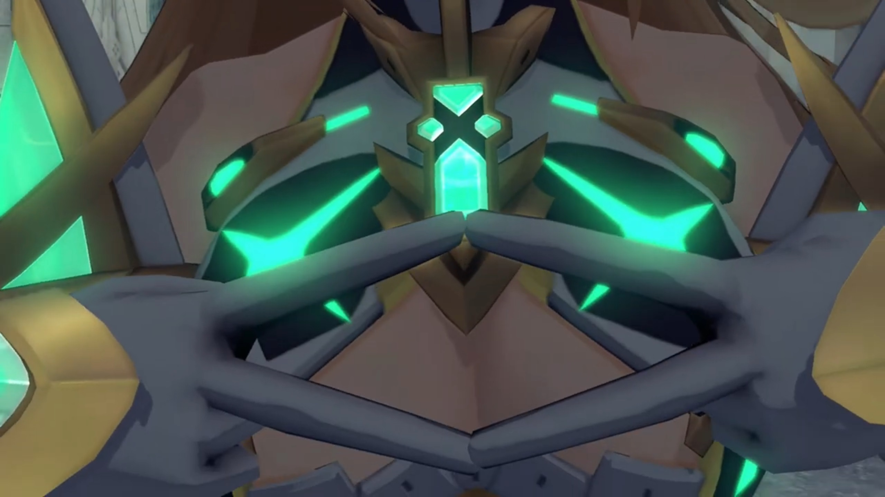
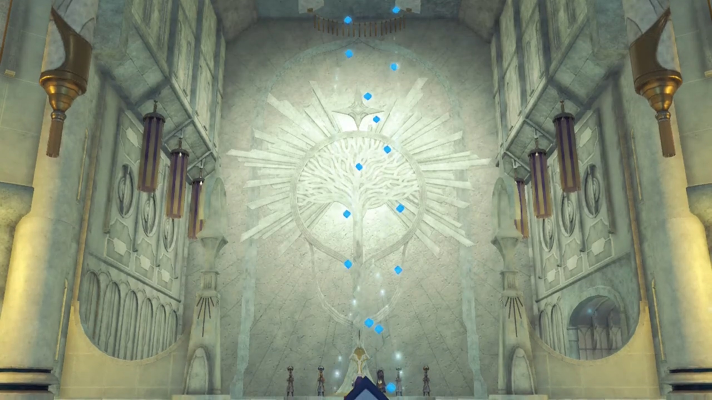

# Jin and Lora, Rulers' Congress, Fan's Funeral, Aegis's Servant

===

One day, a young girl awakened Jin by accident. The first time he saw her, she was scared to hell. He slowly stood up, looming on her. In the dark, a lame{{footnote: not 'boring', but 'not able to walk correctly because of physical injury to or weakness in the legs or feet', as defined [here.](https://dictionary.cambridge.org/dictionary/english/lame)}} guy, her dad, was complaining, "Y-you little scamp! _Do you know_, how much, **THE CORE YOU TOOK WAS WORTH?!!!**" Jin looked at the guy beat the young girl up. 

The guy continued, "I stole it from the **castle!** Three- years- _it took me to get it..._ **AND NOW!!!**" Her mom{{footnote: These relationships are all guesses. One don't know if that's her dad, and one don't know if this is her sister or her mom. One just make guesses to make the story sound more interesting.}} don't dare to rebel against him; but as she watched him snatched the knife on the table and went for her, she subconsciously stood up and grabbed his hand, pleaded, 

"**PLEASE! SHE'S BARELY TEN YEARS OLD!!!**"

"**SILENCE!!! STAY OUT OF IT!!!**" And he flung her away, her back hit the metal cabinet. 

"**Yargh!**"

"_If you die_, it'll be as good as new. You **brought this on yourself...! YAAAAARRRRRRRGGGGGHHHHH!!!**" The last shout was when Jin stuck his sword into his heart, and he collapsed. 

"From now on, I'll protect you." promised Jin. She slowly moved the arms protecting her head and looked at him, the giant figure. "I'll keep you safe, always..." He softly caressed her head; she saw hope. "My name is Jin. What's yours?"

He held out his hand, and her tiny hand grabbed his finger, full of trust. Childishly, she said, "_Lora_..."

---

Jin opened his eyes and found himself immersed in green ether particles in a cryo pod. Healing ether particles gathered in maximum concentration, calming his core. Malos walked over him, seeing him awake, concluded, "It seems like sending Akhos was the right choice..." The cryo opened up and he sat up. "_You all right?_"

"I've been through worse. I can handle it."

Malos took a few seconds to muster his words, "_Jin... I swear I'll make your dream come true. So stop... putting yourself at risk._"

He thought of his reply for a while, "There's... **still**... time."

Malos knew who he's referring to, the one frozen within ice at his 5 o'clock. He asked, "Is that... part of your dream, too?" He didn't reply anything. Malos wondered, "What are we, in the end? This hunger I feel, this thirst... Is it really my own? Or is it someone else's?" He looked at his palm, wondered is it his, or is it his Driver's? "_Huff._ Sometimes I can't tell... Tell me, Jin. Are you really... 'here'? I don't know... _where **I** really am._"

"You're starting to sound like a human."

"Oh yeah?"

"Perhaps... we're not so **different** after all... Humans... and Blades..."

---

The Urayan ship went straight for the reserved dock at Indol. Some Praetorium members were waiting for the Queen, accompanied by her main sidekicks/bodyguards and some soldiers. They are to lead her to the hall where Amalthus awaited. Halfway, she sensed some ships moving in to the adjacent dock. A giant Mor Ardain ship. She shall not wait for her enemy. 

After the Mor Ardain ship docked, the soldiers greeted as Emperor Niall, accompanied by Aegaeon, walked down the path. Another group of Praetorium members awaited to lead him. 

---

Temperantia. The Urayan battleship had not retreated, but they were not attacking either, stopping in mid-air while awaiting commands from upper ranks. On one of the ship's dock, the soldiers, wearing armor similar to thick salvager suits, were chatting. "What's the deal with this ceasefire?"

Another shared, "A tribunal, it looks like. Praetor Amalthus is here in person. And who's gonna argue with the Praetor?"

"Does he have any clue how many men we lost?! If those Ardainians get away with this... Architect damn it!"

The third replied, "**Quit yer grumblin', mate.** All this is way beyond our pay grade."

The 2nd agreed with him, said, "You got that right. We're all just faceless **cannon** fodder to the bigwigs. CO{{footnote: [Commanding Officer](https://en.wikipedia.org/wiki/Commanding_officer), one guess.}} says jump, we jump."

---

Inside the room with a giant table, looked like designed for feasting. Amalthus sat at the CEO seat at one end of the long table, with the Queen directly to his left, and Niall directly to his right. He began his speech with loud and clear voice, "My deepest thanks to you- for agreeing- to this ceasefire, Queen Raqura, Emperor Niall."

Queen Raqura was not very happy, slumping on her seat, satirizing, "As I recall from the Osirian Treaty of 350 years ago, the Praetorium was to **refrain** from intervention in times of war. And yet **here** you are, intervening. _But I trust you have a **suitable** justification, Your Eminence?_"

He waited for her to finish releasing her smoke, answered boldly, "**Naturally! But first**, to ensure- impartiality- in these negotiations, may I present Niranira, Acting Chairman of the Argentum Trade Guild." He was already seated there. "Furthermore, representing the Tantalese... His Highness the Crown Prince Ozychlyrus Brounev Tantal... will also be attending." That's Zeke walking through the entrance of the door. 

"The Crown Prince?! The prodigal prince of Tantal..." Someone from the Urayan side was surprised.{{footnote: Actually, one don't know who spoke this, the voice one never heard before, so must be someone whom never spoke before. And one make guesses, yet again.}}

"Hahah!" Mòrag laughed a bit. She seated herself next to Niall, on the 2nd row. He must have hated that name. 

---

Outside, above the building where they could easily see the parked Urayan and Mor Ardain ship. The various Mor Ardain and Urayan soldiers were guarding their ship, or just chatting; but they avoided contact with each other. Patroka and Mikhail watched atop the roof of building to the side, and nobody looked up. 

Mikhail exclaimed, "**What a spectacle...** Seems the **Praetor**- has as much clout around here as ever."

Patroka wondered, "Could **we** not just take them out here and now?"

"Good point. All the principal nations' heads gathered here, it'd make things easy later."

"The way to the World Tree must first be opened." Akhos rejected their opinion, just arrived. He continued, "Wiping out mankind is the easy part. _We could manage that ourselves._"

Patroka: "Even so..."

Akhos continued to convince them to be patient, "That isn't our only **goal**, _remember_? We must **wait**- for the stage _to be set._"

"Is Jin serious about this?"

Mikhail looked up in the sky, felt the same as her, "Yeah, I've been wondering **that myself...**"

Akhos had strong beliefs, "_Heheheheh. Oh, he's serious. He always is._ He will **annihilate mankind**, and then... he will **kill**... the Architect."

---

Back in the room, Amalthus continued, "Now, it seems... Mor Ardain- has been accused of a unilateral breach of treaty in this matter. Emperor Niall, I open the floor to you. Is there anything you wish to say?"

"While we are still conducting investigations into the cause, it- cannot- be denied... that weaponry belonging to our forces, was discharged against Uraya. Regardless of any possible **reason**- and circumstance, we are prepared to offer recompense- for this grave offence."

The Queen listened and asked, "So you want to settle this with money...?"

"We will provide any compensation deemed necessary."

She shook her head for a while, seat up and continued, "Perhaps I am misunderstanding. To **my** ears, it sounds almost as if you mean to imply that the blame for these offences... does not lie with Your Majesty, _at all!_"

"We are investigating. **I ask** that we not draw **any** hasty conclusions."

"What need is there for investigation?" asked someone from the Queen's side. Perhaps one of her sidekicks? "I believe a cause has already been established. There are witnesses."

"And that would be..." the Queen pressed.

The Praetor listened, then turned to Zeke, see if he had anything to add. Zeke started the story. 

---

The Queen, in disbelievement, "What a **preposterous** notion! **The people** you speak of are **merely** a terrorist group! **How could** they **possibly** command **that** measure of-?"

Zeke forcefully cut her off, "**It's the truth!** I, Ozychlyrus, **swear this in the name of King Eulogimenos Tantal.**"

Niranira shared, "Can confirm- Ex-Chairman Bana- give these people some kind of supplies. Military supplies, _me thinks._ And in _great number, yes._"

"But **why would**...?" The Queen still cannot believe it. 

Amalthus have something to add, "**What if**, I were to tell you that the Aegis Malos, who razed the world five centuries ago, was involved?"

"**RIDICULOUS!!! Everyone knows he disappeared in a blaze of flame!**"

"He's very much alive, believe me." Zeke added, cannot retain his anger, "**That arsehole -- I mean**, the Aegis -- has confronted us in person. And if **my** word is **not enough** for you..." He looked to the soldier whom stood by the door, giving him consent to bring her in. The rest waited in limited patience for whoever he's to bring back. 

Mythra entered the room and the Queen observed her, "**A Blade?! But-but that Core Crystal HUH!!!**"

Zeke continued, "**This is another Aegis**, named Mythra. Your Highness has heard of **her, surely?**"

"So the rumors that reached us were true... **Who** is its Driver?"

"If you knew that, I daresay your **surprise** would be even greater. **But- that is not the matter** we are here to **discuss**, Your Highness. **This is a DIRE situation...**"

---

Rex looked out of the window in his room. She's now in there. But he's worried about her. "Six o'clock already... Mythra's been in there... for a **loooong- time** now..."

Nia wished him patience, "We've just gotta trust 'em. They're dealing with the leaders of **whole** nations. It's not like there's anything you or me can do to help..." The rest whom didn't attend gathered in the room, all seated uneasily. 

He looked out of the window again, sighed, "_Huh..._" Still so weak, huh, in terms of power, physically and politically. 

---

Back inside the room, Mythra did not seat herself, stood at the other end of the table. 

Mythra started speaking, "I've noticed something about Malos. He's an Aegis... But you wouldn't know it from how he's fighting. I think... I'm pretty sure he's damaged in some way."

The Queen's sidekick that wore glasses clarified, "You mean he can't use the full extent of his powers?"

"The wounds I dealt in our battle long ago may not be completely healed. His end-goal- is Elysium. He wants to go back to the place he was born. There he can heal until his powers have recovered. If Malos is allowed to restore himself..."

The Queen can already pictured, "The horrors of five centuries past will return..."

"Or worse still. Malos's goal is simple. He means to- **destroy** humanity- in its entirety."

Niall was surprised, asked, "Why would anyone desire that?"

"Perhaps he doesn't even need a reason. It seems to be a deep-seated drive. An instinct. As natural as breathing."

The rest need some time to digest the heavy info when Amalthus took the blame, "All of this- is my responsibility."

"Praetor Amalthus? What do you mean?" asked Niall.

"It was **none other than I**... who awakened Malos... and unleashed him... upon the world."

Queen Raqura seat up, "So, _Your Eminence_... the rumor that you were once Malos's Driver is..."

"I never intended to obscure the truth. It is writ plain... for all to see in history books. _I was a fool._ It was to prevent such foolishness... that alll passage to the World Tree- was forbidden- after the Aegis War. However, it has become apparent- that the laws of men do not apply to Malos..." He waited for a while to think, before announcing boldly, "The time may have come... to **lift- that** restriction..."

---

After everyone else have left the meeting room, Amalthus stood in front of the door, have a final chat with Mythra. "I appreciate this."

Mythra snapped, "Don't think you've earned my trust. **But since Rex** is going to Elysium, their paths are bound to cross... That's all."

The Praetor nodded, commented, "**I'm surprised-** you seem **so** devoted to the boy."

She looked away, "It's for both our sakes." Then look back at him, "**But you**, _Amalthus_... Who is it that you're living for?"

---

Brighter in the day, flowers put at the funeral of Fan. Lots of people gathered by the square, to pay their tributes for the lost of the goddess of Indol. Her lifeless body laid there, on the coffin. Rex stood alone{{footnote: Well, with Gramps}}, watching from outside the square. He did not enter the funeral. The others -- Mythra, Nia, Dromarch, -- were far behind him, giving him space and time. 

Nia commented, "I guess they did call her a Goddess... The state funeral makes sense." Then asked Mythra, "Shouldn't you be with him?"

"He's a boy. Best not to bother them at times like this."

"_Heh!_ I expected you'd be more clingy. You really are different from her."

"Actually, letting him be was more **her** idea than mine."

"**Really?** Pyra's? _Get out!_" She don't believe it, then something clicked, "_So wait_, you're saying you WANT to go be clingy, or what?"

She gave her _the_ look of annoyance, being teased, threatened, "I'll burn you."

Nia jumped up, "**I kid, I kid!** Sheesh!"

Praetor Amalthus slightly bowed while the inhabitants of Indol held flowers, to sent her. 

Nia asked quietly, "_It's weird though..._"

"What is?"

"I mean, don't you think it's odd? Normally, if a Blade or its Driver dies, it'll just go back to being a Core Crystal. So why is Fan just dead?"

"I did wonder the same thing. There's only one way I know for a dead Blade to keep its physical form. Remember Minoth? I mean Cole. He was a Flesh Eater."

"Yeah."

"But... Fan wasn't a Flesh Eater. I can say that for sure." Then she made a diamond shape with her fingers. 

"What's that?"

"That's the shape of Fan's Core Crystal. _Well, how it used to be._"

"But... now, it's a triangle!"

"Rex and I are _quite_ a unique case, but this is different still."

"How's it different?"

"If a Blade shares its core with another, its shape changes in a uniform fashion. In our case, the center part went to Rex, and the outer part to us. I don't know why that is, but it seems to be a rule."

"But... Fan's isn't like that..."

"_Exactly._" They looked back at her remains; the tombstone lid was just about to be closed. "It looks more like... _someone stole her core, doesn't it?_" And that someone was now speaking to his fellow audience. 

---

They walked into the cleansing room, where Core Crystals were being cleansed by Amalthus. The unknown ether energy awashes the floating crystal. After he finishes, he turned around, "My apologies. **Did I** keep you waiting?"

"N-no, not- really. What... were you doing?"

"I was cleansing the Core Crystals. It markedly **increases**- their resonance success rate. Bonding with a Crystal carries certain risks, you understand..."

"I know."

"When I became the Driver of an Aegis, this power- was awakened in me."

"So... I-I might be able to do it too?"

"Who knows? Different people are cut out for different things..."

"Right, yeah."

"Now then. **My work** is **done** for the day. Come with me." 

---

In a dark room, the one they used for meeting just now. Amalthus had explained what he wanted from Rex. Rex was surprised, "A special envoy... to Tantal? Me?"

"Correct. Behold." On a small table, a map laid out on it{{footnote: The long table is behind them.}}. He continued, "As a salvager, I imagine you are **already** aware. But **this**- is Alrest, the world we currently inhabit. **We** make our home on Titans, moving in circles- around the World Tree. And **here**- lies the Great Void." That's the waterfall falling into the nothingness that surrounded the World Tree, effectively preventing anything from even jumping through such great distance.

Amalthus continued, "This Void, came into being 500 years ago. It did not exist prior to that."

"So I've heard. It's in our way, anyway. I-It stopped us reaching the World Tree."

"The Great Void, is carved from the Cloud Sea by a monstrous beast- known as Ophion."

Rex recalled, "Wait, you mean... that _thing?_"

"To be precise, it is an Artifice, a servant of the Aegis."

"Of Mythra?" He looked to her. She didn't deny. 

Nia: "So if that thingy is Mythra's, _then what did it attack us for?!_ Doesn't make sense!"

Mythra explained, "Ophion was felled in the ancient battle with Malos, sinking below the clouds..." 

> Electric sparkled in its head, it losing vitality, and crashed into the clouds below. 

Mythra continued, "This means... someone must have revived it."

Amalthus agreed, "Correct."

"And you're saying that someone was Zeke's home country, Tantal?" Mythra asked. 

"Yes. They gave Ophion one directive. To ensure that _none approach_- the World Tree. They sought to prevent a repeat of the horrors of the Aegis War. So... an obstacle was created -- the Great Void."

"How did they manage a feat like that?"

"As I've said, _mankind- is regressing._" Zeke said nothing, had his head dropped all the time. Amalthus continued, "Only one artifact remains- that can rescind Ophion's orders, and it _lies in Tantal._"

Zeke opened his mouth finally, "It's called the Omega Fetter, and it's guarded by the royal family. I'll take you to it."

"I've prepared your envoy documents **already. Your quest**- is to set foot in Elysium, correct? Malos and his ilk... will surely seek the Omega Fetter for themselves. I would ask you... to **reach Elysium before** they do, and inform me of what you find there. Do it as a favor... _for a once-foolish old man._ And so that people may have a future... _in this dying world..._"

### Footnotes: