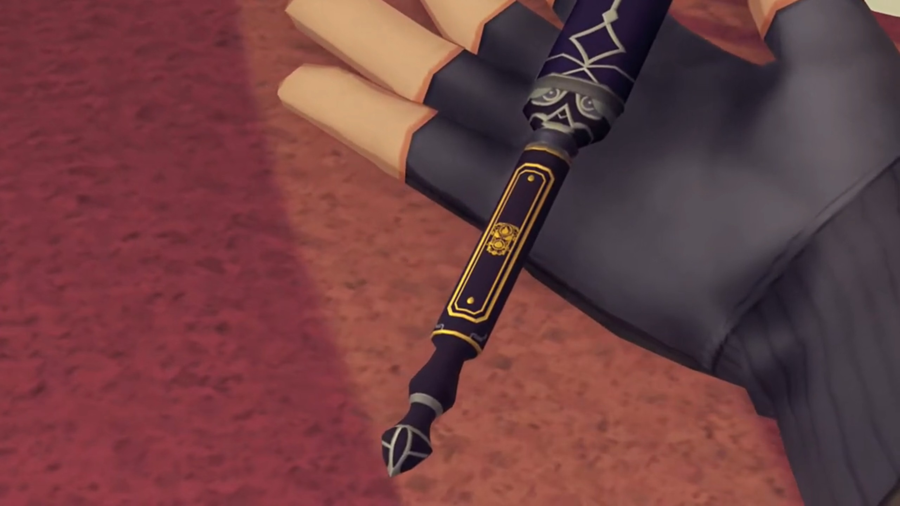
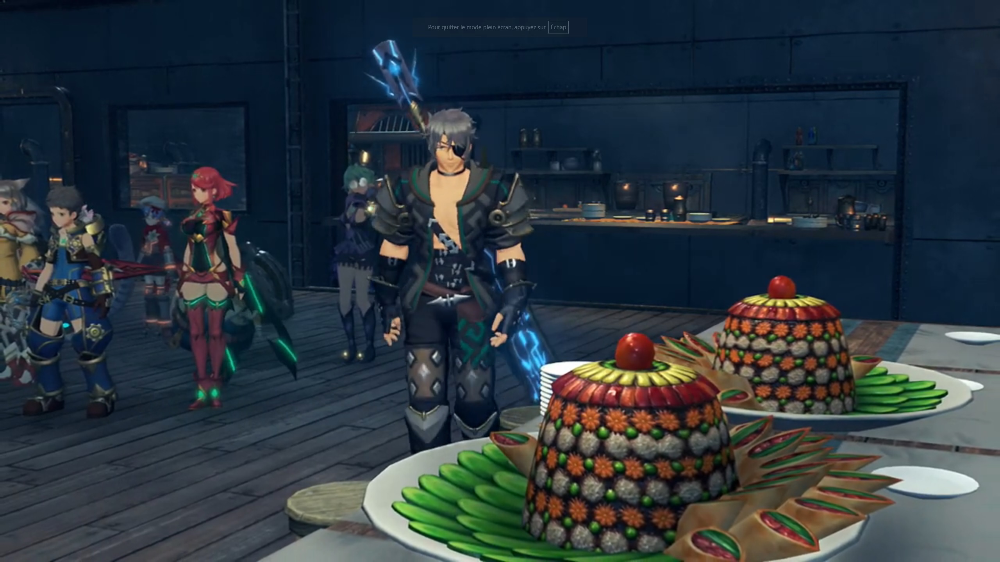
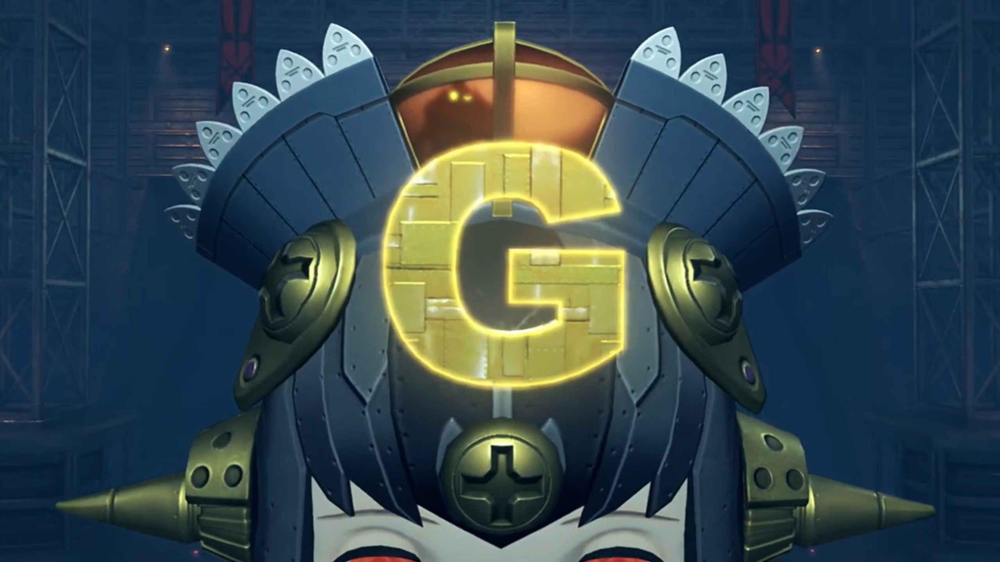
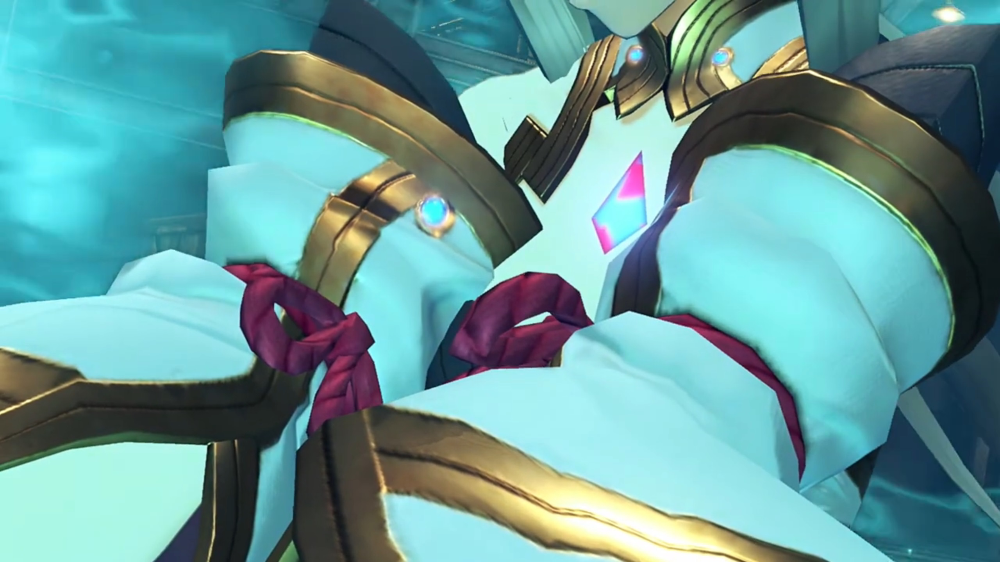

# Ancestors of Tantal, Bana's Plot, Emperor Niall's Selflessness

===

Gathered at one of their room, Zeke briefed them, "We can reach Tantal by ship, but once there we'll need to do a spot of walking."

Nia commented, "So we're traveling with Shellhead here? **Neeeever** thought I'd see the day..."

"I think you'll find I make a **fantastic** ally."

Tora don't think so, "**Mmmm Luck** of Zeke not so great. Bet we _shipwrecked_ by tomorrow."

"**AHAHAHAHAH!!! Cheeky furball!!**"

Nia agreed, commented lamely, "We're all- gonna die."

Rex got a question, "Hey, Zeke... You said before that- **Torna**- concerned you too... What did you mean by that?"

"**Whuh?** Oh, yeah, **that.** I don't know about **those** clowns, but **Torna**, the country that fell 500 years ago; they were the ancestors of us Tantalese. The people of Tantal- are descended from Addam, the hero of Torna- who escaped its destruction."

"So... After Pyra fell asleep, Addam escaped to Tantal?"

"That's right!"

Dromarch commented, "That is the first I've heard of it. I have studied much history, but this story never featured. _Most- peculiar._"

"**We're** humble. Don't really like to brag about it." He brought out something that looked like a brush for Chinese Calligraphy, explained, "The only real trace left is in this here -- sigil of the royal family..."

Mythra's eyes squeezed as she saw that once again, so similar, brought her back in thoughts. But her thoughts also mixed with something she heard from earlier that day...

> At the meeting room, after everyone left. Mythra asked, "So, why did you awaken Haze?"
> 
> "Because her power was of great use to me. **Indol** has found itself... under attack from Torna a number of times. She was necessary... in driving them back."
> 
> "_Really?_ Then why don't you seem to have any others? **Blades**, that is."
> 
> "Heh... Driver though I may be, I am no fighter. **Besides**, I find the warrior monks here **so reliable**. They get the job done."
> 
> "**Hmph**! If you say so... I wonder, **do you know** why Torna are using the name of a dead country?"
> 
> "**Jin**... was a Blade of Torna, once. Loyalty or nostalgia, **who can say?** Perhaps both."
> 
> "Is that really all there is to it?" she pressed. She don't believe the words coming from this liar. 
> 
> "You don't think so?"
> 
> "**I don't know much about what happened**... while I slept. There are no written records- either. All we have is... stories- passed down."
> 
> "And you think that is insufficient? **History... is** a murky thing. Only those present... can truly know what took place."
> 
> "But _weren't you one of those present?_"
> 
> "And that is why... I **offer you my cooperation.**"

Mythra said, "I guess we'll find out, if we go- to Tantal..."

---

The group, without Mòrag and Brighid, exited the Praetorium to the square where the stairs led up. Bazaars and stalls were set up there for sale; but more recently, Urayan and Mor Ardain soldiers flooded the place everywhere they look. 

Nia felt, "_Hmm..._ Tensions seem high."

Dromarch shared, "From what I gather, it seems an official summit is to be held- between Mor Ardain and Uraya."

"A summit? You mean, about the recent punch-up? But I thought..."

Rex don't understand too, "Didn't Praetor Amalthus- get them to **stop**- and sort it all out?"

"Perhaps there are some discussions they would prefer Indol not to be privy to."

Zeke added, "Besides, Uraya doesn't like to associate **too** closely with Indol. They'd hate to be seen as acquiescing to the Praetor's will. Gotta **keep up appearances**, you know?"

Nia wondered what that word means, "Ac...quiescing? You what?"

He explained, "Like, letting him tell 'em what's what."

She teased, "_Hah!_ For such a spanner you sure use some big words. How come?"

"**Stop calling me that! BUZZ OFF, kitty-no-mates!** Anyway, this summit would explain why Mòrag isn't around..."

Dromarch: "Indeed. She has much to attend to."

---

Mòrag was in their ship's meeting room, discussing with her brother, she asked, "Shared sovereignty over- Gormott?"

"Yes. I don't think anything less will be sufficient to placate them."

"The Senate would never **approve** it..."

"I can overrule them by decree. Of course, I would need to **secure** Senator Roderich's cooperation."

"Imperial decree? If it's come to that... Well then, I cannot dissent. I cannot help but admire your courage, Your Majesty." She bowed to him. 

His eyes widened, "That means **a lot**, coming from you."

Just then, someone was knocking on the metallic door. The door opened and "Acting Chairman Niranira" ran in. 

He immediately went directly to the point. "Sorry for intrude. Is emergency, so Niranira take liberty of drop by- unannounced..."

Niall excused him, saw that "You certainly look troubled, Chairman. So, what is this **emergency** you speak of?"

"_Well..._"

---

Outside at the square, the group was still standing at the middle of the square, hadn't moved much, looking at the port where the ships parked. Zeke made the calling, "**So**, we can make our way to Tantal from here. I assume the **Praetor**- has a ship waiting for us."

"Hey, Shellhead!"

"What?"

"Are we _really_ gonna just leave Mòrag behind?"

"**WHO'S LEAVIN' ANYONE? She's got her own** priorities, **y'know.**"

"Y-yeah, but still..."

Gramps concluded, "Anyway, her schedule is filled with official duties right now."

Rex understood that "For sure. It's just a bit of a shame, is all. **You know**, since we came all this way together."

Zeke: "I guess I know how you feel, chum." Then, something caught the edge of his eyes, he turned to it in a surprise, "**Uh? Speak** of the devil..." Mòrag and Brighid were coming towards them from aboard the ship. 

---

After she explained what she heard from Niranira, Rex exclaimed, "**Bana's** going for the summit?"

Gramps was shocked too, "On top of _everything_, an assassination attempt?"

Brighid: "If blood gets spilled at the summit, **it'll** mean war."

Zeke: "War's good for business, after all. I guess he wants to **use** that- to get himself **back in**- with the Guild..."

Rex was incited, "**Why, that little... I was wondering where** he'd slunk off to! What a sneaky git..."

Mòrag: "It seems Acting Chairman Niranira... wishes to take care of this incident covertly, to avoid it reflecting badly upon the Guild."

"So you came to us?"

"If we mobilize the army, the whole thing will become public."

Nia wasn't very happy hearing that, "**Ohhhhh** I get it. So we're a more- _convenient_ solution."

"I'm not forcing you. If you **refuse**, Brighid and I will do what we can- **alone.**"

Zeke can't stand her, "**AH, COME OFF IT, LADY!** You wouldn't even **think** of dragging us into this, if you thought you could handle it on your own."

"I suppose not... You know Bana as well as I. There's no **telling** what he might be plotting."

Brighid added, "According to Acting Chairman Niranira, several giant weapons were being built at the factory where we last saw him. And one of them... is _currently unaccounted_ for."

Tora: "_Giant... weapons..._" The only giant weapon they last saw and fought is Rosa, he recalled. 

Rex blandly spoke, "Got it. **Besides**, _you know_, we've got our **own** score to **settle** with him."

Mòrag expressed, "Thank you. It will be easier to focus on my duties knowing you are on the case. Good luck."

"Leave it to us."

---

The group ran into the Mor Ardain ship through the entrance. Unbeknownst to them, they passed by a giant crate without noticing it, without feeling it being out of place. Soldiers were patrolling the place when the box started knocking, without attracting any attention. 

---

At the restaurant, Tirkin chefs prepared various food for whoever was going there. The group entered and Rex called, "**Stop everything! Hold it!**"

The tirkins turned around and one of the head was surprised, perhaps being caught, "**Craa!!!** Wh-wh-wh-wh-what? Wh-wh-wh-wh-who's you?"

"**Don't. Play. Dumb!**" He looked to the foods, immediately accused, "**POISON! THAT FOOD IS POISONED!**"

"P-p-p-p-poison? You kids krazy in brains!"

Zeke: "**We're past talking! QUICK, GRAB 'EM!!!**"

"**YAAHHHH!!!**" And the fighting started. 

---

All the tirkin fell to the floor. Someone called out, "Pleaaaaaase wait."

Rex recognized, "**Pupunin?! What are you doing here?**"

"**What silly question!** It Pupunin who hire **world-famous band of gourmet chefs**, Fire Dragons!"

Rex never heard of them, scratching his head, "World... Famous?"

Neither did Nia, "...gourmet chefs?"

Pupunin explained, "Mor Ardain **very** insistent, want only **very** best food for **important** summit! Pupunin work **wings to bone finding chefs**- and now what this?!"

Rex: "Uh... So you mean..."

Pyra: "...these guys are..."

Nia finished, "...just a bunch of cooks?" Can't believe it. Not the same as the tirkin groups that assisted Bana? 

Dromarch recalled, "I **did** think- they were not putting up much of a fight."

Pandora: "Then this food is actually..."

Zeke already went to taste one of it. Cucumber and spring rolls lined the brightly colored cake with cherry toppings. HIs eyebrows raised as he stuffed one into his mouth, closed his eyes to enhance his taste buds. Electricity struck his brain, and he felt he'd been raised to heaven, "**D-D-D-DEEEEEEE-LICIOUS!!! I COULD EAT THIS STUFF FOREVER!!!**"

Pupunin wanted to know, with fluttering wings, "What friend doing?! Very expensive **food** now go to waste!"

Rex apologized with most guilt, "**SORRY!!!** We really did think they were here to murder someone..."

"Murder? What this **nonsense friends talk?!** I **demand compensation. Friends have no idea how much time and money Pupunin spent on this-**"

He hadn't finished when something exploding attracted their attention as they braced for impact. Rex exclaimed, "**An explostion?!**"

Zeke was pulled back from his culinary delicacy heaven, "**Huh? From where?!**"

Soldiers were being mobilized; they got to one of them and asked, "Hey! What's going on?"

The soldier shouted to them, "**Explosion in the hangar! Right when everyone was busy with Queen Raqura's arrival!!! It's really bad!!!**" He immediately dashed off to solve the problem. 

Rex: "The Queen is here? **This is it!**"

Pyra urged, "Rex, we need to hurry!"

"Yeah!"

They had forgotten about the poor Pupunin, "Hey! **Heyheyhey, wait!**" But there was no one to deal with him right now. "**Heyyyy!!! No running away!!! COM-PEN-SA-TIOOOOOOONNNNN!!!**"

---

The group found Giga Rosa at the hanger. The two sidekicks of the Queen were protecting her. The Queen asked Giga Rosa, "Who are you, villain?! Is this some **underhanded Ardainian trick?!**"

Bana was controlling from inside, replying via its speaker, "**WRONG!** But also right! Truth is complicated! **ANYHOW, HERE- is where Queen die. IF IT LOOK LIKE QUEEN KILLED BY MOR ARDAIN, ME IN THE MONEY AGAIN!!!**"

The Queen recognized "_That voice..._ **Bana**, from the Argentum Guild."

"**CORRRRRECT!!! TOP MARKS** for the Queen!"

"But you were unseated as Chairman."

"Is not so eaaaaasy to get riiiiid of Bana! **TRADE GUILD of Argentum BELONG to Bana! Down to last SCREEEEEW, last drop of OIIIIIILLLL!!!**"

"Grrr...."

"**Hold it, Bana!**" Rex had arrived with his group. 

"**YOU!!! REEEEEEEX!!! Meeeeeh! BANA not let Rex interfere with plans! AGAIN AND AGAIN! BANA NOT STAND FOR THIS!!!!**"

"Masterpon! That Artificial Blade!"

"**It Rosa?! Meh-meh-meh**... Tora feel **much** greater power than before..." The docking port where Bana seated within had now a large G on her head. "Especially from mark on **forehead**!"

"What's going on?" Niall, Aegaeon, Mòrag, and Brighid had dashed into the scene. Niall panicked, "_Wh-what's that?!_"

Bana: "**Oho-ho-ho!!! EVEN EMPEROR** come straight to Bana! **CONVENIENT** little moth to flame!"

Nia urged, "Come on, Bana. **Cut** the bad guy talk and accept you've lost. **You know** you won't get away with it, what with all these wit-nesses here!"

"**IF** Bana simply kill everyone, **then nobody BLAB!!! Victory of Bana is ASSURED!!!**"

Rex and the others took out their weapons, he replied, "**You know- we can't let you do that!**"

"Huhuhuhuhuhuhuhuh! **You think** you handle the **pooooooower** of **upgraaaaaaded Giga Rosa?!** Things go veeeeeeery diffeeeeeerent this time!"

---

Electric sparkled on Giga Rosa and it failed once more. Bana climbed out of the controller's room in disbelief, "How... Even Giga Rosa defeated by these **nasty** meddling kids..."

Mòrag walked forward, announced that "This **ends here,** Bana. You are under arrest. **The Praetorium** will handle the judgment. Assassination is a **serious** matter. Your sentence will be harsh."

> (===Done Start===)

The Queen decided to observe who wanted to kill her closer up, "So the mercantile genius Bana... meets an **inglorious** end before my **very** eyes. _Pitiful._"

How could he, Bana, lose like this? No, no way will this be his end. "Grrr... Bana is..."

"Hm?" What had this wretched rat had to say, wondered Mòrag. 

"**Bana**, is not kind of man to go down like this!" He revealed a remote control with only a big red button, imprinted with a G on it. 

"Ah!" The group braced for impact. 

"**If I go down, I take YOU- with me!**" He brought it up high, ready to press the button. 

"**Watch out!**" Blood rushed into Niall's brain; he subconsciously dashed past Mòrag and the Queen, reaching for Bana. "**Aegaeon!**"

"As you wish! **Huuuuuhhh!!**" With full might, a shield raised to defend everyone. Niall was within but not Bana. Niall exited the shield in the raising eyebrows of Mòrag, to reach for Bana; but it was too late. Had he been one step closer, he would have snatched the control before Bana pressed it. The ether furnace of Giga Rosa self-detonated. Bright light blinds the eyes of all, restricted any further actions for a second. The light dimmed with the loss of the shield. 

The Queen was awestruck, partly from a close call to death's door, partly from his actions. "**(pant pant pant) Niall Ardanach... You... You sought to...** protect us?"

He turned around with a thin smile, "_I'm... glad..._" they were all right. Darkness engulfed him, and he dropped unconscious. 

The world dimmed as he occupied her whole vision. She brought him up, wrapped him in her arms, screamed, "**Majesty! MAJESTYYYY!!!**" She scanned his body; dark blood dripped through burned clothes. Severe burn injured large part of his torso and limbs. It was well beyond saving, she thought, of the imperial capital's medical technology. "**Your Majesty! Please, no!**"

Aegaeon sighed, "_Your Majesty... I have... failed you..._" And he returned to his core. Only a Driver's death can a Blade return to its core{{footnote: The other way round, the Blade returning to its core but the driver don't, in the case of Torna Drivers, isn't possible here because Aegaeon don't stand in front of Niall, hence damaging his core but not his Driver.}}, Mòrag was sure about it. 

All hope had lost. "_I... it can't be... To protect us, you... Please, wake up!_ **Niall!**" The others don't know how to react nor consoled her who'd just lost her brother, "**NIALLLLL!!!**"

"_Mòrag..._"

Nia's heart raced once more. The last time she could've fight and Vandham could be save, but she didn't. Had not Mythra been awakened, they'd been roasted now. And now, again, she shall fail her teammates, because of a deep underlying fear? No, she's not going to let that happen again. Not with the escalating guilt that'll live within her forever if she can do something but don't. "Dromarch."

"Yes?"

"Distract the others..."

"Distract? I'm not sure I..." Then, it struck him what she wanted to do, "**N-no! My Lady, you cannot-!**"

"There's still time... _Hurry!_"

Not that he could deny the will of his Driver. "Yes, my lady!" He went by the door and shouted, "**There are more of them!**"

Mòrag was doused with desolation when, like a match thrown into a gallon of oil, her desolation ignited, to destroy every last one of 'em, "**Where?**"

Zeke was so confused, "What'd you say?!"

Without further adieu, he lead, "**This way! The rest of you should get to safety!**"

"**CHUM!!**"

Rex agreed, "**I'm on it!**" These bunch are gonna pay for what they'd done to Niall. The Queen was still recovering from the selfless actions coming from her enemy state. Would he not have benefited if she dies here? But he'd chosen otherwise, to risked himself for them. She left the room, with her bodyguards, without a word. But his actions speaks more than any advantage to negotiate if the summit had been held. 

Mòrag struggled to leave her brother alone; his blood felt cold, his body gradually losing warmth. Logic and emotions raced, to stay by his side, or kill every wretched rats that caused his brother's harm. Her logic finally overtook her emotions, as she softly put him down, dashed past Nia as if she didn't see her, and went after Dromarch and the others. 

Nobody else except them, she could put down her resistance, went up and took him by her hands. Green healing ether released from her hands; she changed her clothing and makeups and whatnots, casting it at full strength. Life overflowed his body yet again, awakening his consciousness. He effetely turned to look at her, wondered, "_You- are..._"

"_Shhh... You're gonna be fine..._" 

---

Zeke was especially not happy with Dromarch leading them up and down empty alleyways, accused him, "**What d'you mean**, _imagined it?!_ **You got us alllll in a proper tizzy!**"

He stopped just behind the door entering the hanger, "My apologies... I thought I spied silhouettes... I did not mean to cause trouble." Mòrag was too deeply occupied, now that the enemies were all eradicated, by the loss of whom she'd grew up with, whom she cared and loved most. She fell into a silent depression. 

It was Nia's shout that temporarily distracted her, "**Heeeeeyyyyy!!!**"

"Huh?" 

She waved incessantly at them. "**Heeeeeyyyy!!! You guys! His Majesty the Emperor is awake!**" Niall still felt his heart hurt, his injuries were mostly healed, but there still was some small ones to patch up. He tried to stand up, supported by Nia. 

"_What?!_" Mòrag eyes immediately fixated on the figure. Yes, he's moving, he really is moving! 

"Can it be...?!" Brighid don't know what happened. Quickly, they dashed to his side; Mòrag took no questions, brought him within her arms, and squeezed tight. Yes, it's him all right. The warmth returned to him, oh dear, oh my God. 

"**Majesty?!**"

"_I apologize... for making you worry..._"

"**Majesty...** _It's... It's a miracle..._"

Brighid shared, "When Aegaeon returned to his **core**, I was certain we had lost you..."

Nia mocked, "Honestly... you call yourselves soldiers?! _First aid?_ Anyone heard of it?"

Mòrag rebutted, "But... his wounds..."

"Hmph! Just scratches!" Nia replied, as if it was something easy. "Pfft. Nothing me... and Dromarch- can't handle."

"_You save..._"

"_Hmhmm!_" The pride, yes, the pride! 

"_Thank you, Nia._ I truly don't know how to... I will never be able to repay you, _for what you..._" Relieved. Gratitude. Grateful. 

"Oh, don't sweat it. **Let's just** say you owe me one. _That'll do fine, right?_"

"_Nia..._"

> (===Done End===)

---

Hardhaigh palace, where Niall held court meetings, and where he met Mòrag the last time she went out for the Aegis and returned to report to him. It felt so empty now. So alone. He used to be by my side, someone to speak to, someone to accompany one. Now... it's only him...

"You shouldn't be up." He lips went up a little. He turned around and found Mòrag there. "It's only been one day... Please don't strain yourself."

He looked at the table, commented laughingly, "Half a day off, and look at all this- **paperwork!** I sweeear, it's like they don't want me to **sleep** at all!"

"**Majesty...**" But your health is more important...

"Special Inquisitor. I hereby issue you new orders. It is **my** wish- that you travel with the Aegis- as an emissary of the Empire. Guard her- and defend her against her enemies until she reaches Tantal."

"Guard... the Aegis?"

"I've already discussed it with His Eminence."

"Forgive me. Your Majesty, I cannot accept." Not while you need me to protect you, with no Aegaeon by your side. "Just think about what happened yesterday! It would be sheer foolishness for me to leave your side!"

"Is that so?"

"Huh?"

"I can see it in your eyes. **It's clear** that the Aegis... or rather, that boy, has made a great impression on you."

"That's not... I am your... **Special Inquisitor. Ensuring Your Majesty's safety** is my only concern. **To abandon that duty** and go traveling..." How could she give herself permission? 

He looked to the table, and Mòrag followed glance, saw the unlit crystal on the table, asked, "Is this... Aegaeon's?"

"A Driver who cannot even protect himself is no Driver at all. Yesterday's events... have made me... **keenly** aware- that I have no aptitude for it. It'll be of more use in your hands."

"_Majesty..._" Then who's gonna protect you?

"_The world, is changing, Mòrag._ I trust you more than anyone- to lend that boy the wisdom and strength he will need."

"_Urgh hurrrh..._" She can't deny that. 

"I miss it, you know. Lake Yewtle, in Gormott." He closed his eyes to reminisce the past. 

"What?"

"Remember when the two of us would shake off the servants... and go swimming there?"

"Ahhh... Yes. Of course." How long was that ago? 

"Kids from the nearby village would come too. Good times." His contentment clearly couldn't be withheld. 

"Majesty..." She was relief he was all right, physically and emotionally, not delve deep down into depression or similar. 

"If Mor Ardain... _No_, the **whole** of Alrest, could be like that again... Wouldn't it be _beautiful?_"

"Is that my newwww... duty, then?"

He looked at the emperor's seat, shared, "In truth, it should have been you sitting in this chair right now..."

She denied, "The imperial line- has **always** passed from father to son. On the day Your Majesty was born, that's **exactly** what happened. I knew that day would come. It came as no surprise."

"You were raised... by my father to take the throne of the Empire. As befits the daughter of my Lord Uncle Eandraig."

"And I am grateful for it. If not for him, I would never have met Brighid. Never have met _them._ I'd have missed out on **soooo** much."

He struck out straight for it. "**There! Those** are your true feelings."

Oops! "Urgh!"

"A magnificent power- resides in you. Mòrag, power like yours exists to be used."

"Niall..."

"You've been tied down long enough." He ordered, "**Follow your heart, Mòrag Ladair.**"

She'd been convinced, "I have no words. _Thank you, Your Majesty._" She closed her eyes for a moment to make up her mind, "Very well, then. I hereby- _accept_- the task you have assigned to me."

"**That's** the Mòrag I know and love. _Make me proud._"

### Footnotes: