# Tantal

Indol. Docking port. The Uraya and Mor Ardain ship had already left. Mòrag returned yet again from Mor Ardain and found that the ships taking the group to Tantal hadn't yet been readied. She explained why she returned and concluded, "So that's how it is. It seems our paths continue to entwine."

Rex was impressed, "**That's awesome news!** To be honest, I was really hoping there was some way you could... stick around. I was just thinking of asking you myself."

"Saved you the trouble, did I?"

"**That you did!** Thanks a bunch, Mòrag!" He held out his hand for her to shake. And she took it. 

---

The Urayan ship was still on its way cruising home. Her 3 bodyguards gathered behind her at the front dock. The Queen was still puzzled, "I can't help but feel that in all the **confusion** surrounding Bana, our concerns... have been neatly swept aside."

One of her muscular bodyguards with glasses, green hair, and moustache all around his chin that stretches up to his ears commented, "The Praetorium maintains **absolute** control over Blade distribution. It is **quite** vexing..."

Another of her male bodyguard without glasses, wearing mermaid-like suits, added known info, "Awakening rates from natural cores are very low, which limits the pool of compatible *Drivers*."

The Queen summed up, "So, to create **large** numbers of Drivers, the cleansing Indol provides is a necessity. That much I am willing to accept. The **real** problem, is the fact that the Aegis has awakened. This is no time to be squabbling over **territory**. If we **misread** the situation **eeeeven** a little, Uraya itself could be sunk to the Cloud Sea's bed. Emperor Niall must **surely** be thinking the **same thing!** That's why he sent his **precious** Mòrag- to shepherd them along."

The first bodyguard added, "**And now**, we find ourselves in their debt..."

"Who could have predicted _such an act of selflessness_? Was it just the passion of youth, or was it...?" There could be a lot of things political, including fake acts of sincerity; but she can't read his mind. She can't conclude. 

"M-my liege?"

"In any case, for now, we should keep our troops mobilized while we monitor the situation. I hardly expect Tantal will **comply** with the Praetor's plans so easily, either..."

---

The ship that're bringing them to their destination was powered by a small dragon Titan. He was busy daydreaming, looking out at the plain white on the side deck himself, when Zeke arrived and shot a question at him, "**Say, chum. Which one d'you fancy, Pyra or Mythra?**"

"**Uhhhhh, Zeke!** You can't just ask someone... **Anyway, they're the same person!** I've never really thought of them separately..."

"**Are you serious? But they're like...** totally different characters. Like, Mythra is- **jolly** intense. And Pyra is just totally mellow, or, I dunno... What's the opposite of- 'pushy'?"

"On the outside, maybe. But... Pyra's got a lot of backbone too. She can be pretty stubborn!"

Zeke was impressed that "You seem to understand them _pretty deeply._ Well, I suppose you ARE their Driver."

No topic went into their mind for the moment as they enjoyed the gentle sea breeze. It wasn't long before Rex came up with something to ask, "**Hey!**"

"Yeah?"

"**You're a**- prince- from Tantal, aren't you, Zeke? Why were you in the Praetorium?"

"**I mean, you can't just ask someone...**"

Pandoria couldn't keep quiet anymore when her Driver tried to reply the same as what Rex did to him earlier. She ripped his final loincloth off, revealing his secrets nakedly, "**Oh, his old man** kicked him out!"

He turned around hastily and shouted, "**OI**, no! Bad Blade, bad! How long have you been standing there?"

"From about... 'which one d'you fancy'..."{{footnote: And they didn't even heard her footsteps, nor see her from the side of their eyes? Wonderful!}}

"'Which one d'you fa...' **That's the whole conversation!**"

She disregarded that, turned to Rex and continued _his_ story, "As I was saying, **my Prince got disowned** by his father. **He spent all his time traveling the world for fun,** instead of attending to his studies. Then **BYEEEEE!!!**"

Zeke rebutted, "**It wasn't for fun! I was learning all about,** uh, **society and international relations!**"

She laughed at that, "**'IIIInternational relations,'** that whatcha call it?"

"**OI, CAN IT, YOU! What are you doing anyway**, dissing your own Driver?!"

"**HAHAHAHAHAHAH!!! You guys crack me up!**"

Pandoria turned a little serious, "I love him, really."

"_Awwwww_! Anyway, he sounds tough. Zeke's dad, I mean."

"Tantal is an isolationist society. Crossing its borders without leave is strictly forbidden. It's been that way for ages now."

"Ohhhhh, hmm..."

"But, you've seen how my Prince here is. **Couldn't stop himself** leaving a few times, so he got chewed out and disowned. **Back when** he was... fifteen or something?"

Zeke agreed, "**YEAHHHHH, something** like that."

"Then the Praetor himself found him half-dead on the ground one day, and took him in. _He made up that 'special envoy' stuff._" She loudly whispered to Rex. 

Rex: "And that's... how you ended up in **Indol. It all makes sense now!** Oh but wait... Is it **safe** for you to go back to Tantal, then?"

Zeke guessed, "**This time**- we've got official **business** from the **Praetorium**! It'll be fine. _Probably._ **Besides...**"

"Yeah?"

"**Tantal is too ignorant** of the outside world. **It needs** a wake-up call."

Just then, a Praetorium worker approached them, specifically Zeke, announced, "Sire! We have reached the designated coordinates. Please."

"**RIGHT! READY?**"

Pandoria: "**You betcha!**"

Rex was confused, "Huh?"

"**Shut up and sit down, chum. THIS'LL BE GREAT!**"

---

The group gathered at the front deck, and Pandoria at the edge of the hull. Her core crystal pointed below the cloud sea, shone a beam that strike deep down. A tornado started forming, slowly but surely. Something was surfacing. 

---

Tantal. Inside the Palace's central hall where visitors shall meet the king. The central hall looked old, with various buildings dating perhaps millennium. Flames within cage provided minimum warmth in the Castle. Ether flowed through the pillars, strengthening them, or for other reasons. As the floor shook, someone approached the king, whom was seated on his stone chair, "My lord. Genbu has begun surfacing."

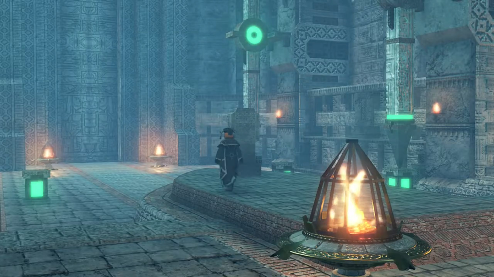

He replied weakly, "_I am aware. It's Pandoria._"

"Then the Prince..."

"_Yes._"

"We **have** received _reports_... that he made contact with the Aegis in Indol."

"_So after 500 years, he makes his move... Praetor Amalthus._"

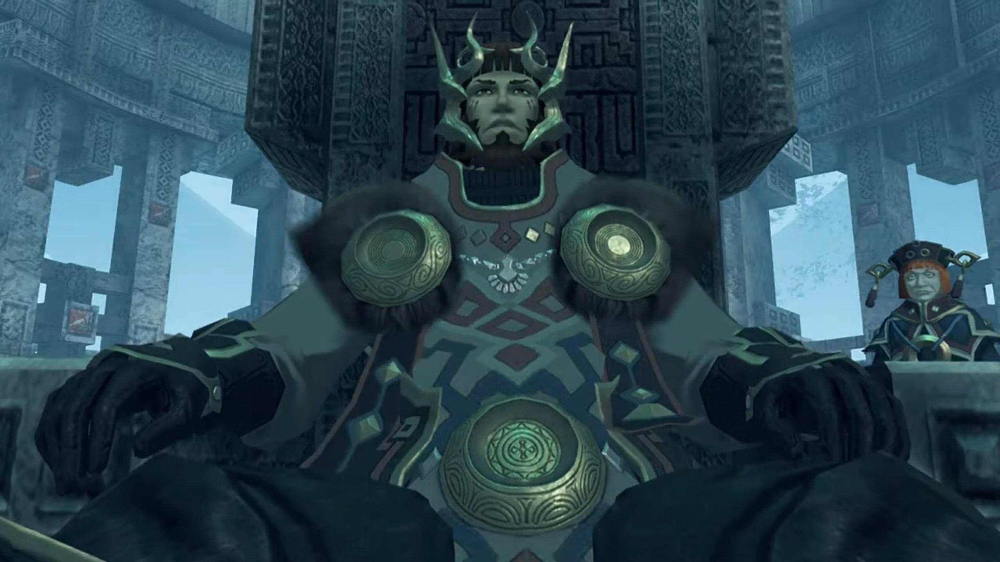

"My Lord?"

"**We must act.** To protect our _days of peace_. Even if they are a dream- _that cannot last..._"

---

Genbu jumped out of the water; an awestruck moment. Their ship was a mere dot compared to it. Nia was overwhelmed, exclaimed, "*Whoa...* It's just like a bigger version of Turters..."

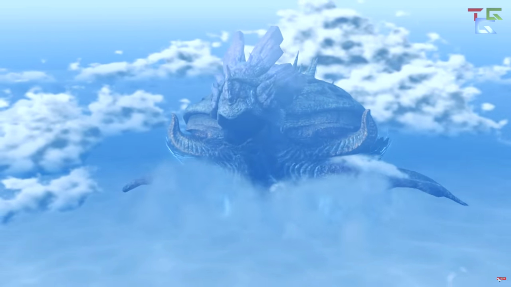

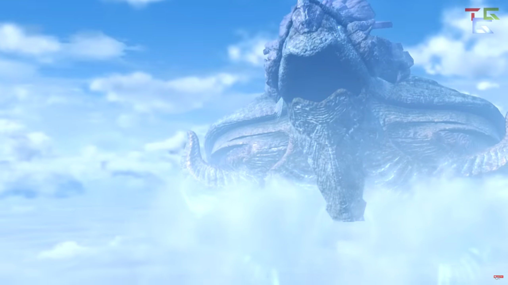

Zeke was playing with Turters on his palm while explaining, "It's called- Genbu{{footnote: 玄武 is both the Chinese character and the Japanese kanji for it.}}. **It's the same, like**, Titan-type of Uraya. Normally, it's submerged in the Cloud Sea."

Pandoria added, "Even in early fall, it can get pretty cold inside Tantal. **Mind you don't freeze!**"

Nia could already imagined how uncomfortable her journey would be,  "Brrrr.... I really can't stand the cold..."

Brighid lit a blue flame in her palm, offered, "I can provide my own warmth. You can stay close to me if you like."

"Me as well." And Pyra replaced Mythra, lighting her flames. 

Nia was impressed, "You guys are **pretty handy** to have around."

"Well it is our trademark, right?" she eyed Brighid. 

Brighid agreed, "Essentially."

Nia turned to look at Zeke. Still wearing his thin shirt that show his bare naked chest, wondered, "Aren't you gonna be cold like that, Shellhead?"

"**I'm used to it!** I'll be dandy."

Pandoria revealed, "He's naturally dense. It's good insulation."

Rex and Nia checked out his giant chest and 6 packs, agreed in unison{{footnote: Actually, a little bit out of unison but let's not dwell on that.}}, "Oh, makes sense!"

Zeke fired back, "**Stop encouraging her, gang of bullies!**" Meanwhile, the ship slowly cruised towards Genbu as it awaited its Prince's return. 

---

Everlasting snow piled thick on the mountainous interior of Genbu. Blizzard would appear the next day if it don't today. Only trees capable of retaining liquid water in their trunks survived the freeze. Ice acted as a layer of protection to the cliff walls. An old-looking building, powered by ether along its veins, stay preserved from freezing erosion. Only the blood of its royal family can open the insignia that sealed the door to its relatively empty interior. This, is the **Kingdom of Tantal.**

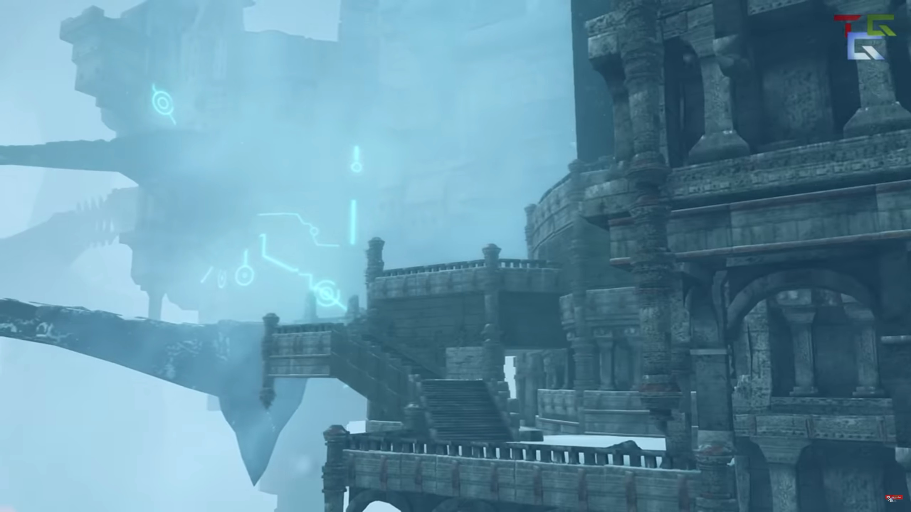

---

The travel would be eventless if not for Nia hugging Pyra's whole arms like a bolster as she dragged her along. Pyra was growing more and more uncomfortable until she mustered the courage to politely asked, "_H-hey_, Nia... Do you, um, mind...?"

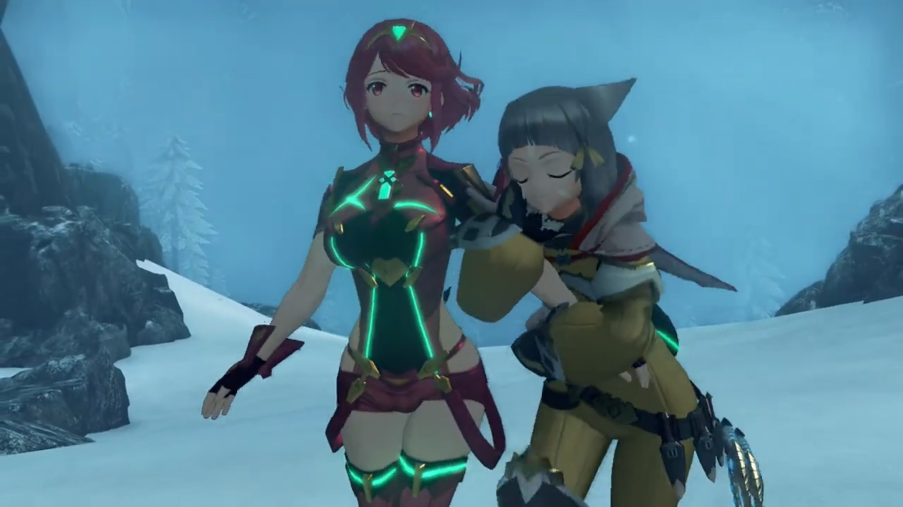

She already knew why, "Heheh, c'moooon, it's not so bad. You're just so warm, I can't help it!" She rubbed against her arms a little, just _a little_, to produce more warmth. But she dropped it thereafter, getting enough warmth (and satisfaction) she needed. 

Gramps explained the physics, "It's a function of what's known as 'infrared radiation'."

"Gramps knows everything."

Pyra innocently exclaimed, "I'm... _not your personal heater, you know..._"

"M-my lady... If you desire warmth, why not take some from **me**? Miss Pyra seems to be in some distress..." offered Dromarch.

Nia didn't even consider it a viable alternative, rejected it immediately, "**No way!** Your fur is all **stiff and spiky** with the cold, it'd be **murder** on my sensitive skin."

"**But, my lady...**" Oh, how awful...

Just when she looked around, something else on the wall attracted her attention, and she changed the topic, "**Hey, is it just me, or are the ether lines really dim?**"

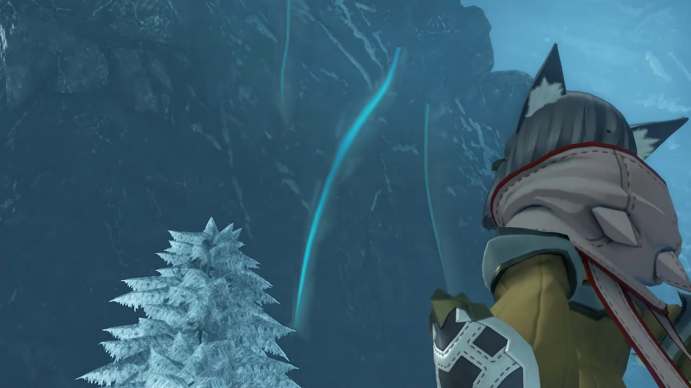

Poppi's [curiosity](/96_heart_to_heart.html#poppis-unending-curiosity) shot up immediately, asked, "What is meaning of- 'ether lines'?"

"**Y'know, those things**, the glowing threads that run inside a Titan."

Dromarch explained, "That is the glow... of pure ether coursing through the Titan's body. You can compare it to the **bloodstream**- of a human."

Zeke praised, "You've got good eyes! **Genbu has-** pretty- **bad-** circulation, compared to other Titans. They **say**, it's **why** we have a cold climate, and awful crops."

Rex concluded, "So it's... cold-blooded?"

"**Heh!** Call it what you like."

---

They stood before the bridge that led to the entrance of Theosoir, the city of Tantal. 2 soldiers stood on each side of the entrance to the bridge, despite they didn't expect visitors. Perhaps there were, even if the country's closed to outsiders? Or perhaps the monsters do visit them? 

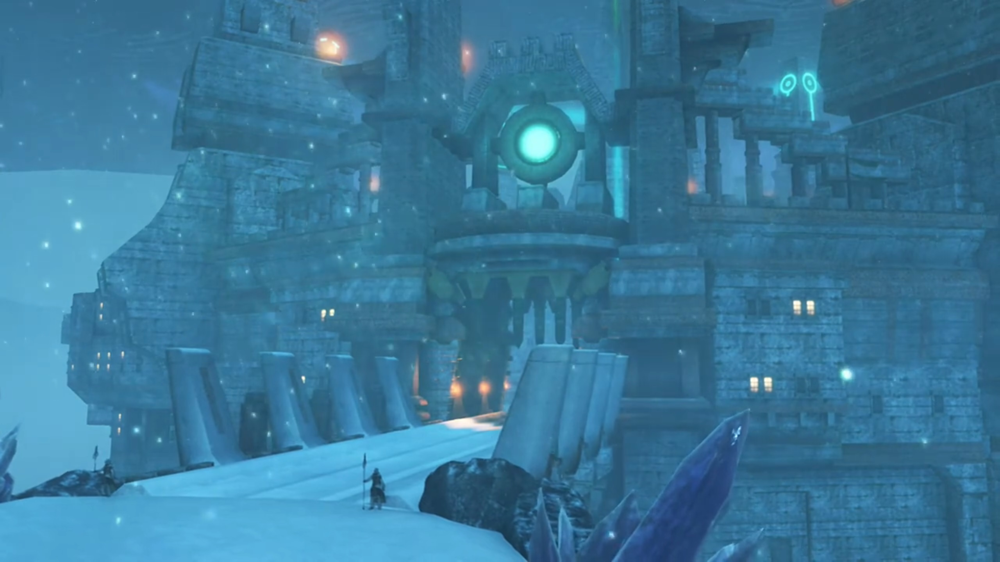

Mòrag was impressed, "_Oh, my..._ This- is the very picture of the ancient civilizations I've read about!"

Zeke expanded on it, "It's a pretty classic look. You know the old land of Torna? They had a proud and noble civilization, rivaled **only** by Judicium at the time. **But**, whereas Judicium- were the masters of- _biological_- arts, Tornans knew all there was to know about engineering. The **proud blood** of Torna- runs in the veins _of us Tantalese._"

Dromarch added, "As there are people to pass it on to, civilization will endure. Knowledge is inherited, much like life itself."

His driver was impressed, "Nice quote! You should write that down."

"Thank you."

Zeke: "It's not that simple, though."

Rex wondered, "**Huh?**" 

He's not explaining, "You'll see..."

---

Immediately entering the city, a square at the center with bazaar and shops. Giant bowl supply fuel for the flames that lit the dark world, and provide barely enough heat from afar. Commerce seemed similar to ancient Arab market civilization, decorating their entity with beautiful rugs where they welcomed their customers, their produce piled in sacks within the three-legged tent. Pillars around the square with ether gathered at their tip, arranged like Stonehenge around the circumference, directed towards a center obelisk. Along the top of the central obelisk, ether drained from the bottom shot a beam high up into the air. 

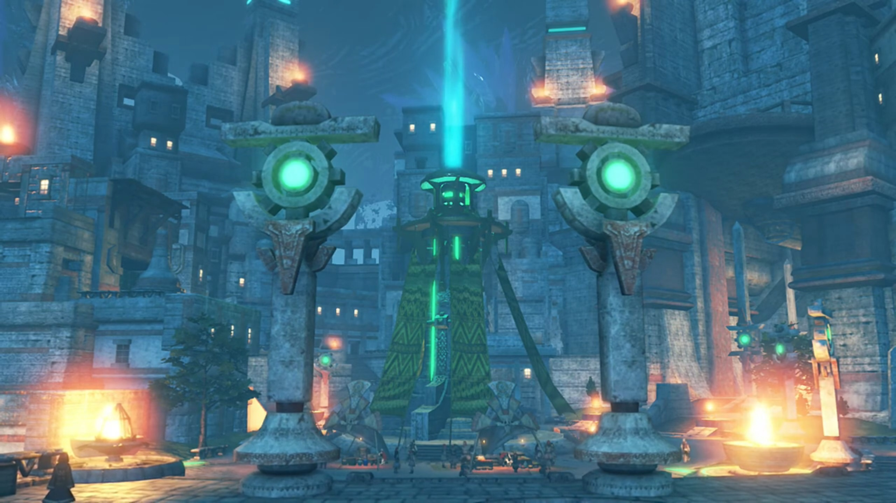

Nia's first impression of the market, "**Whoaaaa**, that's a pretty lively market."

Zeke quietly introduced, "_It's the black market._"

"**Black**- market?"{{footnote: Why, does the black market can be put up in the open? We'll see later.}}

"**Tantal is so cold**, there's precious little in the way of local produce to sell. Just look. All the regular shops are shuttered." He ushered to the proper stone buildings rented out; but they were uninhabited. The doors and shopping windows were closed down with wooden planks nailed in. 

"You're right, they're mostly empty." Rex agreed. 

"Instead, folks pay **ungodly** prices... for produce that's been smuggled in from other nations. And since it's the only thing keeping people from _actually_ starving, the bigwigs just turn a blind eye."

Brighid questioned, "So, most of the agricultural production is wasted **just surviving**, and the country grows weak..."

"Exactly."

Mòrag concluded, "So even the wisdom of a _proud_ ancient civilization... _cannot solve all problems..._"

"**Ancient civilization** sounds- **good** and all... But basically, this place is a giant museum, _with no tourists_. That's not gonna feed anyone." He led on their journey. 

---

Up the stairs just behind the square, the path led towards Theoscaldia palace. The servant of the royal family that earlier spoke to the king was waiting for them. "We have been expecting you, Your Highness."

"**Yeah, yeah. Good to see ya.** Is the old man inside?"

"Indeed. He has been **eagerly** awaiting your return."

"**HAH!** Now I know you're lying. **Armus will fly** before that man welcomes me home. No need to coddle me, mate."

"Apologies."

"Any case, **seems he knows we're coming,** that'll save time." The servant therefore turned around and led the way. 

Mòrag looked around as she walked, noticed one of the pillars with ether at their tip. The ether that gathered within was so intense, locked inside the cogwheels. Reading a lot, she thought she saw it somewhere, though the shape were slightly different, "_Could it be..._"

Brighid wondered why she's immobilized. "Are you all right?"

"_Yes._" She need to do something about it, just in case. By herself, that's not enough, she thought; so when Tora and Poppi caught up with them, Mòrag turned and quietly called out, "_Tora..._" She bent down and discussed whatever they were speaking; only those 4 knew whatever. 

After she finished, Tora don't understand, "_Uh... but why? It true Poppi able to produce own reserves of ether energy, but..._"

"I'll explain later. For now, just do as I ask."

"All right then. **Leave it to Tora!**"

---

The door opened and they walked into the room. Mòrag and Brighid took the lead, their eyes fixated straight and nowhere else. Unlike them, Rex, Pyra, and Nia were flabbergasted as they scanned the design of the ancient halls and ceilings. To both sides of the walkways, soldiers held up their spear with one end on the ground as they stood without a smile. Zeke and Pandoria were leaning on one of the short decorating pillars filled with ether fluid; he don't need to have an audience with the king. The servant returned and stood beside the king. 

When she reached the front, she took off her hat and bowed before the king, knelt on one leg. The king listened as the servant quietly explained their identity, one by one. Where all the rest bowed, Pyra was slow to followed; and Rex was still looking at what all the others were doing before he followed. Forget about the potato (Tora): his legs are too short to bow unless he's willing to kiss the floor all the way down. 

The servant came down and Rex took out the official scripts from Amalthus and handed it to him with both hands. The servant snatched it with one hand; Rex curiously raised his head as he tried to look at the king. 

The king took it in his hand, but he didn't yet read it, first focused on Pyra, "_The Aegis... I presume._" He had his target. He heartlessly laid eyes on the manuscript, scanning 10 lines at a time. When he finished, as he'd expected, or rather, he'd already know what he wanted to do before reading it, he had no need for such instructions, and he tore it away, shredded it into pieces. 

"**Uh?**" The group don't understand why did he do that. Zeke was feeling very angry at his old man's action, "**HUH!!!**" The soldiers received their call and surrounded the group. 

"**Guards?! MY LADY!**" The group stood up in a circle, back to back, prepared for whatever to come. 

Tora felt scared, "**Meh meeeehhh??**"

Nia: "**Wh-what the hell is going on? Shellhead?!**"

One of the guard hugged him and Pandoria. He was struggling to free himself from his grip. "N-**no idea! Stop this at once! DAD!!!**" He shoved the soldier aside and shouted at his old man. 

The old man raised his hand. A fork on the ceiling gathered electricity and strike right at Pyra, "**AAAAAARRRRRGGGGHHHHHH!!!**" 

"**GRRRRRAAAAAHHHHHH!!!**" Rex felt the pain she felt. 

Nia: "**Rex!**" 

Then, a prison dropped from above and imprisoned her, tied her hands to the side and her legs together. With her losing consciousness, the prison floated up, floated behind the king, and went out of their sight. 

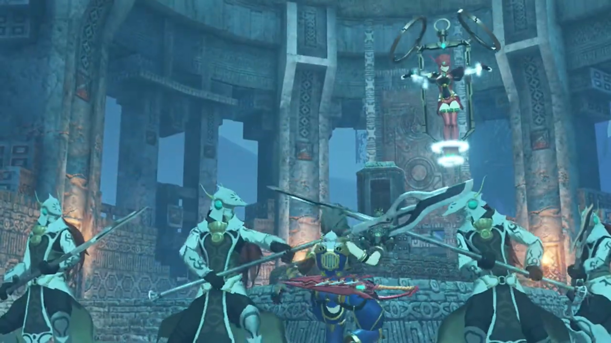

"**Pyra!**" Rex stumbled as he tried to reach for her. The guards blocked his way, rounded their spears and pinned his neck to the ground. All the time his eyes was fixated on Pyra. "**Le-Let her go! Pyra! PYYYYYRAAAAAA!!!**"

Zeke went in front of Rex and shouted at the king, "**STOP THIS MADNESS!!! WHAT'S GOING ON?!!!! REX and his lot HAVEN'T DONE ANYTHING!!!**"

The king had now an obligation to explain to his son, stood up from his seat and said, "We cannot afford to wait until they doooooo, Zeke. **The world must not be allowed to burn.** _The Aegis must be destroyed!_"

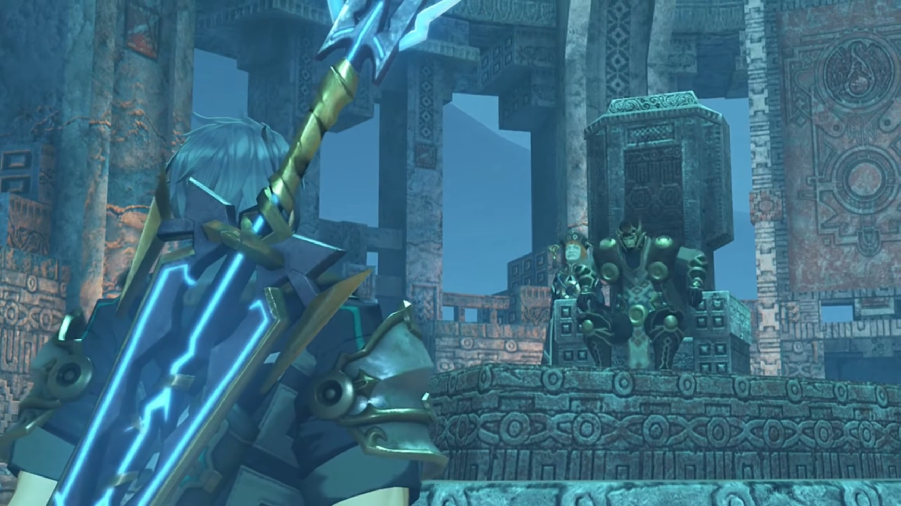

Nia: "Oh, no, you don't. Dromarch, let's get Rex outta there!"

"Roger!" They dashed towards the soldiers; swinging her rings, ether on the surface were sucked away, and the final touch, the guard easily blocked it. 

Nia was surprised, "**The ether energy! ARRRRGGGHHH!!!**" The soldier took the chance and lanced at her, felling her. 

"**My lady! AURGHHH!!!**" The pillar of lightning strike once more and disabled Dromarch. 

The king instructed, "Please, do not resist. My goal is only... to destroy the Aegis. I have no wish to take your lives also."

Mòrag was calm despite all calamity, put back her cap and said seriously, "King Eulogimenos. I stand before you, as a **special envoy** of Mor Ardain. The Emperor sent me here **himself. Do you realize** what you are doing?"

"I am quite aware. And **prepared** to face the consequences."

"_Prepared...?_" So this had all been planned. She got what she needed. 

---

The soldiers had already pressed them to their cells. The soldiers left the room, leaving the space for the king, the servant, Zeke, and Pandoria. Zeke couldn't help them yet, but he wanted to know "**WHY? WHY DO YOU HAVE TO BUMP PYRA OFF?**"

"**I see you speak like a commoner.**"

"**WHAT'S THAT GOT TO DO WITH ANYTHING? DON'T CHANGE THE SUBJECT!**"

"**What if** I told you I act for justice?"

His eyes squinted, "_What are you trying to say?_"

"You could say... I'm doing this for Alrest."

"Say **WHAT NOW?**"

"Follow me."

---

Zeke found himself inside a room carpeted with those Arab rugs the merchants used earlier. Piles and piles of crates and barrels, and some vases and jars and paintings and scrolls and jewelries, piled on top of one another. All had the imprints of the Royal family sigil on them. But, there's something wrong with the sigils... They looked... different. Well at least, not all of them looked the same. 

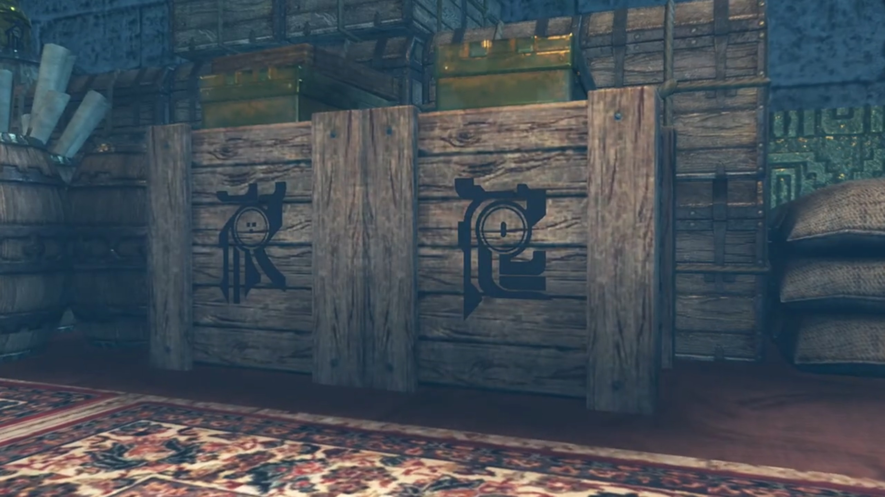

The king stood beside him, waiting for Zeke to take in the shocking info, "**Th-this is...**"

"This is... the legacy of our royal line."

"_You can't be_ **serious...**" His rage flood his chest. The more he tried to suppress, the more he felt inflamed. "**WHY??? FATHER, WHY?!!!**"

His old man dropped his head in slight guilt. What dad would have disappoint their son? What dad acts as anti-role-model for their son? 

### Footnotes: