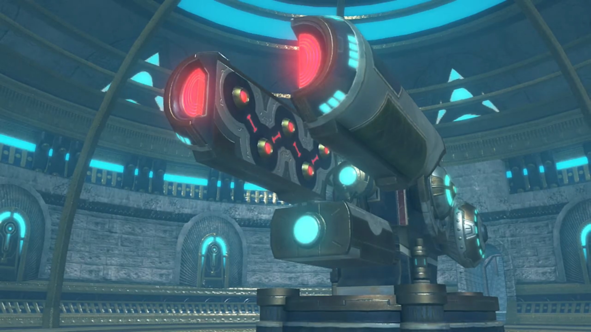
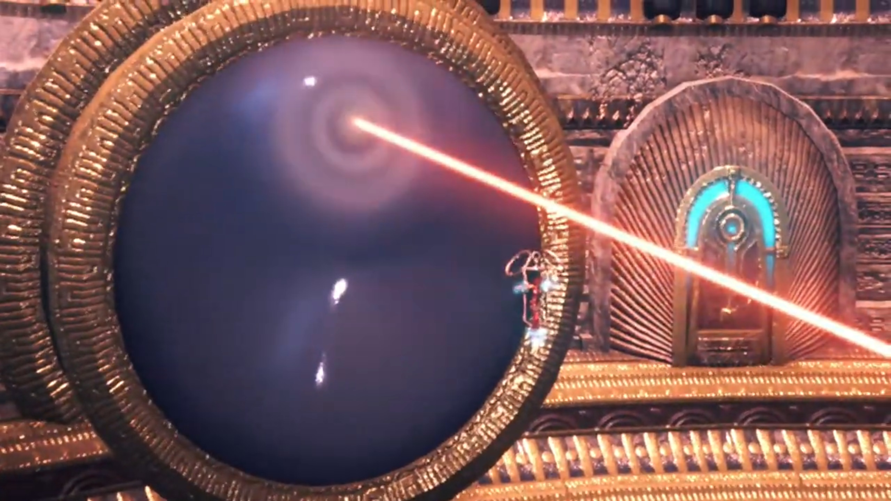
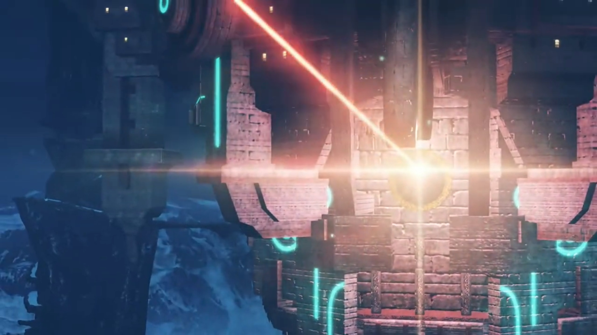
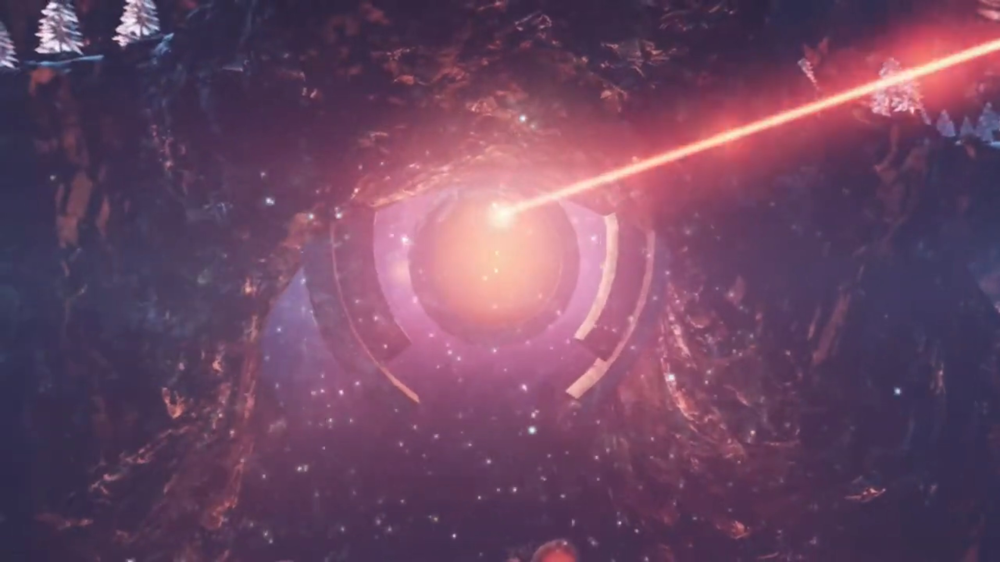
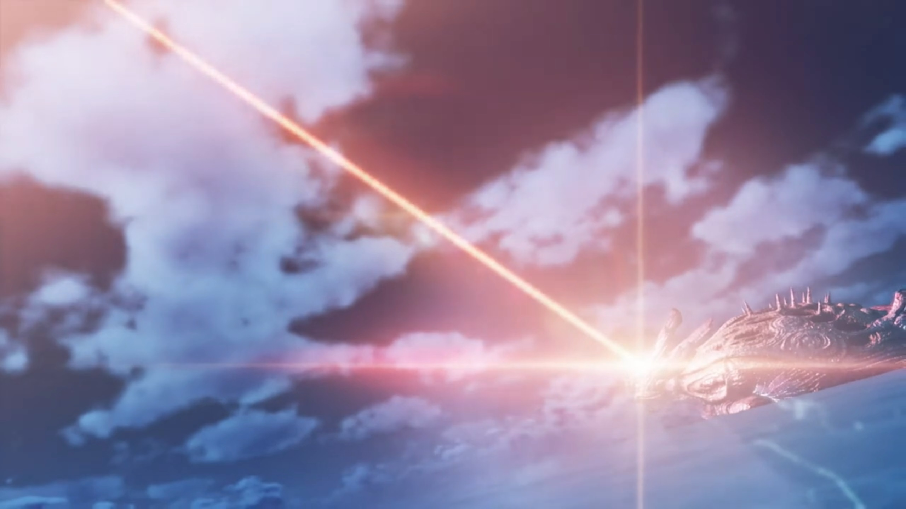

# Escaping

===

The few-inches-thick metallic prison door was lined with many blue squares. Just how high-tech was it? The flow of ether lit the room, and the door draws ether energy to deflect attacks, like how Rex wielded his sword, banging on it right now. He didn't even leave a scratch; the deflectors on the door pushed him back. But he won't stop trying, not until he rescued Pyra. 

Nia folded her arms and watched; was there any use? 

"**UKH!!!**"

Dromarch observed how the prison works, explained, "It appears the flow of ether energy is being blocked off."

"**DAMMIT!!!**" He sheathed his sword, seeing his action caused no avail, worriedly voiced, "While we're doing this, **Pyra is...! We have to do something!**"

Gramps consoled, "There is no point, Rex. You're just wasting your strength."

Dromarch continued his observations, "Both the walls and floor are built to withstand great force. **We**- cannot make a dent in them."

Nia urged, "Let's calm down a bit, Rex. _If we_ think calmly, we'll come up with something! Grr!" Why are the other 4 at one corner, not doing anything? "**Hey, you lot! Can you try to help us out here?!**"

Mòrag: "Your efforts are pointless. The way they built this place... It's essentially- one- giant- stasis- web."

That reminded her, "_Stasis web?_ Like those nets you used in Torigoth?" 

She nodded. "To lock Drivers up together with their Blades, and **even** leave us our weapons, they must have the **utmost** confidence. **Perhaps**... we could break through, given enough time... But by then it will be too late, and the Aegis will be disposed of."

"'Disposed of'...?" She jumped on her feet, "**That's all the more reason you should give us a bloody hand!**"

She shook her head, "I said it's pointless."

"Pfft!"

"We **won't** get anywhere... _with brute force, that is._"

Her eyes widened. "_Huh?_" She watched the grin on Mòrag's face. 

---

Zeke and Pandoria was at the top of the castle, overlooking the square alone. From what his dad revealed earlier, the only more he thought, how dark is the nation's fate, ruled by such dark royal family. The whole nation felt like a liar, a cheat. And the poor people out there don't even know a thing, yet they suffered this fate for the last 500 years! But no, he's not ready to give up. There should be a way... 

"So what now, my Prince?"

"_This pisses me_ right off..."

"Um, say what?"

"**I said, I'm pissed off!** Doing it for the world, **my arse. How** self-serving can you get...?"

"How d'you mean?"

"**This** country's **strangling itself** to death **with ITS OWN WEB OF LIES AND EXCUSES!!! But just** maybe... _our chum could break it free..._"

"Rex could?"

"No faith, eh?"

"Hey, whatever. If you believe in him, my Prince, I'm with you all the way."

"That kid's heart is pure. **Too pure for his own good,** sometimes. But **isn't it** _our_ duty as _adults_ to give him a little _help_ with that?"

"**Pro-bably... You know,** this is what I like about you."

He appreciated the help, but "This won't be easy..." He warned.

"Oh, **quit it with your drama!** _When is_ anything ever easy for you?"

"**HAH!** _Heh_. Let's go!" And they headed back into the castle. 

---

Back in the cell, Tora and Mòrag were meddling with Poppi while the others watched. Mòrag made the call, "OK, that should do it."

Tora: "Preparations complete!"

Rex wondered, "What's going on? Tora?"

Time for showing off. "**Ohoho!** Both Drivers and Blades, use- **ether energy** to deploy Arts, yes?"

Nia urged impatiently, "You can skip the lecture, Tora. _Everyone knows that._"

"But right now, friends **cannot**, yes?"

Rex agreed, "**Yeah**, there's something about this room..."

"**Ohohoho!** _But Rex-Rex and friends forgetting one_- **very important** thing!"

Nia was losing his patience, "**Hurry up, would you? Just spit it out, furball!**"

"Could be- _friends forgetting_, Poppi is **artificial** Blade?"

Rex don't understand, "Why would we forget that? She's been **with us** all this time... **Wait! I get it! Her ether furnace!**"

Poppi nodded, "Rex correct. Thanks to friend Mòrag, Poppi now able to generate own supply of ether energy. Nothing barrier can do anything **about**."

"Tora transfer crystal from sword of Mòrag- to Biter- of- Poppi. **That** crystal have **enough** energy stored for **one use** of Arts. And **Biter** of Poppi use **Earth** element. So, through **synergy** with **Fire** element of Mòrag, power of **Arts is amplified!**"

Mòrag added, "**If we hit it straight on**, I doubt the door can withstand that."

Nia was confused, "Wait a minute, you stored energy in that crystal? _How is that_ possible with a barrier?"

The wise Dromarch already got his eureka moments, "**AHA!!!** Lady Mòrag has not used a **single** Art since we **arrived** in this place!"

"Whuh?"

"I had my suspicions- ever since we entered the palace. So- I secretly asked Tora to refrain from using any Arts either."

Tora now felt so clever, "**OHOHOHOH!!!**"

Gramps: "I see now. If our enemies knew Poppi **retains** her power inside the barrier, they would keep us on a tighter leash."

Mòrag: "Exactly. **Here goes. Step back.**"

Poppi walked forward to prepare herself when Rex shouted at them, "**HOLD UP! If you transfer the crystal** from the sword, what will you fight with?"

She looked at him like looking at an idiot, "I can generate a new one from Brighid's core! Pfft! Don't tell me... you didn't know about **that.**"

His eyes widened with curiosity and inner barriers, "**What...**"

Nia was impressed, "Seriously? You don't even know how Blade weapons work? _Give me a break._"

"**How... would I know something like that?! I've never... lost or broken my weapon!**"

Brighid: "Then I suppose I cannot blame you."

Mòrag: "**Moving along, then...** Tora, Poppi, please?"

"**With pleasure!**"

"**Poppi power!**" His biter activated as the hatch opened up. "**Jet Biter!**" The bomb stored within launched itself straight at the door. Flame and smoke engulfed the door, and the door slammed against the outside wall. Everyone's smile tightened as they saw hope returning to their side. 

Tora: "**We- did it!**"

Poppi: "**We the best!**"

Gramps warned, "You made quite some noise, too. It won't be long before the guards arrive!"

Rex: "Good point!"

Dromarch suggested their next step, "Lady Pyra was taken below. Mayhap... somewhere beneath the palace?"

"**Got it!**"

---

On their way to where they think Pyra was, encounters with guards were inevitable. At one such hall, both sides were about to start battling when the Ultimate Lightning Fury Slash fell all soldiers. Rex eyes widened, and his lips jutted up, as he saw the two. "**Zeke! Pandoria!**"

They were surprised, "**Oh, what? We came all this way to bust you out! How inconsiderate!**" that you got out before we save you! 

"**You kept us waiting!** Won't you... get in trouble- for helping us?"

"**Ahhhh**, I'm the prodigal son anyhow. It can't get any worse."

"Where's Pyra?"

Pandoria already mapped it out, "This way. Follow us."

---

Through the hallways that bridge between one building and another, there were no guards in between. Torches along the pillars lit their way. "_Ow-ow-ow-ow-ow_" Rex was stopping and kneeling on the floor suddenly. 

"You all right?" asked Zeke.

"I'm fine. It's just a scratch." He stood back up, to not kept them worried. 

"Honestly, though, chum, are you **ever NOT** getting scratched up?"

"Ever since Pyra gave me half her life force,  and we **swore** to reach Elysium, **things** have been rough. **But...**" 

> He recalled how, after escaping Torigoth, they bandaged up with the same wounds. Her scratches. Her eyes. Her emotions. 

"**I'm actually glad! They feel like a sign of... our bond**, I guess? **Something special we share, as Driver and Blade.**"

Zeke's irises tightened. Can't deny that, but... both of you feel hurt at the same time, though. To go through the pain together, when a Driver sought to protect his/her Blade? Perhaps it worked both ways. 

---

"_Urr... nghhhh..._" She woke up from the devastating attack earlier. She looked around at her prison, wondered, "Where...?"

Mythra already observed earlier, answered her, "Strung up in some kind of restraint. Look ahead..."

"Uh!" She immediately noticed the ancient-built cannon, with its barrel split into half, and balls seeming uncharged facing each other within the walls of the barrel. "An ether accelerator. I've **seen one** like it before, in old Torna. it certainly seems like they want us gone for good... So... if we cranked up the output and really focused it, we could probably manage one strike."

"If the people here... really are the descendants of the Tornans, then I... have a message for them that I **must** pass on." Even if she's gonna die after that. 

"In that case, I'll leave it to you."

"Thank you, Mythra."

"He's here." The king, accompanied by some soldiers, walked along the foot of the cannon. The disk it was supported on was surrounded by a moat of ether. 

The king started calm, ended unwaveringly, "I apologize for this, noble Aegis. I have no personal grievance with you. _However_, for the sake of this world, **you must be destroyed where you stand.**"

"**Is that truly your desire, Your Majesty?**" Pyra cried out. 

"I believe you desired the same thing yourself, _once._ Is that not why you disappeared from history, **along with Addam the hero?**"

"'Ugh..." She can't deny. 

The king ordered, "Begin." The soldiers nodded and went to the control panel. Energy was drawn in from its reserves; the mere heat released by the mechanism shone the room bright red. The balls within the barrel gathered flames that joined with the other side. Pyra watched it gathered energy in silence. 

"**PYRAAAAAAA!!!**" Her eyes lit up when Rex's voiced from the distance. 

She had already prepared to die, but now she felt content. Even if he was late, at least, at least let me see him one more time. "**Rex!**"

Zeke introduced, "The ether accelerator."

Nia don't understand, "_The what now?_"

"It's a weapon from **long ago**... designed to use Genbu's ether energy for destruction. I never **DREAMED** they'd fully restore it... My old man... He's gonna use it to kill Pyra!" The king did noticed them; he stood back as the soldiers came for the group. "**No matter how strong** she is, there'd be no coming back from that!"

Rex: "In that case, we can't let him use it!" And they prepared for battle. 

---

The heating up and charging up were almost finished. Brighter and brighter, the flame glows. Pyra had been looking depressed, didn't hope for anything. Rex and the group were having difficulty slicing through the soldiers, coming in waves after waves. "**Argh! There's too many of them!**" Their time is nigh!

Zeke: "Hurry, **or Pyra's toast!**" But can't! Each one of them had to face several soldiers at once. 

"**I know that! It's just...**"

The king wept an insincere tear, "_Forgive me._" He raised his hand, and the soldier pulled down the handle. 

"**Dammit! Pyra!**"

"**I won't let you..!**" With his Ultimate Lightning Fury Slash, He deftly evaded the soldiers, jumped in the air and aimed for the cannon, stuck his sword into the left barrel. Alas, the electricity he released "**IT'S NOT ENOUGH!!!**"

Tora ordered, "**Poppi! ACTIVATE QT MODE!!! LIFT UP FROM BELOW!!!**"

"**UNDERSTOOD, MASTERPON!!!**" She flew in the air where the soldiers couldn't reach, swooshed along the circumference of the disk, and got below the end tip of the box below the barrel{{footnote: Look carefully, there's a box below the splitted-barrel. Unfortunately, because one don't know what's that for, one had no specifics to explain.}}. With full blast from the rocket blasters below her feet, she pushed and pushed and pushed. 

"**DO IT, POPPIIIIII!!!!!**"

"**HEEEEEEAAAAAAVVVVVEEEEEE!!!! HOOOOOOO!!!!**" The angle of the cannon changed as it aimed for the ceiling, away from Pyra. The king could do nothing about it, while the soldiers by his side backed a few steps in case it toppled. Zeke pulled his sword away and jumped, while Pyra closed her eyes, just before the ether beam zwyrred through a convex lens on the ceiling to outside the castle. Where it shot, there was an even larger convex lens along the way, built on top of the mountains some distance outside the town, amplifying the beam. From an even outer view, on Genbu's head, it closed its eyes as the blindingly bright light shot through to the sky, like a beaming beacon that revealed its location to everyone else living in Alrest.

When the energy finished, Poppi released her push and the cannon smashed back down on the disk, shaking it. The soldiers stopped fighting them, couldn't took their eyes off the nervous moments. Nia exclaimed, "It missed? **They did it, Rex! They stopped it!**" Only the king's gloomy outlook could explain how disappointed he felt. 

Rex: "**Yeah!**" 

Zeke launched once more Ultimate Lightning Fury Slash and sliced through the chains that held Pyra. "**HYAHHHHH!!!**" The hero of the day, he was too handsomely showing off he couldn't catch Pyra dropping to the ground. 

Rex went for his partner instead, took her in his arms, "**PYRAAAAAA!!!**" The rest gathered around to check her status. She opened her eyes and smiled at him, and he felt relief. 

But they'd forgotten someone. "Five hundred years... For **five hundred years, we Tantalese have concealed**- the Omega Fetter... Do you know why?"

"_Ummm..._"

"Our old homeland, Torna, was destroyed, _in the Aegis War._ Our hero, Addam, also- failed- to return... You must understand, old Torna as a country was united around the Hero. But _our ancestors, less so..._"

> Inside the room with the various possessions, Zeke questioned his dad, "**What're you saying?** That we're not Addam's bloodline?"
> 
> "Precisely. In Torna, our family were just a cadet branch. We only gained our _current position_ in the confusion of the war's aftermath."
> 
> "But then, we're just a **bunch of USERPERS!!!**"
> 
> The king tightened his eyebrows, explained himself and his ancestors off, "They were desperate _times._ **We had no choice! The nation must continue at all costs!**"
> 
> "Even if it meant claiming Addam's name?"
> 
> "With its guiding force gone, much blood was _spilled_ in Torna. **We did** what had to be done to reunite it under the new _banner of Tantal..._"

The story took so long that evening turned night. Mòrag commented, "Legends of the hero who saved the world, are deeply ingrained in people's hearts. And you used them for your _own_ political agenda?"

"Even so, all was done in the name of saving the world from burning _once more._"

Zeke felt like vomiting hearing such excuses, spit out, "Don't you **dare** try and sugercoat it. **Short story is**, they saw an opportunity to gain influence, _and they took it!_ **Grrrrr!!!**"

"That is the way of the world."

Brighid suspected that "Mor Ardain could easily take a similar path."

Mòrag agreed, "_Yes._ We are in no position to _condemn them outright._"

Nia wondered, "So did this Addam guy reaaaally never return?"

"*Indeed.* The records indicate- he went missing immediately- after sealing away the Aegis. It is likely he _simply perished_- during the journey home."

"He didn't just go missing." Pyra spoke out. 

"_What did you say, Aegis?_"

"Addam... He had foreseen... **everything.** He knew what would happen to the people- **after** the kingdom fell. _But..._ he **chose** not to return."

The king was surprised, "Addam left us of his own will? But why?"

Pyra removed her left earring and took it in her hands. Addam had left a holograph within it, a recorded message. "Hear me, my scions. I- am Addam- Origo. This day I seal the Aegis- away from the world. But this seal- is **not** for eternity. **In anticipation- of the day** that humanity becomes _worthy_ of the Aegis's power, I entrust her _to posterity._ She is our hope. **When mankind** has matured, and learned to live better lives, **she will answer** your call, **and return** to you. **Trusting** that day will come, I leave my _final wish_ to you..." And that's the end of the recording; she put it back on. 

She continued, "Addam foresaw- **much confusion** and hardship in the world ahead. *And when I seemed unsure, he told me something. **'This, is a Trial.'***"

> "Is me sleeping a part of the trial?" She felt so scared going in herself, into the dark nights, awake in her dreams that shall last for 500 years, alone. 
> 
> "That's right. **It's a trial** _for us humans._ **One we must overcome ourselves.** If we cannot do that, we don't deserve to live _alongside_ you."

The king got it, "_Live alongside..._"

"To be honest, I-I still don't fully understand what he meant by that. Whether he simply meant the coexistence of humans and Blades, _or something more..._ But I think he made a- _difficult choice._ For the sake of **everyone's** survival."

Suddenly, the ether flowing through the Castle turned red, stopped flowing. The ground started shaking, attracting their attention. "Whoa!" Rex wondered what happened. 

Looking out the window, large amount of ether started being drawn away from Genbu. The blizzard got worse. A soldier have reports, spoke quickly, "Your Majesty!"

"What is this?"

"**It's Genbu! It's broken free of our control... and started to dive into the clouds!**"

"**What? Are you certain?!**"

"Ungh!" Pandoria suddenly felt a jolt in her heart as she went to the floor. 

"**PANDY!!**" He tried to assess her situation. 

"**Oh... oh, no...**"

Dromarch wondered, "What exactly is happening?"

Zeke hypothesized, "_Could it be..._ that blast?" Then he stood up. 

Nia noted, "What is he..."

Zeke explained, "Tantal keeps Genbu under control using the Omega Fetter. But **firing** the **ether** accelerator... it **could've** created a **counter-flow** in Genbu's **ether** conduits, causing a _critical_ overload."

Rex summed it up, "So Genbu's broken?"

Pandora shared as she panicked, "_Oh no._ My words can't reach him anymore. Genbu is just going to dive deeper and deeper... then..."

Zeke: "**DUMB OLD- GIT!!! That's what happened when you use ANTIQUATED PARTS!!!**" Just then, the Titan started shaking. 

Rex remembered, "The Cloud Sea... has a similar density to water. As we dive, the pressure will keep building. **By 500 peds, a human** would be **crushed completely...**"

Dromarch added, "And all that force will weigh down on Genbu?"

Zeke was thinking for possible solution, asked the soldiers, "What's our depth now?"

Without the need to check, he sensed it, "**Twenty-two hundred peds, Sir!** We are diving at a rate of 120 peds per minute!"

"And Genbu's depth limit?"

"25,000, give or take..."

"That'd give us... **just over 3 hours.**"

Nia was impressed, "**Whoa, Shellhead. Good at maths!**"

"Bite me." The floor continued shaking, telling them their time is nigh if they don't move now. Glass started to shatter as atmospheric pressure built up in compressed air. Ears starting to felt hurt. "_This ain't good..._ Hey, chum. _There's a pressure-resistant pod_, in the palace's southern tower. You guys, **at least**, should get in and escape."

"What about you and everyone else?"

"Don't- worry about us."

"**How can I possibly not worry about you?! Isn't there any other way? Some way to save everyone?!**"

"Only Pandoria _can tell Genbu what to do._ **If it won't budge for her**, it's no use." She was on the floor, trying hard to communicate to no avail. "**Apart from that**, all we can do is try to evacuate as many people as we can... But with just **three hours...**"

Pyra recalled, "I think you mentioned before, you control Genbu using the Omega Fetter, right?"

"Uh, **yeah**, but-"

"Where is it?"

"Inside Genbu's head. It's **straight south** from the palace, through Genbu's spinal column."

"I will go." Rex watched as her stubbornness returned, replaced her constant desolation and constant lost of hope. In times of crisis, she _is_ reliable. 

"_You'll go? Pyra, what are you-_"

"The Omega Fetter- is originally Ophion's control core. And Ophion... is my Artifice. I **can't** be 100% sure, but **I think** I might be able to fix it."

Rex: "Pyra..."

"Pyra- being serious? They- try to **kill Pyra** one minute ago!" Tora can't understand why.

"**That's a- totally**- separate issue. **Isn't that what you'd say, Rex?**"

Should he support her? "Wha-? Oh, **yeah**. I guess it is."

"And that's why."

"_Friend Pyra..._" In that case, "**Tora get it. Then Tora and Poppi ALSO LEND HELP!!!**"

Nia don't see otherwise. "Looks like we're in too. Dromarch?"

"I would have it no other way."

"That's settled then. **Stay out of our way, old man! Got it?**"

The king was impressed, "**You would all... risk your lives** for this? **For the sake of Tantal, though we attempted to destroy the Aegis?**"

Rex explained, "It's not about Tantal."

"Then why?"

"**You're a king, right? You** ought to be able to figure it out."

"Rex, you are..."

Rex didn't wait to listen, turned to "Mòrag?"

She hadn't made any vow yet, but "You leave me little choice."

"**Zeke, where was the Fetter** again? **How do we get** there?"

"I won't just tell ya. I'll take you **right to it!**" How could he leave themselves to save his nation and he sits here worrying about it, unable to do anything? 

"Zeke..." His old man called out. 

He already predicted the possible saliva and waste of time ahead, immediately ordered, "**SAVE IT, OLD MAN. You better make a start on evacuating the people. Though, with us on the case... YOUR EFFORTS are PROBABLY going** to be *wasted!*"

"_Huh..._ Understood."

"**No time for chit-chat. Let's go!**"

"**Yeah!**"

### Footnotes: