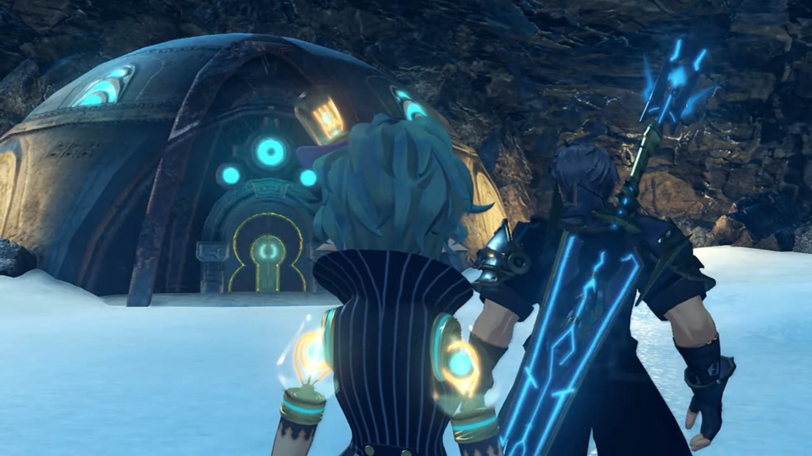
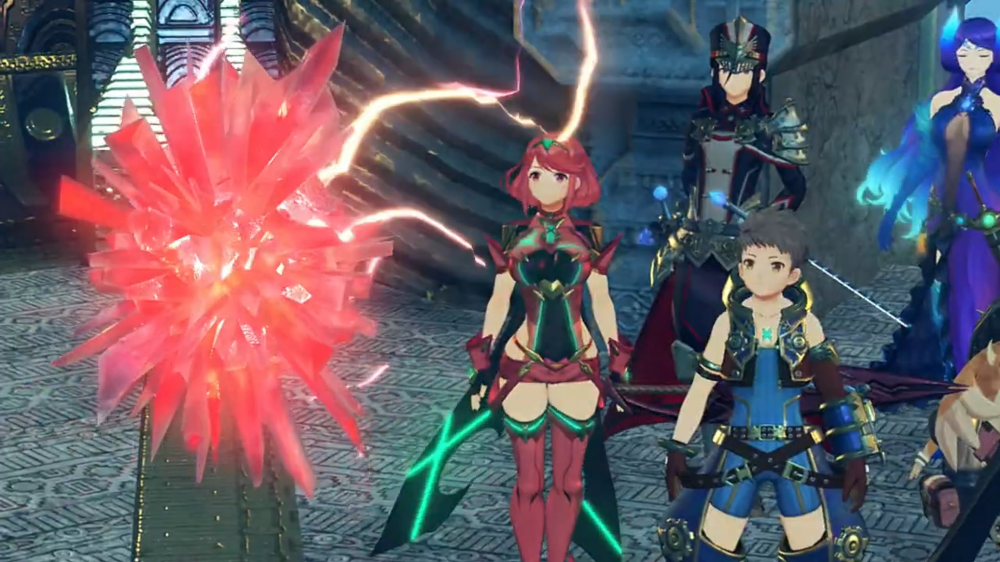
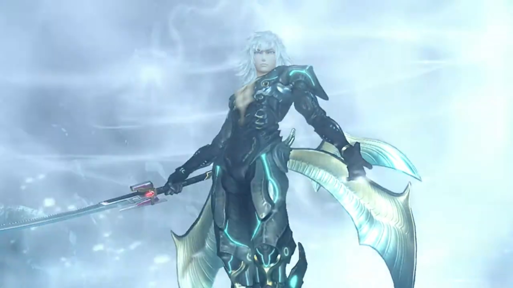
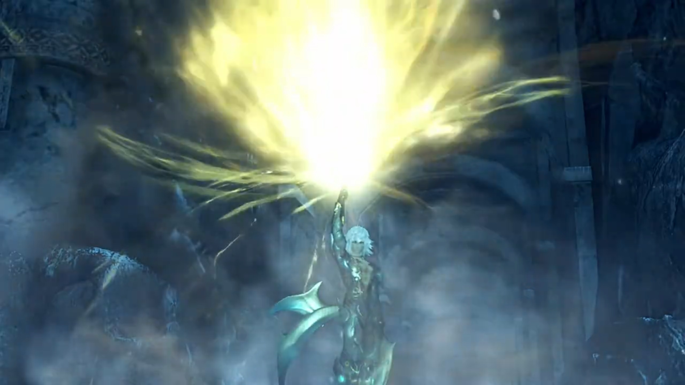
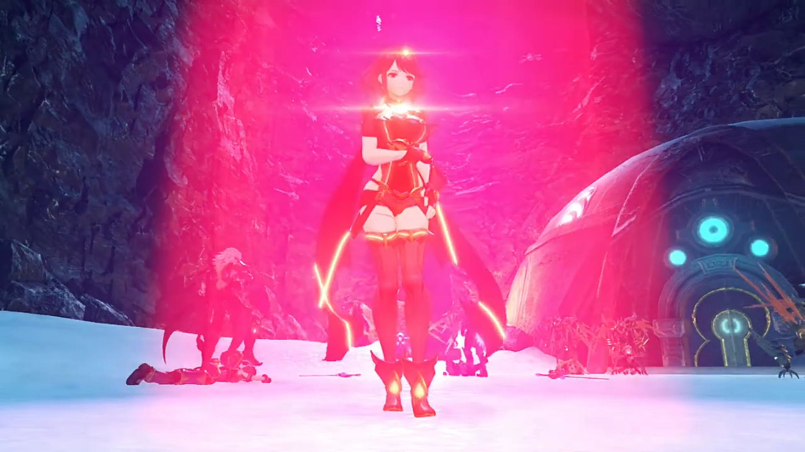
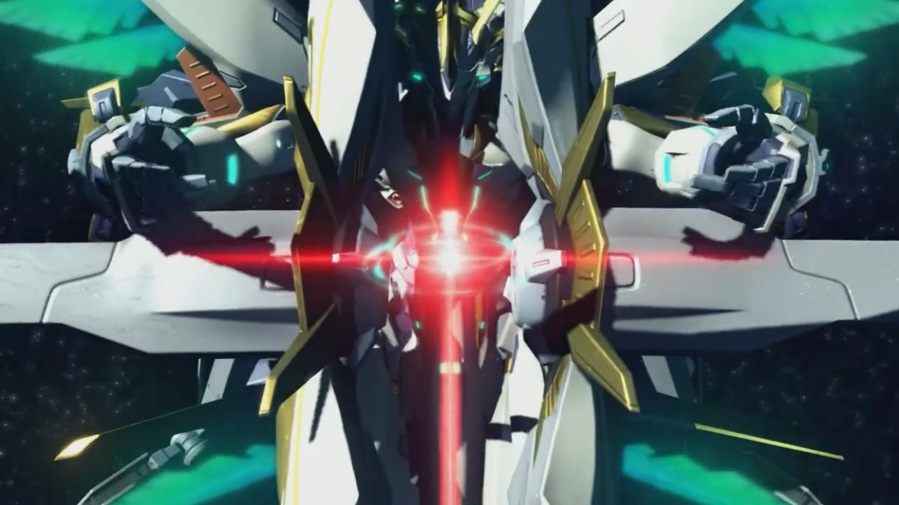

# Pyraaaa... PYYYRAAAAAAA!!!

Say, they don't have time for chit chat, but Mòrag couldn't help it. They took their time, while she plunged into deep thoughts. Brighid heard her footsteps disappeared, turned around and commented, "Lady Mòrag, you're making that face again. **If you keep frowning** like that, you'll get wrinkles."

"I just don't get it. Tantal was founded by the counter-Addamites. **Then**, after the war, they closed themselves off. But... _the way the king was acting, I can't help feeling there's **something** more **to** it._"

"What, though?" wondered Nia. 

"**It was the Praetorium**- who sent us here on this mission. **Why** would he go to such lengths to **reject** it? It seemed almost like he **wanted** to cut ties with them..."

Brighid hypothesized, "You think Indol- is holding something else over Tantal?"

"That would be an explanation, yes... **Zeke, do you** know anything useful?"

"**Nope!** There's no **records** from back then." If there is, it'll be by words of mouth, never written.{{footnote: That's presumably how they pass on the most important stuffs that don't want to get stolen -- either they bring to grave with it, or they pass it on before their death. But that, while common in Chinese novels, we cannot assume it be true for our human society, as one isn't an historian, and hence one don't know. Remember, 'common sense' is mostly 'common **non**sense.'}}

"How about you?"

"There's nothing in my journal from that period," noted Brighid. "I- might have been returned to my core- for some reason or other."

There's still someone who was awake during that period. Rex asked, "Do you know anything about those days, Gramps?"

He popped out of his helmet, "**Hmm? Noo, I was somewhere else** at the time. **And matters of human** kingdoms and so on **didn't** interest me much."

He complaint, "**Geez, Gramps, what's the point** of keeping an old-timer like you around **if you don't even know anything?!**"

Gramps didn't take offense, noted instead, "Sometimes, it's funny how much you sound like- Corinne."

Back to the topic, Nia rephrased, "So you think the king wasn't telling us everything?"

Brighid agreed for her Driver, "There is a chance."

Dromarch suggested, "Do you think... it may be related to **Jin** and his comrades using **Torna's** name?"

That put Rex in deep thoughts. He recalled what Jin said earlier, 

> "If you saw the last state of humanity, you'd understand. Now that you have come this far..."

"The last state..." What does that even mean? 

"Hm?" Brighid ushered. 

"Jin said something about the last state of humanity. I thought he meant, like, an evolution... y'know, in the future... but **maybe** he meant the **previous** state of humanity?"

"And **that** is the key- to why they fight...?"

"**Hmmmm!**"

In Pyra's mind, the puzzles now pieced together, and she came up with an explanation that she kept it for herself. "If... If that is the case... Perhaps I... never should have been sealed away after all..." 

---

On a valley covered with thick snow, fallen remains jutted out near the top. The Omega Fetter was just up ahead; Rex looked at all the remnants, wondered, "What is this place?"

Gramps knew this, "A battleground- from the Aegis War...{{footnote: So Genbu was around during the Aegis War?}} There are **many** things here I remember..."

Nia observed, "**The walls and floors are melted.** Must've been a **hell** of a battle."

Pyra explained, "Ophion isn't the only Artifice. You've already seen one other -- Siren, the one Mythra commands. But during the war, there were **countless** Artifices, wielded by Malos."

> All had the same shape, monster with weapons on their hands, wings at their back, and a ring above their head, flying to the destination like grasshoppers migrating. 

Rex concluded, "So... it's a site of a fight against him..."

Nia had heard of the word for a very long time, but she wanted to know more exactly, "Say, **what are these**- Artifices, anyway? We've only actually met Ophion. We've never even seen Siren, just that light thing it shoots down."

She looked up into the sky, replied, "They're a power granted to the Aegises. Divine swords sleeping in Elysium, far above us all."

"Hold on. _I thought_ Elysium was a paradise, not a scary weapon stash?"

She shook her head, "I don't know."

"Whaddya mean, you don't know?"

"All that I can find in the corners of my memory... is that townscape... I don't know why Father created me, or created the Artifices... That's what I want to find out."

"Pyra..."

Rex assured her, "**It's OK. We'll find out once we get there!**"

Nia was more pessimistic, "I don't think..."

"**Open a chest, it might turn out great... But until then, it's just a crate! That's rule 4 of the Salvager's Code! Hahah!**"

"Rex... _Comparing Elysium to dirty old sea junk..._"

---

The group exited the valley and Pandoria urged, "My Prince, look over there."

A metal-built dome-shaped bunker with ether flowing within its walls. The dim lights coming in through the top of the cave reflected off the snow, providing a clear view. "Would you look at that! I guess we've arrived."

Nia was impressed, noted, "Whoa, it looks way older than the palace..."

Dromarch added, "Yes, it seems untouched by the ravages of time..." 

In front of the door, Zeke gave his consent. Pandoria touched her core, communicating with the door. Everyone walked in, and the only object of interest is the gyroscope-machine in the middle of the room. Zeke reached for the control panel that had a fire imprints on it. Hovering his hand over it, the symbol lit up ether-green, and the gyroscope started rotating, its hands aligned and formed a thick ring like that of Saturn's, revealing a red crystals with electric sparkles and spikes that change length as it throbbed like a heart. 

Rex observed, "Looks like a Core Crystal! Is that... the Omega Fetter?"

Pyra assured, "Yes. That's Ophion's control core. It was originally a conduit... that I used to communicate with Ophion."

The ground shook more as they talked. Brighid urged, "We have to hurry."

"Yes, you're right." Pyra handed it over to Mythra, she took it in her hand and plans rushed through her mind. 

Rex impatiently asked in a matter of seconds, "Well? Can you fix it?"

"Shut up." Can't you see one's busy right now?

"_I'm sorry..._" He guiltily scratched his head. It took Mythra a while before a blinding red light engulfed the room, and it transformed into a cube-shaped blue crystal. 

"_Hmmm..._" She took two small steps back effetely. 

"Mythra?" She turned around at give him a faint smile. 

"Whoa..." Gramps exclaimed. 

"In that case," Pandoria tried to communicate with Genbu once more; some little shaking continued before it stopped. 

Mòrag looked up the ceiling, sensing the air pressure eased a bit, asked, "Are we... _rising?_"

Pandoria excitedly reported, "**All right!** Prince, I've told Genbu to resume circling the Cloud Sea once he's done rising."

"Nice. Looks like- we made it- after all."

"**Ohhh! Great- news! Phew,** Tora was not look forward to becoming flat as Argentum Monkfish."

Nia felt relieved too, "A job well done, eh?"

Pandoria urged, "**Hey, Rex. You can**... remove that thing now."

"Hm!" He agreed and walked forward, looked at the Fetter closely. Finally, they were to arrive at their destination. Finally, they were to go to Elysium. He took it by arm, it feels so real. 

---

All done. Time to return. "So it was hidden all the way out here..." 

"**What!**" Ambushed! 

"No wonder we couldn't find it." Akhos continued, leading Patroka and Mikhail. "I'd just been wondering whether it was time to make an exit... Thanks for saving me the **trouble.**"

Patroka: "L-lovely to see that- **tedious** woman isn't here to get in our way this time!"

Mikhail did his solo dance once more, tesed, "_Care to join me-_ in a- dance of death, Nia?"

"I think I just threw up in my mouth a bit," was her reply. 

He lost his posture, "Mean- little- girl."

Rex: "You've come for the Fetter, haven't you."

"Perceptive, kid." He saluted back. 

Nia mocked, "Condescending much? It's not like there's anything else here."

"You are **SO** mean."

Akhos stuck out his hand, "Now, hand it over nicely... would be the classic line, but no. I'm **not** letting you escape with your lives. **For Jin's** sake."

Mythra wondered, "Where are Jin and Malos, anyway? There are a few things I need to ask them."

"Frankly, I don't think they've got much **interest** in what **you** have to say."

Mythra's eyes squeezed a bit, "Sure about that?"

"**Quite** sure, yes."

Zeke walked forward, pumping up his breast while speaking, "Not to interrupt the verbal sparring, but **how do you** plan on doing **anything** without your Blades? We're no **pushovers**, you know."

"Oh, we're quite aware of that." He looked aside, answered, "We just don't need them, you see."

"Explain yourself."

Akhos took out a 6-sided crystal that had 2 sides longer than the other 4, shining bright pink-red, and his bow appeared. His shirt that previously covered his chest opened up a little, revealing a rainbow-colored Core Crystal implanted on it. Patroka and Mikhail did the same, summoning their weapons, hers a halberd, his a pair of fan (like the one used by Chinese/Japanese scholar in the past to show off themselves). 

"**CORE CRYSTALS?!!!**"

Rex was shocked, "**They're Blades?!!!**"

Mòrag noticed the diferences, "Worse... Flesh Eaters..."

Akhos congratulated her observation, "**Bravo!** Very good! **We've had** many an interruption _in the past..._ **but here**, that seems _less likely_. So let's go allllll out."

"You could try, but I assure you, we **won't** go down easy." Nia said as the group prepared to fight. 

"I wouldn't have it _any other way._ Like. I. Said. _Alllllllll. Out._" And the battle begins. 

---

Akhos lost his cool, "**Inconceivable!** How-**could** we..."

Everyone was panting heavily, Patroka cursed, "**These- RAAAAATTTSSS!**"

Zeke loomed over them, "**Warned ya, didn't we? You mess with Thunderbolt Zeke, that's whatcha get. You brought this on yourself.**" He walked towards them, looking at them over his nose, grinning wide. 

"Ughhh..."

"**Anyway, THIS has gone on long enough. NIGHTY NIGHT, CHAPS.** " He swung his sword, continued, "Very much **looking forward to interrogating YOU- later!**" They could do nothing to prevent him. "**Here I go! Bringer of Chao- CHIAAAA**" Adrenaline rushed onto his head, he felt imminent pain from his back. Subconsciously, his backbone twisted, but not enough for Jin to knocked hard on him. He turned around to face him before he knelt down, hands on his abdomen, "Woohoo..."

Rex exclaimed, "Jin?! Where did he-..."

Jin was surprised, "Seems they don't call you 'Thunderbolt' for nothing. That's the first time I've ever missed a vital point..."

Zeke panted heavily, stuck his sword on the ground and pushed himself up, "**Hrk! You bastard!! HYAAAARHHHH**" He launched at Jin, and within a split second, Jin stood beside Akhos. He continued lunging forward. 

"**Prince!**" Pandoria quickly got hold of him while he was vomiting blood. 

"_Don't worry yourself... It's just a scratch, really..._"

"Jin, are you OK?" Akhos was worried of his situation from last time. 

"Reeeelax, he's not made of glass." Malos made his entrée; Akhos just noticed him standing by the cliff wall. 

"**Malos?!**" Mythra called out. As if Jin wasn't enough? 

"Don't mind me. I'm just a _spectator._ **He**, on the other hand, insisted on coming here... to settle a score."

"Jin did?"

"Correct. **You** will give me both the Omega Fetter... **and**- the Aegis." Jin answered. 

Rex wasn't going to give up so easily, "**You just try and take 'em! I know you're strong... but, there's no way we're giving you Pyra or Mythra!**"

"You have power, boy. But words do little." Step by step, he held out his sword to his side, his eyes focused on him. "If you know what you desire, you will have to show it..." Blizzard started forming below his feet, and the core crystal on his head shone bright red, "**Not with words, but with your own strength!**" The blizzard engulfed him he started transforming to his true form -- wearing a beetle like shirt that revealed the scar on his chest. 

The ground shook once more. So this is his true power, Jin, without Fan's constraint. Rex: "Is that... Jin's true form?"

Dromarch noted, "What enormous energy..."

Poppi reported, "There no change to ether energy of surroundings. That energy being emitted from **interior of body!**"

Nia classified, "Just like our Pyra, then? _Where do they even keep_ all that energy?"

Zeke was struggling to get up on his feet, standing like a curled prawn, spitting between his teeth, "How about alllll that rage energy he's got all pent up inside?"

Rex: "No, that's not it... It's..."

Before he could make a guess, Jin slashed in front of him, blowing the blizzard at them. Mòrag warned, "**Watch out! Here he comes!**" Round 2. 

---

In a split second, ten thousand slashes brought down all except Rex and Mythra. He peered over his shoulder, making sure they're OK, while Foresight kept activating. "**GAH!!!**" Faster and faster, he could no longer keep up, "**ARRRGGGHHH!!!**"

"**ARRRGGGHHH!!!**" They pant heavily, pushing their limits as they tried to stand back up. 

Malos commented, "With wounds like that, they're done for. It's their _biggest weakness._" 

Jin tried to demotivate him, "Your struggle is pointless. My power... gives me control over **all** elementary particles."

"**Parti-what?**"

"Heh. This allows me to accelerate my body... to the speed of light. (Particles started swirling around him, rising like mist). No matter how far ahead you can predict, your movements themselves are **limited.** You are no match for me."

What else can they do? "**Mythra...!**"

"I'm still here... (They could barely stand). _Rex, we have to... slow him down._ Match light speed... with light speed..." Her core crystal illuminated brightly. 

"Got it! OK! Here we go!" But he thought, to beat them on their strongest move face to face would destroy their hope more than stopping them before they had the chance. "**UWWWWWAAAAAAGGGGGHHHHH!!!**" Rex launched some attack to hinder his vision, which he didn't care to block. Siren launched a beam straight at him, and the ground around him were engulfed in a bright dome. 

"**URRRRGGGHHHH!!**" The others raised their arms over their eyes. Mòrag tried to peer from above the top of her arm. 

"We do it?" Rex questioned. 

The light ceded and revealed Jin sticking his sword into the light. Rex gasped, "_Huh!_"

"Didn't I tell you? I can manipulate elementary particles. And the Aegis's attacks... are nothing but a stream... of particle energy... (The beam started dissipating its energy). The particles that form it are too heavy to truly reach light speed." With a slash, their efforts had been rendered useless. "The result- is obvious."

Every piece of his skin felt heavy, "_Urgh nooo... Mythra's attack didn't..._"

She gritted her teeth, "Jin..."

He held up his sword and aimed at Rex, announced, "It's over, boy."

"Ugh!" His feet slumped backwards one heavy step by another, his mind clouded. 

"**EAT THIS!!**"

A shield Mythra raised was immediately shattered, she was sent flying backwards. He swung his arm and slashed ten thousand times. "**GAAAAAAAHHHHH!!!**" Only the hilt of Rex's sword remains. 

"**Aieeeggghhhh!!!**" Pain overtook Mythra and she fell into a coma; Pyra took over. 

"**Rex! Pyra!**" Nia got on her feet; Akhos, Patroka, and Mikhail got in between them. A machine that looked like Malos's artifices from 500 years ago descended from the air and pinned Nia to the ground. Dromarch dashed towards his Driver, pinned by another artifice while he was in mid-air. All on their feet, they found themselves outnumbered. 

Mòrag: "Gah! Th-these are..."

"**A-artificial Blades!**" Tora exclaimed. 

"Of course... **That's why** you were at Bana's factory!" Herself jabbed to the ground, she emanated flames from her body, "**YOU WON'T WIN... SO EASILY!!!**" She pushed away the artificial blade and dashed towards Mikhail. 

"Uwaaagghhh!!!" Pretty lady coming at him, one swing and her truncheon sent flying. Another swing and she was raised above ground. Despite breathing difficulty, she looked at him, as if her vision can burn him alive. 

"Ugh..."

"Lady Mòrag!" Brighid couldn't free her shackles. 

Mikhail's heart beat faster, exclaimed, "Whoooooaaa! You're quite a looker... from up close... **Killing you**... will be such a waste."

"**Urgh urggg....** Let me go, **YOU PIG!!!**" His fan aimed at her chest. 

 "_S-stop... it..._" Rex pleaded, but what request can be fulfilled if they're not standing on equal ground? Using his arms, he climbed towards Mikhail, when "**Urgh!!**" Jin, with the heel of his foot, pressed hard on his cheek. 

"I'm surprised you're still breathing. Relax. You'll be able to rest... after I've pried that Core Crystal- from your chest." He showed the front tip of his sword before his eyes. 

Jin might have compressed his cheek from above, but that doesn't prevent him from speaking clearly, pushing his cheeks against the soft, fluffy snow, he swear, "I... won't- die here. I have to reach... Elysium... (Jin's eyebrow tightened) I have to find... the answers we're all looking for..." He pushed his eyes to as left as possible, but most he could see is Jin's shadow. 

Mikhail stopped to look, Jin answered, "What... answers? In this world, there are- no answers." He stepped harder on his face. 

"**ARRRGGGHHH!!!**"

Pyra woke up, effetely getting on her feet while instructing, "**E-enough!** I'm the one that you want, isn't that right?" Her words attracted their attention. She ordered, "**Leave them... out** of this..."

Mikhail threw Mòrag away, dancingly teased, "Awwww, look, what a touching scene. Are you going to beg for their lives?"

Malos seriously denounced him, "**No mockery**, Mik. This is serious business." He knew what power Aegises have, though he don't know how much of that power she still retained from 500 years ago. 

Pyra ordered, "Put- the sword- **away**, Jin. If not, I'll..."

"You will do what, exactly?"

"I will..." She closed her eyes and ran through the moments with Rex and the others. How she wished she could stay with them; but this is the end. She reopened her eyes, where reluctance turned unwavering, and replied, "_annihilate myself_."

Her words are soft, but no one missed it in the silence. Nia was surprised, "_What?_" 

"You need me alive... don't you, _Malos?_" She peered over her shoulder. He was still leaning on the cliff wall. But such words tensed his muscles, and he stood up, 

"**Huh!** You worked that much out, did you? _Well done._ (Slowly walking towards her while continued speaking to distract her). **But how** would you make good on that threat? **YOU don't have that** kind of..."

He shut his mouth when he saw the blinding red light emitting from her headband crystal and Core Crystal, as she asked, calmly, "Are you so sure... about that?"

Malos stopped walking. Time felt like infinity. "This is a shock. I didn't think you had it in you..."

Patroka wondered, "What's going on?"

Malos explained, "She's controlling Mythra's Artifice herself..." Deep in space, Siren wield a split-barrel cannon, the hilt releasing a laser that aimed straight at Alrest, at Pyra. 

Akhos was surprised, "_She's controlling Siren through sheer... willpower?_"

Jin didn't wavered, "Go ahead. I'll deflect it with my powers, **just** like before."

"You could do that... _if_ I used the particle cannon itself. But this... is the targeting ray. (The beam increased its radius). It moves at the... speed of light. And if I... turned up the output **just a little**, that light alone... has enough power... to annihilate- _a single Blade._" She clenched her fist, prepared to react. Her full attention on Jin, lest he killed him before she could self-annihilate. 

"You..."

"**One signal...** from me... and **my** body... will be **scoured**... from this world. _Faster... than you can blink._ So? Jin?"

Mikhail put down his fan, turned a serious face. Jin asked, "How unexpected. **That you, an Aegis,** would say something like that. **So you'll do it? Open the gates to Elysium for us?**"

She closed her eyes, answered reluctantly, "_Yes._ If that is your wish."

Rex cried out, "**Don't, Pyra! They'll just- Grhhhnnn!**" Jin pressed even harder with his sole, silencing him. 

"Jin!" She took a step forward, calmly, the beam reduced its radius but not its intensity. Holes started to form in her skin, engulfed by flames. How much tears she leaked, they all evaporate before having a chance to roll down her cheek. If they're to die today, they'll die here, together. 

Jin ran through the potential actions he could take, and the consequences and achievements each would lead to. He eyed Malos, whom let him lead. He took away his sword and leg, "Very well." One step by another, he kept his focus on the Aegis, reversed away from the boy. 

Some distance away, she felt relieved. Targeting ray no longer shone on her. She slowly walked towards Rex; she don't know how to face him, turned to the side, finding herself between Jin and the boy. 

Nia: "Pyra..."

"_Nia... Keep Rex- safe for me._"

She struggled against her shackles, to no avail, "**N-no**, no way! I don't agree to this!" Pyra turned on a deaf ear. Brighid looked at her, didn't say a word. Pyra got down and apologized, "_I'm really sorry, Rex..._" before reaching for his pocket. 

Rex couldn't move a finger, except for his mouth, "_P-Pyra... But why..._" Had she lose hope? Had she forgotten their promises? Should they not try harder? Should they not die for their glory? Why surrender? She didn't answer, took the Fetter and walked towards Jin. 

"_Hurrrghhh_" Vision turned blurry, dark, before wiped out, and she fainted just before reaching him. He took a step forward and wrapped his arms around her. 

"_P_-**Pyra!!!**" Rex struggled to get to her. This time would be different. This time, he could no longer fend off their enemies. This time, she would be taken away. He would lose her forever. 

Jin's eyes fixated on her, mocked him, "**Look** at the state of you..."

"_Huh!_" His eyes jittered. 

"You hadn't even noticed? Your own Blade- has been wounded **so** deeply... and **all** you can think of is **yourself.**" He sheathed his sword.

"**Agh...**" His heart hurt more than his external wounds. The hand that held on to the broken sword hilt trembled uncontrollably. 

He continued, "You awakened the Aegis... **I** thought- you might have been **different.** But you're just..." The silence fell as Rex ran through the possible labels he might gave him. "...a fool."

"**Ugrhhh!!!**" His iris dimmed to a dot, flooded with disbelieve. 

"A pitiful, childish... **fool!**" He couldn't even believe it. Why would he had fought this boy for so long? He's not even worthy of me breaking my promise. He's not even worthy to die with my sword -- it only dirtied my sword with a fool's blood, and who knows if his foolishness would spread or not? He carried Pyra and leave. 

The label did not demotivate him. His first goal is to get Pyra back. He scrambled on his feet, tried to reach for her before they took her away. Step by step he put forward, Jin can't believe how stupid he is. To save you, she had done so much, and all you want is to die, putting her will to a waste. He wielded blizzards to block him, block his sight on Pyra. All the artificial Blades took off and into the air. "Urrrrrggghhhh!!!"

After the blizzard died, he opened his eyes once more, no longer signs of any Torna members. He clenched his fist stronger on the broken hilt, his head scanned, his eyes jittered, his breathe shallow. Where are they? Where are they? Where are they? 

"**Pyraaaa... PYYYRAAAAAAA!!!**"{{footnote: One don't want to disturb the final sentence so one'll add this description in the footnote: "But no matter how strongly he called, she's not coming back,. Darkness took over his eyes; he could take no longer; with a thud, he fell on the ground, knew nothing after."}}

### Footnotes: