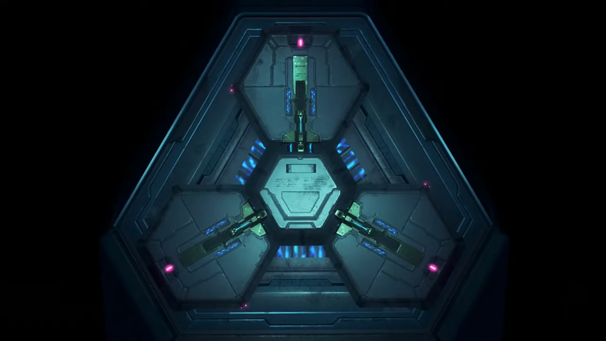
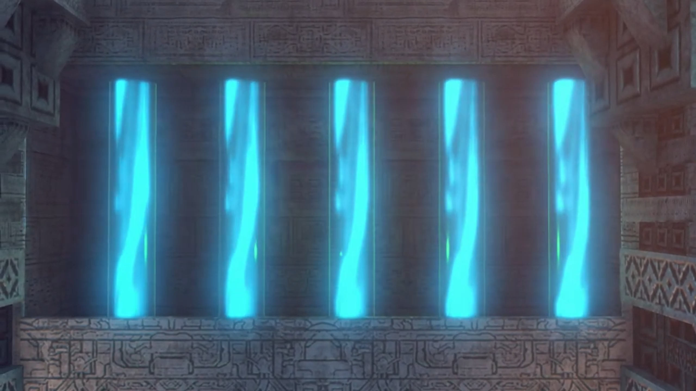
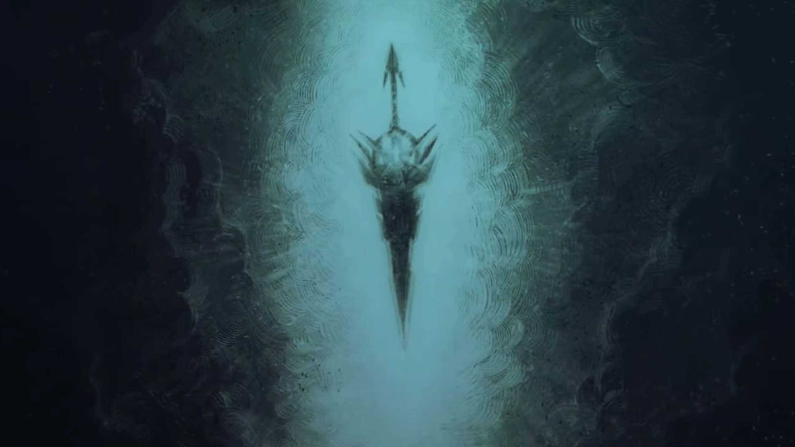
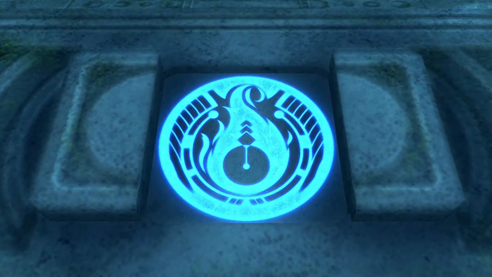
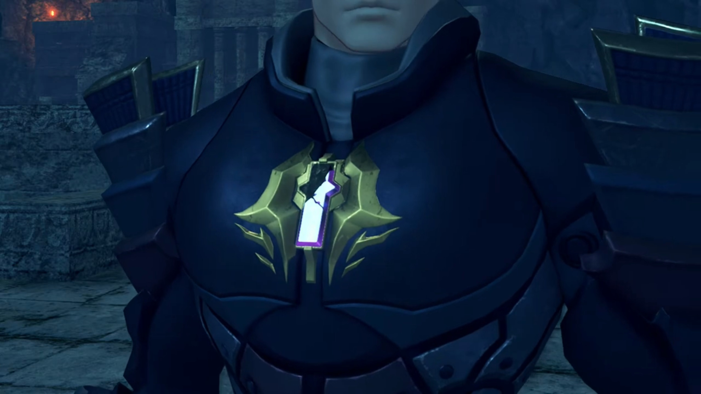

# Where is Hope?

In a dark room with ether flowing to the sides. At the center, a hexagonal object linked to three panels on the side via pistons. All the 3 slots lit red; they were missing. Someone took it. Outside the room was bright. (S)He went out through the sliding door. 

---

Indol, evening. The setting sun casted a shadow halfway through the window frame, at the top of the Praetorium, the only balcony. Amalthus stood within the shadow, recalling, 

> He sat on the ground inside his room. Dark particles swirled in front of him, and Malos came to life. Eager, perhaps? 

"Praetor Amalthus" the Commander called from outside. He returned to reality, asking, 

"What is it?"

"I have a report to make- regarding the situation with the Aegis in Tantal."

"Please, come inside."

"Yes, Your Eminence."

---

"So, Jin finally has his hands on the Aegis. It seems- the boy wasn't good for much- after all. _Unless, he can find- what is lost..._"

"Your Eminence?"

"Hector."

"Yes?"

"**Prepare**- the ceremony."

"At once, Praetor."

---

In the hall, the Praetorium soldiers stood in rows. He briefed them. The Indol titan stretched its wings, the crystal on its chest shone bright and dark, as if signals similar to Morse code had been transmitted. 

---

Tantal, Evening. Moisture had damaged the antique-looking living quarters. Through the window, the sun casted its orange. On the bed, Rex opened his eyes. No one on the beds around him. His right arm was properly bandaged. An eagle swerved in the air outside the window, towards the sun, towards the World Tree. The broken hilt placed by his bed, to his left. The hardness and coldness he could still feel, taking it in his hands. The core crystal in his chest reminded him she was still alive. Tears dripped on the hilt, he gritted his teeth, silencing any noise. No matter how many times he rubbed it off, more squelch out, till his gloves dripping wet. 

---

The bar outside the room was so quiet they can hear the birds chirping in the distance. Morale was low for everyone, seated around the 3 tables, Gramps joining Nia. Zeke seated on the freezing floor, laid his back on the stony wall. Tora can't take the heaviness, when will their backbone return? "Rex-Rex still sleeping? It two days now."

Dromarch explained, "His injuries **were**- quite severe. The worst is over, but his body needs time to recover."

Nia: "He'd better get well soon, or..." Then she heard footsteps, jumped from her seat. Some like Tora also get on their feet. He walked in calmly with his luggage. "**Rex?!**... What's that?"

Without looking at them, he announced, "I'm leaving."

"But... where will you go?"

"_Good question._ Can't live on Gramps- anymore. Maybe... I'll head for Argentum." 

The tiny Titan seated on a chair beside Nia exclaimed, "Rex, you..."

She stomped towards him and shouted, "**What the hell are you talking about, Argentum? What about Pyra? Do you KNOW how desperate the situation is? OR- HAVE YOU finally lost it, you IDIOT?**"

"**I know, OK? It's just...**"

"**Just what?**"

Silence. Everybody were waiting for an answer. For a direction. And what did he say? "I'm done."

"Done?"

"When I became the Driver of the Aegis, **her Driver**, I felt like- I could do anything, but... I was just kidding myself. (Nia wanted to launch herself forward, but her conscious held back.) All I've managed to do is hurt her, **again and again.** So... I'm done."

She stomped forward and caught his arms, "**OH, FOR CRYING OUT LOUD, REX!!! She got herself caught to save you!**"

"I know! So what?"

"**SO WHAT?!!!**"

"**Those guys are way out of my league! I can't beat them. It's hopeless!**" He softly brushed her hand off, turning to the other direction, blurted out, "**I understand that now. She'll be safe with them. They're not going to hurt her like I do.** So, I'm leaving."

"**GRRRRR!!!**" Her nails pricked into her skin as she clenched her fist so hard, but what hurting more was her rage at his uselessness. 

Rex forced himself to be oblivious to her emotions, say, "I've just been kidding myself all along. Me, a Driver? In the end, salvaging is all-"

She can't take it anymore, "**You. Bloody.**"

"**ARGH!!**"

"**IDIOT!!**" Zeke turned his sight away from the bloody scene of hard knuckles on his cheek. He stood back up, holding his cheek. He don't blame her, really.  "Hurts, yeah? But that pain's _nothing_ compared to what Pyra must be feeling right now! (She stepped forward and grabbed his collars). She went with those bastards knowing **full well how much it would hurt. For our sake, not hers!**"

"**I get it! I know!**" He shove her away. "**But what do you want me to do? I couldn't even slow him down! Even the Artifice's attack couldn't touch him. What chance do I have against a guy like that? The more- I fight, the more Pyra gets hurt. She'll be...**"

The bell tied around her feet ringed as Brighid walked towards the scene. Nia noticed, but not Rex, finishing his sentence, "**better off without me by her side.**" 

Her muscle tensed and she walked faster and faster towards him. He turned to look who's coming for him, "**Ngh!**" Another slap on his cheek. He put his fist on his cheek and look at her sideways. "**Do you actually mean that? Do you not have the slightest idea how it felt for her to leave you?**" 

> "With me here... he'll suffer even more, lose even more. _So maybe... Maybe Rex is better off without me. Rex... and the whole world. They don't need me. That's just how it feels._"

"Pyra thought you'd be better off if she was **dead**, did you _know that?_ **SHE. IS** planning to **SACRIFICE HERSELF** to defeat them!"

"_Huh?_" His heart trembled. 

"**You** drove her to this, **BUT HERE YOU ARE, GIVING UP! YOU SAID YOU'D GET PYRA TO ELYSIUM, DIDN'T YOU? You'll eat your WORDS, JUST LIKE THAT?!!**"

> "Hey, Mum... Dad... It's been a while. A ton happened, you know -- I became a Driver! (He spoke proudly). And this girl... is Pyra. My new partner. I know, you'd love her. We... **we're going to Elysium. Pyra, and me.** I don't- know- what's- coming next, but... you'll be watching over us, **right guys?**"

He gritted his teeth, "_Huh..._"

Nia gave up. "Forget it. We'll rescue her on our own. **This loser?** He's not the Rex we joined up with. Let him go, wherever the hell he wants."

Dromarch stood up and walked towards the scene, persuading, "Come now, let's not start fighting amongst-"

Mòrag held out her hand and stopped him, persuaded, "Let's give them a chance to work this out, shall we?" Zeke felt a piercing eye landing on him, gave her a 'why me' look before going back to rest. 

Meanwhile, Rex started again, "**Y'know, I-**"

"Nia quite right!" Poppi stood up, cutely marched towards him, arms stretched wide like musclewoman. "**Rex definitely not behave like himself!** Giving up after **one loss?** That not Rex I know at all!"

"**But-**"

She held out her palm on his face and stopped whatever excuses he got to say, changed it into a fist, and punched, "Now, **is not time- FOR EXCUSES!!!**"

"**Poppi!**" Tora thought she was going full strength. Even Mòrag shockingly stood up from her chair. Did she even know how much strength she's using? 

"**Urgh!!**" Rex looked aside and closed his eyes, braced for impact. But her punch dampened, stopped just enough distance for her fingers to brush the side of his forehead and held on to his cheek, "P-Poppi?"

Artificial tears flowed down her cheek, "Poppi is hurt to see Rex like this. (Tora put down her wings). Poppi and Masterpon are **not** real Blade and Driver. (Tora's wings stood up and tensed). So Poppi and Masterpon looked up to Rex lots. (Tora relaxed his wings). Rex worked **very- VERY hard** to get this far. When Rex tries hard, Poppi and Masterpon try hard. **Rex like bullseye we aim for!** (He looked on the ground, listening. He disappointed them, he knew, he felt. He's directionless himself.) **Without Rex, we**- not know which way to go. (She put down her hands). _So please..._ Rex- **CANNOT- give up and stop here.**"

"Poppi..." He looked at his right hand and clenched it. From the outside, Pandoria was running towards them, bent over the edge and whispered "My Prince."

He finished listening and called out, "**Chum!**"

"Huh?"

He stood up, relayed the message, "**My old man wants to see you. Time to go.**"

---

"Are you all right to be up and about?" The king asked. In the audience chamber, the sun's already gone down, only the ether glowing within the pillars and the flames from the torches provided a faint hue over their silhouette. 

"**Yeah!** I'm all healed up." Despite his loss and earlier chapters of self-deprecation, they came as a group, and he initially sounded as if nothing had happened to him. 

"_Sincere apologies_. **If I-** hadn't attempted to **destroy** the Aegis, they would **never** have..."

"If you'd done nothing, they'd have come for her anyway. You're not to blame, Your Majesty. _It's... **my** fault._"

The king went straight to storytelling, "Five hundred years ago, **this kingdom**- was rent- in twain."

> On a thunderous night, soldiers stood and raised their spear. The leaders raised their flags. 

"Some followed Addam{{footnote: This doesn't go against earlier conceptions that Addam never got back, because 'followed Addam' could be understood as 'followed Addam's desire'}}, who sought to live with Blades and Titans as equals. Others- opposed him, preferring to consider humans as the masters and Titans as our tools. When Addam returned to the ether, **his rivals** seized power."

> A cloaked guy standing on an island looking at Ophion.

"Leveraging the power of the Omega Fetter, they declared themselves... the Tantalese royal dynasty."

Rex added what he'd already know about, "Claiming they were the hero Addam's descendants."

"Precisely. **My ancestors** merely used the name of the beloved Addam... in order to win over the people."

"Hmm..."

> A camera below Genbu shone up, speckles of sunlight carved its shape against the background. 

"Before long, **we resolved** to protect ourselves from meddlesome foreigners, by descending deep into the Cloud Sea, taking the- **dirty** secret of our family's lineage with us. **The Praetorium**, for their part, did not protest. Can you guess why?"

"No."

"**They offered to stay silent** in exchange for a certain resource... An annual **tribute**- comprising a fixed quantity of Core Chips."

"**HUH!!!**" He lunged forward, couldn't believe why the beloved religion that helped with ceasefire would do that. 

"**I have something I wish to show you.**"

"What is it?" He triggered a mechanism, and a block to their left moved itself, revealing 5 ether streams flowing inside 5 tubings. "What is this?"

"This is Genbu's ether flow. The Titan draws in the fabric of the Cloud Sea, and uses it as a source of energy. This energy... flows throughout the Titan's body in the form of ether. Refining and crystallizing this ether creates Core Chips. This process... is what you see before you."

Mòrag stressed, "So, in other words, you're siphoning away a portion of the Titan's energy."

"_Our cold climate and poor harvests_ -- they are the unfortunate side effects of this process."

"I think- I'm beginning to understand..." the wisdom of Dromarch never ceased to surprise. 

"Core Chips are **vital** to every nation's military and energy policies. The Praetorium **desired** this power."

"How come?" Nia wondered. 

"Alrest at the time was in crisis. **But for the Praetorium**, it was a precious chance to... **expand** their sphere of influence."

"So they... muscled in."

"As a result, **Tantal fell**... into a chronic energy shortage. Then, _well, you saw for yourselves._ Near-frozen earth. Failing crops. The Tantalese people... are forced to live in abject poverty."

She don't get it, "So why not just leave the Cloud Sea? Genbu can move, right? Just- go- somewhere warmer."

Mòrag joined the dots, "They fear contact _with other nations._ Too afraid _it might_- expose the truth behind the legends they **spun** about Addam."

Dromarch: "**That**- would explain their isolationism."

"Indeed. That was five centuries ago. **Now the Aegis** has awakened, the **Praetorium is demanding** we hand over the Omega Fetter. They are threatening to reveal our secret if we do not acquiesce,"

Rex was surprised, "Indol are... threatening you?!"

Zeke: "**I get it** now! That's what was in that letter."

"**Enough was enough!**" He clenched his fist hard. "**I couldn't stand by... and let the Tantalese people suffer any longer.** Therefore, I made a decision."

"**And- that's** why you..."

"Yes. **I knew there was a chance**- that the Praetorium would use the Aegis against us. But if I could neutralize her power, perhaps we would stand a chance of opposing them. _And perhaps by saving my people from poverty, I could absolveeee the sins of my forefathers."_

"You didn't think about using the Aegis's power yourself?" Nia wondered. 

"**Wielding such power** is beyond my means. **I am under no illusions!** However, does the same apply to _you?_ I felt something. **When I looked in your eyes,** _I knew._ Perhaps _you_- are the one to whom we can entrust _the Aegis's power._"

"_Father..._" If he'd explained it earlier, perhaps the fight between the misunderstood father and son won't had happened. Respect surged within his heart -- his old man had make difficult choices for so long, kept it to himself for so long, that even if he couldn't agree with what he's doing, his respect for him doesn't cease. 

"_In the end, it seems I only managed to make things worse._ I can- **blame nothing** but my own judgment." He took out a thick book and said, "**This tome... records the deeds** of the hero Addam. **According to this**, he saved the world from destruction **using**- a white sword. And then disappeared, along with a **red** sword."

Rex imagined it, "White and red... **It must mean Mythra and Pyra's swords.**"

"Whoever wrote this... **must have had a personal connection** to Addam. **And**... most curiously... **After Addam** disappeared, **the author** of this book went looking for something."

"Something..." Dromarch focused their attention. 

"The third- _Aegis sword._"

"There's a... third?" Rex was surprised. 

> A broadsword far larger than Pyra's or Mythra's. 

"Apparently, this sword... was as transparent as diamond, and gave off a clear, brilliant light. But... Addam went his whole life... without using the sword. In fact, he could **not** use it."

"What do you mean, 'couldn't'?" Nia wondered. 

> Addam tried to wield it once. 

"**The sword was simply too powerful.** Even he, the legendary hero, could not contain the power it commanded. And thus, fearing its power, he sealed it away- _somewhere._"

> In a chamber, the sword stuck in the ground. Lots of pillars in the small room, though they're not used for support but display purposes. A light beam above the sword focused our attention on it. Before it stood Addam and Pyra; 

"The author... therefore surmised... that this sword _alone_... was the one true sword... _of- the- Aegis._"

Rex's eyes widened up. "Ah!"

"Now, Rex. **You were defeated** by Jin. **Doubtless that man** is a powerful warrior. But even so, can this be right? **Can the Aegis** herself- **truly be outmatched** by a single opposing Blade? Would it not make more sense to presume... **that you lost**- because you have yet- **to unlock**- the true- power- _of the Aegis?_"

"You mean... **I'm** the one who's been holding them back?" He looked down to think, or perhaps, to feel guilty. The rest looked at him, waiting for his final decision in silence. A long silence and fighting within his heart, his desire overtook him, and he desperately asked, "**Your Majesty! Where is that sword? We have to... WE HAVE TO FIND IT SOMEHOW!!! We have to find that sword, and rescue Pyra and Mythra!**"

"Regrettably, the book does not **specify** the sword's location."

"**But there must be!**"

The king doesn't cease to disappoint, "**However, reading between the lines**, it seems the author suspected... that- the sword- _lies somewhere **in** Leftheria._ It's not much, **but that's where I**- would begin the search."

"In Leftheria..."

Gramps had been waiting for this moment for so long. He flew out of his helmet to face him, asked him seriously, "Are- you- ready?"

"Huh?"

"Are- you- ready- to do- what it **takes**- to be- their- true- Driver?"

"**Gramps?**"

"Well? _Are you, Rex?_"

"**YES! OF COURSE!!! I'm- going to be the Driver that Pyra and Mythra deserve! AND THEN- I'm going to take them to Elysium!**"

"Then _come with me_. I'll show you the way." Rex watched him lead the way out of the audience chamber. His lips finally arched up a bit, he found hope. Side by side, he and Nia marched out of the room, with the rest followed. 

Zeke and Pandoria left behind after all of them had left. For an extended period, they spoke nothing. He had nothing to say, but he waited. Had he not anything to explain, to say? The king kept quiet. He decided to leave, when the king called out, "My son."

"_Yeah?_"

"**I have a favor, to ask of you** as your king."

"Well that's a **first**. Are you feeling okay, old man? (Then teasingly), Maybe you're **coming down** with something."

"**The Aegis needs...** _No_, rather, the boy- needs protection."

"You mean Rex?"

"Yes. _I saw... something, in that boy's eyes._ A light that must... never go out."

"**Heh! Steady on, old man.** People will get the wrong idea. **Fine.** Leave it to me."

"_Thank you._" He had not waited for it, leaving already. 

Waving his hands without looking back, "Meeeeh, it's not like I wasn't gonna go with him anyway."

---

Near the ice that froze Lora, two artificial Blades each held on to one of Pyra's hand. Akhos and Malos watched, the former exclaimed, "You **really can't** judge a book by its cover. Who'd have thought that **sweet-looking girl**-would **threaten** to destroy herself? Didn't _she realize_ taking her own life... would mean the boy died, too?"

"Oh, she knew **exactly** what she was doing."

He turned his head over to him, surprisingly asked, "The whole thing was a bluff, then?"

"No, not at all. The reason she gave her Core Crystal to the boy... was to replace his **heart**- after Jin put paid to it. An Aegis core, encodes the blueprints for **all** life. She took advantage of that."

"_Incredible. I have no **idea** such a thing was possible!_ Aegises truly are a breed apart."

"Cores are **constantly accumulating** data about the outside world.{{footnote: Take note of this.}} The fact that their injuries are **mirrored**- is a result of their twin cores exchanging information. If you wanted to be poetic about it, you could say that their very lives are intertwined. But there's nothing to stop her from **severing** that link."

"What do you mean?"

"**Before issuing** the kill order to the Artifice, she would've transferred the remainder of her core to the boy. Letting him live on, _heart complete._ An Aegis can survive for a short time... without a Core Crystal. Don't ask me why. _It's just- how we were made._"

> The hexagonal object we've seen at the top of this page is once more displayed. 

"Ah, so- _that's the reason- Jin agreed to her terms._"

"He couldn't care less about the boy. **But**... _he wasn't about to lose... this one. Simple as that._"

---

On the stairs outside Fonsett, Rex asked, "What are we- doing here?"

"Did you know Fonsett- has another- name?"

"Huh?"

He answered his own question, "Hero's Rest."

Rex's eyes lit up, "Hero? **As in...?**"

"Indeed. Fonsett Village- was founded by Addam himself at the end of his travels. After- the war, Addam charged me- with protecting- the village."

"**Was this village** reeeeeaaaally that important?"

"What- do you think- I was protecting?"

"You mean it's..."

"Follow me."

---

Through the village, one of the corners. The road in was wide enough for 2 person to pass side by side, and the tombstone 10 meters high laid inside the "cave without the top"{{footnote: Sorry, one don't have the vocabulary for this, nor could one find a proper name for it. Imagine a cave, which had a bottleneck entrance, that opens up into a wider space. However, this one had not the roof, but a space surrounded by cliff walls. What is that called?}}. To the sides of the path laid some foliage and rocks and flowers. Rex recognized the place, "The Village Guardian?"

"Just looks like a stone pillar to me." Nia observed. 

"They say that the village's guardian spirit- dwells within. Gramps, what are we doing here?"

He instructed, "Rex, try- turning- the stone tablet- clockwise."

He didn't ask, did as he said. "This? **Hn-ng!**" Heavy. Finished turning to max dial, a rectangular box-shaped stone slid both ways like doors opening and revealed a symbol that looked like fire. "Huh? **This crest, it's...**"

> In the abandoned ship, when Jin asked him to go open the door.

"**I've seen it before!**"

"Place- your hand- on it."

"Here goes." A beam shone upward on his palm. The village guardian tombstone started lowering into the ground, with its top that shaped like staircase fits exactly with the staircase behind it. "Wh-what's this?"

"This passage leads into the very center of the archipelago. There lies the cavern- known as Spirit Crucible Elpys."

He was impressed, "That's quite a name..."

"This entrance and the gate of the Spirit Crucible... are sealed in such a way that only a Leftherian can open them."

"Ahhhhhh, **so that's why Jin needed me back then!**"

"When- Addam- founded- this village, he- hid- something deep- within the body of the Titan- that forms the archipelago's center."

"You mean... the missing sword?"

"Mmm.... I don't know how word of it got out, but- many- were led here- by rumors of the legendary sword. More than a few have entered the Spirit Crucible... _but- none have ever returned._"

"Is it really that dangerous?" wondered Nia.

"Addam wanted to ensure that the sword was securely sealed away. He put many measures in place to stop it falling into the wrong hands. _Only_- the hands of someone worthy. Addam said- that taking this sword- would be the mark- of the Aegis's- true Driver."

"Their- true- Driver?"

"What do you say, Rex?"

Without a moment hesitation, he snapped, "I'll do it. **No. I-I... HAVE to do it. Every moment we waste, Pyra and Mythra could be...**"

"Then you're ready for what lies ahead?" His eyebrows clenched deeper, and he nodded. He must be. 

---

On an old ancient building near the void, 2 artificial blades pressed the still unconscious Pyra there. Malos, alone with her, looked at her for a long time without speaking a word. 

> Flames raged. Malos, with holes in his body, stood up. Every time he tried to heal, the flames would burn more holes in his body. 

"If you hadn't interfered back then... Neither of us would've had to go through all this. Now then..." He revealed his partially damaged core. 

"Time to take back **what I lost 500** years ago."

---

Monoceros control room. Patroka, looking at the scene via the control panel, wondered, "How he's still alive with his Crystal in that state? Seriously, it's not normal."

Akhos had an explanation, "The Aegis is the Master Blade. The first Blade the Architect forged. _Malos can do things we can only dream of._"

"**Annnnddd? How's he going to restore his core**- exactly?"

"He'll extract the data he's missing from the core- of the other Aegis, then- all- his power- will be restored."

"Mm hmm. OK. So what will that do to her?"

"Heheheheh! Well, if she's lucky, she'll live. Heh. As an empty husk, that is."

"Rough deal. Malos doesn't hold back, huh?"

---

"Don't blame me for this. It's our Father who made us this way. _But don't worry... Once I meet him, I'll get the answers we're after. I need- to know- why we're like this..._ In any case, this world only needs **one** Aegis. _Don't you agree, Pyra?_" 

He then put his hand on her core, started the data extracting process. Even in deep sleep, she groaned. 

---

### Footnotes: