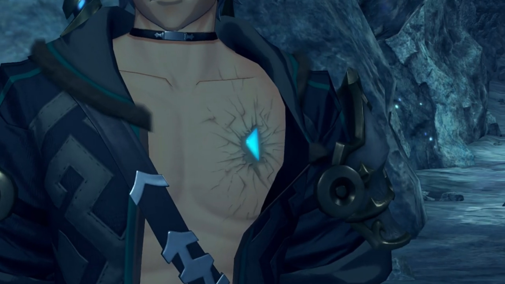
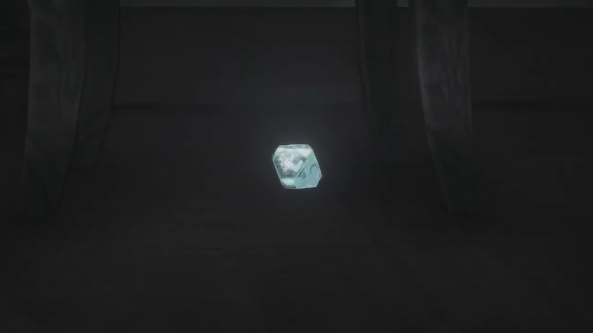
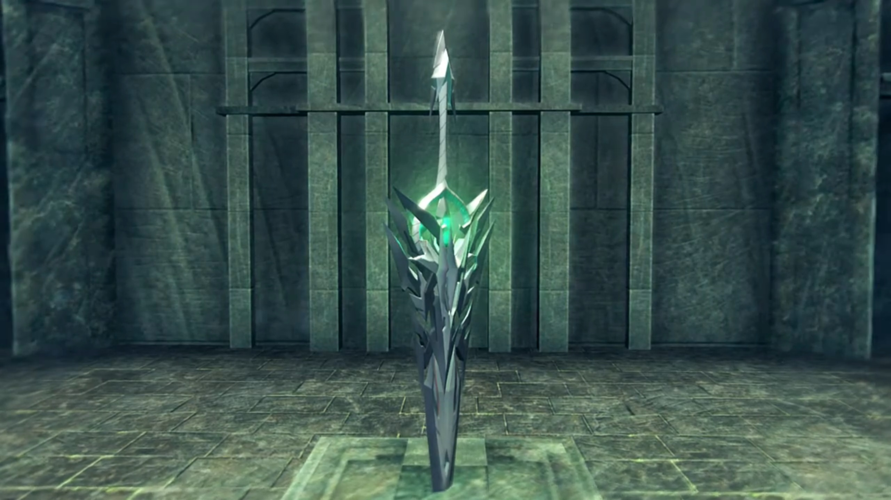

# Spirit Crucible Elpys, "I love you too, Nia!"

The group, on medium alert, was quietly traversing the tunnels thud sound attracted them. They turned around and saw Dromarch collapsed. Nia wondered, "Dromarch! What're you stumbling for?"

"Sorry, my lady. I've been feeling... a little dizzy..." He effortfully sat up. 

"You too?" 

"**You** too, Lady Brighid?"

"Yes, for a little while now. Though I'm still capable of standing."

"Hey, same here!" Pandoria joined in, rubbing her hands on her shoulders, "What's up with this place? _It's kinda_ creepy."

"What is going on here?" Mòrag wondered. 

"I feared as much..."

"**Gramps! You knew** this would happen?"

"The tales say that Spirit Crucible Elpys- saps the strength- of Blades. It's- one of the reasons- why none- have ever returned- from its depths."

Zeke: "I say..."

Poppi analyzed her meter readings, "Ether flow scarce in this area. **That** may be cause of problems."

"Like that time in the Tantalese palace?" Nia compared.

"That not only thing. Glowing particles in air... **They absorb ether!** That is source of light."

Zeke concluded, "So not only do you have less **power**, the power you **DO** have is being **absorbed**? Well, that's jolly tragic."

"You all right, Poppi?" Nia wondered. 

"**Poppi just fine! Poppi never better!**"

"Of course, you're an **artificial** Blade, ain'tcha?"

---

Diving deeper into the tunnel, they stood on an ancient-looking platform, an interlude cave between 2 tunnels. The tunnel ahead was across a hanging bridge. Rex exclaimed, "We have to cross that?"

"Yes. But we must- proceed with caution. Once we enter, the Blades will be sapped- of most of their power. If they- run out of energy, they might be forced- to return to their- core state. And there's a chance they could never be reawakened."

"**Pandy, you'd better just stay here** and guard the fort." Zeke strongly urged. 

She started panicking, "**Why just me? Don't you want me?**"

"**Don't ask dumb questions. You know very well why**, don't you?"

But she won't abide, "**If I'm staying, you ought to stay-**"

"**I'll be fine! When am I**- ever not?" Yet the tone of his voice wasn't as confident. 

"**If you're going, I-**"

"**I'M ORDERING YOU TO STAY HERE!**" 

Mòrag and the others hand been listening for a while now, she wondered, "Is there something- wrong?"

Zeke refused to explain, concluded, "Pan-doria was just agreeing to stay behind." 

"**Nuh-uh! I'm going WITH you!** We made a promise, didn't we?! Don't you dare say you've forgotten!"

"Urgh!"

"**I go where you go. End. Of. Story.**"

Reluctantly, "Fine!"

On the other side, "My lady."

"I'm fine. We *can't* give up now we've come this far. (Before Dromarch could say anything, she snapped) **Don't!** I _know_ what you're gonna say."

"I... _Understood._"

Mòrag commented, "I don't know what's in there, but, apart from Tora and Poppi, we're all going to find our abilities severely weakened. Be careful, Rex."

Zeke added, "Yes... **Healing Arts are going to be less effective,** too. **One nasty wound** and that'll be the end of you."

"**Yeah, I get that. Tora, Poppi, we'll need you**- on the front line."

"**You got it, Rex-Rex!** Poppi is **artificial** Blade, so **request** is **very extremely not a problem! Technology save the day! Three cheers for Nopon know-how!**" He punched his wings high into the air while doing the Nopon dance. 

"Where are Poppi's cheers?" she too wanted her artificial Blade dance. 

At least that cheered him up, "Hahahah! Thanks, guys!"

---

As they dived deeper and deeper, Pandoria stopped and crossed her arms across, rubbing herself. Her anomaly did not go unnoticed, and Mòrag was exploratorily asking, "Are you... all right?"

She tried holding herself together, trying to act normal, but her voice betrayed her, "Never... better! I'm... right as... rain!"

She strongly encouraged, "The deeper we go, the thicker these particles get. You can still turn back."

"Thanks. Your concern is touching."

Zeke urged, "Worry about yourself, yeah? **I can**- look after her."

Rex observed, "Zeke, you don't look so good yourself. Is something wrong?"

"Huh? Oh, yeah... I didn't think it was worth mentioning, but uh..." He untied the upper buttons on his shirt and showed his left chest. An isosceles triangle-shaped crystal rotated to the left 90° was implanted on his chest. If you notice closely, it fits into the missing triangle pieces on Pandoria's rectangular core. 

"How did you get that?"

"I- told you about the time I almost- bloody died, right?"

> "**My Prince! Zeke! Not like this! Not here! Not far now! Just a little further! You can do it!**" Pandoria cried out loud. The CPR she's doing to him wasn't resuscitating him, but what else could she do?  
> 
> He breathed in less than breathing out, "_Just... leave me... Go on... without me..._"
> 
> "**No!**" She pumped harder and faster. "**If you die, ungh, I'll turn back into a Core Crystal! I don't want to forget everything!**"
> 
> "_Pandy... I'm sorry... I hope... your next Driver... is better... than me..._" 
> 
> "**I don't WANT another Driver! You're... you're good enough!**" His hand that held on her collapsed on his torso. "Prince! **ZEKE!**" Her CPR had failed her Prince. 
> 
> ---
> 
> Her vision was blurry. Every step seems to plunge into the soil below. But she walked on, "I **refuse** to forget our 10 years together! It's **not** going to happen! I'm not... letting you die... _here..._" 
> 
> Till she reached her limit and his weight overburdened her, and they collapsed. She thought she saw stars. She thought tinnitus occupied her ears. She thought she saw figures. She thought she heard footsteps. Sure, some silhouette walking towards them from her left.  "_Uh... Wha... Bandits?_" 
> 
> The soldiers carrying swords formed an alley for Amalthus to walked in between towards them. "_Sucks... I don't want to be a bandit's Blade... But... I guess I won't- remember... anyway... Prince..._" Darkness overtook her vision with Amalthus's face occupied her final impression. 
> 
> ---
> 
> "**Prince?**" She looked around. White fluffy bed, white walls. These decorations looked so familiar, but she had not the attention to care. She scanned for the figure that occupied her mind till her last stage, and found him laid unconscious on the bed to her right. She walked over to check him out. 
> 
> "Fear not. He is going to be fine." assured Amalthus, walking into the room. 
> 
> "You... you saved him?"
> 
> "The fact that you're alive... is **proof of that**, is it not?"
> 
> "Urgh!" Now that she had time to think otherwise, she felt a searing pain in her chest. She looked down and saw a dent in her rectangular core, missing a piece.  
> 
> Amalthus explained, "I had to transplant... part of your Core Crystal into his heart. His wounds were grave. It was the only way... to save you both." 
> 
> Pandoria turned to look at her prince. She willingly accept their fate. 
> 
> ---
> 
> Zeke walked out of the Praetorium with Pandoria trailing behind. A few soldiers at the edge of the square watched the inhabitants play and gathered around the center. He stopped and looked at them, but his mind wasn't on them, "_I'm sorry. It's all my fault._"
> 
> She shook her head. exclaimed excitedly, "Actually, I'm glad!"
> 
> "_What?_ Why?"
> 
> "Knowing that a part of me is keeping you alive... I dunno, it's just nice."
> 
> "_Pandy..._" No smile on his face, only thin sorrow. 
> 
> "What is it?"
> 
> He looked away and spoke something to her; she beamed with contentment after listening. 

Rex was surprised, "They do **that**, in Indol?"

"I guess you and I are more alike than you thought, chum. Though, mine was- _just a_- surgical procedure."

Mòrag: "You make it sound so simple. I'm still trying to wrap my head around it."

"You know the people of Indol- can trace their roots back to Judicium?"

Nia: "Ju-dicium? The creators of that Titan weapon thing from Temperantia?" 

"Yeah, them. They carried out experiments, fusing Blade and- human cells, _creating- Flesh Eaters._"

Mòrag: "So... those practices **persist**- in Indol?"{{footnote: She was not there when Cole was with them.}}

"Hey, so they took advantage of Blade regeneration... and **patched** me up with- Pandy's Core Crystal, right? Since I have part of her core in me... **I'm a Flesh- no, a Blade Eater!** Or something! Huhuhuhuh!"

"A Blade Eater..." Nia wondered, touching her chest. Was she that different? It occupied her attention so fully she hadn't had the attention to join the dots! 

Pandoria agreed, "That's right. _That's gotta be why this place is getting to you, too..._"

Zeke tried to rough it out, "_It's... all good. Let's just- **push on!**_" And they lead the way. The others didn't say anything. Nia stayed back for a little; we know not what she was thinking. 

---

There was a wall with torches{{footnote: Why does an ether lamp surrounded by ether-drawing particles still have ether to lit it? One don't know!}} installed on it blocking their way. Nia's breathe was shallow, and she kept touching her chest, feeling her losing strength. 

 "My lady?"

She impatiently puffed out, "For the last time, I'm fine. Why don't you just worry about yourself?"

"But..."

"You gotta admire Shellhead over there. He just put it right out there."

"Mm?"

"And here I am..." She had thought for it very long, but only now did she made her decision, "_Dromarch._ I'm gonna put myself to the test. **Right here**. I've decided."

"**My lady...** (But her eyes was unwavering, and he could see no way of convincing her otherwise). _Very well._"

There was an evaporating current near the wall. Gramps exclaimed, "This mist- makes me feel like I'm- swimming through the Cloud Sea."

Mòrag explained, "This mist is produced when a fossilized- Titan body reacts with the atmosphere. It's why it's so hard to breathe down here."

Rex turned around, scanning the group, when he saw Nia clutching to her chest. He walked up to her, asked, "Nia?"

She took a while to breathe heavily, effetely whined, "_What now?_"

"Are you in pain?"

Why is everyone asking me this? She impatiently shot out, "**I'm strugglin' to breathe** like everyone else! And I'm a little dizzy, that's all."

He didn't think much, nor did he try harder to read her, immediately lectured, "**Oh, right! When that happens**, it's best to just try and **empty your head** of all thoughts."

"_What?_"

"**It's an old salvager trick.** When you swim down deep, you feel like your head's gonna implode. **You just go with it! Don't fight it!** Then you stop noticing the pressure. Why not give it a go?" He urged. 

"Empty my head, eh? (Despite feeling effete, she teased) You mean... I have to start acting as daft as you? Tall order."

"**Hey! That's not very nice!**"

"**Everyone! OVER HERE!!!**" Tora called for their attention. "**Tora think THIS way lead down.**" There was a small hole 1.5 meters tall that goes deeper in.

"It certainly doesn't look like a natural formation." observed Brighid. 

"Maybe it was grave robbers?" hypothesized Zeke. 

Gramps: "There's not too much worth stealing round here. Well, apart from..."

Rex finished, "Whatever it was that Addam hid down here."

"Just a guess. It's- possible- that Jin- and his accomplices- have been here."

Pretty much explain it, Rex thought. "Then, they found out about the sunken ship, and went to Argentum."

"Still just a guess, but a pretty good one."

Disappoint Nia. "Then- there won't be anything left to find, will there? Sheesh."

"**Well, if that was the case**, then you'd expect them to already have the third sword."

Mòrag noted: "But... _they clearly don't have it._" Gramps agreed. 

"No, I do not think Addam- would let the sword- be so easily found."

Rex urged: "No point in worrying. Let's just press on!"

---

Thick mucus covered the side walls, like spider webs. The deeper they walk, the weaker Nia felt, her breathe becoming more shallow. Mòrag took her attention to check on her once in a while, sensing that she's reaching her limit, called out, "Rex." He stopped and turned around, "_We've come a long way. I think it's time for a break._"

"**What? But-**"

"Hold your horses. There's a long way to go yet." Zeke, whom had been keeping at it for long, agreed with Mòrag, effetely interrupted him and sat down. Ahhhh, the relaxation! Then he called out, mocked, "_Hey, you too, Nia. Come rest your head on my lap if you like._"

"Why don't you rest your head in your arse?" And she sat down where she stood. 

"**I'm sorry**, everyone. **I had** no idea."

Mòrag: "There is no need to apologize. _I understand._"

Tora: "Poppi, now is good time to cool drive furnace!"

"Aye-aye Masterpon!" She immediately raised her hands into the air and started rotating without a second thought, releasing steam from under her feet, giving Tora the pleasure of a bone-softening sauna. 

"**MEEEEEHMEHMEHMEH!!!! HOTHOTHOTHOT!!! MEEEHMEH!!! HOT! HOT!**"

Maybe she did it on purpose? Maybe she did it to cheer the group up? Or maybe she just don't realize it? She stopped immediately, and innocently said, "Masterpon! _Poppi is sorry!_"

---

They sat around in a circle. Brighid can still stand. All were too exhausted to have any conversations. Rex just came back from area scouting, approached Nia whom were hugging her feet together. "Huh?"

He handed her an oxygen tank, introduced, "Emergency air. It might help."

"Oh, thanks." She took it, found the only button to press, and put the cone over her nose and mouth.

"Ah, not like that! You have to hold your nose, and then inhale- really deeply. Now stretch out, and puff out your chest."

"_Is this... another of your salvager tricks?_"

"Go on, just try it!" He urged. She therefore pinched her nose and put it over her mouth, following his instructions. 

"Wow, that really did the trick." Her eyes lightened, her voice immediately became more energetic. 

"Right?" He sat down next to her, "When I was starting out, this was one of the **first things** the other salvagers taught me. **Even though** they acted like my parents, they **never really** taught me anything worthwhile. I **did manage** to pick up- a couple of useful tricks, though."

"Parents, _bleeeeeh._ My da was real enough, but... I can't- say he really taught me anything either. He was a well-known lord in Gormott. A reaaaaal biggggg cheese. He made me study hard, _but it was all- how to be a proper lady. Which- fork- to use._ Nothing that's doing me any good now. Just useless shite."

His eyes widened, "You were some kinda high society princess? I can't picture it."

"Shut it, you... I hated studying. (She turned to look at the top of the ceiling). **But**, looking back... Those were the happiest times of my life. There was my da... And... My big sis! The three of us."

"You had a sister?"

"Yeah. She was very frail. I spent a lot of time at her bedside. My da brought doctors from all over to try and help her. He tried- _so hard._ It was **all** he thought about. After that point... my memories _aren't so happy._"

"Nia..." He could sense the heaviness in those last few words. She must've tried very hard to say it calmly, devoid from immersing herself in her emotions. 

"Da- spent all his money on chasing a cure, and- lost his position as a lord. From then on, we became drifters."

"_Whooh..._"

"It was a tough life. It- _took its toll on my sister._ She died, not- long after." She tried suppressing her tears. "**Anyway**, I'm sorry for talking your ear off." And she took another breathe from the oxygen tank, hoping that squeezing her nose would snuff out her tears. "**Thanks** for the salvager trick. It **really** worked. _Sneaky git._ **If you had this all along, why did you hold out on me?**"

The sorrows behind the smile, she may try hiding, or just brush it away. He let her be, let her express her feelings. She stood wobbly, shook her feet, stretched her arms and body, said, "I feel much better. Shall we go, Rex?" She lead the way, the others followed. He stayed back a little, thought, despite being partners for so long, he still had a lot to learn about her. 

---

Spiky-ice criss-crossed in front of them blocked the entrance. Mòrag: "Hmph. Looks like the only way through, is by force."

Tora ordered, "**Poppi, incendiary barrage!**"

"Roger roger!"

Zeke's heart rate tripled on the instance, his voice raised 3 octaves with each word spoken, squawked like a duck, "Whoa **stop stop stop!!! You wanna** bring the whole **cave- down- on top of us?**"

Tora turned to face him, calmly said, "It was joke." 

She added, "Poppi has _no such weaponry._" Rex looked at them with distrustful eyes. 

"_That. Wasn't. Funny._" Zeke seriously said. 

Then, the ground started shaking and Rex's core crystal shone brightly. The ice started retreating to behind the mucus, opening up the tunnel. Mòrag came up beside him, wondered, "Does- this _also_ have something to do with your connection to the Aegis?"

"No idea! **But look! No footprints.** _We're the first people here._"

"Then there could _still_- be- hope." Zeke concluded. He and Pandoria lead the way. Nia stayed on for a very short while, still struggling with her internal voices, before catching up. 

---

They were heading to a brick-made bridge without fences. Her symptoms weren't getting better. The more she walked, the weaker she felt. Step by step, she slumped forward. The only reason she kept moving is wishing not to be left behind, to not fail her friends. She could see the rectangular tunnel up ahead, but everything was blurring, getting darker, and a voice from deep memory filled her head. 

 "_Her life- is tied to yours._"

> In a pitch black room, the lens focused on the setting sun behind the silhouette of the leaves. A tall, buff, silhouette figure stood beside the window, said, "_You have... a life within you now..._"
> 
> A girl with Nia's face lifelessly sleeping inside the coffin. "_A life?_" She, or someone else with Nia's voice, wondered. 
> 
> "She lives on- inside you... Her life- is tied to yours..." After a bright light engulfing the room and died down, he continued, "Nia. Say it for me now. Address me as...'Father'."{{footnote: Not sure who those long, tall ears belonged to.}}
> 
> "_Yes... Father..._"
> 
> ---
> 
> Nia was curling up beside the table with only an ether lamp on it, crying. "_Father... Father..._" She cried and cried and cried, arms wrapped around her legs. When she looked up to her left, all she could see is the Core Crystal.
> 
> 
> 
> "_This... this was Da's..._" She stood up and took it in her hand, resonated with it, and Dromarch came to life. 

"**My ladyyyyy! My lady!**" She had stopped walking, looking on the floor for a prolonged period. Dromarch worriedly called out. 

"Hmh?" She innocently looked up, wondered what just happened. 

"Are you all right?"

"Nia..." Rex called out. "Heyyyyy, you don't look so steady. Careful! Fall down there, you'll never hit the bottom!"

"_Eh... You must be sick of saving me by now, huh?_"

"Don't be silly."

Brighid urged, "Don't push yourself. You can rest up a little longer."

"It's even tougher for you though. I'm telling you, _I'm fine._" Brighid looked to Mòrag, and she nodded back. They set off. Rex stood a while before catching up; but then she stopped, "After my sister died, it- wasn't long before my da died too."

"Huh?" 

"I'm finishing my story. Dromarch- was alllll I had left to remember him. We started wandering together. Or maybe I should say 'running'."

"Running? **From who?** People your dad owed money to?"

"**No.** From... the Praetorium."

"What? **why?**"{{footnote: The voice is different, perhaps a bug: it's "Uh, wow, why?"}}

She looked to the bottom right, gathering her thoughts and mustering her courage to voice it out,  "Well... i-it's a long story."

> The heavy downpour don't prevent the Praetorium soldiers from dashing pass heaps of grasses, lighting their way with their staff. Someone shouted, "**Get the cannibal! Capture that flesh-eating Blade!**"
> 
> ---
> 
> The lock clicked outsider her cell. She curled up, wrapping her hands around her legs. For how long she'd been in that position she don't know, until her sensitive ears heard metals slashed against flesh, and the scream of soldiers. The door opened, she looked up. Jin walked through and she sat straight, wondered what he's gonna do with her. He handd her a hand, and she decided to trust, took it in hers. 

"I felt like... the whole world was against us. There was nothing we could do but- stayyyyy on the run. **Taking each day as it came. Just... thankful for each sunrise, prayin'** we'd see another."

"Whew..." Not a wonderful adventure you have there. 

"Then- I- met- Jin. He... He- _took me in._"

"So that's why- you and Jin..."

She explained, "In- Jin, I saw a way out, y'know? I didn't see a future for myself on my own, so I threw my lot in with him. _But..._" She dropped her head. He knew the story after that. 

"I can't see it." He optimistically called out. 

She was surprised, "What?"

"**You're not the kind of person** to worry about stuff like that."

She rebut, "Well, I wasn't worried, as such."

"So, anyway, why the story?"

"I _dunno. I was just rambling._"

"Look, **I don't know what's burdening** you, Nia, but... **You shouldn't be... afraid.**"

"_Afraid?_"

"Of- **whatever it is! Stay true to your feelings, even if it means- fighting toooooth and claw. That's who you are,** right?"

"**What- the hell? I'm not some violent goon...**"

"**I think you know** what I mean."

"**WHAT THE-?!**" She jumped on her feet. 

"**AHAHAHAHAH!!! There we go!** That's the Nia I know." He exclaimed. 

"The Nia... you know?"

"Not far now. Let's get going." He urged and walked past her, not explaining, leaving her and Dromarch together. 

"Rex..." She dunno what to feel for him. 

---

The deepest portion of the Spirit Crucible was a giant crest carved out on the walls, and a tombstone-like feature below it. Tora exclaimed, "Rex-Rex, it's dead end!"

He looked up and his eyes lit up as he saw the crest that looked like fire. "That seal... It's the same as the one on the ship."

[Crest/Seal in the depth of Spirit Crucible Elpys](images/276_crest.jpg)

Before they could do anything or search for anything, dark clouds swirled around them, concentrated into a few blocs, and formed into a figure that looked like Addam wielding his sword and his cloak over his head, all of them, with only their red eyes as distinguishable features. Brighid wondered, "Who? Or- what?"

Gramps urged, "**Heeeeey! Watch out there, Rex!**"

They drew out their weapons to fight. Since he lost his sword, he now wielded Roc's weapons. 

---

"Ongh..." The dark figure slowly walked towards the fallen Nia. 

He'd just finished his opponent when he heard her fall, adrenaline rushed up as he dashed subconsciously to her rescue. "**Nia!**" 

"**HUURGH!!!**" She'd expected to end here and now, but the clashes of blades was instead heard. Rex blocked it with Roc's scythe, wielding it adeptly against him. But he was outnumbered. Even if he wielded two weapons, two hands cannot fight four. If he lose his focus on one, he'd get an extra wound. When he turned away to the other, he get another wound from the first. And finally, his wound was too heavy he fell to the ground. Nia watched with shocking eyes. Dromarch was beside her, tending to her needs. "**REX!!!**" Once again, fear flooded her lungs. Once again, she felt she cannot face it, just like as always. 

> Her, or maybe her sister, laying lifeless in the coffin. Perhaps she could do something about it, but didn't. 
> 
> Her da died. Perhaps she could do something about it, but he refused. 
> 
> Vandham ran out of ether, collapsed to the ground. She could do something about it, but didn't. 
> 
> Fan stabbed in her core crystal by Jin. She wanted to do something about it, but didn't. 
> 
> Niall's lifeless corpses in Mòrag's hug. She did something about it, after everyone was gone. 

"No... No more... I won't hide any longer. I won't hide who I am... **NOOOOOOO MOOOOOOOOORE!!!**" 

Rex was having difficulty opening his eyes when he heard her shout. An intense ether rippled with her as the center, and her core crystal shone bright while she transformed. The energy so strong it formed a blizzard, blowing away any incoming abominable creatures. Even the other creatures and her friends stopped fighting for a moment, surprised. 

Mòrag: "Nia?"

Dromarch slowly walked towards beside her. Zeke: "She's a Blade?"

Tora: "**Bladiest Blade!**"

Mòrag: "Not... merely a Blade. She's a..." Yes, her core crystal, the same as Akhos, as Patroka, as Mikhail!

Nia caressed Dromarch's chin for a while before walking towards the fallen Rex. "Nia..."

She went down to look at him on equal level, exclaimed with excitement, "**I am burdened no longer. Not by my past, not by Jin. I am finally free!**"

Rex was still lingering in realizing that she's "**A Blade? What the...**" He can't believe how fast his wounds heal. As he took up his hand, she softly hamburgered it with both of hers. 

"I'm no longer afraid. This- is who I am, Rex! What's the point in living if I have to hide?... **Thank you for helping me see. I love you, Rex.**"

"Wha-?!" His brain dead instantaneously, awestruck. 

The abominable creature wouldn't wait for them to confess to each other. He looked behind as he felt the wind blowing yet again. That he'd protected her earlier, she dashed past him and drew her weapon, a sword. Now, let me protect him, she said to herself. "Hurrrgh!" Her attacks wielded water, splashed at the abominable creatures, bringing all down with one hit.

Seeing they're OK, Zeke resumed fighting. "Arrrrgh **come on then, WHO WANTS a piece?!!**"" Similarly for Tora and Poppi, Mòrag and Brighid. Nia worked together with Dromarch towards their opponents. 

Her hands were trembling, her sword shaking, and her chest still hurting, "Hnng, there really- isn't much ether here..." But the abominable creatures kept returning, numbers growing more and more. They were surrounded, but she was already exhausted. She collapsed on the ground, caught hold of her core. One of the abominable creature was about to chop her head off, she looked aside, closing her eyes, when it never came. She looked back, there he was again, like a light that shone right into her heart. "**Rex...**"

He turned to face her, answered, "**Nia, I- love you too!**"

"_Huh?_" She was awestruck. She hadn't expected a reply but...

"**I love YOU, and all you guys! Soooo.... let's do this, together!**" She was flabbergasted for a moment before tears of contentment rushed. She can't contain her laughter, 

"Hng nghn... **HUHUHUHUHUHUH!!!!** (She wiped away her tears). That's just like you! It's all I could ask for. **Let's give 'em hell!**" He sheathed Roc's weapon as she stood up, already predicted she would hand over her weapon to him. He took it in his hands. Gramps couldn't miss this touching moment, had to climb out of the helmet and see it with his eyes. 

"Ready?" 

"Ready." They turned to the abominable creatures, she held the role of transferring ether therefore. The hordes dashed towards them, they closed in. One by one, he turned them back into mist, even passing weapons around as they worked together. Being outnumbered, they didn't manage to catch one; but Brighid's flame and Zeke's thunder had their backs. They looked at their eyes, not realizing more were coming from the other side. A shield raised don't know by who, and when did Poppi's jet biter ever disappoint? Nia was overjoyed. Yes, these are all her friends. They were here to support her, not to judge her. She could be herself, someone always had her back. 

One creature was strong, Rex tried to push past it, but it wouldn't yield. An unknown voice asked, "You fight..."

"Who's that?"

While he looked around, searching for the voice of Addam, it continued asking, "You fight on... relentlessly. But you do not fight for yourself."

"**I fight for... my friends! GYAAAAAHHHHHH!!!**" Whoever it is, he answered. 

"I have been waiting for so long. For one- such as you." A bright light from the top of the ceiling destroyed all the abominable creatures, sending some boulders floating mid-air. 

"**Whuh?**" Everyone was wondering what just happened when the light engulfed them.

---

Elysium in the dream. Rex stood near the top of the hill, but she no longer stood below the tree. Instead, the hooded guy that do introduced himself, "My name is Addam. I am long departed from this world."

He recognized, "That voice... before..."

Addam was looking at the church and town at the horizon, back facing him, asked, "What is your name, boy?"

"Rex. I've been here before. This is Elysium! Pyra was standing under that tree, over there. _She looked... lonely._"

Addam crossed his arms, "Is that so? I must **offer my gratitude.**"

"_Eh?_"

"You- are the one- who brought me here. I have never been to this place. Once, I sought _to come here_, but I never did."

"Oh, really? Neither have I. Not... _Not yet._"

A ding in the distance. "It is beautiful," he said. 

"_Yeah._"

He turned around and asked, "Rex, what is it that you seek?" Under the hood, he cannot see his face. "Wealth? Power? Dominion?"

He went into his thinking mode, "_Errr..._ None of those, _really._ Though, power might be useful."

"Power, then?"

"Power to protect."

"Protect what?"

"That's... a long list. Gramps, Nia, Tora, **everyone in Fonsett... And Pyra, and Mythra.**"

"You are greedy, _boy._"

"Everyone in Argentum used to tell me that."

"It is not _necessary to protect everything_. **There is- a limit-** to what- one man- can do."

"_That's true..._" Perhaps; but he's not so sure about giving up anyone on his list, all those he wanted to keep close to, he wanted them to be safe. 

"But, **there is** _something granted to you especially._"

"Please, tell me what it is."

"_The power- to accept her._ She is afraid... of her own _power... and her terrible destiny._ And I, too, _was afraid._ **I feared**- _the true power of the Aegis. Hmm..._ Your will to fight comes- _from your will to protect._ Blades and mortals are _linked._ **When you take** on _the weight of all the... fear she carries,_ then you... will be her true Driver." A bright turquoise light therefore engulfed the Elysium in the dream. 

---

"Rex! **Rex!**" His consciousness just returned from the dream, hearing Nia calling for him. She asked, "What happened? You- haven't- said anything since the _ghosts_ disappeared."

"Yeah, I'm fine. **Never better!**" He reassured her, but didn't talk about Addam, then turned and walked towards the tombstone below the crest. The group watched the top of the tombstone opened up, and the whole tombstone external layer descend into the ground below, revealing a transparent sword plucked into the middle of it, previously encased. 

His eyebrow clenched looking at it. Zeke exclaimed, "_That's..._"

Mòrag: "_The third sword. Ugh!_"

Rex put his fingers around its hilt and pulled it out with ease. No, no story of Excalibur. The crystal in the sword shone bright when he looked at it. His eyebrows raised as memories flooded through him. 

> Along the equator, a comet-like object flew along the solid path. An explosion swallowed some planet in deep space. The hexagon we saw in the previous page in the dark room. 

The more memories transferred to him, the more the sword disintegrate before him. The group cannot believe why would it turned to dust. 

Brighid exclaimed, "**What?**"

Dromarch: "**The Aegis Sword.**"

Tora don't understand, his wings fluttered, and Poppi mirrored his movements, "_Why? Why did sword break?_"

Mòrag hypothesized, "Perhaps it was just... down here too long."

Zeke cannot believe, "**You're bloody kidding me, right? After we trudged ALL the way down here?**"

"It's OK!" Rex reassured them full of confidence. The sword was always in his heart, he believed. 

But Nia can't fathom, "How can it be OK? Pyra's one true sword just broke!"

"This was never about the sword. **We have everything we need!**"

"_Huh?_"

"I know now. What I have to do. **Let's go! We've got rescuing to do!**"

Nia tried to convince the one whom had gone mad from her point of view, "Rex, look-..."

"**Nia**, do you trust me?"

"Yeah, _but-_"

Mòrag was more observant and compassionate, "You've realized something, haven't you, Rex? Something important, that the rest of us... **can't see.**"

His confidence unwavering, nodded. 

"I'm with you. I've seen... that look in your eyes before."

### Footnotes: