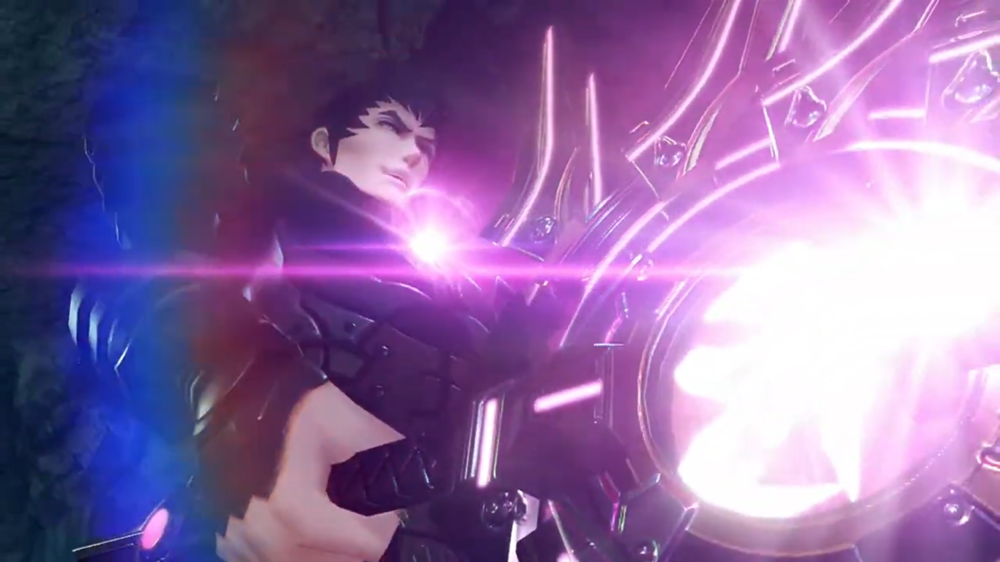
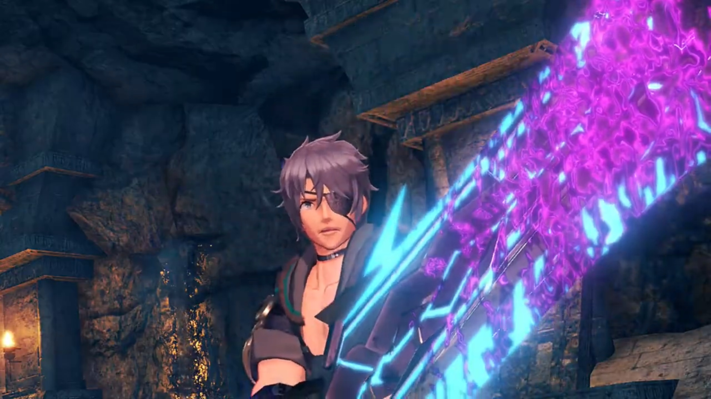
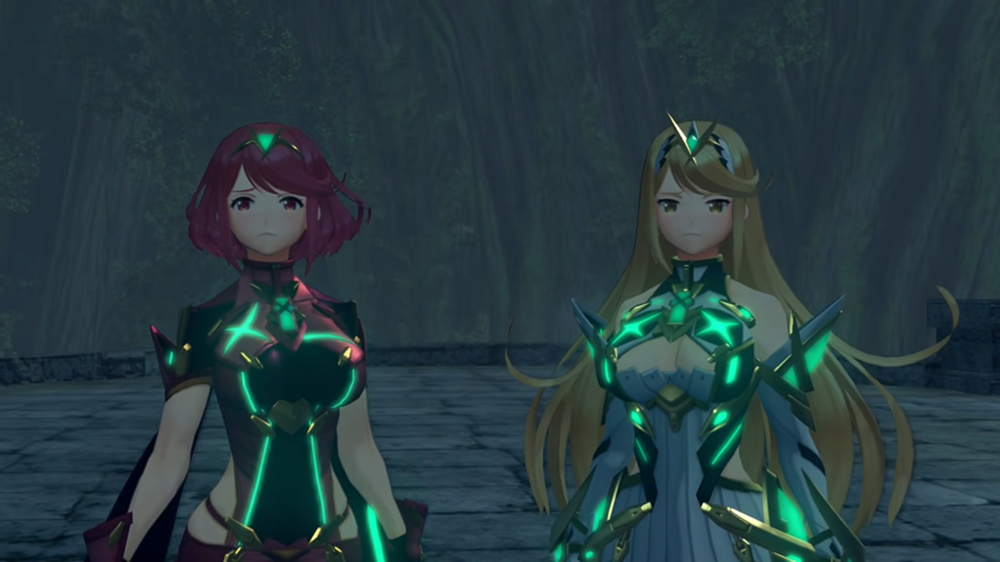
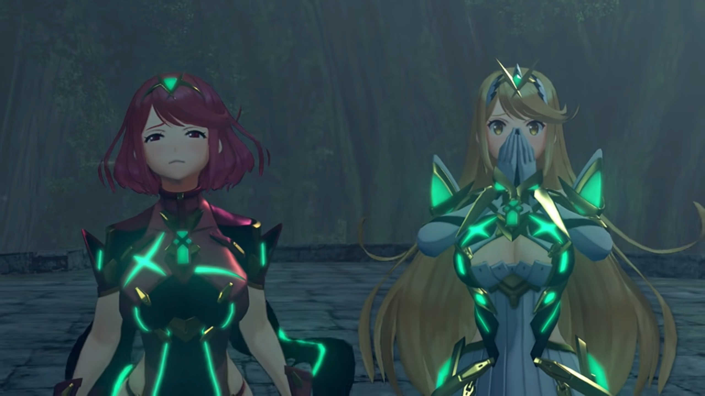
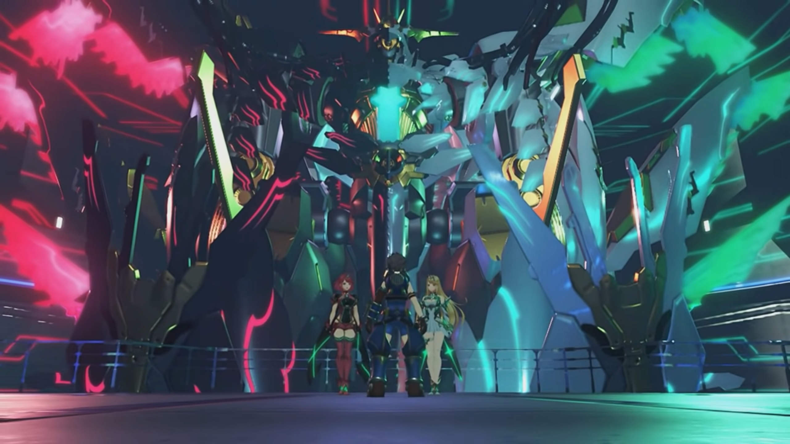
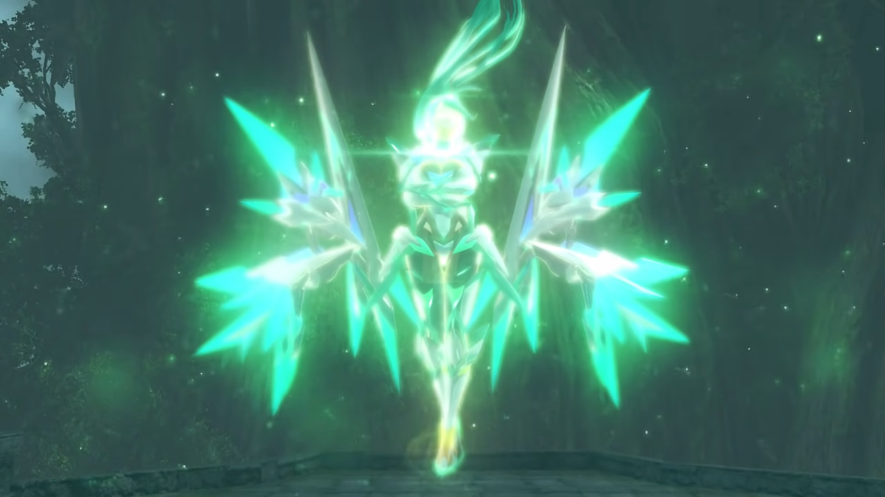
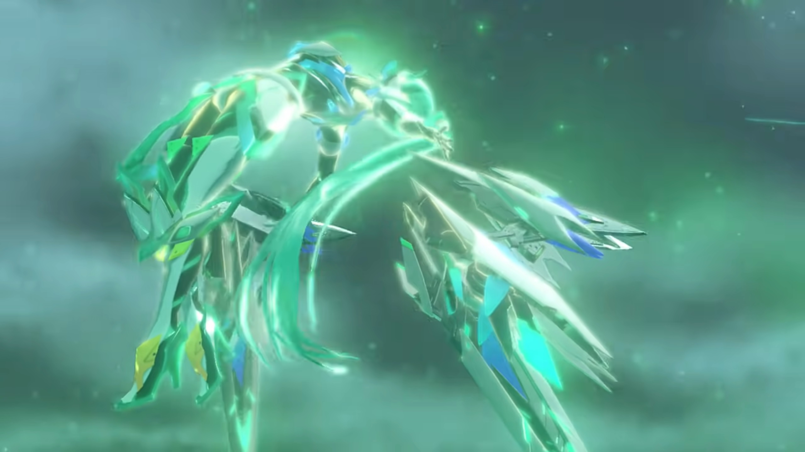
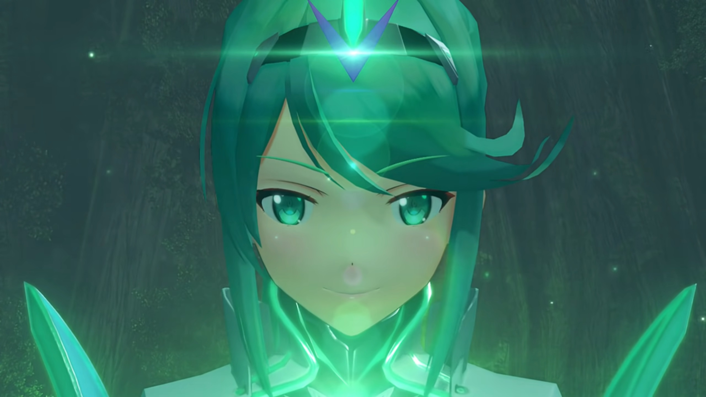
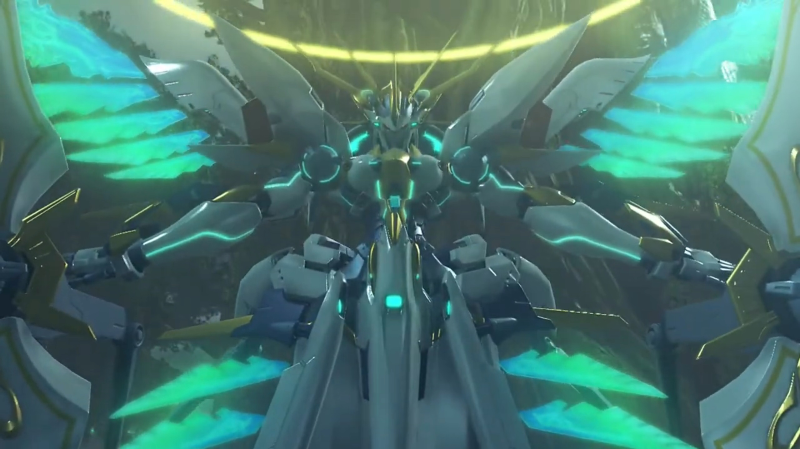

# Stand With Me One More Time!

Fonsett, beside a huge well full of water, they gathered around. Nia still retained her true form. Zeke finally had the time to exclaim, "**Who would've thought- that Nia was a Blade too?**"

Rex blamed, "**Why didn't you tell us, Nia?**"

"I just didn't, OK?" She dropped her head. Her fear might've diminished now, but that didn't make it less true and looming before. 

"**No, it's not OK!**"

Mòrag sighed at how they interacted, "You lot really **are** just children, aren't you?"

"Huh? What d'you mean?"

"You'll understand one day."

Zeke was thinking about something, shared. "Hey, y'know, me, Rex, Nia... We've all got some kind of... _deep Blade connection going on with us_, haven't we?"

"To tell the truth... _I am a little envious._"

"Lady Mòrag?"

"You know, I'm sure it could be arranged." Zeke seriously thought so. 

She looked at his chest, still opened up, thought about it carefully and seriously considering it, and asked the most important question, "Would it... leave a scar?"

"That's kinda part of the bargain."

"In that case, maybe not." It didn't ring to her for a while as she was thinking, then something struck her. She turned around and looked at Brighid, who'd been looking at her for long, started panicking, "**N-no, that's not what I meant!** It-It's just... (sigh)"

Her lips retained flat for a while before it slowly went up, "Hah! Relax. Much as I appreciate the sentiment, I wouldn't want you to harm yourself."

"_I-I'm sorry._"

Nia turned their attention back to their main goal, "Anyway, what do we do now? It's all well and good that we escaped, but we've got nothing to show for it."

"**Don't worry. I know where we have to go.**"

Gramps was so sure, "_Are you sure, Rex?_ You know Pyra's location?"

"I think so." He closed his eyes to sense, described what he saw, "Near the World Tree, I see a rotting Titan. She's there."

"A rotting Titan?" Mòrag ran through her inner encyclopedia for a matching description. "**Could it be?!**"

Tora urged, "What is it? _Mòrag knows_ such a place?"

"Close by the World Tree, against the side of the Great Void, I've heard there's a Titan known... as the Cliffs of Morytha."

"Morytha... _That name sounds familiar._" Dromarch tried to recall where he'd read about that in which book. "Lady Mòrag, there are tales, tales of a 'land of the dead', and the cliffs- that lead into its depths..."

"Yes, indeed. The Land of Morytha -- a place no living soul has ever witnessed. Well then..."

---

"Miiiiiiik, you here **again?**" She really don't like to see him, but in the same ship, she cannot help but see him in the room with rows of Core Crystals. "Is it- passion, or **idiocy?**"

Seldom see him with such seriousness. "Pa-tro-ka. **Just ask me out** already." He didn't even turn look at the beauty, continued tinkering with the terminal attached to the wall. 

"**Piss off-** and die, Mik."

"Oh, I'm sure I'll get round to it one of these days."

"Soooooo, **what** are you doing, anyway?"

He took his eyes off the screen to look at the rows upon rows of Core Crystals. "You know, the **Marsanes is** the last Tornan warship. I'm **readying it** for battle with **non**-mortal opponents."

"W-what are you talking about, '**non**-mortal'?"

He turned to look at her, laughed, "**HAHAH!! Surely** you don't need **me** to tell you?" He closed his eyes and gave her a handsome look. 

"You don't mean...?" She'd already guessed, but she refused to believe it. 

"_Heh._ Something wrong?"

"Ummm..."

"Did you **want** something?"

She don't dare to continue thinking about it, looked away while trying to think of an excuse, trying to keep herself calm, "**Oh, er,** food's ready. Get it while it's hot."

"You came all the way here to tell me that? _You've got quite- the- crushhhhh._"

"**Mik-hail, I'm going to Crush. Your...**"

"OK, got it. Well. I'd better go and eat this _delicious spread._" Patroka watched him walked off without another eye landing on her. With all the blue still glowing, she wondered, 

"Mik..."

---

Cliffs of Morytha. It's just a rotting Titan head jutting out the edge of the Great Void. "So these are the Cliffs of Morytha," exclaimed Rex.

Before them was a path along a valley. The floor all tainted with no life, just like Judicium. The cliff walls polished black and shiny. Mòrag commented, "A rotting Titan, drifting aimlessly until death takes it."

Nia exclaimed, "I just remembered -- Malos mentioned this place once. It's a shortcut to the World Tree."

Gramps popped out of the helmet, "Makes sense" to him. 

Rex urged, "Let's push on. **Pyra is definitely** somewhere ahead!"

---

"**AAAAAAAAARRRRGGGGHHHHH!!!**" Power from her veins drained towards her core from all over her body, before getting sucked out by Malos. The pain woke her up while Malos was oblivious to her screaming. 

Memories of her with Rex flashed through, how they first met, how he wake up in her laps, how he looked attentively at her after escaping Torigoth, how they 'helped' each other with bandaging and applying creams, how he brought her to see his parents. They dim, blurred, and retained no longer the more Malos extracted info from her core. No, not copy and paste, but cut and paste. 

"Pa-thetic. Look at all this trash! **HUH?**" He gripped hard, trying to get through all these useless memories to the ones he deemed useful. 

"**UUUUURRRRGGGGHHHHH!!!**" Her iris dimmed with intense pain, but she feared more the loss of what's most dear to her than the physical pain that he applied to her. The light in her eyes dimmed -- the light called hope. 

---

Rex's heart suddenly pumped much stronger, so strong it felt like his heart was ripping apart. "**UNGH!**" He held on to the core crystal in his chest. 

Gramps panicked, "**Rex, are you OK?**"

He panted breathlessly, more out than in, and curled his body into a prawn-like shaped. Her pain, he knew. "**Ungh!**"

"**Rex?**" Gramps continued calling out. The group stopped and waited for him to recover. 

He did his best to suppress his pain, forced himself to stand straight, to take his hand off his chest, "_I... I'm... fine..._"

"Could it be... _Pyra is in trouble?_"

"I don't know. But... we have to hurry. I have a bad feeling about this." The cell window (with holes large enough for them to pass) was up ahead. The flames beside them cannot give him any warmth. 

---

"Ngh ngh..." The darkness was lit only with her memories. Every step she put, the memories after her dimmed and disappeared. No matter how fast she ran, she could not retain any of them. The dark mist behind were engulfing them, little by little. 

A quick look behind her shoulders without slowing down her steps, Malos was in the mist, shouting, "**Why are you running? Why are you protecting this garbage? We Aegises don't need these things! You want to be free of them... AS I DO!!!**"

"**STOP IT!!! I'M NOT LIKE YOU AT ALL!!! I am...**" And she stopped when she saw he was missing; a figure loomed in front of her. Malos held out his hands, clenched her into a prison-like position like the prison device that imprisoned her in Tantal earlier. More and more info, including memories, were drawn away from her soul. "**STOP!!! STOP STEALING MY MEMORIES!!! NOOOOOOO!!!**" She evaporated into streaks of red particles. 

At the very beginning of her memories, he found what he needed. A giant Artifice, much much larger than Siren, with an Aegis Core Crystal, an angel ring, the right side to the Crystal tainted hell red, the left side the same green as Pyra's Core Crystal, with wings the same color respectively. That's what he needed, "Well damn, Father... Look what you've been hiding away. All right, then. If that's what you want, **I'll DO IT FOR YOU!!!**"

---

Jin, in his true form, was standing at the Cliff of Morytha, recalling. 

> There was a dilapidated abandoned hut in a jungle. Jin stood before a cabinet, took something out, and closed it back. He held the thing he took in his hand, hiding that hand behind his back as he turned around to face the already grown-up Lora. Lora was busy scanning the hut, trying to discern what this hut meant for him. He was the one that invited her to come with him. "What is it? Did you... remember something?"

Malos walked up beside him, announced, "It is done. Once we establish a link with what Mikhail is preparing aboard the Marsanes, everything- will- be- complete."

"And the Aegis?"

"_Oh, that? It's not an Aegis any more. Just... a lump of meat._" Although she was still held erected by the two artificial blades, she no longer had consciousness. 

"I see."

Malos walked toward the edge of the ledge, took out the Omega Fetter, and shouted, "**YAHHHHH!!! Come forth, Ophion!**" The light within the Fetter blinked, and from below the sea, it bellowed as it stretched its snake-like body up high, its mouth opened to reveal its upper-half torso in humanoid form. Its eye blinked red, a ring grew on top of its head, and Malos can't believe it, "_W-what's that?_"

Ophion raised its arm and aimed its cannon at him, energy pulse struck where he stood. An explosion engulfed the platform, but it did him and Jin no harm; the shield he raised was strong. He finally figured it out, "_Clever girl._ **It has its own attack instinct. Capable of autonomous action. Hah.** (He looked back at the lump of meat.) _She knew that. That's why she came quietly._ No matter. All it needs **is a little REPROGRAMMING!!!**" He jumped up high into the sky, punched at its body, and a burst of light engulfed the scene. 

---

"**WHUH!!!**" The grassy ground shook, alerting the group. Zeke scanned the open field for its source, hypothesized, "An earthquake?"

Pandoria cannot believe it, "In a place like this?"

Mòrag: "It's close." They'll know when they reach its source. 

Rex agreed, "Let's go!"

---

The sun had just set not long ago. Even with just the ether lamps around the platform, they could see him standing in the middle. Ophion was nowhere to be seen. He wielded a big knife-like sword with a giant ring joining its blade to its hilt, called the Monado{{footnote: As in, God's weapon.}}. Jin was nowhere to be found. "You're finally here. I've been _expecting_ you."

"_Malos._" Nia whispered. 

Malos immediately landed his eyes on her. Seeing her true form, "Your Core Crystal... So you finally gave up your little human act. Are- you- looking- for a place to **belong**, or are you **just a fickle child who _doesn't know_** what she wants?"

"Pfft." She spit to the side. As if you know better. 

"Where's Pyra?" Rex asked. 

"Hell if I know. She's probably **dead** by now."

"I'm alive, she's alive!"

"_Think whatever you like._ But don't be mad at me. All I'm doing is reclaiming what was **stolen** from me."

"Grrr..." How dare you. 

"**You're never going to see her again. (Thinking about when they first met) Heh! You make me laugh, you know that?** Look at you. That salvager brat I picked up in Argentum. **Standing here** with the _gall_ to _challenge_ me?"

"**Someone's gotta! We're not gonna lose to the likes of YOU!!!**"

The kanji symbol light up on his sword, and his sword started glowing as ether flowed through it, exclaimed, "You did well to make it this far. **But... You end here,** boy." He launched an attack at their central location, the group jumped in different direction just before the dark abominable ether engulfed their current location. 

Tora had landed on the edge of a platform, trying to calm his heart and focused on the battlefield when "**MEHMEH!!!!**" he felt wind brushing through him very quickly. However fast he fluttered his wings, he couldn't slow down his fall rate. 

"**Tora!**" Rex looked back and shouted; 

"**Masterpon!**" Just standing beside where he collapsed, she quickly rocketed down and brought him back safe and sound. 

"Agh! **What the hell is this?**" Zeke mindlessly dashed quickly towards him. Despite his speed, his attacks can't even break Malos's dome-shaped barrier. "**AGH!!!!**" He tried forcing in his sword, but immediately it disintegrated. He quickly pulled it out, but the mucus sticks on the end and, like acid, continued disintegrating the rest of his blade. 

"Watch it, Shellhead! Malos's power will destroy anything it touches! It'll take your arm or your head right off!"

"**What?!!!**"

"What are we gonna do?!" Rex hoped she had a solution. 

"_Hu hu hu huh huh... Pooooor, helpless, little_ **MAGGOTS!!!**" He grew the dome-shaped barrier, about to engulf Zeke. 

"**WHOA!!!**" He was about to ran backwards when a blue water-like dome-shaped barrier much smaller than Malos's surrounded him, refrained Malos's barrier for expanding, in the meantime repairing his sword. 

Malos immediately recognized this power, "**Nia! YOOOOOOUUUU!!!**" She, a Flesh Eater, standing against him, supposingly her ally? 

Rex: "**Nia!**" 

"I should have used this power earlier. But I was afraid. **Afraid**- to go back to those days. Lives have been lost... _because I was afraid..._" She dropped her head, the feeling of regret rushed through her like her memories. 

"**Nia!**"

Her head pulled up again, calmly she continued, "But someone taught me... that I don't have to be afraid. Now, I get it! My life- has a purpose!"{{footnote: Malos's first attacked had carved a whole around the center, and outside its circumference, the group was distributed like plum and puddings.}} She transferred more power that shattered Malos's barrier. Malos shielded his eyes from the incoming shards. She took her sword Blade from Rex and pointed it at Malos, 

"Your power might destroy, Malos, but my power restores. As long as my friends have the will to live, that's all I need. There is no wound you can inflict that I cannot heal. Blade weapons too! They were born from us and can be healed just the same. **Rex! Everyone! It's time to end this!**"

"**Yeah!!!**" Rex retrieved the weapon from Nia, and the battle began. 

---

"**I'l gonna KILL YOU!!!**" Malos and Nia dashed towards each other. 

"**Don't you know when to give up, Malos?**"

"**GYAAAAAAAAH, that's an _annoying_ power!**"

"So sorry! **You've gotta be stopped. You're a MENACE to the ENTIRE world!**"

"Is that so? Oh you sweet-talker, Nia." Annoyed, irritated, but nothing more. He knocked her away, calling to her attention, "**Don't you see how weak you are?** Heal all you want, but you can't even scratch me. _Where are your claws, kitty?_"

"Hmph! (She looked to the side, a sense of pride rushed through her chest) Very well. Then I'll show you! **You asked for it! Rex! Help me out!**"

"**You got it!**"

"Follow my lead!"

"OK!" Together, they grabbed the hilt of the sword. 

"Here goes!" They raised their sword into the air as hurricane began forming around their sword. Water swirled and splashed at Malos, 

"**GRAHHHHH!!!**" The hurricane was so strong he can't see a thing; mindlessly, he slashed in front of him where he thought he heard footsteps. The power of destruction engulfed the ground; but Rex who can see jumped mid-air and get out of range, 

"**YARRRRGGGHHHH!!!**" Her blade weapon in his hands, she materialized another with ether, and their slashes combined. Sensitive to ether, Malos swung his sword once more and broke their combined slash. Piece of cake. 

"**HUH??!!!!**" But why were the water droplets that supposingly fall down and dissipates still floating around him? No matter how much he swing his sword, it passed through them without dealing them damage. One by one, they entered his body through his sweat pores, but he had yet to realize, "What? Is that it? **Huh!** I **hardly** even felt it." 

Only after all the water droplets entered his body did his smile dimmed. Muscles strained, and everywhere, he felt his internal organs bloated. "Gurgh... **Gahh!!**" He tried to use his power to suppress it, but his body was blown up like a balloon faster than 'air' can leave. "**GAAAAAAARRRRGGGHHHH!!! Nia... Wh-what have you done to me?**" 

She walked up and stood beside Rex, explained, "I altered the replication rate of your body's cells. **Even** an immortal Blade... is made from the same stuff as any other being. I used that to my advantage."

"**Grhhhh...** This is why... Jin recruited you... **He saw that power!!!**"

"_Who knows? Why don't you... ask him yourself?_"

"**GRRAAAAAAAHHHHH!!!**" However much the power of destruction burns, more than double it came back. Fatter and fatter, his body pushed against his armor. Tiny explosion released the pressure temporarily at local parts of his body, yet more grew back and replaced the wounds. Step by step, he retreated, his head throbbing, his whole body throbbing, until he reached the edge of the ledge. 

"I've got... just one thing to say to you. The place where I belong..." She peered over her shoulders. The group gathered around to watch the end of Malos the mighty Aegis. "is right here."

"**URGH! NIAAAAAAA!!!!**" He held out his hands, trying to grasp them, trying to grasp to life; but no, this is his end. And he fell into the Great Void. 

She walked to the ledge where he last stood, bade goodbye, "_See ya._"

Unconscious, his corpse was caught on one of the jutted out ledge at the bottom of the rotting titan; but no one knows that. 

---

"Huff huff puff puff huff huff" He can sense her, she's just up ahead. Faster, faster, faster; he saw her still pressed by the two artificial Blade.  "**PYRAAAAAAA!!!**" 

Jin, standing in front of her, stepped aside, and they came to a halt. She's no longer conscious, had they came too late? He tried calling, "**P-Pyra?!**"

Jin: "Ah, you missed the highlight. We already have everything we need from her." No, that's not true. It cannot be. But she's not waking up to rebut. 

"**JIN! WHAT DID YOU DO TO HER?!!!**"

"**I- already told you.**" Malos approached them from behind. "I'm just trying to get back what was stolen from me five centuries ago."

Nia was surprised, "**Malos! You're alive!**"

"**Hah!** You didn't think you could put me down that easily, did you? **I- am an Aegis!** _Don't underestimate me. I can't believe you fell for it._" His eyes focused on her, looking through his nose, as he went round the group to meet with Jin. 

"Pfft. Ngrrr..."

"**YOU DID THIS TO HER?!!!**"

"**She betrayed herself** as an Aegis, forming a bond with a _piece_ of human trash. She tried so **pathetically hard to hold on to her memories** of you. But- in the end, I- got- them- all."

"NGRRRR..." Angry smoke bellowed from his nostrils. 

"She put up a brave little fight." And with the most professional of actors, he replicated her despair, "_'Please don't steal my memories!'_ Cute stuff like that. (Rex's hands trembled the more he spoke). Sorry, boy. You came to this **desolate** place for _nothing._ **Do you really want** this useless husk? (He went ahead and snatched Pyra from the artificial Blade, tossing it at them) **Go ahead and take it!**"

Pyra's corpse bounced and dragged along the bottom of the platform while Rex went down to the floor along her trajectory and hugged her as she crashed into his hug, looking into her closed eyes. "**Pyra! Pyra!** I'm so sorry... Pyra... _Mythra..._" 

She felt so cold. He tightened his hug, hoping his body heat would recuperate her vitality; but she's not even trembling. She's just... stiff, hard, cold. Her skin looked whiter than usual. He put his face close to hers, caressing her nose with his, tears dripping into her eyes, "**We made it this far,** but..." 

But no matter what he did, she won't wake up, she won't react. 

"_Rex..._" Nia's heart hurt the more. To see her love one in pain, it's her pain. But she can't console; he had to get over it himself. 

"_Rex-Rex..._" The person he and Poppi looked up to had never felt so desolate. Not when she was taken away -- he believed she would be in good hands. If he knew she won't, he could've came earlier. But why, oh why? Why did he wasted 2 days intentionally avoiding the truth? If they'd just come a few hours earlier, she would... she wouldn't...

His breathe softened up and his heartbeat slowed. He slowly put her down on the ground, watched by his friends and enemies, undisturbed. He stood up and called out softly, "_Nia..._"

"_Got it._"

"Dromarch, take care of Pyra."

"Understood."

Malos watched them putting up a show, "Uhuhuh what's this? I thought you'd start **bawling** and charge at me. What a big boy." Rex took a few steps away from Pyra. 

"_Stupid._" Quietly he said, looking on the ground. 

"_Eh?_" Malos was confused. 

"I was stupid. I didn't understand- Pyra- and Mythra's feelings." He looked up; the World Tree loomed so huge, so close, but they could no longer reach it _together_; it would not feel the same, not without her by his side. He finally realized, "Though we were destined to follow different paths, _I tried_ to walk together. I walked- in the shadow- of the Aegis's light. **Blindly** walking my own path, while she... walked- _alone._"

"What are you **blaaaathering** about?" 

He disregarded Malos's confusion, continued, "So, I might be stupid... but I've made a decision." He looked at him with unwavering eyes. 

Now that's interesting, "**Ooooho!** What have you decided? **You've come all this way**, _I'll hear you out._"

"It's obvious. **I'll crush you into oblivion, and take Pyra and Mythra to Elysium!**"

He cannot helped but laughed, "**HAH! Crush us? Me and Jin? You couldn't take Jin on your own!**" Jin didn't said a word. "**And on top of that, I've regained control of ALL MY Aegis powers! Not to mention** the Artifices! _You're doomed, boy._" He looked over him from the tip of his nose. 

"I'm not."

"That thing is just a used-up shell. _You can't rely on it to save you, boy._"

"I now understand. What Pyra and Mythra wanted." He know she's listening, still in her core. He believes. Jin listened attentively. "And I understand, what I have to do to make it happen. What it means to be Driver and Blade!"

"Ah!" That eye, the words. He saw it before, 500 years ago, in Addam, in Lora. He also used to had the same eye, but he abandoned it, he abandoned it when Lora... The words that reminded him of what he don't want to face, his own fears. Rex saw his eyes dimmed into a dot. Gramps nodded, felt relieved that his boy had grown up. 

"**Everyone, stand with me one more time!**" Mòrag and Brighid ran, Zeke and Pandoria marched, Tora and Poppi dashed, joining Rex and Nia. "**Let's get Pyra back, AND GO TO ELYSIUM!!!**" And the battle begins. 

---

"**ARRRRGGGHHHH!!!**" He don't even use much power, but Rex already cannot withstand. He was about to finish him when water droplets swirled around Rex, and his anger rushed halfway through his chest before it reached a wall. Like a mosquito was swirling around him, and when he just wanted to kill it, the mosquito sensed it and flew away, camouflaged in the dark, and when he went back to do his work, the mosquito close in again. 

"***URRRRGGGHHHH!!!** Have I mentioned how **irritating that ability is?**" He looked at Nia on the other side. 

"You did mention that." She tried transferring more power, but "Ugh!" She fell to the ground, ice and mist started forming around her. She wondered "Wh-what?" just happened. "This... It's ice? **Jin... you?**"

Malos exclaimed, "But of course! This is Jin's true power. **You** may have awesome regenerative powers..."

"Pfft"

"But everything becomes futile once you get down... _to absolute zero._"

"Brrrrr..." Mòrag was shivering, "Absolute... zero?"

"**While they're vulnerable! LET'S DO IT, JIN!!!**" Malos dashed and slashed at Nia, while Jin 'teleported' to deal with Rex. 

"Urgh!!!" Nia dodged his attacks, and Dromarch swung the twin ring caught in her mouth at her. Wielding her Blade weapon, Jin and Rex were sparring, but it seemed he had no intention on finishing him quick, else he would've used the speed of light. 

"**Rex! AHHHHHH!!!**" Nia wanted to help, but Malos went hard on her. He wanted to finish this mosquito first. 

"**Nia!**" Mòrag quickly came to her rescue while Nia gritted her teeth, both hands on floor, watching Malos approaching her. 

"**I'm not done with you yet!**" Mòrag blocked just in time. 

Zeke and Pandoria went behind Malos, jumped high onto the air to help "Mòrag, this is getting us nowhere!" Malos called a sphere of destructive powers, pushing him away, both landed some 50 strides away. 

"Aww, too bad." He let go of Mòrag to face him, mocked. 

"**Tch!**"

"**Poppi!**" Tora point at Jin. 

Poppi was at the side of Jin and launched her biter at him, "**Taaaaaake this!**" Jin immediately sliced at it at light speed, the shockwave blew "**Argh!!**" break their balance. 

"**Trash!**" 

"**GUAAAARRRGGGHHH!!!**" They flew away. 

Rex worriedly called out, "**Poppi! Tora!** Urgh!" He couldn't escape. She's behind him, and he believed they'll be all right. Every attacks he wielded, Rex dragged few steps back, closer and closer to her corpse. "**URRRGGGHHHHH!!!**" No matter how many time he falls, he stood up and held on to his blade. He must bring her to Elysium; that's a promise made.  One step by another, Jin walked towards him, the bricks froze under his steps. "**IT CAN'T END LIKE THIS!!!**" 

He took the upper hand on attacking, but Jin found it easy dodging his attacks. From within his core, he heard Pyra's voices. "Enough! Give up, Rex! Forget- about us!"  

She thought she don't have to come out, but seeing him going through this sparring that did nothing more than adding bruises and wounds on his body? They couldn't take it. Their soul were almost gone, but with what's left, they wished to try again, one more time. 

For the first time, Mythra sounded more emotional than logical, more desperate than tsundere, "Rex, please listen to what we have to say. Our power... has done nothing, but bring you pain. It would be better... if such a power _didn't exist!_"

Their soul appeared in between him and their husk, but no one could see them; and only he could hear them. The sparring continued; Jin wouldn't leave him alone, and he wouldn't give up. 

With tears in her eyes, Pyra confessed, "We told you... we wanted to go to Elysium, but- the reason _why_... we wanted to go there... was to **beg** our Father to **let us die.**"

Mythra: "So **forget us**, Rex! **For the sake, of the world, abandon us!**"

"Abandon you?" Rex cannot accept.  
"When _you-_ are injured, I **feel**- your pain.  
When _you-_ feel pain, I **feel**- the **sorrow- in your heart!**"

The mosquito made his job difficult, but he was taking his time. Even so, when he heard the boy shouting out loud his conviction, he laughed, "**Wu Wu Wu What the hell? Has he finally cracked?**" Had split personality? 

Pyra and Mythra spoke nothing, attentively listened to their loved ones. They wanted him to abandon them, the action, for his sake; but deep in their heart, they believed they might felt a bit sad, or even disappointed, if this is the person they'd loved cannot die for them. But if he abandoned them, they would also felt relieved, for whom they loved would live, and they could rationally convince themselves to abandon their disappointment, for they had asked for it, asked him not to persist. 

"**You really think I can just stand by like this? And watch someone I love suffer?**"

From the bottom of her lungs, she hysterically rebutted, "_You can make it to Elysium!_ You can make it... _with or without us. So pleaaaaaase!!!_"

Mythra shut her eyes; she can't stand it anymore, pushing him away from them and seeing him getting wounded for them. 

"**What would be** the point of that? **Listen, I swoooore to you. We going. To Elysium. Together!**" The sky heavy with cumulonimbus clouds, a streak of light shone through as it thinned a little, casting a golden hue on her empty husk. More and more, the polished walls of Morytha brightened. "**That's a promise.**"

"_Rex..._" Glad, grateful, tearful, what emotions flushed Pyra at the same time. Mythra was so overwhelmed she covered her mouth with both hands, eyes big and bright. Even after he knew they were to commit suicide, he willingly stood with them? 

"I'm going to Elysium _for_ you.  
I'm doing all of this... _for_ you.  
We'll do it _together._" The morning light shone on him brighter and brighter.  
"We'll find out _together._ We'll find _your_ place in this world! Find out where _we're_ headed, _and see what our future holds._  
**So believeeeee me!** I won't let the world burn- a second time!" 

Jin prepared for his final attack as he aimed the tip of his sword at the core crystal in his chest. The light on him shone bright, preparing for light-speed. "**So, Pyra, Mythra... JOINNNNNNN MEEEEEEEE!!!!**"

Jin 'teleported' in front of Rex and, with all his might, slashed at him, undefended. 

A bright light engulfed the whole platform just before they came into contact. Time stopped. Rex, with his mouth wide opened, opened his eyes and found himself inside a dark hall with ether running on both sides, standing above a bridge that drops to oblivion on both ends, opened his eyes to see the artifice that Malos was searching for deep within their memories stood behind Pyra and Mythra, in a within the missile silo inside the high-tech-looking room. 

Pyra explained, "This is... our _whole being._ This- is the power... we were granted at birth."

"So, Rex... _Are you still- sure- you want this?_"

Rex looked at the magnificent being calmly. Its power was tremendous, but what he cared most was in front of him. He took his eyes off the majestic being, looked at them attentively, asking them calmly, "Tell me, do you- love this world?" He looked first at Pyra, then Mythra. 

Pyra answered without a moment hesitation, "_Yes. Nia, Azurda... and you, Rex... I love this world because... you're in it!_"  

Mythra never looked into his eyes, nor said anything, but he'd read it. Pyra's answer was her answer. He nodded, the answer is clear. 

"Well then." He held out his arms, one for each of them. Their lips brimming with smile, they looked at each other, nodded to each other, and finally, they can find someone to hold it for them, to support them, to bring them out of the loneliness they'd walked on for so long, their sole responsibility to bear. 

He is the person they can entrust this power to. He is the person they can entrust their heart to. He is the person they can walk together with. He is the person they love. He is the one. They walked forward, took his hand, one on each, and a bright light engulfed them, and time resumed.

---

His eyes still closed, his neck stuck out as if it's welcoming the sword, hoping it would slice the softest part and bring a painless death. But the impending death never came. An Aegis Core Crystal stood in the way, repelling his sword inch by inch. "**Huh!** Wh-**what? H-How?**"

"**HYAAAAAHHHHHH!!!**" Rex grabbed it, materializing the third sword, knocking away Jin. 

"**Ugh!**" The energy it emanated so strongly heat vapors was seen to distort its surroundings. 

On the other battlefield, Malos was equally shocked, "**A NEW SWORD?!!!**"

Pyra's husk floated behind Rex, her Core Crystal glowed bright, and in a gulf of bright light, transformed, where _they_ joined as one. Her long hair tied like a ponytail that stretched to her waist floated up. Metal frames with turquoise crystals at its end stretched to both sides of her, like wings, like throne. On the shirt on her chest carved the Greek letters "πνεύμα" (Pneuma). She opened her eyes; she had returned. 

Rex was overjoyed for her return, "**Pyra! Mythra!**"

With the voice of Mythra, she said, "Apologies, Rex. Worry not. Alllll is well. I am lost... no longer." 

Then, she casted at Rex, forming an armor around him. He scanned it, asked, "What's this?"

Pyra was excited at her work of art, blinked at him, "Ahhh, **that's better**, don't you think?"

"**I could get used to this!**" He swung his sword around; they had two enemies to fight. "**EVERYONE!!! ATTAAAAAAAAACK!!!**"

Zeke most excitedly chanted, "**YEAH!!!**"

Nia got her sword back, "Payback time!" Round 2.

---

"Ugh!" Jin felt their strength too strong for him. 

"**HYAAAAAAAAAHHH!!!**" Rex jumped into the air, slicing at him. He dodged, Rex's sword bashed on the ground and released a field of shockwaves. 

"How?!" At light speed, the two crossed swords. Jin cannot understand, "How are you matching my speed?" Rex teleported in front of him, and he still can't believe it, "**Impossible! You...**" Pneuma appeared behind him, just as he subconsciously teleported away. "**can't have such power!**"

> **Translator's note:** Just like we use "Poppi" and "Poppi QT" to distinguish her forms, we'll use "Pneuma" to distinguish this particular form of Pyra and Mythra combined **only in narrating.** What Rex and the rest chose to call her, we'll abide.

Nia watched rocks fall where they smashed onto cliff walls along their path. Rex don't know either, "I don't get it, but I'm not complaining! **This- is what I've been searching for.**" Nia saw a bright reflection of a slash and exclaimed, 

"Whoa... So this- is Pyra and Mythra's- true power."

Jin backed away in mid-air, trying to regain his balance. Aiming straight at him, Pneuma and Rex held on to the hilt, and before he could, plunged through him. The whole cliff shook while others were doing their best to stand on their feet. Rex and Pneuma flew up high, looking through the shrouding dust, sword pointed at the exhausted Jin. 

"**GRAHHHHH!!!**"

"**You want some more?!!**" Rex asked, but the dimmed in his eyes, like dead waters, he'd just noticed. 

"Urgh..." He stood up. 

Rex noted, "_He... looks so sad..._"

"_Rex..._" Pneuma stood beside him and put a hand to block him from taking further action. He looked in her eyes, saw her request. 

"_Weak. End me now, or you'll live to regret it._" He pointed his sword at the boy. 

He put down his weapon, said, "I don't want to fight you. I just want to get to Elysium. That's all. I won't let you stop me."

"That's not going to happen." Rex watched as Malos walked onto the stage, "**We have goals- of our own. You and anything that stands in the way will be wiped- out.**"

"What goals?"

Jin answered him, his tone full of desperation, "Our only purpose. **Destroy humanity. Destroy the world. Then...**"

Malos continued, "**Destroy the Architect.**"

Pneuma looked away. Rex was confused, "_Huh?_"

Malos raised his hand and looked at it, the hand that'd never stopped killing ever since he was born, by his will, or maybe Amalthus's, "I- am an Aegis. Created by the Architect to **erase** existence... **The ultimate weapon. THE ENDbringer!**"

"Endbringer?"

"**Yes.** My only purpose is to destroy. **I am the Endbringer. That- is why I- must go to Elysium...** And awaken the **ultimate Artifice**, Aion!"

"**You can't be serious.**"

"I'm nothing **but** serious, boy. **This- is the sacred duty entrusted to the Aegises**- by the Architect!" Sure, he might've doubted whether he's being influenced earlier, but now, he _must_ believe he's under his own control, that he _truly_ believed it, whoever stuffed that idea into his head. 

Pneuma rebutted, "You're wrong. Father doesn't want that! You're deeply mistaken."

"_Enough._" The platform started shaking. "**I know I'M RIGHT!!!**" From deep beneath the cloud sea, Ophion pulled up behind him. 

"**HUH!!!**" The group was shocked; but Malos had the grin on his face. Ready to face your own Artifice? 

Pneuma: "What? **Ophion!**"

"**INDEED!!!**" Malos reassured, "**IT ENDS HERE.**" From the teeth-like barrel, energy gathered, the cannon to shoot at the group. Jin looked at it through the tip of his eyes, feeling something wrong. Within half a second, a particle beam barraged from up high, striking its upper torso and sending it in flames while it plunged back into the cloud sea. 

Every single time, just before victory, someone kept disturbing them, cannot help but irritate Malos the more, like a volcano before erupting but was blocked from erupting, "**Another guest at the PARTY?**"

In front of the World Tree, Siren had finally descended from deep space onto Alrest. Rex hadn't seen it before, but he immediately had a gut feeling, a connection with it, "That's... Siren!"

Malos shouted, had no fear of a fight, "**BRING IT ON!!!**" Ophion shot a particle beam from beneath the platform at Siren, tracking Siren's evasion track. When hit, he raised a shield. Like a snake, he went up. Sired dodged, plunging its photon sabre to the side of the snake's body, dragging along it. As if it didn't feel hurt, Ophion made a cameback, plunged directly towards Siren. Two bow shocks were formed as they clashed against each other. 

"**Guargh!!!**" In front of their eyes, Siren retreated. Pneuma dropped to the ground in pain. 

"**Pyra!**"

In Mythra's tone, "I'm fine." She rubbed the blood at the tip of her mouth. 

Malos hadn't give up the chance, "**I've had it with you. PYRA! MYTHRA!!!**" Then, he ordered Ophion to retreated some distance from Ophion, firing the beam at a raised shield. Tora and Poppi whom stood too close to the point of contact got blown away. 

"**No!**" Rex shielded his torso with his sword. But the strength of the artifices were too strong, even the indirect shockwaves they cannot resist. 

Zeke realized something else, something he'd been 'gotten used to', "**Ah! The cliff!!**"

"**AAAAAAHHHHHHH!!!**" The whole platform they stood on shattered into shards, taking everyone down with it into the void below. Pneuma hugged Rex as they went down to oblivion. 

### Footnotes: