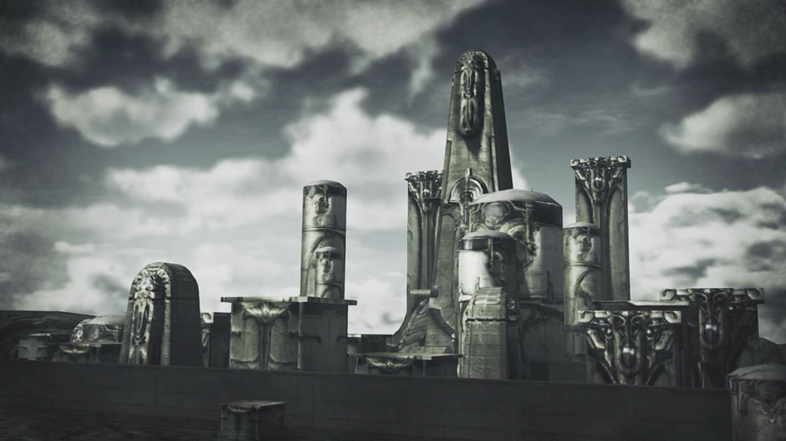

# The Hubris of Mankind, Unborn Blades, Jin's Story

"So many many..." creatures roaming a square in front of them. 

"**Mythra!**"

She shook her head, "There's no way around..."

"Yeah. **ACK!!**" He bit his tongue as Jin surpassed him, his footsteps and body smell attracted the monster to gather around. 

"No time to play around." He said blandly. 

"No arguments there..."

Brighid agreed, "No option but to wipe them out. Let's do it!" He nodded, and the rest joined Jin. The battle begins. 

---

"I didn't know there were monsters like that..."

Gramps: "Nothing like Alrest, for sure. They've got a rotten knack of healing themselves."

Brighid noted, "Almost like... Blades..."

"I dunno, but... maybe they're leftovers from the culture that created us." Jin suggested. "This is the **Architect's** world. I guess **nothing** should come as a surprise."

"I wonder what kind of a person he is..." Rex thought deep. 

Mythra said, "I didn't get to meet him. I mean, I have **fragments**- of memories, blurred images. That's why... I want to meet him."

"To create this awesome civilization; I can't imagine!"

"Awesome? **This?**" Jin was incited. 

"_Huh?_" Why the sudden anger? 

"It's a heap of smashed-up crap. Look at it." He turned to a rubble, observed, "It was melted by a warhead or something. All that's buried here- is the hubris- of mankind. If the Architect was born here, then he must be as flawwwwwed as any other. No different... from you people of Alrest."

"**Why do you hate us** so much? **What is it that you think we've done?**" Jin turned to the other side, remained silent. "**Jin!**"

Where his head turned, his attention was attracted by the hubris, "_That... That's..._" He didn't expect it to be here. Such a big city it could've fell anywhere, but _why here?_ "_Torna._"

---

Monoceros forced itself to dive deeper and deeper, faster and faster. Inside the hull, the bleeping sound never stopped warning its crew that the hull were approaching its limit. "**GAH!!!**" Mikhail won't let go; however much the throttle resisted, he pushed with full strength, his eyes fixated on the location. Closer now, closer now, they would get to where they need in no time. Jin, just you wait. Mikhail is here to rescue you! 

Patroka, seated at the side control panel monitoring the statistics, shouted, "**Mikhail! This- is- bad!**"

"**Akhos! How deep are we?**"

Akhos was monitoring the other side control panel, relayed, "28,000 peds! We're nearly at the limit **already!**"

Patroka panicked, "**It's too MUCH!!! Any more- and we're...**"

Mikhail was insistent, "**We're nearly out of the Cloud Sea! Just hold out a bit longer!**"

"**Yeaaaaaah, but-**"

"**What. About. Jin?! Are we just going to abandon him?**" Malos laid his back on one of the walls, as if he wasn't in the ship. Perhaps he believed, even if the ship break, he wouldn't die. Or perhaps, a psychopath like him just had not the ability to feel fear. His eyes fixated on Mikhail, listening to him, twisted his head, trying to decide whether this guy was acting a little too emotional or not. 

"**Well, I mean...**"

He gritted his teeth, eyes fixated on the Land of Morytha. His hand which pushed against the throttle felt numb from the backpressure, and he persisted, "Just a little... Just a little bit more... **WE'RE OUT!!!**" 

The hull survived, the bleeping sound disappeared as the pressure diminished. Monoceros floated above the skyscrapers, as if there's liquid immersed above it. Everyone except Malos were awestruck by the scene. 

"_This- is... the Land of Morytha..._" Patroka exclaimed. 

"First time I see it." Akhos admitted. 

Mikhail: "Yeah. Wouldya look at **that**."

"It's nothing to shout about." denounced Malos. "Just a bunch of ruins."

"Malos?" What do you know about it?

"A testament to their hubris."

"**Theeeeir** hubris? So... humans lived here?"

"Alrest will suffer the same fate." He concluded. 

Akhos felt his mean justified once again, "So _that's_... why Jin..."

"Is it really justified?" Mikhail wasn't fully convinced. 

"W-what are you sayin'?" Patroka shot at him. 

"I know **why** Jin wants to **destroy** everything... But, 'everything' can't mean EVERYTHING, can it?"

"You're not there yet. That's OK." Malos immediately answered him, getting his back off the walls, walking towards him while Mikhail kept his head facing forward, looking at his shadow from the tip of his eyes. "You'll- understand soon enough. (He hardly put his hand on Mikhail's shoulder). Let's cross that bridge _when we come to it, huh?_"

"Hmm..." He looked away, but didn't say a thing. He kept reminded about when he was younger, with Lora and Addam and the others. Did he _really_ want to destroy his memories, too? The most happy moments he'd in his lifetime? Now that he's on the ship, he don't know if he could do otherwise. 

The Monoceros continued floating above the skyscrapers, wherever its deestination. 

---

They crossed a rocky bridge that seemed patched with web-like mucus, Brighid noted, "It's scorched, here and there."

Gramps: "Traces of the Aegises' battle, I reckon..."

Rex: "Must have been some battle..."

Mythra felt uneasy. "Hmph..." 

They stopped as Rex was surprised at what he'd seen, "What's..."

Carcasses wrapped in stone; presumably it was bearing something within but it never been born. Or did spiders wrapped their victims in it and laid their eggs in it? Jin introduced, "The Tornan Titan matrix. Even in olddddd Torna, few people knewwwww this place existed."

"I can scarcely believe it myself," admitted Gramps. 

Rex looked around, asked, "Matrix? Like a womb? These are... Blades?"

Poppi observed, "But... they look quite a lot like Titan too..."

Jin explained, "These are Blades that perished in the process of becoming Titans. Titans grow Core Crystals... within their bodies. I believe- you've seen this once before."

> When Vandham brought them to a dead Titan, it evaporated into motes, and left a fresh Core Crystal.

Jin continued, "Blades... They aren't truly immortal. They are born- from Titans. And when their fire burns out... they return to the Titan that bore them. Eventually, the Blades that return, transform into Titans- themselves."

"Can that be true?" wondered Brighid. "We'll end up like that, eventually?"

That put Mythra in thoughts too. Rex noticed and asked, "Mythra?"

Hate to admit, but "Yes. It's true."

Jin continued, "The new Titan- has no memory of its life as a Blade. Just like returning to a core." Rex looked to Gramps -- just the role model. "_These poor souls..._ They **died**, along with their mother. **Shared her fate.**"

---

They entered some furnace-shaped metallic building remains. The building wasn't lit, and the only light came from outside the entrance where they walked in, which wasn't enough to reveal to us what was in the soot-covered remains, but presumably, some 'cave painting' equivalent. Brighid summarized what she'd heard earlier, "So Blades are born from crystals, and- Titans from Blades. The Titan, in turn, nurtures life..."

Rex added, "And someday... births new Core Crystals."

"Right. That's the- life cycle of a Blade." Mythra assured. 

Jin: "It is the way- that the Architect ordaiiiiined for the world."

"Old Torna- worshiped- this cycle."

"In Olddddd Torna, we revered- the Titans. Feared them." 

> The old Torna buildings looked like some Greek or Maya or Aztec civilization, with weird pillar shape, or weird head shape. 

Jin continued, "It was the sacred foundation of Torna. A nation where humans, and Blades lived in harmony." 

> Lots of people chatting on the street, be it humans, or Blades, as equals. Just like in a normal city where people walked up and down, doing their job. 

"But... humans couldn't live like that. The battle with Malos- marked the end. It wasn't long- after you- and Addam left Torna." Mythra wondered what he had to say. "He did it... That worm, Amalthus."

Rex was surprised, "**The Praetor?**"

"What did he do?" Mythra wanted to know. 

"The one who really destroyed this place? It wasn't the Aegis... **It was him.**"

"_Huh?_" Rex couldn't believe his ears. After all the history we learnt, you now tell me that it was tainted? Written by the winner(s)?

---

> Explosion everywhere when the Praetorium soldiers marched, followed by Titans with mounted cannons. The remaining humans and Blades of Torna could not even gather a proper frontline. Everywhere they ran with their backs facing the marching Praetorium frontline. Warheads that never stopped launching from the barrels destroy every single obstacle in their way. Everywhere, humans on flames running for their dear lives. Blades, with their core damaged, returned to their Core Crystals. The shouts and screams of Tornan men, women, children, and elderly were music to their ears. They had no mercy. 
> 
> Not far in front, Jin gripped strongly on Lora's wrist. The strongest Blade of Torna? No, not now. Plus, she's his weak spot. If she dies, he'll returned to his core. If she dies, he'll never forgive himself; his regret will pass on to the next resurrection. Shit, if not for the earlier battle, these wretched scum would be no match for him. He need to get them out. 
> 
> Lora kept turning her head around, watching how fast they were closing in. She hoped her feet would listen to her, faster, faster, faster, she called. But they wouldn't. At this rate, they cannot escape. But why? Why can't they just leave them alone? 
> 
> One explosion shook her out of his hands. She stopped and turned around, stretching her hands apart. A bullet shot through her chest, and he watched her fall, "**Lora!**"
> 
> He swiftly laid her on his back, his eyes scanning for a refuge. She'll be all right. He hadn't returned to his core, and that's the best assurance. He thought the cliff walls might be their best place for now, and he immediately acted. Alas, luck was not on their side, and flames engulfed them. 
> 
> "Find them! They must be somewhere nearby!" The Praetorium soldiers gone through their checklist; despite felling most of the humans and Blades, the most important ones had yet to be found. Below them, in the shade inside the trenches, Jin listened. The footsteps were getting softer and softer; he could now turn his attention to the girl in his hug. "_Lora..._"
> 
> She was awake, effetely reassured, "_Don't worry... If- I die, you'll just go to sleep..._" Her voice started strong and affirmative, then tears started blurring her vision. The bits and pieces together, from being a fatherly figure at his birth, to being a manly figure that always stood in front of her, she never complaint about his ever-emanating seriousness. With trembling voice and more tears, she tried to reassure him, "_Someone will find you... reawaken you... someday..._ For us humans... Being **forgotten**- is a much worse fate than death. _We struggle... **so hard** to make our mark... on the world..._"
> 
> When she closed her eyes, he thought she could hold no longer, cried out, "**LORA!!!**"
> 
> She thought, by not looking at him, by feeling her life force dissipating, she'll come to accept. Her mind raced through the bits and pieces, their moments together, one more time. She thought, if they could just live a little longer, retired to a cabin by the lake, he cooked daily, she fished. He looked over the household, she sat on the bench, have some girly chat with Haze. Oh, Haze, oh, our memories you could no longer retain, and now Jin too? "_When you awaken..._ To you, it'll be like I _never even existed. Jin..._" She couldn't bring it on, she couldn't persuade herself. She thought she could, but... Tears in her eyes, she cried, "_the thought of you- forgetting me... It's like one heart- is being ripped in two._"
> 
> Jin panicked as she closed her eyes once more. Motes started rising from his body, emanating from his Core Crystal. He could hold no longer to her flames of life. He cried, "I won't- forget you! I refuse to forget you! _How could... I ever..._"
> 
> He put his head close to hers, sniffed her faint breathe, smelt her faint scent, felt her dissipating warmth. He felt a warmth laid on his cheek, opened his eyes and saw her teary eyes. "I thought I was ready for this... But now the time has come, I'm hopeless... _I'm so sorry to do this to you..._"
> 
> He caught her hand and pressed it hard against his cheek. Tears rolled down his eyes, her palm. Their will to remember each other merged. He had read about it earlier; he had always been prepared; and now, their will urged him to ask, out of desperation, "There is one way... One final chance... A way that we can be together..." 
> 
> He whispered it into her ears, gave her time to absorb it. For half a minute her mind went blank, yet her will to retain their memories override all other considerations. She closed her eyes, nodded softly. Jin raised his hand and plucked it into her chest, where her heart laid. She immediately lost her vitality, her hand where he held dropped to the ground. With red eyes, her blood rushed through his Core Crystal. The ceremony of washing his Core Crystal red was not without intense pain, "**URGGGHHHH... HROARRRRRRRRGGHHHH!!!**" 
> 
> But perhaps the pain was nothing compared to ending Lora in his hands. 
> 
> The Praetorium soldiers, attracted by the scream, rushed to the scene, ordered the attack. 
> 
> With wobbly feet, Jin walked, step by step, with every soldiers down, their blood flowed and formed a river behind him. His only will, was for the soldiers to pay for what agony they'd caused to him and Lora. If not for them, he wouldn't have to do this. She wouldn't have to end like this. 
> 
> After soldiers around them felled, he returned to look at her. His trembled hands, stained with blood. Her blood. The heavy downpour cannot wash away the imprints. In the end, he had done it. He had did the thing he wished most to avoid. He had become the person he hated most. For her. 
> 
> And, she could no longer return. 

---

"I... I ate her." He revealed his chest. 

"**HUH!!!**" 

Pyra took over. Her hypothesis in Tantal had came true. Regret awashed her, "Maybe we shouldn't have left. I never knew..."

"Amalthus was afraid of the Aegises' power. After Malos was defeated, he tried to wipe them out... The remnants of Torna were annihilated in the attempt. But... **you'd** already vanished by then. So we were slaughtered... _for **nothing**._" They felt too heavy they couldn't speak anything, and Pyra was looking at the floor, awashed with regret. 

Jin generalized, "No, even if he wasn't trying to get you, Amalthus, the humans... would've done what they always do. **We're** the Architect's children... **We turn into Titans. The ground beneath their feet!** But they- feared us."

"So **that's** the reason he attacked you." Pyra concluded. Rex dropped his head, knowing the desolating truth. 

"To save the world? No. His real desire- for Elysium... is his desire- for the Architect's power. Amalthus wants to use it, to wipe out Blades- and Titans."

Gramps concluded, "So, **that's why** he was taking care... of Rex and the Aegis..."

"**Even so! Even if that's true! You lot and Amalthus... you're the same!**" If not, why would he killed Vandham who had done nothing wrong? Or Fan? 

"Huh!"

"Didn't you say you wanted to destroy the world? **Take out the Architect himself?**"

"I did say that."

"You know, I'm not so sure."

"What?"

"I don't buy it. **I can't believe that's what you're really trying to do here.**"

"W-why did you say that? H-Haven't we..."

"**I could tell when we were fighting.**" He looked down the floor, confessed, "I saw it in your eyes. The sadness. _It was..._ the look of someone who just wanted to die. Someone with no other way out."

"_Huh..._"

"You know... It was the way Pyra looked the first time we met." He looked towards her, she looked at his eyes, and looked away, don't know what to say. He had reassured her, and she put it down now, sure. But she can't deny herself back then. Everyone looked at her. 

But Jin was somewhat insistent, disregarded and persisted, "You don't know what you're talking about. Keep your **stupid comments** to yourself. You better **believe** we'll do it." As if speaking it out loud will strengthen his commitment, "**We will destroy the one responsible for this world. And we will destroy all the humans- who lived by his mercy. We are sick- of being used as tools by humans.**"

"Well then, there's only one thing to do."

What thing he wanted to do had not the time. The ceiling above them shook, the explosion attracted their attention. They found a giant creature, more giant than the humanoid ones they'd fought through their way here, dropped in front of them. Jin: "As I thought."

"**What's that?**"

"They're not really alive. Just autonomous cybernetic organisms. Once their central control is gone, they're programmed to act on their own. To destroy."

Nearer and nearer it gets towards them. "**These guys?**"

"Testaments- to human hubris. Now do you see?"

---

"**AHRRRGGHHHH!!!**"

"**Jin!**" He'd collapsed once more, who knows how long could he retain. "**Pyra! Use the Artifice!**"

"**It's no use! The Cloud Sea is interfering. I can't give it commands!**" The bellowing creature looked all the more lively. 

"Damn! So it's all down to us, huh? (He thought for a plausible solution, ordered), **Pyra! Move in close if you can get a shot! Then get Mythra to use Foresight, quick as you can!**"

"**Understood! Ready to go!**"

"**OK! Let's do it!**" The monster bellowed, preparing to attack, when a lightning strike on its back, disabling its movement temporarily. "**Lightning? Could it be...?**"

"**Look! Rex-Rex!**" Atop the platform connected to their lower platform with a slide, they saw Zeke, Pandoria, Tora, and Nia among the front rows. 

Zeke shouted, "**Rex! Pyra! You OK?**"

Nia jumped on her feet when her eyes met _that_ figure, "**Jin?! What the hell?**"

Rex: "**That can wait! First, deal with that!**"

"**OK!!**" Tora agreed. 

---

The monster felled for good. Everyone was leaving when something out of place caught Rex's eyes. Puzzled, he bent down and took it up. "Th-this is..." A rectangular card with a picture of a face on it and some other words written beside the picture. 

His mind rushed through questions after questions when someone cut him out, "Rex-Rex? What's matter? Find something?" He swiftly tucked it into his pocket, then, as if nothing had happened, 

"**Uhhhhh, n-no... it's nothing.**"

Tora thus dismissed it readily, getting to the point why he was here for, "We talk about what to do next. Rex-Rex should join."

"**Ahhhhhh, yeah, OK!**" He took a final look at the soot-ridden figure, perplexed why he would've turned into this monster, if what he'd seen was true. "It can't be..."

---

"Climb up the World Tree to the top? _Very very tiring..._" Tora don't think he could achieve such tremendous feat. Just look at my short limbs and wings! 

Rex rebutted, "**It doesn't look that far** from here to the surface at least! **We can manage that, surely?**"

Nia don't think so, "Don't you ever quit with that _optimism_, hmmm?"

"Heheheheh..."

"Rex. I can see why you've brought Jin, _but_... I advise you not to let your guard down." Jin was awake, despite weak, looking at her, and said nothing. 

"Mòrag!"

"Got a point." Zeke agreed. 

"Hmph!" Almost everyone displayed their hostility. 

Mòrag loudly snapped at him, "**I don't need your remorse now, Jin. But**- when we're past this crisis, I'm taking you in. I owe it to my leader _and to my people._ If you resist, _we'll kill you._ Brighid, and I."

"Yes." Brighid agreed. 

"**Mòrag!**" Rex tried to dash towards her, to reason with her, yet Pyra stopped him. Before he could think about what to do next, the ground started shaking, and they swing their neck around looking for its source, Rex exclaimed, "**What? Another monster? What is it this time?**" 

"**Masterpon! Above!**" The Monoceros descended slowly. 

Nia noted, "It's the Monoceros! Are they here for Jin?"

Inside the Monoceros, Akhos looked at the group from the camera that relayed to its panel, wondered confusingly, "_That's Jin. What's he doing with them?_"

Patroka: "_Weird._ Let's ask questions later, huh? After we finally **smashed** 'em up."

Akhos wasn't ready for this, "Huh? _Seriously? W-Well, OK!_"

Just then, they received a message, "_Hmm? Jin?_"

Akhos voiced it out, "_Yes... Don't attack, he says._"

She gripped hard on the control panel, "**What?! But it's the perfect- chance!**" Dismissing his orders, she brought out the machine gun and turned it to aim at them. Noting the possible hostility, Rex was about to bring out his sword when Jin shouted angrily, 

Jin shouted angrily, "**I told you not to attack!**" Strong shockwave emanated from his body and reverberated even inside the Monoceros. The rest of the group had trouble standing at such 'strong wind'. 

"**Ugh!**" Patroka suffered the main hit, her body pushed away from the control panel. The rest of the group down on the floor had their feet dragged along the floor. 

Zeke was surprised he still had that much power, "You sly devil. Hid that one up your sleeve, didn't ya?!"

Malos walked past Patroka, "No idea why he said that, but he must have his reasons." Plus, it doesn't matter now as long as they get to the top first. 

Patroka: "Huh?"

"You can't be _too predictable._ Right, Mik?"

He readily agreed, "Sounds like a plan! Never seen that side of Jin before."

Then he ordered, "Let's bring him up! Then it's World Tree climbing time!"

Akhos: "Yes sir!"

---

On the deck of the Monoceros, Jin stood, looking down at the group whom did nothing to retain him. He called out, "Brighid!"

"Huh?" What now?

"You're still... like you used to be..." The door opened and he disappeared behind it. 

"_Jin..._" The engine revved and the Monoceros slowly ascend. 

Nia: "**Damn!** Arseholes!"

Zeke felt unfair, "**That's a bit** unsporting **of them, using a giant boat.**"

Dromarch urged, "We must hurry! The longer we wait, the bigger their advantage!"

Nia agreed, "**Yeah! We gotta go, Rex!**" At her command, everyone except Rex dashed through the floor, towards where they thought would be the base of the World Tree. He remained frozen, waited for a while before asking, 

"Gramps. **You knew,** right? About Jin?"

"Indeed." Their eyes still fixated on the Monoceros, his arms wrapped around the edge of his helmet. 

"Why didn't- you tell me?"

"He- is not like Malos. To be honest, I didn't know- if you could handle it. You care too much- _at times._"

He dropped his head, "_Hmmm..._"

"Jin- and Malos- must- be defeated. _Who knows- how that'll turn out._ But- facing them- is Pyra and Mythra's- unavoidable fate. **So**- I kept quiet."

Pyra and Mythra, huh. He turned around, looking at the group, whom were still running, not realizing he was left behind. "Pyra and Mythra's fate..."

"She- shoulders the burden of sustaining your life. Rex... **_What burden- are you- taking- for her? Can you live for something, and hold true to it?_**"

Without a moment hesitation, he snapped, "**Yeah! Of course! I'm living FOR them. Pyra- and Mythra!**"

"I- see... Well, I guess you're OK, then. Just- be sure- to walk your own path, Rex. Believe- in yourself."

The group finally noticed, Nia's voice echoing towards them, waving at them, "**Rex! Old man! What're you doing?!**"

"**UH?!!! 'Old Man'?!!!**" Gramps tried to look behind in search of a second person. Rex looked behind and immediately knew who she's talking about, smiled at it, waving back, 

"**Sorry! Wait up!**"

### Footnotes: