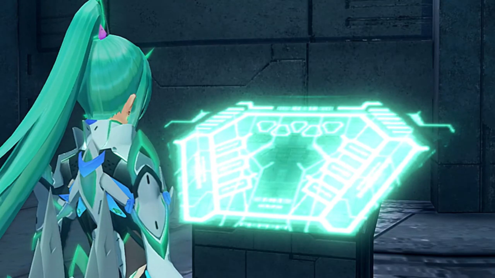
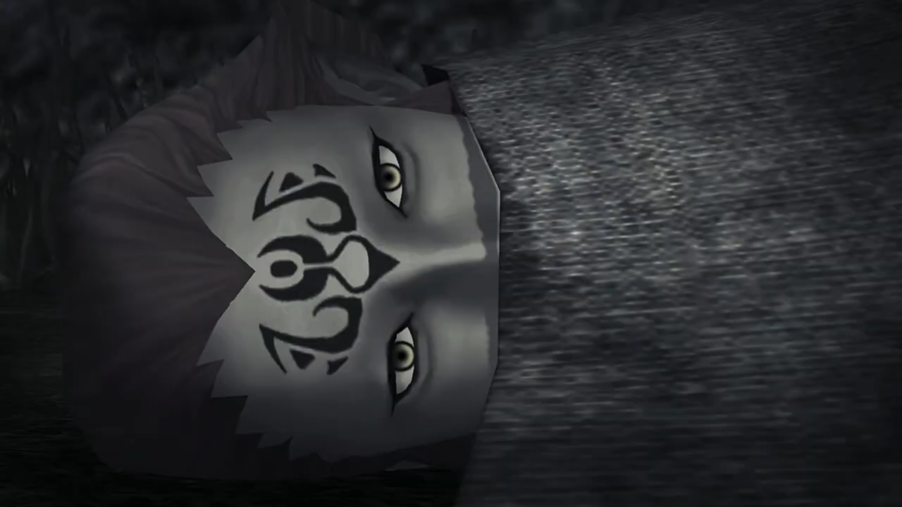
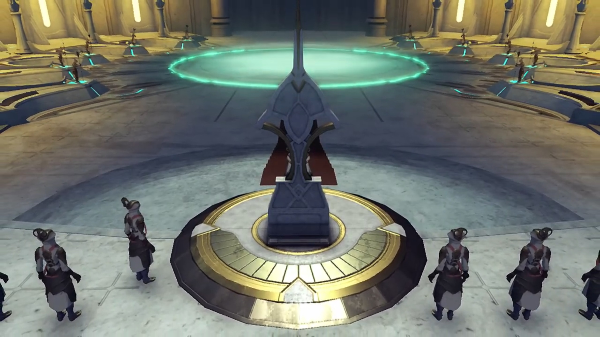
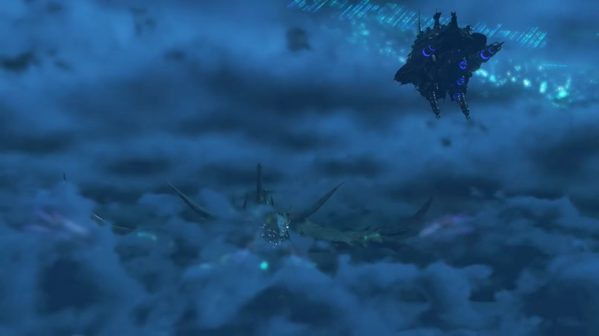
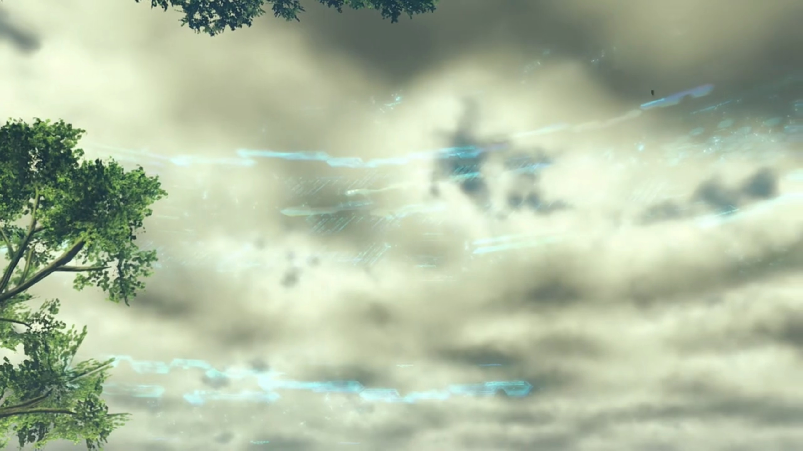
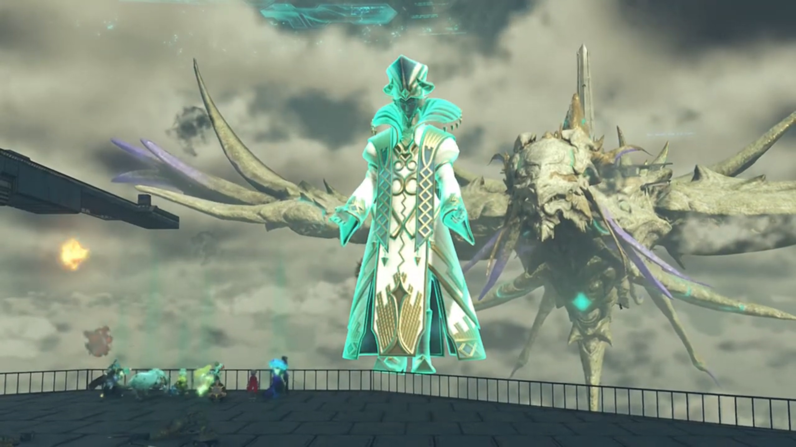
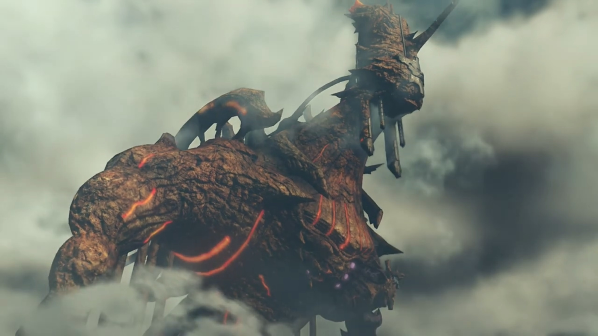

# Titan Death Throes, Ascending the World Tree, Amalthus

Mor Ardain. Niall was thinking through the various reports requiring his attention, weighing its pros and cons. The no. of reports had gotten more and more since the Titan was nearing its end, and his working time stretched ever longer hence. Now again, a captain entered the chamber, bowed, before reporting again, "Your Majesty! Yesterday, we sealed Section 47."

"I see. This is even faster than the surveys estimated."

"Furthermore, we've detected surges- of geothermal energy in the royal precincts."

He felt a sense of urgency. "So we can't hold out long. Even here."

"The ether flow is the lifeblood of the Titan. The temperature is increasing with its age. Perhaps, we should hasten moving the capital to Gormott."

"We've only **just** recalled the consul; and with **no good** explanation to the Gormotti, we _don't want to sow discord for no benefit._"

"It's just, I fear **time**- is running short..."

"Indeed. But not only for us. Gormott is fertile for now, but the harvests have been _declining for **years**._ It's like a cry issuing... up from the center of the world." He turned around. The top of the palace was equipped with windows, allowing the light to come in and him to look at the sky. Where he looked, the Titan's head, full of wrinkles, sleepily bowed, as if it's gonna go down very soon, difficultly maintaining itself from dozing off permanently. But something's not right here... He felt a clutch in his heart, but he don't know what causes it. 

"Your Majesty? What is it?"

"**Nothing...** Just- my imagination." Full of worries, he whispered within his heart, "_My sister... Where are you now?_"

---

The group gasped, reaching the bottom of the World Tree. They looked up, where there was an ever-shrinking hole bordering the tree's bark. Nia noted, "The Great Void, it's almost completely gone..."

Pyra wasn't surprised at all, "After all, the Great Void was Ophion's doing." 

Gramps: "Yes, indeed. So with Ophion gone, the Great Void could not support itself..."

Dromarch wished, "If only we were above the surface, we could easily cross."

Nia measured, "I mean, it doesn't look impossible to climb, but it's nastier than any mountain, that's for sure."{{footnote: Forget how you climb underwater without the necessary oxygen supply for nearly 30,000 peds.}}

She froze for a while as memories that're clearly not hers flashed through. As if she found something, she called out, "Everyone! _Here!_"

"Pyra?" Leading them through twists and turns, they arrived on a metallic path that led them to a giant platform at the end. Rex exclaimed, "The insides of the World Tree; I'd never have thought..."

Dromarch observed, "It seems to be an artificial tower- enveloped by- gargantuan plant life."

Pyra approached a turquoise-lighted giant hexagonal panel with unknown drawings on it. At the central top of the panel was 5 triangles, alternatingly straight and inverted. She transformed, hovered her palm over the panel, and via her thought, relay instructions that light the first of the 5. The door on top of the platform opened and revealed a cylindrical lift with a similar panel within it. 

Pneuma transformed back to Pyra and commented, "It seems like we can use this to travel up."

Rex was impressed, "Up? Pyra, what did you do?"

"Honestly, I-I'm not sure myself. It's like my body is- remembering something all by itself. It must be... another power- granted to the Master Blade by Father... **So!** We need to hurry!"

"Why?"

"**This was hardwired into my brain.** So, Malos must have the same thing."

"Not good."

Brighid observed, "Seems this is some kind of elevator."

Noticing the highly reflective walls, Zeke exclaimed, "That's some fancy glazing..."

Pandoria teased, "Ooooooo, you never were good with heights. Shut your eyes!"

"**Let's go!**" Pyra urged. 

---

Once again, Jin was put in the healing chamber, though, he seemed to have nightmares from his recent experiences. His body kept wriggling, trying to break open the restraint of the chamber. The lid automatically opened a few minutes later, after the healing process was done, and he woke up naturally, as if nothing happened, sit up, stood up, and walked towards Malos. 

"You can die when we're done." Malos assured. 

"We made it _this far_. I don't plan on giving up."

"_Damn._ If Judicium hadn't have gone down... we might have got you some _better treatment._"

"_Uh-huh_. When human cells are woven- into the body of a Blade, they awaken strange abilities. That's good enough for me. This'll do fine."

His eyes squinted, "_Even though she'd hate you for it, right?_"

"I know Lora- wouldn't have wanted this. Even so... (He turned to look at him) _I've got to keep my promise._"

He looked into his eyes, then closed his, "_All right. I'm with you... all the way._" Jin turned around, decided to have some time for himself when Malos warned from behind, "**Hey, Jin.** You better not get sentimental."

He tried explaining it away, "I found the ruins of Torna- down in Morytha..."

"_Oh?_" That was surprising. They didn't see it on their way to him. 

"There were half-rotted Blades there. Couldn't **grow** into Titans."

"They must've lived on- for a **while** down there." Malos concluded. 

Jin turned to look at Lora's husk, said, "A man once said, 'Live together with the humans.' Really, we were just living- **for** the humans. That was what the Architect... ordained- for us. And look what we became."

> Rotten half-blades. 

Malos wanted to confirm, "You're still sure- about what you **want**, right? That thing..."

"It's- a reminder. To remind me, what a **fool** I was, to ever have faith, in the Architect." Else, Lora wouldn't be frozen in a piece of ice. 

---

Metallic buildings lined the inner part, with bridges to cross. Dark inside, the dim ether rod-shaped light barely lit the surrounding other than serving the function of a lighthouse. Bridges connects the elevators together, and the bridges had no railings, though they were wide enough for 6 cars passing through side by side. This, is the interior of the **World Tree.**

---

Just outside the elevator, the group was waiting for Rex to continued the journey, but he was thinking hard, oblivious to realizing the group was waiting for him. It was Tora whom tried to catch his attention, "Ugh, Rex-Rex look- worried. Maybe... Rex-Rex lost wallet?"

"**It's not** that."

Without waiting for his explanation, he jumped to another conclusion, "Ohhhh, I see. **Well,** maybe your worry is your wallet's empty."

"Well, that's true. I don't work much these days." Coming to realization late, he poached on him, "**HEY!!! Why are you so interested in my finances all of a sudden?**" But at least that distracted him a little. 

Zeke wondered, "**What is up with you,** kid? **You've been a right gloomyguts lately.**"

"Mmm... (Then he confessed.) I was thinking about Amalthus. If what Jin said is true, the Praetor doesn't just hate Blades... but humans too. I mean, he basically hates the whole world, _it seems like._"

"How so?" Nia wanted to know. 

"In old Torna, humans lived together with Blades that eventually became Titans. So destroying Torna- was the same as destroying the Titans. **Amalthus must have known** that the Titans- have been **dying off over the last few centuries.**"

Tora concluded, "Cannot live without Titans! Everybody go bye-bye!"

Mòrag came up with a hypothesis, "Maybe- the Praetorium saw it as an obstacle to their power. If the Blades were becoming Titans and creating new land, people might have more **faith** in the Blades. If a new faith emerged, it would threaten the Praetorium and its dogma."

"I understand that much. That's just war and politics. _But..._"

"_Rex..._" Why does her Driver looked so sad? So... compassionate? 

"Hating people, hating yourself... where does it end? What do you do when you hate the whole world?"

"You mean..." Nia tried to simulate. 

He answered, "Destroy it. That's all that's left. **Tell me I'm wrong.**"

Brighid don't see any nonsense in it, "That's a leap of logic, but I think a lot of mortals are like that."

"Do you remember?" He tried to recall their memories. "Talking to the Praetor... I said it felt like **talking** to Malos."

Nia recalled, "Yeah, you did say that."

"It's a funny thing. Malos- and the Praetor, they want the same thing."

---

Amalthus thought deep standing in front of the chair in the audience chamber. 

> "Pant, pant, pant." Heavy rain, dark night. He dragged his feet along puddles and wet mud. His soak shirt weighted down on him, but it wasn't as heavy as the woman he supported over his shoulders. She was barely conscious. He looked around, trying to make out where to go, but amidst the darkness and the downpour he couldn't see anything. He could hear voices from behind, louder and louder, and he wished they were not.  "Ugh... Mother!"
> 
> "Ammy..." She pat on his shoulder, and he put her down. She brought her palm on his face, caressing. 
> 
> "What is it?"
> 
> How she wished her child weren't in this situation. How she wished she'd not brought her child with her. There are no future as long as she's here. But... "Leaving you- alone- in the world like this... I failed you as a mother." she cried. 
> 
> "Mom?" What are you saying? We can escape! 
> 
> "But..."
> 
> For a long time he waited, waited for her next sentence, but he heard nothing. Water dripped on his face, overflowed his eyes, yet his attention retained on her. Only the warmth in the hand still caressing his face told him she's still alive. "Mother..."
> 
> "**Forgive me!**" And both her hand and body collapsed under their own weight. 
> 
> He was stunned for a moment before crying out, "**WARRRRGGGGHHHHH!!! Orggh!** Urggghhh..." It was unknown what happened to him thereafter. 
> 
> From behind them, one of the pursuers asked, "**Where's she gone?**"
> 
> Only the cry of Amalthus remained, "**Stoooooooppp!!! STOOOOOOOOPPPPP!!!**"
> 
> "**Here! She went this way!!**" The cry served as a beacon. 
> 
> "**Mother! Mother!!!**"
> 
> ---
> 
> The rain cleared long before the sky brightens. Crickets that stayed up all night had earlier fled the rain, resumed their mating rituals even before the rain had stopped. The young Amalthus, soggy and tired, wandered around aimlessly until he found the campfire. He followed the light and arrived, finding empty plates left around the place. He eyed across until he found the corpse with a phoenix symbol on her head, covered from below the mouth, her eyes wide opened, wrapped around and thrown like a rubbish bag. 
> 
> 
> 
> "Mother..." 
> 
> He covered his mouth to snuffed his scream, puffing out hot air from between his fingers, dropped to the floor quietly, refrained from attract the attention of the pursuers. After a while, he calmed himself, walked over to her, and slowly and gently put his hand over her forehead and wiped it down, closing her eyes. 
> 
> He then stood up, picked a rock, and slowly and quietly, walked over to the sleeping pursuer and smashed hard onto his head. Poor guy, he felt a sharp pain and dizziness in his head, repeated blows on his forehead, went unconscious before having a chance to open his eyes, and joined Amalthus's mum forever. 

In the Praetorium, soldiers stood at the tip of the platform, sticking their staff into the receiving ends, drawing their ether into the middle, and created a large ring of green. 

The soldier standing beside the Praetor believed the time was ripe, reported, "Your Eminence! We'll be exiting the Cloud Sea shortly!"

He opened his eyes and looked to the ceiling. 

---

Marsanes, Tornan Warship, parked close to the World Tree bark. Patroka and Akhos were at the bridge, monitoring the panels, and without any anomaly, something hit hard on the ship, and bleeping sound came online. Patroka shouted, looking to Akhos, "**WHAT?!!!**"

Akhos held on to the bridge, rebalanced himself while his eyes fixated on the screen. "**Below! A dark mass in the Cloud Sea!** _It's..._"

From below the Cloud Sea, the Titan revealed itself, losing its invisibility status floating up. The Marsanes was puny compared to the Titan. 

Akhos finished, "It's **INDOL!!!** What?!!!"

The 6 cannons, 3 on each sides, prepared itself ever since it surfaced. It didn't wait for the Torna's terrorists to realize what happened when it fired, blasting its hull, bursting it in flames. From the city, thousands of smaller dragon-like Titans, each with a Praetorium soldier standing on top of its head, took off and swarmed to the Marsanes. By the time the Akhos and Patroka recovered, the dragons were already circling it, spitting fire with every pass. 

The bleeping sound didn't immediately get them on their feet. Akhos gritted his teeth, holding on to the panel for support, "_They... took up by surprise!_ Patroka! Prepare the defenses! I'll analyze the threat!" He swiftly turned his attention to the panels, punching among the keyboards. 

"**I'm on it! You need to counterattack, damn it! Stop trying to give orders and get to it!**"

"**UGH!!!**"

"**URGHHH!!! Where's Mikhail? What a time to let us down!!!**" She temporarily stopped meddling the panel and turned to Akhos. 

He didn't raised a finger, replying, "Mikhail's down below."

"**Below?!!! But...**" 

Akhos meanwhile moved on to the next panel, "**GOT IT!!!** _A bypass to the cannons!_" Looking through the screen that displayed the Indol Titan, he grinned, pushed up his glasses, and smirked, "Watch this, scum!"

The Marsanes was not without auto-defense mechanism, but when there are too many flies, it's no use for a single electric swatter. And it's worse when those that dropped were replaced by backups, maximizing the attack surface area. 

Meanwhile, at the bottom of the deck, the door opened and Jin and Malos walked into the room of Lora, oblivious to the shaking of the vehicle. Jin asked Mikhail, "Ready?"

"Ready." The screen in front displayed thousands of artificial Blades lining up in perfect rows and columns, like soldiers. There was a control panel down there, Mikhail laid his hand on it. He briefed Jin, "The ship'll get you as far as the boundary layer. We can drop you and Malos off there. We'll have to. Alrest ships can't make it past the boundary layer." 

"Yeah, no sweat."

Mikhail took his hands off the control panel, walked a few steps towards "Jin. You are OK with this, right?" He needed to know. He needed confirmation. 

Standing beside Lora, he said softly, "Mikhail..."

His eyebrows raised, "Mm?"

"Take- care... of Lora." And he turned around and leave. Malos followed thereafter. 

"Jin?"

Entering the control room, Jin ordered while taking the main control, "Akhos. Fire up the Blade Bots. Time to strike."

"**Jin! Malos!**" Immediately the morale shot up. 

"Indol... They got here sooner than we thought." Another 6-beam cannons fired at the hull while they were conversing. 

Malos: "They gave up on the boy pretty quick. _No surprise..._"

Patroka reported, "Hatch open. Ready to launch!" And she looked towards them. 

Jin gave the order, "OK! Launch!"

Artificial Blades a few times more than the small dragons's numbers swarmed from their nest, each aimed for their respective small dragon, working in groups, bringing them down one by one. 

---

Meanwhile, on the other side, the group scanned the surrounding. Tall metal pillars that stretched the ceiling a hundred meters, the room devoid of items except those carved deep into the walls. Nothing much to see, yet Zeke was impressed nevertheless,  "Well, no way I'd ever have guessed the World Tree was like this on the inside."

Dromarch observed, "It definitely appears to be man-made. Created by the same civilization as Morytha..."

Rex recalled, "The birthplace of the Architect. That's what Jin called it."

Zeke hypothesized, "Then, maybe the Architect built this thing. Do you really think we're going to find him at the top? And Elysium too? From what we saw in Morytha, it seemed like all that stuff happened a **gazillion** years ago. Or maybe **two** gazillion, _I don't know._ Not even Titans _live that long._"

"Even Pyra and Mythra have never actually met him. _But this tower's right here. It's real! So..._" And most surprisingly, it's still working! Where all the wear and tear? 

Mòrag concluded, "'Seeing is believing', is the phrase, hm? We'll just have to find out for ourselves! There's no use speculating."

Nothing particular happened, but Tora asked, "Nia, what's wrong? Is tummy started rumbling?"

"**Oh, for the... Every time with you** it's- **'have you lost your wallet?' or 'are you- hungry?' is that really all you can think of?**"

"_Mehhhhhh..._" He dropped his head. Unfortunately, yes, he thought for himself. He confessed, "Wh-wha-what T-Tora thought food is only thing that makes Nia all... um... growly-growly..."

"Watch it, furball..."

Poppi was more direct and useful. **_Rather than trying to guess, she asked,_** "What is Nia's problem?"

"That's not a nice way to ask, Poppi.{{footnote: Actually, she's wrong. That's the **_correct_** way to ask, and it's what you would want to do in real life. Indeed, it's much much better than trying to guess it, or trying to ask indirectly, because people may not understand what're trying to know.}} But I'll let it slide. There's something I want to ask you Blades. Tell the truth, have you ever wanted to extend your life?"

She eyed them one by one, and Brighid clarified, "Avoid returning to our cores?"

"Yeah."

"That's a tough question. I would like to keep learning about my former selves, but to keep living after Mòrag is dead..." She turned to look at her, apologized, "Oh, I'm sorry..."{{footnote: Déjà vu... When's the last time _someone_ don't want to be a Blade Eater and apologized to her?}}

"No, I understand."

"(sigh). The idea of living on without her does **not** appeal to me."

"Yeah, same here." Pandoria agreed. "I want my memories of the Prince to be- just between us."

"You're **going** to **make me blush**, Pandy!"

"Dromarch?" Nia turned to. 

"As long as I'm by my lady's side till the end, _then I'm satisfied._"

"Poppi is **artificial** Blade. So it is **very sad** for me to think about. When Masterpon is gone, _Poppi will be widow._"

"_Mehhhhhh..._"

Nia was surprised, "Well, not quite (a widow). But I get where you're coming from. Pyra?"

She dropped her head, "_Well, I-I..._"

Rex stepped in, noted, "It's **different** for you, **right**? You've been alive for a few centuries..."

Nia: "Did I ask you? Pyra, what do you think about it,... really?"

"**Hey...**" Everyone ignored his cries. 

Pyra started, "Sometimes, I wondered **why** I have to keep on- living forever. Just on and on, no end in sight... But... (she tilted her head and looked at them) It's different now. I'm **glad** I've- stayed alive all this time. _Parting is always sad_,... but it's just part of the deal of being me... _Though, maybe..._ Maybe one day I'd be happy to close my eyes forever... _with someone special... there... by my side._"

"_Pyra..._" Heartwarming. 

Nia: "That's our Pyra. Thanks, guys. Thanks- for sharing with me."

"So... what made you ask?"

"I'm a Flesh Eater. So... _I don't know_ how long I'll live for. I mean, for all I know, I might just snuff it tomorrow!"

"My lady..."

"But I can say this much. **My life and death- isn't tied** to any human."

"And?"

"It's Jin. I've been wondering. Jin was collecting Core Crystals. But why didn't he use them? _Doesn't he hate humans?_ He could use them to create Blades, **then turn them into Flesh Eaters. He could expand** Torna with no need for humans in the mix."

Brighid noted, "They do lack numbers. Is that all of them?"

"Yeah. It's just the five of 'em. That's it. When Malos suggested getting Obrona and Akhos to resonate, Jin- was dead against it. So I think may-be... Maybe- Jin feels the same way as us..."

"The same way as us?" wondered Pyra.

She thought for a while how to explain it accurately, "I think maybe- that's why he won't resonate with anyone."

---

The group was walking through the tunnels when "**BOOM**!!!" The ground started shaking. 

"An explosion?" Rex and the group searched for its source. Nia jumped on her feet. 

Mòrag suggested, "A battle, perhaps?" 

Up ahead was just the exit of the tunnel. They quickly reached it, standing on some balcony attached along the circumference of the trunk. The group tried to find its source, though Rex's mind wandered and exclaimed, "So, this is what the World Tree's really like..."

Nia observed the words floating a fixed distance away from the trunk's circumference, blue paintings that can't be recognized what they're for. "These... They aren't leaves... They're glyphs?"

Tora and Poppi was focusing on the their 2 o'clock, shouted out, "**HEY, LOOK!!!**"

Gramps noted, "An old Tornan warship... Didn't think there'd be any of those left." Every time a projectile hit an artificial blade or the dragons, a plethora of minor explosions decorated the air like fireworks. The Tornan warship continued to exchange shots with Indol. 

Nia: "Never mind that! What's this? I had no idea Indol could make it up this high."

Peered down, Tora noted, "Cloud Sea **loooooooong way down!**"

Gramps noted, "It appears that Indol- has modified their Titan- as old Temperantia did with theirs. But that much firepower... I did not know Indol possessed so much force."

Brighid: "No need to ask- what they plannnnn to do with it."

Mòrag found the cause compelling, "They anticipated it. That Jin- and Malos would try to ascend."

Everyone else turned to her, Rex asking, "**So, Jin is inside that thing?**"

"Yes. No doubt."

He urged, "**Let's hurry! We can't let them make it- to Elysium!**" They took a final look at the battlefield before continuing their path. 

---

Yet another round of cannons exchanged. This time, though, Indol suffered some damage, the Titan tilted to one side a little. The screen inside the audience chamber connected to a fixed camera outside also tilted its view. Amalthus sat on his seat, oblivious to what's happening in the moment. With his eyes closed, his mind wandered yet again. 

> Battleships, hundreds of them, were marching along the plains; they just need to descend their current hill and climbed back up another and they'll arrive at Amalthus and Malos, their target. Malos didn't plan on letting them get any closer, drawing out his Monado and pointed at them, creating a field of destruction that engulfed every single one of them. Amalthus had to shield his eyes from the sand brought along with the strong shockwaves; even if they hurt, he tried looking over his arms for the end result. His smirk grew into a grin, his goal achieved. Yes, this is the power he wanted, always. The power to eradicate humanity! They deserve such punishment. Not long now, mum. They will soon be there with you, all of them! 
> 
> The field of destruction, however, never stopped growing. Malos turned to look at Amalthus; perhaps he sensed it, perhaps he don't want to show it to him, or perhaps for other reasons we don't know, his extreme pleasure transformed into extreme shock before becoming devoid of all emotions. 
> 
> ---
> 
> Back within his room, there was still another crystal put on the table. Amalthus eyes fixated on it. He already had this power, and no matter how kind you are, how compassionate you are, the moment you're infested by the plague of power, your greed for more power can't help but grow. It's true for everyone, and Amalthus is no different. Without realizing, his hands slowly reached for it, charmed by the shining edge. 
> 
> All was stopped when Malos's voice sounded from behind, "You know you can't control it." He mechanically turned his body round and found the source of his current power, his back laid on the wall, arms crossed. As if to focus, Malos stood straight, back away from the wall, continued, "I hear you've been **promoted**... by the Praetor."
> 
> "You! Why?"
> 
> "Hmph! Just thought I'd come and say **goodbye**! Would you rather I leave without saying anything?"
> 
> "'Goodbye'?! What would compel you to leave me? **You** are my..."
> 
> He cut him off, "**I've** got- full control of all my powers now. It doesn't matter if you die. _I can keep on going._"
> 
> "**W-What... are you saying,** Malos?"
> 
> "The Praetorium, the **believers**? _I despise them **all**._ Humans- aren't fit to breathe our air. So, I'm going to give you what you **always** wanted."
> 
> "**But**- I never..."
> 
> Malos declared, "I'm clearing out the worthless! Isn't that why you sought the Architect? Why you climbed the World Tree? Yet, look at you now."
> 
> "Ohng..."
> 
> They looked into each other eyes for a full minute without saying a word. Amalthus's eyes aimed for the ground first. By the time he raised his head again, Malos was nowhere to be seen. His mind returned back to the crystal on the table, thinking for himself, trying to convince himself, "There must be _someone out there_ who can use this core... I'll send them after Malos."

The screen changed target from the Marsanes to Rex and the others. Amalthus opened his eyes, his grin grew slowly by slowly until it stretched to its max, his eyes focused strongly on them. Just as he'd been predicting. All is well, his plan were well executed. Not long now, mum. Not long now, O Architect. We'll soon be together. Only we. 

---

===

"Indoline warrior monks?!" Accompanied the few Indol 'soldiers' was one of the small dragon Titan. Rex and his group couldn't proceed without negotiations first. 

One of the warrior monk stepped up and instructed, "To the Aegis and her Driver. We're here to pass on an order- from His Eminence. You are to use the **Aegis's power**- to bring down that ship!"

"Huh?"

The monk eyes squinted. Damn these guys, don't you even know the quality of being a soldier? **Obey, not question!** "What's wrong? This is your duty, pilgrim!"

Rex rejected, "**My only duty**- is to open the way to the World Tree!"

"You **cannot** do it? **If so**, then we must take the Aegis- into custody."

Gramps climbed out of his helmet, "I-I get it now. They just wanted to use Mythra's power to burn up **their** little problem. Nothing new under the sun..."

Rex tried to negotiate, "**I didn't say we couldn't do it. But we have to stop Jin. Tell your boss- that's what we're doing. OK?**"

"We don't negotiate holy decrees. If you don't comply, **then prepare for righteous chastisement!**" And the battle began. 

---

The battle didn't last long, when they jumped on the dragon Titan and swerved under gravity's pull. Rex peered over his shoulders and saw the injured soldiers huddled together, licking each other's wounds. "They're gonna tell the Praetor, that we're..."

The Praetor don't need them to tell him what'd happened. A green tornado formed on the back of Indol, within its circumference the whole Praetorium and its secondary town/refugee camps. The surface of the tornado looked like bubble, with liquid (ether) flowing within, swirling up. 

Far away, Brighid's core suddenly brightened, and "Ugh?" she felt her energy sapped away so fast she felt like she couldn't stand. 

Mòrag: "**Brighid?!**"

"**Ah!**" "**Argh!**" 

"**Mythra!**"

"**Dromarch!**" Nia called out, then she felt it herself, "**Gah!**" Rex went up to support Mythra, Zeke Pandoria, Mòrag Brighid. 

Even when he resisted, and almost losing his ability of speech, Dromarch wondered, "W-what on...? S-something... someone...!" 

Then Gramps started feeling it too; it's all too familiar. Trying to raise his eyelids, "Th-this effect... Can it be...?" 

The tornado on the Praetorium were gone, and the Praetor's giant hologram appeared just outside the railings of the balcony, started politely, "Please forgive my interference, time runs short."

"A-Amalthus?!" Rex exclaimed. 

On top of his hologram's forehead, an inverted triangle Core Crystal revealed itself. Mythra knew it, "_Huh_. That's- Haze's Core Crystal!"

Nia: "Fan la Norne's?!" She finally joined the dots, after missing it once when Zeke revealed himself a Blade eater. "_Oh, that's it all right! The other half...!_"

"What is it, Nia?!" Rex didn't know about it. 

"A-Amalthus... **He took Fan la Norne's** Core Crystal! He's using... her power! **GRHHHH!!!**" 

Amalthus silenced her by increasing its nullifying effect on her, finishing her sentence, "Not only that. This is in fact my original, primal power."

"**Mythra!**" Rex noticed the bright light started shining on her forehead's crystal, which she resisted to no avail. 

"**Th-the Artifice! N-no! S-stop!**" But even she couldn't resist Amalthus's control. Emitting a single-pulsed bright light, the light on her head dimmed, and she collapsed. 

"**Mythra! MYTHRA!!!**"

Amalthus's grin displayed wide. From space, a particle beam aimed straight at the Marsanes. 

"Agh!" "**URGH!!!**" Akhos fell to the floor, Patroka gripped tightly on the bridge.

"Is that- the Artifice? Is it- the Aegis?" Akhos wondered. 

Malos, still in the room, stood straight up slowly, replied, "_Heh. No._"

Patroka don't understand, "Butttttt, who?"

"Amalthus."

"Amalthus?" How the heck did he control the Artifice? 

"He's my Driver, and I'm- an Aegis. If that energy gets **any stronger**, he won't just control the Blades, but Mythra too."

"Agh!" Akhos felt a difficult enemy stood before them. 

Malos punched his right fist to his left palm, like the Chinese welcoming stance before two Kung Fu fighters began their fight (and after), exclaimed with distorted respect for his Driver, "Amalthus, you never disappoint!"

Back at the platform, Amalthus's hologram explained, "I am the Driver of the Master Blade. **Bow**- before me, the Master Driver. **I possess the power TO COMMAND ALL BLADES!!!** Every Blade alive... **Indeed, even the very TITANS are under my control.**" His hologram then peered behind and looked at Marsanes.

Patroka saw such scene, explained the cause and effect, "That must be how he repelled the attack. (Looking to Malos) Sooner or later, he'll control us too."{{footnote: And that's why they don't use a Titan ship, but a mechanical one.}} 

"Don't worry." Malos reassured. "Half-breeds like you _won't come under his control._ **Sure,** he can dampen your power. But **that's why we built those things.**" And he changed the screen to display the various artificial Blades, still aiming at the dragons despite the newly introduced variable. More and more dragons were felled, despite suffering casualty themselves, but the numbers were for them. "Mikhail's creations will **not submit** to Amalthus's control."

"And neither will this bucket of bolts!" Mikhail connected to the small terminal in front of Jin, and voiced through the speaker to all in the cockpit. "We're nearly at the boundary layer. **Jin! Malos! Get ready!**"

"Roger!" Jin released the main control panel and walked towards the hatch, instructed, "**Malos, let's move!**"

"**Yeah!**" Before exiting the hatch, Malos called out, "**Mikhail! Akhos! Patroka!** It's up to you now!"

Akhos: "Sure!"

Patroka: "Yeah, we get it."

Mikhail had a message for Malos, "Hey, when you see our daddy dear, tell him- 'Thanks for everything'- from **me.**"

Malos winked and grinned back at him before leaving. 

---

Despite the incoming attacks, Marsanes managed to dock close to the World Tree, somewhat above the platform the group were at. Most of the Blades regained control of their body. "Rex-Rex! The Torna ship stopped moving!"

Zeke: "Looks to **me** like they're gonna try and get inside!"

Despite what he'd done to them, Rex turned to his hologram and shouted,  "**Amalthus! We're going to stop Jin! But you've got to stop this!**"

"You're speaking nonsense, boy. (He turned to look at the ship) **Now**, is the hour of their doom! You leave me no choice- but to perform your duty for you."

"**Destroying Jin and Torna?!!** We're only trying to stop them! **Not kill them!**"

"You believe you can sway them with words of reason?"

Without a moment hesitation, "**Well yes! Jin told me** what happened, what happened 500 years ago. And **you** were the **cause of it, weren't you, _Praetor?_**"

He pointed his sword at his hologram, Amalthus didn't even blush, explained it away, "I- was nothing but the mouthpiece of the Architect."

"**When I meet him,** I'll ask him myself! About me, about Pyra and Mythra!"

Meet the Architect? What are you saying? O Architect, these wretched vermin were to taint your holyness, give me the power to eradicate them! "**THAT IS NOT YOUR RIGHT!!! IT IS MINE!!!**" Once more, he max out the power to control Mythra to summon the Artifice. The particle beam struck down, but missed the Marsanes. "**Hngh! YOU RESIST?!!!**" How dare you resist the holy decree of the Architect, voiced through me? "**AGAIN?!!! YOU DEFY ME AGAIN?!!!**"

"Amalthus! You **won't get** what you want!" He tried again to control her, and she painfully suppressed it, stronger and stronger, "_I... I'm... Rex's Blade!_"

Gramps was reminded. "Th-that's right! Rex! You're the Aegis's Driver! There's nothing he can do- that you can't!"

Rex looked at both his palms, wondered, "Does that mean?"

"Rex, it's true!" Nia reassured. "Power- depends on the heart of its wielder. Right?" 

He turned to Mythra, and she nodded back to him. "**GYAAAAAHHHHHH!!!**" He don't know what exactly to do, but his heart asked him to drew out his sword and aimed it at the sky, which he did, and a particle pillar shot up around them. 

A cross-shaped giant crystal{{footnote: the Conduit, one'll explain later.}} in space shone bright yellow, responding to his powers, and grew the particle pillar and engulfed Amalthus's hologram. Inside the Praetorium, electric leaked from the screen, the sign of energy leaking in from another Master Driver. "Urgh!" Amalthus shielded his face from an incoming bolt that died down before reaching him. 

Mythra finally could breathe well. She tried, "I can... move... **Rex!**" The power dimmed, and she saw Rex was panting heavily, clutching onto his ankle; she quickly went up to him, supporting him. 

He took a short while to recover, "**I'm OK!** I... I won't let him get away with this any more. He's just- *manipulating humans and Blades alike. That's not the Architect's will at all!* **Give it up, Amalthus!**" He called out, knowing his voice could be heard. The green tornado was once again summoned, but there was no hologram teleported anymore. "**You can leave Jin and the rest to us!**" Without waiting for his reply, they dashed for the stairs. They were already lagging behind; they had to hurry. 

---

"Where are they?" Patroka asked. 

Akhos replied, "The tree. Soon- Malos will activate Aion. If we can hold this position- and prevent the scum from ascending, then victory is ours."

"**OK, then. We've got to go ALLLLL OUT!**"

Ever since the tide turned in their favor, the dragon-riding warrior had been decreasing at an exponential rate; and finally, none of them were left standing. The artificial Blades turned their attention to the Indol Titan, the tide had turned. Some attack landed on a tall tower and fell it. The tornado only acts as an amplifier, but it had no defense capabilities. 

Meanwhile, the group were getting nearer and nearer to their destination. Rex noted the green tornado vibrate a little, as if to break down, but immediately regained stability again, "**The vortex!**"

Inside the audience chamber, one of the warrior monk asked, "Your Eminence! The tower!"

"At peace, Brother. The field of effect is only a little reduced. (Then he sensed something) _Hmmm_. It is drawing near..." He grinned; even though _someone_ was outside his control, his plan didn't deviate much yet. He ordered, "Gather the Brothers together! **We must EXTERMINATE the vermin!**"

Amalthus turned the screen onto the group working their way to the top of the World Tree, clenching his fist, swore that "No soul alive- may **SULLY- the Architect's presence!**" 

Once more, he used the power of Fan's Core Crystal. Below the Cloud Sea, an object surfaced, wholly wrinkled and fiery, its skin scorched and dry, nearing its end of life. The Mor Ardain Titan! 

The humanoid form Titan, its lower half immersed below the clouds, started walking slowly, its feet cutting through the Cloud Sea. The core crystal on its chest shone bright, and the cannons beside its core crystal prepared itself, aiming for the trunk of the World Tree. 

### Footnotes: