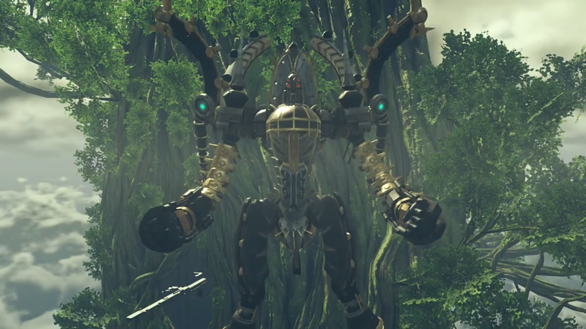

# Amalthus's Desperation

> The young Amalthus put his hands on his chest and bowed before the various soldier husks that littered the battlefield. He turned around and arrived some time later at a campsite. Adults were chatting. Children were playing; two of them, seeing him, stopped playing and bowed to him seriously, which he returned, seeing them off to resume play. 
> 
> Their temporary shelter were short-lasting; in no time, they migrate once again, forming a long line, walking 'tirelessly' through a barren land devoid of grass, decorated with few dead trees. Occasionally, they settled down for the night, setting up camps. Every night, people gathered around the campfire, listening to the morale-heightening speech of Amalthus. Food was scarce, but they had barely enough to go around. 
> 
> When he had nothing else to do, Amalthus doctored the patients. Once, he helped a man with the bandage around his cranium. After making sure it's tightened and carefully treated, the injured looked at him in the eyes, thanked him, and he returned a nod. His eyes turned around to the World Tree, blurred in the distance, wondered if He is watching them suffer. 
> 
> Alone, Amalthus hiked uphill through thick dense vegetation area. Atop, he found straw houses in dilapidated state. Possibly abandoned, though some houses were still in good form, at least, livable. No sight of any inhabitants strolling outside. 
> 
> Inside one of the houses, a baby was wailing amidst glass smashing in the background. The adult searched the crate, throwing away things he don't need, oblivious to the cry. The door opened and light shone it, but he was too focused he didn't realize that Amalthus had entered the room. Digging deeper and deeper, he finally found what he needed -- a knife. Leaving the materials to their being, he strengthened his grip on the hilt, walked slowly over to the baby. Still crying, the baby would never know what fate had awaited him/her. The adult reached the baby, opened his eyes wide, and jabbed hard; the knife never came in contact with the baby -- Amalthus hand gripped on his wrist hard, giving the adult an indifferent look. 
> 
> The adult turned around to look who was stopping him; Amalthus recognized he was the soldier he'd treated earlier, the bandage still wrapped around his cranium. Amalthus's grip was strong; there's no way he could let it slip. After a shrieking painful (adult) cry, the baby stopped crying. 
> 
> Amalthus, carrying the baby with one hand, walked out of the house towards the edge of the cliff. He looked into his/her eyes, than turned his attention to the everlasting World Tree that loomed high and blurred in the distance. The baby was about to start crying again, and Amalthus put one index finger over his mouth, and the baby seemed to understand, muffed his cry, letting out snorts that (s)he cannot snuffed out by sheer will. He removed the index finger from his mouth and put his palm over the baby's face, covering it, while his solemn eyes turned to the World Tree. 
> 
> "O Architect! Is this the world that you intended?"

---

The beam left a hole in the World Tree. The group stopped moving. Tora, his hearts racing, exclaimed with relief, "**That too close, meeeeeh! If we just a bit higher, it would have hit us!**"

"Where did..." Rex eyes wandered until he saw the new Titan that emerged 'out of nowhere', its chest as tall as their current position. 

Mòrag couldn't believe it, "Mor Ardain?! **Impossible!**"

---

The capital city of Mor Ardain was shaking, the pipes bellowing steam. Its streets had been emptied of inhabitants, taking shelter in their sturdy earthquake-safe houses. In the palace, a soldier worryingly asked, "**Your Majesty! Are you hurt?!**"

"What happened?"

"**The Titan**- just released- a vast amount of energy from its **chest**! We think the brownout may be linked to that." Niall dropped his head, perhaps thinking about what to do next, or perhaps trying to absorb the new information. So he had been right; he was not imagining things earlier. At this point of the year, the sky don't look right, the World Tree's position wasn't where it was. While he was thinking, a low-ranking soldier rushed in and reported to the captain, whispering into his ears. Once finished, the captain relayed the compressed information to Niall, "Majesty! We **strayed** off course- but we've managed to **confirm our current position!**"

"Where are we?" He nervously asked. 

"**Look!**" Niall turned his head along the parallels where the captain pointed at. The World Tree loomed huge and tall; he shockingly took a step back. 

"_T-that's..._" Just then, the Mor Ardain Titan raised its head, looking at the World Tree. "Again? _Curses_. Mor Ardain can't afford to lose more energy!"

---

"It's glowing..." Rex watched the cannons on the titan's chest. 

Gramps climbed out of the helmet, wondered, "Is it going to shoot again? That is not good! The Ardainian Titan is said to be at the end of its lifespan. If it were to release any more of the ether energy stored within its body..."

"What would happen?" Nia interrupted. 

Gramps didn't let her wait long, "It would collapse. Its joints giving way under its own weight." And with it, taking with it the City, plunging into the depth of the Cloud Sea. 

Not like anyone except Amalthus could stop it. A second beam was fired at the World Tree in a larger range. Flames raged and smoke bellowed as leaves and wood burnt. The Marsanes, parked nearby, shook with the shockwaves. Energy leaked into the bridge, electrically shocking Akhos and Patroka's hand. Automatically, the giant screen focused on the source of the attack, but the screen whiteout temporarily during the leakage.

Akhos: "**Urgh!** Now he summons even **Titans?!**"

"**Akhos, over there!**" The screen changed target to a patch of Cloud Sea, where there was a jutted out from between the clouds. As it emerged, tons after tons of water displaced the empty space it left, smashing against each other, creating mist. The mist wasn't thick enough to prevent them from distinguishing the Titan that raised its head high above sea level. 

"What?! Uraya?! **CURSE THAT** Amalthus. **Is every Titan under his control?!**"

---

The floor was shaking. The Queen, accompanied by her sidekicks and some soldiers, were standing just outside the entrance to her palace, watching the outer world through the translucent membranes. One of the soldier asked, "My Queen! Is **that**-?!"

"The World Tree... Mor Ardain, Indol... What the blazes is going on out there?"

---

The Uraya launched various targeting beams from its myriad eyes at the World Tree, blasting a huge portion of its trunk, this time targeting the group, giving up accuracy for quantity. "**AAARRRGGGHHHH!!!**"

Their location was shrouded by black smoke; the balcony collapsed. 

"**Pandy!!!**" Zeke reached out to her while holding onto the edge with another.

---

Akhos had his hands back on the controls, Patroka too, he exclaimed, "This is **madness**! Does he mean to gather all the Titans in **one place?**"

"Akhos! Patroka!"

"Mik?!" The giant panel changed to show his face; still controlling from the chamber below. 

"Go! Go keep Jin and Malos safe!"

"What- is- **this**- all of a sudden?" Akhos asked. 

"We must be ready for the worst."

Patroka: "**But- what about Indol?! They're gathering Titans from-**" She stamped her feet. 

"I'll deal with it."

Akhos can't believe what he'd just heard, "**DEAL with it? Alone? Don't be a fool!**"

"It's fine. I put this all together in the first place, remember? I can control everything from here. _Besides..._" He peered over his shoulder; she was there, Jin had asked him to take care of her. "I'm not exactly _alone here._"

"_Mik..._" Patroka was perplexed, and she felt something off, but she can't tell what it was. 

"_Go. And do what I can't_." His eyes unwavering, his voice stern. 

It took Akhos 5 seconds to abide, "**OK... Patroka!**"

"Urrrrgh...." Together, they went for the hatch. 

"**Patroka!**" She turned around and looked at him, wondering what he had to say. "**I love you!**"

She froze for half a second before stomping on her feet, "**You are so gross, Mik! Make sure you come back alive- s-so I can punch you for saying that!**"

After she left, he rubbed his chin with his hand, "That's... _a deal._" He hoped. Then, he turned his attention back to the task at hand, putting his hand on the control panel, and activated the final mode of the Marsanes; its joints started detracting, transforming into a humanoid form.{{footnote: The transformed Marsanes looked like a 'faced Mechon' from XC1.}}

The transformation didn't escape the group's attention, Rex exclaimed, "**Their ship, it's...!**"

Gramps noted, "That shape... It is **just** like a Titan."

With Lora behind him, and Indol in front of him, he snapped, "**You old fool! Here I come!**" He powered up the several boosters attached to the back and below the legs of Marsanes, accelerating towards Indol. While transiting, it clenched its right fist slowly, rotating its body to bring the fist back once it got near the Titan, swung around and aimed for its face, hit it hard in its eyes. Injured, the Titan bellowed while Marsanes took the chance to back away a short distance. 

Zeke announced, "_So- it begins._ **Now's the time! Let's get after Jin!**"

Rex: "**But, the Titans...**"

Mòrag calmly redirected his attention, "Rex, let's focus on what we can do right now."

"Mòrag..."

"Don't worry. The Emperor's _my brother, after all._" And she trusted him. 

"I'm on it."

---

A beam shot straight from Mor Ardain's chest at Marsanes, the latter raised an ether shield on its palm and caught it, firing its boosters to resist Newton's Third Law. "**YARGHHH!!! I've HAD IT!!! You're done!!**" He aimed Marsanes's cannon at it, firing a beam that sliced the Titan starting from its waist and ended on its shoulders. The perplexed Titan temporarily regained control of itself, perplexed as to why it was raging in flames, before its remaining leg break under its own weight. 

---

"**Your Majesty!**" The ground shook. 

When everyone panicked, he remained calm, emanating confidence, "I'm OK. Issue the evacuation order across the capital. All army vessels can be used, including my private ones. **Save as many** as possible!"

"You first, sire!" The captain insisted. 

"**Don't mind me! Hurry, now!** Mor Ardain **cannot hold**, unfortunate though it may be..."

"Majesty..."

"**Go!!!**"

"**Sir!**" The captain and soldier quickly bowed to Niall before running out of the room. 

Niall's eyes turned to the World Tree, his body trembled slightly, with teary eyes, pleaded, "Dear sister, _if you're there, please. Please. Save Mor Ardain and the world..._"

---

"Your Eminence, the foes have been sighted."

"The lost technology of old Torna? How astounding it is that it still works..."

Mikhail established communication with Amalthus, "Surprised, eh? There are still a few of us hanging on."

"A survivor. Flesh Eater. You followed him down that daaaark path."

He flipped his hair, "Hah!"

"In that case... " Amalthus knew exactly what to do, activating Fan's Core Crystal to the max. The green tornado outside the Praetorium emanated a shockwave that brushed through Marsanes. His eyes fixated on the screen, resisting the urge to blink, just to see how his opponent would knell before him. But when he don't, "Hm?"

Mikhail wasn't affected a single bit, "Oh, nice try! But that's not gonna work on me! (Handsomely flipped his head back) And that's because... **you and I**- are the same!"

"**WHAT?!!!**"

"I am... **a Blade Eater!**"

"**IMPOSSIBLE!!! The Blade Eater technology- is not known outside the Praetorium!**"

"You're right. **But that doesn't mean you're the _only_ one. Or have you FORGOTTEN WHAT YOU DID BEFORE implanting _your_ Core Crystal?!**"

"_Hmph._"

> Outside the room with the Praetorium symbol carved on the wall was another cylindrical chamber with platforms like that of the audience chamber, allowing soldiers to stand on its end outside the circumference of the circle formed from their transferred ether. At the center of the circle laid a boy floating in mid-air, and Amalthus lowered the Core Crystal floating above the boy into his chest. At the other end of the entrance, several laymen bordered by warrior monks stood worried about the process, hoping their conversations could ease their anxiety. Young Mikhail stood quietly, putting up a sad face, interact not with another person. 

Biting his tongue, Amalthus spitted out, "You don't mean... you are one of the refugees from back then? **But**- all of them- were..."

Mikhail finished his sentence, "Disposed of, right? **Sure, you tried.** But some of us weren't about to **die** that easily. **I- lived on!**"

With that, the Marsanes grabbed on the neck of the Indol Titan with both hands. The Indol refugees and inhabitants were running for their dear life, watching the giant Marsanes looming behind them, tearing the place up, searing it in flames. Mikhail clenched his fist. "You didn't even evacuate them. You're the same as ever, Amalthus!"

But they're not stopping him from pushing the Indol Titan away, readying another punch at it. "_I'm sorry..._ But this is a fight- I can't back down from!"

He revved up its thrusters, trying to push the Indol Titan, when a beam struck its back, slightly damaging its thrusters. "Ugh!" The bleeping sound came online while he get back on his feet, the screen changed to show its source. Genbu was just floating from beneath the cloud sea, swimming towards the Marsanes. 

Zeke watched and shouted, "**DAD!!!**"

Brighid: "Tantal too?"

"**WHY?! PANDY!!!**"

"**It's no use. M-my words can't reach him anymore.**" she cried. 

"**Dammitall... What the hell is the Praetor thinking? At this rate, he'll destroy Alrest before Malos does!**"

"Desperation." Mòrag can only think of. 

"**WHAT D'YOU MEAN?!!!**"

"Desperation at not- getting the Aegis. _That man..._ What's his plan? Why would he be so intent on obtaining the Aegis?"

Rex felt that "**We've... We've gotta do something to stop the Titans fighting!**"

Zeke: "That's **easy to SAY, but what can we DO about it when they're ALL the way OUT THERE?!!!**"

Rex scanned the scene, his brain running through possibilities, until he realized they all had one similarity, one single source, and that one thing he probably could do something about it. "**Got it! The glowing pillars!** Just then, when one of the pillars got wrecked, Amalthus's power got weaker for a moment!"

Nia extrapolated, "So if we smash the pillars, he'll lose control over the Titans?"

"It's worth a shot!" He looked to Pyra, asked, "OK. Mythra?"

Mythra replaced Pyra and worked on the math in her brain, asking for confirmation, "And we only want to hit the pillars?"

"Yeah."

"I-It's moving far too much. I can't get a clear shot." She shook her head. "**This isn't going to work!**"

"**Ohhhhh mannnn...**" He felt disappointed. 

But Pyra had another idea, "I know, Mythra."

"What?"

Pyra came out and voiced her thought, "If we can get a little closer, w-we might be able to do something."

"Is that true, Pyra?" Rex hopes were up yet again. 

"P-Probably! Think back, do you remember our fight against Jin? By rewriting the physical laws of the surroundings, we were able to match Jin's speed. If we rewrote them in the same way, in the midst of battle between those two..."

Mythra came out again, taking that into account, redoing her calculations, "From our point of **view**, it'll be like they've frozen in place, huh...? OK..."

Nia asked the most important question, "But, how do we get there?"

"Ha! Tora have good suggestion! Poppi! Think- you could grab **Mythra** and Rex-Rex and carry up there?"

"Yes! Poppi can carry two people **no problem!**"

"**Ta-daa!!!**" Problem solved! 

"OK, let's do it! Everyone else after Jin!" Rex ordered. 

"Hang on!" Zeke stopped him. 

He immediately rebutted, "We don't have time to argue here. Don't worry. We're going to make this work. Right?"

Mythra agreed, "Right!"

"Rex-Rex! Pleaseeeee remember, Poppi booster time- limited!"

"Understood! We'll get as close as we can!"

---

"**Poppi! You're up!**"

"Poppi got it!" She jumped off the ledge and activated her boosters, tucking her hands behind, signaling, "Both friends hollllld tight!"

"**Let's go!**" After they grabbed, she revved up its thrust to maximum, swerved along the sky, watching the Titan and Marsanes exchanging punches meat to meat while they closed in. 

Despite his main attention on the Marsanes, Amalthus kept an eye on the group. When they moved, his screen refocused on "Rex and the Aegis? What are they doing?" He tried to think of the possibilities of what they can do; in a sudden, he froze, his iris constricted, cold shivers ran down his spine, and he shouted atop his lung, "**Unless!!!... Open fire! Don't let them near!**"

Without delay, bullets launched from invisible barrels hidden inside the Titan wings's sweat pores in the tens of thousands, covering a massive part of the air between the Titan and the incoming Poppi. She calculated the trajectories, goes on evasion track. Rex gritted his teeth, feeling the strain on his skin and muscles. The nearer they get, the more concentrated the bullets were, and finally, Mythra suffered a shot. Poppi realized they couldn't get any nearer, shouted, "**REEEEEEEEEEXXXXX!!!**"

Rex nodded. She did a somersault in place, and with full force, launched them straight.{{footnote: Meanwhile, there were no bullets firing at them, either because they're reloading, or because they're cooling down their overheated barrels, for a few seconds.}} Mythra raised a shield in front of both of them, blocking any incoming bullets; though, she couldn't hold for long, "**REX!!!**"

They had no choice but "**Just do it from here, OK?**"

"OK."

"We're in a good spot! Let's go!" 

Forecasting that the bullets won't hit them for the next 2 seconds, Mythra removed her shield and transformed into Pneuma. Rex pulled out his sword and raised it over his head, "**YAAAAARRRRGGGHHHHH!!!**" slashed at the Titan mid-air; a field grew and engulfed it. 

Mythra used the growing field as a beacon, double-backed the locations with her eyes. "I've locked on. **Siren!**" Multiple particle beams descended the air, accurately engulfing every single one of the towers in bright light. The towers fell, short-circuiting the ether flow; the vast amount of energy leaked formed a bright ball that expanded, engulfing the whole Titan, eventually pushing beyond towards where Rex and Pneuma floated. 

"**URGH!!!**" It pushed them in the direction of the World Tree, but the force wasn't enough to get them to its trunk. They accelerated faster and faster under gravity's pull, "**Pyra!!!**"

"**Rex!**" Pneuma held out both her hands wide, increasing the drag thus slowing her down{{footnote: Actually, it's 'decreasing her acceleration', but one thought the non-physicist might get confused with such words and 'relative velocity' so one'll just say 'slow her down'.}} enough to get them closer inch by inch. When their fingers touched, he pulled hard and embraced her, swirling around so he now faced up and she down. His effort of memorizing the locations of the protruding objects before he had Pneuma now come useful, and without looking, he shot his anchor straight at a protruding metal bar. 

"**Come onnnnnnn!!!**" Would the anchor, working against gravity, swerved faster than they fall? Just before the reel come to an end, the anchor finally stuck tight; he felt the tug on his hand and they stopped falling, instead swung around like a pendulum; he calculated they will land on the protruding platform along their trajectory. "**ARRRGHHH!!!**" 

He released Pneuma, and together immediately, they ran to the edge, she transformed back to Mythra, eyes fixated on Indol. "**Did it work?!**"

Mythra scanned Uraya, Genbu, and Mor Ardain. None were preparing any cannons nor attacks; all were perplexed by what they were doing earlier. Nia, coming along with the group that'd somehow predicted where they would've land, stopped behind Rex and Mythra and noted, "It's- stopped?"

Zeke was impressed, "**Our chum's only gone and done it!**"

"**Poppi do Tora proud!**" He turned around; Poppi was lowering herself like a reusable rocket booster docking back on its port. 

"**No problem at all, Masterpon!**"

Inside the audience chamber, the atmosphere was chilly. The warrior monks could feel the suppressed volcano that was about to erupt. As if Amalthus is blind, one of them had to remind him, "**Eminence! The amp towers are-**"

"**Curse those fools!**" He effetely backed a few steps; all his hard work had come to waste, with those towers gone. He put one hand on his head, feeling the throbbing and migraine, "Do you even **KNOW what you've done?!**"

With him swinging his hand, Indol received the instruction, its main cannon fired straight at the group. Their iris grew larger as they watched the light growing brighter and brighter, awestruck, unable to do anything. Mikhail saw it and gritted his teeth. Dromarch subconsciously went in front and arranged his body horizontally, hoping his meat shield could reduce such impact enough to safe His Lady and their friends. 

A bright light shone, they covered their eyes with their arms. Nia was the first to feel something wrong. She opened her eyes and looked over her arm, "**HUH!!!**" The Marsanes blocked the beam for them with its back, "_Wh-why?_"

Mikhail's voice echoed through the external speaker, "**What are you hanging around here for? GO!!!!**"

"_That voice_... Mik? That you?"

"**You're chasing Jin and Malos, right? I SAID GO!!!**"

"Why would you..."

"Beats me. I don't even know any more." He scratched his head. 

"Mikhail...?"

"**I** really hate this world. Like, really. And humans most of all."

"You used to BE human!"

"But you know what? There were people I loved, once."

> The place where Addam and Lora sparred, tents set up like refugee camp; the child Mikhail sat on his log, drinking his soup alone, watching how Lora and Haze had girly talks and hugged each other happily. Merely watching them interact he felt satisfied. 

"When I look at you guys, it reminds me of them. I wonder... if the people I loved- _were still around_, would things be... different? I wonder that, and- I- start doubting myself."

Rex: "Mikhail?"

"It's Rex, right?"

"Yeah!"

"_Have you found your answer?_"

"**I have, and it's pretty spectacular.**"

"**I see!** Well then... I'll leave Jin- to you." He yawed the Marsanes around to face Indol, instructed, "Now go! **Get after him** already! **Tell him**- your answer!" The group left without hesitation. 

"Hm." He sighed. 

Indol had gone crazy, kept overclocking their Titan's cannon, blasting it at the Marsanes beam after beam, even if it left no dent on it. Marsanes powered up its boosters, give up all other form of offense and defense, and launched itself on a collision trajectory with the Titan. Mikhail gripped tight on the control panel as the Marsanes shook, "Amalthus... **Time- to end- this!**"

The final shot missed; Marsanes went under its neck and grabbed it with all fours. The emergency siren bleeped louder after he deactivated all safety lock on ether throughput, channeling all to its boosters. "**HAH!!!**" The Titan swung in a circle, Marsanes released and it flung and smashed into the World Tree Trunk, whom groaned in extreme pain. "**WARRRRRGGGHHHHHH!!**"

"Fool. Who do you take me for?!" Think you could finish easily me like this? He commanded the Titan to turned its head around, preparing the cannon inside its throat, aiming at Marsanes. 

Mikhail gritted his teeth and flew straight for its mouth, feeling Lora behind him, his mind drifted back 500 years, 

> Black smoke bellowing from a burning village; the scent of lush green grass brought by the wind{{footnote: that replaces the thick choking fumes}} cannot soothe the mind of the child, mourning for the loss of his parents and guardians. 
> 
> "What happened? Are you alone?" O Architect, had you descended an angel for one's salvation? He keep rubbing his tears, but they kept coming out; he couldn't face his angel. 
> 
> "Looks like the only survivor." Jin exited Sherlock mode and reported back, "These burn patterns- don't look like Malos's handiwork. Must've been humans. (Expressing disdain) **Looting** and **pillaging** while the **world burns.**"
> 
> Lora's attention flung back to the still crying Mikhail, bent down and leveled her eyes with his, softly spoken, "Hey, it's okay. Would you like to come with us?"
> 
> His felt his tears drying up, looked up. Still blurry, but he can see the beautiful angel; her voice ring with hopes and dreams, friendliness and warmth and welcoming, "You don't have to worry, really. We're all good people, promise." She turned to Jin. 
> 
> Jin knelt down before Mikhail and looked into his eyes, asked, "Can you walk?" Mikhail took his time; they seemed friendly enough for him to trust again. He nodded. "You can. Good going." He pat Mikhail's head, then urged him to follow. He trailed a step behind, and Lora last, continued on their journey with a new friend. 

A bright light engulfed the core crystal room, he sighed, 

"Forgive us, Jin. We're going on ahead." 

Reaching its mouth, he activated the self-destruct mechanism, energy released so strong it engulfed Indol and the neighboring World Tree's trunk. 

---

Akhos and Patroka were tracking the trail Jin and Malos made inside the building when a giant explosion shook the floor beneath them. "Ah!" They stopped, trying to figure out its source. She turned around, feeling a jab in her heart; something seemed to gone forever, though she don't yet know what. She was worried, but there's no turning back, "Mikhail..."

---

> On a balcony overlooking the refugees camp, Amalthus asked,  "What do you see?" 
> 
> "What do I see? I see a bunch of people- struggling to stay alive." Adults walked up and down like lifeless corpses. Children were more cheerful and playful, even splashing water at each other at the nearby fountain. "**Same as most everyone else on Alrest** right now."
> 
> Amalthus faced "Zeke. Have you ever taken a person's life?"
> 
> "**Can't say** I have. **Never seen the need** for it, myself."
> 
> "Oh?"
> 
> "**Why does** anyone kill others? Because they're in your way, or because you can't bear the sight of 'em. You kill because _you're weak._ But I'm not weak. So I don't need to kill anyone. And I don't mean physically, yeah?" (Pointing at his heart) "_I mean it here._"
> 
> Amalthus turned his head away from him, said, "I suppose... that makes me weak, then. _But that weakness is why I'm standing here today..._"
> 
> "So you **hate** them? Humans."
> 
> "_No... I hate this world._" 
> 
> Zeke don't know why he did; but he never asked. 

---

The lights inside the tunnel they traversed shone at the ceiling; the reflection wasn't enough to lit the bottom part. Zeke suddenly called out, "**Chum!**"

He turned around, "Huh?"

"**Do you** like this world?"

"Urrrr, **what?**" 

"Just- give me a straight answer."

"**Yeah! Sure, there's plenty of room** for improvement, **but then, there's also plenty of stuff that's awesome!**"

"**What about us?**" Zeke put a foot forward, looked at him straight into his eyes.

"**Huh?**" What do you mean? 

Nia teased, "**Ahhhh, I think Shellhead's about to propose!**"

"**WHAT?!!!**" Pyra jumped. 

The seriousness he raised collapsed, "**Fleabag! I mean, how do you feel about US?** People."

"Phew, I was worried then!"

"You should be so lucky. **Anyway! What's** your answer?"

"Ooo, that's a tough one." He reasoned inside his mind, spoke it out loud, "**People** can be fun to be around, but sometimes they're hard to deal with. And then there's mean types- like that Bana..."

"For sure...." Nia agreed. That kept Pyra thinking. 

Rex: "**But**... Life's about taking the good with the bad, right? So **yeah, I like people!** Andddddd, I like myself, and I'm people."

"All right, bid 'ead." Nia agreed too! 

Zeke: "**AHAHAHAHAHAHAH!!! I SEE!!!** Well, that's you all over. I'm relieved."

"Wh-whaattt???"

"Welllll..."

"Mm?"

"**Suppose** a guy who **hated** himself... had the power that you do." (He looked up, hopefully seeing him) "If someone like that _were to meet the Architect_, I wouldn't be... surprised... if they wished... for the **whole world** to disappear."

### Footnotes: