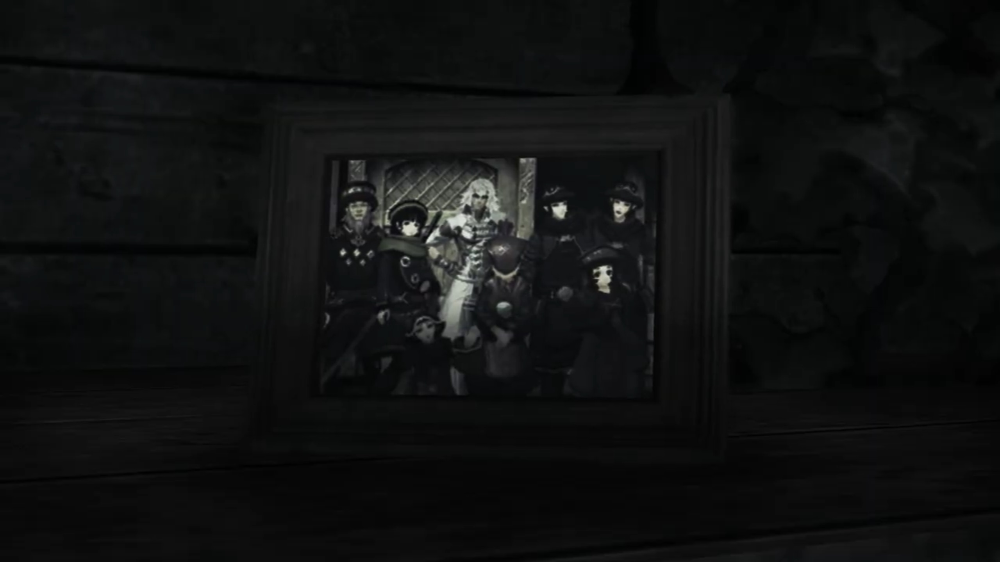
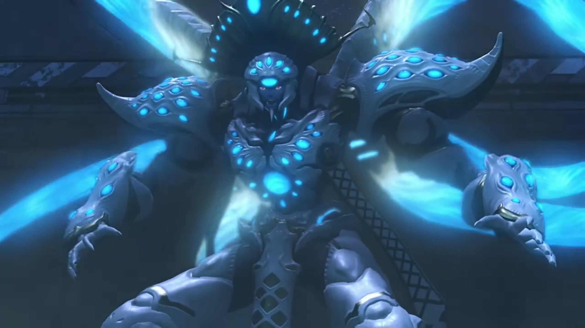
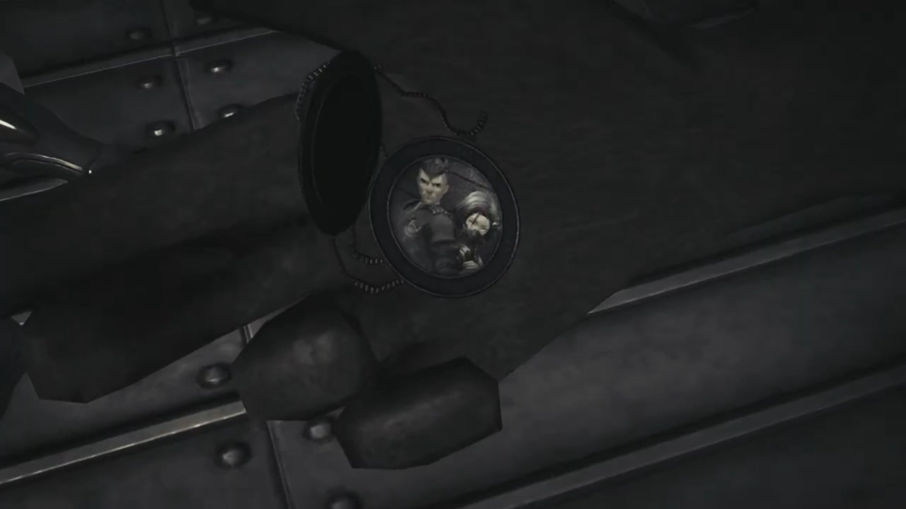

# That Day, When a Desolate Man Trusted a Con Artist

Jin and Malos were well ahead of the group; the former stopped and the latter felt it, turned around and asked, "What's up, Jin?"

Jin's head turned to the entrance they came in from, "So this is where it ends."

"_Huh?_ You say something?"

"No." Peering over his shoulder, he instructed, "I'll stay here. **You**- go fulfill our goal."

"_What're you saying?_ We promised we'd go *together*, didn't we?"

He breathed in and out 3 times, answered, "We did... _once..._"

> In the City, Jin sit in a rural alleyway, Malos approached him and held out his hand to him. 

"You OK?"

"I'm just waiting..."

Half a second passed, "For the boy?"

"I was... **told**- to wait..." He seemed to saw Lora standing by the entrance, watching at him with teary eyes. He closed his eyes and sighed, his attention returned to Malos, "I'll be watching... all of you."

Malos looked into his eyes for a few seconds, "Are you sure?"

Without hesitation, "I am."

He took a deep breathe and sighed, then walked up and hugged Jin, whispering into his ears. He then released him and, without looking back, walked towards the door. Jin eyes looked to the side, we don't know what he was thinking; after Malos disappeared behind the door, he turned around and faced the entrance they came in from, waiting. 

---

> She stood by the window, the drizzle weigh on the leaves, plop back up, and formed puddles on the muddy ground. Jin wondered where did his Driver's mind wandered...
> 
> "**Hey, you!**" They turned and saw an old-guy coming in, observed Jin from head to toe, exclaimed, "You wouldn't happen to be Ornelia's former Blade, would you?"
> 
> "Ornelia? No, I'm..."
> 
> "**From the Territorial Defense Corps! It's you!**"
> 
> "What?" He was ever more puzzled. 
> 
> "**Ooooo, I remember 'em well! Even though I was- knee-high to a grasshopper back then; with that sword slung across your back, you were so cool! If you hadn't come when you did, our village would've been...**" Something plopped into his mind "**Oh yes! The house you used to live... is still out there on the outskirts.**"
> 
> Lora, now stood beside Jin, wondered if that sparks some memories in her companion's mind, "_House?_"
> 
> ---
> 
> He stood in front of the wardrobe, tremblingly held on to a portrait of him with some others, that proved he'd existed before. 
> 
> 
> 
> For a long time, he observed, one by one, hoping their expression would give him more info. Perhaps he did find something, perhaps he don't, we don't know. He tucked it back where it was, took out the only book he found in it and started reading. 
> 
> "This long war for independence- will soon come to an end. It is not only the war- that will soon be over. Her life, too, is about to end. And when she meets her end, so too- will I." 
> 
> He imagined himself sitting by a table, dispensing ink on the pages with a quill pen. "Unsullied by her death, I will merely- return to my core, to await my eventual reawakening. I will sleep, as at the end of **any** other day. When I awake, will I be the same **person**- as before? If the Architect **does indeed** exist, I wish I could ask him... **Who-** am I, truly? **Whence**- did I come, **whither**- am I headed? If- _I were a praying man_, I'd pray this journal- **finds**- its way to you. Trusting that it will, I will use these last words- to pass down..."
> 
> There was an empty space left between the words, and his eyes moved on to the next paragraph, "... a means of carving the bond between myself- and my partner- into this flesh. **This**- is how it is done." 
> 
> His irises constricted, his breathe unsteady, cold sweat soaked the cover of the diary and ran down his spine. 
> 
> "My..." Immediately he snapped the book close, turned around while putting the hand holding the diary behind his back as she continued, "How terribly desolate... I heard it's been 90 years, but..." Walking towards him, her eyes can't stop scanning left to right at every possible trace of memories. She saw him looked troubled, asked, "What is it? Did you-remember something?"
> 
> "N-no. I-It's nothing."
> 
> "Really? That's too bad. I would've liked to have learned about the old you." His fingers pressed on the cover even tighter; Lora seemed to not notice, or if she did, she chose not to voice it out. 
> 
> "I am... who I am. **I. Do. Not.** Change." He convinced himself. 

---

Jin felt his arms over his chest, feeling her heart pumping. He knew she wouldn't agree, but there's no going back. He prayed for her forgiveness, he would soon go and find her. 

The door creaked open, bringing back his attention, "You came."

The group dashed in and stopped before him. "Jin!"

Pyra: "Are you alone? Where's Malos?"

"He... went ahead."

"Well then, what are **you** doing here?" Rex was curious.

"Waiting. For you."

"For us? Are you trying to stop us going after Malos?"

"Perhaps..." They waited for his explanation. "I want to see for myself. If this world- has any will of its own, which one would it choose, you- or Malos?"

Mythra took over and reasoned, "Then... you should let us pass."

"That I cannot do."

"**But why? In your state**, you should **barely** be able to stand! You know **if we fight now**, you'll..."

He calmly answered, "You see right through me, Mythra; but I made a promise. I'll do whatever it takes to fulfill his desire."

"_Even if it means your **death**?_"

His eyes unwavering, "_Gladly._"

"_Jin..._"

Jin entered his true form, freezing the surrounding to absolute zero. Zeke declared, "It looks like we won't get past without a fight, chum."

"Seems so. We'll **give it all we've got! C'mon!**"

"As it should be. **Come at me, boy!**" And the battle began. 

---

"**He's still got it! But so do we!**" Rex watched Jin approached them step by step, the ground froze under his feet. He launched a series of ice stalagmites at Rex when Mythra was busy transforming. "**Oh no you don't!**" Imperfect timing; Rex broke it, the fragments brushed past them both. 

"The power to manifest- what you imagine... Truly awesome. That power comes from the Architect. **Why do you wield it for mortals' sake?**" He redacted the icy field, concentrating the ether on his sword, and started sparring with Rex, their conversations didn't stop, 

"**To get to Elysium!**"

"And then what?" (His voice getting desperate) "Open it up to humans? **Share it out between them?**"

"**Do you even need to ask?! Obviously!**"

He stood still, looked into his eyes, "**And. Then. What? Can't you see where that leads?**"

"**What are you saying?!**"

"**Humans will make Elysium into another Morytha... Just as they did with Torna, 500 years ago.**"

"**I won't let that happen!**" The sparring continued. 

"**And after you die? What then? WHO will stop the inevitable?!**" He jolted his head to look into Rex's eyes. 

"**Isn't that... Isn't that the reason that you Blades exist?!**"

"Huh?" They stopped sparring. 

"**And... when I'm not around to stand by you in that effort...**" He turned to Pneuma, whom was busy transferring power, and looked back at Jin,  "**SOMEONE ELSE WILL!!!**" Their sparring continued. 

Despite Rex's heightened power, 500-years of muscle memories allowed him to focus on digesting what he'd heard concurrently. Their role is to stop the inevitable? How? Were their current resurrection and memories and behavior not dependent on their current Drivers, that if the humans die, they die? And if the humans had passed on their vice, how are they to live with virtue? 

"Huh?" The boy certainly had learnt a lot; his muscle memories had its limits. He felt a strong force exerted on his fingers; he subconsciously released it, and it flew away, landed some distance behind him. Jin peered at it, but did not move, turned his head back at Rex, whom continued, "**That's right! When a person dies, that's it for them...** (Pointing his sword at Jin) **But their- THOUGHTS and MEMORIES- will always be passed on** to someone else!" Rex redacted his power. "**Isn't that the same- with you Blades? Your past selves- get passed down to someone else- to become your new selves?!!! Isn't that how you've always lived?!! WE'RE NO DIFFERENT!**"

Jin looked to the side at the floor, his mind flung back to the beginning of this resurrection:

> Child Lora clutched her hands tightly, covering her mouth, fearfully pulled away a few broken steps as she watched him coming to life. 
> 
> Her hands placed on both side of her head, like she always did when she suffered blows; she thought now would be the same, but when she heard, "From now on, I'll protect you." 
> 
> She slowly opened her eyes, carefully twisted her head to look at him, still covering her head with her feeble arms. A big palm grew larger, her muscle tensed and she curled more inward. She could feel the calluses on his hand brushing against the side of her head, her cheek. Still trembling, she looked into his eyes, it twinkled with light and stars, "I'll keep you safe, always..." 
> 
> He held out his hand, and she took it; perhaps she can trust again. 

Jin's attention returned to Rex, "Blades become Titans when their time is up, and those Titans give birth to many new Blades. All while forming the world beneath our feet. **It's awesome!** It's enough to make me envious."

"**Envious... of us?**"

"So I'd like to ask the Architect. Pyra, Mythra, all of you... _Why did he_ create all these _incredible people_? Actually, I think I might already know the answer. But- I'd still like to **check** with the man himself." He put down his sword, walked closer and looked into his eyes. 

"To check your answer?" Jin couldn't yet fathom. 

"Yeah."

"**You... believe... you know the reason we exist?**" The answer he'd been trying to find for the past 500 years, a child merely the remainder of his age already had an answer? What... what had he been living all those years? His heart raced faster and faster until "**ARK!!!**" He felt a jab in her heart{{footnote: a heart attack}}. 

"**Jin!**"

Rex heard footsteps not belonging to his group; Nia watched "**Akhos! Patroka!**" closing in. Akhos went down and wrapped one of his arm around him, while Patroka sliced at Rex, forcing him back with her halberd. 

"Patroka?"

"I won't let you kill Jin."

Despite his pain, he ordered, "_Stand down, Patroka._"

"**Butttttt...**"

"_It is over for us now. There is nothing more. We've done- ALL that we have to._"

"Jin." She gritted her teeth, clenched her fist tight on the weapon. Admitting defeat now? Fight on and disregard Jin's order? Admit defeat? Fight on? Air entered her lungs while her mind switched between the choices until her lungs was filled to the top. She felt her weapon bending slightly under torsion, and her teeth creaked from biting too tight. And then she puffed it out, her clenched fist relaxed, her chin muscles softened, her energy drained away. "_Nia..._"

"M- me?"

"**Your power. Can you use it on Jin?**"

"Well, sure... **It'll only be a temporary measure, but...**" She transformed and started running towards them. 

Patroka looked away, stubbornly explained, "Don't expect any thanks. We'll go back first- and prep Jin for treatment. **Akhos!** Make yourself useful."

"**Yeah, yeah! I got 'im!**"

Patroka was making her way towards the exit; a dark shadow lurked in the corner made its move; and "**UHUH!!!**" Her eyes jutted out, feeling hot liquid running down her front and her back, and the cold from some muscular worm-like organisms contracting within her. She mechanically tilted her head down, inch by inch{{footnote: 'digitally', in quantum steps, rather than continuous/analogue}}, and saw a blue-glowing tentacles poked through her flesh. Before she could say anything, her visions got blurrier and blurrier, darker and darker, till they finally blackened, and she closed her eyes forever, collapsed with the removal of the tentacles. 

"**PATROKA!!!**" Akhos jumped up on his feet; the girl that was alive and kicking seconds ago was now a piece of meat. Even as the room started shaking, his eyes, jittering, remained fixated on her, oblivious to the various tentacles that wavered in the air around her. The rest of them traced the tentacles to the back of a humanoid creature, whom started to rose from the ground, and announced, 

"You will climb... no further..." 

Zeke and Pandoria eyes opened wide, cold sweat trickled down their skin, "Wh-! **Amalthus? HERE?!** And... why does he look like that?!"

Amalthus immediately turned his attention to her corpse, pulled out her core crystal from her chest and crunched it with his fist, its (ether) power began flowing through every single Core Crystal implanted on the surface of his body, glowing brighter as they digested it, releasing shockwaves that pushed even Rex and Pneuma back. 

"If the Architect- did send Blades down to this world... _it was for **my** sake._ **To find and raise cores containing more powerful, WONDROUS, UN-PARALLELED DATA...** That- is why I **created**- the cleansing procedure. **Behold- THE CULMINATION OF MY WORK!!!**"

Jin cursed effetely, "_You lunatic... He took the cores- from all those Blades. So that was the reason for the cleansing..._"

"**I am an agent of the Architect's will!**"

"_What is he saying?_" Mòrag was so confused. 

"Delusions of grandeur..." Dromarch supposed. 

"**You can't just decide stuff like that, dude!**" Pandoria shouted at him. "You're out of your damned mind!"

"**It is** no delusion! Have you forgotten the Aegis's power? _That power..._" He turned his attention to Pneuma. "Is it not the Aegis's power to **erase**- worthless things from existence?!"

Rex eyes turned to Pneuma; she was deep in thought, not replying. Amalthus pointed his finger at her, forcibly asserted, "Is that **not**- the Architect's very **will**?!"

"Pyra and Mythra aren't like that!" Rex stood for her. 

"I just realized." Pneuma started, with Mythra's voice. "**I** know why Malos- is so intent on scouring the world... **It's you, Amalthus.** Malos has become **tainted** by your influence..."

She thought she tossed a pebble into a stagnant pool; but he felt a pebble was dropped on a concrete ground, his heart stone solid{{footnote: Technically speaking, a stone dropping on a ground does create vibration, but let's ignore that in this analogy}}, "So what if he has? What's the problem? You've had your little trip around Alrest. You witnessed the state of Morytha! Mankind will never change, **no matter HOW MANY millennia pass!**"

"You're the one who won't change." Rex rebutted, his grip on the sword's hilt tightly, "That's **exactly** why you **hate those who try to!**"

> Guns blaring at the defenseless Tornan inhabitants. Flames raged as they dropped to the ground, one by one. Lora tried to protect Jin. Jin saw Lora weep in front of him, died in front of him, he couldn't change anything. 

"**And why should I have to change?** _If I change, I lose **everything**._ **I lose my very self!** Who in their **right mind would accept** such a fate?! **That's** why!" He'd already convinced himself; no amount of evidence would change his mind. 

Zeke, full of compassion, started walking towards him softly, speaking softly, "_You're weak, old man. The weakest of us all..._"

The death of his partner was too much for him. Shiveringly, he stumbled towards Patroka, hoping that she'd only fallen asleep, that at the next moment, she would open her eyes and greet him, telling him it's April's Fool. But no, she did not wake up. Not when he reached her. Not when he dropped on his knees in front of her. "Patroka..."

> In a metallic ship, Jin sliced the last of the soldiers before turning his attention to the depressingly-looking man and women; the whole time he killed, they were looking at the floor. This wasn't the first time someone killed someone else for them. But every time they thought they had hope, every time they concluded, "You wanna... **kill us, huh?**"
> 
> Jin took a closer look at him, "You're not human... Flesh Eaters?"
> 
> "We were on our way to be transferred to- Indol." He stood up, "My sister and I, from- Tantal." She did not move a bit. 
> 
> "Sister?"
> 
> "Here." He took out a pendant from his pocket and opened it up, revealing a picture. While Jin was looking at it, he explained, "The boy on the left, _that_- was my Driver. The right is Patroka's."
> 
> 
> 
> "Patroka... Is that her name?"
> 
> He snapped it shut and tucked it back into his pocket, introduced, "Yes. I'm- Akhos. Our Drivers were- brother and sister. _That's why._" Feeling self-abased, he wished he would say something that support him. Oh, how he wished for recognition; but again and again, his pride was smashed on the floor, crunched with their heels, till he no longer feel optimistic. 
> 
> Patroka seemed to not be affected much, at least on the outside, looked up at Akhos and spoke confidently, "We're siblings too, you're saying? What a dumb notion. They're _them_, and we're **us**. No- relation- whatsoever."
> 
> "Even so! _These bodies- contain the lives of two humans... We are... connected._"
> 
> She looked at his eyes for a second and quickly looked away, "I don't get why you bother..."
> 
> "Are you happy?" Jin suddenly asked. 
> 
> "Huh?"
> 
> "I'm asking if it makes you happy, **clinging** to things like **that**."
> 
> "That I don't know. But... it's better than having... nothing... It's important to me, and that gives me a reason... _to go on... To live for her._"
> 
> Patroka's eyes flickered; "Hmph!" She would not give in to such corny words. She stood up anyways, to face Jin. 

Akhos stood up and his bow materialized in its full crest, "**YAAAAHHHHHH!!!**" aimed it at Amalthus, stretched its string till it creaked. 

No, he had no fight for Amalthus.  Jin, still on the floor, panicked, "Akhos, stop! He's..." 

Akhos cannot hear. He fired the arrow; his tentacles easily wiped it away, didn't leave a scratch. "**YAHHH!!!**" It reached out for him, knocked his bow away, and wrapped around him, bringing him up closer for a look. 

"Akhos!"

"**L-l-let me go, you monster!**"

"How dare you! How dare you look down on me! You, a mere Blade- whose very existence depends upon ours!"

"**Rex! He's got Akhos!**" Nia swiftly tossed her Blade weapon at him and transferred power. 

"**I'm on it!**" Two swords in hand, he crossed them, launching a ranged attack with combined powers. "**Not on my watch!**"

His other tentacles easily blocked the incoming, without releasing Akhos. He took heavy steps toward Rex, the floor shook with every; "Hmph!"

"Ngh! **Let him go, pal!**" Nia panickingly dashed through, snatching her weapon from Rex, but before she could do anything, "**AH!**" the tentacles reached her and knocked her back. Mid-air, the tentacles tried to do something, if not for a wall of blue flames that prevented him. 

"This is a strange situation. Fighting so hard to save a member of Torna." She wasn't very convinced with what Torna did to her people, but she trusted her friends, and she was willing to fight to save her friends. Amalthus turned his attention to her, swiping his tentacles at her. She trusted Brighid to block it with her whip. 

"Indeed, but it seems like the right thing to do."

"**His aim is clear, and so is ours! Ngh!**" The tentacles whipped faster, and they adeptly dodged in between, blocking when they couldn't. The tentacles changed direction faster than they could react; at last, Mòrag laid defenseless against an incoming. She watched it grew larger and larger, aiming for her chest, heard some drilling sound getting louder and louder from her left, and they met. She watched Poppi's drill drilled at the tentacles above her. 

"Thanks!"

"Friend welcome!"

"Poppi! Now not time for kind manners!" Tora pointed at a tentacle aiming straight at her. She turned her head just in time to see it growing larger and larger. Her force hadn't yet rejuvenated, there's no time to react. She raised her noodle arms to block. Just an armlength away, thunder struck from above, numbed the tentacles, and it coiled back. 

"I believe in returning favors. You **owe me** for that one!"

"Much thanks!"

"Grh! **How?! Who do you people think you are?!**" The stored energy in the Core Crystals were tremendous, and he had difficulty putting them under control; but it seems the limit he'd set himself wasn't enough to wipe out these worms. He increased the threshold, immense energy emanated from his body; its mere shockwave forced the group to shield their faces while their feet dragged backwards. 

"**WHOOAAAAA!!!**"

The shockwave was short-lived, Amalthus spit at them, "Incorrigible whelps... Why would humans side with Blades?!"

Zeke was getting annoyed at his blindness, "Is he slow? He thinks it's a _side_ to pick? **We share a bond... you numbskull!** We're all friends here! We're in this thing together!"

"Bonds? Of friendship? **With these trinkets?!**" He held up the unconscious Akhos, looked at him, and with his left hand, punched into his chest and removed his core crystal, 

"Ugh! **UGH!!**" He then threw his useless husk back at the group. 

"Akhos!"

He felt his life draining quickly, his energy losing fast. He could no longer move his finger, though the remaining energy was enough to move his mouth. "_Tch... That was... surprisingly painful..._" Jin dropped to the ground, tears aggregate in his eyes; the last of his kin were going soon. "_If I were... still a Blade... this- wouldn't..._" His hands tried to reach out for him. 

> After a long silence, Jin invited, "Join me."
> 
> "Huh?" Both of them looked at him. 
> 
> He held out his hand, "My name- is Jin. I am... just like you." 
> 
> They looked down to think for a moment, then looked at each other for consensus; he waited patiently for them to grab his hand. Slowly by slowly, Akhos reached out for it. 

His hand dropped to the ground, his last breathe puffed out. 

"**AKHOSSSSSS!!!**" He immediately turned his attention to "Amalthus..." But his strength and injuries were too heavy. Rex, slowly walking towards him like a crab, sideways, blocked his view of Amalthus, instructed, 

"You stay right there! He's human. So we should be the ones to kick his arse."

"I have- _a heart- no less human than..._"

"**Then you better take good care of it!**" He was surprised. "**That's why you came here, right?**"

"_Rex..._"

"**We're gonna break the 500-year-long curse... right here!**"

"**Yeah!**" Pneuma came up beside him. 

"**Let's do it!**" And the rest came forward. The battle started yet again. 

---

"I cannot end like this... Not until I've met the Architect... **Not until I've ERASED EVERYTHING WITH MY OWN HANDS!!!**" He lost his mind, wiggle his tentacles like a giant squid trying to wrap its tentacles around a ship. 

"What?!" Rex watched as his tentacles punched into the building, melting every walls, trying to make himself and the walls a singular entity. 

Dromarch noted, "This is bad! The World Tree **cannot take it!**"

Zeke: "**How?! How's that BASTARD still STANDING, after the INCREDIBLE thrashing we gave him?**"

"**We must stop him!**" Mòrag ushered. Together, they closed in their distance with Amalthus. 

"Ahhh!" 

"What?!" Rex quickly changed direction. 

"**Jin!**" Pneuma too. 

Their attention floundered. "**Ahhhh!!!**" One of the tentacles knocked hard on his hip and sent him flying. 

"**Ahhhh!!!**" It continued to swiped Pneuma, she flew directly towards Jin. He hugged her. 

"**Pyra! Rex!**"

Pneuma could no longer retained her form, transformed back to "Mythra... You..." Jin softly put her down. 

She looked away, "D-don't... get me wrong, OK?! _I couldn't let him get your core too, that's all. With it, he'd be unstoppable..._"

> Lora passed away in front of him. 

"_Thank you._"

Meanwhile, the group were busy with the other tentacles, Amalthus went crazy and announced, "All the cores, all the **Architect's WORDS, BELONG TO ME!!!**"

He needed more power! Numerous tentacles aimed at Jin, "**HUAAAHHHHH!!!**" With the rest of his energy, he raised an ice crystal shield. Upon contact, all the incoming tentacles froze. His other tentacles were still busy dealing with the others. 

"_Nia... Take care of them both..._"

She subconsciously replied, "_I- I will._" She exited the battlefield and ran towards him, he handed Mythra to her. She held out her arm and started healing both her and Rex, whom was about 2 arm lengths away. Jin stood up and slowly walked towards Amalthus, stopped when hearing she asked, "_Jin!_ Why- didn't you kill me when I joined Rex and the others?"

He peered through his shoulders, "_It wasn't a mistake, was it? Becoming a Blade- of someone you **trust**..._"

"Jin." Rex had regained consciousness from the healing, slowly climbing on his feet, while Mythra had went to sleep. 

"_I did that too, once..._" He turned around and looked at him, "Rex, you have to **stop**- Malos. He's still **searching-** for his **own**- identity. Tell him- the answer- you found."

"_Jin..._"

He no longer attend to them. There was something he had to do, here and now. Freezing mist started to rise where he went. Amalthus eyed him, commented, "You should have died with Torna!"

"_Let's end this now. Our duty- has been handed down._ **AMALTHUS!**"

His eyes stared big at Jin, "Your duty- is as dust in the wind compared- to- my- destiny!" The other tentacles were now free; it stopped attacking, and the group did nothing to attract its attention. It gathered around its chest, forming a circle. A dark ball of anti-ether energy grew, shooting rays towards Jin; he froze it, broke it, shattered it. 

More and more, ice spears forming around him, he launched all of them and stabbed his humanoid body; his tentacles couldn't block any. "**ARRRRGGHHHHH!!!**" 

"**ARRRRRRRGGGGGHHHHH!!!**" Millions of icicles in continuous stream flowed past, spearing every single part of his flesh, freezing him from bottom to top. 

In pain, Amalthus screamed while not forgetting to give his speech, "**O ARCHITECT!!! I- SHOULD HAVE BEEN. YOUR. CHOSEN. ONE!!! I LIVED AS YOU WANTED ME TO!!!**" Red motes started floating out of Jin's core crystal. "**I DID!!! I ALWAYS!!!**" His flesh froze from bottom up to his neck already; he looked up at the sky, hoping to slow down the growing ice from covering his mouth too quickly. 

Zeke lowered his sword and sighed, "_Ohhhhh..._"

> "Bandits?" Amalthus asked.
> 
> "**Probably!** After all, **Pandoria** looks pretty damn human for a Blade. She'd be worth **a lot** to _some people._ They sell 'em. Line up the cores with pretty pictures of the Blade inside."
> 
> "It's the same as it _ever was..._"
> 
> "**What?**"
> 
> "As soon as people _denied something they desire, they try to take it by force._"
> 
> "Not everyone's like that."
> 
> "Oh, some give up _prematurely_, but the feeling is there, I assure you."
> 
> "Well, in that case, why bother protecting _them_?" He nudged at the refugee camps. "**Why not** let people do **whatever**?"
> 
> "_To remind myself._ I must never forget what kind of beings humans are."
> 
> "Is that what helping _me was, too?_"
> 
> "Hmph..." He looked up at the sky, thought for quite a long time, answered, "_A long time ago, I seemed to recall seeing a very similar scene._"
> 
> > Pandoria carrying Zeke on his back.  
> > Young Amalthus taking his mom's hands and ran, frequently looking back, trying to spot the pursuers.
> 
> "Hmm?"
> 
> "_Perhaps... That **too** was one face of humanity..._"

"Why did you look- sooooo sadddd back then?" He looked at the chunk of ice, frozen up to his chin, his body starting to disintegrate, and he answered himself, "That was... _you_ too, wasn't it?"

One of his arm was still free. He raised it high, trying to reach for the top of the building. The ice grew along his limb towards his fingertip. The ceiling he saw was shrouded in total darkness; he could not see where it ends, but he thought the one looking at them, "_Father... Why did you not answer when I call..._" 

Before the ice covered his eyes, he finally saw a gleaming light grew amidst the darkness, brighter and brighter, descending from the cold dark sky. "Ugh..." He felt an invisible hand brushed past his neck, and he remembered feeling it a long, long time ago. 

"_Mother, I've... missed you..._"

No trace of Amalthus was left behind, except the motes that floated up the sky. Mythra looked at "_Jin..._", whom was standing there all alone, looking up, feeling that someone was waiting for him; yes, she had been waiting for him for 500 years. For their journey to continue where it stopped here. Mythra closed her eyes, a ceremony of sending off. The rest watched his flesh turning into blue motes, gaining enough energy to escape his body, and break away from his form, floating up. He closed his eyes, dropped to the ground in a knelt position. Within a second, he was no longer. 

Gramps acknowledged, "What a splendid soul you were, Jin..."

"Jin..." The motes floated up to the cold dark sky above. Perhaps up there was _his_ Elysium waiting for him; perhaps, he could finally live with her, in _their_ Elysium.

---

> People rushed into their dwellings and closed their doors behind them. Some of them continued speaking, walking casually on the street, oblivious to the heavy downpour, didn't even bother carrying an umbrella nor wiping the annoying flow off their face. 
> 
> He could hear the baby crying and glass breaking behind the walls he leaned on. But it was none of his business -- his mind was on something else, and he couldn't get out of it. "Urgh, what a **stench**! They let **beggars** roam **free in this town?**" Malos complaint as he entered the rural alleyway. 
> 
> He didn't notice who the beggar was, but as he got closer, he felt some wavelengths emitting from him, he called out to the beggar, "You... _You're a Blade, aren't you?_ **Where is your Driver? Dead drunk in a ditch?** (And without a pause, changed his mind) No, _somehow I don't think that's it._"
> 
> Silence fell. His eyes squinted hard. The beggar don't know why he stopped speaking. Sounded familiar, this guy. He recalled hearing it not long ago; but unlike the rage he felt then, he now felt numbed. Yes, numbed. Nothing. He raised his head and looked at the figure's leg through the hood he's wearing. What had he got to do with him? 
> 
> The silence lasted for some 10 seconds before another voice rung, "The name's Malos. I'm the same as you..." 
> 
> Malos offered his hand to him. He watched as rainwater gathered and flowed off his pinky. No wards was exchanged for a long time. Yet it was the right time, the right moment, for a person so desperate, in need of someone, and that someone came out right in front of him, offered him consolation when all others took no notice of him. If she was a girl, she would have married this man right away. You see it in newspaper -- people getting married after an accident, or they found their loved ones by such accident. The charm of the con artist brought no end. For Jin, _he_ is his _light_ -- the light called hope, future. Malos waited patiently for him to held out his hand, slowly by slowly raising them, to meet with his. 
> 
> The rain just got heavier. 

### Footnotes: