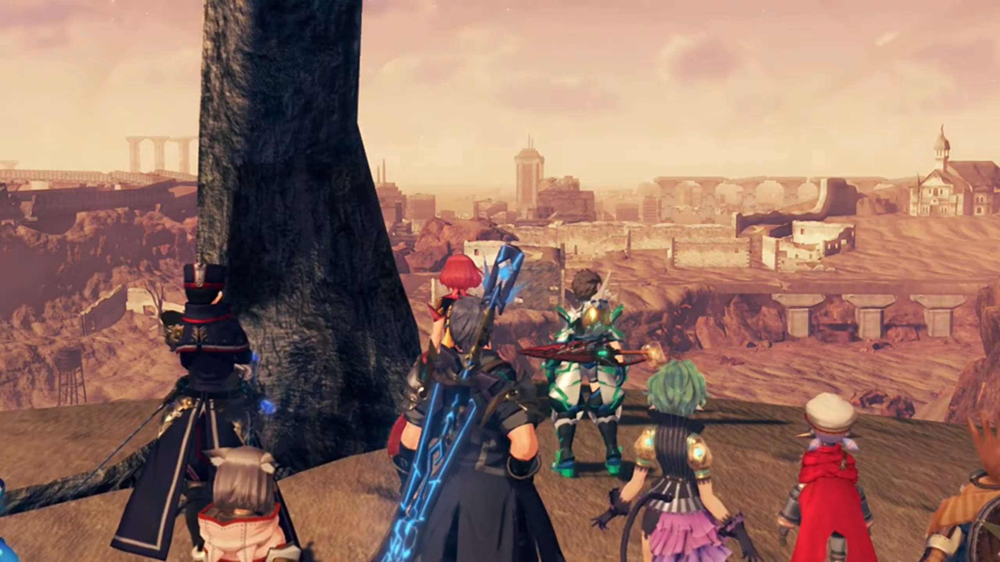
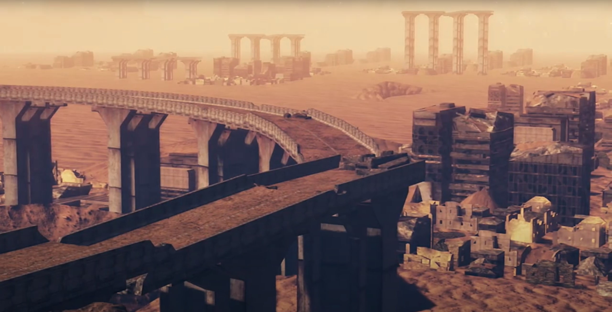

# This is... Elysium???

A skyscraper connected to a very thin rod stretched from the ground into space. Just directly below the station were one large and one small ring, with another ring orbiting the station itself. Another cable connected to the sides of the station paralleled the surface of the Earth, forming a ring like that of Saturn's. The Beanstalk, named after _Jack and the Beanstalk_'s fairytale, was a space lift that brings people from the ground to its First Low Orbit Station, Rhadamanthus. 

The year was 20XX. Everywhere on Earth's exosphere, unmanned humanoid robots of different forms and factions were fighting each other. Watching from Rhadamanthus, explosions lit the space like fireworks. But none of them had the pleasure to enjoy the show. A voice, clearly distressed, announced to everyone else, "Heat-seeking warhead -- we've been hit. Sensing Coriolis deviation across orbital ring. Reading shift to west-by-northwest, magnitude comma two."

People inside Rhadamanthus were rushing up and down, some staying at their post, working their fingers through the buttons on the terminal; secretaries quickly paced through the narrow alleyway, transferring paperwork and information to their respective destination. When one of them tripped and fell, she didn't even had the time to tend to her injuries, immediately stood up and resumed her job. Time were running out. If they cannot finish their job now, they'll be finished. 

A female voice sounded, "Correcting tower balance. **Releasing anchor bolt 127 through 214**!"

In a dark room with various blades that fanned out below the glass-made ground, a bright giant cross-like object floated on the center of the blades, above its axis. We have seen it once, when it granted Rex the Master Driver's power to apocryphate{{footnote: One invented the word. Named after [the Apocrypha Generator](https://xenoblade.fandom.com/wiki/Apocrypha_Generator) in Xenoblade 1, it means "the ability to nullifies another type of specific power."}} Amalthus's Master Driver's power. The Cross suddenly started absorbing energy from its surrounding. 

No one likes concentrated battlefield. Attacks that missed tend to hit someone else; so naturally, they spread out. But the humanoid weaponry cannot escape too far from Earth, so they spread over its surface, and gradually but surely, they reached Rhadamanthus. The ring that orbits it raised a frequency shield against any incoming missiles, but when it was first designed, the architect made it such that it could only defend infrequent attacks, giving Rhadamanthus just enough time to deploy the humanoid weaponry, or so called Artifices. Each party had their own model of Artifices, and for Rhadamanthus, it's "Echelon Siren losses- now exceed 60%."

The first of it that came out from the hangar was immediately destroyed, defending those behind, allowing most to survive deployment and put into battle. But alas, they were outnumbered. One by one, they burst into flames, facing various different models of enemy Artifices. Some of their burning husks was pulled by Earth's gravity, like a defunct satellite. Rhadamanthus weren't so lucky, its frequency shield suffered a few blow from direct crashes. 

A male declared, "**Director, the Beanstalk- cannot hold!** The Saviorite rebels- are very close to **capturing** it!"

The director, sitting behind a terminal himself, shook his head. Choice and decision overwhelmed him. He had worked here for long, and he couldn't easily put down his feelings for The Beanstalk. But ultimately, his logic took the upper hand, and he stood up slowly, announced, "We have no choice. Initialize Aion. Prepare the Conduit."

"Roger!" His secretary went away to execute his instruction. While he was waiting, he looked at the giant screen in front, wondered how long the outside could hold, and whether they can turn the tide around. The plan had already been laid out, and they were prepared for negotiations, if the Saviorite rebels don't want to perish together. The hopes weren't high, but he was prepared for the worst case scenario. 

"Director! The Conduit's authorization has failed!" The guy that reported to him earlier reported back, his mind descended from the future, wandered back to the present moment. 

"**How come?!**" He looked at the guy sitting at his 1 o'clock, asked. The female sitting next to him stretched her neck and peered at his panel, seeing if she could help. 

The guy turned to the director, his voice confident, "We're locked out by Professor Klaus." The Director started to feel bad, very bad. And he had a taste of what's gonna come next. "**We can't secure access from our side!**"

"**What did you say?!**"

Meanwhile, Professor Klaus was meddling with a giant panel in front of him, looking at all the statistics with unwavering attention, only himself within the room. "Trinity Processor synch rate at 96%... That **should be** good enough."

He then looked at the Conduit behind the glass panel in front of him, opened up his arms wide, and announced, "Let's begin the experiment."

A female dashed through the door just in time to hear what he'd spoken, shouted while still running in, "**Professor, NOOOO!!! The results have not been confirmed!!! It's too dangerous!**" She stopped some steps behind him. 

His conviction wasn't wavered a single bit. His confidence stretched to the extreme. Just think for yourself -- when you're given a piece of statistics, like the probability of getting a disease (cancer, diabetes, etc.), you'd most probably say -- 'the probability applies _only to others_. **I** am the exception. **I**, a good person, was granted the good will by God to never get these disease. They don't apply to me.' And that's what Professor Klaus felt at that time. If other people do the experiment, they may fail. But he? He's an exception, at least he believe so. He had the Midas's touch, granted by God, to bear miracles. He turned around and discharged her, 

"Ridiculous. **It's PERFECTLY safe.** We- are about to **bear witness to the birth of a UNIVERSE!!!** Once, only a **god** could perform such a miracle. _But today_, mankind moves _one step closer_ to the **divine!**"

"Are you serious?" The woman can't believe what he's speaking. Professor Klaus, so logical and rational, always sided with science, now speaking of pseudoscience? If he'd been a religious believer or someone whom doesn't believe in science, she won't be so shocked; but he's now showing inconsistencies with his earlier behavior. Something had changed his mind. And in scientific experiment, siding with the paranormal was dangerous, because our genes are programmed to be extremely confident. Else, how would we, small and weak, brought down a mammoth in the past? She perplexingly looked at his eyes, asked, "Do you even... fully understand **that thing?**"

He stood up, "What's the alternative? Do you want to **surrender this place to them?** (His eyes peered over his shoulder.) The Conduit is a gift from **some divine entity.** It is a **gateway!** A gateway that will take us to an **entirely new world!!**" He turned around and embrace the bright-Cross.

The woman felt a strong thud in her heart. Demonized by paranormal entity, this guy had became a slave of his own experiment! No, he's no longer running experiments, he's being ran by his experiments! She calmed her voice, as if that's gonna give her strength, or hoping such calm voice could reverberate in him, to bring him back on the side of logic. But she started with labelling him, "You're delusional. **'Divine entity'?!! The Conduit is nothing more than a meta-universe manifold!**" She went up and hugged him from behind. 

Labeling someone tends to backfired. Ask, who wouldn't want to defend their pride? Who would allow you to challenge their very entity? Very few, and Klaus wasn't one of them. He sighed, looked up at the Conduit, tiredly spoke, "_Galea... We humans are **fools!** We've ravaged the planet..._ We are on the verge of burning **even the skies above!** (He could see the fighting outside, even through the opaque walls, with his 6th sense.) But the Conduit... **could** transform us into something **so much more!**"

"**HURRGGGHHHHH!!!**" Galea screamed as Klaus flung his arms around with full strength and threw her toward the walls. "_Galea, this- is the birth- of a brand-new_ **universe!**" 

He continued typing on the panels; Galea, still feeling pain in her chest, couldn't get up on her feet, she held out one hand at him, "**STOP!!! KLAUS!!!**"

But he'd already made up his mind. His eyes fixated on the screen and the Conduit; nothing could prevent him from conducting an act of a God. Nothing! When he _thought_, _assumed_ all was prepared, he press the big red ENTER button. 

On the axis of the giant fan-like blades, below the Conduit, was the Trinity Processor, a Hexagonal object with 3 slots connected to it, which we saw at the start of Chapter 7. At Klaus's command, the Trinity Processor communicated with the Conduit, it released energy that sent down the cable that paralleled Earth's surface, traversing at near-light speed. 

The people on the ground gazed at the sky. The nighttime swiftly turned to daytime, and got even brighter, as if the Sun was closing in on Earth from all sides. Then, heavy fog and mists started forming, shielding the blinding light from entering the ground, it gets thicker and thicker until they could not see their own palm, holding it out. Somehow, the bright light managed to penetrate past the thick mist, and it could no longer dimmed the light down, so bright they lose consciousness and fell to the ground. 

Looking from a distance, Earth was engulfed by a supernovae-level bright light. 

---

In a dark room; the blinking lights in the background makes no viewable difference to its illumination. We could hear Klaus's voice echoing the room, "_Fools- indeed..._" Machinery at the background started activating; he announced, "_The time- has come..._"

---

Time seemed to go on forever, up and up and up, never ends. The silence and the inaction makes the journey even more torturous than it is. It must have been eons passed before the lift came to a stop. Tora felt the thud, announced, "It stop moving..."

Dromarch guessed, "Perhaps we've arrived at the endpoint?"

Poppi suggested, "If we go outside, we find out."

Rex's voice echoed in the chamber, "**Good point! Let's have a look!**" The door of the lift opened and they were now standing on a disc. Though, from their point of view, all they could see was the dark sky on top of them and the edge. 

They started walking towards the edge; halfway, Nia stopped and asked them to "Look up!"

Glimmering stars glittered in the dark sky. Brighid noted, "The stars... They're close enough to touch..."

Zeke had reached the edge, commented while looking down, "The other view is quite something, too. Look at the Cloud Sea all the way down there..."

"So this is the top of the World Tree..." Rex exclaimed. He then heard a bell rung, "Ahhh! That sound!" He looked to Pyra, whom nodded. She had heard it for the past 500 years, it's no mistaken. 

"Huh? What is that?" Nia didn't know about it. 

"It's Elysium!"

"Elysium?"

His mind drifted back to the Elysium in her dream, he pricked his ears, trying to locate its source, "**This way! Let's check it out!**"

---

Meanwhile, standing in front of a door, Malos spoke, knowing full sure he's listening, "It's been a while, 'Father'..."

"Logos..."

He's not surprised he could transfer his voice directly into his mind, started walking towards the door, asked, "Is that my real name? What's it mean, 'Logos'?"

"It has no meaning. All it represents- is the ego of those who named you." Klaus explained. 

"_Hah... How many years has it- been?_"

"I forget. It has been faaaaar too long..."

"Y-you know why I'm **here**, don't you?"

"_I know it all._ **All** that you experience- is passed on to me here."

"Then, let's get straight to the point." He attacked the door with a blast; it shook, but held firm, leaving not a scratch. "**HUH!!!**" The first time something didn't bend under his power. Never had he experienced such material that could withstand! 

"No need to rush, _my child._ I am fading. I'll be gone... soon enough..."

"Is that right? Pfft. **Then**, I'll- **take it all.**"

Klaus wasn't incited, answered calmly, "Do as you wish. If you believe that is your role..."

"Huh!... Is that choice really 'mine'?" There was no reply. He gritted his teeth and insisted, anger filling his chest, "**Answer me!** This is what I came to hear."

Did he really know? Despite them treating him as the Architect, as the God, but he, being a mere human, how much did he really 'know'? Yet, he answered, "It is a choice you made- together."

"_Good. Answer._ Thanks for creating me."

"_Ahhh..._ And here comes the other answer..."

---

The group reached the end of the tunnel, stopped behind a giant door. The door slid open, dust and sand brushed through them. 

"It sure is bright." Nia noted as their irises were adjusting to the new brightness. 

Rex was excited, "Yeah... it's righhhhht through here. I'm surrrrre of it. We've almost reached Elysium..." Gramps can't miss the grand moment. Everyone's full of hope; their dreams will soon come true. 

Slowly, they walked out of the door, looked around. A giant elevation in front of them made entirely of sand, and nothing else within his sight. At the top of the sand hill was a tree bark, totally dried out, branches without leaves. Rex felt extremely sour within his stomach; things hadn't gone as he'd expected them to. He viciously scanned left and right, hoping something would materialize, but all he could see is sand, sand, and more sand. Oh, and the dust that clouded the air heavily. 

In a panic, he took to a run up the hill toward the tree bark, the only beacon that's different from the rest, Pyra followed immediately thereafter. Below the dead tree, he scanned furiously left and right and left, she covered her wide-opened mouth. The rest dropped behind them and glanced the new scene behind the hill. The bell rang, it was where he thought it was. In a trembled voice, Rex asked, "Wh-**what**... is this place?!"

Pyra: "_No..._"

Buildings, churches, bridges there were, except in ruins. Most of the roofs had fallen off, and some of them lost part of their walls too. Only the Church remained standing, at least seen from afar. The scene was covered with a thick layer of sand and dust, like those worlds in _A Thousand and One Nights_. Heavy dust polluted the sky orange. They stood below _the tree_ -- the tree where Pyra seem to stand in her dream. A wide crevasse stretched directly below the foot of the hill, he thought it was crafted out by the waters in the past. The bridge to cross the river laid ahead, but now, it's just 3 pillars. On the sky{{footnote: Not shown in the picture below}} were grids of metal coiled into an cylindrical mesh, perhaps to hold the transparent glass panels that contained the air within the atmosphere. 

"Ahhh... Could this place **really** be Elysium? **Where's THE GREENERY? THE WATER? BIRDSONG?!!! THERE'S NOTHING... NOTHING HERE AT ALL!!!**" Rex's voice echoed the abandoned chamber. The bell that rang reminded him again and again, _this_, is Elysium. No, it's not as he'd expected, but it's Elysium in reality. 

"_What a wretched sight..._" Gramps commented. "I have not seen anything like this... in all my years on Alrest..."

"_Ph-_**Pyra**?" Say something! Tell me this isn't true. Tell me that we've got it wrong! Tell me that, somewhere out there, lies the Elysium in your dream! 

She felt tears surged to the tip of her eyelids, replied, "_I don't understand..._ **I don't get it!** This... **This is NOT how I...** remember..."

Mòrag, whom hadn't kept her hopes high, was quick to accept. Instead, she turned to something more materially realistic, "That bell sound must be coming from somewhere. Is someone here?"

"_Hmm..._" Brighid wondered. 

Poppi analyzed the source of the bell, looked to a direction, "Over there! Poppi detect one big thing, kind of like building, over that direction. Sound seem like it come from there."

"That building, eh?" Zeke thought. "Then there's no point hanging around here."

Pandoria agreed, "Y-yeah... Only one way to find out. Let's go, Rex."

Despite his disappointment, it couldn't be more disappointed than he felt now, can he? "_All right._" Then he turned to Pyra, tried to cheer her up, "**It might still** be OK. M-Maybe it's just... **this bit** that's destroyed..."

"_Huh..._" She appreciated his effort. But an ecosystem seldom cut off one bit from the rest. A desert tend to spread and engulf the forestry biome. 

"There's bound to be- **something**- over that way."

---

The sand, covering the floor and the bottom part of the walls, and the seat of the hanging see-saw, still held by the metal bars in place, were signs that the ground used to be lower, and the sand filled it up higher. The bell continued ringing, leading them to their destination. The group walked along on what seems like a path. Dromarch looked around, noted, "This place looks like it was once a city, and quite an **old** one at that."

Rex stopped moving, and the rest followed. Zeke compared, "It's actually a lot like the stuff we saw in Morytha..."

Thud. Comparing _Morytha_ to _Elysium_... Classifying them as one and the same... Nia complaint: "**Way more dusty**, though. _Maybe because it's so dry up here._"

"_Huh?_" Something caught Rex's attention, the rest turned their head to where he looked, saw him running up towards an object by the stairs that lead to the once-flourishing-with-children playground. Pyra followed him, while the rest waited where they were. Pyra watched him bent down and observed the oxygenated, sand-eroded bicycle. He carefully moved his index finger to it; immediately, the delicate balance was disturbed, and the structure could no longer resist the inevitable gain in entropy, turned into dust, and went with the air he blew out from his nose. 

Pyra gauged by its size, commented, "It seems to have been a- child's vehicle."

"_Right..._" He effetely answered. Stood up and looked at the sandy floor, he concluded, "_So that means... People lived here, once._" They walked back to the group. 

Mòrag noted, "It must've been a grand old city. It stretches further than the eye can see..." She did some calculations, then concluded, "You could fit... the entire population of Alrest into this place, **and** with room to spare..." The group continued on their 'hopeful' journey. 

---

"**Ding!**" The sound of the bell rang loud and clear. Rex looked up at the building, asked, "Is that it?" He'd walked pas the perimeter of the mostly-for-decoration gates. 

"The bells have stopped..." ever since they entered the perimeter. If someone had stopped it, (s)he must've been waiting for them. The door of the Church creaked opened magically, as if someone was pulling them from behind, welcoming their first guests after eons of abandonment. 

"A signal we should enter, perhaps?" Gramps interpreted. 

"We probably should."

---

Past the entrance, they walked along the alleyway past rows and rows of seat, all except Pyra were startled by the effete voice of Klaus, 

Through the entrance, along the alleyway through rows and rows of seat, the weak voice of Klaus took all to their feet, except Pyra's. "_Welcome home... my children._"

Rex asked, furiously scanning for its source, "**WHO'S THERE?!!!**"

Even if she hadn't met him before, she immediately recognized, looked up at the sky and asked softly for recognition, "_Father...?_"

Rex shockingly turned towards her, "_What? You don't mean...!_"

Mòrag finished his sentence, "The Architect _is here?_ But... where?"

Klaus's voice echoed again inside the chamber alluringly, "_I'm always here. Come to me..._" 

The altar in front of them slid back, revealing a high-tech stair with lights installed on some of its tread that leads to the bottom of the church. 

Poppi alerted their attention, "**Please look!** Over there, it's staircase."

"It seems to lead to a lower level." Mòrag concluded. 

Rex nodded, "_Hmm... Guess we have to._" Lest they don't want answers. 

### Footnotes: