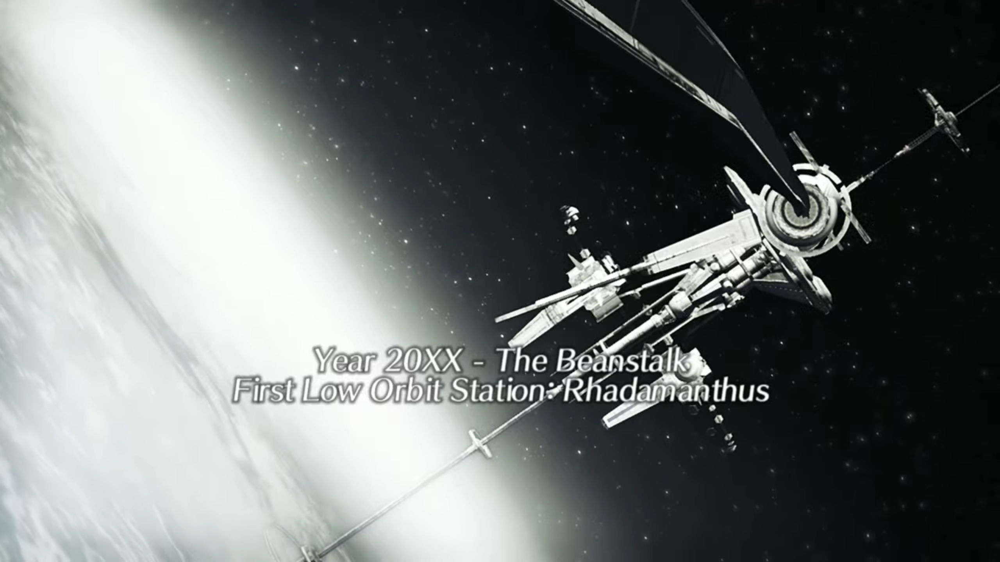
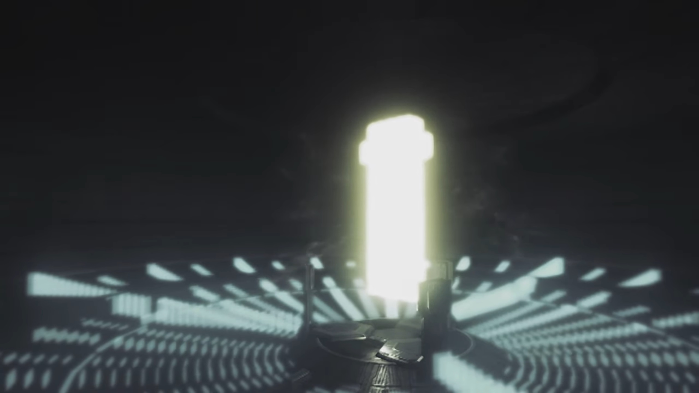
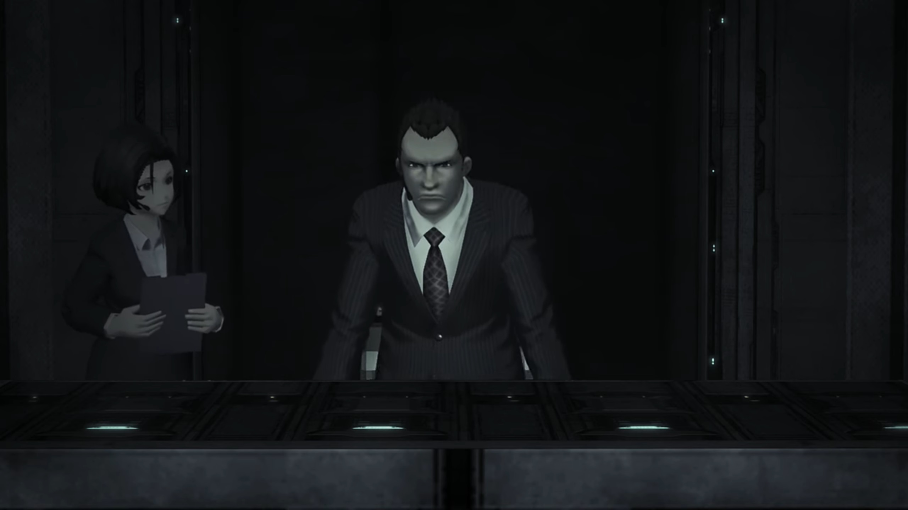
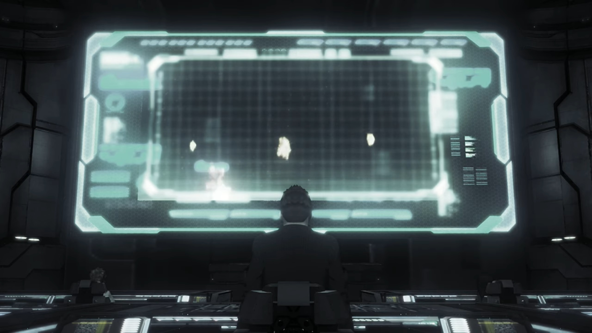
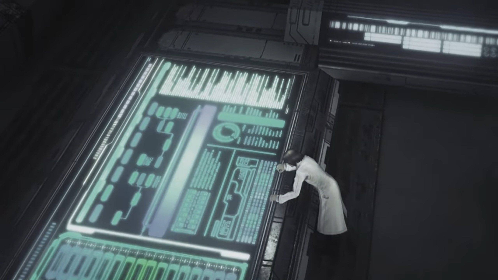
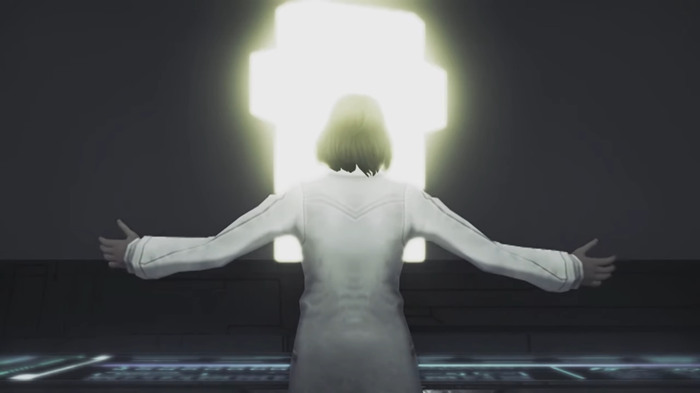
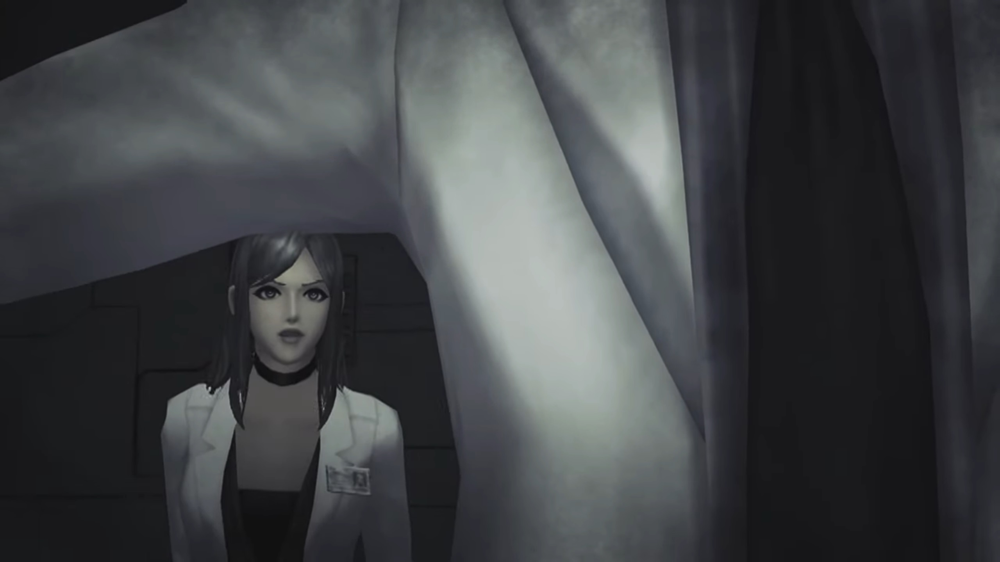
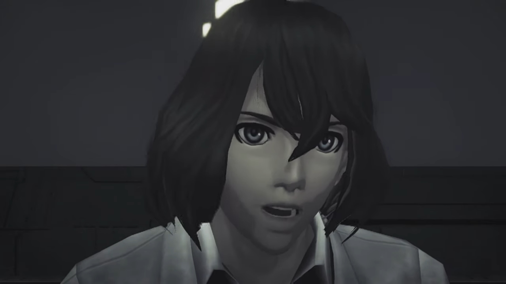
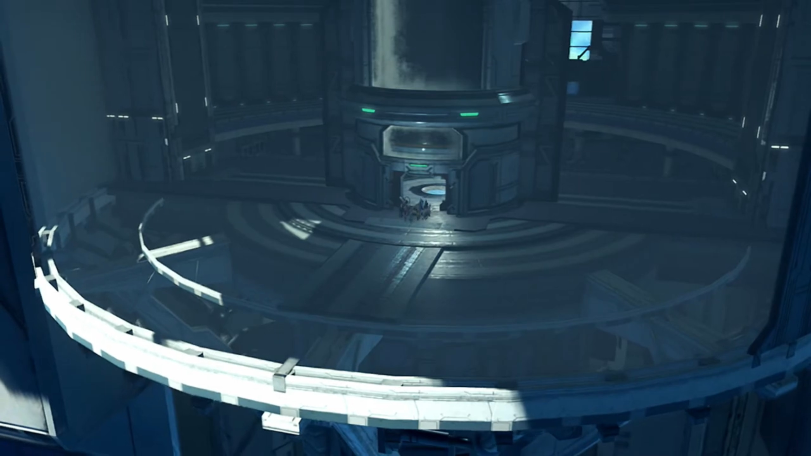
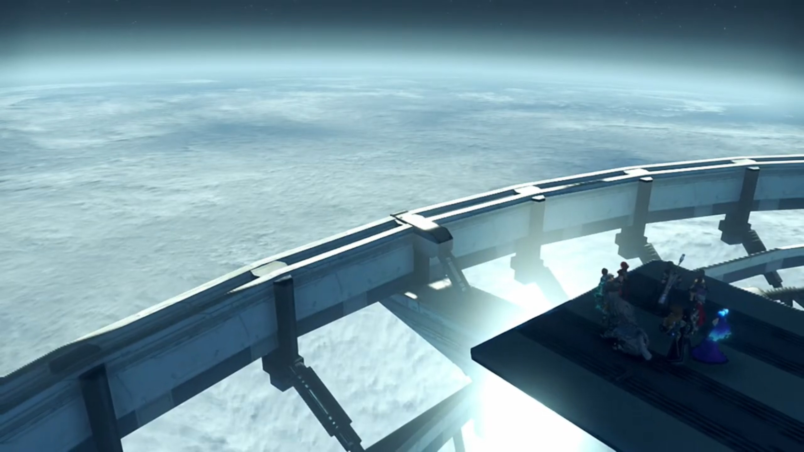

# This is... Elysium???

===

A skyscraper that stretched from the ground into space. Several rings at the end near the top, and the large ring at the top, there was some mechanism orbiting the central station. To the side of the central station was another cable that goes parallel to the surface of the Earth, forming a ring like that of Saturn's. This is The Beanstalk's First Low Orbit Station: Rhadamanthus. It was year 20XX, someone announced, "Heat-seeking warhead -- we've been hit."

Everywhere on Earth's exosphere, spaceships of different forms were fighting each other; if there were people watching from the surface, they'd see 'glimmering stars' blinking all atop their heads. The voice continued, "Sensing Coriolis deviation across orbital ring. Reading shift to west-by-northwest, magnitude comma two."

People inside Rhadamanthus were rushing up and down, some staying on their post, working their fingers through the buttons on the terminal; other secretary transferring paperwork and information or have other job, running up and down; even when they tripped and fell, they immediately stood up. Time were of the essence. They must finish their job before they were finished. Another female voice sounded, "Correcting tower balance. **Releasing anchor bolt 127 through 214**!"

Meanwhile in another room, the bright cross-like feature that granted Rex the Master Driver's power to go against Amalthus earlier floated above some device. Previously stagnant, it started absorbing energy from its surrounding. 

Meanwhile, the war outside had spread to Rhadamanthus. The ring orbiting the central station raised a frequency shield that blocked any incoming missiles, but it can't hold for long. The defense system released the Artifices, mostly Siren, to buy them time; the first that flew out haven't started going offensive and already went down in a burst of flames; not a shred remained. 

A female voice reported, "Echelon Siren losses- now exceed 60%." One by one, the Sirens that soared the air burst in flames, outnumbered, overpowered, overwhelmed by alien forces{{footnote: By 'alien', one don't mean alien _alien_, but it doesn't belong to the Beanstalk's party.}}. Their burning husks, pulling under gravity, struck the frequency shield. 

A male declared, "**Director, the Beanstalk- cannot hold!** The Saviorite rebels- are very close to **capturing** it!"

The director, sitting behind a terminal himself, shook his head, feeling overwhelmed by choices before, now stood up slowly, announced, "We have no choice. Initialize Aion. Prepare the Conduit."

"Roger!" His secretary went away to execute his instruction. He looked at the giant screen in front, showing what's happening outside Rhadamanthus. The explosion continued. 

After some time, he heard back from one of the people sitting in front of the panel, "Director! The Conduit's authorization has failed!"

"**How come?!**" The guy was sitting on the panel to his 1 o'clock. The female sitting at the panel next to him tried to look at it, seeing if she could help. 

The guy turned to the director, confidently said, "We're locked out by Professor Klaus." A heavy rock smashed into the director's heart as he held his breathe. "**We can't secure access from our side!**"

"**What did you say?!**"

Meanwhile, in front of a giant panel, Professor Klaus was meddling with a keyboard, his attention unwavering. "Trinity Processor synch rate at 96%... That **should be** good enough."

He then looked at the Conduit behind the glass panel in front of him, announced with wide-opened arms, "Let's begin the experiment."

A female dashed in through the door, shouted before she stopped, "**Professor, NOOOO!!! The results have not been confirmed!!! It's too dangerous!**"

That did not shook his heart a single bit. With extreme confidence, he slowly turned around and sat himself on the table, replied, "Ridiculous. **It's PERFECTLY safe.** We- are about to **bear witness to the birth of a UNIVERSE!!!** once, only a **god** could perform such a miracle. _But today_, mankind moves _one step closer_ to the **divine!**"

"Are you serious?" The woman can't believe it. He's out of his mind. She tried to challenge him, looking seriously into his eyes, "Do you even... fully understand **that thing?**"

He stood up, "What's the alternative? Do you want to **surrender this place to them?** (His eyes peered over his shoulder.) The Conduit is a gift from **some divine entity.** It is a **gateway!** A gateway that will take us to an **entirely new world!!**" He turned around and embrace the Conduit.

The woman felt her heart crushed. This guy had been demonized, enslaved by his own experiment. She calmed her voice, trying to get him back on logic and rationality, "You're delusional. **'Divine entity'?!! The Conduit is nothing more than a meta-universe manifold!**" She went up and hugged him from behind. 

Klaus sighed, looking up at the Conduit, spoke tiredly, "_Galea... We humans are **fools!** We've ravaged the planet..._ We are on the verge of burning **even the skies above!** (The fighting outside continued.) But the Conduit... **could** transform us into something **so much more!**"

"**HURRGGGHHHHH!!!**" Galea screamed as Klaus flung his arms around with full strength and threw her toward the walls. "_Galea, this- is the birth- of a brand-new_ **universe!**" 

He continued typing on the panels; Galea was too painful to get on her feet, held our her hand at him, "**STOP!!! KLAUS!!!**"

But his eyes were fixated on the screen and the Conduit; nothing else could enter his mind. With all prepared, he press on the button. 

Below the Conduit was the Trinity Processor, the Hexagonal object with 3 slots connected to it, which we saw at the start of Chapter 7. The Conduit resonated with the Trinity Processor, and the power was sent down the cable that parallel the Earth surface outside, traversing at near-light speed. 

To the people on the ground, the sky got more and more cloudy, the ground more and more misty, until they could no longer see anyone else; and brighter and brighter it gets, and they lose consciousness. From a distance, a supernovae-level bright light engulfed the whole Earth. 

---

In a dark room; the blinking lights in the background makes no viewable difference to its illumination. Klaus's voice echoed, "_Fools- indeed..._" Machinery at the background started activating; he announced, "_The time- has come..._"

---

The final lift brought them to their final level -- the first Low Orbit Station, Rhadamanthus. Tora felt "It stop moving..."

Dromarch guessed, "Perhaps we've arrived at the endpoint?"

Poppi was more direct, "If we go outside, we find out."

Rex's voice echoed in the chamber, "**Good point! Let's have a look!**" The door of the lift opened and they were standing on a disc. 

Before reaching the edge, Nia stopped and asked them to "Look up!"

The sky was dark. Brighid noted, "The stars... They're close enough to touch..."

Zeke looked down, "The other view is quite something, too. Look at the Cloud Sea all the way down there..."

"So this is the top of the World Tree..." Rex exclaimed. He then heard something ringing, "Ahhh! That sound!" He looked to Pyra, whom nodded. She had heard it for the past 500 years, it's no mistaken. 

"Huh? What is that?" Nia never knew about it. 

"It's Elysium!"

"Elysium?"

As his mind drifted through the Elysium in her dream, he tried to locate the source of the bell sound. "**This way! Let's check it out!**"

---

Meanwhile, standing in front of a door, Malos spoke, knowing full sure he's listening, "It's been a while, 'Father'..."

"Logos..."

He's not surprised he could transfer his voice directly into his mind, started walking towards the door, asked, "Is that my real name? What's it mean, 'Logos'?"

"It has no meaning. All it represents- is the ego of those who named you." Klaus explained. 

"_Hah... How many years has it- been?_"

"I forget. It has been faaaaar too long..."

"Y-you know why I'm **here**, don't you?"

"_I know it all._ **All** that you experience- is passed on to me here."

"Then, let's get straight to the point." He launched his powers at the door; it shook, but held firm, leaving not a scratch. "**HUH!!!**"

"No need to rush, _my child._ I am fading. I'll be gone... soon enough..."

"Is that right? Pfft. **Then**, I'll- **take it all.**"

Klaus wasn't incited, answered calmly, "Do as you wish. If you believe that is your role..."

"Huh!... Is that choice really 'mine'?" There was no reply. He gritted his teeth and made a snide comment, "**Answer me!** This is what I came to hear."

Did he really know? Despite them treating him as the Architect, as the God, but he, being a mere human, how much did he 'know'? "It is a choice you made- together."

"_Good. Answer._ Thanks for creating me."

"_Ahhh..._ And here comes the other answer..."

---

### Footnotes: