# "Please, Father?"

The miniature neon lights installed on the walls gave them a glimpse to the trove of darkness. Nia noted, "The building's holding up well inside."

Tora's point of view was more technical, "Quality of structural materials **much** better than in city outside! This made of same substance as World Tree itself!"

"Same as the World Tree?" Rex wondered. Why not build the whole city with the same tech as the World Tree, lest it wouldn't be eroded? He heard the bell dinged once. Strange -- hadn't it stopped earlier? But forget about that, he turned around to give further instructions, "Uh... **Huh? Hey, where is everyone? PYRA! GRAMPS!!!**" (No reply). "**Pyra! Mythra!**" 

No reply. He scanned the surrounding. The entrance they'd came in from had gone. Now he's alone in a tunnel, and there's only one door, with the other being a dead end. No other choice, he dashed towards it, hoping to find the others there. 

---

A blindingly bright light forced him to closed his eyes. When he reopened, he saw darkness everywhere. Darkness that veiled the loss of colors like a chameleon changing colors to fit its surrounding. He hadn't noticed, or perhaps he had, but his attention were on his friends. 

"Uh... **YARRRGH!!!**" By the time he realized, a dark figure shrouded his view and shoved him aside, throwing him on the ground. Tidy footsteps marched along the invisible road. Light was scarce, but Rex was trained to look at darkness beneath the Cloud Sea. He squinted and forced his vision to focus, made out a thing or three, but it wasn't something he'd seen before, 

"_What is that,_ the Ardainian Imperial Army? But their equipment looks ancient... Like it's coming from the past..." 

His attention wandered, "What is up with this place?" He tried, with his hands, to feel the ground. Something rough, hmm, the floor. As he moved about, he felt something hard and round and smooth. He refocused his attention on it, "**UWARRRGHHHH!!!**" No doubt about it, a human skull. He thought he was sitting on the floor, with all the roughness. But now he's not so sure. His touch sensors enhanced, he could feel the round and hard jutting below his ass. He scanned around him. Skull, skull, and more skull!{{footnote: In the video, it's not just skull, but skeleton, but one'll tweak the truth a bit here.}} No piece of land was sacred. He jumped on his feet, "**ARRRGGGHHHHH!!!**" mindlessly ran without a sense of direction until a bright light swallowed the environment once more. 

---

Pant, pant, pant. He continued running, oblivious to the white clovers that blossomed at both side of the road. He thought eons had passed when he stopped to catch his breathe, half-knelt with hands on his kneecap. Buildings were around him, with lights shining through the windows. Fire on a post lit the surrounding dark-orange. 

He looked up after he'd recovered, nothing of interest; turned around and he saw Nia looking down on the floor with her kneecap facing inwards, and Dromarch in a poaching position, also looking on the floor. 

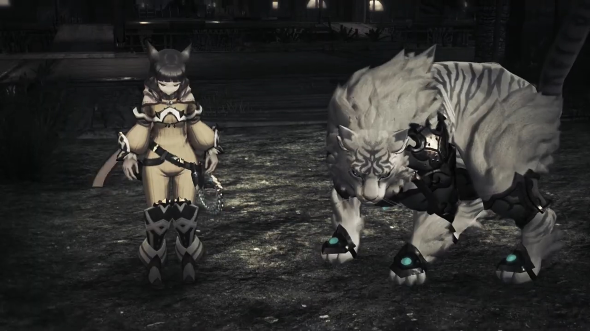

Oh, here they are! He felt a surge of relief, fears assuaged, the return of his friends. He believed he'll soon reunite with the rest. The first step is taken, the rest will fall into its place. His brain was so focused on the reunion it explain away any inconsistencies in their posture, "**Nia! Dromarch! I'm so glad you're...**"

"Why, Rex?" Nia asked in a depressed tone. 

"**Huh?**" His excitement was cut short. 

"You- told us Elysium **was real!**"

"My Lady and I traveled- allllll this way at _your_ behest. **Master** Rex, did you **intentionally** _deceive us?_"

"I trusted you, you know... **I came here because I trusted you!**"

His heart started to beat fast, cold sweat ran down his veins, wet his palm. Perplexed, he asked, "**N-Nia, Dromarch, what are you talking about?**"

"**How do you explain this?!**" Nia jumped on her feet, sniped at him. 

"**Y-you've got it wrong! I told you, I promised Pyra to-**" He tried to explain rationally. 

"**Pyra?** _Oh right, Pyra..._ Pyra... Pyra, Pyra, **Pyra! IS THAT IT?!!! YOU'VE ONLY GOT EYES FOR HER!!! GET YOUR HEAD OUT OF YOUR ARSE!!!**"

He was on the verge of tears, "**N-Nia, y-you're being weird! W-What is going on?!!**"

"My Lady has given up _everything_ for you, yet still you realize nothing. Even now, you cannot see." He looked down on the ground, had she? Had he not treated her fairly? Had he not told her he loved her? Was it not her whom joined him because, after a round of persuasion, she'd been convinced she'd nowhere to go, with Mor Ardain after her and the other Tornans, so she joined them? It's undeniable that Elysium was their goal at all times, but what about the drops and precipices _during_ their adventure? Had they not enjoyed it? Great fun, companionship? But why? 

"**I'VE BEEN HERE ALL ALONG!!! WHY WON'T YOU REALIZE?!!!**" She desperately cried out. He don't know what to say. "**LOOK!!! JUST LOOK AT ME, REX!!!**"

She drew out her weapon; he'd no choice but to fight. 

---

"I... I'm sorry!!!" She laid down, her hand clutched to her injuries. 

She climbed on her feet, forcingly asked, "Answer me, Rex! **Why did you lie to us?!**" He jumped a step back. 

"How could you betray our trust?!" 

Lie, trust, lie, trust, lie, betray, no, trust, no, betray, lie, betray. "Aa- **AAAAAAAGGGGGHHHHHH!!!**" He couldn't take it anymore. He ran into the distance, leaving them behind. 

---

Pant, pant, pant. His vision was narrowly focused on the ground, oblivious to the tall and short metallic pillars to both side of the road, still thinking of Nia and Dromarch's accusation. He hoped that his feet would bring such feelings away, that they're not real. And he stopped once more, exhausted. He still couldn't understand, "Why would... Nia... and Dromarch..."

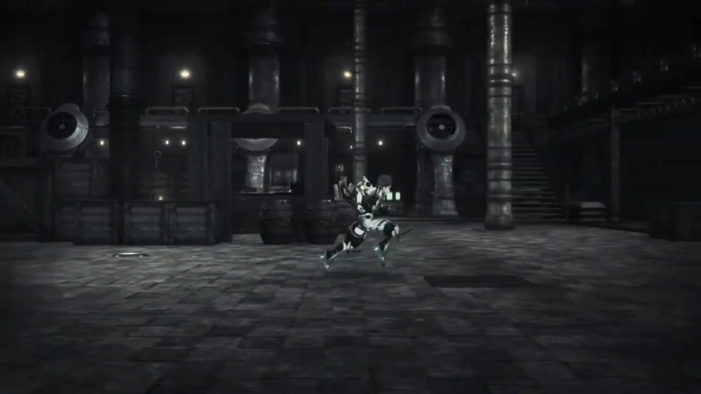

"You **reaaaaaally** are a fool."

"**AGGGHHH!!!**" He looked up and saw them approaching. "**Mòrag, Brighid...?**" Something was off. He scanned the surrounding, he saw this place before, but they're not supposed to be here. "_Huh?_ Mor Ardain?"

"You're so thoughtless."

"**Mòrag!!**" He was trying to figure out why they were here, but her words brought him back to the now and forget about the inconsistencies. 

"**Here** you are, **wasting time, and all the while my countrymen are**..."

Brighid accused, "Do you- have any idea what you've done?"

He grew more puzzled, "Wh... **what do you...**"

Mòrag continued, "**You just run ahead, without a thought for ANYONE ELSE, and THIS IS THE RESULT!!!**"

As if her words had power, the floor shook. Rex heard a crash in the distance. He tried to figure out what's happening when "**AGGGGGGHHHHHH!!!**" The ground below him collapsed, taking him with it, into oblivion. 

---

He felt the air gushed through him, he swallowed some large portion that inflated his stomach; the surrounding was veiled with blindingly bright light. 

Thud. He felt his body slammed against the ground. He could still feel; hurt, but not dead. "Urgh..." He climbed on his feet, listening to the thunderstorms in the background. Brighid and Mòrag appeared yet again in front of him. 

"I couldn't save anyone. _If only_ we hadn't come here, **I could have saved my people. I COULD HAVE SAVED NIALL!!! IF ONLY IT WEREN'T FOR YOU, REX!!!**" She drew out her truncheon. 

What had this got to do with him? He recalled, the last time he saw Mor Ardain, it was under Amalthus's control. Yet, hadn't it finally stopped? Hadn't they prepared for evacuation for years, even decades? The collapsing of Mor Ardain will take some time, long enough for most if not all of them to escape. Was it not her that asked him to trust in Niall? That he, an emperor, whom willingly risked his life to save his enemy, Queen Raqura, would know what to do when the time asked for it? They'd not even confirmed that Niall was dead, nor anyone else in Mor Ardain! They know nothing! Why would she said that? Was where they are now really Mor Ardain? He didn't saw anyone else except the three of them on the street, unless his memories play trick on him? Where were their corpses? 

But in the heat of the moment, he tried to convince her, at least to calm her down, "M-me? I didn't mean to-"

Brighid sniped, "I _hope_ you're **happy** now. _You've_ **dragged us** to some **EMPTY RUINS!!!**" He froze, and she continued in a second, "I hope that was worth **EVERYTHING WE SACRIFICED!!!**" The battle began. 

---

In a desperate voice, he pleaded, "**Please! Stop this... What's the use of fighting amongst ourselves now?!!!**"

"What's **THE USE?!!!**" Mòrag had an answer for him. "**FOR VENGEANCE!!! WHAT MORE REASON DO I NEED?!!!**"

"**Wha-?!!**" And now it's my fault? 

Brighid agreed, "That's right... **We must take our vengeance... For the thousands of lives you have STOLEN!!!**"

"**I... killed...?!! N-no, wait! I didn't-**"

"I'll have **your life FOR AN APOLOGY, REX!!!**"

Since when did he killed? He don't know, but "**AAAAARRRRGGGGGHHHHH!!!**" Once more, he ran away. He wasn't willing to fight them, but he was unwilling to face their wrath too. Though he don't understand where the accuse came from, why did they accuse him for. He could hear the muffled voice from behind even as he dashed as fast as his feet could bring him, 

"**Stop right there! How dare you run!**"

---

His eyes opened wide even when bright light hurts it. The pain he felt from the sudden change in brightness was much less than the pain of accusation. The environment once more returned to darkness, and he could make nothing around him. Nothing at all! 

"What is this place...? What's wrong with everyone...?" He stopped once more, looked around and shouted, "**Pyra! Mythra! Gramps!!! Where are you? Where are you guys?!!!**"

No reply. Wherever he looked, he saw darkness and emptiness. 

"Why Rex-Rex run?" Rex necked jolted around. He was standing between Poppi and Zeke. 

"Tora... Poppi... **Zeke and Pandoria... Don't tell me you're all...**" His tone full of desperation. He seriously needed someone to appreciate him at this moment. 

"You having fun, chum? **Playing the hero like the KID you are; STRINGING us adults along...**"

"**T-T-THAT'S NOT-**"

Tora cut him off before he could finish, "Rex-Rex is baaaad friend. Why Rex-Rex become **Driver, when Tora CANNOT become Driver?** Tora try **so hard, AND FOR WHAT? IT USELESS!!!**"

"Masterpon is right. Rex just have _a little luck_ and become **Driver of Aegis?** Poppi never ask to be born as **imitation. Poppi want to be REAL, TOO!!! Not. Fair!!!**"

Had he not made Poppi because for 3 generations, they cannot become driver? What had he to decide whether they become driver or not? Pure jealousy for his luck? And Poppi, Tora was so proud of Poppi, and now he's demeaning her? The sweat and blood of 3 generations made her alive, and she, given her life, now complaints that she's not real? If your Masterpon had became a driver, had you realize you wouldn't even come alive? 

"I bet it felt real good, didn't it?" Pandoria teased. "_Getting special treatment from everyone, getting chosen by the Aegis..._ Who decided you should have all that power? How about... you hand it over to the Prince right now? He deserves it!" Zeke looked at Rex with his nostrils, as if all those was what he deserves. 

Rex's courage was decimated, "**Stop it already! I did nothing wroooong to any of you!**"

Zeke smirked, "So you **haven't worked that out, either? In your HURRY to get here, you NEVER STOPPED to consider... ALL the things YOU LEFT LYING IN YOUR WAKE!!!**"

When did they ever had the time to stop? They stop, and the next moment, Malos would've taken over the world! Oh, how he wished he was _just_ the boy in the village, living with Pyra and Mythra, enjoying the tranquility and serenity. But Torna pushed them all along, threatened them to keep moving forward; circumstances brought them here, he'd not made the slightest push! Why would he had to hurry to bring Pyra to Elysium? He'd enjoyed their time together, and is it not his wish to elongate the time they'd spent with each other, to live in the endless now? No, he cannot understand, why would they've accused him for what isn't his choice, what isn't in his control? 

But they gave him no chance to rationally work that out calmly. Weapons were drawn; he was too exhausted and desperate to explain. Words can't get through to them; perhaps when the metallic sharp blades carved an inch on their arms would the pain return their mind to them. Perhaps only then will rationality return into their coconut head. 

---

"**ENOUGH! STOOOOOOPPPPPP!!!**" He closed his eyes and launched a burning sword at them. They put down their sword, watched themselves swallowed by the burning sword, and bust, into nothingness they went. 

"_Ah!_" What just happened. His desperation was replaced with intense guilt. No, he shouldn't have acted like that under pressure. He should have kept them safe at all times. And now their blood stained his palms; never in his life would he wash them clean. It would live with him forever. 

"**T-Tora! Poppi!**" But his hope weren't yet gone. His attacks may be strong, but he'd controlled the output, he believed. He dashed to the scene, went down and dug the soil with bare hands. But all he saw was dark patches of soil and dirt, nothing else. Deeper and deeper, inch by inch, he could see nothing else. No flesh, no meat, no bones, no remnants. They were burnt to ashes, became a part of the dust he breathe in and out. "No... I never wanted this! **Zeke! Pandoria! Ergh! Ergh! Ergh! Ergh!**"

He continued digging furiously; he cannot believe they would die so easily. Where are they? He promised, within his heart, that he would abide to their accusations if they would... if they would just come back. Please, come on, just come back. Whatever you say one'll listen. Whatever you want me to do, whatever favor, just... just come back...

"_What- are you- doing, Rex?_" Gramps voice echoed in the background, and again, bright light engulfed the scene. 

---

"Huh?" He stopped digging, stood up and looked around. How could he forgot where this place was? Even if it didn't immediately register, he'd stayed here for years it'd carved into his mind. Though it looked dark, and seldom did he come out during the dark that caused him to not register immediately. He looked at the eagle soaring far above the sky, blocking some of the starlight. "_Gramps... This place..._"

Yes, he'd worked here for 5 or more years as a salvager, day in, day out. The hut is there, the crane is there, the flesh is below his feet. Behind Gramps's back. 

He heard a whale song in the distance, the bellowing like wishing the world well before one part away with it, the intense love, hoping one could stay longer in this world but one couldn't. He turned to it; a whale-like Titan emerged from below the clouds, reached its peak height, its Core Crystal shone bright, before it dimmed, its iris dimmed, its life dimmed, and it slammed back into the water under gravity, sinking deeper and deeper towards Morytha, the waves it sent gushed and swayed Gramps. Rex could feel it. 

Gramps asked, "What... is the point?"

"_Uh, Gramps?_" He tilted his head, don't know what he's talking about. 

"**What-** is the point of us, really? We- are- born- as Blades, then return to our slumber, again, and again, over countless years... until we become- Titans, to wander this world for countless more... and at the end of it all, we sink _into nothingness._ **Have you- ever-** thought about it? What it means to exist for close to an eternity, with no- clear- purpose- or goal?"

"That's..." Hmm... Yeah, what's the point? We creatures that acquired language and a clear mind had to have a purpose to live, he convinced himself. Forget about those animals, dogs, cats, that willingly play for the whole day, or just do nothing for years, sleeping and eating, enjoying the sun, enjoying one another's company. We intelligent creatures -- humans, Blades, Titans -- set a clear goal and aim towards it, so we don't feel regret at the end of our life. Our ancestors had a clear goal to feed themselves and their family and their tribes, working till the end of their life. If we had no goal, why did Mother Nature grant us clear-mindedness? Why did She grant us the feeling of restlessness when we had no goal in mind? 

Gramps continued, "Must be nice to be human... Living for a limited time, thinking limited thoughts... it must be so much easier. **I envy your kind...** Just _think_, Rex, would you? **What would you do**- if you were me? Would you be happy- to drift around the ocean- with a **human**- on your back? **Is that- allllll- I am to be?**"

Rex dropped his head, the desperation of Gramps's voice echoed in his mind, weighted heavy in his heart. The logic seemed flawless; but he don't know. He felt there's something off, but he can't fathom what it is. A human on one's back is a companion, but sacrifice freedom for companionship? "_I-_**I don't know how I'm supposed to answer that! WHY ARE YOU ASKING ME?!!! YOU'RE BEING STRANGE... EVERYONE'S ACTING SO STRANGE!!!**"

He felt water rushed through his nostrils and mouth; he cannot breathe. He saw light shining through the water, bent with the waves. He felt the heavy weight on his head, on his chest, strength diminishing from his muscles, wearing away his body. He felt his clear-mindedness diminishing, sanity no longer. He thought for himself, perhaps, this is what they meant by mental breakdown. The sun grew brighter and brighter until it engulfed the scene. 

---

He opened his eyes, scanned the surrounding. What is it now? Who is it this time? Waterfall behind, the land, the trees... looked like Leftherian archipelago, but there's no village. No, it's not Fonsett. He listened to the insects finding for a mate, chirping in the tranquility. He looked at the house, the only, built on the edge of the island, against a backdrop of waterfall gushing down to oblivion, the sound of water hitting against one another muffled far below. The windows were illuminated orange. Candlelight, or ether lamp, maybe. The greenery calmed his mind, but not his heart. It was late evening, only a speckle of sunlight, reflecting through the surface of Alrest, gave a viewable hue to the objects in the surrounding from diving into total darkness. 

His eyes fixated on the house, on the door. Who's in it? What surprises awaits him within? He don't know, but he had to find out. He tried to walk as soft as possible, opened the door as softly as possible, to not attract any unwanted attention. It creaked slightly, and he took a peek. 

"Welcome back!" An excited tone called from behind. He knew this voice instinctively; oh no, he felt. Not again. No more... He looked at her hands. A pot of soup, presumably just carried out of the kitchen. He looked to the table where she's setting it down; 3 pairs of dining set prepared on it. A girl with long golden hair sat on the other side. She called out, 

 "You're late, Rex! Where did you wander off to?"

"Pyra, Mythra..." 

Pyra softly walked towards him, gave the door a push, and smilingly grabbed his wrist with both of hers, tugging him in while he was focused on her words, his legs moving under her control "Come on, let's go ahead and eat. I've cooked up a whooooole bunch of your favorites, I hope you've got room!"

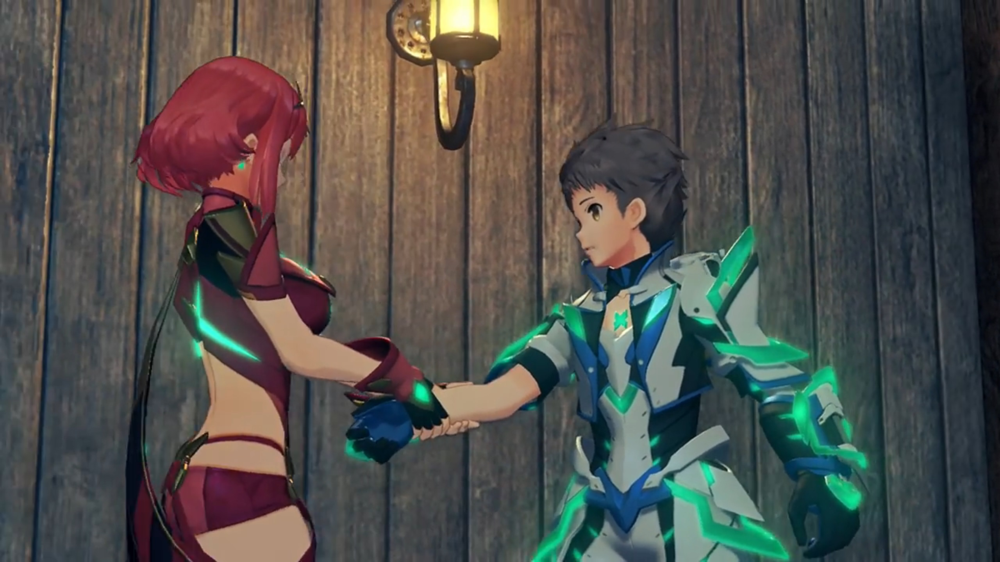

While entering, he turned to Mythra, whom was also smiling at him. He changed glance between her and Pyra, trying to notice any anomalies, any accuses they readied for him. Is this nice moments just the calmness before the storm? Were they wanting to numb his heart and mind first before giving him the blow-off? At least for now, he'd not detected any hostility from both of them. Though, Mythra looked more cheerful than the usual tsundere. Pyra acted more outgoing than the usual conservative. He looked at the food laid out on the table, slowly walking towards the chair Pyra led him to, careful to aim his ass at it, and sat himself down.{{footnote: The windows behind him revealed there were other house in the distance, ether lamp also emitted light and lit their windows bright.}}

Pyra watched as he settled down before going back into the kitchen, leaving him with Mythra. Rex watched Mythra took the ladle and filled the bowl with soup. Her attentiveness was beautiful. 

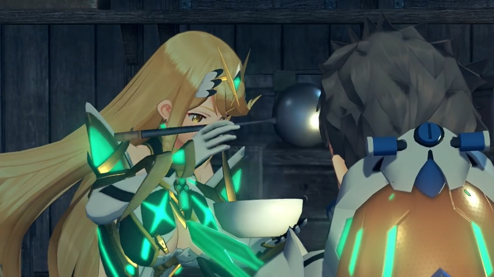

"Well, eat up!" She excitedly offered her the bowl of soup, held it in front of him. He was surprised for a moment, but held out his hand and received from her, placed it in front of him. He looked at his reflection, he could see his own sorrow in it. But the lukewarm of the soup felt real. Perhaps this is the real world; that what he'd experienced before was fake. Perhaps, maybe. He looked at her again; she reached for the basket and asked him, she asked, "Which kind of bread do you want?"

"Oh, _ah, um_..." He forced his wandering mind to focus on the present, utilizing his brain power to gaze through the different varieties offered to him. He bent forward, "Maybe this- and this-" He randomly pointed at two of them that appeal to his eyes. 

She took them out and "Theeeere you go." put them on his plate cheerfully. He could smell the fresh aroma that forced him salivating, though his stomach was twisted and sour. Her hospitality was a little off, but perhaps she's just... she's just... acting like that all the while, and he didn't notice it, perhaps. 

"Th-thanks..."

Pyra, meanwhile, relit the fire in the kitchen and was frying the final plates. 

Mythra cheerfully pulled out a bottle from below the table, asked, "**Hey**, do you want some wine? Oops, you're too young. _Silly me!_" She placed it beside the basket of bread and other stuffs. 

He could no longer suppress his doubt, asked, "Mythra, has- something happened?"

"Whaddya mean?" She clasped her hands together and placed her elbows on the table, her nose on the joints of her index fingers, and looked at him in his eyes. 

"I-it's just... you're a lot **nicer**- than normal..."

She blushed, behaved cutely, "_Stop it!_ I'm always nice to you, aren't I?"

His heart stopped pumping for the moment. "If... if you say so...?" 

Perhaps he'd misremembered how she behaved? Perhaps, after all the meanness he'd experienced before, her niceness stood out clearly. Before, when everyone was nice, her niceness was average; but now, she's extraordinary, he told himself. He didn't want to get her on the other side. He want her by his side, the last of his friends that didn't accuse him for reasons notwithstanding. He don't want her to blame him for what's not within his sphere of control. He muted himself, redirected his attention by reaching out for his bread, hoping that the hard bite on it would tell him it's real here. 

"Hey, Rex, come on!" His hands hadn't yet reached the bread when Pyra called out. He turned to her, wondering if this is the turning point. Though, her tone was still cheerful, though it cannot be denied she's giving him a lecture, "How can you sit down to eat without washing your hands first? That's a faux pas!" She put down the newly cooked dishes, put her hands on her waist, and instructed, "**Go- wash your hands, right now!**"

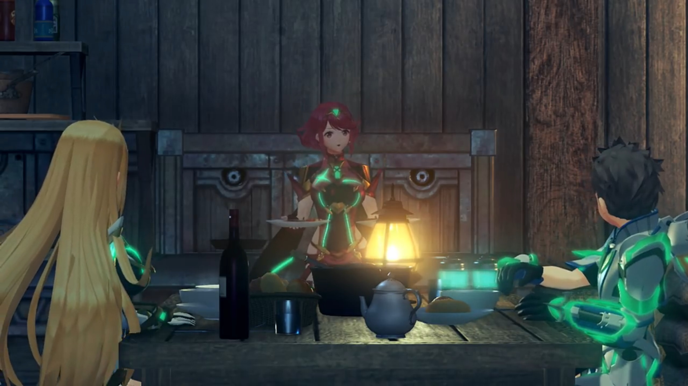

He confusingly apologized, "I, um... Sorry..." 

The ether lamp hung near the walls oscillate, its light revealed the rough texture of the shoddy-looking walls, seemingly patched carelessly by cement and clay. The sink was just below the lamp, and Rex scrubbed and scrubbed and scrubbed his hand, the cold water that flowed through his hands he cannot feel. What had happened to his friends, each and every one of them? Everyone seemed to demonstrate the darkest side of themselves, blaming all the darkness they live with to him. Sure, Pyra and Mythra were nice, but they were weird in other ways too. More subtle, he could feel, but he couldn't really tell what's off. The coldness running down his veins cleared his mind, his rationality returned, he tried to make out what's happening, where was he, where were they, and how to deal with it. All he wanted to know is how to get his friends back by his side, how to get them back to a personality he'd expected, and why would they've changed overnight, all at once? Why did he kept changing place in a split second? Where is he? What is the meaning of his life here? What's his calling? 

"You're acting almost like **Mythra** today, Pyra..." He told himself. 

It took him quite long. By the time he returned to the room, the dishes were already laid out, and in his plate, someone had placed a small portion of her newly cooked dishes on it. The two girls sat side by side on the other side of the table, their glance following him while he reached for his seat. He softly closed the door behind and walked over. Pyra asked, "Did you scrub them properly?"

"Yeah! They're clean." He loudly confirmed. 

"Great!" (She looked at Mythra, both nodded to each other.) "OK then, let's eat!"

"Thanks for the fooooddd!!" Mythra prayed to air. 

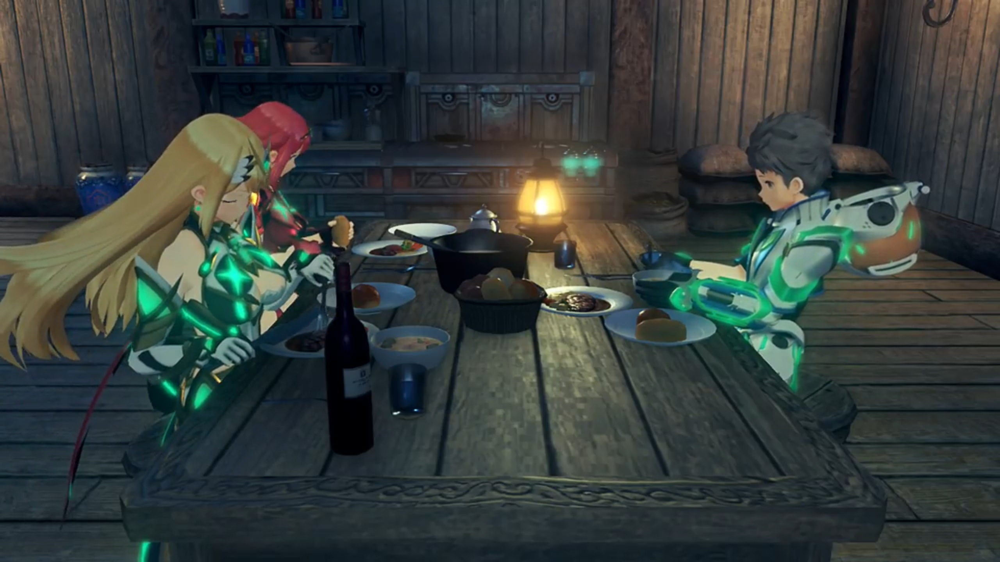

His eyes scanned the table, its colors, its aroma, he forced himself to start salivating. "Uhm... It looks really good..." He tried to forget what'd just happened, hoping the food would bring them away. He took the spoon and took a ladle from his bowl of soup. Mythra started eating cheerfully and carelessly, while Pyra being more conservative, carefully bringing the food to her mouth like a lady. 

He brought it to his lips, felt the taste blossomed on his taste bud, exclaimed, "**Tastes even better!**"

"Of course it does!" Pyra exclaimed. "After all, I made it myself." She smiled and winked at him. 

"Maybe I'll try **my** hand next time." Mythra decided, showing the spoon she's holding to him. 

Pyra launched on her immediately out of fear, "Mythra, **no**. You know how that **always** ends."

"**But carbon's good for you!**" She'd researched the nutrition of the food, and scientifically mixed the contents together to maximize the healthiness of her preparation. "Anyway, I wanna do something nice for Rex _too!_"

"**No cooking! Who's gonna save the world** if Rex gets the runs?"

"You're so mean... It was only that one time!" 

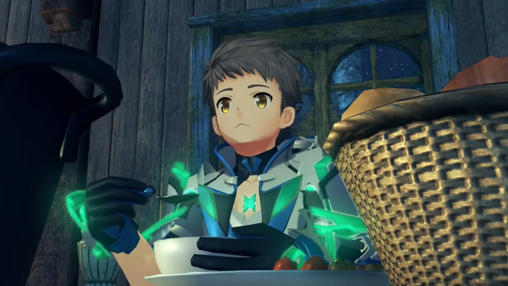

Their quarrels started his adrenal glands, pumping more adrenaline into his bloodstream. The joy of the food immediately pushed behind the back of his mind as the fear for what happened to his friends occupied yet again. Except this time, they were not accusing him, but each other, though their source of quarrel is him, and he had to stop it before it escalates into a fight, "Um, **it's OK**, you two. I don't care who cooks, I'm just- happy we're..." 

They stopped quarrelling, looking at him. 'We' was a heavy word for him. It reminded him of Nia and the others that had turned monstrous, abominable. He don't understand why. And it reminded him that, even though the two in front of him sounded familiar, but their personality seemed swapped. He looked at the table, at his soup, his tensed muscles relaxed and turned sore, as if a heavy weight was put on every single cell on his body, and he felt he was on the verge of collapsing, "_Happy we're..._"

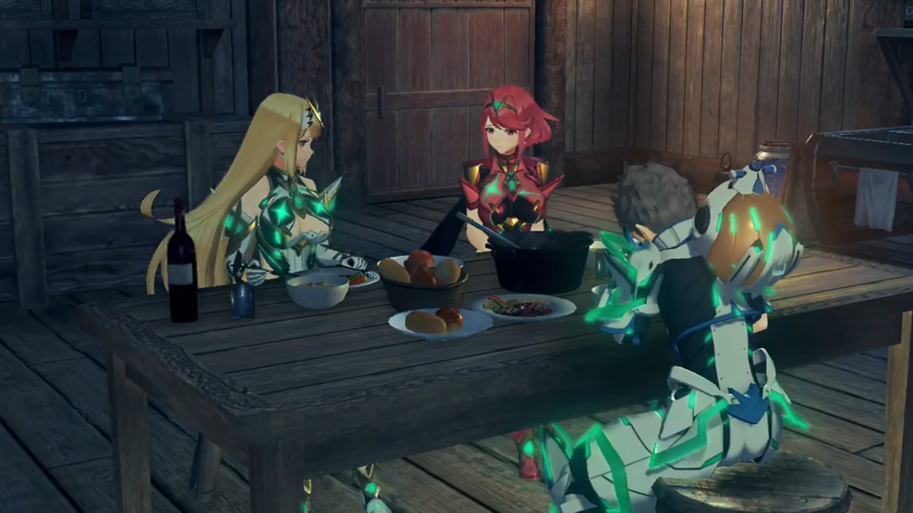

The tone of his voice opposed his words. He tried to convince himself to be happy, but he couldn't, not after what'd just happened. The tranquility of this world couldn't wash off his memories of the war-ridden of Mor Ardain, the hatred in each of his friend's face, their eyes. His hand dropped, together with his spoon. He felt the same like we during a heavy fever. He tried to snuff out his tears, but his nose kept blowing. He covered his face with his hand; he don't know what to do. Aimless. Uncontrollable. Unexpected. Desolation. 

Pyra and Mythra looked quietly at each other, Pyra more guilty than her sister. She started softly, "_Rex..._"

"It's so strange. I... I don't even know what I'm doing here any more. Everyone's all wrong! They all said I..." (Tears dripped from his eyes into his soup) "But now you two..."

They waited for him to cry for a while, seated quietly. He asked, "Did... did I go wrong somewhere?"

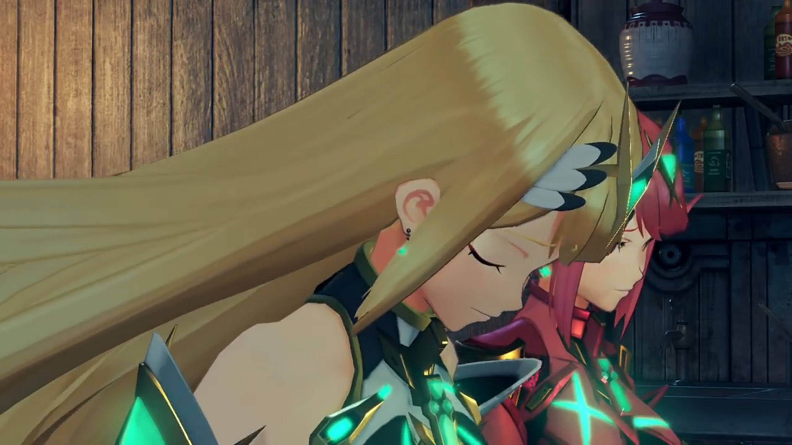

Pyra looked to the side, feeling unable to face him. Mythra felt she had an obligation; she calmly stood up from her seat, walked around the table, bent down and looked closely at him, seeing his welling tears rolling down his cheek, and with her glove, softly rubbed it away. 

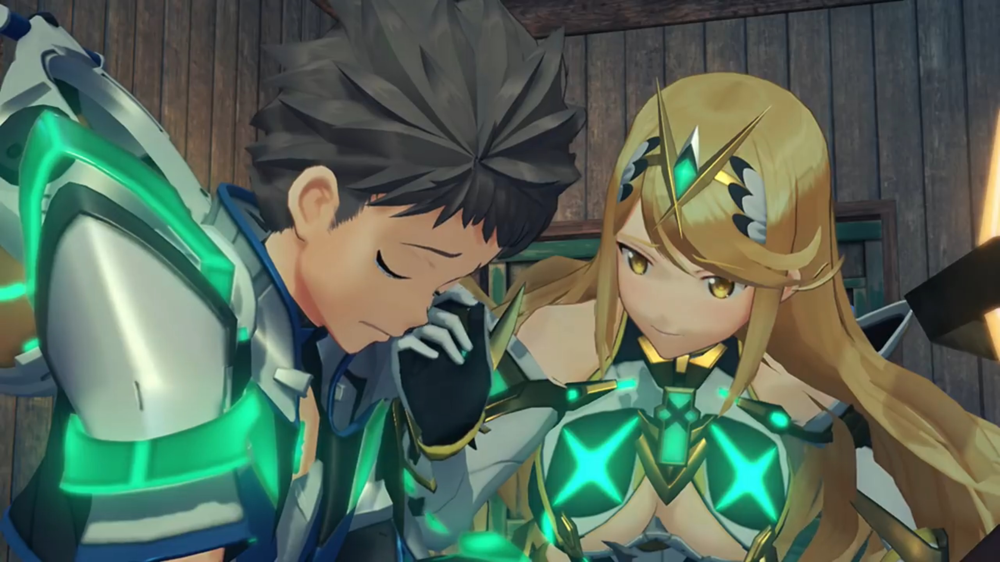

Pyra looked to the other side, felt her body shaking, tears welling in her eyes; to see her loved one being tortured, she cannot take it anymore. She asked to someone nonexistent in the room,

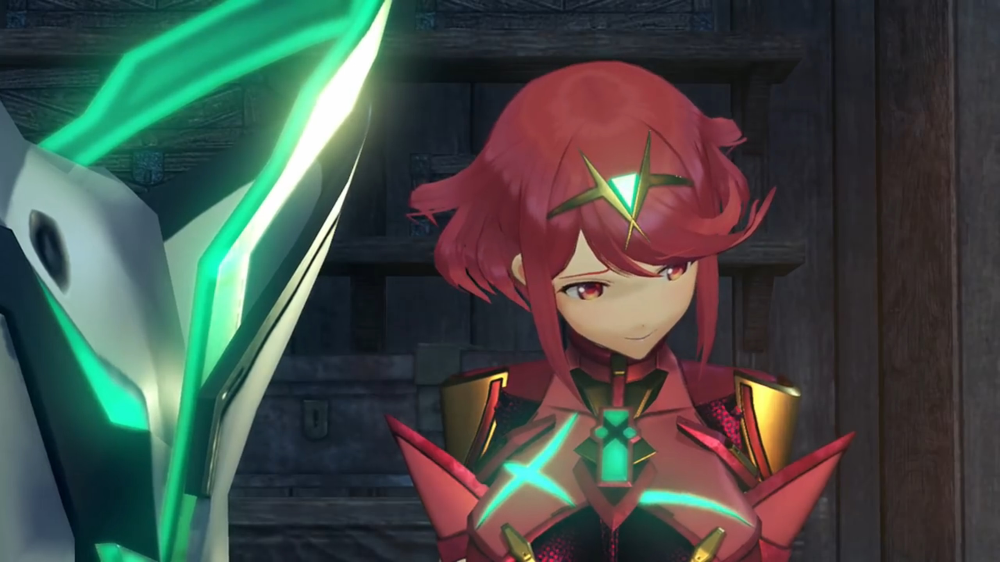

"I think... _that's enough._ (She looked up at the ceiling). Please, Father?"

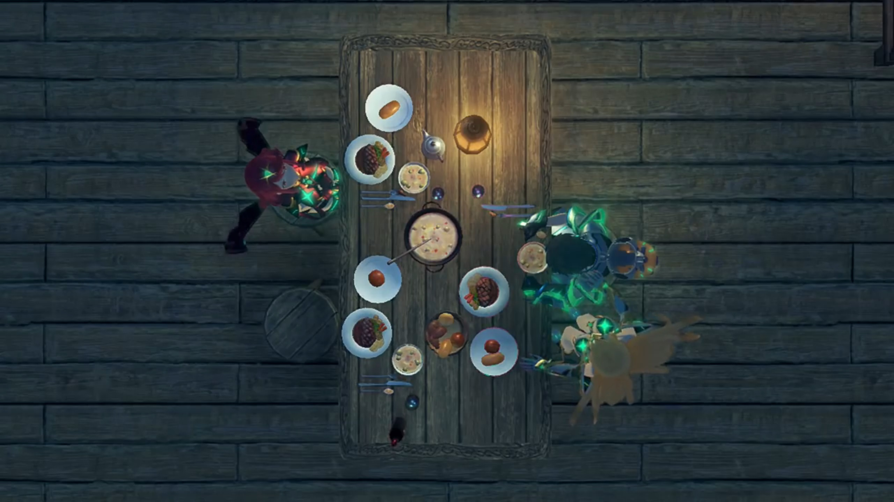

The lights went off. The curtains dropped. 

### Footnotes: