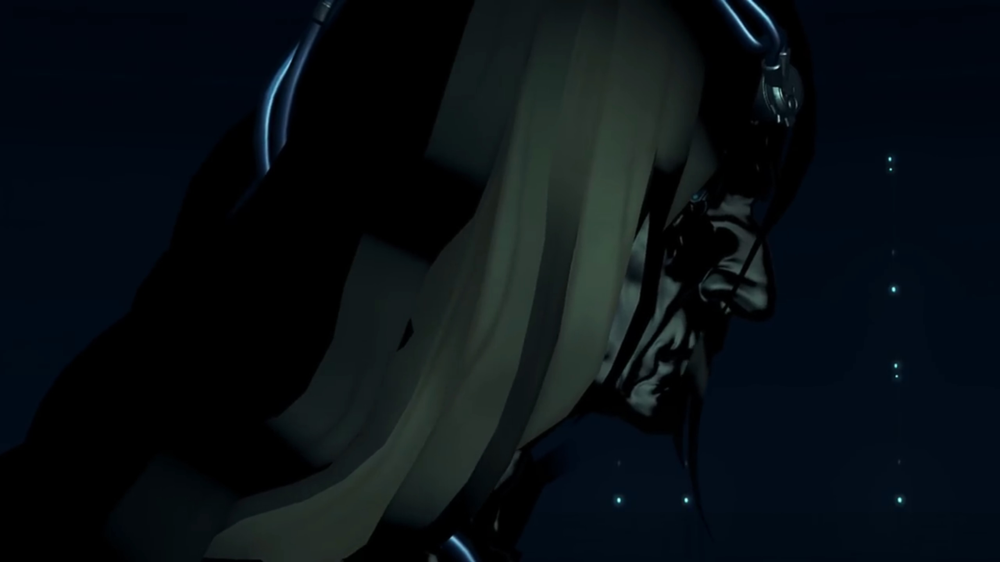
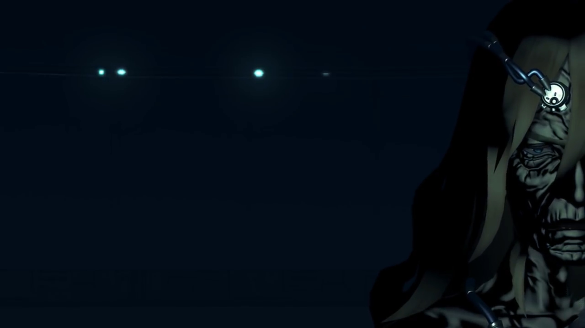
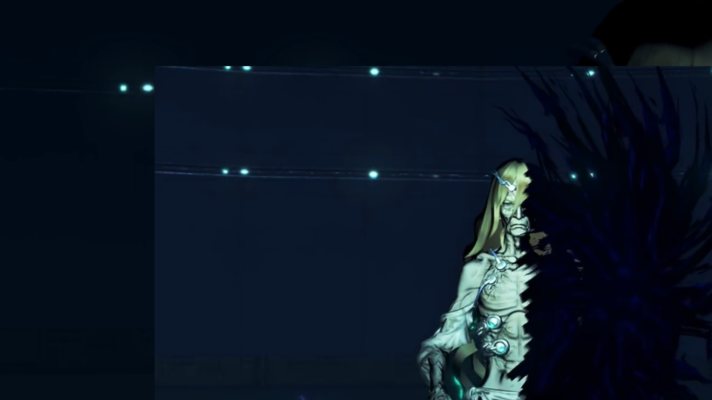
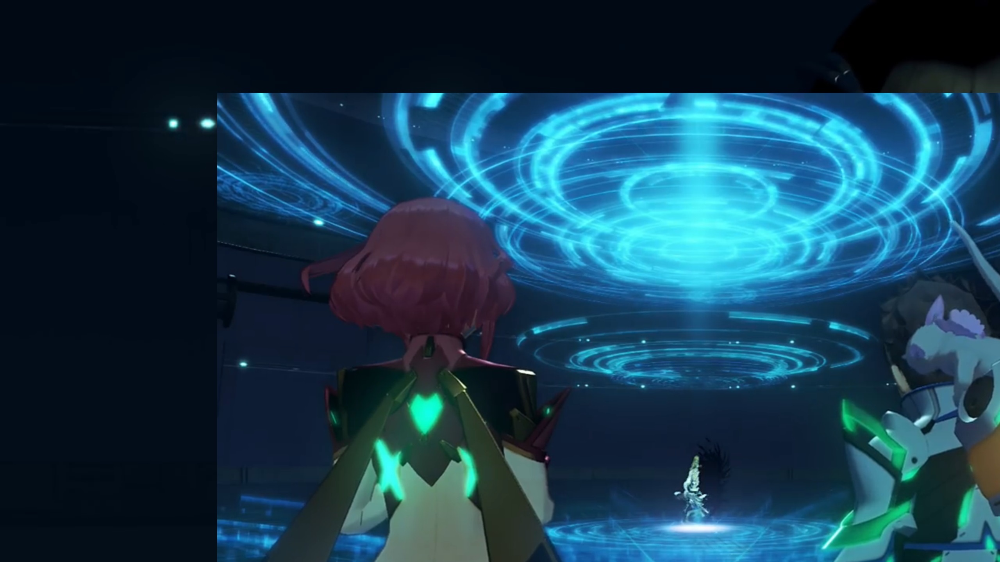
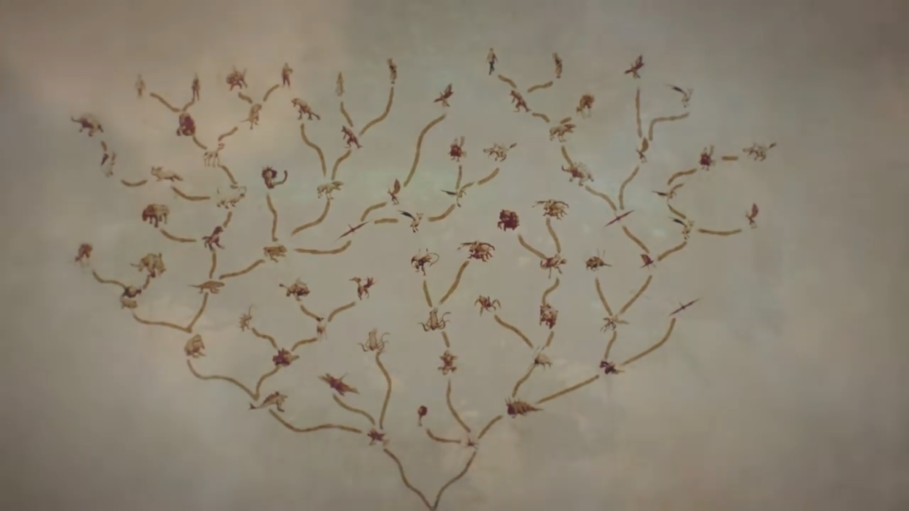

# The Architect

The spotlight turned on on Rex and Pyra. "_Huh?_" He peered over his shoulder, Gramps, in his larval state, sat still in his helmet. He looked at her; she crossed her palm, as if she was praying or appreciating, looking at the floor. One by one, the spotlight goes on -- Zeke, Pandoria, Dromarch, Nia, Brighid, Mòrag, Tora, Poppi -- they all looked at each other. Rex turned around, asked, "You guys..." 

Now this place looked normal, and they looked normal. He'd already forgotten about his mental breakdown. They're back, back to whom he recognize, whom he expect. 

"R-Rex..." Nia called out. 

Zeke hadn't woken up yet, "Why're we all **here**? I thought I was..."

Klaus, sitting in the dark, spoke again, "I merely wished... to examine the shapes of your hearts."

Rex looked at Pyra, trying to see if she knew something. Nope, he thought. They both turned to the darkness, "That voice..." Perhaps a door opened up, the dim neon light slid away from each other. "You're..."

Some glowing turquoise crystal moving in the dark. The guy introduced himself, "My name is Klaus. The Architect of this world." In the dark, we could merely see dark lines running down his bony neck, "I- have watched over you- alllll this time. I have seen your thoughts, your desires; the things you have achieved."

"So you did that, _just now?_"

"Yes. Those were not your present forms, but alternate possibilities. _Your other selves that **lie** within._ **That**- is what I wanted to see."

"Our other selves?" Zeke can't believe. "You mean we're all **thinking** stuff like that **deep down?** Was that how we **really** feel?"

"Then you saw it too?" Nia chimed in, assuming what he's looking at is the same as hers. 

"Looks like we were alllll shown the same kind of stuff." He hypothesized. "It creeped me out! **What're you trying to prove?**"

"Those... were the **fears** you harbor..."

"I- don't get it at all."

Dromarch got on his feet, prepared to poach, "What was your **purpose** in showing us this? Those were **not** pleasant visions to behold."

"My only purpose... was to find out... how mankind has changed... **and where it is** headed."

"And were you disappointed?" Mòrag wanted to know. 

"No..." There was something attached to his forehead, something shiny, connected to a chain-like mechanism, seen in the dark. Wrinkles grew all over his face. "As you stand before me right now... That- is who you are. That is enough."

"Architect, sir... **I came here** because I met **Pyra.** Is this **really** Elysium? Are you **really...**"

He knew what he wanted to know, demanded for his patience, "I will show you everything. Memories... Mine, and those of this planet."

---

> The Beanstalk, Rhadamanthus.  

"This world was once the stage... of a struggle for survival... that dwarfed this current predicament."

> The battle between the artifices.

"The world was an unseemly place, though glimpses of beauty persisted. What should people live for? **Who**- should they live for?"

> Secretary running around the offices; clerks working behind the panels. 

"They live for themselves. _To harbor desires- and struggle to realize them -- that is the natural state of man._"

> The quarrel between Klaus and Galea. 

"_But_- **I** did not think **that**- was good enough. **I** lost hope- for mankind. I searched tirelessly- for an outside solution. **And one day, I found it.** _The Conduit._"

> The bright cross. Klaus typing greedily on the integrated keyboard on the giant panel. 

"Why it chose to appear before us, I do not know. However, its existence- presented a new possibility..."

"Possibility?" Rex was curious. 

> Echelon Siren fighting other artifices. 

"Our world- was not the only one. **Endless** universes coexist, side- by side... yet all- **completely unaware** of one another. The Conduit... was **our** link to these... foreign worlds... And I- opened- that forbidden gateway... **praying, that it would change the world...**"

> Supernovae swallowed his world. 

"You have seen the plain- called Morytha, have you not? **That**- is what remains- of my world. When I opened the Conduit, many people- and many things... disappeared, into **distant** dimensions." _Rex and the others waited patiently for him to continue.) "All that remained here- were the ruins of Morytha..." 

He tuned the spotlight on him brighter and brighter, until it revealed his current state, "and half of my body."

The chains earlier, thought to be chains, connected to his forehead, was actually some medical-looking equipment. It attached not only to his forehead but also to his chest. He was skinny, bony, devoid of any muscles, his face wrinkled. He sat crossed legs, the other half of his body swallowed by a void that continually suck on this half of his body.

Everyone jumped on their feet, feeling sorry for his destitute state. Pyra gasped. Atop and below him, some blue circular rings grew and spanned out. 

Rex: "Your... body?"

"Half of me... lives on in some **other**- dimension. But... not for much longer."

"What do you mean?" Mòrag wanted to know. 

"The moment of my other self's demise... draws near."

"Father, you..."

"I was a fool... **Because of** my foolishness, I lost- **everything**. Left here, alone and _broken_, I longed for oblivion, _but even that eluded me._" (He looked up at the stack of rings above his head, said,) "**This**... is my punishment. Retribution from on high, **for the sin** I have committed..."

"On high?" Why on high? Rex wondered. 

"There was only one thing I could do... I had to atone- for my sin... **I swore**- to restore this world." 

The rings of circles zipped in and disappeared. The room returned to darkness. "The first thing I created, was a special particulate substance with the ability to restore deteriorated matter."

> 60-sided atoms{{footnote: One made this up.}} in huge quantity coagulate and spread out. 

"**You** all know it- as the Cloud Sea. The Cloud Sea can **disassemble matter** it comes in contact with, and rebuild it- in the image of **all** the things- that once made up this world. This way, little by little I could rebuild the world I had brought to ruin..."

> Morytha. Blue flames engulfed buildings from top to bottom, evaporating motes in giant quantities. What's left from the burning is refurbished buildings. 

"Next, I began to *recreate* life. I gathered miniature vessels- containing memories of **all** this planet's former lifeforms..." (A cubic core crystal materialized in his hand, and he dropped it to the oblivion below. It split into many different-shaped smaller crystals, rained down onto the Cloud Sea.) "...and I scattered them **across** the Cloud Sea. **These**- are the Core Crystals."

The group watched in awe as the raining Core Crystals flowed through the room like meteorites. Awesome view they'd never seen before!{{footnote: Cinematic 3D scene he can do with the room.}}

"The Crystals bonded with the Cloud Sea's particulate reconstructors..." 

> More and more 60-sided atoms gathered together and formed larger complex, eventually forming chains in double-helix structure. 

"and formed the nuclei of new life. Those nuclei developed into minute lifeforms -- the Titans -- who would over time... grow larger- and larger. Finally, the Titans gave birth... to complex organisms, **based on** the data in their Core Crystals. This newly-birthed life, over untold millennia... evolved into a new breed of mankind."

The tree of evolution shaped exactly like the World Tree, spreading out its branches. 

Mòrag now understood a little, but she wasn't very enlightened,{{footnote: As far as we can tell from her facial expression.}} "So that's how we came to live in this world..."

"But... I did not trust this world, **born**- as it had **been**. **What if** it were to **repeat OUR mistakes?** What if... _someone like me_- appeared? **To stave off these doubts, I implemented one final measure...** And so the Blades were born."

"**HUH!!!**" Rex was suddenly enlightened. 

> The Trinity Processor.

"Ontos, Logos, and Pneuma... the three cores of the Trinity Processor formed their cornerstone. However, Ontos triggered a space-time transition event, and disappeared- forever{{footnote: With his other half of his body; they're in the same world.}}. I was left with the other two, Logos and Pneuma, entrusting them with managing the Blades."

> The door to the room that hosted the Trinity Processor opened wide, bright light shining through; we could see someone leaving the room. 

"Malos- and Pyra. Those, are the names that *you now* know them under."

"_So, I am... Pneuma..._" Klaus nodded. 

Dromarch was very thoughtful of the words he'd used, clarified, "'Managing'?"

"The Core Crystals- at the heart of **each** Blade- are tasked... with relaying **all** kinds of information- to Logos- and Pneuma. About the selection pressures of the outside world, and the biological status of their bonded human, but **also** the **experiences and emotions** they share."

> Haze and Lora, Addam and Mythra, chatting, or just doing their own things, enjoying each other's company over their food. How they acted, how they reacted. 
> 
> Jin and Lora surrounded by Tornans. 
> 
> Rex and Gramps. 

"As the data continually accrues, **new evolutionary code** is sent back to the Core Crystals, and this code is used to _create new, further evolved Blades._ These Blades, too, become Titans, in time... and create new generations of lifeforms."{{footnote: By 'cleansing' the Core Crystals, these data were gone, at least locally in their core crystal, so they started from scratch once again, snuffing out the cycle.}}

> Rex, accompanied by Tora and Pyra, with Roc.
> 
> The resonance between the boy and the Core Crystal in Gormott.
> 
> The death of a Titan, Vandham dug out the Core Crystal from it and showed it to them. 

"This... was the new circle of life I had created."

Gramps was impressed, "A **GRAAAAND** scheme... **It boggles the mind** a tad!"

Rex concluded, "So- we were all born from this- endless cycle of life... To replace the victims- of the previous world."

"That's right. But there were also... a handful of survivors. I believe you saw them when you were in Morytha. The unfortunate ones- who clung to life..."

> Rex and the others fell one of the strong monsters -- they would've died if Zeke and the rest hadn't reunited with them on time. Rex picked up a dog tag from the monster after all of them left, curious about it, and kept it to himself when Tora called out. 

Rex now joined the dots, "_Ahhh!_ You mean those monsters... **Were** they... originally people?"

"Core Crystals- were first conceived- as a replacement for human brain cells. A product of mankind's **age-old** quest- for immortality."

Mòrag immediately concluded after he stopped speaking, "_And that's what became of them...? How awful._"

"But that technology- became the starting point- for the creation of Blades- and Titans."

Gramps felt that "Soooo- in one sense, their sacrifice- was not in vain... **Though**- not all- may- see it as such."

Dromarch wanted to know, "So, tell us, in the end... **Did we** develop- as you had hoped?"

"What do you think?"

"I... _couldn't possibly..._"

He leaned closer towards them, "Well... Those phantasms which you all experienced earlier... **Those are feelings- that lurk in all of your hearts...** As well as that man, Amalthus's..."

> Young Amalthus grabbed onto his mom's hand and ran, continually looking behind; were the pursuers catching up with them? 

"When a person loses something, they cannot help but seek a reason why."

> Young Amalthus, swiping his hand over his mom's eyes, closed it forever. He picked up a rock and walked quietly to the dozing pursuers, ending them in sweet sweet dream. 

"Within themselves, or in others..."

> One of the injured guy he helped wrapped his bandage held his knife high, aiming at the crying baby. Amalthus caught it in his arm; the guy looking back to see who's stopping him, and saw an emotionless to-be-Praetor. 
> 
> Amalthus slowly raised his index finger over his mouth; the baby stopped crying loudly, although the burps from crying aftermath weren't really controllable. 

"They seek a concrete answer to the question..."

> Klaus quarrelling with Galea. 

"...of who they really are, deep- inside."

> Galea hugged Klaus from behind; Klaus roughly threw her away. 

"Such a very lonely existence..."

> He focused on the screen and the Conduit, and after finish typing on the keyboard, waited a full second before pressing ENTER. 
> 
> Lora stretched out her hands and used her body as a meat shield to protect Jin. Jin quickly took her injured body and dragged them to safety. 

"...but perhaps... that is what it is to be human... All this data passsssed through me, and I knew." Klaus closed his eyes, looking down. 

"_Huh..._" Rex don't know what to say. 

"All of you. You were not in any way different from us, before."

"_Huh..._" Rex's eyes widened. 

"That's why- I did not intervene... 500 years ago, when the man **finally** arrived here... I did nothing when he took away Logos- and Pneuma. I stood and watched as Logos, instantiated into Blade form, set out to purrrrge the world."

"You don't make sense! Didn't you go to all that trouble to **rebuild** it? Then, why would you-"

"_It is fate._"

"**Fate?**"

"It is fated- to happen. **_It cannot but happen._** My atonement... was doomed- from the start." The moment he wanted to create an intelligent species called _human_...

Pyra felt hearthurt, "That can't be..."

"I had made my peace with it. Once more, I longed for nothing more- than to disappear. However... Something has now changed. And that is **you**, Rex. You- and Pneuma."

"**Me?** And... Pyra and Mythra...?" They looked at each other, didn't understand what he meant. 

"You reforged your bond in a way I had not thought possible. And the life you share..." 

> Her giving away half of her Core Crystal to Rex. 

"Moreover, The Conduit, which fell into a **stubborn** silence- after the world's end, has begun stirring once more. Rex..." (He waited for his words.) "The power you and Pneuma exercise... is the Conduit's power. It comes leaking out of some- far-flung dimension. And it is a power _we can know nothing about..._ But with its help, the world **may be** about to change."

While they were speaking, 3 artifices Siren, floating on the outer ring of Rhadamanthus, aimed their cannons on Alrest and shot their beams. Rhadamanthus shook, perhaps from Newton's 3rd Law, and the room the group and Klaus was in started shaking. The group kept at their feet, trying to rebalance themselves. 

Rex looked around, trying to figure out "What's all this shaking-?!"

Klaus, with his all-seeing eyes, answered calmly, "It is Logos... Malos, trying to destroy this world- and everything in it."

"**What?!**"

"Remember, at heart he is but an information processing unit, neither good nor evil. He is driven- by a certain impulse... The despair- that the man named Amalthus felt."

"I see... So it was **right**. What I **felt back then**, I mean."

"_Rex..._" Pyra may have heard it from him or from the others; she wasn't there when he told about it first{{footnote: She was having an audience with Amalthus, alone}}, nor when he repeated it the 2nd time{{footnote: if one remembers correctly, in the depths of Spirit Crucible Elpys}}. 

"Rex... What is it you desire?"

With full confidence, he answered, "What else? To stop Malos."

"And- if you succeed?"

"I'll punch him in his stupid face, and then..." (His eyes rolled for a while, thinking for a moment, before answering,) "...probably get a drink with him or something. That's the Sixth rule of the Salvager's Code." (The Architect's eyes widened a bit. Rex optimistically continued) "First have a punch out, then drink to forget. Once you've forgotten, the friendship's all set!" (As if he recalled what Mythra brought to him earlier in the test and she put it aside, he looked at Pyra first before at the others, rubbing his nose) "I'm... not old enough to _drink yet though..._"

Klaus wasn't emotionally roused, he emotionlessly answered, "I see... Pneuma..." (Pyra looked up, wanting to know what's gotta do with her. Rex turned to look at her.) "No, I should call you Pyra and Mythra."

Her smile widened at such recognition, the more familiar names she recognized with, she asked, "What is it?"

"I want to apologize, for having burdened you- with all this."

"_Don't worry._ We're actually grateful." (She started walking towards him.) "Thanks to you, Father, we got to meet Rex- and everyone else." (She stopped 3 arm-lengths away.) "Those are cherished memories."

There was a thin smile on his face. He raised his only arm and Pyra's crystal on her chest and her head started glowing bright, transforming into Pneuma. "Father..."

"I have transferred all of Elysium's data and authorizations to you. _Make me proud._"

"We will."

"Rex."

"Yes?"

"I will disappear soon. When I do, the Conduit will likely disappear from this world. You will not be able to use your power- forever."

"I understand. **We'll make do** somehow."

"_I'm counting on you..._" He nodded unwaveringly, holding his trust high. 

Pneuma turned to her Father. He nodded at her softly. She winked, and together, they dashed for the door. Before exiting, Rex stopped, turned around and shouted, "**Klaus!**"

"_Hm?_" The others turned around and waited for him. 

"**Have you changed your mind about this world?**"

"Right now..." (He looked down on the floor before looking back at them.) "_I think... I am glad I met you all._"

"Got it. Then- **our answers match! Thank you, for giving us all life.**" 

His mouth opened gaped a little, surprised. His eyelid sagged; for the first time in eons, he once more felt the feeling called appreciation. The group turned around and continued for the door, time seemed to slow down in Klaus's eyes. He thought for a really, really long time, "_Perhaps... Perhaps I will be able to face you again... (He looked to the top of the ceiling, thinking of the one whom loved him) Galea..._"

### Footnotes: