# Defeating Malos, "I'm Sorry, Rex!"

Exiting the room, Rex immediately asked, "**Pyra, where's Malos?**"

Without hesitating, she answered, "If he is here, I **know** where he must have gone..."

"Where is it? _Tell us!_" He impatiently probed. 

She don't let him wait long, "The _greatest_ of all Artifices. The Artifice that exists **solely** to destroy the world... Aion."

"_Aion...?_ So that's what Malos meant!"

A room lit only by the dark neon lines that ran along the edge of the platform, across the bridge crossing a moat surrounding the cylindrical island, Malos stood on the ground, looking at the giant artifice heating itself up. He had waited this time for so long; finally, he can lay his hand on it. 

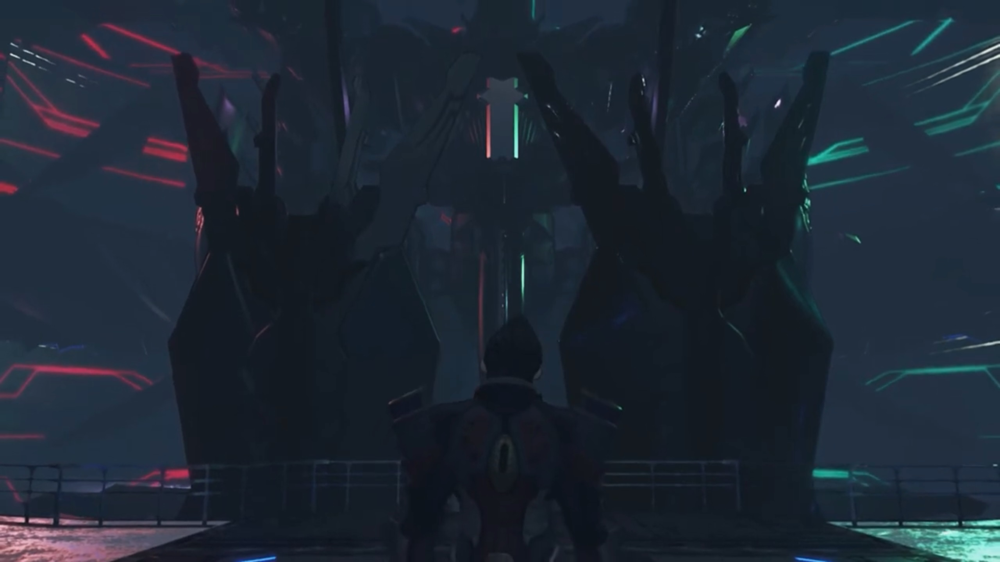

Rex: "Then- **that's where we'll go!**"

---

The path that leads to Aion wasn't direct. They first had to cross multiple rooms towards the outer ring of Rhadamanthus, travel along the rings, before they can reenter into the depth. The outer ring consisted of large glass panes that formed a dome, allowing people in the interior to look outside. And when Rex and the others first arrived, they saw multiple sirens arranged in a row, aiming their barrels on Alrest, and fired particle beams. 

On the ground, inhabitants of all Titans watched as pillars of light descended the sky, targeting where densities were highest, wiping out lives without guilt. Their property crumbled before their eyes, their friends screamed into their ears, but all they could do were run, run, run for their dear lives; the unfortunate joined them seconds latter. Not a piece of land was sacred under God's anger. 

Brighid: "Are all of those Sirens...?!"

Mòrag never thought he meant it for real, "He's really trying to destroy all- of Alrest..."

From higher in space, red hell-like artifices, similar to those controlled by Malos 500 years ago, descended past the Sirens, reentering Alrest in swarms. Their time was running out, Rex urged, "**LET'S HURRY, GUYYYYSSSS!!!**" They forced their attention back to what's in their control. 

---

The tonne-heavy metallic door rolled up with the help of pulleys. The feathers under Aion's wing lit the room brighter. It had warmed up. The familiar figure stood on the platform, enjoying the ultimate creation. 

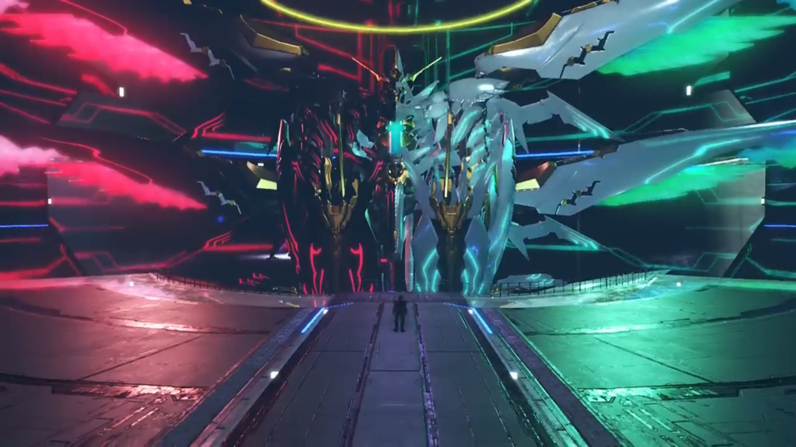

"**Malos!**"

He turned around and faced them, "**Just in time for the final act,** boy! I've saved you the **best seats in the house.**"

"Grrr..."

That reminded him, "**Huh!** I sounded just like Akhos for a moment there."

Nia: "Akhos is _dead_, you bastard. So is Patroka,... and Jin..."

He emotionlessly replied, "Figured as much."

"Is that _all?_"

"_What?_ You want me to **weep** and deliver a eulogy? **What good would _that_ do? They all desired oblivion,** and now they _achieved_ it. Least I **can do**, is send them off _with a smile._"

Rex tried to wake him up, "Malos... Is this **really** what you want?"

"_Huh?_" Perplexed. 

"**Is this what YOU want, Malos?!**"

Nervousness rose with uncertainty, he crossed his arms, "_I... don't understand the question._"

"You must understand by now? That **none of this** is your own will."

"_Hmph!_"

"You have to see **all of this came from Amalthus!**"

"Even if that's true, _so what?_ **And don't give me some weak-ass crap about how I should repent or whatever.**"

"Why don't you want to hear the truth?"

"_Here's the thing._" He put down his arms, took a deep breathe, and sliced his arm diagonally in front of him. "I don't give a **rat's ass WHAT YOU THINK, BRAT!!!**" 

The floor shook. The mellow sound of ether pumping into the furnace, compressed, and ejected, filled the room. The group clutched hard to their hearts, gently recovering from their shock, he continued, "So Blades become Titans? **And Titans give life** to humans?... Honestly, who even _gives a damn? They can become whatever they want... But **that** man... He'd lost **everything**._"

> Torrents of rain fell on roofs and the floor. The tingles of cold, the tightly compressed hood that stuck to one's skin and blocked every single breathing air holes, could not wake the beggar's unconscious will to live. If not for his words so familiar, he wouldn't have looked up, and Malos wouldn't noticed the dullness in his eyes, the eyes without any light, without a glint of hope. 

"_He no longer wanted anything._ He didn't even want to live any more. And despite that..." (He look at his fist, gripped his fingers together, compressing until his nails bit into his skin.) "His _life_, was the one thing _he hadn't lost._" (He bit his lips hard.) "**Because he couldn't!**"

> "_Jin... the thought of you- forgetting me, it's like one heart... is being ripped in two._"

"_Words can be a curse. That curse was what kept him tied down here._ A wretched tale, isn't it? This whole world is a _wretched- place!_"

Gramps tried to remind him, "Do not forget that you too are **a part** of that world. If it were not for _you_, for _Amalthus_, both Jin and Lora's lives may have taken quite different paths."

Pneuma looked down on the ground. If she had not get mad on that day, and used that cursed power that even Addam couldn't control, perhaps Torna Titan would not sink, and perhaps their life would have played out differently. 

Malos agreed with Gramps, "_Exactly! That's exactly it!_ **You've gotten smarter with age, huh?** _I'm a wretched being too!_ **A hideous monster, FAR BEYOND SAVING!!!** So... (His hands dropped, as if he'd lost his muscles.) let's- end- this- now."His core crystal grew bright as he floated up the sky. 

Pneuma pressed her final efforts to evoke his emotions, "Don't you feel anything? Father's sadness? **The world** he longed for?"

But he'd already made up his mind, and nothing, one repeat, nothing, would change his mind, "**HOW- COULD I?** That isn't... my 'role' in this world."

Mòrag: "_This man..._ Does he mean to...?!"

Aion stood up straight, stretching its wings apart like a peacock looking to mate. Both sides have tentacles like that of an octopus that stretched from where its wings were, wavering in the air like Kraken taking a toll on the ships. Both sides have giant palms, like that of Buddha's, that can seal any being (com-)pressed under it. 

Malos floated up a trajectory into the control room within Aion's Core Crystal. Reaching just in front of the crystal, he paused and shouted, "**Come at me, kid! COME, MY PARTNER!!!** Give me all you've got... **_You_- better show me all of it! The extend of your will! SHOW ME WHY YOU'RE HERE IN THIS WORLD!!!**" And Aion woke to its full potential, grabbed its fist, and a ring of angel floated up and formed atop it. 

---

Electric sparkled on Aion's surface. Tora aimed Poppi's grenade, amplified by Mòrag and Brighid's flames, hoping to break in and deal some damage. Aion swung its tentacles and aimed its tips at the group, crossed, and shot beams that dragged along the ground, missing all but Zeke and Pandoria. 

"**ARGH!!**" They put their hands on their chest where it scorched red hot. 

"You're not burning anyone today!" Nia's ether felt like a soothing balm applied on an open wound, cool and icy and refreshing; without dwelling in it, they stood on their feet yet again. 

"**MY LADY!!!**" Of course Malos knew the annoyance of her abilities, aimed both head of the tentacles like snakes slithered up and bow its body before performing an attack. Dromarch swung his feet beyond tolerable angles to raise a shield behind her in time, and get whipped down himself, dragging along the cold metallic floor. 

"Dromarch!"

He stood up, "Don't trouble yourself, it's... (he bit his tongue) **nothing!**"

The heaven-side tentacles hadn't given up wiping her out, swirled around and prepared for another attack. A grenade suddenly appeared where he aimed, and upon contact, exploded, confusing its sensors. As fast as Poppi's biter could, he fired the grenades, treating it like a semi-auto machine gun. Poppi continuously focused on transferring her power to the biter while Tora aimed and shot at what he thought was the weak spot{{footnote: 七寸}} of the hell-side tentacles. 

The tentacle wiped in front of Aion's eyes, temporarily blocking his attacks, but also blocking his sight. A bright light shone in from the tiny window above the room; Malos looked up and saw a beam descended, transferring power to Rex's sword that aimed at the sky. "**ARRRRGGHHHHH!!!**" When all was absorbed, he slashed at Aion's Core Crystal. Vast amount of ether spluttered out, alongside exploding flames. He sliced and sliced and sliced, again and again, at the same location, asking concurrently, "**Can you still... not see?!**"

The final hit penetrated its surface armor, shook the control room. Malos acquired a horse-stand posture, preventing himself from hitting the floor. That was a hard hit on his face; when his attention refocused on the boy, he commanded the heaven-side tentacle to sway furiously at him; but the tentacle was huge and the target was small, moving faster than the tentacle can change direction, adeptly dodging after forecasting its path. 

"Stop the Artifice! **Malos!**" Aion raised its hand to defend another attack aimed at its core crystal. Explosion happened, but only its outer hull was affected; everything underneath it still worked perfectly. 

"**See what, brat? The world's never gonna change... if that's all you got!**"

Mor Ardain. Buildings bursting in flames, Malos's artifices stomped their feet, shepherding the people along their planned path of escape. More and more descended; if they were real people, they would have smirked and enjoyed the panic on their face, trying to find an escape route but realized there's no escape after all, that it had all been a game of massacre. But no, robots don't have emotions, and the people were aiming for the plains, the outskirts. 

Niall, his frail body stood strong, ushering his people the direction of escape, facing the stomping monster himself. 

Tantal. The artifices that descended had no mercy on preserving the ancient city that stood since time beyond comprehension. Laid to waste, they soared above the sky, like eagles preying for worms on the ground. Near the entrance at the square, Zeke's dad ushered his people to go, his eyes fixated on the monsters that disturbed the kingdom's peace.{{footnote: God knows, how the people so hungry had the power to run for their lives. Perhaps that's how our ancestors grew up with -- you hungry, you hunt, then only you can salve your hunger.}} Perhaps this is the price he had to pay for his ancestry's folly, that the kingdom cannot stay sealed forever, that peace is the exception, and the rule of the dark forest the common. 

Queen Raqura stood on the balcony of her castle, accompanied by her sidekicks, watched the nature-grown city raging in flames. A tightly packed city made of wood fueled the flames, spreading at rates beyond extinguishable. But here she is, nothing she could do aside watching effetely at the artifices scouring for any hidden inhabitants, its mind forever occupied by a will to wipe out humanity. She nodded to the captain soldiers that gathered in front of her -- they will do their best to buy time for the weak. If not they, then who? She looked beyond the translucent membrane atop, wondering when will it end, but could only hope the Aegis could take care of it, and fast. 

The rest of the group stopped fighting, leaving Rex to deal with him one on one. More and more dent on Aion's armor, still no damage on its internals. Aiming for the incoming palm, Rex believe stayed strong, "**It will change! I will change it!** That's the reason... we've come all this way!"

Some attacks later, the heaven fist punched at him, came in contact with his sword, and as they split, ether back-flowed its veins, temporarily disabling it. Malos felt his body, along with the artifice, tilted back. He stretched his muscles, forcing himself to come back up, annoyingly shouted, "**Why don't you just LET IT GO?!!! Who do you think you're doing this for?!**" 

Pneuma closed in on Rex, maximizing the power she could transfer at short distance. Aion raised both its tentacles, parallel to each other, slicing at them both. They left not a dent on Pneuma's shield. 

"I'm doing it... for myself. If it helps put smiles on people's face... **Helps them live their lives together... Then that's my 'role' in this WORLDDDDDDD!!!**"

The Conduit once more descended power to his sword, and again Aion's Core Crystal suffered a blow. Malos remained unscathed, looked over his nostrils down at the boy, controlling the hands to defend. 

"Jin told me to take care of you... **in his place, you know. Jin- never- wanted to die...**" (Malos looked at his eyes.) "**He just wanted to connect with you!**" (He gritted his teeth. Are you saying that one interpreted it wrongly? It can't be, one's always right!) "**He did it... because YOU- showed him a path!**"

"**AND HOW MANY PEOPLE DIED BECAUSE OF IT?!! YOU'D FORGIVEN HIM, JUST LIKE THAT?!!!**"

"**Forgiving isn't that easy. But that's just... the world we live in! We need to... FIND A WAY FORWARD, WITHIN that world!**" (Malos held his breathe.) "Even you... used to think like that **ONNNNNNNNNCCCCEEEEE!!!**" Once more the Conduit descended power, the only power that can speed up the battle. 

---

Klaus, with his all-seeing eyes, listened to their words, grateful that this world wasn't without hope after all. But words had been penetrating through the void from his other half, from another guy whom, like Rex, gathered a group that brought hope to his world, and when God Klaus from the other world feel his powers diminishing, Klaus in this world heard, 

> "Today, we use our power to fell a god, and then... **seize our destiny!**"

He felt his power draining, his muscles more and more effete, as his other body struggled to keep his godly status, to no avail. 

"_Hurry... The time... is nigh..._"

---

"**BOOM!!**" Aion sunk into the missile silo that hosted it. 

"**Here I go!**" He looked into Pneuma's eyes, 

"**Yeah!**"

Hand in hand on the hilt, they raised their sword above their head, emitting vast amount of steaming ether, so concentrated it lit up the room bright. Their Siren in space received their command, aimed its barrel, shot a particle beam at a worm hole awaiting. They ran a few steps, jumped into the air, stretching her wings, where the receiving end of the worm hole opened up and the beam descended, expanding the shards that made up the Ricasso of their sword, extending its hilt, and emit bright ether flames. 

Holding their sword together, they raised it over their head, releasing vast amount of ether energy. Higher up in Space, their previously sleeping Siren flew up high, aiming its barrels at a location, shot its beam there. A wormhole was created before the beam arrived. Sensing its arrival, both ran a few steps and soared towards the ceiling, welcoming the beam with their sword. Receiving the energy, the sword transformed, growing wider at its Ricasso, its backbone split open, and ether energy emitted formed a longer and brighter sword. "**HYAAAAAAAAAAAHHHHHH!!!**"

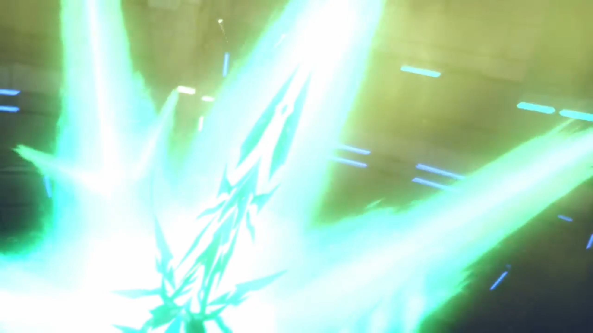

The flames grew so long it reached the ceiling. Rex concluded, "Let's get this done. So we... can **move on!**"

"For the future!"

Aion raised all its limbs above its head, channeling all its powers to maintain its armor, pushing against the sword. Sparks fluttered in contact, like a metal cutter cutting through a metal pipe, and slowly by slowly, inched inwards, until it could no longer hold, sliced through its Core Crystal, and ether spurted out like blood fountain from a cut artery. Aion tilted back, raising its heaven hand on the sky, as if it hadn't yet had enough, taken over by an explosion. The group braced for impact; scorching heat burnt their skin, evaporating their sweat, and they quickly turned as red as a cooked prawn. 

Without the light from Aion's wings, the room quickly went dark, further darkened by the thick soot that couldn't escape. Pneuma descended with Rex. Reaching its maximum tilt, Aion recoiled and tumbled forward. Luckily, its limb was forward facing, acting as a pillar to keep it standing. The Core Crystal grew brighter, ejecting Malos from it. 

He dropped face down on the ground, hard, groaned "_Urghhh..._" Every inch of his muscles sore, pain, weak, twitching. He tried to stand up, but all he could do is to tilt his neck, raising his neck. 

Conduit. A growing ring formed above it, larger and larger, and the Conduit particlize. The same ring formed inside the Architect's room, where the particles materialized. 

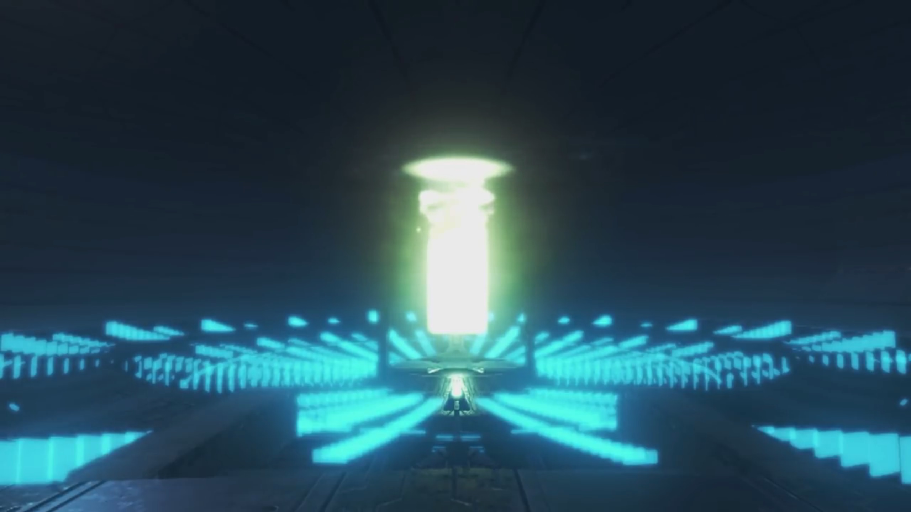

Klaus closed his eyes, aware that his time had come. He stayed oblivious to the ring, felt motes rising from his body. He looked at the various rings atop him, mustered enough energy to raise his hand slowly above his head, swirled and formed a blue ring, ordered it to react with the various spirals above. 

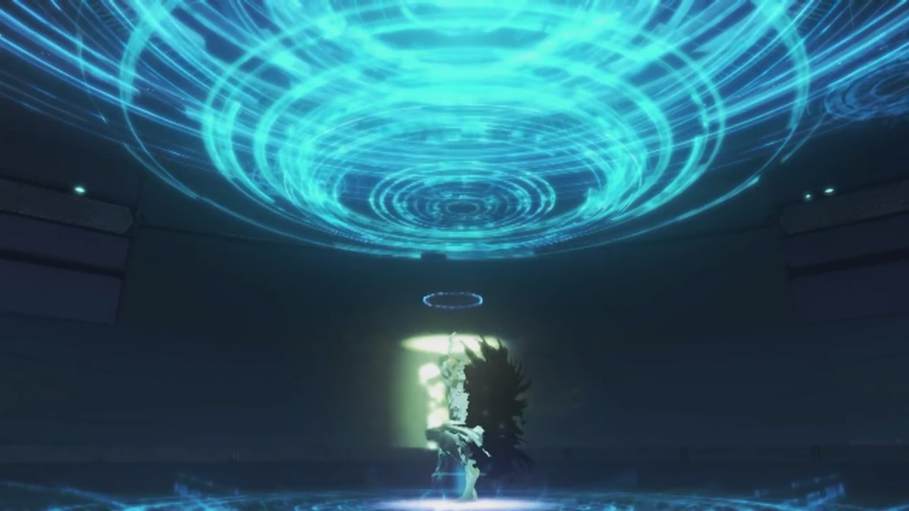

Coming in contact, the holograms of 5 different giant Titans swirled around a center. The World Tree's hologram showed itself at the center. Outside, the rings and ether that forever lit the World Tree bright, a scene comparable to aurora, glowed brighter and brighter. Feeling his body disintegrating, he compassionately left his last words, 

"_This... is the last gift I can offer you... The rest is up to you... My children..._"

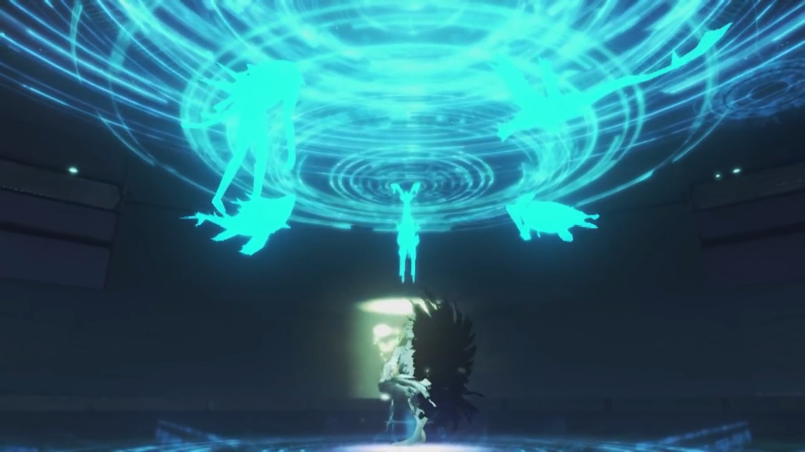

The room grew bright; the glowing circle that swallowed the conduit engulfed the whole ring, and together, with his motes and the void. 

---

The Artifices shut down. Inhabitants that realized they'd nowhere to escape stood behind soldiers, facing the imminent danger with their emperor. He was scared, but he was glad. Looked like his sister had did it. Similarly in Tantal and Uraya. Nobody said a word, enjoying the silence, while others remorse for their family and friends that died for nothing. 

---

"Ugh..." With all his might, he tried to push himself up, "**URGH!!!**" But all he could was shove himself to face up, breathing the cold thin air, gasping for breathe. His Core Crystal flickered, damaged beyond repair. Rex and Pneuma walked up to him, sadness replaced their smiles. He may had been their enemy, but he still wished he'd understand, the true meaning of his life. 

"_It's been fun, kid..._" He put up a thin smile. 

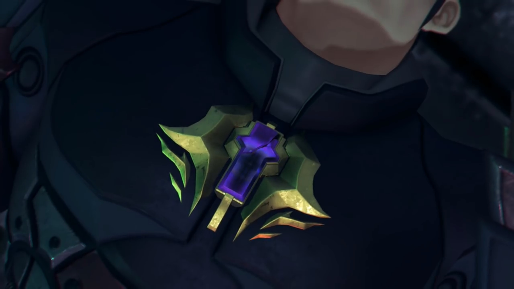

"Malos..." The rest of the group joined them. 

"_If only... I'd met you sooner... Just think of the worlds I might've seen... But- even so..._" Purple motes escaping from his core, then spreading to his body. 

"If... If I had been your Driver... **All** of this..."

"Huhuh..." (He effetely puffed out some air, but no longer took in any new.) "_Kids say the damnedest things. There was only one Driver for me. All... in all... It wasn't... so bad..._" A thin shockwave in the shape of an umbrella, purple motes pushed to its boundaries like mushrooms spreading its spores, floated into the air, and went up, where they believed heaven awaits. 

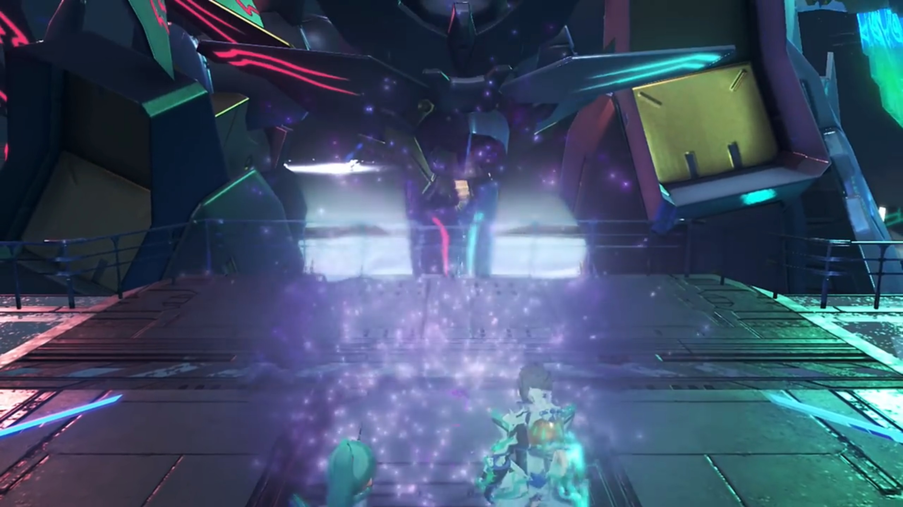

Pneuma, with teary eyes, "_Malos..._"

Nia transformed back to human form, dropped her head, quietly shedding tears. The final member of Torna left. 

"Looks like he's finally found it."

"Lady Mòrag?"

She didn't look around. "A meaning to his life..."

"_Indeed._"

"Frankly, I'm a little jealous. **_After all, most people... go their whoooole life without finding theirs..._** _Huh... I wonder... if I'll find mine..._"

"You've got one already, haven't you?" says he whom've been eavesdropping. She turned to look at him and Pandoria. "And if what you've got isn't enough for you, well... (tucking his sword behind him) you can always leave things to the next generation. "

"Hmph... you've got a point... Surprisingly enough." 

Rex and Pneuma watched as the final of the motes floated towards nothingness, wishing him well in the other world. Perhaps he'll have better luck there, enjoying a different life, aiming for different goals. 

---

The silence didn't last long. While they were reminiscing, wondering at the depth of philosophies, outside, the beanstalk that stood in silence with the various artifices that already shut down, littered like space rubbish, started shaking violently. As its delicate balance was lost, it started tilting an angle, and the strain crunched its structure, spitting more shards that pollute the low earth orbit. 

"**YAHHHHH!!!**" The earthquake was felt inside the room, tilting the ground some steep angle, took the reminiscing group on their feet; they land on the ground on all fours, all except Zeke with strong lower plate, whom Pandoria hugged onto for support. Staying low, they tried to make do what was happening. 

"**Mehmeh!!!**" "**Whuh!!!**" "**Huh???!!**"

"What's going on?" 

Pneuma displayed a control panel in front of her, pressing several keys, and the screen changed to display the state of the Beanstalk. She observed for a while before realizing, her voice trembling, "**Th-that's!**"

"**What?! What's happened?**" As they slowly stood on their feet, Nia asked; they all wanted to know. 

"**At this rate... All of Elysium will collapse!**"

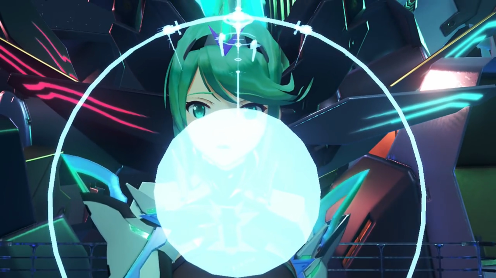

"What?!"

They gathered in a circle to look at the screen, which she floated to the middle, explaining, "Since the Conduit disappeared, the power holding Elysium together was **cut off!**"

"What's gonna happen when it crumbles?! Not-?!" That's a possibility, but its a possibility she doesn't want to hear. They'd tried so hard to defeat Malos, and their effort had gained them nothing? 

Pneuma refused to lie, "Everything above this point- will either orbit the planet- or be flung into space by centrifugal force. _However_... Everything **below** this point -- the World Tree **itself** -- will- fall- apart on top of Alrest." The hologram simulated the trajectory. 

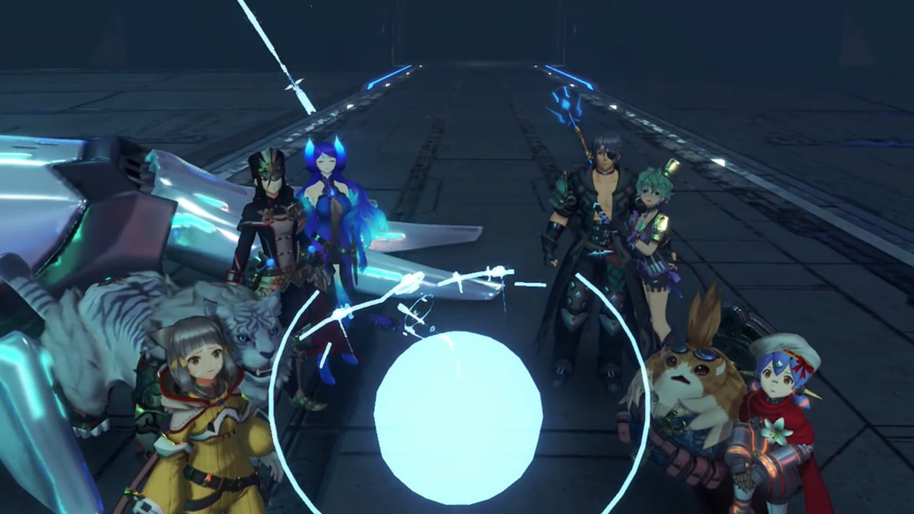

Mòrag: "N-no, that can't..." 

"The impact would destroy..." Tora had not the courage to finish his sentence. 

"**There... there HAS to be a way to stop it!**" His mind ran through all the possibilities; but none of them would work. No, it's beyond his control. Naturally, he turned to her who knew more about the Beanstalk, "**Pyra, PLEASE!!!**"

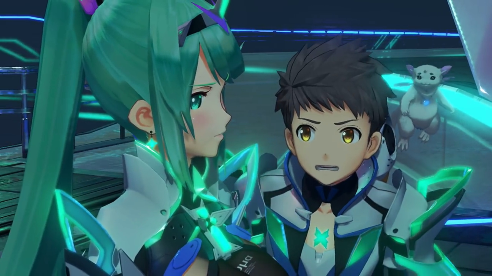

"_Huh..._" Yes, there's a way. After much calculation, she could only think of _that_ one way; but she really don't want to do it. If she do it, she would... She dropped her head, looking on the ground, sadness emitted from her eyes, the same that he saw when she was in Elysium in their dreams. Though, his mind was so focused on saving lives his mind stayed oblivious to what she's emitting. 

"**Pyra!**"

She froze. This was not a request from anybody, but from him. It was for him that she lived, it was for him that she wanted to live, it was with him that she wished to spend the rest of their lives together. But he requested otherwise, he had other thoughts. She cared for the world, but she cared for him first and foremost. He cared for the world first and foremost, then only he think about her. What can she say? She cannot let him down. Puffing out, she stiffened her heart, mustered her confidence given by his plead, and (hopefully calmly) answered, 

"There is one way." (Rex's eyes lit up.) "**Just...** one way to prevent it. **Five stories** down- from here, there's a **control room**- for the correction boosters... **If we can fire** the booster jets..." (she looked to the bottom left of her eyes, trying her best to improvise a convincing story) "...and accelerate the **whole** World Tree beyond escape velocity..."

She looked to the others. Zeke was confused with the science, he nudged, "Look, I haven't got a clue _about- boosters or velocities, but..._ I'm gather that we gotta get there, and fast."

Pneuma dropped her head. Yes, fast. The faster they get there, the less moments she would have with him. She thought about the alternate possibilities they would've been -- opening up champagne, barbeque, singing throughout the night, dancing around the flames, but...

While she kept quiet, Rex snapped, oblivious to her body emotions, "**OK. Five floors down! Let's hurry!**" He dashed for the door, the rest followed, oblivious that she's still frozen in place, looking on the ground, speaking to herself, 'I am sorry, Rex. I wished I wouldn't have to do this to you, but...'. 

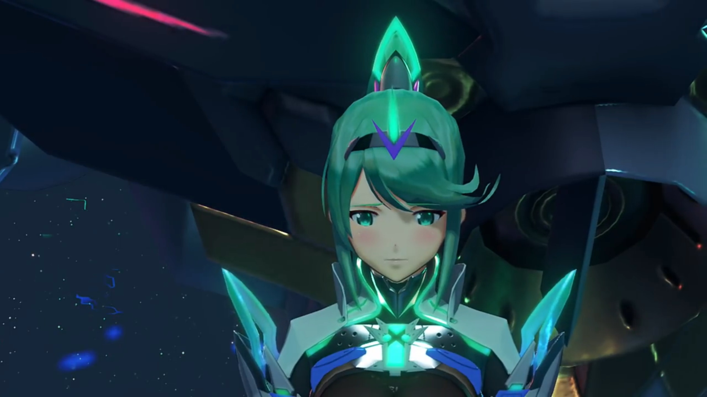

She closed her eyes, called out, "**Azurda! Poppi!**"

"Mmm?" The rest had already exited the room; these two were puzzled why she hadn't yet came up with them. They watched her running towards them in small strides; she bent down and looked into Poppi's eyes, just like she once did in Morytha. 

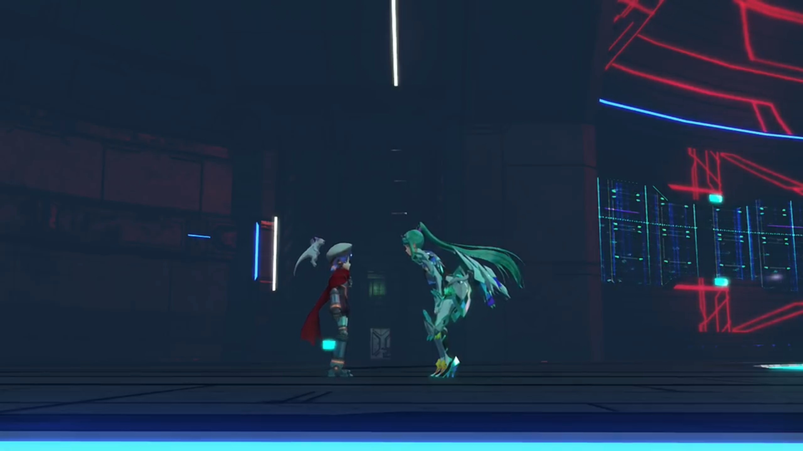

Some secret words exchanged, their eyes opened wide. Azurda exclaimed, "**What did you say?!!!**"

She crossed her fingers into a praying hand, feeling artificial tears welling up her large eyes, fluttered, her whole body shaking, pleaded, "_P-Poppi could not... possibly...!_"

"**Pleaaaaaase!!! You're the only ones I can ask...**"

"_B-But..._"

"_Poppi..._" Pneuma raised up her palm, the high 5 her Masterpon taught her, and she passed it on, "You promised... didn't you?"

"_Huuuh..._"

> Morytha. She jumped into the air, lightly tap on Mythra's palm, feeling excited. Finally, someone to made a promise with other than Masterpon, the feeling of trust. 

"_That below belt..._" She can't deny, but...

"_Pleaseeee..._"

"_Ngh..._" Artificial tears flowed down her cheek. She looked at her face, saw her pleading eyes, and immediately avoided it. If she knew such promise would brought demise, she wouldn't have made it in the first place. But she'd already made it, and a promise is a promise, a promise to be kept. Reluctantly, she closed her eyes, nodded, trying hardest not to break. 

Pneuma sighed with relief. Entrusting him to her, she can finally face her destiny. 

She stood straight, turned to Gramps, and lightly touched his Core Crystal. It glowed brighter, with some motes brushing through his flurry skin. He felt his strength came back, but now's not the time to transform, "_You're a real piece of work..._"

Her eyes retained on the floor, spoke nothing, clenched her fist, as though that would give her strength. 

---

"**BOOOM!!!**" Stairs spiraled along the exploding hollow cylinders. The group watched their steps, careful as they sprung on their feet not to miss a step or sprain their ankle, oblivious to the explosion from intense heat generated from compressing atoms above their heads. Even as the floor shook, they adeptly put one step after another, until Rex first arrived at the bottom, bent his knees and dashed for the exit. 

The huge, wide platform stretches across, and with a wide gaped, Rex scanned from left to right, the hollowness of the interior of Rhadamanthus. The ceiling stretches 5 stories tall, some hundred meters wide; he saw the door on the other side of the bridge. He presumed that's where they were to go. The others waited for his instruction behind; without hesitation, he went for the bridge. The darkness below stretched into oblivion, but how wide the bridge was, allowing 3 horse carriages to pass side by side without falling off its side. 

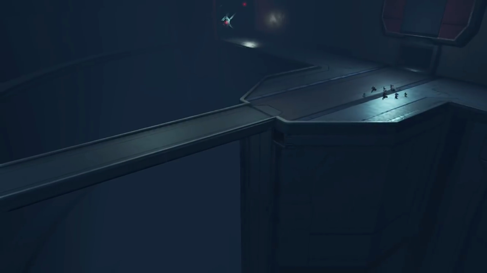

Halfway crossing, an explosion shook the bridge, brought them down on all fours."**YAAAHHH!!**... Gah!" No time to lose -- they had to get to the correction boosters and stop the collapse before the whole beanstalk disintegrates. Oh, disintegrates, how he'd never thought of it. Or perhaps he trusted her so much he refused to believe it, he refused to consider such possibility, he suppressed the thought if it ever came up to him. The door was just in front of him, tightening his muscles, he sprung towards it, and the others followed. 

Sensing motion, the door slid open quick. They braked and looked around. "What... **What is this?**"

Rows upon rows of capsules installed on platforms aiming at the darkness, their boosters facing a thick heat-resistant walls. Small red lights blinked on the walls amidst the darkness, carefully signaling where the walls stretched to. 

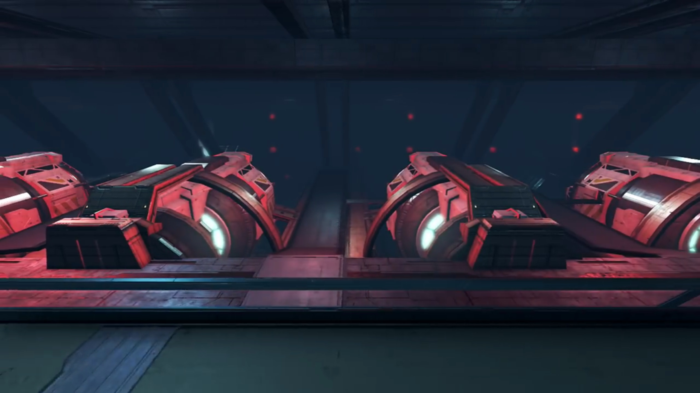

Mòrag hypothesized, "Ships? Is this a... port?"

They analyzed the surrounding; where are the correction boosters she spoke about? He felt that something's not right, and he recalled who'd led them here in the first place. "**HURGGGHHH!!!**" His iris dilated, he gasped for air, he turned around in a panic, and he shoved past the puzzled group, passing through Poppi whom stood near the wall and looking down on the floor, far from everyone else; but his attention was searching for the figure he so dear he didn't notice. He quickly rushed to the edge of the platform just a step from the bridge; there she was, standing on the other side, like a lady with her arms placed in front of her pelvis, her eyes staring on the floor, her body slightly trembling. 

The others, still confused, slowly turned around and formed a line, slowly walked up to join him, wondered what's happening, or how will she explain it. Their eyes laid on her, oblivious to Poppi whom was still frozen in place, accompanied by Gramps floating behind her head. 

"**Pyra, what are you doing there?! Where's the control room?! PYRA?!!!**"

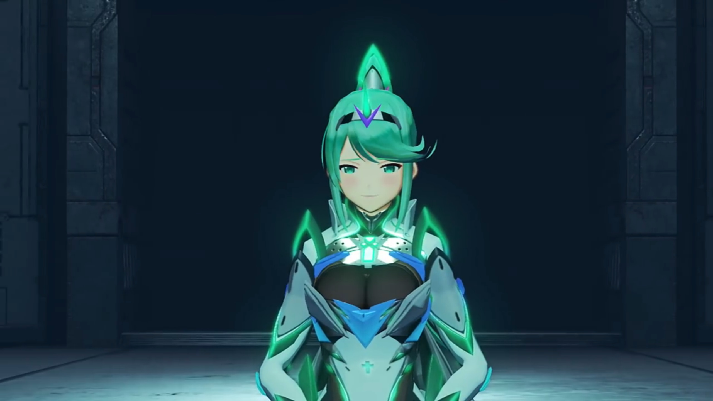

He wished she would tell him otherwise, that what she told him earlier was true, and they were really going for the control room. She looked up, biting her lips, half closed her eyes -- that's enough answer he need. He dropped a step back, his limbs and skins felt so heavy under the pull of gravity, "_You can't mean..._"

She raised her hand, "I'm sorry..." Swiped it sideways. Nuts and bolts that secured the bridge were sliced in half. The thick dust that accumulated for eons without vacuuming sprayed into the air, blew against his face; he braced to defend his eyes and mouth and nostrils. As the cloud thinned, he looked at her with desolate eyes, _why?_

"This was the first lie- I ever told you." She dropped her head and faced to her side, feeling the guilt rushing through her chest. He tried to feel her emotional pains; he thought their connection was close enough he could feel her -- but no, he may be compassionate, even empathy, but he cannot share her feelings, not even with core crystals shared. 

"**Pyra...**"

"The only way to stop the World Tree's collapse... is to use the _last of Aion's power..._ and annihilate the World Tree. **I'm sorry, it is the only way.** You all need to use one of those escape vessels... and **get as far away** as possible."

"**WHA...?! The last of Aion's... PYRA, WHAT'RE YOU DOING?!!! It'll... It'll be fine, RIGHT??? You'll deal with the World Tree, then come back, RIGHT???**"

Much as she wished, she snuffed her nose, unable to muster the courage to look into his eyes. That was enough answer for him, enough to disappoint him, enough to drop a heavy rock atop his heart and lungs, enough to feel his stomach went sour, enough to... choose his own path. The remnants of the smile he forced dimmed. 

"**Wait! Just wait! I'll come with you!**" He get to the edge of the platform as much as he can and shot his anchor to a beam on top of the center of the bridge, hoping he could swing full round to the other side. It extend and extend and extend until the line fully unwound from the spool. The anchor dropped deep into the abyss, and he clicked another button to recall the lines. "Dammit! There's not enough wire!" (He mind ran through any other possible ways quickly.) "I got it! **Poppi!**" 

Only when he turned around and ran towards her did he noticed her anomaly. A girl dropping her head in desolation. He felt the rock on his chest expanded, kept telling himself: no, no, that's not true. She couldn't have known earlier. But her eyes, dimmed without hope, refusing to look at him, not heeding his call. 

He urged, "**Poppi?!!!**"

"_It not OK..._"

"_Huh..._"

"**Poppi cannot...**" The others gathered around them. 

"**Whaddya mean you can't?!**" He stomped closer to her. 

"_Poppi made promise... Pyra say- that Rex for **sure** ask Poppi. Hmprh. Say not help **Rex, no matter what**..._"

Nia was shocked. 

Rex first felt anger, biting his tongue, "What kind of **promise is that?**" (He roughly grabbed on her shoulder and shook hard,) "**Please! I'm begging you! ALLLL you gotta do, is take me over there! The rest- of you- can just...**" 

She looked into his eyes, the eyes of desperation, grabbing onto anything that could bring him hope. She let him swayed her; her guilt made her feel she had to grant him a favor. Her mind fought: to keep her promise, to not let him down, to keep her promise, to not let him down, to... 

Gramps softly called, "Rex..." It was the source of support she needed to stay firm. 

Though he didn't hear it. He waited for a while, but she wouldn't budge, and his breathe got shallower and shallower, faster and faster, strongly urged once more, "**C'mon!**" (He turned and pointed where his de facto partner was standing,) "**Please!... She's right there!...**" He grabbed onto her shoulders. Her eyes flickered, hearing his desperate voice, looking at his desolate eyes, feeling the guilt crushing down on her. She closed her eyes, so heavy she cannot breathe, on the verge of collapse, and could only muster up artificial tears, and cry. Tingles ran down his frame. 

"Reeeeexx!" His eyes traced the flapping lizard swirling a ring around and came up closer to his face. 

"_G..._ **Gramps...**"

"Sometimes... _a man must know... when to let go._"

He stumbled back, "**Whyyyy?! WHYYYYY?!!!**" He dropped on his feet, punched on his feet.  

"Do it for her, Rex..." (His fist clenched so hard as if his fingers were to buried into his flesh, but he can't feel it. The pain of losing her was much much more.) "Do as she asks..."

"**Gramps!!!**"

"Chum... How long are you planning on being a baby...?" (Zeke looked calmly at her, standing quietly on the other side, waiting for him to walk out of it, waiting for him to look at her again, giving him time for himself, even if it's nigh. Poppi felt overwhelmed, dropped and hugged her Masterpon for consolation.) "She's the girl you love. You got to accept her decision. That's what being an **adult**- means."

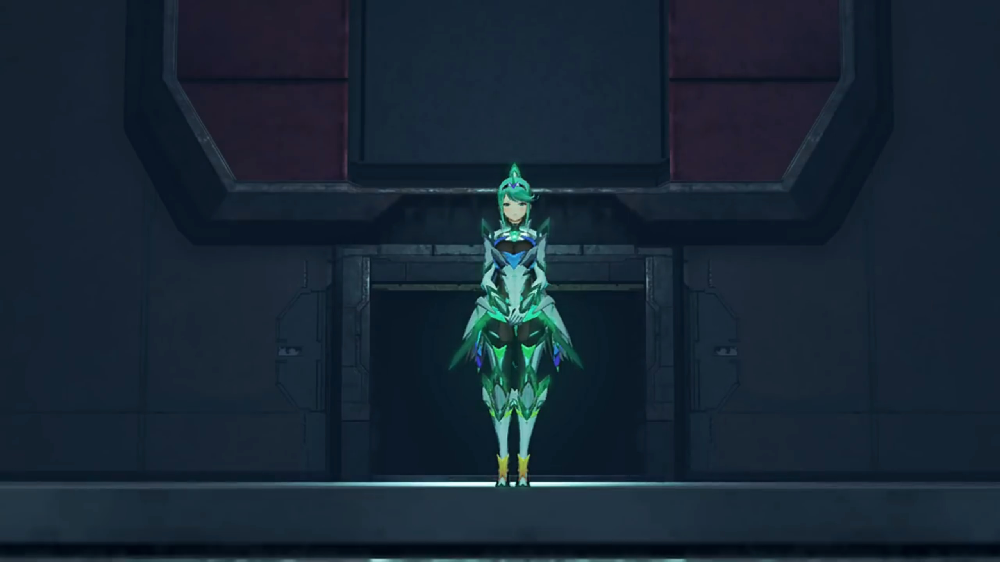

A thin light cast on him; for the first time, Pandoria felt he had grown up himself, to stop being a baby himself, her Prince. And that... she admired. 

Mòrag closed her eyes, went up to him, knelt down, and put her arm on his shoulder, calmly spoken, "Rex... I am so thankful that I've met- _all of you._" That was enough words; a puddle formed between his knees; she looked around at the girl, her friend, stood up, looked attentively into her eyes, placed her right palm on her heart, and bowed tilting her neck. Brighid observed what her Driver did and followed up herself. Friends across generations, even though she only read it in her diary, she will never forget. 

"Rex-Rex..."

She can feel... his pain. If she can, she hoped the boy she loved would live happily, but her sister who shared his love chose to entrust him to them, and face her destiny herself. She would have done no better in his position, she guessed. She effetely walked up to him, looked at him with teary eyes; he finally raised his head, perhaps clinging to the hope that she would support his decision. But she knew what's best for him, and his longing dropped when her eyes closed, and opened back, and from that moment on, he knew he had no choice but to... move on. His head dropped down, he closed his eyes, feeling his heart ripped apart and stitched back, effetely stood up, and turned around to face the girl under the spotlight, whom was casting a thin smile at him, grateful that he finally walked out, at least temporarily, at least enough, to bring his attention back to her. 

"_Pyra..._"

When more explosion lighted the chamber, she knew the time was nigh, desperately called out, "**REX!!!**"

He gasped. For a moment, he felt he couldn't let her go anymore. Her voice dissipated all the courage he'd mustered. 

She stood straight slowly and put on her smile, the best she could do, for him to remember this smile forever, slowly reaching for her core crystal, gently touched it. A bright turquoise light lit her face up, and his chest lit up. He looked down, wondered what happened. He felt the crystal completing and slowly ejecting from his chest, dropped onto the ground, "Ding." And lose its vitality. 

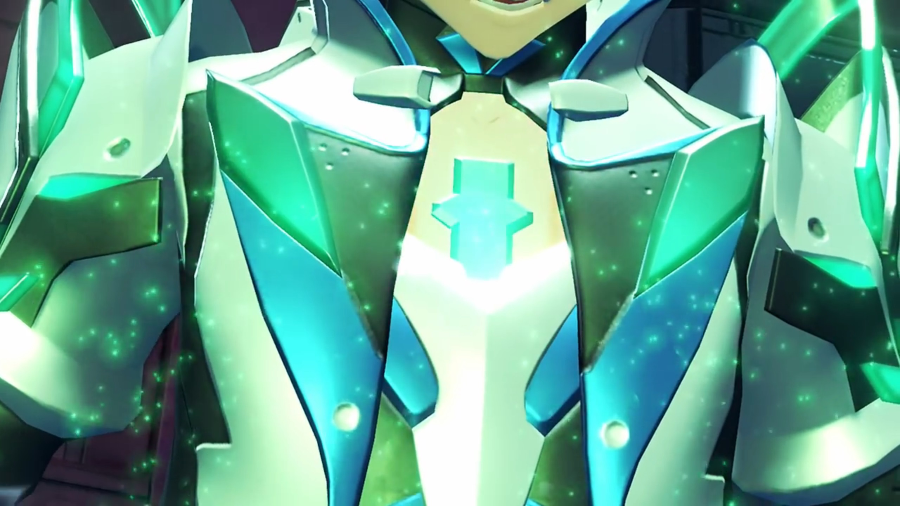

He gently picked it up and looked at it closely, "_The Core Crystal..._"

He quickly looked at the other side; she's still there standing, still alive.{{footnote: Recalled what Malos told Akhos before when they had her captured?}} He could hear her desperate voice echoed across the chamber, "_You'll be fine... without me now._"

"**Pyra...**" Giving up her life voluntarily, he knew and be sure she's not coming back anymore. Even if he resonated with her revitalized crystal in the future, the she whom returned would not be her anymore, devoid of their memories together, devoid of the feelings they'd shared, not only from the sharing of core crystals, but also from the adventures and pain and suffering and happy moments together that trickle deep into their souls. A replacement of her would forever be a replacement, not her. 

Another explosion from atop send shreds raining down to oblivion. Rex covered his face from possible dust, then reminded himself this would be the last he saw her, forced his eyes to open and fixate on her amidst the raining shreds, but sometimes, the fragments covered his line of sight. "**PYRAAAAAA!!!**" 

He may not have put down, but how cute was his reaction; she put up a smile, believed he'll grow out of it, and with time, dimmed. He'll live with Nia, have their own children, taken care by Auntie Corinne in the tranquil village of Fonsett, and enjoyed their life till old. Sometimes, he might, looking back, remember that there was once a girl he loved so much when he was a boy, and sighed. But she felt glad. Lora had Jin to remember her for 500 years. She had remembered Addam for 500 years; now its his turn to remember him for 100 years. 

A thick chunks of continuous debris rained and totally blocked his line of sight. With the river of debris gone, it brought her with it. 

### Footnotes: