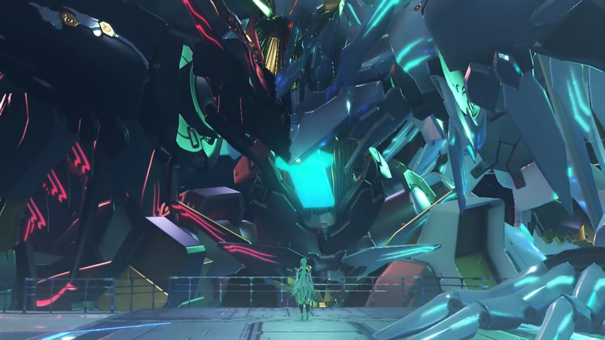
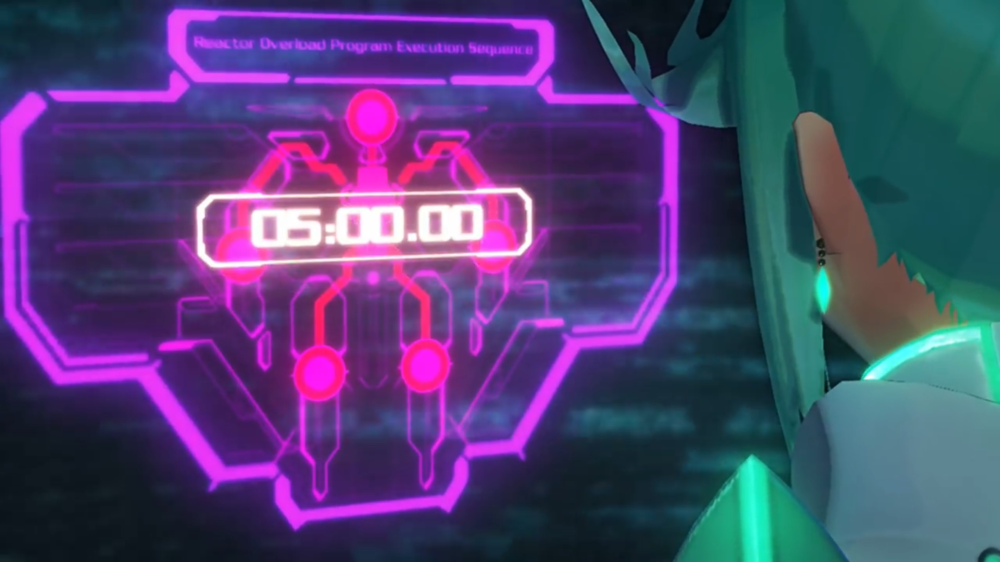
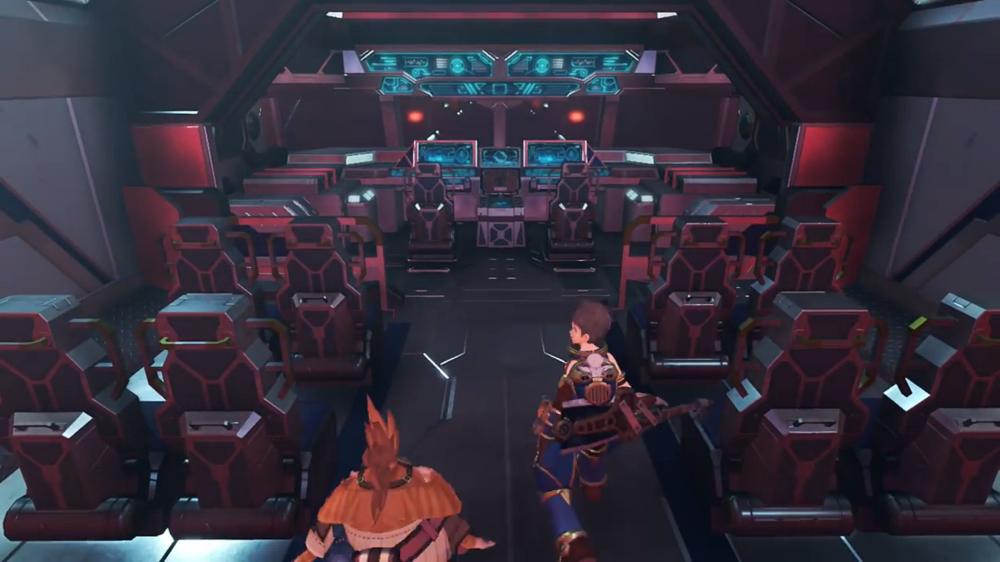
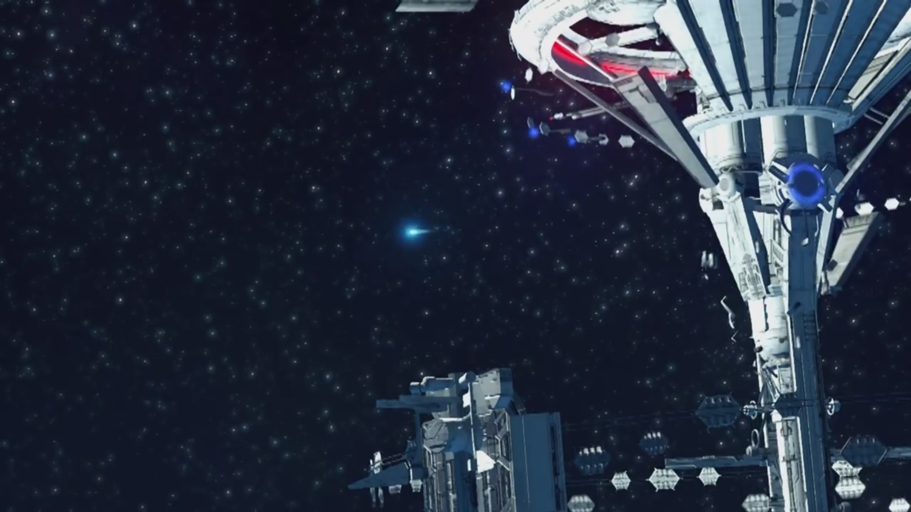
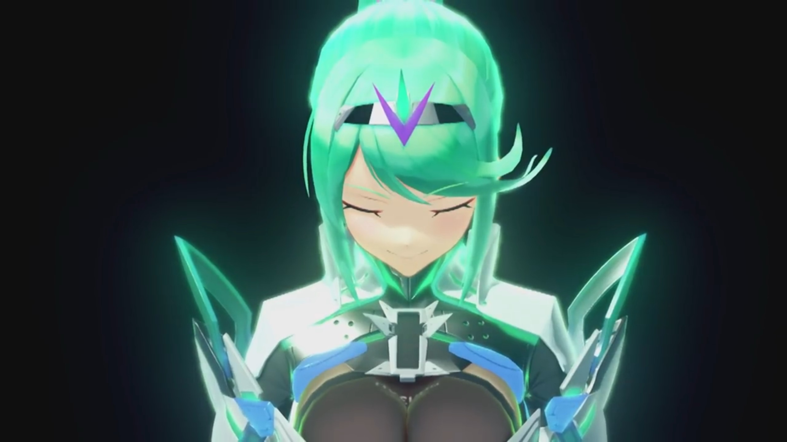
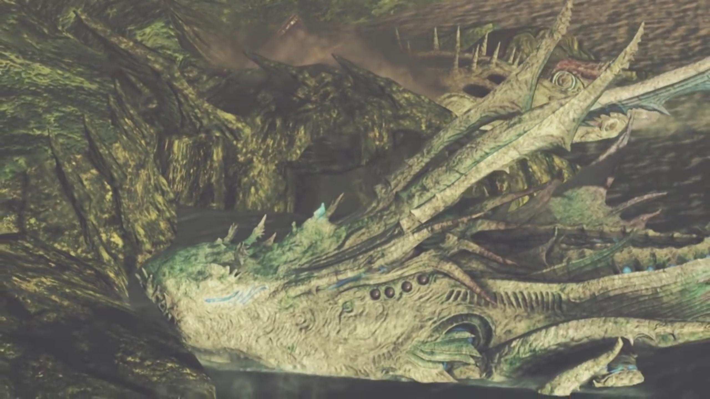
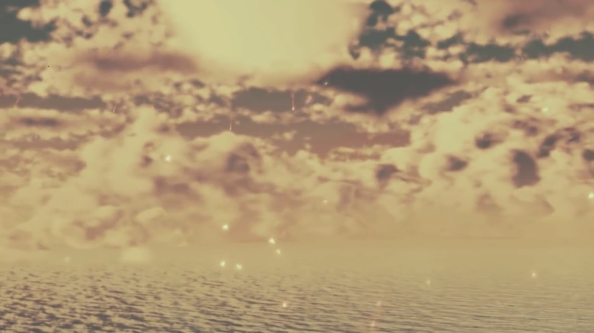
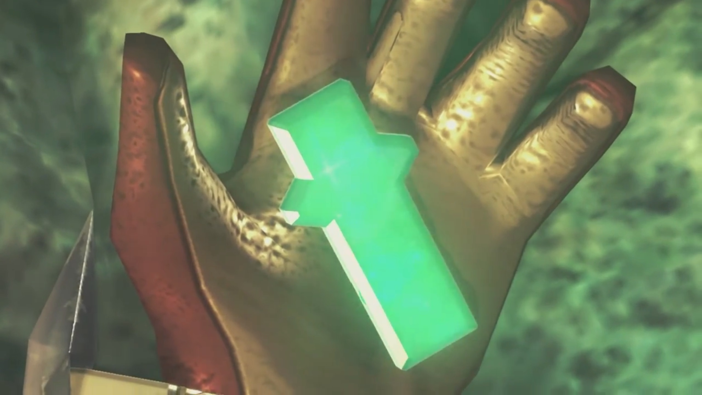
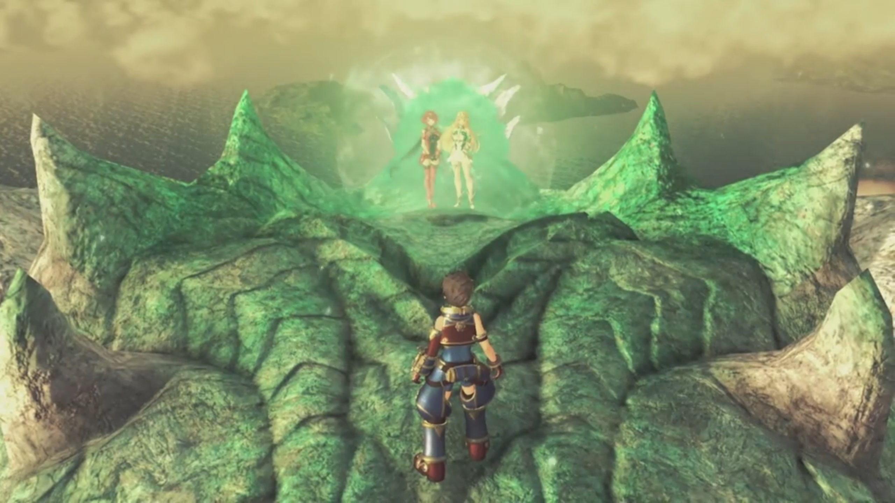
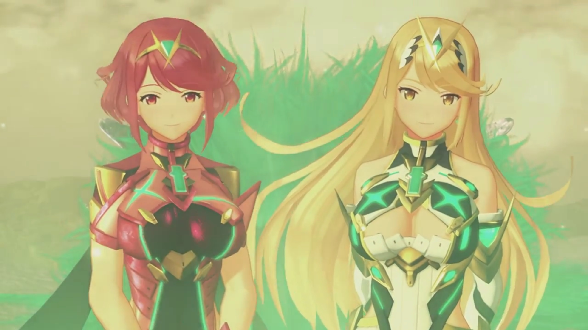

# Finale

While the floors continued shaking, rocks continued tumbling, explosions continued exploding, Rex reminisced by connecting with her crystal, as if she's always there with him, for a moment; then turned to Nia and nodded. He's fine, she understood. He'll be all right. They can go on. He swiped his face across his other friends, toughened up and nodded. Let's go, he said. Don't worry about me. 

Outside, shards descending towards Alrest, together with the other artifices, pulled by gravity. Pneuma stood on the platform, looking at the artifice she was born with but never drove before; but it had a heart of its own, even if it's inanimate. "Hello there... I hope... you'll help me."

She climbed into the control chamber, and the controls started to sync with her brain waves. A bright light glowed on its core crystal, and it stood up once more. She opened up the panel called  'Reactor Overload Program Execution Sequence' and set it to 5 minutes. In 5 minutes, each of the 6 reactors, 4 on its limbs, 1 on its head, and 1 on its chest, will released its store energy in a single burst{{footnote: Usually, it's like a nuclear chamber, which had controlled amount of enriched uranium injected into it. Imagine dumping all the enriched uranium all at once -- and you just make a nuclear bomb.}}. Immediately it started counting down. 

She looked down on the floor; now it's just waiting, buying them some time. Yes, they -- she looked to her left, and a screen displayed her lover and friends crossing through the giant door. They will live on without me, but my memories will stay with them forever, is enough consolation for her. Explosion continued; they brought out their weapons, prepared to slice through any barricades preventing their escape. 

"Rex... _I'm so glad to have met you._ Our time together was short... A fraction of my long, long years."

Two by two, they went in parallel in search of a working escape pod. Nia tried clicking all the buttons, but nothing happened; she tried banging on the door, perhaps the dust might have jammed it, to no avail. On the other side, Tora tried his luck -- too bad. They didn't wait, immediately went for another. 

"But it's been warmer, and **brighter**... than any time I can remember before."

Rex stopped when a boulder was coming down at him; before he react, a thunder, accompanied by blue flames, smashed it into dust. He turned around and saw his friends helping. Poppi was running behind Tora with small steps; she tripped and fell, he didn't notice. She tried to push herself up, but deeply entrenched in her guilt, she felt too sad to want to push herself up. Let the flames cleanse her, she thought. 

"You shone a light... on my melancholy path. You showed- me- the way."

But when she saw a hand held out to her, and she curiously look up and saw Rex and Gramps, him without a sign of hostility but hospitality, her eyes enlarged, her smile widened, and she gratefully took it. Tora had also returned, allowed Rex to took her in his hand as they ran towards the final pod yet unchecked. Nia and Dromarch waited for them, leading the way. Zeke ushered them to come over, while Mòrag tried her luck at the door, though she don't know how to deal with it. When the tech geek Tora arrived, he adeptly pressed buttons in some particular orders and it opened up. Surprised, he first went in, while the others sheathed their weapons and followed suit. They saw rows upon rows of passenger seats, with the front rows for the pilot and co-pilot. 

Rex and Tora naturally assumed control. Tora first observed, trying to understand; while Rex impatiently swing his fingers like playing piano without looking at the keys, pressing every single button he can feel on the keyboard, to no avail. Pneuma smiled and took over control from her side, activated the escape pod from her side, and seeing the screen lit up, he stopped. The others gathered behind the front seats and watched them did their magic. They then looked around; Tora climbed to check that the escape hatch is opening. A tunnel revealed, with neon blue lights lined the ground, showing their way. The boosters heated to its max, ejected, and blasted off. The little light that, like meteor, emerged from Rhadamanthus, plunging under gravity towards Alrest after it reached a distance far enough. Rex eyes fixated on the control panels, making sure there were no anomalies, or perhaps, he just want it to occupy his mind. 

"Thank you... for that, Rex. Thank you for that gift of light." 

She closed her eyes, running through the bits and pieces they went through together, every piece enjoyable, every moments appreciable. She would never forget. 

"_So tell me... How was it, being alive...?_" Addam once asked her.

"_Do you really wanna know?_" She believed she now had the answer. She opened her eyes, looked up at the sky, as if he was there, listening, waiting. "Well..."

Rex could no longer resist, turning his head back and look at where she was. She's still there, but they were separating further and further; his heart thumped hard and fast, his head throbbed. And with the countdown complete, in a burst of light, ether swallowed her and Aion whole, spread to Rhadamanthus and the Beanstalk. Watching the growing light sphere, oblivious to their escape pod being affected by the continuous shockwave that caught up with them, he screamed from the bottom of his lungs, 

"**PYRAAAAAAAAAAA!!!**"

---

Rhadamanthus was destroyed; but the Beanstalk had yet to be, spreading down inch by inch. The escape pod plunged straight down. Tora hugged on to the control panel with his wings, as if gravity had left him, trying to free-float him. The rest held on tight, the flames engulfing the Beanstalk catching up behind them. 

At full speed it went, but the escape pod wasn't designed to withstand such stress. The windows in front were shattering, nuts and bolts were detaching, and when the boosters and the back row detached, "**AARRRRGGGGHHHHH!!!**" The rest held on tight to the front part, trying their best to not getting flung out the now-wide-opened hatch. 3 seconds later, when the front part disintegrated, everyone went into free fall, still about 60,000 feet from sea level. "**YAAAAAARRRRRGGGHHHH!!!**" "**MEHMEHMEH!!!**" 

Tora's fluttering wings didn't even slow him down. Some hugged onto each other, hoping they could at least die together, if they did. As they went straight down under gravity's pull, Gramps's flapped his small wings quick, dived nose down, shouted, 

"**Reeeeeexxxxx!!!**" He transformed back to his old man form, and with a flap of his wings, get under him; he subconsciously grabbed onto his fur. 

"Gramps?!" He was surprised, but no time to be surprised. Getting near Nia, she reached out her hand and he subconsciously reached out for her. Dromarch caught onto the furs tight with his front paws, and Rex pulled her in, letting her grip onto Gramps's furs herself. Brighid, hugging Mòrag, caught on to Dromarch's tail; while Zeke, hugging Pandoria, caught Nia's arm. Poppi fired her boosters, hugging her Masterpon, and landed behind his back. 

"You know, I think this form does suit me best."

"**Gramps!**"

"**We're heading down! Everybody grab onto something!**"

He looked back at the Beanstalk, the building that carved memories deep. Debris were raining down like dust polluting the sky. She wasn't there anymore, and he guessed the rest of the building will soon be destroyed, though they probably wouldn't see it. 

As he glided closer to the Cloud Sea, Tora noticed that "Cloud Sea is..." dissipating, revealing the sea below the clouds. 

Rex turned his attention, noted, "The Titans are... gone..." 

Thunder kept blinking amidst the dark clouds, providing mere illumination to the gloomy heart. Nia: "I can't believe it... Is- everyone... dead?"

Pandoria commented, "We were too late..."

Mòrag closed her eyes, brought down her hat, hoping that would shied her tears. 

"In the Land of Morytha..." They could see ether glowing beneath the dark sea. Gramps stretched his wings and soared close to the sea's surface. Morytha was revealing itself, raising up from deep sea up towards sea level. 

Zeke concluded, "_So there's... nothing left of the world... but ruins?_"

He flew, further and further, still no sign of any creatures. Gramps warned, "**We're crossing that rift!**" He soared his wings and zoomed up, higher and higher, against the thunder storms. 

---

They couldn't believe their eyes. The evening sun casted an orange hue on the clouds above. Blurry mountains in the horizon on a vast tranquil sea. Closer and closer they get, why do the Titans swam so close to one another? 

Nia's ears fluttered, hearing something. "**Look!**" She pointed to her 2 o'clock. Uraya Titan descending from the sky, like a leaf falling off a tree. They noticed its core crystal was missing; and when it came into contact with the sea surface, displaced huge amount of water, sending huge waves and ripples to its vicinity. Some distance away next to it, Genbu did the same. 

Soaring parallel to them, they watched as the Titans committed suicide, swimming fast towards the large landmass, crashing into it, burying its head into the landmass before stopping. 

Dromarch: "The Titans..."

Brighid: "They're- joining with the land..."

The old and weak Mor Ardain raised from below water, water dripping off its sides, raining back to the sea. It walked slowly and effetely, tramping along, shaking the sea bed with every step it took towards the land. 

Mòrag: "It's true... I think... I see what Klaus meant by... 'restoring the world'."

"Gramps?" Are you joining them? "So Elysium was... here... all along..."

"You know, Rex... I think you're right."

The remaining fragments of the World Tree soared above the clouds, reentered the atmosphere, leaving long tail as it burns into dust, like meteors raining atop Alrest. They lit up the atmosphere like fireworks, illuminating the hearts of the inhabitants that'd just survived the brutal. The dust motes, red flakes, fell like snow, felt a tinged on the skin when touched. Tranquil, relaxing. 

He enjoyed too for a moment before bringing up his hand together with the darkened crystal. The flakes reminded him, the fire sparks she made 'eons ago' just as beautiful. If only she's here, she would've enjoyed it, he thought. But while she would no longer be here physically herself, he remembered his promise, 

"We're... finally here."

Gramps zig and zag through the giant landmass, into the sea, and disappeared behind the clouds. 

---

> He was amazed when he first met her, and she asked him to touch her core crystal gently. Touching a girl's chest the first time we met, are you serious? Those were happy moments, when they first fought together against Malos -- so that's how it feels, to connect with one's Blade! He had to protect her, this dear little fragile girl whose eyes looked depressed. When she fall, he felt her blaming herself for being weak -- so he offered her a hand. When they were injured, they looked after each other injuries, though he tried to be strong -- a boy cannot say he can't in front of a beautiful girl, not when he had special feelings for her; though they shared the same wounds. 
> 
> Endless times, they fell and fell and fell. Sometimes, they offered a hand to one another, and they stood up again, fighting for another day. The first time they can't, he lost his teacher whom sacrificed himself to buy them time to escape; though he doubt they could even if he gave up, but he don't feel regret -- that's him, after all. And if he had left, Mythra wouldn't have woken up, and he wouldn't have the chance to know her as she is. 
> 
> Though, finding herself in my bed... (He laughed when this memory came up.) Luckily Pyra came out the next day, lest it be awkward. She really have thin skin, huh, easily blushing. One-Eyed Monster... Sleeping on his laps... Her (Pneuma's) hair... 
> 
> His de facto partner, he really wanted his dad and mum to learn about her, even if he never learned about his dad and mum. 
> 
> Wait, Pyra said she shared memories with Mythra, but do they share feelings? Seems not, seems like 2 different personality, interpreting the same memories in 2 different ways... 
> 
> Then there's that girl, Fan la Norne. The second time he felt so weak; she's killed in front of his eyes, and he could do nothing to save her. And Pyra, when she was captured -- how much burden she took on her shoulder just to let them go. Its funny how he lied to himself, saying that she'll lived better with them. They conveyed so clearly they wanted her, yet his over-optimism couldn't interpret the situation in any other way less than over-optimism. Yeah, he's the only one being optimistic -- the others don't start out optimistic, neutral at best, but if it became an obstacle to their goal, hostile at worst. 
> 
> When they threw her corpse back to him, that moment, he really thought he'd lost her. Wrapping his hands around her shoulder, he felt the coldness and stiffness, heat escaping from her body, heart stopped beating. When they fight, when their souls spoke to him, he's sure they can be brought back. He just need to move their hearts, to convince them that there's someone they worth living for, that's willing to walk on the path with them, their path parallel to each other, each towards their own destiny, but at least, when their path crossed, they could walk hand in hand. And they were back. 
> 
> Oh, how he wished now could be then; but they were really gone... 
> 
> Despite their differences, he'll never forget the warm and loving hearts of Jin, the strongest Blade of Torna whom hated fighting. 
> 
> It's a blessing to meet with Klaus, her Father. Even the battle with Malos controlling Aion; he thought it's too late to turn back, so he acted otherwise. But in his last moments, he seemed to accept, to allow himself to be enlightened, and that is enough, he thought. 
> 
> Oh, why had he been so focused on saving the world and not realized the sadness in her eyes? How she refused to look into my eyes, the flickering eyes focused on the floor, when he pleaded her. If he had not pressed, perhaps he could stay, and she wouldn't have to walk her last path alone. Though, perhaps she didn't walk her last path alone; they were always there with her, even if worlds apart. But if he had a choice, he would choose to be more attentive to her next time. But there's no next time anymore. His "next time" had cost him her life; his lessons learnt can only be applied to future situation with others, never to the ones whom he'd lost forever. It's too late to reach out for her. 
> 
> They told him to accept her wish. Situation were dire then, and he forced himself to come out; but can he really accept her decision, if put to trial once more again? He don't know. Perhaps, perhaps not. He really don't want her to feel sad, he want her to think that it's him that had made the decision, that she can blame it on him and not blame herself -- she had shouldered too much herself already, he will shoulder the rest for her, even if it means depreciating himself. 
> 
> Distraction worked only for a moment. He tried so hard to focus on the screen and not look back; but when it comes to the moment, when he sense a strong clutch in his heart, he knew, he cannot put it down; not when his love was going to die. When he could no longer sense her, he could take it no longer. 
> 
> Oh, how he wished to go back to the moments after they'd escaped Gormott for the first time, sat by the campfire, with everyone else asleep in the tranquil night. He looked at her cheeks, her eyes, her hair; perhaps she know he's looking at her, but her focus was on the floor, perhaps to prevent awkward eye contacts. The first time his mind went blur, and accidentally blurted out his feelings towards her, jumped on his feet trying to explain what he 'really' meant. If time would roll back, he hoped they could just sit, side by side, amidst flames and sparks, enjoying the tranquility and the moments together, no need to fight, no need to say anything, just feeling her warmth, and looking at the twinkle stars hanging up high in the sky. The fragments that dragged through the sky, the red motes that rained down, they too were fires... If she's here, they could've hold, hand in hand, and just enjoy the flames, _her_ flames. She really is a master of fire -- the meteors and motes? She made those. 

It would be a long time before his helmet would reside another inhabitant again; for now, it'll stay on the back of its first resident, gently rocking as he soared the sky. 

So romantic she have to put her head on his shoulder. Zeke jumped up, felt his skin scorching up; she smiled and glued her head back -- he's not getting away, not this time. He gave up. Mòrag and Brighid stood shoulder to shoulder, swaying left and right, dancing to the rhythm. Tora gasped, his head turned left and right, never had enough to see. Poppi's eyes gazed opposite where his head turned. Nia laid her back on Dromarch, and they quietly enjoyed, relaxing their heart and mind. 

Perhaps you might not come back, but I'll remember you, always, I promise. But oh, how I wish the meteors would bring you back to me. If, if the meteors can hear me, oh, I wish she would come back to me, even though... even though... He gripped hard on her core crystal, trying his best not to shed a tear. He had kept his promise, but she wasn't here to see it. 

A single mote floated down and attached to the dark crystal; more and more motes gathered, sinking in. It started lighting up, glowing, and blinking. He felt something getting warmer on his hand, and his attention slowly tilted down; the light got brighter and brighter, he wondered what's happening. His heart beats faster and faster, his cold sweat palpitating... is she... is she... 

A strong blinding light, accompanied by an ether shockwave, emanated from the crystal, and he shielded his face from it. The others gathered around like penguins trying to keep warm, at a distance away, watching what was happening to Rex. Now this is a real miracle... only the word 'miracle' can explain what's happening... Is she... coming back? 

Rex tried to force his eyes to look at the crystal, but ended up covering his eyes more when an even more blinding beam shot straight into the sky, forming a thin pillar. 

When it dimmed out and he opened his eyes, he could no longer feel the crystal in his hand; but there they were, standing side by side, the blonde and the red, 10 strides in front of him, smiling back at him. 

Were they real? Or were they just memories saved inside the crystal that came out to say goodbye? Why were they encased in an ether dome, otherwise? He don't know what to say, he don't know what to do, he don't know how to face them, he don't know how to approach them. What can he say? Do you... remember who I am? Or do you... remember the sweet and sour moments we went through together? 

He couldn't take to his feet. He felt real scared. He's scared if they say, "Oh, hi, I'm Mythra (Pyra), nice to meet you. What's your name?" or "Huh? What sweet and sour we have?" He's scared that they were not who he believed to, not _his_ Pyra and Mythra, but 2 different entities that had no common memories they shared. He had just lost them, and he's not sure if he could take it if he lose them again. He froze where he stood. 

The ether barrier dissipated, her friends smiled. Poppi can finally and totally put down her guilt -- she kept her promise, and they come back. Happy ending she loved. She ran past Rex, opened her arms wide, and they went down and let her hugged both of them. Tighter and tighter she hug for an extended moment before she released them. 

Rex watched they speaking with each other, conversing with Poppi. He could feel no more tears in his eyes, flabbergasted by something he hadn't expected. It was a roller coaster, to go from desperation to depression to acceptance to unwillingness to wish to memories to puzzlement to hope to can't-believe-his-eyes to flabbergast. 

She knew exactly what he needed now, gave him a push on his back. He looked around and saw her encouraging eyes. Go, the girls you'd been waiting for are waiting for you, she conveyed. Don't let them wait. It really isn't a dream -- they really came back. He looked to the others, they gave him the why-hadn't-you-started-moving face. 

He turned his attention to the girls; they felt his eyes landing on them, redirected their attention to Poppi. Poppi felt they stopped listening and realized, oh, yes, there's still _someone_ right there waiting, turned around and smiled back at him. The girls stood, waiting. 

Pyra said something.{{footnote: If earlier you chose to call her 'Mythra', it'll be 'Mythra said something.'}} He looked to the ground, looked up again, and calmly walked towards them. 

And thus, boy met girl. 

### Footnotes:
