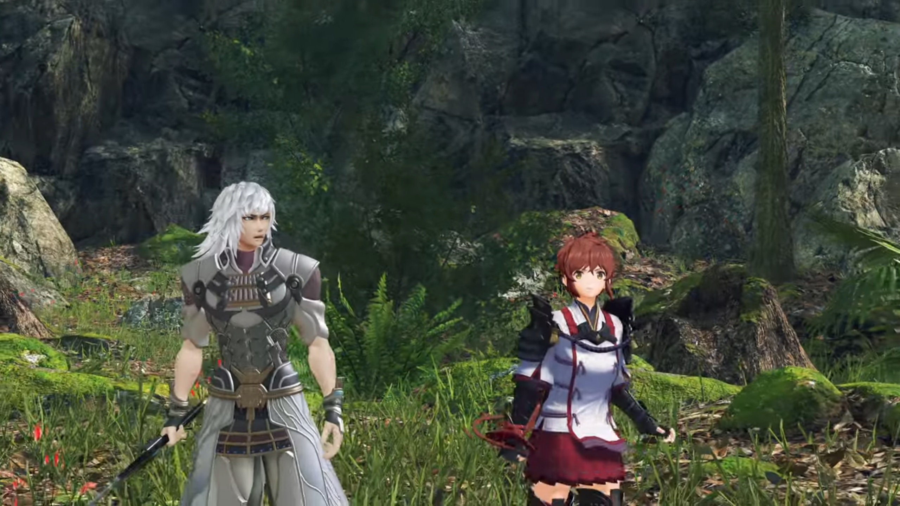
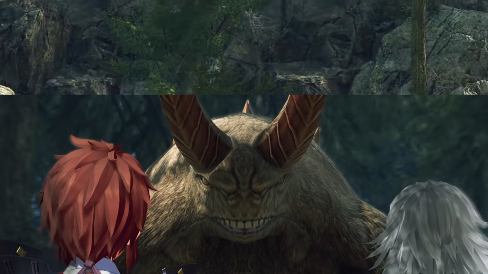
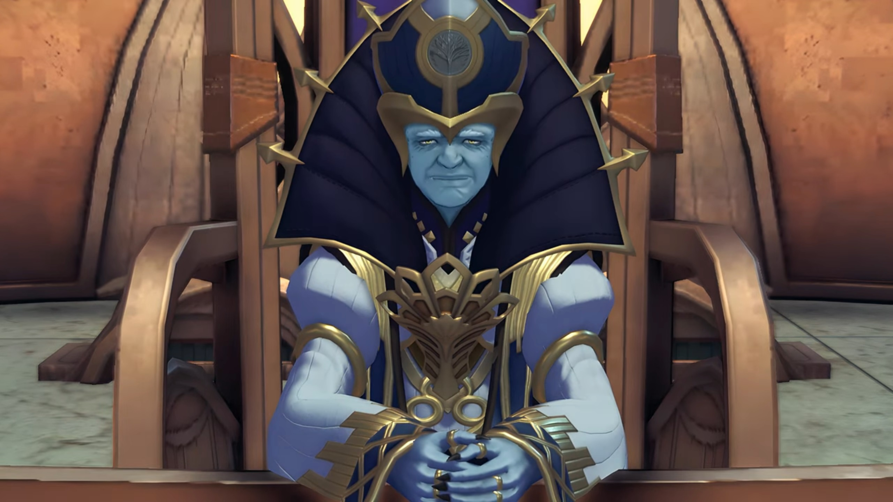
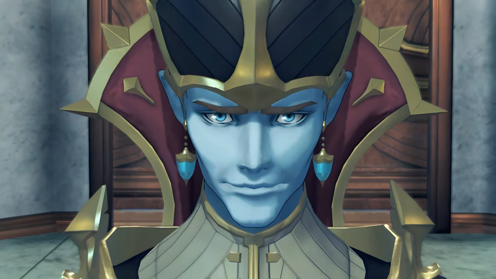
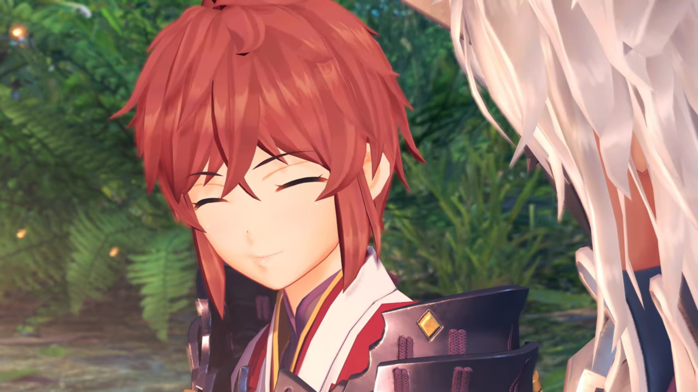
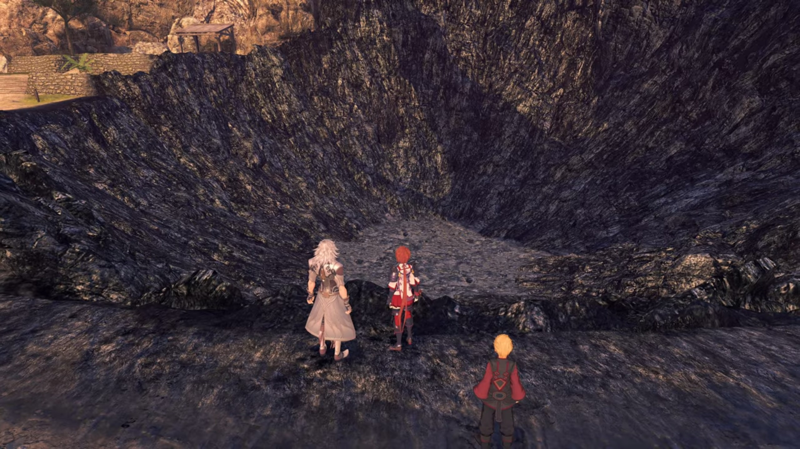
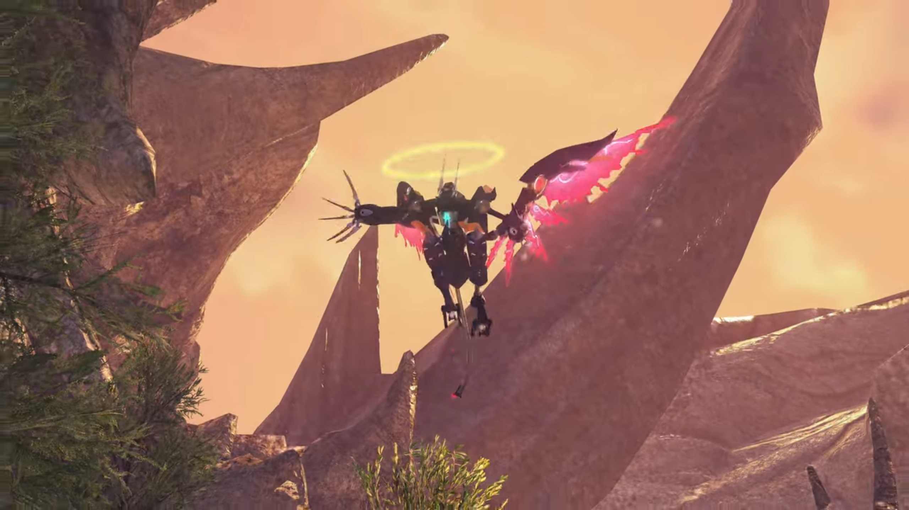
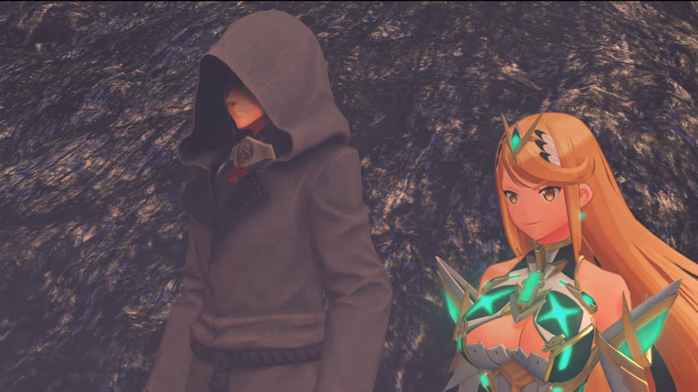
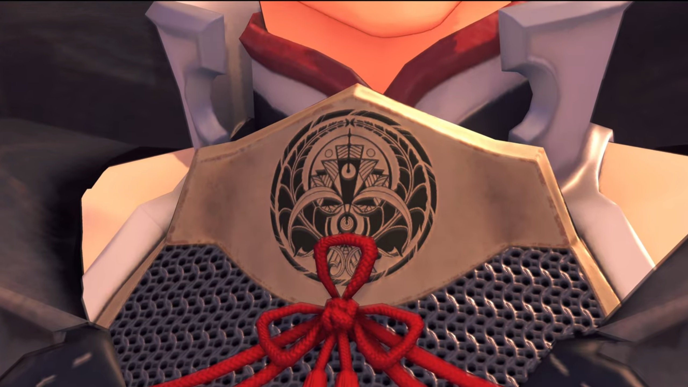

# Where It All Started

===

{{footnote: Narrated by Jin.}}"The year... was 3564. The 107th Indoline Praetor, Rhadallis... had sent an armed expedition... against the country of Coeia. Its capital, Omrantha, fell overnight- and sank beneath the clouds, along with the rest of the Titan. The destruction of Coeia shocked all the nations of Alrest. Officially, the act was attributed... to a military alliance led chiefly by Indol... and the emerging power- of Mor Ardain. **In fact**, it had been the work of one Blade. The Aegis, a man- known as Malos..."

> One-way slaughter of soldiers by armed Titans, with cannons mounted on their backs. 
> 
> Malos slamming down, created a dome that wiped out every single soldier and Titans on the battlefield. 

"...said to be- the Architect's word incarnate. Back then, neither Lora nor myself knew... how closely **his** fate... would _prove_ to be tied with ours... in the days to come..."

---

Inside his Artifice, Malos exclaimed, "You're **that** eager to die? Then **allow me to assist!**" He aimed the cannon of his artifice at the ground, launched a particle beam that drew multiple lines on the sinking Titan. The Titan bellowed in pain as flames seared its thick skin, like an insect surrounded by swarms upon swarms of ant, unable to escape, lose its consciousness, and sunk beneath the clouds, extinguishing the flames with it. 

---

A woman in red coat and a man in silver ran through the leaf-trodden path; pursuing them were few red-maned beast. A dead end, she recognized, turned around and slashed her whip as she stood firm. The whip wrapped around the foot of one of the beast, which she pulled hard and brought it into the air, kicked it hard against the nearest tree bark. It slammed and dropped behind the ferns. 

The silver-haired man, with muscular arms, drew his sword attached to his back and pointed it at the poaching volff, stabbed into its underbelly when it jumped, pulled it out and sliced at its neck. 

The woman, her long red hair tied with a ribbon and draped along her back, with fair skin and large golden irises, wearing red shirt under her silver armor, were busy dealing with several incoming volffs. They worked together; she kicked and whipped; he aimed and sliced. But there were too many of them! 

She kicked one of it away, and there were more incoming. The man threw his sword and stabbed at the floor beside her, which she took, and used it to slice away the poaching volffs. When she got near him, she passed the sword back to him, and he sent an icy shockwave at the remaining. 

Changing direction, they ran for their dear life, she kept looking back and counting how many of them were after them. The man commented, panting lightly, "There's no... end to them!"

"And it's not just the Volff and Feris... Even the Buloofo's caught up in it!"

They ran and ran through dense thick foliage until they arrived at a cliff. No where to run, they turned around, be prepared for their fate. 

The man sniffed around, then asked, "Lora, can you smell it?"

"Hoh! Yeugh! It stinks like-... Ugh" The Feris and Volffs blocked their only exit. The ground shook. They looked up. A giant creature covered them with its shadow. The Volffs and Feris jumped to the side and let the giant creature pass; they watched as it neared them, finally loomed over them. A bear-like creature with two giant demon-like horns and foul-smelling teeth! 

"Yeah, no doubt about it. Blood. It's driving them crazy."

---

She slashed some of the incoming with his sword while he raised a shield temporarily. When she turned to check him out, she heard incoming footsteps, turned around and saw a creature poaching on her -- no time to react. 

"Lora!" The creature pressed her on the floor; she raised her hands as straight as possible to push its mouth away from her. But her strength and stamina was no fight for the creature -- she can't last long. 

"**ARGHHH!!!**" Jin sliced it from the side, bringing it to the ground. It evaporated into motes; he heard another creature poaching at him from behind, turned around and aimed his palm at it, sending streaks of icicles at it, freezing it and several others following behind it, turning them into motes. 

All down, he walked up to her, whom had sat up on the ground and gave him a thin smile as if he was her prince. She took his hand and stood up. 

"Thank you, Jin."

"Well..." He shook his head, then looked to the other side, walked 2 steps in front of her while scanning the vicinity, "We've got **room** for improvement..."

"Of what?"

"This fighting style. It magnifies our strength, sure, but it leaves us wide open..." He tuck his sword back to where it was. "When the sword is in my hand, (turned to look at her) you're left defenseless."

She teased, "What, you won't keep me safe?"

"Huh?" What had that to do with their fighting style? 

She walked up to him, put her right hand on his cheek, spoke like he did when she was way younger as she remembered it, "'I'll keep you safe, always!'"

> "I'll keep you safe, always..." He offered his hand to the child Lora, she took it and put her trust in him forever since. 

He enjoyed her fingers massaging his cheeks for a short moment before feeling it too awkward and childish, softly grabbed the hand with his and took it away, "You... _You still remember that?_"

His eyes tracked her as she dancingly walked to his right, "I've thought about  it... every day for these 17 years." She stood still, looked up at the sky, promised, "I'll never forget it. The day you set me free from a life of misery."

She turned to look at him, whom commented lamely, "I see..." And that was enough for her. She joyfully took the path where they came all along, and he followed behind. They'd been here for too long; let's find a place to camp. 

---

Burnt-down houses. Leafless trees. Dark soot blackened the ground, thickened the atmosphere, and fogged one's vision. A boy, wearing long sleeves of red and long, dark pants, blonde hair, fair skinned, blue iris, stood looking on the ground, his shoulder jerked again and again, clearly crying. 

Lora happened to traveled past the burnt down village and found him, asked, "What happened, Are you alone?" Her golden iris looked closely at him, bent forward, hoping that would make him felt more friendly. But the boy was too shy to look up. 

"Looks like the only survivor." Jin scouted the village and reported back. "These burn patterns... don't look like Malos's handiwork. Must've been humans... **Looting** and **pillaging** while the world burns." (He clearly displayed his disgust.) 

Lora looked closer at the boy, changing a direct to look into his eyes, even though he's still looking on the floor, quietly assured, "_Hey, it's OK. Would you like to come with us?_ You don't have to worry, really. We're all good people, promise."

He looked up from the ground, looked at her. Really? Can he trust her? She looks trust-able. Her bright golden eyes seems reassuring. 

Jin knelt on the ground before him to get their eyes on level, asked, "Can you walk?" He looked at him for a while before strongly and affirmatively nodded. Jin patted him, encouraging, "You can. Good going."

He then stood up and put one arm on his back, consoling him while ushered him to come with them. As he put it down, the young boy walked with him, hand in hand. 

---

They reached some crossroad just outside the village with weeds and ferns wildly growing beside the barren path. Lora was conversing with young Mikhail, trying to know more about his fate, "And... your family? Were they there with you? Should we go back and..."

"Mikhail." Before she finished, he said. 

"Hm?" She didn't heard it. 

"My name is... Mikhail."

"Ooohhh, right! I'm Lora. And he's..." She turned to look at him, whom put an arm on his waist. 

He didn't want to listen to their introduction, looked at the other side, snapped, "**I don't- have-** a family. I was sold _to this village._ From Estham. So... I'm all alone."

There was a moment of silence as they took in the news, then Lora replied, "I see..." She thought for quite a long while before bent close to him and gave him a smile, said, "Right, then! Starting today, we're going... to **be your** new family! We'll take you back to our **friends**, and..."

He can't believe it, "You **people**? You're strangers. You don't... have to pretend to care." He closed his eyes and looked away. 

That took Lora on her feet, "Err... Aha... hahahaha..." Jin facepalmed himself. Lora cheerily commented, "You don't beat around the bush, do you?"

But in her mind, her thought was more serious, "_He's gonna be a handful, this one. Though, really... I was just the same once..._" Mikhail seemed to not react to her tease, stayed quiet. 

After finished thinking, she offered, "**Very well.** Friends first then, not family. How's that sound?"

Mikhail was still looking on the ground, not reacting. Jin approached closer to them, strictly called out, "**Lora.**"

"Huh? What's up?"

"I'll scout the area. Look after him."

"Ohhh, of course. Be careful..." When he turned around, she quickly added, "**And** Jin..."

"I know." He put on a dark silver mask that cover her face above his nose before going off. 

---

Behind a dragon-like Titan stood a tall building that shaped like the Eiffel Tower. An old, all-wrinkled, blue-skinned man dressed in white robes and golden chains, the collars of the shirt so large it stretches beyond his head, sat on the main seat behind the desk and asked, "What was that you said, Baltrich?"

The younger blue-skin with dark robe and golden collars, wearing a broadax-like hat, standing in front of the desk, reported to him, "The Coeian capital of Omrantha has fallen... (He put his hand on his heart) Ah, rather, it was annihilated, Praetor Rhadallis."

The thick white brow of the Praetor tightened around his nose, "Soooo it has come to pass after all..."

"Respectfully, you aren't much of an actor, Eminence. It appears you are not surprised at all?" The Praetor didn't spoke a word. Baltrich continued, "We- heard- disturbing rumors- circling among the Magisters. Amalthus... whom you- recently elevated to Quaestor... People wonder if this calamity- has _anything to do_ with that man's Blade... _With such extraodinary power, is it really wise to,_ er..."

Praetor Rhadallis raised his hand and stopped him speaking. "No matter whose power effected it, it is **sure to** serve the greater glory of Indol. _The Architect..._ **will**- surely be pleased."

He silenced his words, "_Eminence... Do you believe it can be controlled?_"

"If it cannot... _I will let **him**- take the blame._ I have... _spoken_. **Thank you** for your report, Magister Baltrich. You may- **return**- to your duties."

"Hmm..." He read the Praetor's silence body language, bowed before him, before turning away. 

---

They'd set up a campfire. Jin was deep inside his mind, Lora sat beside him, observing young Mikhail sleeping on the giant about-flat rock to her right. "How sad... That village, I mean."

> Everything burnt down to the ground. Not a single inhabitant seen, not even their corpses and other remains. 

"It is..." He threw the twig at the fire. 

"That Blade, Malos... **He didn't do that**, did he?" She looked at his face, hoping he would give her reassurance. 

"The towns- razed- by the Aegis were **completely** obliterated. I plan- to inform the mercenaries of this."

"How could a person... do something so awful...?"

He slowly looked away from her while she looked between her feet, wondering philosophically. "Anyway. **You should** rest now. We **should** be able to meet up with Haze tomorrow."

"**Ooooh, yes! I wonder if** she's found any leads on Mother. I hope so, anyway." She immediately forgot about the sadness, the smile on her face stretched with hope. 

Jin was lacking emotions, or perhaps, he suppressed it, didn't show any excitement, "I'll prepare food, then rest up."

"Ohhh, that's kind of you. Thanks..." Though her smile is what he wished to see every day. It calmed his heart. 

---

The next morning{{footnote: Depending on the video you're looking at, it may be afternoon/evening.}}, they continued on the track. There seemed to be two poles on the side atop the shallow hill, with some wooden hut to their 2 o'clock. Nobody's waiting for them there, Lora concluded, "Looks like... Haze isn't here yet..."

When she managed to see clearly what's behind the post, she was somewhat surprised. Quickly, they dashed past the post and stood just after it. Flabbergasted, Lora: "_What the..._"

In the middle of the supposed village was a giant crater, its walls pitch black, scorched from intense flames. Some of the houses and walls outside the crater still stood; but everything within the crater before it turned into crater were wiped out. 

"This is... This **should** be the village of Feltley."

Jin bent down and examined the searing damage. "It's almost like glass. Rumor among the mercs... says that's... the hallmark of the Aegis."

"**But why would he do this?**" Her voice was shaking. 

Before he could answer, he sensed something descending from above. A robot with wings and tails and an angel ring atop its head, stretching its claws, descending fast, ready to scratch. 

"**LOOK OUT!!!**" He subconsciously hugged her and use his back as a shield. It scratched his back and they fell forward into the crater, his mask flew off his face and dropped inside the crater. Mikhail sensed the situation not right, cleverly dashed for the trees and hid behind. 

"**Jin?!!**"

The robot landed at the bottom of the crater, where Jin and Lora were. Jin stood up, assured her, "It's nothing. Let's go!" And the battle began. 

---

The fallen monster, its eyes blinked for a while and shone again, stood up once more. Lora was shocked, Jin felt uneasy. She said, "This... is no normal monster."

"Not an Ardainian Titan weapon, either..."

"Maybe it's Malos's?"

The robot aimed its arm at them, stretching its claws wide, and a beam gathering on its palm. Someone from behind shouted, "**Get down, you two!**"

"Uh?" Both looked up on the sky where the source of the voice was. They couldn't see anything special against the bright blue sky full of clouds. But they sensed something descending from the sky -- a particle beam. He once more went on his feet subconsciously while she reacted a second late; he put his arm on her back and together, they ran a few steps away from the robot before she dropped down, while Jin turned around and raised a shield. 

The beam hit straight at the robot, several explosions happened, and it became totally trashed. Lora was shocked once more, "Holy..."

Who possessed such immense power? As the dark soot thinned, they saw a female figure with huge breast and slightly tanned skin, wearing turquoise diamond earrings, and a long golden hair stretched out like waves behind her, commented, "That was a close one!"

Accompanying her was a fair-skinned male covering his face with a hood, "It looks like Malos's Artifices are still roaming around."

"So it was..." Lora answered him, took a step forward and sided with her partner. They stopped some distance from them, facing each other. The hooded man scanned both of them, looked first at Jin, 

"Hey... Wait a minute..." He seemed to recognize his face. He pulled over his hood and revealed his head. A young man with short silver hair cut into a flower-like hairstyle, some dark-golden irises and thin eyebrows, with large ears and pointed chin. 

Lora got slightly anxious, looked at Jin to see if he had any reactions, stood slightly closer to him, before looking at the guy. In front of his neck was a plate; above the three-leaf-clover ribbon was a crest that looked like some pirate ships in a formation raging the sea, encased in a dome-shaped frame made of 2 long thick fern-like leaves, and 2 broad leaves that opened up from the middle of where the leaves stem connected, with a circle where they all grew from. 

She wanted to look closer at it when he raised his hand and blocked her sight. "Ugh!" But she saw it and recognized it anyways, "_The emblem of Torna!_"

Jin bit his tongue, feeling slightly distressed. 

By now, Addam had wholly took off his hood, turned to Jin, commented in a loud voice, "**You are... Jin? Right? Wow! I can't believe it! I came all the way out here** and who do **I save** but the **Paragon of Torna** and his Driver!"

Lora gritted her teeth, hissed. 

"You're **so young...**" He observed Lora, thought, "That Core Crystal was stolen 17 years ago. **Quite a feat** to pull off _that heist at that age!_"

"Are you going to arrest us? Execute us?" She put her left arm forward, raising it into a boxing stance. 

"I don't know yet." (He crossed his arms.) "I did just save you, after all."

"Ohhh, how magnanimous."

"Lora. There's no point in talking." He pointed his sword at them, and she prepared her whip. The guy showed no sign of joining, while the female walked forward herself, excitedly exclaimed, 

"Have it your way!" She drew her weapon, a sword, its blade split and spit flames. "**ARRRGHHHH!!!**" She dashed fast. 

"**YARRRGHH!!!**" He immediately heed her call. Swords crossed, eyes gazed. Swords split, and the battle began. 

### Footnotes: