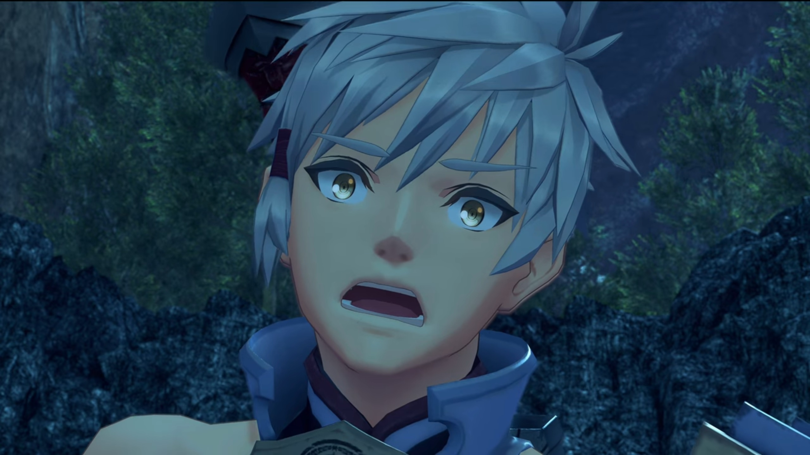
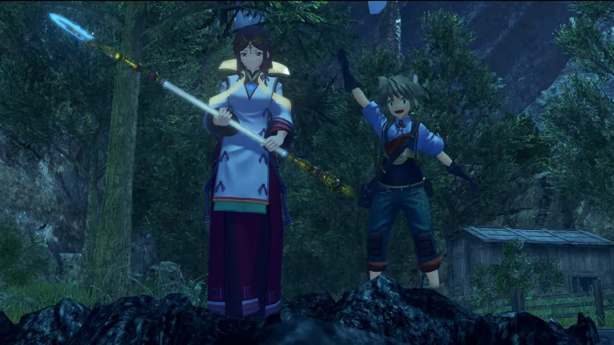
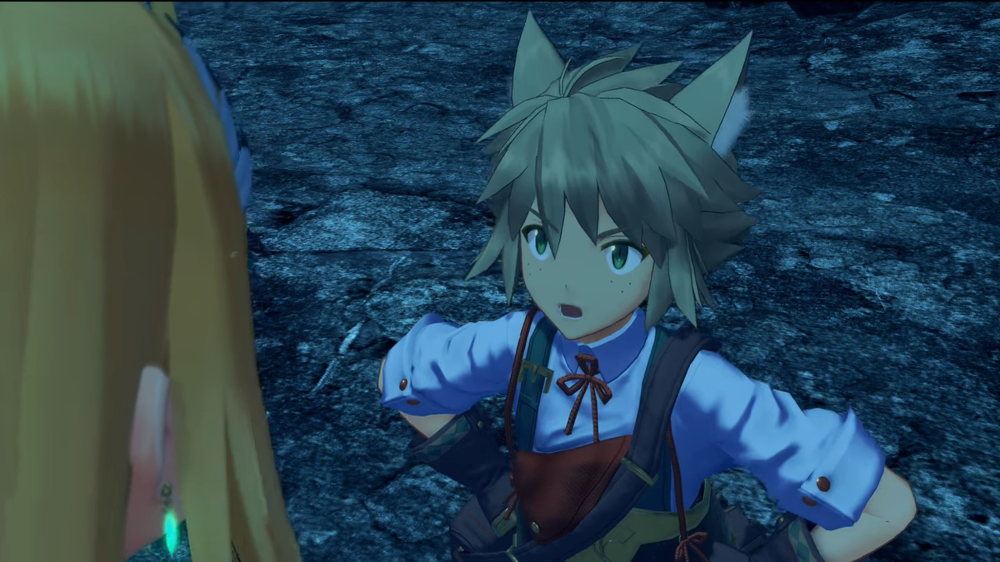
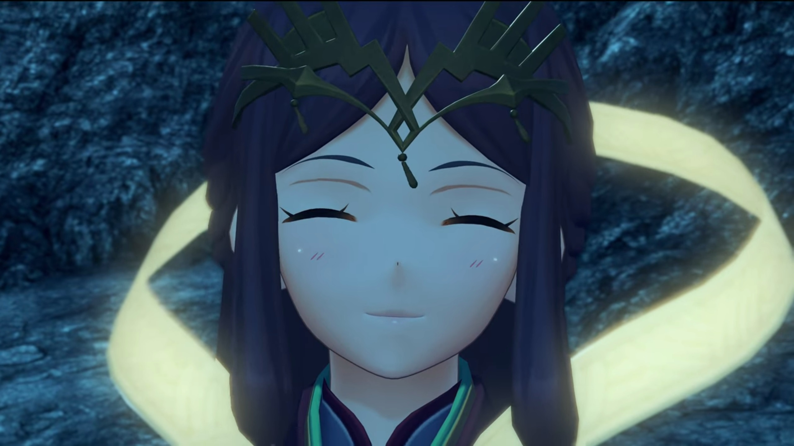
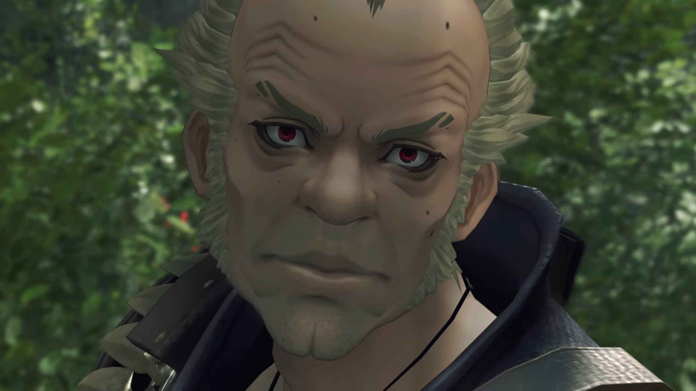
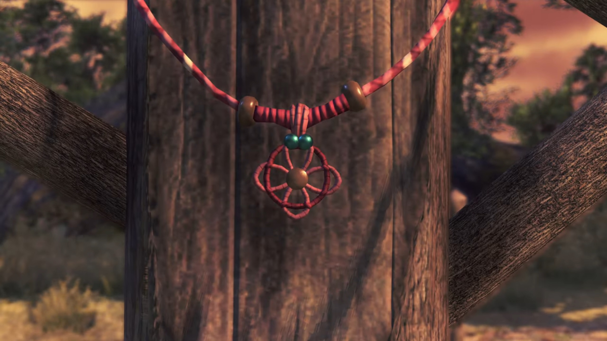
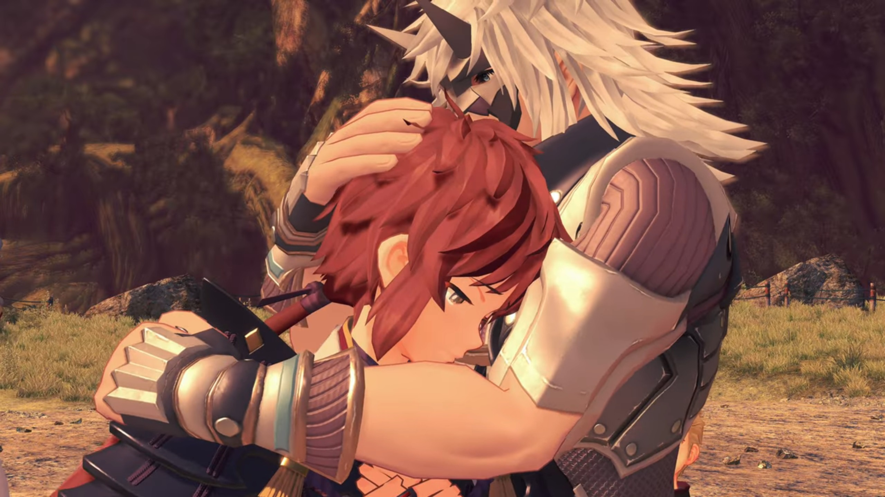

# The Other Aegis, Where's Mother?

===

"**CHAAAAYRKKK!!!**" Lora launched her whip at the guy, he sliced at the tip with a non-Blade sword, it rolled around. When she tried to pull it back, he twitched it and it stuck tight. It became a tug of war therefore. 

Jin jumped into the air, slashing towards the guy; the blonde girl came up from behind and launched herself up. He threw his sword down. The girl, halfway in air, hadn't had time to react, for Jin simultaneously launched himself at her, raised a shield; and mid-air, she can't change direction. 

"**HYARRRGH!!!**" She put down her whip and took his sword, launched herself at him. One slash, and Jin already landed beside her, took his sword from her, and made another slash at the guy. The girl landed in front of the guy, dueling with Jin, annoyed, 

"**The hell ARE these two?!** They're just a Driver and Blade, where's this strength coming from?"

"**Well, he IS- the Paragon of Torna.**"

"Hrh... I've had enough." Jin aimed his palm at those two, gathered icy particles. 

Lora, however, was surprised, tried to stop him, "_What?_ No! There's no **need** for you to-" 

She launched herself at him, but it's too late, and he isn't listening. Ice spears aimed at the guy; the girl pointed her sword forward at a location in front of the guy, the turquoise crystal on the headband she wore on her forehead shone bright, and a beam from above the clouds struck down, creating a giant field dome that swallowed his icy spears. 

"Whoa..." Lora was surprised. The girl now moved in front of the guy, putting her sword to her side, shielding him. The guy, surprised, sheathed his sword by sticking it to his back, excitedly exclaimed, 

"**YOU!!!**"

Jin backed down, prepared for another attack from what he deemed the mentally retarded. Lora eyes opened wide, mouth gaped, perplexed,  "W-what?"

He walked closer towards them, all the while holding his right arm straight at them, exclaimed, "**Incredible! You... Both of you!**" He opened his arms wide, as if to embrace. 

"Huh?" Lora was so confused at what's happening. She turned to look at Jin, hoping he would have a better idea of what's happening, but he's confused himself. The girl, whom'd already sheathed her weapon, crossed her arms and shook her head. Not the first time she saw him doing this, one supposed. 

"**That last attack? The force behind it was absurd! I'm amazed.**"

"Oh, ah, really...? Well, that's just..." She blushed. "Ahahaha..."

"**Oh**, and... **Passing the weapon...? What a CONCEPT!!!** How did **you ever come up with THAT idea?**"

Her face grew redder, eyes widened, "Oh, well..." (The guy waited in patience, with a smile on his face, for her answer. Lora looked to the side, blinked, and said) "We were... _broke._"

"_Ahhh???_" He bent his head closer, what an answer from her? 

Lora put her hands on her waist, put up an annoyed face, explained in an annoyed tone, "**We couldn't afford meals, let alone another sword.** And so we made do."

And this is the guy's face: eyes wide opened, mouth gaped wide, frozen. The same for the girl. 

Jin didn't have the chance to prevent her from saying that, gritted his teeth, facepalmed himself, and shook his head. 

"**AHAHAHAHAHAHAH!!!! You're kidding?!**"

"**Hmph!**" Lora crossed her arm, even more annoyed at him. 

"**Oh, man... You guys are the best. I HAVEN'T LAUGHED this hard in ages.**"

"Huh?" What do you even mean?

"**I really, REALLY like you two.**"

"Urrrrr...."

Meanwhile, outside, Mikhail watched as a boy wearing gray rags with gray-brown hair and tanned skin, accompanied by a girl wearing robes and big red long trousers, having long dark-brown hair dragging behind her as the wind blew while she ran, holding onto a short staff with both hands, dashing into the scene. The boy shouted, "**Master Addam! SIRRRRRRR!**"

Addam and the girl looked back, he waved back at the boy and the girl whom stopped at the edge of the pit, "**Milton!**"

As they were running into the pit, Lora's eyes widened. Milton immediately jumped and hugged Addam. "_Ohhhhh, thank goodness you're all right! Master Addam_, are you hurt at all?"

"Master... Addam...?" Lora gaped. "You **can't be THE** Addam Origo?!"

Jin shared what he knew, "The lord of Aletta... And fourth in line to the throne of Torna."

The girl gingerly walked closer, said in slightly annoyed voice, "Ohhh, come on, Milton. I've been **with him** the whole time. You really think these two would cause any harm?" She bent forward and looked at him wide-eyes. 

He bent forward with arms on his waist, argued back, "You've been using your dumb Artifice again, **haven't you?**" Milton had some freckles on his cheeks, emerald-green irises, and long cat-like ears. A three-leaf-clover-knot attached to his waiter-like shirt{{footnote: It really looked like rags earlier, so one'll not change the description.}}, which had green straps pulling up his trousers wrapped around his shoulder, and he carried a bag with a strap flung around his left shoulder. 

"**DUMB?!!!**"

"So yeah, sure, nothing to worry about, right?"

She stomped her foot; Addam put his arm to prevent the incited Mythra from escalating the argument. She looked annoyed at her Driver. Addam went down with a smiling face, asked, "Milton. Who's this, then?"

"Ah, this is Haze. She rescued me from the _jaws of some nasty mosters._"

Haze, with a face 80% similar to Lora, though with a different hairstyle, and wore a headband of indescribable shape, smiled back at him. The floating strip that stretched around the back of her neck glow in the dark. She had a diamond core crystal on her chest, which she revealed. She wore a priestess robe that had a wide V in the middle that allowed the core crystal to be displayed. 

"**Well, I'd better give her my thanks.**"

"Haze!" Lora called. 

"Oh? Was she- with you?" Addam wondered. 

Haze walked closer and apologized, bowed to Lora, "I'm sorry to keep you waiting, my lady."

---

Camping on the outskirt of the destroyed village for the night, someone put a pot on top of the campfire while they sat on the rocks arranged in a circle, sharing stories. 

"I see... So that's when... _What a sad, sad tale, Lora... Nghuh nghuh..._" Tears started overflowing Addam's eyes. He covered it with his palm. 

Milton sighed, "_Ohhhh, here we go again..._" He got up and offered him his handkerchief. He took it and cover his eyes with it. 

While Mikhail was watching, wondering why he would cry so emotionally, someone told him, "Don't let it get cold, now." His attention diverted, seeing Milton passing him a bowl. He took it from him. 

As his tears dried, he asked, "So then, how come you've enlisted with a band of mercenaries?"

"I guess I like the **freedom**." replied Lora. "**This way** I'm not tied down, so I can help out... with **causes I** really believe in, you know? Going's tough everywhere you look these days, _right?_ I _can't ignore it, can I?_"

"I understand."

The girl commented, "Fat load of good that'll do- in the long run. The world keeps turning _anyway._"

Addam was looking at her while she closed her eyes considering the logic, then Jin rebutted, "You might think that." (They looked at him, wondered what he got to say.) "But mercenaries and statesmen- each have their own views and ways to effect change. It's **not** in vain."

She lightly commented, "**Huh.** A Blade siding with humans... You don't see that every day."

"**I think** it's Blades like **you**- that are _rare._"

She seemed to take it as a praise, folded her arms and pushed her nose high, "Well, **duh!** You do **know**- what I am, right?"

He emotionlessly expanded, "Lacking in compassion."

"**HUH?!!!**" She snapped into position, her eyes widened. 

He folded his arm, not changing his mind, "**Blades like you**- really _are_ a rare sight. That may be for the best."

"**Pfft URGHHH...**" She tsunderely looked to the side, refused to argue with him. 

Lora watched them finished their conversation, turned to Addam to continue theirs, "So about Jin... _I suppose you have to take him away from me._" Jin looked at her. 

Addam sternly answered, "I **could** try to slay you _right here..._" Jin turned his head at him. 

"But?" She looked to the ground, wishing what's ahead won't be worse. 

"**BUT-** my mission is _to stop the Aegis's destruction... To subdue Malos._ **Not** to seek out _lost trinkets._ **Who cares about Paragons** anyway?"

"Huh?" That came as a surprise. Her depressed mood lessened. 

He suggested, "**How about... you two** join up, **lend us** your strength? **Your incredibly** powerful. **There's loads** I want to pick up from you... **like that trick** from before! Let's see..." He reminisced for a while how to deal with the situation. "**We'll say** I found the Paragon on my journey, **and decided** to entrust him to you. **To help** with Malos. **Well? Sound plausible?**"

Her eyes widened, her mood uplifted, "That's just..." He gave her a smile. The girl just shook her head; always hearing this kind of stuffs every day. 

---

The night's getting colder, even with the flames, now without the pot, burning bright and huge. Addam and his Blade had went somewhere else, leaving Lora sitting next to Jin, happily conversing, while Mikhail quietly resided in his inner thoughts even when he sat next to Milton, whom put his hand on the back of his head and looked at him sit-sleeping, while Haze sat closer to those two and observed. Perhaps he sensed their fiery gaze, opened his eyes to look at what the spark they were having their attention on him. 

Outside the fence, Addam and the girl watched them interact. The girl sniped, "**How dare** he speak to me _like that?_ **He thinks he knows me!**"

"'Coarse' is the word."

The girl agreed. "**Yeah! He is!**"

He turned to look at her, corrected her, "I meant you."

"**ME?!!!**"

"**He meant you're** unpolished. **After you return** to your core, you lose your memories. However, **as you gain experience** with people, gradually the nature of a Blade... rather, their _feelings_... **they change** and grow. **You become** more- and more human." (She's thinking hard; we don't know what's going on her mind.) "But **you**- purposely keep yourself _apart._"

"**Oh, so now** it's my fault?!"

"**Nooo, not at all!**" (Her eyes widened.) "**I respect** that part of you."

She blushed and looked away, don't know how to reply except to keep her tsundere. 

---

Meanwhile, at the camp, Lora saw that Jin was bending forward with his elbow on his knees, closing his eyes as if sit-sleeping, asked, "**Hey**, are you... angry?" (He looked at her for further explanation.) "About _this whole Malos thing..._"

He shook his head. "I'm not. Whatever happens, _I'll protect you._ Be sure of it. We **cannot** simply ignore- what's **happening**- in the world. But..." He looked back at the floor. 

"Buttttt- what?"

He turned to her, "**Please say** you'll _be careful._"

"Hmph! I will." That's a promise. 

---

The morning bird rose and ate the mating worms. The sun shone through the clear sky, casted its warmth on the nearby hills and mountainous structures. Addam, the girl, and Milton were gathering around for a refreshing chat. The irregular wind blew past swayed the piece of loose cloth that stretches on her back. 

"Erm, Your Highness?" Lora approached and disturbed. 

"**Just Addam** is fine. What is it?" Her group had gathered around beside her. 

"The going after Malos thing... Could it wait a few days?"

"**Ooooh**? Is there something you need to do _first?_"

"I... Well, yes."

He folded his arm, waiting for an explanation. Haze took over, "You see... Lady Lora seeks the whereabouts of her mother. Unfortunately, **she has** her mercenary duties to perform. **Therefore, I** often go out and conduct these searches myself."

"I see... Then, you've found her?"

"Y-yes." She turned to Lora, "With all that happened yesterday, I did not have the opportunity to say{{footnote: What's with all the nighttime???}}... M-my lady, your mother is currently residing in a small hamlet called Torigoth."

"Torigoth." She repeated the word, as if she held on to hope itself. 

"That's on the edge of Gormott." Addam heard about the whereabouts before. Both turned their attention to him. "Ardainian and Coeian forces clash out there _frequently. It's very dangerous._"

"Indeed." She who did the research agreed. 

"Riiiiight, (he folded his arms) **no time to waste. Let us head out** there!"

That surprised Lora, "**What?! But** what about your mission?!"

He asked instead, "You don't **want**- to see your mother?"

Her eyes widened a little, "Of... Of course, but..."

He gave her no chance to rebut, "**Then LET'S GO!!! Malos hasn't hit** that part of the world yet. It's as... good a place as _any to look._"

"You're hoping we might... find him there?"

"Exactly."

"That _sounds too easy..._"

He put his hand on his waist, concluded their mission, "**We go** to the village of Torigoth- to find Malos. And- **you go** to Torigoth **to find your mother! Everybody wins!**"

"And once I've found my mother, I join up with you?"

His smile broadened, "**Hmmm!** That's the general idea. **I'll send** my people to notify your mercenary friends. **And perhaps** we could find a place for your mother in the capital? _It should be safe there._"

Her eyes widened in disbelief, questioned out loud, with clearly a tone of friendliness, "Is this normal princely behavior?"

The girl gave them a eyelid-half-closed look, "Mmm you think this is bad, just stick around for a bit."

Milton argued back, "Nobody's, like, _making you come along, you know?_"

She folded her arm, "Un-fortunately (with a thick sigh), a Driver and Blade are one in body- _and soul._"

"_As if you don't do whatever you feel like anyway..._" And they looked at each other, locked in an eye-staring contest to who will back down first. Addam smiled at their interactions; he really thought she'd changed quite a lot ever since he resonated with her. And that he felt glad. 

He turned his attention back to Lora, "I _know this is all very sudden._ **Still**, we don't know where we'll run into Malos next. It makes sense _to stick together_... **as much** as we can."

---

Unbeknownst to them, hidden behind the tall grass some distance away, staying low-profiled was a guy with short gray hair and slightly tanned skin with some paintings on his eyes to thicken his eyebrow, and deep sacs below his eyes, plus some moles randomly placed on his face. His crimson iris locked on to one of the figure in the group, recognized, "_Isn't that...?_"

He remembered, a long time ago, when the young girl touched the crystal and he materialized, kneeling before her while he regained consciousness, he, wearing nothing on top, ignored him for the moment, taking a knife and going after the little girl, whom was awashed with fear, stabbed deep into an unknown part before he could land his hand on her. 

He wore some leather jacket so small it left most of his body parts naked, and a blue-purple strap strapped over his chest. His bellow was forever wrapped with thick bandage, as thin as ever. And his right arm had been replaced by a mechanical one. A necklace with 4 animal fangs he wore. "_No mistakin' it. That's the Blade... And_ that little brat, _too!_"

Even though she had grew up to be different, for 17 years, he had lived in agony ever since. Oh, he thought, if he had not let the little girl born into this world, how rich would he now be. But all for her he now in this situation. He turned around and looked at a common Blade{{footnote: Common Blade, unlike rare Blades, are Blades that had nothing that resembles a human or an animal, mostly looked like humanoid robots or animistic robots in appearance.}}. The Blade immediately know what he wanted, pushed his arms and summoned some ether, materialized the hologram of a person's head and neck. Communications established, the guy spoke through, "Hey, it's Bluefist."

Some communications exchanged before he reported, "Yeahhhhh, the **whooooole village**{{footnote: He didn't shout it out, only emphasized.}} was wiped out. Found myself some **great Core Crystals**, though." He looked at the sac laid on the floor with darkened Core Crystals. 

"And... _I found somethin' else, too. Somethin'_ reaaaaal interesting."

On the spot, Jin took out his mask and covered his face, as if that would prevent the others from recognizing him. The guy watched as they were leaving the destroyed village, said to the hologram, "Uh-huh. Gimme some time to take care of this, OK?... _I'll be in touch._"

The hologram dissipated. He glanced at their shadows, exclaimed, "**Hah!** _Fate's a funny thing._ **Never thought** I'd get to take back that Paragon- what I stole in the first place..." The last sentence he speak through his teeth gritted, his tongue twisted. 

---

The ship, a cabin hung below a fish Titan, parked at the edge of their journey, took off for the sky. 

Some journey passed before they arrived at the meadow-covered port. The land stuck out so little you could safely jumped off the ledge and dived below the clouds; or if you're afraid, there were some roots that you could climb down along. 

---

A raindeer-shaped turquoise Titan, its head stuck high, with scales on its neck, its roots-like back floated very near the cloud sea's surface. The other parts of its body submerged below the clouds. Where there's a break between the land, water falls off. Some huge trees grow on the back of the meadow, scarcely filled with small fig trees puny to the giant Yggdrasil-like ones. This, is Gormott. 

---

The group waited for Lora, whom stood on the path leading to a burnt-down village. Only traces of its pillars remained where it hadn't been burnt down. Lands were abandoned. Trees within were devoid of leaves, probably suffocated to death. Its ground barren. She took a few steps closer. It was like two worlds within the perimeter and without. 

"Oh no..."

"Here, too?" Addam wondered. "Gormott's an attractive target, but **this**?" He took some time to pay his deed to the fallen. "Whoever did this... clearly had no compassion or respect- for the people they killed."

The girl wasn't too compassionate either, brushed it off, "Whether it was Malos, or someone else. Either way... clearly, they're allllll toast."

"**Mythra!**"

"**Uphrhhh???**" She stopped speaking mindlessly, looking at the shadow of the girl whom was immersed in her loss. Jin was worried for her, called out, 

"Lora..."

"It's... It's OK. Mother... could have run away somewhere safe..." Though she wasn't so sure herself, deep down. Though she don't want to believe what she feels deep down. 

---

Entering the village and exiting from the other side, the group found some wooden stick used as primitive tombstone, stuck into small dunes aggregated in the cleared land. Addam led the way, commented, "Look. Fresh graves over here..."

They scanned left and right. Haze's eyes fixated on a man whom laid dead between the graves. "This kind soul must have dug them all..."

Mythra focused on the guy, closed her eyes and quietly cried, making sure she doesn't let out too loud a sound to attract attention. But her Driver heard her, wondered, "What's wrong?"

"Should... Should we maybe bury _him, too?_"

"_Huh!_" His eyebrow raised; the girl that depreciate people, speaking openly without an act of compassion, have no feel for what people feel, started to feel something herself? Had what he planned to teach her started to get through? His smile broadened more and more, decided to go with her, "Mm. Yes, let's."

Meanwhile, Lora's eyes caught something; caught in a surprise, she ran toward one of the wooden stick and looked at it. She looked at it clearly, the texture, the shape, the color; her eyes widened. A necklace of red string, some parts damaged you can see the white underneath. Two beads tightened the secondary layer of string wrapped around its middle parts. Directly in between was a 4-leaves clover connected by a circular button in the middle, like a cliché flower, and another circular ring smaller than the clover's circumference placed in front of it. 

She carefully took it off the post and examined it closely, trembles as she feels the texture she long reminisced, last felt when she was way younger. 

"_This..._"

> The young Lora happily wrapped the strings aroundthe final part of the necklace. After tightening it and making sure it does not fall off, she took it up, viewed it against the wooden walls, and smiled. A pendant for her mother! 

"_I made this for her myself... She... kept it, all this time..._"

She took it with both hands and placed it near her heart, tears overflowing the tip of her eyes. She closed her eyes, trying to feel her warmth through all those years of memories. Jin sighed. Haze put her left fist on her heart. Jin walked forward and put one arm on her head, wrapped around her shoulder with another, and gently bring her head close to her chest. He felt his chest getting wetter and wetter, and closed his eyes, sharing her moments. The rest of them gave her the time and space she needed. 

Perhaps the tranquility and peacefulness of this barren, abandoned land was what she need to rest. 

### Footnotes: