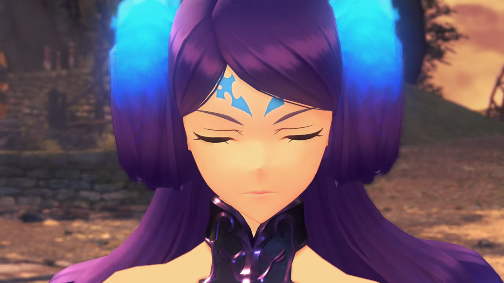
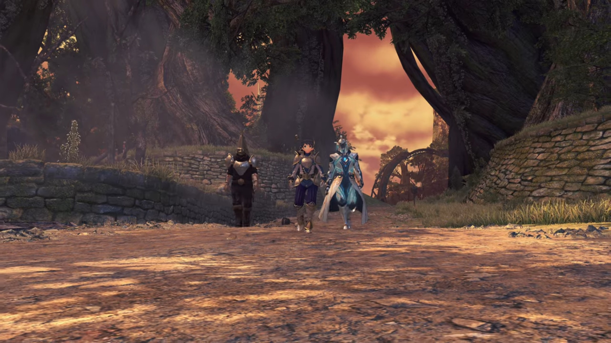
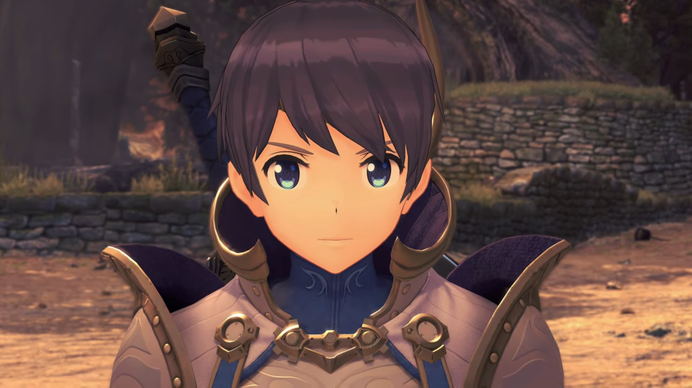
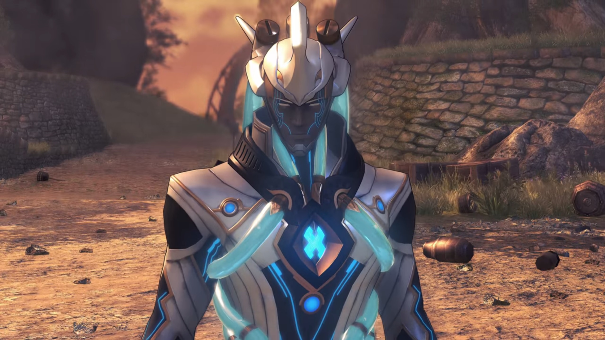
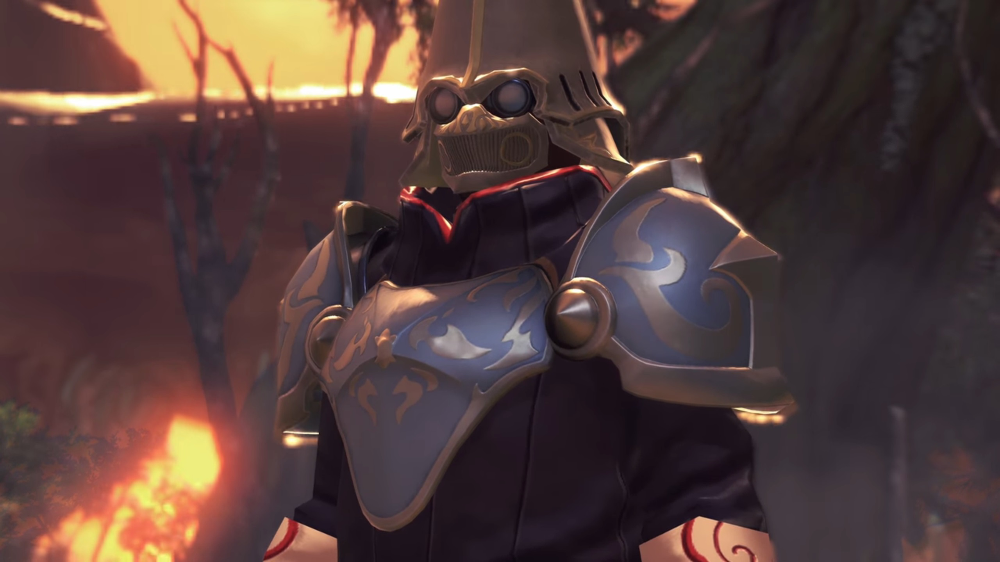
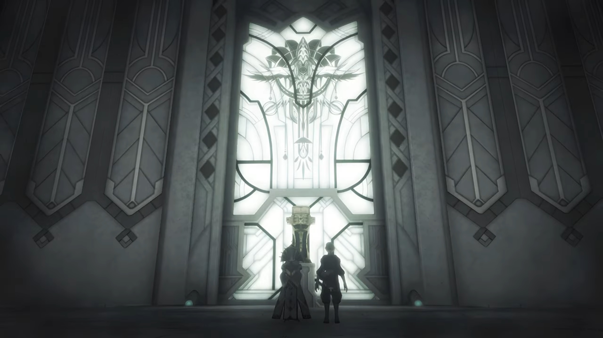
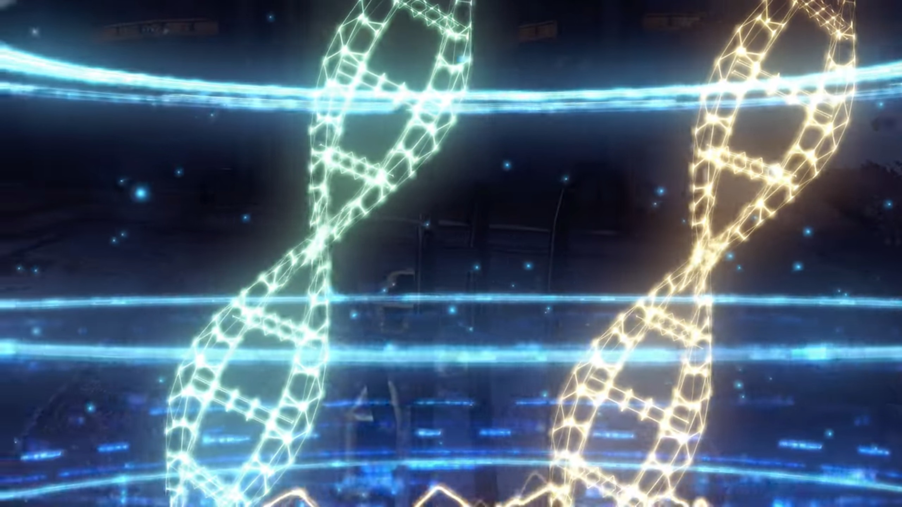
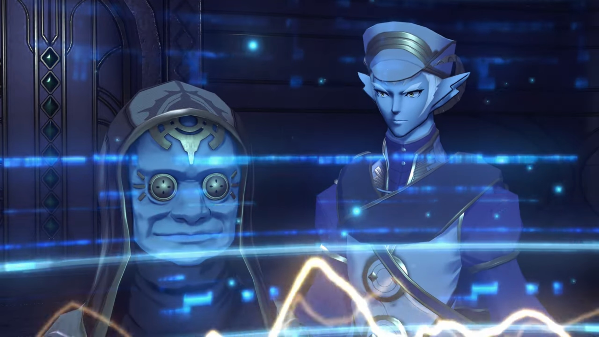
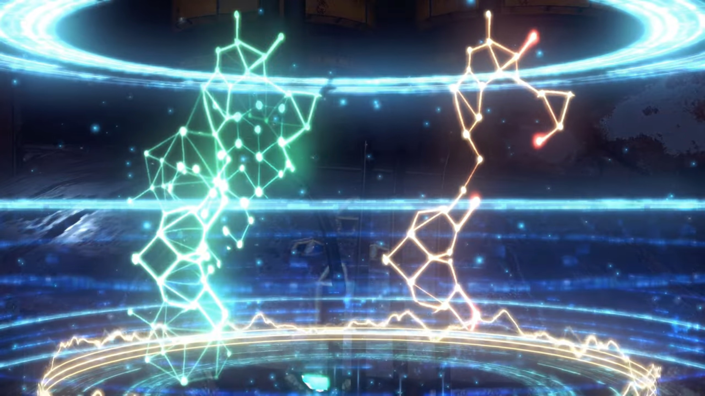
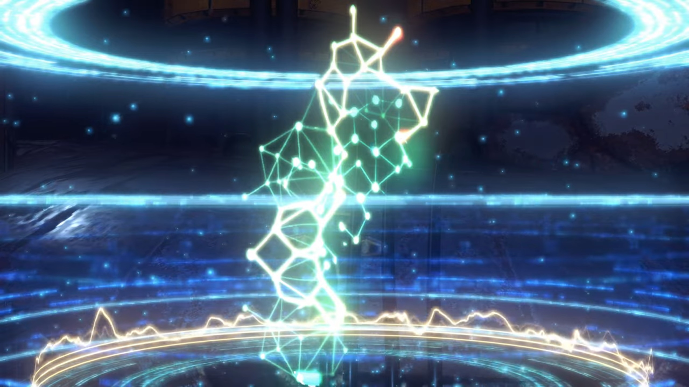

# New Friends

She kept her head down as she walked past the burnt village once more. Mustering the courage to get out of his hug, she couldn't come out of it whole yet. Jin, Mikhail, and Haze knew that -- they trailed closely behind her, but careful not to disturb her, giving her the time and space she needed most. Perhaps time will provide her with salvation. 

"Surround them!" Someone's shout disturbed her. She looked up and saw soldiers dressed in metal buckets in front of them, one of them pointing at them, and the rest raising their crossbow, which were equipped with a bayonet. 

"Huh?" Addam was surprised. He looked to the sides and behind him; they were fully surrounded. Perhaps if they'd not immersed themselves in her gloomy weather would they have noticed something off; but it's too late. "Ardainian troops? Imperial Guard?!"

"Thieving scum! **Don't think** you're gonna get away with your dirty deeds!" The captain folded his arm and mocked. 

Feeling misunderstood, Lora tried to explain, "_What?_ **No! We just-**"

"Problem, Captain?" A girl wearing blue high heels and purple long skirt walked into the scene. A long hair of purple, with blue flames smoldering on the tips of her hair. While she walked past the Captain, he stood as straight as a fig, pushing forward his chest and raising his head up. Some test-tubes containing orange liquid attached on a string wrapped around her hips. Blue flames raised on the thick hair beside her ears. There were some arrow drawings on her head, the larger ones pointing towards the top of her nose, while the smaller ones plunging themselves into the bigger ones perpendicularly. She'd fair skin, and her eyes always closed. Everyone's attention was on her. 

The Captain followed behind her, standing at her 8 o'clock, reported, "Lady Brighid! They're brigands. Same ones who attacked the village, perhaps!"

Her eyes may be closed, but she can sensed clearly, and certainly she knew they weren't, "Drivers and Blades... _Mercenaries?_" (But she didn't correct him for his mistake.)

Addam turned his back to the soldiers, commented, "So that's Brighid..."

"Captain. **I**- shall deal with these individuals. Emperor Hugo **must** be briefed."

"Yes, ma'am." (She drew out her truncheon, prepared for battle, while the Captain ordered,) "You lot! Stay here and assist the Lady Brighid."

"**Sir!**" The battle hence begun. 

---

"**ARRRGGGHHH!!!**" Sparks flew as Addam sliced through the incoming arrows. With a forward thrust, he fell 2 soldiers before they had reloaded their crossbow. On the other side, Lora's whip wrapped around one of the crossbow, pulling it off his hand, while Jin appeared from behind and sliced him down, along with another soldier coming to help him. 

"Not done with you!" A beam shot straight from Mythra's sword onto Brighid, whom raised a shield. "**YRRRRAAAGGGHHHH!!!**" After she descended the sky, she launched herself at full force towards her, sword clashing with truncheons. Her twin truncheon could change form, extending into a backbone-like whip where blue flames smeared along the joints. She swirled it round and round, like a professional yo-yo player performing tricks. 

She jumped into the air, "**YARGHH!!**" Blue flames split into 6 globules and landed around Mythra, raising a wall. 

"**MUARRRGHHH!!!**" One slash and she extinguished them. "Ooooooohhhh, **COME ON!!! That was-** a pretty cheap trick!" She then teased, "Keep going like that, you'll get a reputation!"

She dropped back to the ground, looked at Mythra with her nostrils, mocked, "Cheap, you say? **Don't** be absurd. It's called tactics, look it up. But perhaps that's something a **simpleton** like yourself could **never** hope to **comprehend!**" Her whip once more came at Mythra. 

"Urgh!" She had not the time to rebut with her hands busy, but her mind kept swirling around the word as she repeated herself, "A simpleton?"

Brighid pour more oil onto the flame, "**Your** attacks scream it. Clumsy, heavy, _no refinement_..."

"Urgh... I was gonna go easy on you, but now...? Now, you **PISSED ME OFF!!!**" The crystal on her forehead shone bright green. 

The green was so bright her Driver, whom was attacking the soldier on the other side, noticed it, shouted back, "**Mythra, Stop! We've got children here!**" Behind him, Milton and Mikhail hid behind a tree trunk. 

But she wasn't listening. All she wanted was to crush this wretched woman whom mocked him, and her heat on top of her head, she failed to listen to any outside commands, focused solely on the flaming woman. At the last moment, Brighid sensed something coming fast from above the sky, subconsciously jumped behind a really large distance before it struck where she formally stood. "Ngh! What was **THAT?!** If _that_ had **actually** hit me..."

Now Mythra put up a smirk, putting her sword on her shoulder while calling out, "Ohhh? Didn't like that, did you? Tsk! I can see it on your face! Well, on that note..." Once more the crystal shone bright. 

"**MYTHRA!!!**"

"**Haze!**" Lora called out. They had to stop her, if not by instruction, by force. 

"Understood." She stuck her staff on the ground and the crystal emanates a warm wave that brushed through them, then she raised it over her head, raising a huge field that engulfed the whole battlefield. 

"Nggghhhh... Wh-what?" Mythra suddenly felt her powers dimmed down, as if gravity suddenly multiplied a hundred times. Her ankle were crushing under her own weight, "B-but... How?"

Brighid was in even worse shape, cannot resist a tad, on the floor on all four, "**HORRRGHGHHH!!!**" 

"Is this..." She strenuously turned her head to her left, asked, "...you? **What the hell? She's our... enemy!**"

Lora sternly spoke, "Addam plainly ordered you to stop. Or didn't you hear him? _Simpleton._"

"Grrhhh..." She stumbled, resisting strongly not to go on the ground. 

Brighid was impressed even when she couldn't resist, "How extraordinary... I'd heard of a Blade with the power to **restrain others, but I never thought...** And, did she say Addam?" She looked to the guy who shouted orders just now. "It can't be..."

"All of you, lay down your arms!" A boy wearing armor, accompanied by someone wearing white worker boots with short heels and a cloak that stretched just a few centimeters above the ground, walked into the scene. Behind them was the reporting captain. The group's attention turned to him. Brighid strenuously turned her head to look at him.

A boy wearing plates with two flag-like pendant with a dark-turquoise diamond-shaped crystal fitted at the end hang from both side of his chest. The white-worker boots wearer was presumably his humanoid-form rare Blade, with 3 soft tube-like 'hair' screwed to the top back of his head, dangling behind, and wrapped around the rest of his body, with visible light blue bubble-contained fluid flowing within. His arm held on to his sheathed sword. 

Addam had came up and stood beside Mythra, whom had finally knelt on the ground. The guy stopped and said, "There is no- need for this."

Addam first went down and put his arm on her shoulder. She forced her head to look into his eyes, whom sternly looked back at her. "Grrrgh..." She had no choice but to sheath her sword. He then looked behind to Lora and nodded. She exchanged glance with Haze, and she agreed to stop exerting forces on them. Feeling the pressure loosened, she dropped, supporting herself with both her hands, heavily panting. Addam held her shoulders softly and helped her up.

While she was left immersed in guilt, his attention turned to his new guest, "**Hello!**"

The boy faced him and smiled. 

---

Addam and the boy walked closer to each other, he felt content and sincerely apologized, "It's good to see you again, Prince Addam. Please- forgive- the actions of my guards."

Hospitality high as usual, he reassured, "**Don't you worry** about it. I'm just **glad** to see you well, Your Imperial Majesty."

Lora can't believe what he'd heard, "Imperial... Majesty?"

"**May I introduce...** The Emperor of Mor Ardain, Hugo- Ardanach."

"The Ardainian Emperor?!" She seemed flabbergasted, her face frozen, wondered, "What's someone of his station doing out here?"

Addam don't agree, corrected her, "**You know, OUR stations** are fairly similar..."

"_Not that you'd ever know..._" Mythra complaint. 

"Thanks! I try."

"I've come for the Aegis." Hugo went straight to the topic. They turned their attention back to him. "Its actions have been felt in Mor Ardain, as well. We're currently chasing it down."

"The same as _us, then..._ But coming here _yourself?_"

"My brother- is ruling in my absence."

"I see... And so you brought Brighid and Aegaeon...?"

"Huh?" Lora and the others were surprised. They turned their attention back to the woman Blade that attacked them earlier, and the Blade standing behind Hugo. "Those two are the Crown Jewels of the Ardainian forces. Wielding them on the front lines is the _duty- of he who has the throne._"

Hugo agreed, "Indeed... That ought to have been my older brother."

"But he didn't have the potential to become a Driver. And now, _here you are_... bonded with _both of them._" He then turned his attention to the Captain, his smile thinned somewhat, and Hugo followed his glance. He introduced, 

"This Special Inquisitor- is under my brother's direct command."

"**Ohhh!**"

"Should I fall in battle, **he has** his orders to retrieve- the Core Crystals."

"That sounds cold..." Lora commented. 

Addam wasn't surprised, "That's how it goes with _matters of state._"

"And yet... It works out well for me." Hugo shared. "I have always wanted to put myself on the line- for our people. And I never enjoyed- wielding authority in the first place."

"I **feel the same way! I don't get why** anyone would want to sit on a throne."

"Yes, that? If Prince Zettar knew, there would be consequences." He teased. 

"**Let's... pretend** you _didn't_ hear me say that."

He constricted his eyes a little, commented, "You two will never see eye to eye. Better to leave well enough alone."

"Ruling is... Frankly, it's a scary thought. **Just imagine**, becoming someone you _don't recognize_...{{footnote: Power corrupts is real. People always choose someone kind and with high hospitality, willing to listen to them speaks, willing to change, etc. to rule the throne. But as they sat on the throne longer and longer, they change. And because news reports only the bad, what you heard are the consequences of (s)he whom'd been transformed by powers. And they didn't even realize, thinking that's how they originally think.}} Never knowing _who's looking **back** at you_ in the mirror..."

A moment of silence as they digested his words. Hugo then asked for a favor, "Prince Addam. I'd be happy if you call me Hugo, like old times."

"**I will,** dear Hugo. **But only** if you'll call me Addam in return." He kindly nodded. Addam then get to the point, "**Well,** it would be beneficial to share our findings. **But perhaps** elsewhere might be better?"

"How about Your Majesty's flagship?" Aegaeon suggested. 

Hugo agreed, "Indeed."

"Flag... ship?" Now that's something that bothered her. 

"Is something the matter, Lady Lora?" Haze wondered. 

She tried to sound like it's not very serious, "I-I'm just... not very good in that kind of stuffy environment..."

Mythra immediately agreed, "**Oh you're not alone there!** That's the WORST!"

"**Right?!**" She turned to Addam, said, "**I think...** I'll sit this particular venture out."

"**Yeah, I'm out too!**" She immediately flung herself round and wanted to leave, but he's faster -- a firm grip around her wrist prevented her from doing otherwise, 

"**OHHHH NO** you don't." She gave her an intensely annoyed look. 

Hugo's eyes widened, "_Wait a minute..._ Is that her?"

Addam introduced, "Yes. This is Mythra, _one of the Aegises._"

"Ngh..." She really don't like this kind of introduction, especially after having her request declined. 

He turned to Lora, "**Your account** would be _valuable as well, Lora._"

"Everything I've seen or heard, Jin will know as well."

Huh? Someone's calling me? "Ah, y-yes, that's true." His raised his eyes from the floor back to them. 

She turned to him, quietly pleaded, "_Pleaaaaaaase, would you go instead of me please?_"

He never forget his promise. He first turned to Haze, whom nodded back to him in assurance. He shook his head, then look to Hugo, speaking in a zombie-like voice, "Of- course. I will do as you wish."

"Thank you, kindly." All set, he asked, "Well then, shall we?"

---

Indol. Small ether lamps barely lit the corridor. Even so, we couldn't see the face of the person whom hastily traversed it, not until he arrived below one of the orange lights. A young sharp-chin blue-skin guy with thick white eyebrows and sharp eyes, two thick strands of hair fell down the side of his face, a large long nose, and ears the shape of fins, seemingly wearing a cap. Even when he was walking, his mind traversed back in time. 

He remembered standing before the Indol's crest painted on the translucent window, in between them stood a podium-like object which hosted a giant trophy-like object. 

"Interesting thing you've got there." The guy and Praetor Rhadallis turned around and watched Malos approaching them. When he reached in between them, he teleported through, continued to reach the foot of the trophy, looking up at it. 

"Malos, enough." The guy, Malos's Driver, Amalthus, ordered calmly. 

"It's all right." Praetor Rhadallis said. "Indol's most sacred treasure. The Aegis. It is said to be the embodiment of the Architect's light... The divine revelations our founder Meldinare received."

"Really?" Malos wondered. "Then... "

He stretched his hand forward and aimed it at the trophy, dark energy gathered on the palm of his hand. Both wondered what he's gonna do when the trophy shattered into thousands of shards. He finished, "... that's what I will be called, too. After all, I am born... _of divinity, not just some reflection._"

"You believe yourself _so strong?_" Praetor Rhadallis asked calmly, seemingly not bothered by his action nor the loss of the heritage. 

"_Huh..._ Don't you?"

---

"Your situation doesn't look good; Baltrich is not going to let it go."

Amalthus stopped, looking at the old guy, a short, blue fellow wearing metallic glasses with 4 holes to North South East West each, wearing a red cloak that cover his head. The guy continued, "And you can't hide behind the Praetor forever..."

"That has nothing to do with you."

"If that were true, you wouldn't- _be here._"

"Mhrmm..." Amalthus opened his eyes wide. 

"HrrrrrrrrrHAHAHAHAHA!!!" The guy turned around and walked away. Amalthus followed. "Here."

The door opened and they walked past it, side by side. 

"What is this place?" He stopped behind the old man, whom went up to the panel with a glowing blue ball in the middle of the well, and meddled with it. The door closed behind them.

"It's a very tasty secret... Formerly known only to the Praetor- and me. The essence of our Judician forbears, originally salvaged from the **bottom** of the Cloud Sea. Some of it may hail from the fabled Land of Morytha..."

"_Morytha...?_"

"Look." The blue ball shone brighter, and a hologram formed atop it. Several blue rings showed the boundary of the 3D cylindrical 'screen', drawing out 2 DNA pairs in it, one green, one orange, side by side. "This here display is a diagram of what human cells are made of." (He moved his eyes from the orange to the green.) "And then this one here is a Blade's."

"Astonishingly alike."

"Of course. After all, they are descended from humans too. That in and of itself isn't **too** shocking... _But this..._"

The screen removed the Blade's DNA to show only human's. The orange ring below fluctuates on its circumference like electricity dancing, or like the graph of a stock market's volatility. 

"It's the same, isn't it?" Amalthus can't see any difference. 

"_Just wait..._"

Thousands and millions and billions of DNA chains ordered in random sequences, connecting to many globules of largely formed structures that looked like worms or clusters, that was small compared to the layers upon layers of even more larger structures that looked like flat pieces making up different levels, and millions of such levels formed the shape of a Core Crystal. 

"_Huh... That... that's a..._ Core Crystal." exclaimed Amalthus. 

"Exactly. A Blade's Core Crystal contains information not only pertaining to humans... It also records schematics describing alllllll manner of animal tissues."

"You're saying- Blades- contain detailed information of alllll living creatures?"

"Not- just that." (The screen changed to a structure that looked like a horoscope) "Have a look at this undeveloped part."

He brought up a similar green one and show the web-like structure side by side. 

"That is from a Titan." (Then, bringing the two together and merge them, said,) "It suggests that this... particular piece may one day develop **into** a Titan. **Isn't it mind-boggling?** A message from the Architect, no doubt."

"From the... Architect..." We don't know what he's thinking, but his eyes focused on the structure, he didn't seemed too surprised either, judging by his emotions and reactions. 

The old man turned around and reaffirmed, "**Indeed.** This is **just** what you were after. I wish to investigate this, and learn more of what the Architect has in store for this world. And, _perhaps, claim this knowledge for our own._" He looked at the sky as if he would one day be divine. 

Amalthus looked at him through the bottom of his eyes without tilting down his head, "Including- the Praetor?"

"Per-haps..."

Amalthus clenched his fist so strongly he couldn't help but vibrate. The old man seemed not to notice what he's doing, or perhaps he did but ignored it, said, "Isn't this _in line... with your own goals? Well then, I may as well help out._"

Amalthus looked up, already calmed himself down. 

### Footnotes: