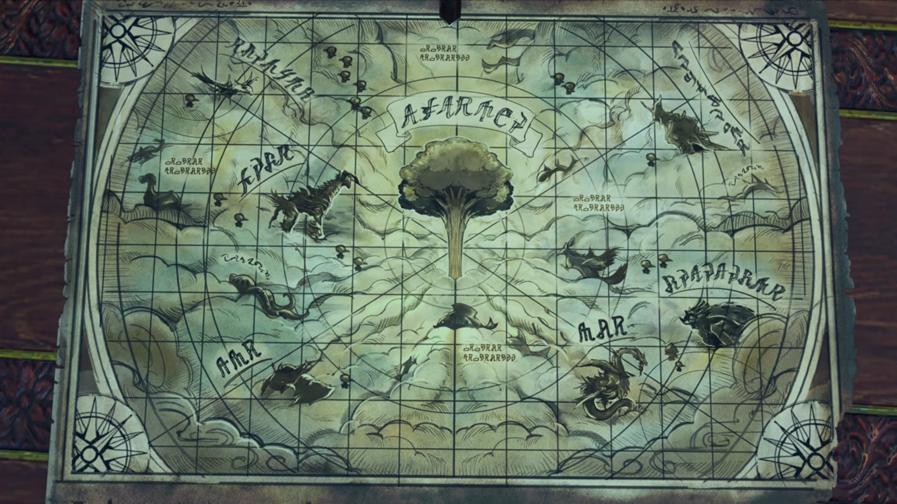

# Gort the Bluefist

Great plains stretched across the outer circumference of the giant Titan, with thicker foliage acting as boundaries nearer towards its center. The flagship was a submarine-like tank strapped to the bottom of a giant fish Titan, so long it stretches throughout the view alongside the plain we could see from our point of view. A wooden port packed with crates and a small hut, probably a security tent, lead to its entrance. The submarine-like tank seemingly buried deep into the fish's flesh, as its mouth was totally replaced by the tank. 

"Right... So it was the **Coeian** forces that **ravaged** this area..." Addam concluded. Around the table stood Hugo, Mythra, Jin, and him. Aegaeon stood near the entrance, while Brighid laid her back on one of the pillars on the opposite side of the room. Along the walls, beside the control panels, was tables and chairs; which Milton and Mikhail sat on, the former just cannot stop speaking exciting things to the listening latter. The internals of the ship was metallic, like that of 18th century Industrial Revolution, and polished wooden planks paved the walls and the floors. 

"Yes. Many troops remained here, with no orders, after Malos sank their homeland. We're doing our best to disarm them, but... Well, you've seen the village. Sadly, it's happened more than once." He dropped his head in guilty. He thought it's his responsibility for not dealing with it effectively. 

On the center of the table laid the map of Alrest. It was a circular map, like that of Ptolemy's Universe. The World Tree stood on the center of the map, while the Titans, seemingly poking their body out of the cloud sea, circled around it at different radius, different speed, different location. Annotation of their names were present. 

"The powers that be _bicker among themselves_, **ignoring** the larger danger."

"And right now, that is the **one thing**- we cannot afford." Hugo agreed. 

Some weird sound coming from above their head suddenly. He raised his head, wondering why were there concentrated footsteps above their ship. Oh, no, maybe it's echo -- it probably came from the stepping on the wooden port, he guessed. Turning their ears in all directions, the group can't figure out what's happening. Aegaeon then volunteered, "I will go take a look."

They watched as he disappeared behind the door. Then, Hugo turned to Addam, changing the topic, asking, "Incidentally, how has Torna been faring?"

Their attention returned while Addam replied, "I'd like to tell you that the people bask in the _peace_ of His Majesty's rule..." (He put his hands around his waist and looked at the ceiling, then dropped his head,) "...but I'm afraid that would be a lie."

"Same as everywhere else, then... Yes?"

"**Torna** has **not**- escaped- Malos's rampage unscathed."

"If that is so, **allow me** to offer you the Imperial Army's assistance in this time of..."

"Don't worry about it. This is exactly the reason why Indol entrusted her to me..." Mythra looked up at him. 

> Inside a room with tables and chairs in Indol{{footnote: If you watched the original Xenoblade 2, this has high similarity, though one can't be totally sure, to Amalthus's room.}}, Addam stood beside Mythra, facing Amalthus. "Ah. So you came. The future king of Torna. I'm glad I thought to send a messenger."
> 
> "King? Don't joke about it. **Rumors** like that _could cause trouble at home._"
> 
> He joked it off, "I-I am merely a quaestor. I hold no such influence."
> 
> Addam tightened his eyelids, "A quaestor today. But tomorrow?"
> 
> Amalthus didn't answer. His eyes moved right towards the blonde beauty, though she, perhaps feeling impatient, or annoyed, eyed on the walls, maintaining her tsundere. When she felt some smearing sight landing on her, she turned her attention, wondering what now. He noted, "The Core's color is different... And she's a woman, too."
> 
> "Mmm..." Mythra looked down to her bottom left, perhaps annoyed. "Quite lovely, indeed. Malos was all brawn and brutish **strength**."
> 
> "You worried?" she asked.
> 
> "No, quite the contrary. Everybody knows- a Blade's appearance bears no relation to their power. **You**- could be the heroine- of our resistance."
> 
> "_No_, I won't be anyone's _anything._" She tsunderely looked away once more. 
> 
> "That's fine, now... I have- only _one thing to ask of you._" (She looked at him, wonder what he'd to say.) "To _rectify_ the mistake I made. And erase- Malos... from the face- of the world..." And his lips turned up a little. 
> 
> She felt he's weird -- speaking such words, he doesn't sound sincere. Addam also looked at him, his smile dimmed when he said such words, perhaps noticing his micro-emotions; but we don't know what they thought. 

"So that's why... The returning hero, **pacifier** of the borderlands, was really **just**..." 

"Never before- has a Blade _broken free_ and **rampaged** like this. I could see why _Indol would prefer to keep it quiet._ **They're even routing support to the militia** through Argentum _for deniability._"

"And then- towards you."

"I'm **just some princeling**, me."

"Surely, if you defeat Malos, your cover will be blown."

"'If', indeed. But **we're not** in it _for the glory, are we?_ **When we're done**, _I'll just plow my fields in peace._"

"**Your Majesty!**" Just then, Aegaeon returned from his scouting mission. Their attention turned back to him, wondered what news had he brought back. He started, "Some of our troops have returned to base, but..."

"Is- something wrong?"

"**They're all** reporting something strange. A marauding group of _routed_ mercenaries, trying to avoid any attention."

"Just remnants, hm? _That is strange..._ There's not much around here for them- in the way of- paid work or opportunities for looting..."

"As Your Majesty commanded, our men did **not** engage. We confirmed their bearing, then withdrew."

"And? W-Where were they going?"

"The village outskirts..."

"But why there?" What was it there that'd interest them? Addam remembered what he saw from earlier, "There's nothing but graveyards..."

_Graveyards._ "Hngh!" Jin immediately dashed for the door, shoved Aegaeon out of the way, and didn't look back. 

"**W-what the...**" Mythra jumped on her feet, surprised by his sudden reaction, and why he acted so quickly. 

Addam now saw the final link, and remembered who he'd left there earlier, "Oh no..."

He immediately dashed for the door, and without questions, the rest followed. 

---

Village outskirt, graveyard. Lora reminisced in front of her mother's grave, accompanied by Haze. The necklace she made her hung around the tombstone. She said, "At first, I thought to take it. But- I'd made it for her. And I'd like her to keep it forever." Haze lent a listening ear. 

But someone wasn't so interested in maintaining the tranquility, spoke as he approached, "**So...** The **bitch** is dead, is she? Shame, I had a soft spot for her." 

Who's that there? They turned around and saw Bluefist closing in their distance. Immediately, they sensed danger, getting into defense. A whole squad wielding spears and halberd (long axe) followed behind him, have them half-surrounded. 

"**Huh!** Guess you learned how to use a weapon, at least. Big change from a tiny kid _tryin' not to piss 'erself in fear._" He continued. 

"You're... **No!**" Such words, such voice, such face. She could never forget what happened 17 years ago. The remnants of her fear, every time she dreamt about it, she shook, cold sweat running down her shape. And a face so ugly, if it wasn't for the beauty of his wife, she'd probably look no better. 

> He loomed over her, smiling, holding on to a knife on his right hand, prepared to strike, when "**UARGGGGHHHHH!!!**" Jin's sword sliced straight up through his elbow, the whole arm cut off with a perfectly flat wound, and by the time he sheathed his sword, the limb fell to the floor.

"_Gort..._"

"You remember me? _How- touching._"

"A face that ugly, I couldn't forget. Trust me, I tried!"

"Harsh..."

"What do you want? Not that I can't imagine."

"I'm here to take back what's mine, kid. **But** before that..." (He raised his mechanical arm, looking at it carefully) "I'll take a bit o' time- to **express**- _my gratitude to ya._ It ain't gonna be pretty or quick. _Then I'll make that Blade watch as I_ **cut you into little, sticky chunks.** _Just to make sure the last thing he feels_ is **complete despair.**"

Haze turned to her, instructed, "I'll hold them up. **You** get to the others, quickly."

"No use. Haze, he knew about you. He brought no Blades, just more mercs."

"Exactly." (Pulling his mechanical arm and clenched them together. The others pulled out their weapons.) "Don't worry! _I'm gonna treat you real good 'fore I get to the cuttin'._"

---

"You're... startin' to piss me off..." He gritted his teeth, elongating the sword hidden within the middle finger of his artificial pinch. His eyes hovered over his shoulder, shouting at the mercenaries, "**Oi! Surround 'em so they don't get away!**"

The mercenaries moved cautiously step by step. Haze nervously pleaded, "My lady, you **have** to go!"

But she felt the more calm, reassured, "It's all right. _He's here._"

"**UUUUUUUUARRGGGGHHH!!!**" From above the trees Jin jumped, landed on the ground behind them, and darted at the speed of sound. He skated in between the mercenaries, his sword danced through their necks as he moved past them. 

Gort was shocked by the sudden change in situation. "**You- BASTARD!!!**" His mind quickly rushed through how to save himself, and then he darted for Lora. Quick, quick, quick! He pointed his short sword at Lora while running towards her, and she, too glad that Jin was back, didn't noticed. 

"**NOOO!!!**" Jin immediately reacted. When she flung her head around and saw the sword getting closer and closer, and she could do nothing to prevent him from killing her, a long thin sword, so familiar its reflection, sliced from bottom to top, then 

"**ARRRRGGGHHHH!!**" His artificial arm flew off his elbow. "**ARRRRRGGGGHHH!!**" The same pain from 17 years ago, the same fate. He rolled on the ground, the extreme pain tingled on the tip of his nerves getting more sensitive when air and dirt and mud touches it. 

The mercenaries started to panic, "_B-b-boss?_"

"_We're done for. Let's run!_" They turned around to escape, only to notice the wall of people along where they were headed. "**Aaaaahhh!!!**" Their feet dragged along the ground before they reached them, pointing their weapons at them, hoping it would gave them some reassurance. But they were outnumbered by the Mor Ardain soldier's, their crossbow aiming at them. 

"**ARRRRRGGGGHHHHH!!!**" He kicked his feet and rolled furiously when Jin started walking towards him. 17 years ago, he let him go for whatever reason. And he faced the same fate 17 years later, only this time, his fate may changed. But greed -- his will to take back what he'd already considered his, muddied his thought earlier. Oh, why would he not just sit there and let him kill the brat? Why did he had to resist? The core crystal is his, not the brat's! This is all the brat's fault; if she had not resonated with it 17 years ago, he would have been rich right now! He should have shot her only the wall than on her mom's womb, if he had the chance to start it over. 

"Had enough? What's next, then? Right leg?" (Jin's eyes focused on his body parts as he spoke.) "Or the left? Or how about...?" (He pointed his sword at his neck...)

"_Urggghhh..._" His iris dimmed as he saw death door opened before him, hands wavered to him, welcoming him to join them from behind it. Jin raised his sword over the top of his head, ready to chop. 

"Enough." The moment he chopped, Lora's voice sounded. His sword stopped a centimeter above his forehead. He peered behind his shoulder, wondered what she decided to do, "That's enough, Jin." (He looked into her eyes, though all he could see is sorrow.)  "_Just leave him. For my sake..._"

"_I..._" He cannot believe she would let him go. If he had came a minute late; no, even a few seconds late, he would have returned to his core. But that's her choice, and if she wanted so, he would obey. After all, he's living for her. 

"_Hrhrhrhr..._ **UARRRRRGGGGGHHHH!!!**" Gort, seeing the chance, rolled quickly to his side far from his sword, before getting up on his feet and ran, while continued shouting. Hugo doesn't want to let him go indeed, ordered some of the soldiers to pursue him, while the rest of the soldiers pointed their crossbow at the mercenaries whom put down their weapons and hands over their heads. Lora walked up to Jin, didn't stop the pursuing soldiers -- that she would leave it to his luck. And she don't feel close enough to ask Hugo a favor. Sometimes, she wondered, why would her dad prioritize money over her daughter's life? She probably won't have the answer. 

---

The rain just got heavier. The soldiers that stayed back escorted the mercenaries back to the jails in the flagship while Addam turned his attention and walked over to Lora, whom knelt in front of her mother's tomb, accompanied by Jin; perhaps hoping she would absolve his sin. Addam asked,  "So you let him go? Even without his arms, _he may cause you more trouble_, one day."

She looked up at the top of the tombstone, answered, "I didn't want to end it here... He might deserve it, but... He did... take care of my mother, so."

"_Hmm..._" He looked aside at the ground. 

"**Let's-** go back." (She stood up, forcing herself to smile.) "**I suppose** I can bring myself to step foot on this flagship **after all...**" No questions asked. 

---

He hadn't yet given up. As he ran through puddles and muds and water soaking his shirt, he could no longer hear the pursuing soldiers. Perhaps they were far behind, perhaps because he's more familiar with the ground he managed to ran much faster than them; but whatever the reason, the pursuers were far behind. "**URGHHH!!! MY ARMS!!! MY ARMS!!! BASTARDS!!!** I'm... I'm gonna **KILL 'EM!!! EVERY... LAST... ONE OF 'EM!!!**" 

Suddenly, he lost synchronization with his foot and tripped on himself, face down on the muddy wet grassy ground. "**UARRRGGGHHH!!!**"

He laid on the ground for a while, feeling the mud pressing against the side of his face, the rain that trickled on the other side of his face, and the pain he could feel still from his arm in contact with the waters and dirt. Then, he felt shadows. He forced his backbone to push himself up, raising his head and his neck; 2 Praetorium warrior monks. Confused, he asked, "_Huh? Th-the hell_ are **you?**"

A monk walked between the two and came towards him, slowing moving his palm at him. Behind the two warrior monks in the middle stood the old man that brought Amalthus into the secret room ages ago. "**UAAARRRRGGGHHHH!!! STOP ITTT!!!**" But they emotionlessly watched and continued their job. 

### Footnotes: