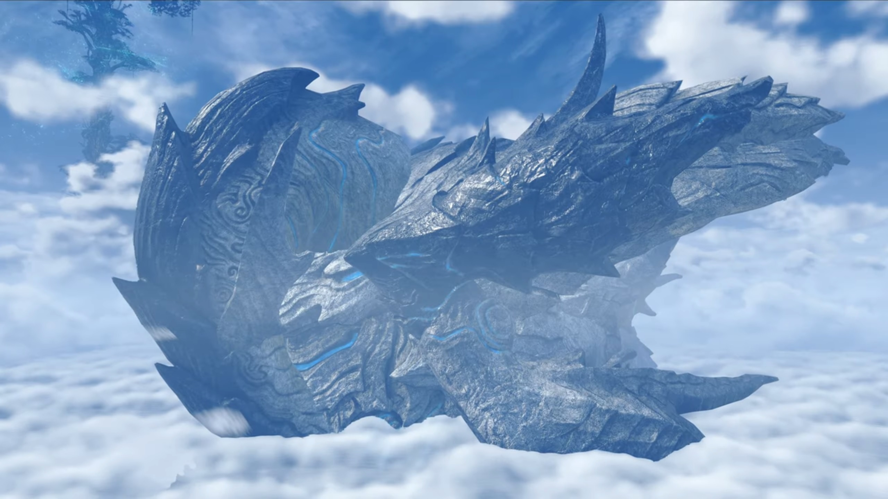
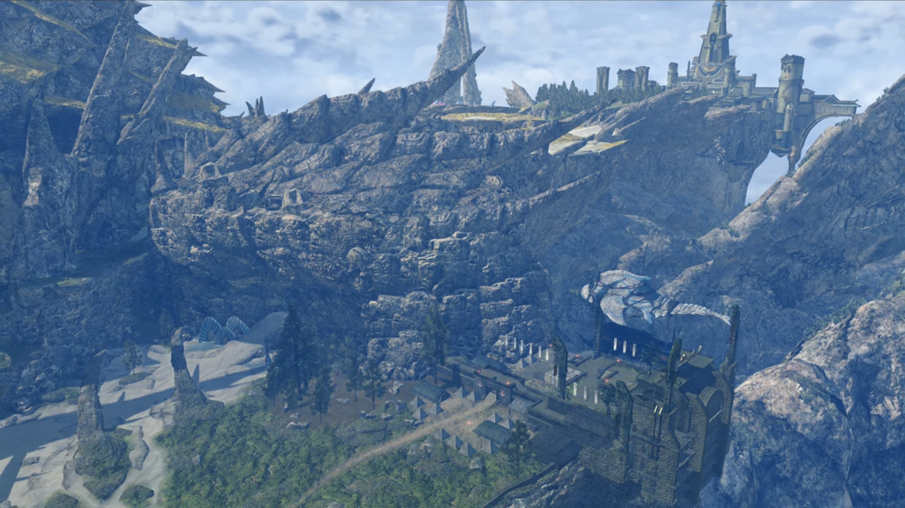
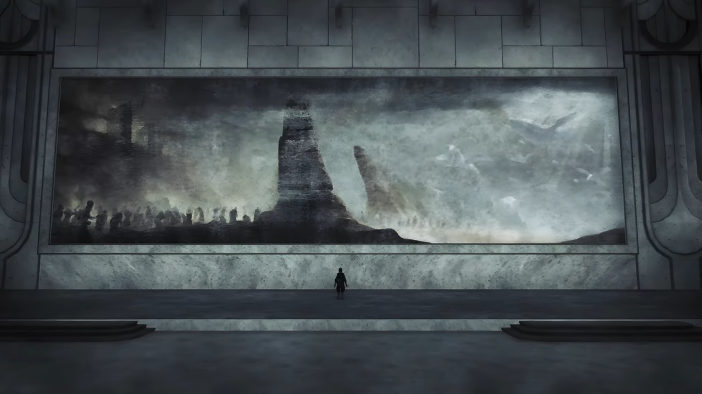

# Going to Torna

Back inside the flagship, we saw the adults gathered around the table from earlier. Hugo and his Blades stood on one side of it, while the rest stood on the other side. Hugo started, "Thank you all for joining me here. (Holding his breathe) **I'm afraid...** I have important news... that I need to impart to Addam."

"Oh yes?"

"It's about the militia."

"The who now?" Lora wondered. 

Addam filled her in, "I've been gathering an army in Uraya. People who've lost homes, families. People who'll make a _stand- against Malos._"

Hugo continued, "Well, according to intelligence we received, they have departed from Uraya now."

Now _that_ wasn't his instruction! "**What? WHY? Malos's whereabouts** are still unclear."

"It seems that _Uraya has **conscripted** them all._ It's now a- **special** regiment- of the Urayan self-defense forces."

He kept his cool, "**I thought-** I'd sorted this all out with the Urayan king..."

Aegaeon updated them, "At His Majesty's behest, we have ascertained the position of the moving troops. They are heading to **Torna**... as we speak."

Hugo finished, "We have established communications, so you can send word at **any** time."

"Grrr..." He folded his arms. Now things wasn't going as planned, neither do he understand why do the king sent them to Torna, the place where he really don't want to return and see _that_ guy in defensive state just because he's more capable than him to be on the throne. And such actions gave him no other choice. 

Lora never saw him in this state before. He'd leave her an impression of being cool whatever comes at him, and could always laugh it off no matter what. Getting to such level of stress she didn't anticipated from him. But there was nothing she could do to help -- it'll be his and only his decision alone that can be final. 

It took him a long while to consider the solutions until he narrowed it down, instructed Hugo to relay the message, "When they get to Torna, **tell them** to go to Aletta. Urgh..."

"As you say." Hugo looked to Aegaeon, whom nodded and went back to the conn. 

---

Addam stood on the deck, looking out at the fluffy clouds as they drew backwards opposite of the flagship's traveling direction. His mind, however, was chained with worries and anxiety. 

Ever since they received news on the militia earlier, Lora had not withdrew her eyes from him. Where he went, he seemed to be oblivious to his surrounding, like a zombie performing chores out of habit. She followed wherever he went, and Jin trailed closely behind. He couldn't possibly leave her, not after the recent attempt of murder. She watched behind the doors leading to the deck, observed for long. 

She finally decided she should approach him, so she walked on. Jin decided to give them the space they needed, lying his back on the doorframe while listening to their conversations with his eyes closed. She didn't quiet her footsteps, so he turned around and face her, reshaping his face during the transition to put up a smile. She started, 

"That wasn't like you."

"**Huh!** You think so?"

"**Yes! I thought...** You always know what to do, you're never lost."

"I wish that really _were the case._" He turned around, looking back at the clouds, said, "To tell the truth, _I'm always worrying._ Ever since I became _Mythra's Driver, anyway._"

"**It didn't** seem that way at all!"

"**Power** lends one an _air of capability._ **Even** more so when it comes to the Aegis. **When** we first met... We **could** have _burned_ you to _pieces._ Though fortunately... we avoided that thanks to Jin." Jin didn't react to his words, nor did he show any signs of emotional changes. 

"Is that why... you were away from the _militia?_"

It took him a few seconds to reveal, "As I am, I am not in full control of Mythra's power. Scores of soldiers _could die by my hand... I was... frightened..._" (They continued to listen, letting him speak without interruption) "_This_ cataclysm- Malos caused... It's likely all _because Quaestor Amalthus- was unable to control him._" (He dropped his head and sighed.) "_And if that's true, then perhaps... I too..._"

"I think she's well aware." (He turned to her.) "**Just- not so** comfortable saying it."

"That's your analysis?"

"Well, I **have been** with Jin, the '**Paragon** of Torna', for 17 years. **I can roughly tell** how much of their strength a Blade is using... just by **watching them. She's making sure you-**" (She shook her head) "No, she's holding **herself** back... to make sure she **doesn't** go that way. Deep down, she's very kind."

"You think?" He scratched his head. "That still means... I'm just- _not man enough._"

"Don't think that way! **You'll get used to it**, little by little." (She looked out at the sea, putting an arm on her heart and shared,) "**I**- _was the same._"

He turned to look at the sea and sighed, "_If only time would slow down... and afford me the chance._"

"_Yeah..._" she sighed. 

---

They parked the giant flagship at a port near a meadow with rougher textures and more hills surrounded by thick foliage. They then unboard the flagship and transferred to a smaller titan-fish ship, then disembarked for Torna. 

It was another long journey before they finally arrived at a built taller than the giant Titan they were to board, with crates packed on it, and immediately beside the port were stone-brick-built buildings. 

---

===

Torna, a sleeping dragon curled into a ball. A grand civilization was built on its back. Some parts were arid deserts, while others were tamed meadows. The town, full of buildings built of stone, was surrounded by city walls. A thick foliage prevented the desert from invading the outskirts of the town. This, is the Kingdom of Torna. The desert path leads from the town to the Capital. 

---

Addam led the group into town. People were doing their stuffs, chatting around, going through life as usual, when "**AHOYYYYYY!!! MISS ME???**"

"Lord Addam?" One of the group of 3 people chatting, of someone buff and looked like male mermaid but with legs wearing heavy plates, another soldier that looked like a typical Mor Ardain soldier, and in between was a fair-skinned man in robes with pointed chin looking OK-ish. He's the one answering back. 

"**Lord Addam's finally come back!**" The Mor Ardain soldier-like guy excitedly exclaimed. 

"Welcome back, Lord Addam!" All the adults and children put down their job and gathered around him, after he walked forward towards them while the rest kept their distance. 

Lora was impressed, "**Wow...** Someone's got himself a bit of a fan club."

Hugo suggested, "Maybe that's why _he decided_ to take action, to wield that love for good."

"By the way, Addam gave the order to meet in this place **specifically**, right?" Mythra asked, "What's so special about it?"

"This land is Addam's domain." Hugo explained. He turned to the big house, or rather, a tiny castle, at the very top of the town, ushered, "Look, that over there is his manor."

Lora was flabbergasted, "_Haaaaaahhhh..._ Certainly fit for a prince."

Mythra don't agree, "Mmmhrr, it could stand to be bigger." (She then looked to the tents set up on the same level as where they're currently standing, silencing herself) "_And, you know, not in the middle of nowhere..._"

Lora sternly questioned her, "Are you completely incapable of saying something without sarcasm?"

"Sorry, it's just how I am. _I don't_- really think I can help it."

Hugo actually agreed with her, "She's right, though. **It is- quite** a way from the capital."

Aegaeon suggested, "He is far too **esteemed**- for his own good. **Fourth**- in line to the throne, but **loved**- by soldiers and citizens..."

Brighid shared, "HIs relations with High Prince Zettar are quite strained as a result, I hear."

"Really? I suppose even princes have problems." Lora commented. 

---

Mikhail and Milton were at the kitchen, in front of a table. 

"Mik, mind cutting the veggies?"

"Mm..." Milton watched as he chopped the vegetables into equal slices at "120 fps", or, more accurately, 120 chops per second. Such skills as they flew straight into the bowl to his right without him moving them himself. 

"Heeeeyyyyy, you're pretty good at that!" He was impressed. 

"Not really. Anyone could do it." Too humble, you. 

Mythra entered the kitchen from behind, unbeknownst to them, laying her hands on the spices on the shelf, Milton replied, "Looks good to me, anyway. Then I think I'll get to the meat..." (When he turned around and saw her hand already on the bottle with holes you usually see in restaurants where you pour out salt and pepper, and furiously shake the content out of the bottle onto whatever she laid her hands on, he shouted,) "**OIIIII, MYTHRA!!!**"

"Huh?" But her hands didn't stop shaking the content out of the bottle furiously. 

"What... are you doing?"

"Preparing the meat, _of course._ Are your eyes not working... or something?"

The meat on the cutting board was now covered with a thick layer of the content she poured out. Milton tried his best to stay calm, quietly asked, "Well cut it out, back away, and don't. Touch. Anything."

"**W-what?!! But why?!!!**"

"Seems like fun!" Lora entered, cutting into their conversation, offered, "Why don't I help, too?"

Haze walked up to her side, while Milton pleaded to Lora, "Don't. Encourage. Her. (Mikhail turned his head to him, wanting to know why he felt so scared about Mythra in the kitchen, without stopping his hands, chopping through the cabbage without the need to look at it.) You wouldn't talk that way if you knew the atrocities of Mythra's cooking."

Lora's eyes widened, "Atrocities?"

> Milton's irises dimmed as he recalled memories he wished he never had. A bowl of content, as black as ink, bubbling on the bowl, its foul stench, if visible, stretched like the hands of octopus trying to pull its prey towards its mouth. Black smoke evaporate from the content, yet Mythra, her hands on her waist, brimmed with delight, as she proudly presented her pièce de résistance to her judges -- Milton, and Addam. 
> 
> They, however, had great fear. Addam tried to hold his breathe while looking at the content, his usual optimism cannot force him to bring the abominable content to his mouth. He turned his eyes to Milton, hoping he would save him by trying it first, only to saw he did the same. They both nodded to each other, took in a deep breathe, and took a small spoonful of the content. The black smoke continued wafting from the content while he brought it to his mouth, slowly by slowly, his hands vibrating. Then he closed his eyes and gulp it, hoping whatever comes will be quick. 
> 
> Milton wasn't any better. Mythra's eyed left, then right, then left then right, waiting for her praise. 
> 
> But a second later, it was as if they had touched a live wire with wet bare hands, shocked through their brain, twisted their necks to unusual degree, before they collapsed onto the floor, white foams flowing out of their mouth as their whole body shook. 

Milton concluded, "It does more damage to you- than **any** Artifice ever could..."

The three kept quiet. Mythra, eavesdropping his part of the story, screamed at him, "**Hey, watch it! Don't go around saying mean things like that!**"

"Err, Mythra?"

"_Errr, yeah?_" She turned her attention to her driver, whom just arrived with Jin. 

"**Can I-** borrow you?"

She annoyingly replied, "_Urgh... What is it?_ I'm about to help with dinner."

He turned to the girl beside her, asked, "**Lora, you too. Would you mind** sparring with me, please?"

She cheerfully answered, "I- don't mind, but..."

"Why don't **I**- help with the cooking?" Jin offered. 

Her eyes widened, recalling the delicacies he always cooked for her, how much she enjoyed every single of his cookings, "**Oh?** Well, all right, then." Mythra go pfft... She and Haze immediately turned around and leave the room, Mythra followed behind thereafter, while Addam quietly sighed in relief. His eyed Milton, whom was also glad she was finally outta here! He therefore took steps after them. 

"_Ohhhh.... Th-thank goodness..._" Milton sighed. 

"**Surely** it can't be **that** bad." Jin thought. 

Mikhail's unlimited cabbage hadn't yet finished chopping, his eyes still fixated on Milton, whom raised his head with a great smile on his face, offered, "You could always... try it out?"

Erm... Jin don't know what to say, while Mikhail turned his attention back to his cabbage. After a really long pause, he wrapped his arms around his chest, turned away, said, "**Ahhh.... Perhaps** not."

---

Sword and wands clashed. It's one to one sparring between the drivers, while the Blades stayed behind, transferring powers. 

"Amazing, Lora. Even when I foresee your movements, you counter me instantly."

"I couldn't do it without Haze's power!" As the fighting continued, she asked, "What about you? I don't see you using Mythra's hidden ability!"

"And what if we did?"

"Well, if you did..." After some focused sparring and then separating, she finished, "...I'd just have to bring out my original Blade!"

"Master Addam." Says he who they were talking about, just arrived from the kitchen, "Your evening meal is ready for you."

"Oh, is it that time already?" They put down their weapons. 

Lora philosophically exclaimed, "The days are so long at _this time of year_, I just start losing track..."

---

The pot of contents was kept hot by placing it over the campfire. They sat on the crates lying around it, Haze chatting with Lora, Addam with Mythra, while Mikhail sat alone and focused on biting his portion. 

"Oh, finished already, That's a shame. I was hoping to join in." 

"Join in? By yourself?" Mythra wondered. 

"His Majesty has many pressing matters to **attend to**. Besides, I'm **used** to working alone."

"A Driver and Blade are one in body and soul. That's their very nature." She commented. "You're not at full strength without him."

"It's not so simple as all that." Addam commented. "**I know** I've yet to unlock _the depths of your power._"

"Really? _I feel like_ I've been... giving it my all."

"But you never stop growing. **At any rate, Haze's ability** to restrict other Blades is indispensable. It's perfect for training. We're lucky."

"When she stops me using my Foresight... It's- certainly difficult."

"Ohhh, but y-you honor me too much. I'm just happy to help you both in any way I can." She replied humbly, touching both sides of her cheek, then turned to look at Lora eye to eye. 

"Next to each other like that, you really do look like twins, you two." Mythra commented. 

Addam agreed, "It's rare for the Driver's nature to appear _so strongly in their Blade._"

"People tell me that from time to time, but is it really true?" Lora turned to look at Haze, wondered. 

"Perhaps..." She put one index finger on her lip, "But- whatever the reason, I- am- happy if I look even a little like you, my lady." She moved in and hugged her arm, rubbed against it. 

That gets Lora excited, she commented, "We're even the same dress size!"

"**Right?!**"

"**AHAHAHAH!!!**" The rest laughed. 

After their evening meal (a.k.a. dinner), Lora and Haze continued chatting, now standing up. Mikhail helped with carrying the plates and belongings back to the kitchen. Mythra went up to speak with Brighid, while Addam, sat at where he was earlier, started speaking to Jin whom was cleaning up the mess by the campfire. 

"**By the way, we want to try** taking _you on next, Jin._"

He stopped moving. Mythra and Brighid turned their attention to him. Lora excitedly asked, "Well, how about it, Jin?"

Without hesitation, looking over his shoulder, he answered, "**I'm afraid...** I-I-I don't particularly like fighting." Then he walked away towards where Mikhail walked. 

Addam commented, "**And to think**- we're hearing that from _'the strongest man in Torna'._"

"But perhaps there's truth in those words." Lora thought, watching the leaving back of his, where Mikhail stood and waited for him in front, said, "After all, he... _or rather_, **they**..." Mikhail wondered what story did this guy have. Jin was about to catch up with him when a soldier dressed in metal from top to bottom disturbed their peace, running fast into the camp before bowing before Addam.

"My lord, my lady! We've discovered Malos's target!" Jin and Mikhail stopped and turned around, while the rest were all eared. "**The capital!**"

Addam was shocked, standing up, "**What?!!!** Are you sure?"

"Yes, no doubt about it!" They turned around and look into the direction of his target, at the far far edge from his municipality. 

---

Some time in the past. 

There was a giant mural painting painted outside the wall in Indol. Amalthus stood there, looking at it. The light from heaven shone from the right onto the land where many people seemed to gather around the shore, where rock pillars stretched high into the sky. 

Even when Malos teleported behind him, he didn't seemed to notice until he said "Hi!" He immediately turned around, feeling his hair standing on edges. 

"Malos... And here I thought I had seen the last of you."

"Now, now. I never meant our parting would be forever, you know. I've just been to see the Tornan Titan." Malos walked to the right, looked at the Praetorium. "I bet it'd be reaaaaal interesting... to see it in its true form..."

"Where did you learn that?"

"Learn?... Inside my core, I have _all_ the data of all Blades and Titans."

"You have- all of it? You think- to call yourself- the Master Blade?"

He immediately turned around, "**Sure, why not?! Sounds good!** So? _Exciting, right?_"

"Hmph." He looked to his left.

"_My partner_... I hear you gave her to that- Tornan- **prince.**"

"And if I did? You'd erase me? Just like that?"

"Not at all. I have a much better idea than that... I've decided my next target **is** Torna."

Amalthus squeezed his eyelids, asked, "Why would you tell me so plainly?"

"So you know what to look forward to- as you watch." And he teleported away after walking a few steps. 

---

Aletta. The soldier had just told him the source of the message. Addam acknowledged, "**I see. So this comes** from the Quaestor. But he doesn't know _what Malos is planning for Torna._"

"We should probably hurry." Mythra suggested, and he agreed. 

He instructed, "**Soon. We'll go once Hugo's back.**"

### Footnotes: