# Journey to the Capital

Their journey continued along an elevated platform carpeted by grass umbrellaed by another layer of rock platform extending from the cliff to their right to their top. A beast smelled the presence of yummy human flesh in the air and jumped high into the air, landed in front of them. Sharp claws and teeth, with sharp spear-like tips growing behind its neck and head, and the joints on its limbs, with thick, dark-brown fur, with the beak of a bird. 

"A Slithe Jagron?!" Lora exclaimed. "What's a Leftherian monster doing here?"

"**Worry about that later. Come on!**" And they drew their arms. 

---

In parallel, they dashed together, Addam attracting its attention and blocked its incoming leg, while Mythra jumped high into the air behind him and shot a particle beam aimed at it from her sword. Jin summoned a plethora of ice spears and waited for the short moment when the beast cannot change its direction{{footnote: Imagine. You punch something and it repel back at you, so by Newton's 3rd Law, you moved back. During that time, however much muscles you use, you cannot gather the energy required to change direction or do anything else. That's the best moment to strike -- when you cannot do anything except watching the blade coming straight at you.}} before launching them at it, toppling it hence. 

"**Is it over?!**" Addam wondered. 

It quickly get back on its feet, eyeing the group. Tasty creatures, but too strong for me, it thought. It's eyes hovered over and found some equally tasty ones -- those two kids at the back. Defenseless! Easy meal! Before the group realizes, it jumped over the group, their eyes tracking it; Milton subconsciously hugged Mikhail -- if they were to die, they would die together in each other's hug, he thought. Mikhail hadn't had time to react. 

"**MILTON!!!**" Adrenaline pumped to max, Addam dashed faster than the beast, arrived at them just when it was about to come down, and wrapped his arms around them, using his back as a shield. Yet before the monster's foul mouth could get a taste of the delicacies, it saw a purple beam from the tip of its eyes growing larger and larger, closed its eyelids on time for it to hit, but the strength from the beam was enough to push it over and fell it, rolled it on the ground several times, and lying there feeling slightly dizzy. 

Sensing the danger's gone for now, Addam stood up and looked to the source. Who was helping them? Someone wielding a gun with blue-crystal-made rockets mounted on the top of the pistol. A long strand of hair stretched from the front of his forehead and dropped on its right eye, while its left eye had a brown scar that stretches from his forehead to his cheek. He had round ears and brown skin, a large nose. "**Minoth!**" He immediately recognized. 

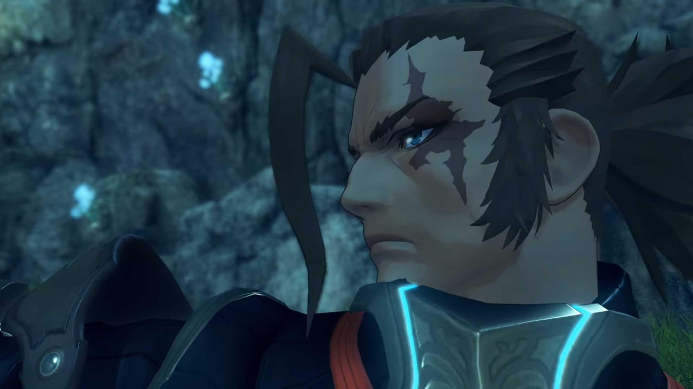

"**You were always slow** to finish a job, my Prince! **I thought** I told you to stop calling me that." He pointed his gun at Addam while he walked towards him, only to lower it when he got close. 

"A Blade?" Mythra haven't seen this guy before. 

He sheathed his gun, the rockets merged and his dual guns transformed into dual short-swords. Addam introduced, "He's Minoth. Quaestor Amalthus's Blade."

"Amalthus's?!"

"Ah!" Lora seemed to have realized something. 

"**He's one of the quaestors in Indol.**" Addam explained. "**And... Malos's Driver.**"

The attack was not only a physical insult to the monster's desire, but also a psychological insult to its pride. How are these guys so difficult to eat? It wondered. It loudly bellowed into the air, the shockwave it sent shook the platform they were standing on. Their attention rolled back to the monster as they prepared for round 2. 

---

One of the claws were to land at Jin, which he adeptly dodged before lunging itself at one of the monster's leg, ice gathering at the blade of his sword, took a slice when he arrived before throwing the weapon at Lora from under its belly, whom was coming in from the other side. "**TCHAAA!!!**"

She sliced left and right a few times while she dragged below its belly, threw the weapon onto the air when she came out the other side, which he caught mid-air and "**YAAAARRRGGGHHHH!!!**" with the help of gravity, punched and stuck it deep on its back spinal cord. 

Minoth, running on the other side, watched their interaction and found that interesting, commented, "You've got an interesting way of fighting. **HYAHHH!!!**" With his double knife, he made a thousand cuts on its underbelly and its legs as he swirled himself around like a top. "You are?"

"Lora. That's Jin." She introduced while her whip wrapped around one of the monster's leg. "And **she-** is Haze."

"Pleased to meet you." Haze jumped onto the air, thrusted her staff at the monster's thick skin, even though it does absolutely no damage. "**HYAHHHH!!!**" The sound attack she launched felt like "lion's roar". 

"**Jin?**" Now that's someone popular. "**You don't mean** from Torna?" His short sword transformed into gun, firing at the monster while he speaks. "But, 17 years ago, wasn't he...?"

"Minoth! Not a word to anyone." As Minoth focused on dodging an incoming attack, Addam jumped in from behind, warned him while slicing the monster's skin, and Minoth made a comeback and turned and swirled around the back of the monster's skin, to no avail. 

"Sounds like a good story is all I'm saying."

"You want to hear?" Lora asked. 

"Another time." 

"**HYAAAAHHHH!!!**" He jumped away just when Mythra flew into the air, sliced through its throat while it raised its head, and ended it for good. They gathered around the beast thereafter. 

---

"That was close. Thanks, Minoth." Addam appreciated the help. "You're very capable, even on your own."

"_Ah_, well maybe I should **thank him**... Or not."

"Your Core looks... kind of different." Lora noticed. 

Mixed with blue and pink rather than pure blue, he revealed it and explained, "Ahhh, well... I'm a Flesh Eater."

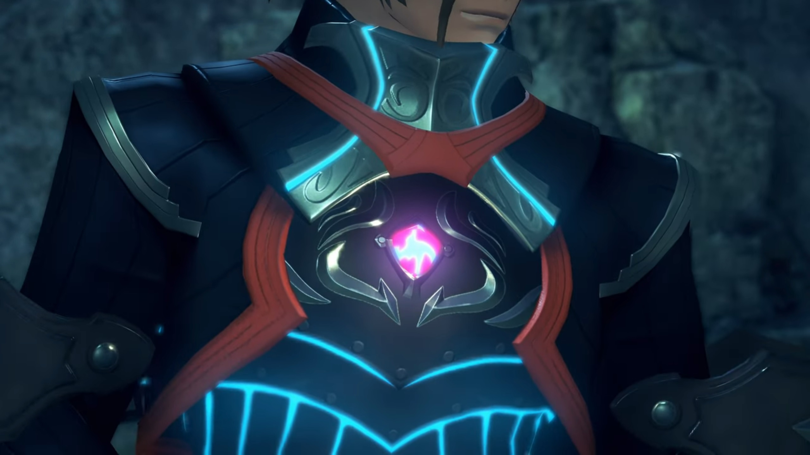

"A Flesh Eater?"

"**A being with human and Blade cells**, made possible with Judician technology. **That's how I can use my full strength anywhere, without** my Driver... But, I'm **pretty sure I'm a failed experiment**, so to speak."

"I never knew Blades like that existed."

"_Flesh Eaters..._" Jin thought the word familiar, but he couldn't recall where he'd familiarize himself with such phrase. Nobody else noticed his anomaly. 

Addam asked, "What of Amalthus? Isn't he coming?"

"_Nahhhh..._ I just heard rumors that **you guys** had entered Torna. I used my own initiative."

"Ahhh..."

"It's been two years since I saw him last."

"Huh?!"

> Minoth walked up a mountain carpeted with ankle-high grass, where trees grew very thick to his left, and some rocky surface to his right. He stopped before a village. He could hear a baby crying in the distance. Entering one of the first of the huts, he found all other inhabitants lying dead. 
> 
> He turned around and exited the house. At the edge of the cliff behind the trees he found Amalthus. He walked up and stood beside him. Amalthus, sensing his approach, continue looking out into the distance, spoke, "I arrived too late."
> 
> "Is- that- right...?" He looked at the baby held within Amalthus's hands, asked, "Was that their child?" (He remembered) "That soldier, wasn't **that** the one from-"
> 
> He cut him off, "Such a cruel world _we live in._"
> 
> "Huh."
> 
> "In Indol, there are a great many paintings depicting allllll manner of hells."
> 
> 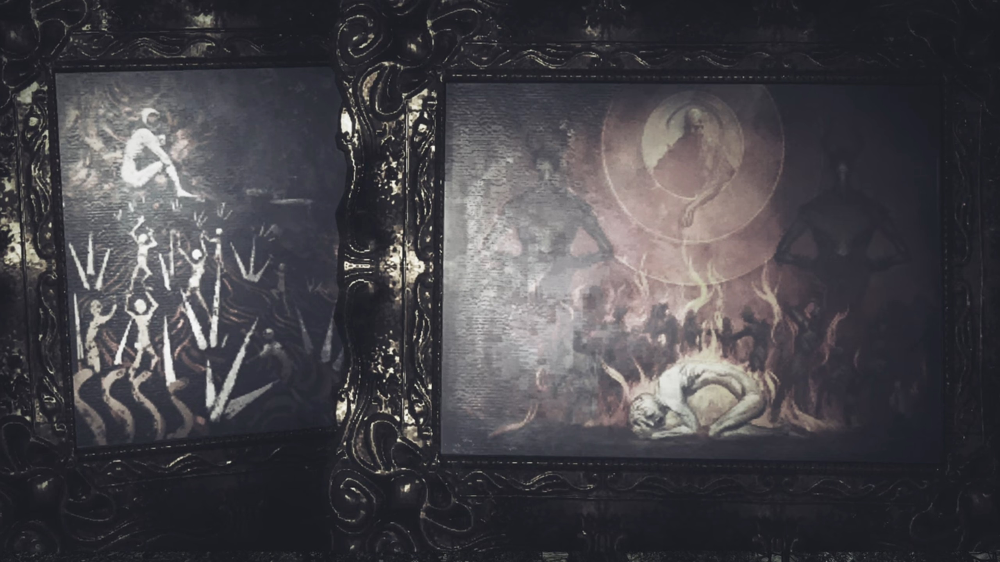
> 
> Amalthus stopped speaking, Minoth kept quiet. He looked down at the child held within his hands, commented, "But I think... real hell might be... closer to something like this."
> 
> "Amalthus, you can't..."
> 
> He looked up on the sky, said, "I have hoped, **once**, that the Architect might... **save us all**!!!" But the World Tree never moved a bit, no matter how much those underneath them prayed to it. 

"Since then, I haven't seen him. I heard he went **climbing up the World Tree** not long after... _And brought diviiiine revelations back with him..._"

"You mean.."

"The Aegis, Malos." Lora finished Addam's sentence with conviction. 

"But, what kind of a revelation is **this**?" He looked at the giant cavity carved in in front of their path they were about to walk. It had dented deep below the platform they were walking, and leave the platform they were about to walk a bare minimum, requiring them to be extra careful not to fall off the ledge. "What kind of salvation? Could anyone call THIS salvation? His hope _caused this... or... his despair..._"

"Despair?"

Minoth turned to Mythra, asked, "How about you, then? You're from the **sameeeee** stock."

"I-I-I don't know what you're talking about. I'm just following this guy since he woke me up, and... that's basically it. I have no particular interest in this world... or its future."

"And Malos himself?"

"**His** thoughts I-I'm **especially...** uninterested in. We've never even met!"

"Please, don't mistake her." Addam pleaded. "Despite the attitude, she's a good kid."

"**The hell is with that tone?!!!**" She got mad. "**Where do you get off acting all parental?!!**"

"**HAHAHAHAH!!! Oh, comeeee on! I woke you up, I make sure you get enough to eat...**"

"**W-W-WHAT?!!!**"

"**Cloud Sea Crab Sticks** are tasty, aren't they? **You're very welcome. Although I don't** think I'd have managed to eat *six* myself!!!"

She blushed and looked to the side, "**WHAT?!!! You counted?!!!**"

"_I don't know whereeeee you put all that._" Milton agreed. 

"**I'm the Aegis! I need all the fuellll I can get!**" She tried to explain it off. 

While she was being tsundere with her eyes closed and her head tilted to the other side, Milton came up quietly from behind, poked a few times at the fat layer on her belly; she felt ticklish and jumped and snapped at him,  "**HEYYYY!!!**"

"_You're too easy to sneak up on!_ **Where are MY extra rations?!!**"

"You little..."

"**HEHEHEHEH!!! The Aegis, bested by a little kid! HEHEHEHEH!!!**"

As he ran off, she ran after him, forgetting that all the others were watching, "**Milton! Get back here!**"

"_Heh!_" Minoth already had the answers he needed. 

"Hm?" Addam wondered what was it. 

"**Y'know...** If the Architect really **does** exist, _I'd quite like to meet him._" He turned around and looked at the World Tree, philosophically thought, "_Salvation, huh?_"

---

They found a spot to make camp for the night. Minoth, once again, commented, "Your sword-swapping fighting style... It's **very** interesting, you know."

"It's still quite rough, though. I'm a bit lacking in 'oomph'." Lora replied. "It'll take me a while to get it down properly."

"**See, I wasn't _actually_** talking about the power or technique."

She looked up, curious, "Oh? What then?"

"That connection you have, **human**- and Blade... **It's like a bond** of sorts. I just found it **curious!**"

"An actual... bond?" She never considered it from that perspective. 

"It's like that's how it's **supposed to be**... _Eh, I dunno._"

"**It does make sense!**" Haze got excited. "Lady Lora is **always** with Jin. **And you almost never find time to practice with me!** It's like he's her favorite."

"Come on, don't say that! I'm an equal opportunities Driver!"

"**L-Liar!!!**"

She raised her nose in pride, "You're both my partners and **very** dear to me. There's no favoritism, swear!"

"Are you really _sure about that?_"

"I think Haze is a bit jealous. I **have** been with you longer, after all."

She looked at him, then looked at her, asked, "You think?" Haze nodded. She then raised her head into the air, closed her eyes to think of a solution. After a while, she made up her mind with something feasible, said, "All right then! Starting tomorrow, Haze gets to take the lead! Good?"

"**Wonderful!**" She exclaimed. Jin just looked at them without saying a word. 

"You don't mind?" 

He turned his head to look into her eyes. There's a moment of silence as both of them looked at him, wondered what he had to say, "It's all right by me."

Minoth felt their interactions were also very interesting -- the resolving of conflicts. At least he never interacted that way with his driver before. 

---

Later into the night, most of them lie down on their sleeping bags. Aegaeon took watch of the night. Minoth just laid on good old Terra Firma, using his hands as pillows. Jin was the only one whom sit-sleeping, his back lying on the cliff walls. 

In the midst of quietness, Addam opened his eyes wide and sat up quietly. Aegaeon, whose head had been scanning left to right on the other side, didn't heard him. He walked out of the camping spot without attracting anyone's attention. 

---

Sword slashed mid-air amidst the darkness above the platform. Addam was training his swordsmanship when Mythra approached from behind, asked, "Do you... remember?"

He probably had expected her to come, sheathed his sword calmly and turned around, which she finished, "The last time we paid a visit to Indol?"

His smile dimmed a little. 

> Addam walked down the flight of stairs leading from the Praetorium, Mythra trailing some 15 flights behind. Once he reached the bottom, he stopped and waited for her, asked once she caught up,  "What did you think?"
> 
> "You mean, about him? Let's see..." She took some moments to gather her thoughts and her words, concluded, "In a word: he seemed very **human**. Protecting his **heart** with a mask of lies."
> 
> "Are you curious what's behind it?"
> 
> "Not really. Most humans are **like** that, aren't they?"
> 
> "Cutting to the chase, I see. **But I hear his achievements in Indol** _have been quite grand._" He lead the way to the far ledge on the platform. At a lower platform, camps were being set up, tents along the circumference and gathered in the middle. Some people were gathering outside, watching a 'show'. He continued, "The refugee protection policies from **last** year are his work, as well."
> 
> "So a hypocrite, then. Isn't that what you call the type?"
> 
> "**Quite...** I hope that's **all** he is."
> 
> Mythra looked up, said, "He smiled. Did you notice?"
> 
> "No..."
> 
> She looked back down on the refugee camps, shared, "_I think... he might **actually** be enjoying this._"
> 
> "_What?_"
> 
> "The world in this state."
> 
> "That's- interesting..."
> 
> "**You felt something** was wrong, **didn't** you? That's why you brought me."
> 
> He looked back down at the refugees. In the middle of where everyone gathered, two people were having a tug of war over the possession of something, each didn't want to give it up, and the rest cheered and jeered. When the buff guy took the weaker guy's possession away, he grinned while he held it far, pushing the weaker guy away from reaching originally his possession. On the other side, a woman had to protect her possession by hugging onto it, while some other woman tried to snatch it from her kept putting hands from one side to the other, finding a weak position to lay hands on it. 
> 
> "Don't you think they're worth saving?"
> 
> Mythra closed her eyes, "If you think they are, _you know you'll have my aid._"
> 
> His head jolted to meet her face, asked,  "Even if you disagree?"
> 
> She looked up, answered, "_That's not for the likes of me to decide._ It's up to you humans."

That reminded him, "**Ohhh, you mean that time? I remember.** What about it?"

"What Minoth said bothered me... **I think he was** talking about Malos, but his words could **just** as easily have applied to Amalthus."

"I-I suppose..."

"**What if- all of this is- what Amalthus-**" (She shook her head, corrected herself,) "No, what **all-** of humanity- really wants?"

"**You don't** mean it..." 

But she looked down. And he looked down. 

"Hey... W-what are we going to do if we defeat Malos anyway?"

For that, he already had an answer. "**You know... Like** I told Hugo, **go home** and work the land." (He looked up, reminisced) "I didn't get to harvest the Gromrice this year."

"While... that might be good enough for you..."

"Mm?" His attention shot back. 

She spoke it plainly, "Some others might... not be- _too pleased with that..._"

"_Mmm..._" His smiles dropped. 

---

In a dark room. Lora's dad had been captured and laid unconscious before Amalthus. He looked at it, confused, asked, "Who is this?"

"Picked him up during a routineeee core collection." The old man explained. "He was one of **yours,** right?"

He answered without any emotional arousal, "**As we** discussed, I engaged him as a broker of cores, but no more. What a waste of _human being._"

"That much is harrrrd to deny."

"_What are you driving at?_" Even he couldn't understand what's the driving force motivating the old man. 

"Waste and refuse- _can have their own uses, I think..._ The **project** we spoke of before, I think it **may be time** to set it in motion."

"You mean... A Blade Eater?"

"His strength will grow... exponentially. It will dwarf even that of a **Flesh** Eater."

"And you can... control him?"

"Oh, **pleassssse.** Even if we **can't**, there's no need to worry." (He looked at the unconscious Gort, explained) "After all, this is just a prototype. Sooner or later, the **binding** will decay and he **will** die."

"Hmm..." That left him thinking, and he can't deny. 

The old man interrupted again, "I hear..." (Amalthus looked up) "...he's got **some** connection to this Paragon of Torna, you see. He'll prove useful either way." (Amalthus turned and walked away, the old man asked as he leave,) "Torna, then?" (Amalthus stood still.) "He's on your mind, isn't he? Malos..."

He opened his eyes, said, "Not him, but what comes after..." He didn't wait, leave the room thereafter. 

---

There was an inn on the path leading to the capital. Addam was very pleased with the one-storey high 'inn' with barely a few rooms, after what they were living with since they left the town, exclaimed, "**Very good! We can stay here** for the day."

Jin eyed left and right, scanning. Wooden huts everywhere, seemed like it's a village. The inn was probably a public property of the village, used to earn more income for the fellow inhabitants. Ether lamps hung outside the houses provide illumination. Wooden fence separate the claimed land of each family from the others. Grass grew everywhere on the ground except on the path -- the desert had ended long ago. 

Lora saw his attention wavering, asked, "Something wrong?"

"**No**, but... This place is familiar somehow. It **feels** like it, anyway."

"Is it possible you've been here before?" she hypothesized. 

"I have no memory of it." He shook his head. "But still..."

She therefore suggested, "Umm... Maybe you could just have a little walk around. Something might jog your memory."

"Yeah, maybe so."

---

Lora checked in one of the room, looked outside the glass window panes, seeing the cliff walls nearby and the flowers of various colors growing amidst the grasses. Jin waited for her inside the 3-bed-1-round-table room. When the door creaked opened, they turned around, wondered who'd came in. Then, a voice that sounded old shrieked,

"**Hey, you! You wouldn't be Ornelia's former Blade, would you?**" Despite the old-sounding voice, the man doesn't looked old at all, his hair and thick beard still black, with thick eyebrow covering his sight and thick upper beard covering his mouth. He wore something that looked formal. 

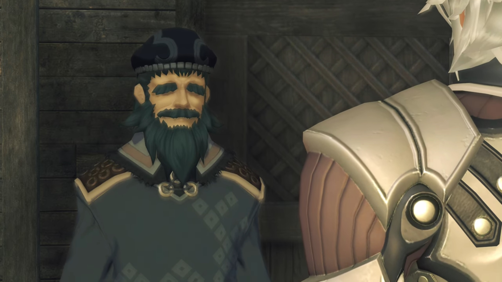

Without his mask, it was easy for him to recognize. Jin's brow rose, curious to hear a name he never heard of before, "Ornelia? N-No, I-I'm..."

The old man cut him off, very insistent that he didn't recognize wrongly, said, "**From the Territorial Defense Corps! IT IS YOU!!!**"

"What?" He was more confused. 

"**O-o-o-o-ohhh, I remember 'em weeeeell!** Even though I was knee-high to a **grasshopper** back then..." (He raised his hand to show how high he used to be. Lora had now came in front and stood beside Jin, just behind the table.) "With that **swooooord slung across your** back... You were so cool!" (Jin looked on the floor, listened -- perhaps this guy knew something he didn't? After all, he did felt this place familiar.) "If you hadn't come when you did, our village would've been... **OH YES!!!**" (He punched his fist against his palm.) "**The HOUSE** you used to live in- is still out there on the **outskirts!**"

"House?" Jin was still thinking deeply. Lora looked at him, wondered if he would want to follow his curiosity and explore. 

---

They stood outside a dilapidated hut. Lora said, "I'll check out the back."

"Good."

He entered the hut. 

---

He stood before a cabinet, wobbly handed, holding onto a frame. There he stood in the middle, with the girl to his right, another elder to her right, and two adults to his left. In front of him was an elderly woman bowing, and to her right was a young boy, and another older boy to her left. 

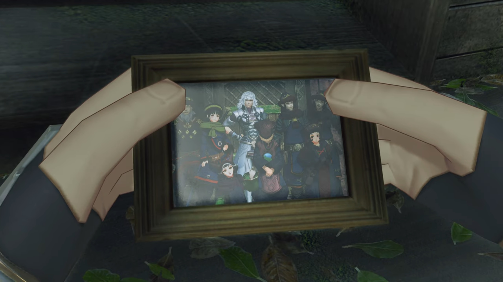

He cannot deny. It's him. His attention focused on it, his eyes moved from one figure to another, seeing their crease and features, their dress, their smiles, their emotions. He hoped he remembered them, but he could not recall. He put it down, searched the cabinet for something else. A dusty book protected by its thick cover, when he opened it up, the pages tainted yellow, but the ink remained crisp and clear. 

He read them, word by word, his iris wobbled as he scanned the pages, quickly taking in the details he'd written down in disbelieve. He cannot calm his heart. 

"My... How terribly desolate..." Lora's voice brought him back to reality. He snapped the book shut, tried to calm himself down in the short amount of time he have, turned around while being careful to hide the notebook behind his back, hoping that she wouldn't have noticed, slowly tucking it into his unlimited-sized pocket. He stood still, waiting for her to come near, relieved that her eyes were scanning the surrounding and not laying on his hidden actions. 

"I heard it's been 90 years, but... (She saw his face, asked,) **What is it?** Did you... remember something?"

"N-no. It's nothing."

"**Really?** That's too bad. I would've liked to have learned about the old you." His hand, still holding onto the diary, cannot stop vibrating. He gripped hard on the cover, digging his fingernails into the crispy cover, but he still cannot clear his mind on what he'd written nearly a century ago. 

But he reassured, "I am... who I am. I do not change."

As if the words have magic, Lora's eyes widened slowly by slowly, until, "**URGHHHH!!!**" she clenched her fist tightly on her heart while dropping to the ground. 

With empty hands, he immediately went up to her, feeling agitated, asked full of love, "**Lora! Are you OK?! W-What happened?!!**"

"_Ugh... Y-you... got me right here..._" Then she looked up with exuberance, "**MY HEART'S POUNDING!!!**"

"_Huh?_ B-But..." She was OK, but he was confused. 

"**T-that! THAT WAS SUCH an awesome line!!!**"

"Wha-?!" He was ever more confused. 

She walked up to him, looked closely into his eyes, standing so close to each other they can feel each other's heat, she exclaimed, "**Jin, you didn't even realize**, _did you? Sometimes you'll... say something, and I'll just swoon._"

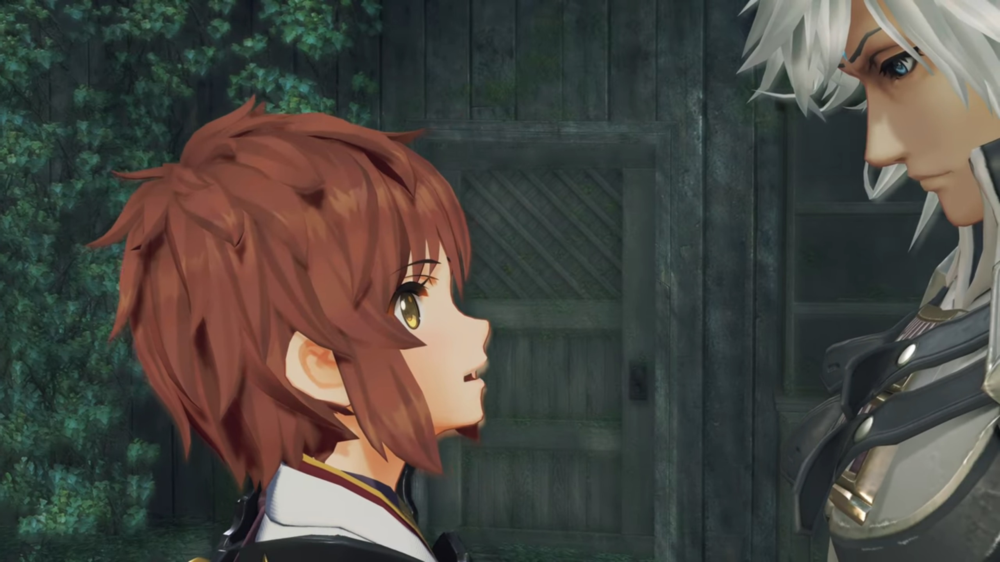

He'd been with this girl for 17 years. He thought she would be extremely familiar, but from time to time, he still get surprised by her actions, "B-But..."

"I don't think any girl could _refuse_ you."

His heart pounding more quickly, he tried to pick himself out from the trap she set him in, "N-n-n-**no**... I-I didn't mean to..."

She bent forward while he moved back from her, "**NUH-UH, you're smooooooth and you know it!!!**"

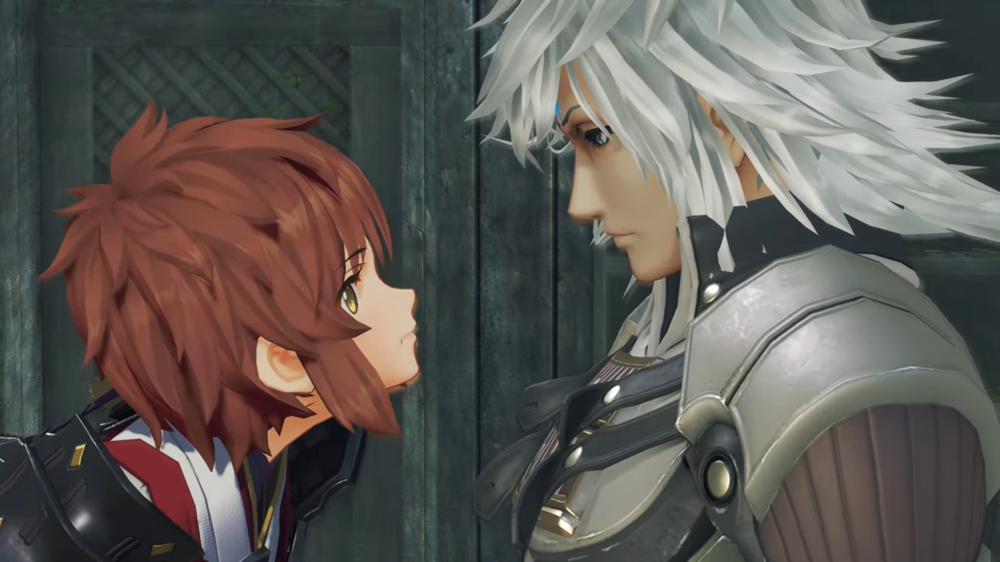

"Lora, kh, what are you...?"

She retreated from him, her eyes swayed aside. She noticed the photo frame he'd put down earlier standing on the cabinet. She walked up to it, Jin didn't stop her. She get a closer look, commented, "Good times, smiling faces..." (She peered over her shoulder, asked,) "It's her, right? Ornelia, here."

"Y-y-yes... Yes, I **think**- it is."

"Standing next to you, with such a goofy blissful smile? It **has** to be it, I'm sure of it."

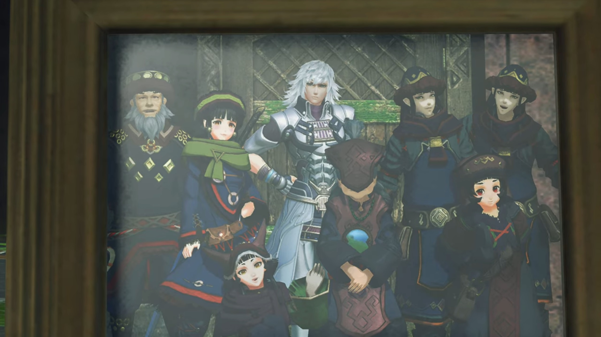

"Are you...?"

Suddenly, she felt a strong urge within. She couldn't resist, so she turned around and exclaimed, "**Hey!!! We should take a photo!**"

"**Really???**"

"Of us together." she nodded.

---

"Errrr, I'm sorry? **When** did this become... a group thing?" To her left stood Haze, then Mythra, whom tsunderely looked to the side, perhaps did not like to have her photo taken. In front of Mythra stood Milton, his arms on his waist, while in front of Haze, to Milton's right, stood Mikhail, whom also wrapped his arms, losing patience. To Lora's right stood Hugo, where Brighid and Aegaeon stood behind him, making a triangle. To the left of Brighid stood Jin, then Addam, then Minoth. Lora was especially confused. 

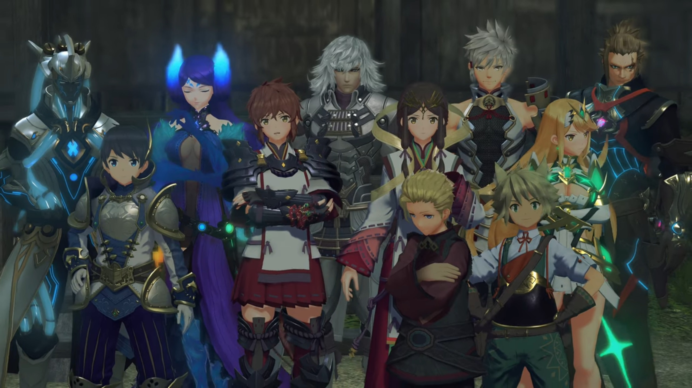

When they came back from the hut and asked the 'knee high to a grasshopper' old man to help them take a photo, the others couldn't resist to join in, and it's not fair for some to join in without the others, so all of them gathered in front of the camera in front of their inn. 

"Me, and Jin..."

"**Come now, Lora!**" Addam urged. "**We all drink from the same well**, don't we? That's a **wise** saying, I think."

Minoth bit his tongue, "**I don't think** that's strictly applicable here..." To which Mythra agreed. 

Haze jealously tried to convince her driver, "You can't have done this in secret, anyway." 

Milton put his hands behind his head, and Mikhail shook his head, but his smile revealed his thoughts. 

"I've never done this before. Feels nice!" Hugo exclaimed. 

Aegaeon, being more stern, rebutted, "Your Majesty! If I may say, it's **no time** for levity."

Before he could reply, Brighid came to his rescue, "Aegaeon, relax! You should be open to new experiences."

"_Gahhhhh..._"

Lora, eavesdropping, felt the more annoyed, wrapped her arms, "_Oh, for... Who did we fall in with here...?_"

The grasshopper guy had tuned the camera to perfect settings, shouted back at them, "**OK, ready for the photo?**"

Lora took a look at the sky above her left shoulder when the guy shouted, "**Everyone say 'GLARNAAAA'!**" Jin looked over to her. They then changed their position. "There!"

And here's the finalized photo. 

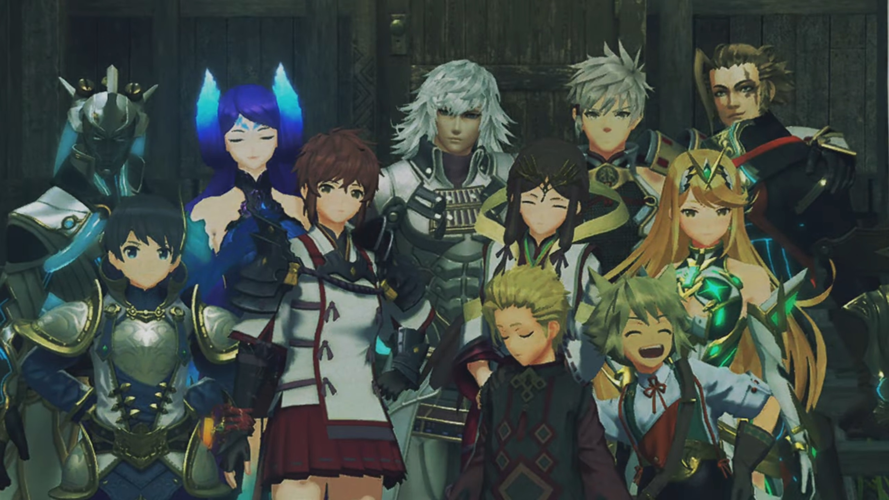

---

Night. They gathered on the porch of their inn. The sky was clear, insects were chirping, attracting partners to come and mate. Milton sat between Lora and Mikhail, she asked, "How long have you been with Addam?"

"Hmm... 3 years, maybe? One year with Mythra. When my village washed away in a flood, Addam was the one that helped us out."

"Right. So it wasn't the war, then?"

"No, it was." He said it lightheartedly. Looking up at the stars and the tall pine trees and the cliff pillars that stretched up to the sky, he expanded, "Resources were running low, so we stripped the mountain bare. That's what caused the flood."

That set Lora in her own thought; perhaps she related her experience to his? Her thought was disturbed when Milton called for her attention, "Hey, Lora!"

"Hm?"

"You were looking for your mother, right? (He carefully asked) _Did- you- get-_ separated during the war?"

"Iffffff- only that were the case..." She looked to the front, reminisced. 

"Ohhh?"

"There are some things you don't know, about me."

"_Uh, things?_"

"Mm hmm!"

"_Ohhh... OK..._" He didn't press for it; if she want to reveal, she'll say so at her own choice. 

"Mother... used to work as hired help. When I was about 10, she was working as a maid. That was when Jin came into my life." Jin's back laid on the inn's wall, standing behind her, wrapping his arms. Minoth stood next to him. 

"**You were a Driver at ten?!!!**"

"That's right! **Things** immediately turned bloody. I had to get out of there in a hurry! 17 years later, here I am."

"**Wow!!! You don't look 27!!! I would've said 20 at most!!!**"

"**Ahah Heyyyy!!! _Flattery will get you everywhere!!!_**" The last word she bit hard on it. 

"**Ahahahah!!!**" After a short quiet moment, he commented, "Well, just like me and Mik, I guess."

"Yeah. Like plenty of kids out there. That's why I'd like to help, stand by them. Just like Jin always stood by me. It's almost more real than real family." (She excitedly looked to the one whom didn't speak a thing throughout the whole conversation, asked,) "**Right?! Don't you think, Mik?**"

He looked at her, she tilted her head towards her neck, waiting for his answer. He looked down. 

Lora commented, "What, no reaction? **I'm really trying here,** you know!"

Milton helped him off, "Ahhhh, it's fine. **He's smiling on the inside.**" 

Why did you speak for me? Mikhail looked up and knocked Milton's hand with his elbow. Milton accepted it as a clash of friendship. 

"Well now! You can tell?"

"Sorta!"

"I see! Well, I'm feeling all inspired now. Just the spirit we'll need if we're going to set this world... to rights."

"**Yeahhh!!!**" He shouted, and Mikhail nodded. 

Some distance away, Mythra stood under the pole light alone, watching the three interacted. She put up a gentle smile, feeling glad that those she protected had another day to smile. Perhaps that's the reason why she existed. 

"You **caaaaan** join in, you know." Addam appeared behind her, urged. 

She looked over at him, asked, "What's that?"

They both looked back to the center of interaction, he said, "You don't need to ostracize yourself for being an **Aegis.**"

She immediately rebutted, "That's **not** what I'm..."

"**I** happen to think... _you've got a **lot** going for **you**,_ you know."

"Mm..." She looked down on the floor, we don't know what she's thinking. 

---

In their room, Jin sat on the chair on the round table writing with a quill pen while Lora sat on her bed, doubting, "Should we... really be bringing the kids along?"

"Are you worried?" He asked without stopping. 

"Mhm..."

"Alrest is a dangerous place right now. The war reaches everywhere."

"I'm sure we can keep them safe in a normal fight,... but if..."

He stopped writing and looked at her, whom looked into the void thinking. "Ungh..." Jin sighed. 

She looked up, seemingly made her choice, then stood up and walked towards the door. He wondered, "Where are you going?"

She stopped short of the door, explained, "I want to speak with Addam."

"At this time of night?"

She turned to him, "I'll see what he thinks about it. And if his mind is made up, there's still no harm done." He nodded. 

When she put her hand on the handle, before she could turn it, a high-pitch shriek from the room to their right alerted her, "**ARRRRRRRRRGGGGGGGHHHHHHHH!!!**" Mythra's high pitch damage was comparable to the food she served. 

"**Urggghhh urggggghhhh...**" Between the 'siren', we could hear Milton's voice, full of fear. 

"**HOW LONG... HAVE YOU BEEN THERE?!!!**" Jin stood up, wondering what was happening, "**HEY!!! WHAT ARE YOU DOING IN MY BED?!!!**"

Lora's eyes lit up. Jin's eyes lit up. 

"Huh? What are you talking about?" Milton was ever more confused. 

"**WAAAAARRRRRGGGGHHHHH!!!**" She refused to listen. Then, the whole inn started shaking tremendously, the sound of heavy objects slamming against the walls in continuous barrage tested its durability. "**GET OUT!!! INTERLOPER!!! MONSTER!!!**"

Lora looked at Jin, wondered what he would do. Would he... intervene? 

"Hey, quit it! Wh-?! This is where I sleep!" Milton tried to retain his cool and explain it to her,  "It ain't your bed, lady! Ow!"

Now that piqued Lora's curiosity.  Jin put one hand on his waist and covered his face with another, shaking his head. "Ohhhh, you're such a pain in everyone's bum, you know that? You... **simpleton!**"

"**Hey! Wait a minute!**" Addam's voice echoed inside the room, intervening. "**Calm down, both of you... OWWWWW!!! Come on, take it down a no-no-no-NOOOOOO!!!**" Lora and Jin looked at each other, then looked back at the source. 

Jin folded his arm, asked innocently, "What's all the noise? Is something up?"

Lora suggested, looking at him, "Uhm... It's probably better to sit this one out..."

His eyes met hers, agreed, "Perhaps that's wise."

She nodded to herself, gave herself a definite choice, "Yeah. Maybe I'll just... ask him tomorrow..." All the while, the banging and rolling sound never stopped. 

---

The next morning, outside the inn. Mythra sat on the bottom flight of stairs leading up to the inn's porch, looking at the interaction between Milton, Mikhail, and some other kids from the village, happily conversing. Addam stood on the porch behind her, looking at them too. Lora approached with a little hesitation, 

"Uh... Morning..."

"Ah urrr... uhm... morning!" A bruise on his forehead, though he seemed optimistic and undisturbed. 

"You're hurt? Are you OK?"

"Uh yes, I imagine- I'll live..." He scratched his head. 

"Sounded like... **quite** a scene."

"Yes, well... I was just- collateral damage..."

---

Meanwhile, Mikhail watched as the extroverted Milton easily get into conversation with the other village kids. Sometimes he joined in, commenting on what he's saying. While looking at them, Addam had heard her out, commented, 

"Before, you said if you met a child in whom you saw something _of yourself_, you'd want to help them." (Lora looked at him, while he continued looking at the kids, commenting,) "I don't have the heart to leave them here."

"I know... And they've got their own concerns. They want to create a place for themselves in this world."

"At their age, _it's remarkable._"

"I think... it's on **us** to see they don't come to harm."

"Right. And what a charge it is..."

"Huh!" Meanwhile, Mythra's eyes, fixated on the kid's interaction, perhaps overheard their conversation, widened. 

---

They pass through an antique-designed door about 10 meters high. The city was surrounded by walls. No one was present on the visible street except for them. Mythra turned around, looking past the door, over the street, commented,  "That's not right..."

"_What's- not- right?_" Milton asked. They stopped to wait for her. 

The door directly face the Titan's head. She looked at it, said, "This Titan... Why isn't it in its real form?"

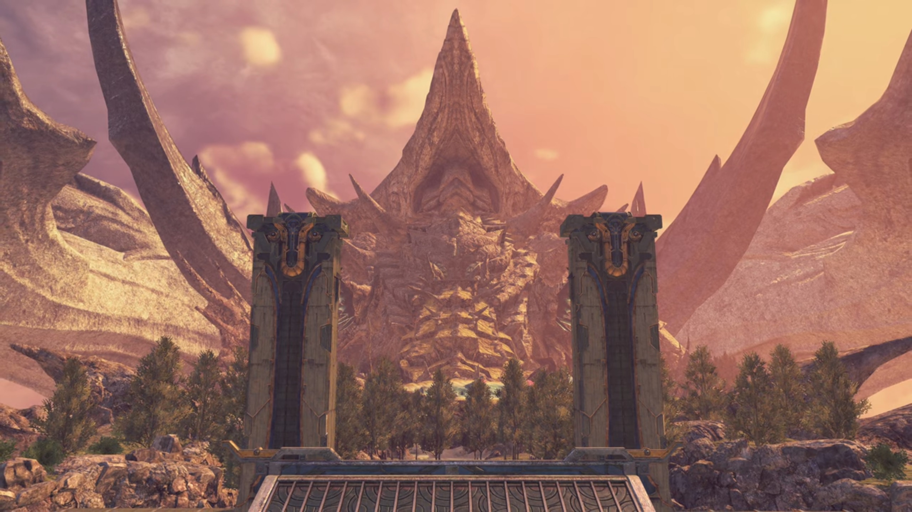

"You noticed?" Addam said. 

"What do you mean...?" Lora asked. So he knew something about it. 

"That isn't the _original form of the Tornan Titan._ In ancient times, the Tornan Titan held awesome power. Torna made use of that power to dominate Alrest for a thousand years."

> The Tornan Titan stretched its neck, the energy globules in its mouth grew larger and larger, and when it thought enough, a beam spit from the globule that swept straight in front of it, slicing through the cloud sea, then scorching the flesh of another Titan along its path. The Tornan Titan turned its head at the other giant Titans{{footnote: Giant Titans are the size of Uraya, Mor Ardain, etc. Small titans are those small fish used to carry passengers from one Titan to another; even the Emperor's flagship, that giant fish, is considered small when compared to the giant ones that hosted a city anywhere on their body.}} in front of him, redirecting the beam and swept through them, and in a single draw, 3 Titans turned into motes completely. Didn't stand a chance. 

"But the power was shut away _in the reign of Alektos the First_. Since then, the Titan has _looked like this._" He turned around and looked at the Palace, a tall building that looked like the Praetorium, the only 'skyscraper'. He nudged, "See that glowing sphere in the castle tower? That forms the seal."

At the very top of the palace was a crystal encased in a dome, with some sword-like features and spade-like features extended from the circumference of the dome. 

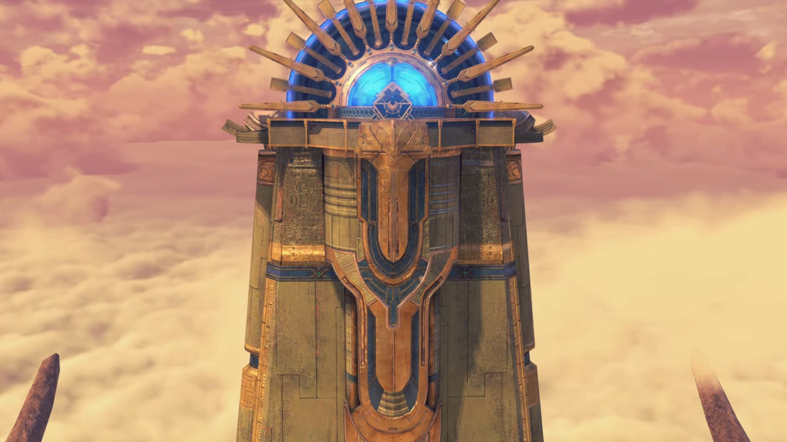

"Is that what Malos is aiming for?" Hugo wondered. He looked to him and nodded. 

"Why would he do that? Wouldn't it be a threat to him too?" Brighid wondered. 

"Truthfully, I don't know myself. **But in any case**, if he makes a move for it, it is _clear_ what we must do."

"Agreed." answered Lora. 

"You can see the palace in the distance. We should head there first, offer our report to His Majesty."

### Footnotes: