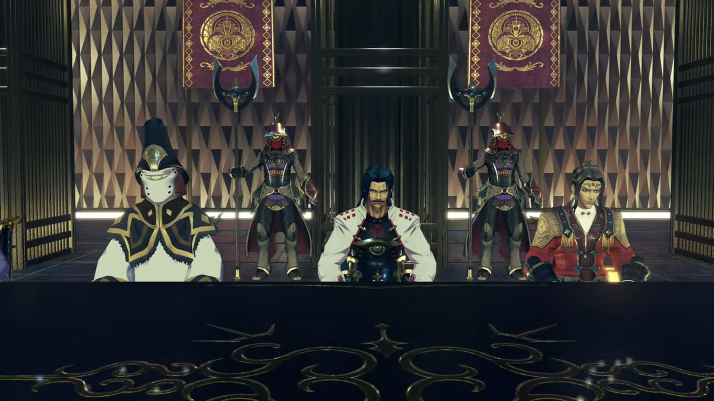
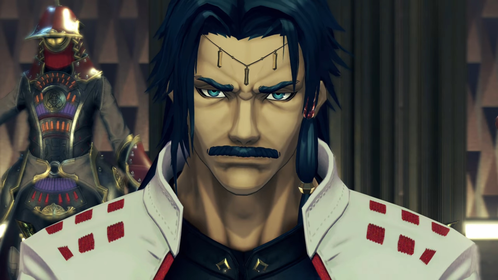
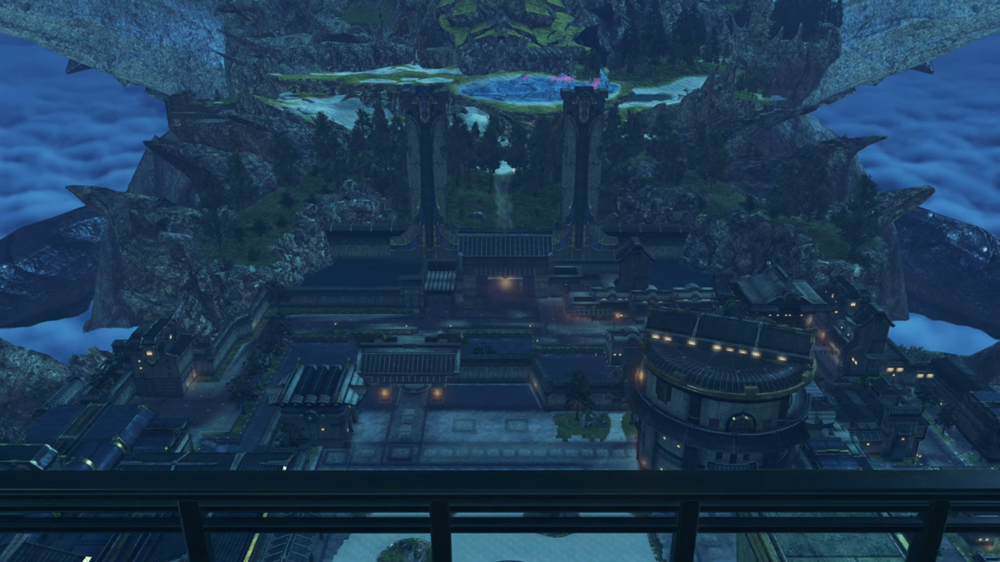
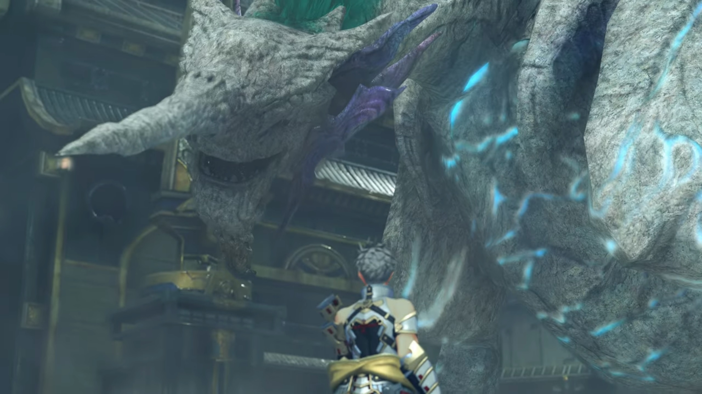

# Malos is Here

The roads and buildings looked like ancient Japan's architecture. Stairs led up to the giant door into the capital. Decorative trees and shrubs grew on the edge below the stairs. A wide moat filled with water ensured access into the capital only from the stairs. Inside the capital, the roads were wide enough for 3 horse carriages to pass. On both sides of the road, bazaars and stalls were set up. Walls separated the inner city and the outer. In the inner city, there was a garden with large boulder-like rocks half-buried into the white sands. Moving deeper you'll arrive at the castle. This is **Auresco, the Royal Capital.**

---

The long broad table, on each side, can accommodate 8. On one side sat the adults from the group, except for Aegaeon and Brighid, whom stood behind them beyond the line made of lamps installed on the ground. The kids have their own seat even nearer to the walls. On the other side of the table seated 5 people, with Tornan soldiers lined up behind the lamps installed on the ground behind them. From the group's point of view, the first seated was Amalthus, followed by a person covering his/her mouth with a constraint, wearing some metal hat and a robe mostly white except the shoulder and above the chest, made of black clothes with gold lines. In the middle sat a rather old person dressed with white long sleeves and black torso, his long black hair ran down his neck, and thick moustache and beard on his rather old looking face. Next was a younger-looking guy dressed in red, with orange-brown shoulders, and white sleeveless inside. A headband with a red crystal tightened around the center clutched around his forehead. To his right, another person dressed in red covering his/her mouth, similar to the 2nd. 

To the right of the group, metal grates prevented people from exiting to the balcony unless through the door. We could see the head of the Tornan Titan from afar. The floor was black-tiled, the pillars were dark-brown, and the walls looked like golden scales. While there were ambient yellow lights illuminating along the bottom of the walls, the room received most of its lighting from the outside. 

Everyone was quiet. 

"Malos aims for the seal?" The 3rd person spoke. 

"Yes. He draws ever closer to the capital." Hugo answered. "Leaving destruction in its wake. Our path here was littered with the wounds of his procession, my Lord."

"_Soooo..._ the Quaestor's report was true. Noble Hugo. At this time of grave peril, **you** have afforded us your trusty aid. Your due- will be our eternal thanks." He bowed, and the rest of the seated members, except the 4th, followed. Seeing himself being left out, the hesitant 4th had no choice but to bow reluctantly. 

Hugo's eyes lit up, "I'm scarcely worthy of it, Your Majesty. As the Titans breathe, I merely followed Prince Addam- against the peril we face. In truth, it is to **him**- that your kind praise is due." He looked to his right where Addam sat.

"Ahhh, the trust of the dread Ardainian throne... 'Tis a much valued gift to our young scion of _Aletta. Mark it well._" (The 4th guy, sitting directly in front of Addam, kept looking at him with great hostility. The king, speaking such words, increased his hostility towards Addam.) "_It gladdens me._"

"Your most noble honors pierce my... _unworthy heart, my Lord._" Addam don't know how to accept his gratitude, at least not the ones coming from him. 

The 4th guy could no longer suppress his hostility, interrupted, "Begging your pardon, Lord... Would that honor were the only currency in this grave business. _An armed band_ transgressed the **sacred boundaries of the capital, without regal assent. The act merits bitter punishment!**"

The king dropped his head. The 4th guy seemed not to notice, continued speaking. When he stopped, the king immediately asked,  "Suppose you that our soldiers **can subdue Malos alone?**"

The guy's iris widened, stuttered, "I... I don't..."

"_Indeed._" The king bit his words and looked at him sternly. "**The army of resistance fearlessly dashes to our nation's aid. They tremble NOT- in the face of the mightiest** of _foes. To punish them... is unthinkable._"

"**Yes, but...**"

The king raised his hand, silencing him. The 4th guy creased deeper his eyebrow, feeling more annoyed at the king's decision. The king continued, "_Zettar. What does not bend,_ only breaks. We must **suffer** to Addam his **just** bounty. I hereby enfeoff you, as Lord of Heblin."

Zettar's face went black as charcoal. 

"This is too much for me, my Lord. **First, I must busy myself** with the command of the resistance force. We _can't_ allow Malos _to take the seal._" The king nodded, agreed with his decision. Some others nodded. Amalthus closed his eyes and saidnothing. Addam continued, "I'd be much obliged if you can grant permission for the resistance to move freely within your lands, Lord."

Without hesitation, the king answered, "As you wish. Brave soldiers of Torna! Hear- your- king! Our country must make its own **sacrifice** to halt the terrible power of the Aegis!"

Amalthus answered his call, "Indol too, pledges its flesh and blood- to the cause. I humbly confess- that it was my own lack of **foresight**- which brought us to this pass." Though he did not show any emotion of guilt behind his words. 

---

Outside the castle, Minoth greeted them. 

The room was now emptied, leaving only the Emperor and Prince Zettar. The Emperor stood by the metal grates, looking at the Tornan Titan, while the Prince stood behind him, trying his hardest to suppress his agitation and anger; now that everyone's gone, he can't resist asking, 

"**My brother!** _Or rather, my Lord._ **What is your aim? Why give Heblin to Addam?**"

"**He has declined** our offer. Perhaps our _good wishes suffice._"

"**Yet still, he holds all the power!** He makes allies of **foreign** lords without **permission,** and gathers together a **fighting force...**"

"_Mhmmm..._ **Zettar,** my brother. Hear me well... This sickened world rests heavy upon my crown; I fear, too heavy for my mortal neck."

"Ma-Majesty!" Zettar's voice shook. 

"And this disorderly throne... is **more apt**- for one such as Addam."

Inside his heart, Zettar, filled with jealousy and envy and hatred, thought, "_Brother! You mean to set **my** birthright on the **caitiff's** shoulders?!_" (His eyes clenched even deeper, his hatred fully occupied his mind from anything else.)

---

"**BOOM!!!**" While they were descending the palace staircase, various explosions occurred everywhere in the city. Aegaeon looked up at the sky and recognized the source of the attacks, 

"**Majesty!** Those are..."

Hovering all over the sky of the city were Malos's artifices, launching attacks one after another randomly within the wall boundaries. After several cannon shots, they switched to machine guns, fired inch by inch as they drew lines of art with their bullets, leaving behind flames and rubble. Some descended the ground, scanning to destroy any lucky living beings whom survived the initial strike. 

"Gargoyles! Malos's Artifices!" Mythra looked to Addam, waiting for his instruction. 

"**Mythra! Let's go!**"

"Yeah!" Without waiting, they moved with Minoth. Hugo and Lora exchanged glance and nod before Hugo's team left. Milton and Mikhail ran up to Lora's team, she instructed, 

"You should... wait here." Both of them nodded. They watched as Lora's team departed after those that'd already gone far ahead. 

---

They arrived before the door exiting the inner city to the outer. There they were greeted by Malos, whom was looking at the door. Sensing their arrival, he turned around, said, "**Hello, partner.** This is a first."

Even without seeing him before, she can feel the power residing in his seemingly small body. "Malos..."

"So this is _the Aegis... Malos..._" The first time Jin saw him too. 

"He has an awesome presence." Aegaeon commented. "We would do well- to proceed with caution..."

"Agreed." answered Brighid. 

Mythra moved forward, asked, "Your MO is different this time, Malos. What are you trying to do? _If this is a joke, it's **not**- funny._"

"I got bored of it."

"Bored?"

"Letting Siren have allllll the fun got old, I mean. I want to see the humans dance. The dance of **death**, in the flames of hellfire."

"What do you...?"

"That." Before she could finish, he peered over at the top of the palace. "I know fulllll well what the Tornan Titan **truly** is. I've decided... _I'm gonna lay that truth bare, for everyone to see._"

"**MALOS!!! BASTARD!!!**" Addam was furious. 

"**Each** of the Artifices **I** command... holds ether energy that would rival even the largest Titan. **Imagine** if a **legion** of them- made it to the core of the Tornan Titan- and unleased that energy allllll at once..." He then summoned his weapon, the Monado, a sword-like weapon said to be wieldable only by Gods, which connected its hilt to its blade with a circular ring embedded with glass on its Ricasso; and when it unleashes arts, the respective kanji character would glowed within the multi-layered glass. "Our time for dancing would be **short**, _but sweet._"

"**Ugh!!**" It leaves Addam no choice but to fight. 

"You want me to stop?" Malos teased, like a strong foe enjoying someone weak challenging oneself, knowing full well that they won't succeed but would like to see them struggle{{footnote: This isn't absolute, else there won't be so many story books where the weaker protagonist won the far stronger foes.}}, trying to gain what they don't have the ability to gain. "Had enough? _Then try and make me._ **C'mon. COME AT ME!!!**" The battle thus began. 

---

"**Addam Origo!**" The duel between Malos and Addam continued. "**Heir of Torna!** Looks like that resonance- isn't just for **show**. You're too kind..." (Addam knelt on one knee, gritting his teeth hard as Malos pushed down on his sword. Malos observed,) "_Golden eyes... I thought Tornans all had **blue** eyes. You're a **bastard**, is that it?"

"My father is generous." (He still could speak even when his muscles rebel against him) "He pays no attention to things like that."

"_Hah!_ You're wrong." Malos backed away when Addam twisted his sword and slashed at him, putting his Monado over his shoulder, said, "You **don't** understand the consequences."

"**Don't I?**"

"_And you don't understand- what humans are._" He pointed his Monado at him. 

"**Malos, the all-knowing...**" He pointed his finger at him. 

"A diligent student, you could say." Malos corrected him, taking down his sword and pointed at his core crystal, tapping on it several times, signaling. 

"Then **learn this.**" Addam tucked his sword behind. 

"Huh?" Malos's smiles dimmed, became very perplexed. 

"**MYTHRA!!!**" He held out his hands to where she was. 

"**HEADS UP!!!**" She threw her sword at him. 

"**ARRRRGGGGHHH!!!**" With her sword, he slashed at him. Malos dragged a few steps back, then made a return. 

"**YARRRRGGGHHH!!!**" Lots of clashes with near misses from both sides, till Addam jumped over his head and landed behind, threw the sword into the air, which Mythra caught mid-air, then shouted,

"**Here goes!**" Now it's Mythra vs Malos. Mythra, able to command light particles to her will, move much faster than Malos could catch up with; so he stayed where he is, sensing the change of wind and the ether field in the surrounding, raising his sword to block where he predicted she would come from. 

"Gah... Nice trick. _Holds my interest at least._"

"Surprised? This- is what humans and Blades can do together." She stood between Addam and Minoth. 

"**But you- threw that away!**" Addam pointed his finger at him. All three dashed towards him while Haze raised a field.

"Urgh!" Malos felt the heavy gravity acting on every inch of his skin. He resisted it from kneeling down, but he can't easily move his limbs. Taking the advantage, the rest dashed at him from all directions. Even when he seemed like an unmovable target, he spoke calmly, "Tch. I don't need that crap. Better off without it."

Gathering enough energy within him, he released it in one shot, breaking the chains on him before swords clashed. Backfired, Haze suffered some minor injuries and temporarily cannot use her powers. After many clashes between Malos and the others, Jin launched the final attack. Malos peered into his eyes beneath his mask, then smiled. Malos pushed him back, then shouted, "**YARRRGGGHHH!!! Eat this!**" 

He released continuous shockwaves that washed against the group, fell them all except Jin to the ground; Jin bent down on one knee. They struggled to climb up; Malos's core crystal shone bright, raising his sword into the air, and the Gargoyles descended in front of him. 

"Watch humans closely, and you'll learn one thing." He walked between the Gargoyles, walked past them, then walked past the group while they were still struggling. He stopped attacking, commented, "Deep down, they wish they were dead. They kill each other like they swat flies. Running towards oblivion like blind rats. They see the divine flame of life and **piss** over it. They're genius at that." (Their eyes followed him until Malos stopped walking behind them.) "In a class allllll of their own, really."

"_Malos._" 

"Oh... That flame- is **wasted** on them. So I... _I want to give them a little **push** in the right direction._ As the _benevolent servant of our... 'wise dad' should..._"

"**Huh!**" Lora heard and saw a Gargoyle drifted past the top of their heads, and Malos disappeared before her eyes. 

While Malos rode the Gargoyle to the top of the castle, he shouted at the group, "**Here, keep yourselves entertained.** _I'll go get what I came for._" The other Gargoyles have them surrounded, and another round thus begun. 

---

"Addam." Hugo shouted. They were surrounded by Gargoyles. 

"**Yes, I know.**" Everyone formed a circle with their backs on each other. The Gargoyle in front of Jin and Lora step forth, prepared to claw at them when a fireball blew it into pieces. Then, a giant shadow soared the air behind the smoke it expelled, too quick for them to realize what figure it was. There was a siren it bellowed as it roamed the sky, signaling its return. 

It made a comeback and slowed itself down; we could make do a dragon-like Titan with green and gray scales and indigo wings, and a horn protruding on its head like that of a unicorn. When its back feet touches the ground, it concentrated its whole body weight's force, slammed down, which brought its head like a hammer straight at a Gargoyle that hadn't yet moved in front of it. 

"**Nuncle!**" Addam smiled. 

"Get on! We'll hunt him down!" It urged. 

"**At- once!**" He and Mythra, Jin and Lora boarded the Titan's back, leaving the rest to deal with the other Gargoyles while they soared up to the top of the palace. 

But the Gargoyles attacking from the air weren't going to go easy on them. Several beams were shot at them, which nuncle adeptly dodged, sensing where it'll hit in advance. Though such evasive track he flew were rough to the people standing behind its back; Mythra had to sit herself down, while the rest lowered their center of gravity. 

"Over there! Malos!" They were close enough for Lora to see him. On his hand, they saw a crystal ball he held. He sensed them incoming, turned his head and grinned, 

"**Too slow!** It's already mine."

"Malos." She gritted her teeth. 

"The looks _on your faces!_" He teased, pointing his finger at them. Then he rubbed his chin. What would he do with the crystal? "_Huh..._ Well, **that settles** it."

With a wide grin, he raised the crystal high above his head, looking up at the sky, while the group clutched tight onto their heart. Is this the end of it? Had what they done been useless?

After a while, he said, "The end of the world is **postponed** a little, folks." (He slowly lowered the crystal.) "If you want to take this off me, come find me in the Titan's core. That'll _be the finale_."

"Is this a game to you?" Mythra asked anxiously. 

To which he gingerly laughed out loud, "Yeah, it's a game. An easy cure for the tedium... of being." He juggled the crystal from his right hand to his left, then to his right. Mythra don't know what to say. Malos signed off, "**See ya later, partner.**"

On the edge of the platform, he turned around and let his back faced the emptiness, tilted his body backwards until he fell off the platform, opening up his arms and felt the wind brushing past his skin, enjoying himself. Nuncle had just finished the circuit and made a comeback, a fireball gathering on his mouth which he fired at the descending villain. But before it could hit, a Gargoyle flew past and caught him; the fireball went straight for the ground below. 

Nuncle changed direction and went after the Gargoyle. Malos now sat on the back, turned his head around and shouted, "**Don't be late!**" before disappearing, several other Gargoyles firing red particle beams that crossed each other and made a net, preventing them from advancing further, at least for the moment, just to buy him some time. 

---

Fires were still raging atop the buildings and on the ground. Some buildings had been burnt to rubble. The air was so thick with soot that people choked when they were outside. Even so, neighbors and friends gathered outside to see the villains gone; they consoled each other, especially those that'd lost their loved ones forever. Soldiers were dashing around to help wherever they could; too many places needs a helping hand. 

Nuncle had descended in front of the Palace, dropped them to a slightly elevated platform on the garden with sand and half-buried boulders. He apologized, "_Sorry, I let him escape._"

Addam felt glad, "No, thank you... You saved us."

"You owe me one then." He then turned his head to the one wearing a mask, immediately recognized, "It's been 80 years, hasn't it, Jin?"

"You- know me?"

"You- and Ornelia used to ride on my back. We used to have a lark, flying about."

"_Ornelia..._ From the photograph?" His Driver recalled; their eyes met. 

"And I suppose- she's your- Driver now?"

She introduced herself, "My name is Lora. I've been with Jin for 17 years already."

"I never... You were fortunate to be picked up by her, Jin." Their eyes met again. 

The others had just finished up their fighting job and had entered the garden, gathering around them. Addam looked around at the busy troops and called out, "Nuncle... We're just in the way here. Perhaps we should leave it to the soldiers and just go."

"Yes, let's do that. Shall we head for the Tornan womb?"

"Yes. I'd say we're _bound to._"

"The Tornan womb?" Lora wondered where is that.

"**Perhaps**- I should go first." Nuncle suggested. The ground shook as he prepared to take off. 

"Please, go ahead. We will join you once we've made a report to the king."

### Footnotes: