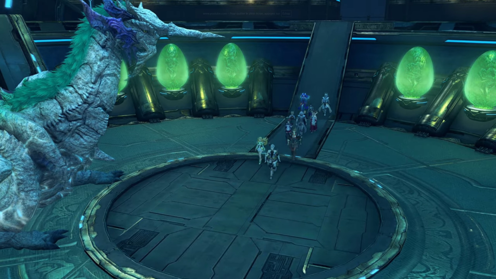
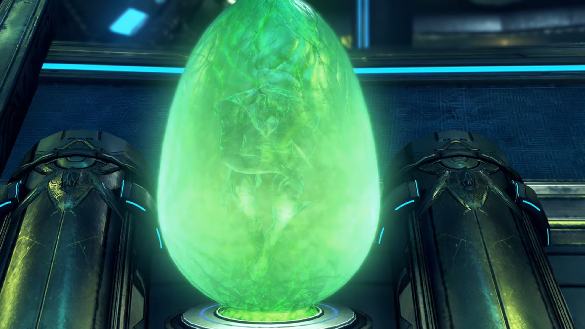
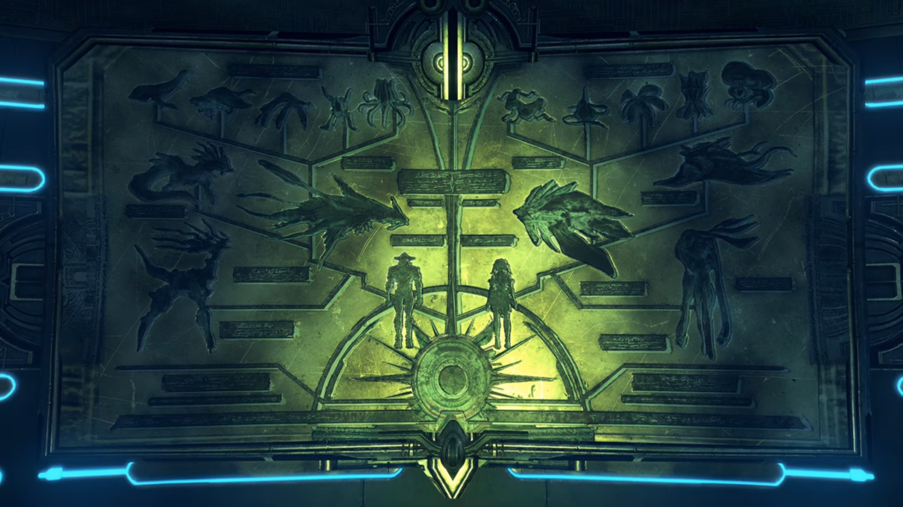

# The Peace Before the Storm

"**What good was your militia?**" Zettar kept bragging about it. He, someone living the political life, had been waiting for this moment, the moment when his political rival made a mistake and he could attack it from all angles. And now's his chance. "They could not halt Malos, **noooor even... safeguard the seal** from his clutches."

"I have no excuses." Addam refused to argue, dropped his head.  

"Addam..." Lora can feel what heavy burdens he carried alone; and yet other people don't understand. They just want to forward their agenda. For that she felt heart hurt. He was someone that always kept a smile on his face, and to withstand such accuses he put up, sincerely, a sad one. For that she felt compassionate for him. And he hated politics; still he sat here to report, and all he get was blame? Was passing all the responsibilities to him? Was excusing that all is his fault? 

"_Hrmph_." A retaliating attack would be easier for him; how he wished Addam would speak for himself; in that case, he wouldn't felt like an attack on a sponge, all absorbed without knowing if he had done any damage or not. Zettar turned his attention to "Majesty. This is a **deep**- dishonor. I **beseech** you to **lay them low**, that the people may **have faith in government!**"

Ever since Zettar started talking (that's from the very beginning of the meeting), the king not only kept quiet, but kept his eyes closed, waiting for the imminent argument to end perhaps; but whatever exchanged, he spoke not a word, made not an action, moved not a bit. He immersed fully in his thought; he had some pressing matters he had to reflect on, and perhaps he found that a good time to reflect, while he was busy passing the buck. Even when Zettar called out to him, he remained unmoved; but Zettar wasn't so patient, he therefore raised his voice, "**Majesty!**"

Now that he knew everyone's attention were on him and that he could no longer kept quiet, he opened his eyes, started with, "Brother, your advice is wise."

Jin tightened his eyelids. Hugo thought he might repeal, "Your Majesty..."

Lora couldn't kept at it; she couldn't let her friend get bullied after all of what he'd done to protect the city. She saw it; he'd give the best he could. She wanted to help him, to lighten his burden, "Please, wait a moment. Addam only sought to protect your realm."

Zettar can't believe these flies were disrupting his chance to bring him down, snarled and hissed and growled at her, "**SILENCE!!! IS YOUR VOICE MORE IMPORTANT THAN THE KING'S?!!!**" She can't deny. She dropped her head. No one else spoke a thing. Zettar grinned. What he wanted would come to bear fruit now. Oh, the throne, the seat, he could already felt the touch sitting on it, rubbing against its handle, and seeing the bastard knelt before him, calling him 'Your Majesty', and he give commands and people replied, 'Yes, Your Majesty.' His future held bright! 

"But what of **you**, _Zettar?_" All his dream gone, extinguished like water being poured onto a flame that hadn't started burning. Immediately it hissed and released lots of smoke. But he don't understand, "What of me?"

"Look first to your-**self**, I bid you."

His mind tried to fathom, "W-what do you mean...?" but to no avail. Did he not done his best to suppress his enemy, the bastard? And is that not enough? 

"**Surely**, Addam sailed the ship into a rocky reef. But **if he were the bow**, _you_- were the stern."

"Y-Y-Your Majesty, those are bitter words. It was Addam's vanguard that let slip **Malos**!"

He asked, "Would our army have succeeded with _certainty_, brother? In the hour of need, where were they?"

"W-W-We set the defense of the **people** as our **highest goal,** Your Majesty." He convinced himself. "Our soldiers guided **the townsfolk to safety!**" Mm. He nodded to himself. 

"While Addam's militia flew, **though rashly, into the breach.** And the brave dragoons of noble Hugo **wagered their lives as mere _trifles_ for our nation's sake.**"

"_But-but-but-... I..._"

"**It unfolded thus.**" The king refused to hear any more excuses from him and his inaction.  "**If honor took its natural course, the sons of Torna should have stood their ground.**"

"Ngh..." Honor? We people of Torna, the highest class among Alrest, to do the filthy job of defending ourselves? We should be the ones standing behind the back and let the cannon fodder -- the soldiers of other nations and the militia of Addam -- to protect them at all cost. After all, is that not why they were here, to act as a moat protecting the ruling class? Is that not their job, as meat shield to be sacrificed and kept alive the higher ones? What are you even thinking, my brother, caring for these useless filth? 

"Mark their honor above their frailty. You saw the battle with your own eyes, _did you not, my brother?_"

"I- I did..." That he cannot deny; outside, the flames weren't yet extinguished; some were still burning, and people were still working at it. Just a few minutes rage and the damage was beyond reparation. Can't believe if he'd stayed a little longer, would the whole city have evaporated to nothingness? 

"**And how did you think it?**"

"_W-words can scarcely_ describe it." He emitted fear in his tone. "_It was unlike any mere **human** struggle. I fear I could not report it justly._"

"_Indeed, brother._"

"Hm?"

"It was a fight beyond our **ken.** I too saw it with my own eyes. Our Tornan crafts of war would have been **doubly doomed** against Malos."

"**That's...**" Zettar had never thought about warring with Malos. His mind was and is preoccupied by his internal battle with Addam; his opponent had never been Malos, it's only Addam, the threat to his throne. He also assume that the country would be in good shape no matter what came into the way -- Torna was too strong to be fell. 

"Is it not **folly** to assume- that our army could do what Addam's could not?"

"Your Majesty..." The responsibility that Addam shouldered was too heavy. He humbly wished the king stop praising him. 

"Urgh irgh..." Zetter unwillingly dropped his head; another lost war against the bastard. A good opportunity to take down his opponent, but he played the wrong cards, he presume. 

"Noble Hugo... My brother forgets grace and gratitude. _Our nation-_ hangs over doom like a **ripened** fruit. You and yours- are our final ray of hope. Will you offer us _aid again_, to avenge ourselves on the **Aegis**?" He bowed, and the rest seated in front of them followed; even Zettar didn't hesitate this time. 

"We came with that very intention, Your Majesty." (He turned his head and asked,) "Didn't we, Prince Addam?"

"**Yes.**" (Then turned his head to) "**Majesty.**" (The king raised his head and looked at him.) "**If it must be so, I will expend my life** for the future of the land of my forefathers." (The king nodded in acceptance.)

Then, the king turned his attention onto her. He never had the chance to speak with her, and he thought now might be the time. "While we're here, your name is Lora, is it not?"

"Uh, me? _Y-yes!_" What's with her? 

"Your work impressed me **deeply**."

She shook her head, humbly denied, "Noooo... I..."

"Yet **you** are no knight, bear no **peerage**..."

Her anxiety dimmed down, and she could now converse with ease and confidence, "Yes... I'm from a settlement in the distant borderlands. I serve... with a mercenary band."

"I knew you for a warrior." (He looked down and thought for a while, before looking back at her) "Good Lora. I would like to recognize your valiant labors. The title of knight of the realm... It is yours, _if you would accept it._"

Her eyes widened in disbelieve, "**Me? A knight?**" The king gently nodded. 

Addam felt more happy for her than she herself, "**Lora! My congratulations!**" The others smiled at her, waiting for her decision. 

"_I can hardly believe it... Me?_"

Addam urged, "**Come now!** A title is a _mere decoration._ Surely you learn that _from me._"

Hugo wished, "I... hope it will raise _your spirits- a little, Lora._"

She had approval, but she needed the approval of the one she held most dear. She turned to her left. He was as emotionless as usual; feeling her sight landing on him, he turned and looked at her eyes. Before any decisions could be made, the king said, 

"_Humble Lora_. I have a request _I must make of you._ This day, the people of our nation **shiver** in the **darkest** of **shadows, cast** by _mighty Malos._ **But I bid that** you seed a flower of **hope** in this _shadow-mired land._"

She turned to her right, everyone nodded back to her. "I hope that I can," she don't really believe in herself; but he might be able to give her a choice. She turned to him, and they looked attentively into each other eyes for a moment, and he finally gave the nod she needed. Suddenly, she was teeming with confidence; her eyes unwavering, she glanced at the king, said, "Your Majesty... I'll do my best."

"Well spoken, brave Lora. **We shall annoint thee as Lady Lora tomorrow in the plaza**- before the palace!"

---

The entered the Tornan womb and found nuncle. There was a circular ring in the center, to which nuncle stood right outside it. Around the larger outer circumference, green acid-colored egg-like pods were mounted on some pedestals, with green fluid submerging some creatures within it. 

Lora, full of curiosity, observed her surrounding and exclaimed, "What an incredible place..."

"It's the matrix of our Titan." Addam explained. 

"What does...?"

"**When**- the time- comes, **this** is where **Blades** come to be reborn as Titans."

"**Huh!**"

"You mean we'll all become **Titans** some day?" Brighid never knew that. Addam nodded. 

"It's nice to be here again." Nuncle said. "After eight- hundred years."

"Were you born here too, Azurda?" Haze was curious. 

"Mhm! After all, I was a Blade... born from... the Tornan Titan. **Of course**, I don't have any- _memories_ of that time...{{footnote: Ignore any inconsistencies with the main story where Brighid may have wrote this down in her journal and she may read it before they visited the Tornan womb once again; and that Azurda never mentioned it to Rex nor said it clearly how he was born and that he knew this place very clearly; at least he doesn't show it to him, nor share it with him.}}" (He glanced to the drawings on one side of the wall, showing the evolution of Blades and Titans, said) "Once a Blade becomes a Titan, they can live- without being bound to the Driver- who awoke them. One day, they may come- to watch over their children, as the very- ground- beneath their feet."

"And the fleeting bonds- _become eternal._" Addam finished. "It's the basis of the _Tornan creed._"

"Eternal bonds..." Such words brought Jin back to the words he'd written down in his diary in the era of Ornelia. Nobody else noticed. 

"So... What now?" Hugo asked. 

"Malos said he was going to wait..." Brighid repeated the known info. 

"But can we really believe him?" Aegaeon doubted. 

"**I don't** think he lied." Mythra answered. 

"Why so?" Jin asked for the group. 

"He was enjoying himself. That's why. I'd say... _he's having waaaaaaay too much fun to stop right now._"

"He said that **humans**... long for death." Minoth recalled. 

"And that he was happy to oblige." Lora finished. 

Jin scoffed, "Benevolent servant... Tck..."

"Mm..." Mythra don't know what to say, nor do we know what she was thinking about. 

---

In their room, Jin was writing on his diary again. Ever since he'd picked up his old diary, he couldn't help but write down what he was thinking every day, what they were doing together, what moments he enjoyed, etc. Lora sat on the bad behind him, turning around a red rope similar to the ones she'd made her mother years ago. 

Then she looked up. She smiled when she looked at his background, the guy that had provided her with security and safety. 

"Hey, Jin."

He put down his pen and slowly turned around to face her; she waited then continued, "That mask... You don't need it anymore."

He'd put it down on the table where he's writing. He reached out and picked it up, agreed, "Yeah... Since you're a knight of Torna now. There's no danger of getting in trouble- for resonating with a stolen core."

"_What should we do? With that..._"

"Nothing, I think... I think I'll keep wearing it... Y-You went to... allllll the trouble of making it for me." He put it down. 

"_Yeah._" Her eyes flickered; she looked down on her bottom left. Those were difficult times, but their adventures closed in their distance, physical and mental, mind and heart; and their memories together? They were precious. 

"_I mean..._" She felt somewhat uneasy. 

"Huh?"

"Someday, I'll die. And just like that, you'll return to your crystal." (She tried to kept her voice calm) "Even if you forget everybody, at least you might... be able to keep the mask that I made you..."

"Lora..."

Her excitement suddenly rose, she reassured him, "**But... I imagine that day's still a long way off.** So don't worry." And she went back to meddle with the rope. Where her mind laid, we don't know; perhaps she was strong on the outside, but inside? 

Jin probably felt it; he dropped his head and recalled the last few sentences he wrote on his diary when he was Ornelia's partner. Suddenly, he felt he could understand why _he_ wrote it on that day. Perhaps _she_ was just like Lora today. Perhaps she wished he'd remembered her, so they took a photo. The words were strong, but he could no longer resonate with it, without the familiarity and the association of the past. Perhaps she tried so hard for him to remember her, and he now understood he could never understand what _he_ used to feel. But he had a choice, for _he_ gave him a choice: 

> _If I were a praying man, I'd pray this journal finds its way to you. Trusting that it will, I will use these last words... to pass down... a means of carving the bond between myself and my partner into this flesh. This is how it is done._

**GASP!!!** He took in a deep breathe, as if he'd awaken from a nightmare. He focused his attention on the girl in front of him; she, deep in her thought, didn't notice his actions. Just thinking of doing what he wrote to this girl? It's unbelievable. No, he could never do it. But... what if? He shook his head hard; no, no no no, no no no no. He would never do it. Get out of me. Don't bother me right now. 

He could feel her warmth, even as they sat some distance away. The tranquility in the room, just being in each other's presence is all they need. And that he felt grateful of. 

At least for now. 

---

The group gathered on the elevated platform where Azurda dropped them off the day before. The inhabitants of Torna gathered behind them, witnessing the ceremony. Lora stood as straight as a trunk in the middle, with Jin standing to her 5 o'clock. Step by step, Addam walked towards her, holding onto the crest with his fingers. He stopped half an arm length in front of her, attached the crest on the ring on her armor in front of her chest. It clicked, and every inhabitants immediately clapped with joy. She turned herself around, showing off her new crest. Jin turned around with her, and they understood he was her Blade. She looked down on her new crest, carefully caressed it, felt a strong responsibility she held, and then announced, 

"So, I'm officially a Tornan Driver now." She looked up at the sky, still filled with disbelieve, then turned to her partner, smiled and said to him, 

"OK... Let's make some memories!"

---

Not everyone were happy. Outside the circle formed by the inhabitants, near the walls of the palace, Prince Zettar, accompanied by Amalthus, watched the knighting in frustration. Amalthus added fuel to the raging fire, speaking as if he's not the center of attention, that he was just a narrator, 

"Addam's star is rising; It seems that the people love him."

"Hmph!... And naught but the fruit of the king's **whimsy** and an **obscure woman...**"

"Ahhh..."

Amalthus turned to him; Zettar eyed Addam, whom was happily giving his speech to the fellow inhabitants, felt a strong envy,

"_Yet if only he were not the Driver of the Aegis..._"

"You'd each have your **just share** of dignity." Amalthus voiced echoed within Zettar. 

> On the long table in front of Zettar placed Mythra's Core Crystal. Addam stood to his 4 o'clock, waiting for his turn. 2 people stood beside Zettar, and seated to each side of the table were the king and Amalthus. 
> 
> He didn't put his hand immediately on it. He felt his hands sweating, his heart pumping, his pores palpitating. This is the moment he would change his life forever. This is the moment he would be congratulated by everyone else, for being the driver of an Aegis. He could not wait, but what if? He tried calming himself down by taking a few deep breathe. Then, he slowly reached out for the crystal, slowly by slowly, until they came in contact and the crystal glowed brightly. 
> 
> He grinned, smiled, gaped, awed, shocked, then pfft... smoke blew right through his chest. His hand still sticking out, his mind thinking before he collapsed, 
> 
> 'But why?'
> 
> The Core Crystal dimmed; Amalthus closed his eyes in disappointment. The king gaped for a while, sighed, and closed his eyes, not wanting to look any longer at the scene. Addam bent down to check on Zettar; still breathing. Just unconscious. 

Zettar asked, "Quaestor, is it really true _that..._"

He can read his mind, "Certainly, I- did- give- life- to Malos... _but- when he acts..._" (He looked up at the sky, confirmed,) "It's divine will."

"The **destruction of the world** is the will of the divine?"

"Indeed it is." (He turned to him, convincing him that) "Malos **is** the instrument of destruction. _Making the Architect's will **immanent** takes **many** able hands._"

His eyebrow creased deeper. He wondered, can he really know what the one sitting atop the World Tree is thinking? Perhaps; after all, he's the only one that climbed the World Tree. 

---

The platform in the Tornan womb had descended into a pit, and Azurda had been sleeping in it. A crystal on top of him glowed bright blue, illuminating the room. On one side of the room, there was a giant crystal the shape of magnifying glass aiming at the ceiling, glowing pale blue in its center and ocean blue on its edge. The pods were also descended into the pit. 

"It may be this is exactly what they wanted. **Become** Titans, have a longer life with humans..." Jin stood inside the pit beside Azurda, commented. He'd came alone. 

"Hm hm hm..."

"Huh?" Why did Azurda laughed? 

"Ohhh, nothing. I was just remembering the **previous** time... you said that."

"I did?"

"My reply was, 'how about you?'... And what do you think you said?" His eyes, looking at the other side, he slowly swung his neck around to look at him. 

"Uh..." He closed his eyes, reconnecting with the hidden voice inside him for a moment before sincerely answered, "I don't wish for 'forever'. All I want... is my life with her. That's plenty."

"Ahhh... Spoken- like a- **true** Blade. _No one can begrudge you that._" He looked away. 

"I wonder how it was for you..."

"Well, honestly... _I suppose I may well have been- just like you, Jin. Still..._"

"Still?"

"Being like this _isn't so bad either._ After some years, or- centuries, you find yourself ready- for- new relationships. I came to realize that." 

"New relationships..." Jin looked down, deep in thoughts. Did he really want a new relationship? He don't know. 

---

"Malos is heading for Torna's core." Addam announced as they gathered outside their inn. "In the **original** configuration, the core is in the Titan's thorax."

"But- the- Titan hasn't shown signs of transforming yet..." Hugo noted. 

Minoth wondered, "You think the Aegis is taking... a nap, or something?"

"That would be fortunate for us." He turned his head around and look at where the Thorax was; the same direction Mythra looked out at when they first arrived at the city, and they could also see it from the top of the palace behind the bars where they met the king. 

"That mountain ridge makes up the upper body. That's where the core should appear... It will take some time before the troops are organized. Let us go on ahead. We depart in the morning." The rest agreed. 

---

They gathered inside one of the room at their inn. They put the kids in the middle of the circle, like they're facing interrogation. 

"**This sucks!**" Milton exclaimed. "**House-sitting in the capital? I wanna go with you!**"

Mikhail put his hands behind his head, lightheartedly sighed, "Here we go... Way lame..."

Addam was serious. "The battle ahead- is unlike **any** we've known before. **Please** remember that."

Milton, desperate to search for an ally, turned to "**Jin, can't you tell them? I swear, we won't get in the way!**" Tears began to overflow the tip of his eyes. Mikhail's attention turned to him, wondered if he would speak for them. 

"N-No. In this battle, you'd be a distraction." He had to tell the truth. Despite what he wished to say, he had to force his heart cold. It's for the best of them. 

"**URGH!!!**"

"One way to put it..." Mikhail can't deny. 

"Milton, you'll be a great help to Addam- **if**- you stay in the capital."

"Kh krch..." But he can't listen. He cried and cried and cried, feeling betrayed by the adults just because he's a child. 

"C'mon. Don't you get it?" Mythra walked towards him. "You're not hearing them." Nobody's sticking the cold knife into them; she'll have to be the one that does it. It'll have to be her, being his 'bestie', that have to tell him the truth, to force him to understand. 

He turned to her. Jin turned to her. She bluntly spoke, "OK? You'd be **no** help- on the battlefield. In fact, protecting you from Malos would take all my energy. **But**, _hey._ I mean, if you stay here and keep Mikhail out of trouble, we'll be able to fight the way we should."

The other adults kept quiet, letting her do the talking. Perhaps this is the only way to get through his stubbornness. If they can convince him to stay behind, whatever's the method, they'd be glad. "**That's** what they're saying." she finished. 

"_I don't need looking after._" Mikhail quietly rebutted; but when he felt some pricking eyesight landed on him, he felt as if she pierced him a thousand times; in defense, he jumped back and cried out, "**Uwaaaa....**"

"See?" She 'proved' that he needed to look after. 

"You understand, don't you?" Jin added. "What you need to do... to help Addam."

"Hr hr hr hr hr..." He tried to restrain the air from blowing out of his nose, but the tighter he held, the stronger the urge to puff them out. He therefore took a few deep breathe, hoping the warm air would clear his nostrils; but he can't control his tears from continually leaking. He turned to Jin, asked him a favor, "Make me a promise. That you'll **kill Malos! And bring Addam back no matter what!**" Their eyes met. 

"Yeah, I promise." He answered without hesitation. 

Mythra was glad he abided. "**Great. Then we each know what we have to do.**" Without the parcel, she could go all out later, without having to think about his safety. Surely, far from the battlefield, in the capital, he'll be safe, right? 

We don't know. But for the moment, everyone agreed with their assigned roles. Even Milton. 

He turned to her and nodded strongly. 

---

At the common room, there were tables placed, but nobody else was there except Jin, whom took a seat at a small table and was writing away with his feather pen, the ink illuminated only by the soft orange light emitted from the ether lamp placed in the middle of the table. 

"Hmmm. Surprisingly **diligent.**" Mythra walked up to him, bringing with her a cup of tea, laid it down on the table as she sat herself in front of him. 

Without raising his head, nor putting down his pen, he asked, "You need some help?"

"Naaaaah. Just... killing time." 

"**If you want to talk,** I'm not sure I'm your guy."

She observed his face for a moment, then her attention traced his as she laid eyes on his writing, and commented, "Keeping a journal, huh? Brighid's into it too. Is that like a thing now?"

"Who knows?" He put down his pen. "**_I am what I am, and so is she._**"

"You know when your Driver dies, _you'll return to your core._ It feels kinda futile." She looked away, with a thin blush on her cheeks. But he knew what she meant. 

"There's _nothing_ strange... about wanting to know **who** you used to be, once you reawaken."

"You can't be sure you'll even find it though, right?"

"Even so..." (Mythra looked back at him, wondered what he had to say.) "Nothing's for certain, but it's some hope at least. That's a Blade's lot." After all, whom would had led him to find the diary he'd written when he was with Ornelia? 

"But, what's the point?"

"To keep the bond with your Driver alive." That he had no doubt about. 

"_The bond...?_" Mythra don't yet understand. 

"I guess... that's a little- _difficult_ for you to understand."

"**Hey**, don't be mean." She folded her arms. "You make it sound like I have no heart."

"_Ungh..._" He thought hard. How do you put it in clear sentences? 

"_What?_"

"What I meant was... The true connection that's meant for you... I don't think you'll find it here." That's the best he could put it. 

She was perplexed, "But, _Addam's my Driver..._"

"Sure, he is, but I feel it's _not the same, somehow._"

"**Huh?**"

"Your real affinity lies in the future, **no**t in the time we're in now. I just feel that in my bones. Call it... Blade's intuition."

"Sounds kinda vague." She bent forward, focused her attention on the circumference of the cup, while tracing her finger along it, making circles. 

"To change the subject, thanks for before."

She looked up at him, asked, "For what?"

"I didn't expect it..."

"You were both so _hopeless with the kids._ So hopeless _I couldn't just watch._" So she intervened; but she believed what she did was right. And that's for the best of their santé. 

"Huh!... I'll consider myself told..." He looked to the side as he commented. 

---

The king and Zettar, plus the soldiers, watched as they walked round the corner of the street from the edge of the Castle, separated by a moat. As they walked past a T-junction, Milton was dashing at maximum speed towards them from their right, Mikhail trailing behind. They didn't heard him, didn't noticed. Once they reached the T-junction, they stopped, looking at the background of the group as they continued on their journey. Mythra seemed to sense their existence, turned around and looked at them. She saw his tears gathering on the tip of his eyes; she put up a smile and nodded. 

He nodded. A promise is a promise, and he'll keep it. Mikhail too. He promise he'll take care of Milton while they waited for them to bring back the good news. Knowing they're in good hands, she turned around and caught up with the group, free of burden. 

### Footnotes: